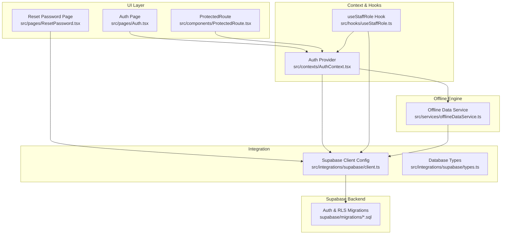
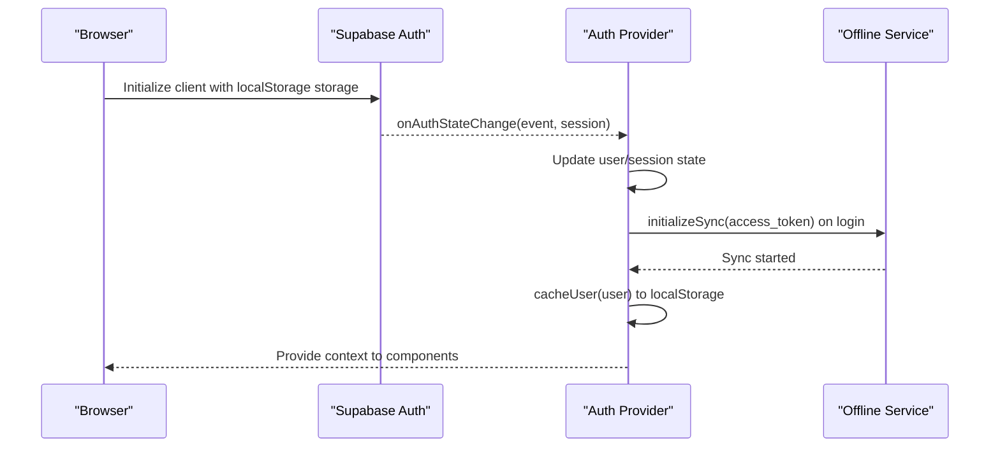
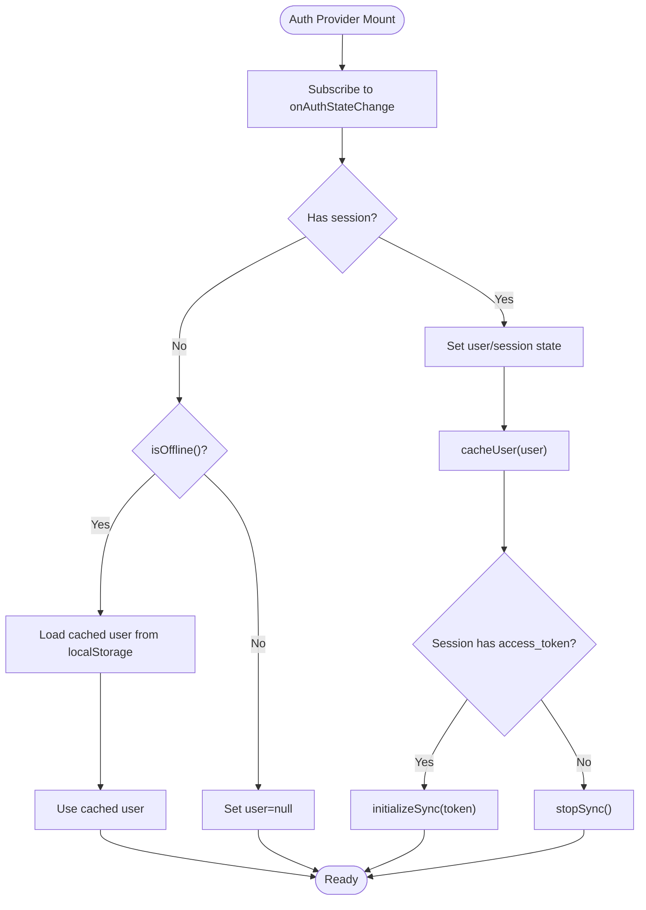
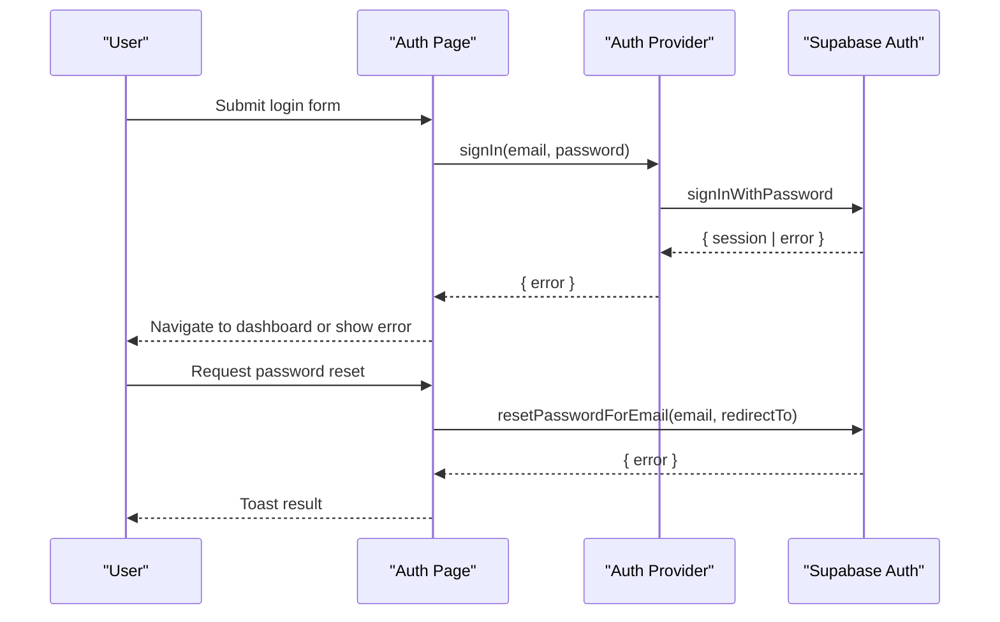
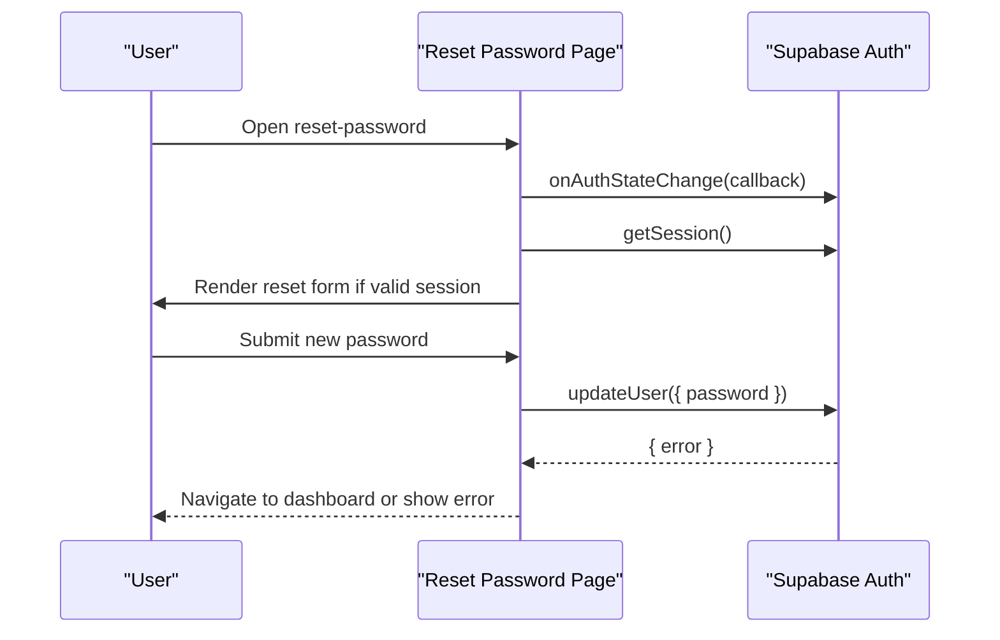
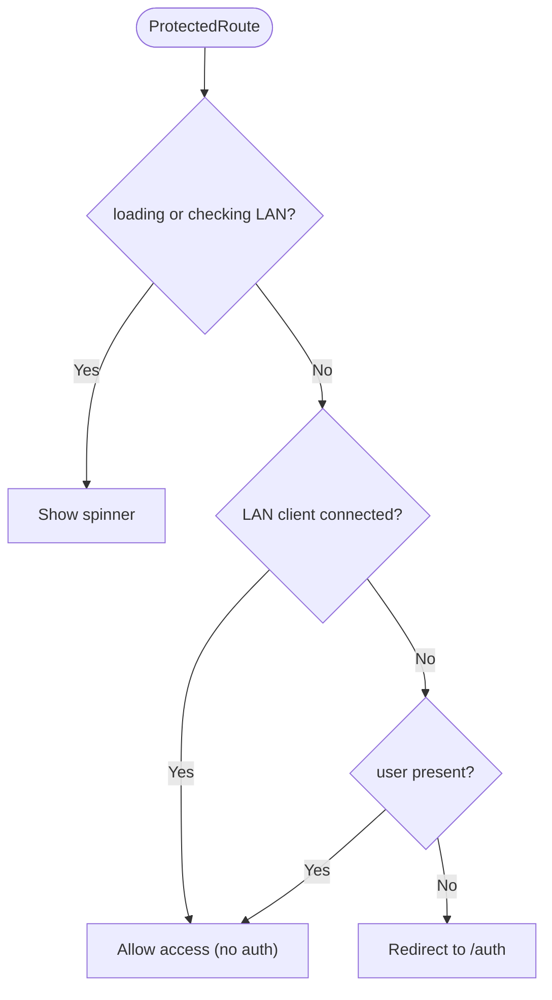
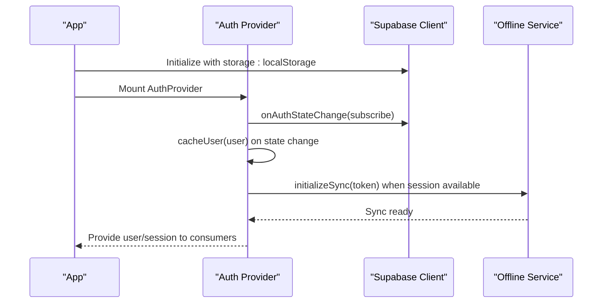
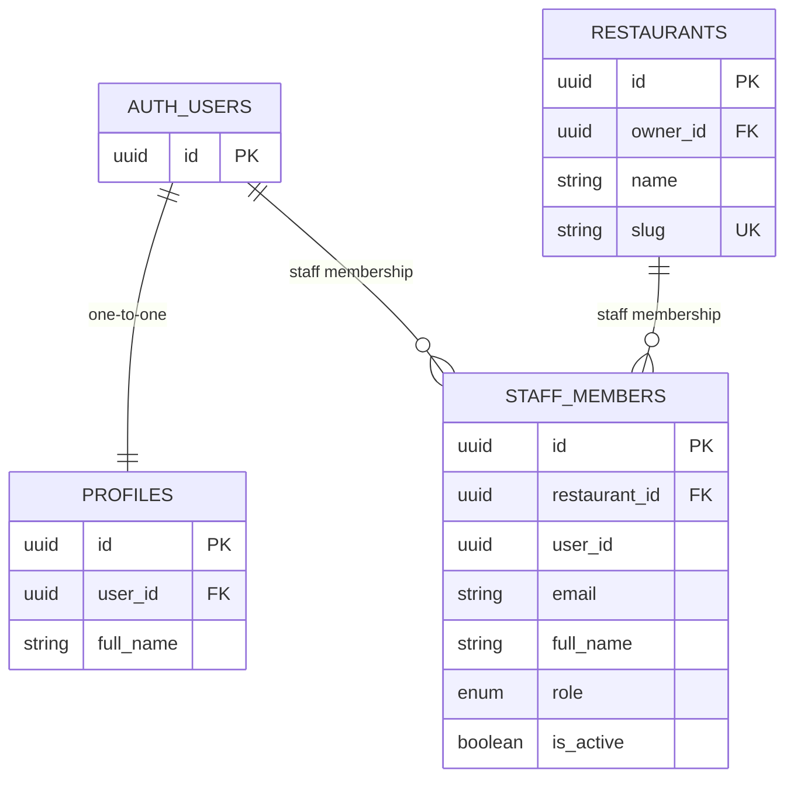
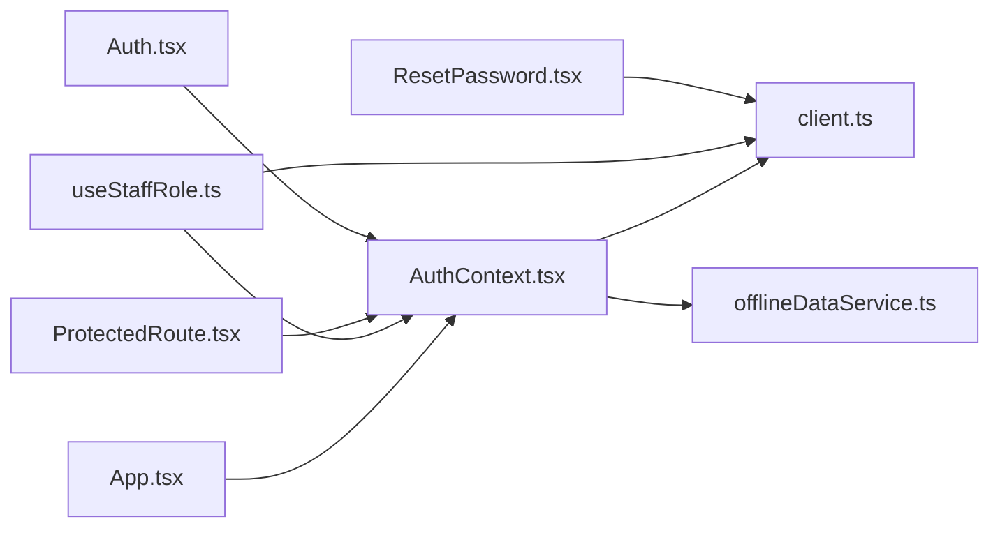

# Authentication & User Management

<cite>
**Referenced Files in This Document**
- [AuthContext.tsx](file://src/contexts/AuthContext.tsx)
- [client.ts](file://src/integrations/supabase/client.ts)
- [Auth.tsx](file://src/pages/Auth.tsx)
- [ResetPassword.tsx](file://src/pages/ResetPassword.tsx)
- [ProtectedRoute.tsx](file://src/components/ProtectedRoute.tsx)
- [useStaffRole.ts](file://src/hooks/useStaffRole.ts)
- [offlineDataService.ts](file://src/services/offlineDataService.ts)
- [App.tsx](file://src/App.tsx)
- [20251206042902_fc2b1d91-eb8e-4750-90c3-95b7e0feb6ba.sql](file://supabase/migrations/20251206042902_fc2b1d91-eb8e-4750-90c3-95b7e0feb6ba.sql)
- [20251206133509_50399ee0-7c3e-4927-bf1a-00556ef24c8c.sql](file://supabase/migrations/20251206133509_50399ee0-7c3e-4927-bf1a-00556ef24c8c.sql)
- [types.ts](file://src/integrations/supabase/types.ts)
</cite>

## Table of Contents
1. [Introduction](#introduction)
2. [Project Structure](#project-structure)
3. [Core Components](#core-components)
4. [Architecture Overview](#architecture-overview)
5. [Detailed Component Analysis](#detailed-component-analysis)
6. [Dependency Analysis](#dependency-analysis)
7. [Performance Considerations](#performance-considerations)
8. [Troubleshooting Guide](#troubleshooting-guide)
9. [Conclusion](#conclusion)

## Introduction
This document explains the authentication and user management system for TableFlow Pro. It covers Supabase-based authentication, session management, offline-first patterns, role-based access control (RBAC), protected routes, and practical usage of authentication hooks. It also documents password reset flows, session persistence, and security considerations.

## Project Structure
Authentication spans several layers:
- Supabase client configuration and real-time publication setup
- Auth provider managing user/session state and offline caching
- UI pages for login/signup and password reset
- Protected route wrapper enforcing authentication and LAN mode exceptions
- Hooks for staff role resolution and RBAC decisions
- Offline data service enabling offline-first behavior and sync orchestration

**Diagram sources**
- [Auth.tsx:1-224](file://src/pages/Auth.tsx#L1-L224)
- [ResetPassword.tsx:1-154](file://src/pages/ResetPassword.tsx#L1-L154)
- [ProtectedRoute.tsx:1-60](file://src/components/ProtectedRoute.tsx#L1-L60)
- [AuthContext.tsx:1-141](file://src/contexts/AuthContext.tsx#L1-L141)
- [useStaffRole.ts:1-190](file://src/hooks/useStaffRole.ts#L1-L190)
- [client.ts:1-17](file://src/integrations/supabase/client.ts#L1-L17)
- [offlineDataService.ts:1-769](file://src/services/offlineDataService.ts#L1-L769)
- [20251206042902_fc2b1d91-eb8e-4750-90c3-95b7e0feb6ba.sql:1-210](file://supabase/migrations/20251206042902_fc2b1d91-eb8e-4750-90c3-95b7e0feb6ba.sql#L1-L210)
- [20251206133509_50399ee0-7c3e-4927-bf1a-00556ef24c8c.sql:1-28](file://supabase/migrations/20251206133509_50399ee0-7c3e-4927-bf1a-00556ef24c8c.sql#L1-L28)

**Section sources**
- [App.tsx:110-147](file://src/App.tsx#L110-L147)
- [client.ts:11-17](file://src/integrations/supabase/client.ts#L11-L17)

## Core Components
- Supabase client configured with persistent sessions, auto-refresh, and localStorage-backed storage.
- Auth provider that:
  - Listens to Supabase auth state changes
  - Manages user/session state
  - Persists user to localStorage for offline use
  - Starts/stops offline sync when session changes
  - Handles offline null-session scenarios gracefully
- Auth page supporting email/password login and account registration
- Password reset flow leveraging Supabase’s magic-link mechanism
- Protected route wrapper ensuring authentication for dashboard routes, with LAN mode bypass
- Staff role hook resolving user roles and permissions across restaurants
- Offline data service enabling offline-first queries and mutations with optional cloud sync

**Section sources**
- [client.ts:11-17](file://src/integrations/supabase/client.ts#L11-L17)
- [AuthContext.tsx:39-141](file://src/contexts/AuthContext.tsx#L39-L141)
- [Auth.tsx:13-224](file://src/pages/Auth.tsx#L13-L224)
- [ResetPassword.tsx:11-154](file://src/pages/ResetPassword.tsx#L11-L154)
- [ProtectedRoute.tsx:9-60](file://src/components/ProtectedRoute.tsx#L9-L60)
- [useStaffRole.ts:29-134](file://src/hooks/useStaffRole.ts#L29-L134)
- [offlineDataService.ts:351-372](file://src/services/offlineDataService.ts#L351-L372)

## Architecture Overview
The authentication architecture integrates Supabase Auth with a React context provider and a robust offline-first data layer. Supabase manages secure authentication, session persistence, and real-time events. The context provider centralizes state, caches the user locally, and coordinates offline sync lifecycle. Protected routes gate access to authenticated users, with special handling for LAN mode.

**Diagram sources**
- [client.ts:11-17](file://src/integrations/supabase/client.ts#L11-L17)
- [AuthContext.tsx:44-77](file://src/contexts/AuthContext.tsx#L44-L77)
- [offlineDataService.ts:351-360](file://src/services/offlineDataService.ts#L351-L360)

## Detailed Component Analysis

### Auth Provider and Session Management
The Auth provider listens to Supabase auth state changes, updates React state, persists user data to localStorage, and starts/stops the offline sync engine based on session presence. It handles offline scenarios by preserving cached user data when Supabase reports a null session while offline.

**Diagram sources**
- [AuthContext.tsx:44-97](file://src/contexts/AuthContext.tsx#L44-L97)
- [offlineDataService.ts:362-366](file://src/services/offlineDataService.ts#L362-L366)

**Section sources**
- [AuthContext.tsx:39-141](file://src/contexts/AuthContext.tsx#L39-L141)
- [offlineDataService.ts:351-372](file://src/services/offlineDataService.ts#L351-L372)

### Email/Password Authentication Flow
The Auth page implements:
- Login with email/password
- Registration with full name and password
- Password reset initiation via Supabase’s resetPasswordForEmail
- Form validation and user feedback via toasts

**Diagram sources**
- [Auth.tsx:25-87](file://src/pages/Auth.tsx#L25-L87)
- [AuthContext.tsx:115-121](file://src/contexts/AuthContext.tsx#L115-L121)

**Section sources**
- [Auth.tsx:13-224](file://src/pages/Auth.tsx#L13-L224)
- [AuthContext.tsx:99-121](file://src/contexts/AuthContext.tsx#L99-L121)

### Password Reset Flow
The Reset Password page:
- Validates active auth session or PASSWORD_RECOVERY event
- Updates the user’s password via Supabase updateUser
- Redirects to dashboard on success

**Diagram sources**
- [ResetPassword.tsx:18-61](file://src/pages/ResetPassword.tsx#L18-L61)

**Section sources**
- [ResetPassword.tsx:11-154](file://src/pages/ResetPassword.tsx#L11-L154)

### Protected Routes and Role-Based Access Control
ProtectedRoute enforces authentication for dashboard routes, with two exceptions:
- While offline, cached user state allows continued access
- LAN client mode bypasses authentication when connected

Role-based access control is derived from the staff_members table and exposed via the useStaffRole hook, which resolves:
- Current staff info
- Restaurants and roles for the user
- Convenience booleans for role checks (owner, manager, waiter, chef)
- Management access flag

**Diagram sources**
- [ProtectedRoute.tsx:9-60](file://src/components/ProtectedRoute.tsx#L9-L60)

**Section sources**
- [ProtectedRoute.tsx:9-60](file://src/components/ProtectedRoute.tsx#L9-L60)
- [useStaffRole.ts:29-134](file://src/hooks/useStaffRole.ts#L29-L134)

### Session Persistence and Offline Support
- Supabase client configured with localStorage-backed storage and persisted sessions.
- Auth provider caches the user in localStorage to enable offline access when Supabase reports null session.
- Offline data service coordinates sync lifecycle and provides offline-first queries/mutations.

**Diagram sources**
- [client.ts:11-17](file://src/integrations/supabase/client.ts#L11-L17)
- [AuthContext.tsx:44-77](file://src/contexts/AuthContext.tsx#L44-L77)
- [offlineDataService.ts:351-360](file://src/services/offlineDataService.ts#L351-L360)

**Section sources**
- [client.ts:11-17](file://src/integrations/supabase/client.ts#L11-L17)
- [AuthContext.tsx:8-26](file://src/contexts/AuthContext.tsx#L8-L26)
- [offlineDataService.ts:351-372](file://src/services/offlineDataService.ts#L351-L372)

### Supabase Realtime and Database Schema
- Realtime publications include orders, order_items, and tables for live updates.
- Row Level Security policies restrict access to resources based on ownership and staff membership.
- Staff role enum supports owner, manager, waiter, chef.

**Diagram sources**
- [20251206042902_fc2b1d91-eb8e-4750-90c3-95b7e0feb6ba.sql:6-149](file://supabase/migrations/20251206042902_fc2b1d91-eb8e-4750-90c3-95b7e0feb6ba.sql#L6-L149)
- [20251206133509_50399ee0-7c3e-4927-bf1a-00556ef24c8c.sql:14-28](file://supabase/migrations/20251206133509_50399ee0-7c3e-4927-bf1a-00556ef24c8c.sql#L14-L28)
- [types.ts:516-568](file://src/integrations/supabase/types.ts#L516-L568)

**Section sources**
- [20251206042902_fc2b1d91-eb8e-4750-90c3-95b7e0feb6ba.sql:207-210](file://supabase/migrations/20251206042902_fc2b1d91-eb8e-4750-90c3-95b7e0feb6ba.sql#L207-L210)
- [20251206133509_50399ee0-7c3e-4927-bf1a-00556ef24c8c.sql:1-12](file://supabase/migrations/20251206133509_50399ee0-7c3e-4927-bf1a-00556ef24c8c.sql#L1-L12)
- [types.ts:679-684](file://src/integrations/supabase/types.ts#L679-L684)

## Dependency Analysis
- Auth provider depends on Supabase client and offline service.
- Auth and Reset pages depend on Supabase client for auth operations.
- ProtectedRoute depends on Auth provider and local LAN connectivity checks.
- useStaffRole depends on Supabase client and Auth provider.
- Offline service depends on Supabase client and Electron APIs when applicable.

**Diagram sources**
- [Auth.tsx:13-224](file://src/pages/Auth.tsx#L13-L224)
- [ResetPassword.tsx:11-154](file://src/pages/ResetPassword.tsx#L11-L154)
- [ProtectedRoute.tsx:9-60](file://src/components/ProtectedRoute.tsx#L9-L60)
- [useStaffRole.ts:29-134](file://src/hooks/useStaffRole.ts#L29-L134)
- [AuthContext.tsx:39-141](file://src/contexts/AuthContext.tsx#L39-L141)
- [client.ts:11-17](file://src/integrations/supabase/client.ts#L11-L17)
- [offlineDataService.ts:351-372](file://src/services/offlineDataService.ts#L351-L372)
- [App.tsx:110-147](file://src/App.tsx#L110-L147)

**Section sources**
- [App.tsx:110-147](file://src/App.tsx#L110-L147)
- [AuthContext.tsx:39-141](file://src/contexts/AuthContext.tsx#L39-L141)

## Performance Considerations
- Supabase auto-refresh minimizes token expiration impact during long sessions.
- Offline-first queries reduce network latency and improve responsiveness in low-connectivity environments.
- Local caching of user state avoids repeated network calls on re-mount.
- Manual sync and pending change counters help users manage data synchronization efficiently.

## Troubleshooting Guide
Common scenarios and resolutions:
- Authentication loops or stale session:
  - Clear browser localStorage keys used by Supabase and retry login.
  - Verify environment variables for Supabase URL and publishable key.
- Offline mode issues:
  - Confirm isOffline() detection and cached user availability.
  - Ensure initializeSync is called on successful login and stopSync on logout.
- Password reset failures:
  - Validate redirect URL and ensure the user has a valid session or PASSWORD_RECOVERY event.
- Protected route redirects:
  - Check LAN mode status and local storage flags; ensure LAN client is connected when expected.
- Role access problems:
  - Confirm staff_members records exist and are active for the user’s restaurants.
  - Verify RLS policies and that the user belongs to the correct restaurant.

**Section sources**
- [AuthContext.tsx:44-77](file://src/contexts/AuthContext.tsx#L44-L77)
- [offlineDataService.ts:351-372](file://src/services/offlineDataService.ts#L351-L372)
- [ProtectedRoute.tsx:15-38](file://src/components/ProtectedRoute.tsx#L15-L38)
- [useStaffRole.ts:35-115](file://src/hooks/useStaffRole.ts#L35-L115)

## Conclusion
TableFlow Pro’s authentication system combines Supabase Auth with a React context provider and an offline-first data service. It delivers secure, resilient authentication with session persistence, offline support, and role-based access control. Protected routes and staff role hooks simplify permission enforcement across the application, while Supabase’s RLS ensures data isolation per restaurant and user.