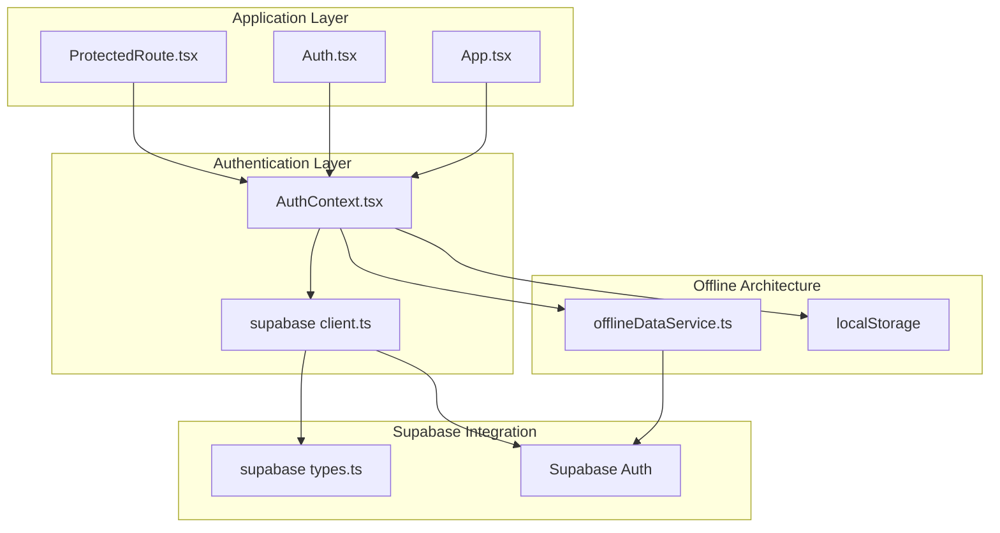
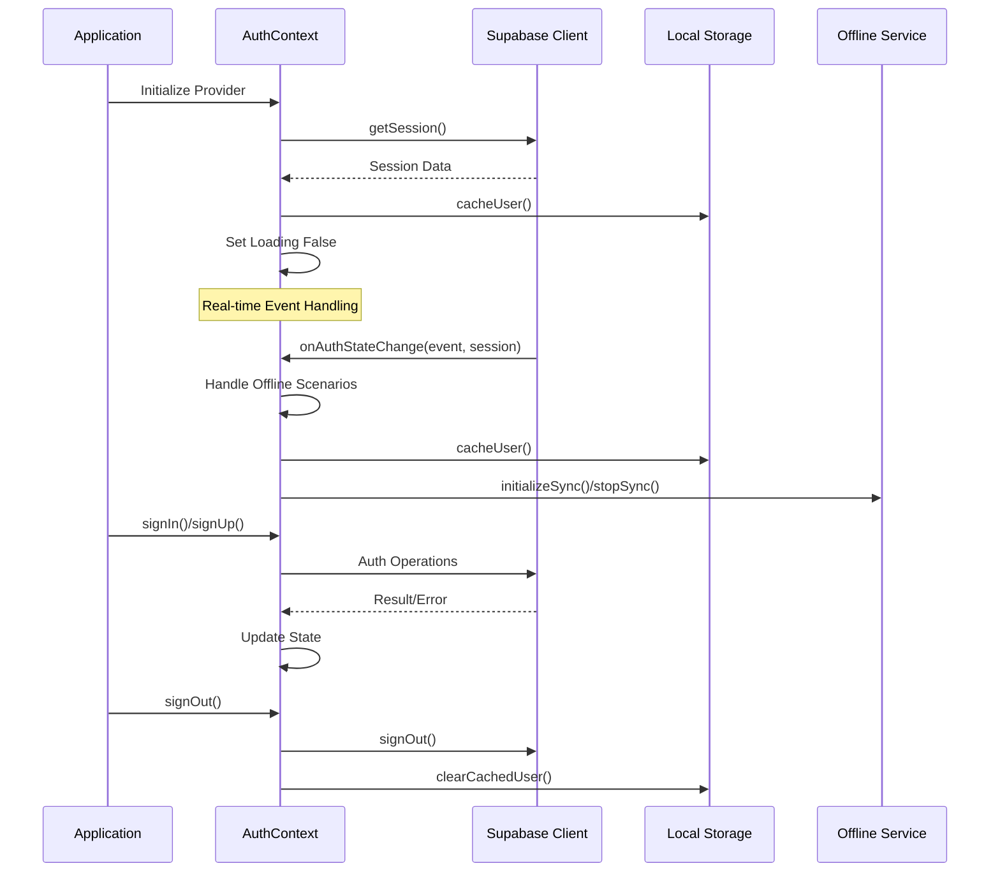
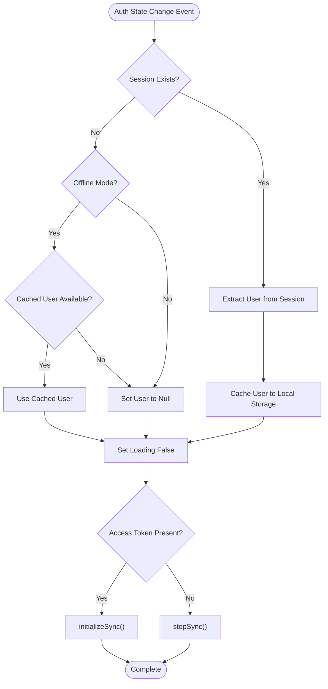
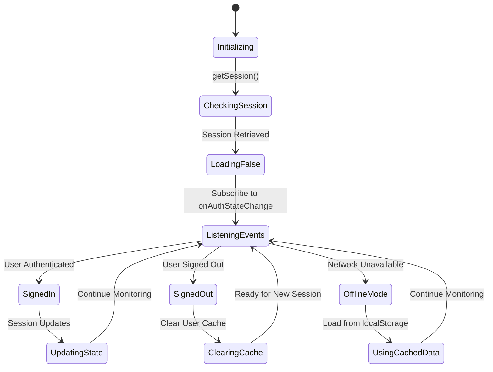
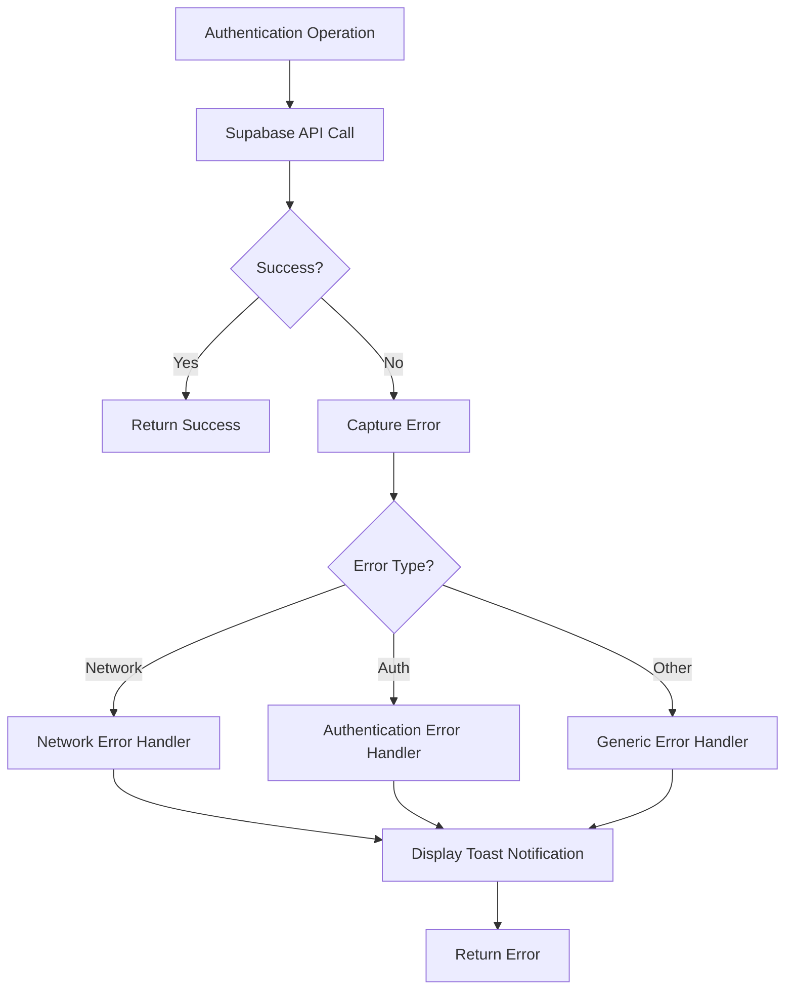

# Authentication Architecture

<cite>
**Referenced Files in This Document**
- [AuthContext.tsx](file://src/contexts/AuthContext.tsx)
- [client.ts](file://src/integrations/supabase/client.ts)
- [Auth.tsx](file://src/pages/Auth.tsx)
- [App.tsx](file://src/App.tsx)
- [ProtectedRoute.tsx](file://src/components/ProtectedRoute.tsx)
- [offlineDataService.ts](file://src/services/offlineDataService.ts)
- [types.ts](file://src/integrations/supabase/types.ts)
- [package.json](file://package.json)
</cite>

## Table of Contents
1. [Introduction](#introduction)
2. [Project Structure](#project-structure)
3. [Core Components](#core-components)
4. [Architecture Overview](#architecture-overview)
5. [Detailed Component Analysis](#detailed-component-analysis)
6. [Dependency Analysis](#dependency-analysis)
7. [Performance Considerations](#performance-considerations)
8. [Troubleshooting Guide](#troubleshooting-guide)
9. [Conclusion](#conclusion)

## Introduction
This document provides comprehensive authentication architecture documentation for TableFlow Pro's Supabase-based authentication system. It details the AuthContext provider implementation, authentication state management, Supabase integration patterns, real-time authentication state changes, session persistence mechanisms, and offline-first authentication architecture. The documentation covers the authentication lifecycle from initialization through state updates, including Supabase onAuthStateChange event handling and local storage caching strategies. It also addresses authentication state synchronization, token refresh handling, and error propagation patterns.

## Project Structure
The authentication system is built around a React Context Provider that integrates with Supabase Auth. The key components are organized as follows:



**Diagram sources**
- [App.tsx:108-147](file://src/App.tsx#L108-L147)
- [AuthContext.tsx:39-132](file://src/contexts/AuthContext.tsx#L39-L132)
- [client.ts:11-17](file://src/integrations/supabase/client.ts#L11-L17)

**Section sources**
- [App.tsx:1-150](file://src/App.tsx#L1-150)
- [AuthContext.tsx:1-141](file://src/contexts/AuthContext.tsx#L1-L141)

## Core Components
The authentication system consists of several interconnected components that work together to provide a robust, offline-capable authentication experience:

### AuthContext Provider
The AuthContext provider serves as the central authentication state manager, handling user sessions, authentication state changes, and integration with Supabase Auth. It manages three primary state variables: user, session, and loading status.

### Supabase Client Configuration
The Supabase client is configured with automatic session persistence, token refresh capabilities, and localStorage-based storage for offline scenarios.

### Offline-First Architecture
The system implements an offline-first approach where authentication state is maintained locally and synchronized with Supabase when connectivity is available.

**Section sources**
- [AuthContext.tsx:28-35](file://src/contexts/AuthContext.tsx#L28-L35)
- [client.ts:11-17](file://src/integrations/supabase/client.ts#L11-L17)
- [offlineDataService.ts:36-47](file://src/services/offlineDataService.ts#L36-L47)

## Architecture Overview
The authentication architecture follows a layered approach with clear separation of concerns:



**Diagram sources**
- [AuthContext.tsx:44-97](file://src/contexts/AuthContext.tsx#L44-L97)
- [client.ts:11-17](file://src/integrations/supabase/client.ts#L11-L17)

The architecture ensures that authentication state is resilient to network failures and maintains user sessions even when offline. The system handles various authentication events including SIGN_IN, SIGN_OUT, TOKEN_REFRESHED, and SIGNED_OUT with appropriate state transitions.

**Section sources**
- [AuthContext.tsx:44-77](file://src/contexts/AuthContext.tsx#L44-L77)
- [offlineDataService.ts:351-366](file://src/services/offlineDataService.ts#L351-L366)

## Detailed Component Analysis

### AuthContext Implementation
The AuthContext provider implements a comprehensive authentication management system with the following key features:

#### Authentication State Management
The provider maintains three critical state variables:
- **user**: Current authenticated user object or null
- **session**: Full Supabase session object or null  
- **loading**: Authentication initialization status

#### Real-time Authentication Events
The provider subscribes to Supabase's onAuthStateChange event to handle real-time authentication state updates:



**Diagram sources**
- [AuthContext.tsx:44-77](file://src/contexts/AuthContext.tsx#L44-L77)

#### Offline Authentication Handling
The system implements sophisticated offline authentication logic that preserves user sessions when offline:

- **Offline Session Preservation**: When offline and session expires, the system uses cached user data instead of clearing authentication state
- **Conditional Cache Usage**: Only ignores null sessions when offline and cached user exists
- **Explicit Sign Out**: Properly clears cached user data on explicit sign out events

#### Session Persistence Strategy
The authentication system uses a dual-layer caching approach:
1. **Supabase Session Storage**: Automatic session persistence via localStorage
2. **Custom User Cache**: Additional localStorage caching for offline scenarios

**Section sources**
- [AuthContext.tsx:8-26](file://src/contexts/AuthContext.tsx#L8-L26)
- [AuthContext.tsx:49-57](file://src/contexts/AuthContext.tsx#L49-L57)
- [AuthContext.tsx:85-92](file://src/contexts/AuthContext.tsx#L85-L92)

### Supabase Client Integration
The Supabase client is configured with specific authentication settings optimized for offline-first operation:

#### Client Configuration
The client is configured with:
- **storage: localStorage**: Enables persistent session storage across browser restarts
- **persistSession: true**: Automatically restores sessions on application startup
- **autoRefreshToken: true**: Handles token refresh without manual intervention

#### Environment Variables
The client reads Supabase configuration from environment variables:
- VITE_SUPABASE_URL: Supabase project URL
- VITE_SUPABASE_PUBLISHABLE_KEY: Supabase publishable API key

#### Type Safety
The client is strongly typed using Supabase's generated TypeScript types for complete type safety across the application.

**Section sources**
- [client.ts:5-17](file://src/integrations/supabase/client.ts#L5-L17)
- [types.ts:1-15](file://src/integrations/supabase/types.ts#L1-L15)

### Authentication Operations
The AuthContext exposes three primary authentication operations:

#### Sign Up Operation
The sign-up process includes:
- Full name registration via user metadata
- Email verification redirection
- Comprehensive error handling with user-friendly messages

#### Sign In Operation  
The sign-in process handles:
- Password-based authentication
- Immediate session establishment
- Error propagation with toast notifications

#### Sign Out Operation
The sign-out process ensures:
- Complete session termination
- Local storage cleanup
- Offline state preservation

**Section sources**
- [AuthContext.tsx:99-125](file://src/contexts/AuthContext.tsx#L99-L125)

### Protected Route Implementation
The ProtectedRoute component provides authentication gating for protected application routes:

#### Authentication Validation
The component validates authentication through:
- User state checking via useAuth hook
- Loading state management during authentication initialization
- LAN mode detection for offline scenarios

#### Offline Access Control
The system supports offline access modes:
- **LAN Client Mode**: Connected LAN clients bypass authentication requirements
- **Local Offline Mode**: Users can access cached data when offline
- **Online Mode**: Standard authentication requirements apply

**Section sources**
- [ProtectedRoute.tsx:9-59](file://src/components/ProtectedRoute.tsx#L9-L59)

### Authentication Lifecycle
The authentication lifecycle encompasses the complete flow from application initialization to user logout:



**Diagram sources**
- [AuthContext.tsx:79-97](file://src/contexts/AuthContext.tsx#L79-L97)

**Section sources**
- [AuthContext.tsx:79-97](file://src/contexts/AuthContext.tsx#L79-L97)

## Dependency Analysis
The authentication system has well-defined dependencies that ensure modularity and maintainability:

```mermaid
graph TB
subgraph "External Dependencies"
SupabaseJS[@supabase/supabase-js]
React[React]
ReactRouter[react-router-dom]
end
subgraph "Internal Dependencies"
AuthContext[AuthContext.tsx]
SupabaseClient[client.ts]
OfflineService[offlineDataService.ts]
ProtectedRoute[ProtectedRoute.tsx]
AuthPage[Auth.tsx]
end
subgraph "Utilities"
LocalStorage[localStorage API]
ToastNotifications[Toast Notifications]
end
SupabaseJS --> SupabaseClient
React --> AuthContext
ReactRouter --> ProtectedRoute
AuthContext --> SupabaseClient
AuthContext --> OfflineService
AuthContext --> LocalStorage
AuthPage --> AuthContext
ProtectedRoute --> AuthContext
AuthContext --> ToastNotifications
```

**Diagram sources**
- [package.json:47](file://package.json#L47)
- [AuthContext.tsx:1-3](file://src/contexts/AuthContext.tsx#L1-L3)

### Key Dependencies
- **@supabase/supabase-js**: Core Supabase client library for authentication and database operations
- **React Context API**: State management and cross-component communication
- **localStorage API**: Persistent session storage for offline scenarios
- **react-router-dom**: Route protection and navigation control

### Circular Dependency Prevention
The architecture avoids circular dependencies through:
- Centralized authentication state in AuthContext
- Decoupled offline service layer
- Clear separation between authentication and UI components

**Section sources**
- [package.json:17-77](file://package.json#L17-L77)
- [AuthContext.tsx:1-3](file://src/contexts/AuthContext.tsx#L1-L3)

## Performance Considerations
The authentication system is designed with performance optimization in mind:

### Initialization Performance
- **Lazy Loading**: Authentication state is loaded asynchronously during application startup
- **Parallel Operations**: Session retrieval and event subscription occur concurrently
- **Minimal Re-renders**: State updates are batched to reduce React re-render cycles

### Memory Management
- **Event Cleanup**: Auth state change subscriptions are properly cleaned up on component unmount
- **Cache Management**: Local storage operations are optimized to prevent memory leaks
- **Resource Cleanup**: Offline sync resources are properly managed and released

### Network Efficiency
- **Automatic Token Refresh**: Supabase handles token refresh transparently
- **Connection Pooling**: Supabase client manages connection pooling efficiently
- **Offline First**: Reduces network requests by serving cached data when available

## Troubleshooting Guide

### Common Authentication Issues

#### Session Restoration Failures
**Symptoms**: Users remain unauthenticated after browser restart
**Causes**: 
- localStorage corruption or quota exceeded
- Supabase session expiration
- Environment variable misconfiguration

**Solutions**:
- Clear browser localStorage and retry authentication
- Verify VITE_SUPABASE_URL and VITE_SUPABASE_PUBLISHABLE_KEY are set
- Check network connectivity and Supabase service status

#### Offline Authentication Problems
**Symptoms**: Authentication state lost when network is unavailable
**Causes**:
- Custom user cache not properly implemented
- Offline mode detection failures
- Token refresh conflicts

**Solutions**:
- Verify offlineDataService.isOffline() returns correct state
- Check localStorage availability and permissions
- Review onAuthStateChange event handling logic

#### Real-time Event Handling Issues
**Symptoms**: Authentication state not updating in real-time
**Causes**:
- Event subscription not established
- Event handler exceptions
- State update conflicts

**Solutions**:
- Verify onAuthStateChange subscription is active
- Check for unhandled exceptions in event handlers
- Review state update logic for race conditions

### Error Propagation Patterns
The authentication system implements structured error handling:



**Diagram sources**
- [Auth.tsx:25-87](file://src/pages/Auth.tsx#L25-L87)

**Section sources**
- [Auth.tsx:25-87](file://src/pages/Auth.tsx#L25-L87)
- [AuthContext.tsx:44-77](file://src/contexts/AuthContext.tsx#L44-L77)

## Conclusion
TableFlow Pro's authentication architecture demonstrates a sophisticated approach to building reliable, offline-capable authentication systems. The implementation successfully combines Supabase's robust authentication infrastructure with custom offline-first logic to provide seamless user experiences across various deployment scenarios.

Key architectural strengths include:
- **Robust Offline Support**: Comprehensive offline authentication handling with intelligent cache management
- **Real-time State Synchronization**: Efficient event-driven state updates with proper cleanup
- **Type Safety**: Complete TypeScript integration with Supabase's generated types
- **Modular Design**: Clear separation of concerns with well-defined component boundaries
- **Performance Optimization**: Efficient resource management and minimal re-render cycles

The system's ability to handle complex scenarios like LAN mode operation, token refresh, and session persistence makes it suitable for diverse deployment environments while maintaining excellent user experience standards.

Future enhancements could include:
- Enhanced error recovery mechanisms
- More granular offline state management
- Advanced token refresh strategies
- Improved debugging and monitoring capabilities