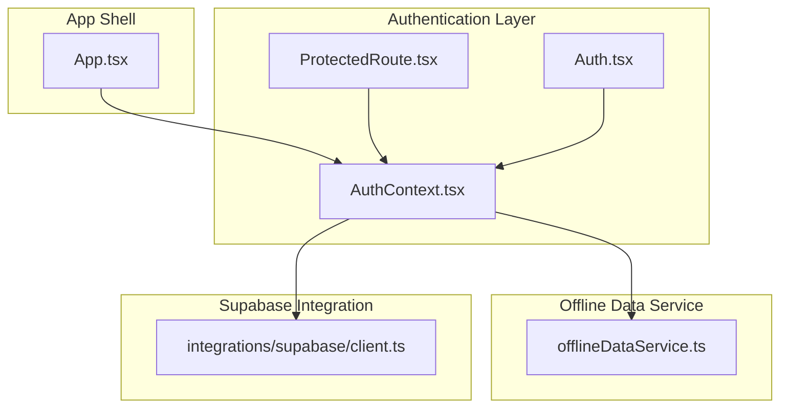
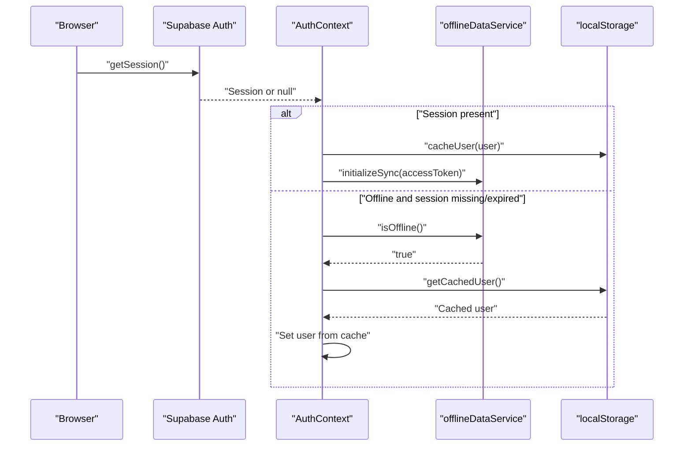
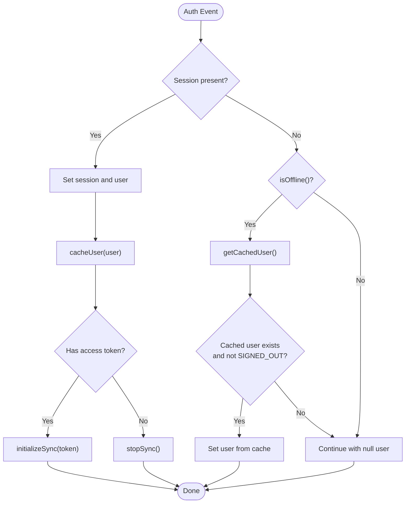
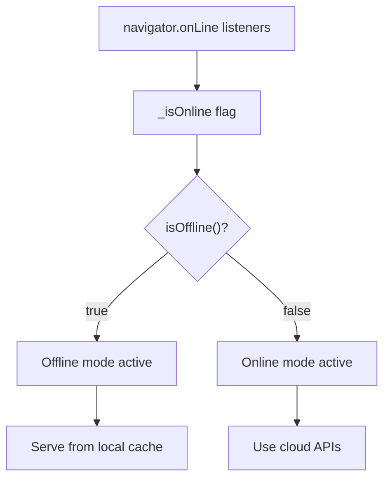
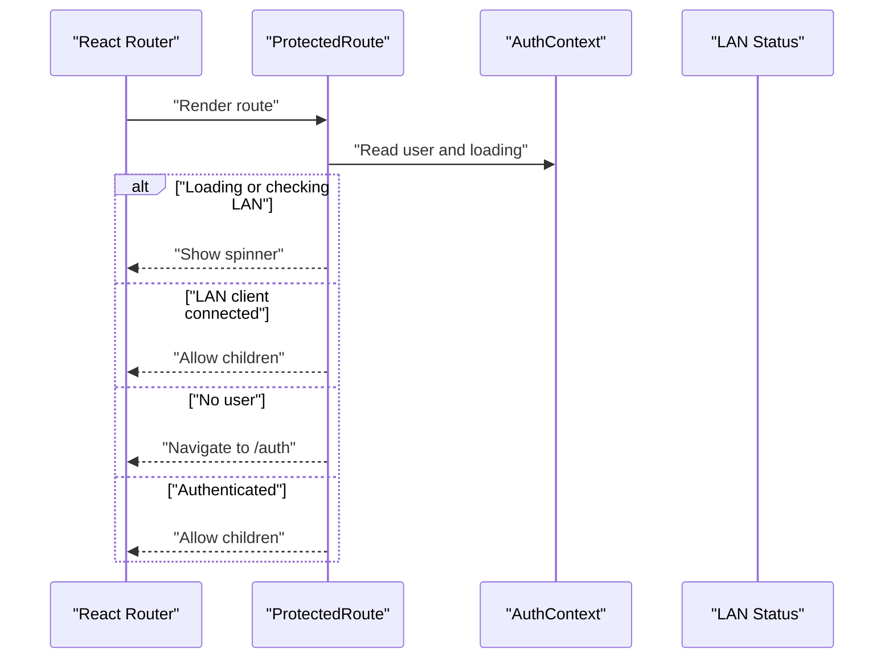
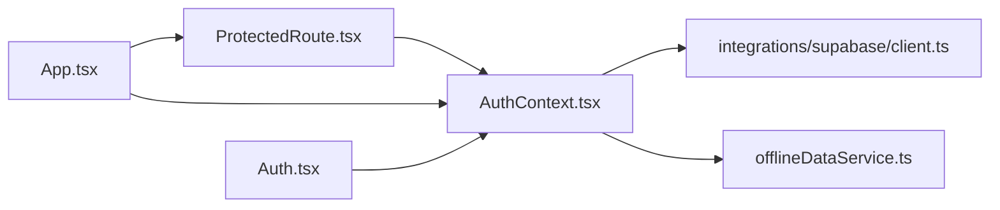

# Offline Authentication Support

<cite>
**Referenced Files in This Document**
- [AuthContext.tsx](file://src/contexts/AuthContext.tsx)
- [offlineDataService.ts](file://src/services/offlineDataService.ts)
- [client.ts](file://src/integrations/supabase/client.ts)
- [ProtectedRoute.tsx](file://src/components/ProtectedRoute.tsx)
- [App.tsx](file://src/App.tsx)
- [Auth.tsx](file://src/pages/Auth.tsx)
</cite>

## Table of Contents
1. [Introduction](#introduction)
2. [Project Structure](#project-structure)
3. [Core Components](#core-components)
4. [Architecture Overview](#architecture-overview)
5. [Detailed Component Analysis](#detailed-component-analysis)
6. [Dependency Analysis](#dependency-analysis)
7. [Performance Considerations](#performance-considerations)
8. [Troubleshooting Guide](#troubleshooting-guide)
9. [Conclusion](#conclusion)

## Introduction
This document explains the offline-first authentication architecture in TableFlow Pro. It covers how authentication state is preserved during network outages, how cached users are restored, and how offline session management integrates with the offline data service. It also documents the isOffline() detection mechanism, cached user persistence, and the automatic fallback behavior that allows users to continue operating in disconnected environments. Finally, it provides troubleshooting guidance and best practices for maintaining user sessions in offline scenarios.

## Project Structure
The offline authentication system spans three primary areas:
- Authentication context and lifecycle management
- Offline data service for connectivity detection and fallback
- Supabase client configuration for session persistence

**Diagram sources**
- [AuthContext.tsx:1-141](file://src/contexts/AuthContext.tsx#L1-L141)
- [offlineDataService.ts:1-769](file://src/services/offlineDataService.ts#L1-L769)
- [client.ts:1-17](file://src/integrations/supabase/client.ts#L1-L17)
- [ProtectedRoute.tsx:1-60](file://src/components/ProtectedRoute.tsx#L1-L60)
- [App.tsx:1-150](file://src/App.tsx#L1-L150)
- [Auth.tsx:1-224](file://src/pages/Auth.tsx#L1-L224)

**Section sources**
- [AuthContext.tsx:1-141](file://src/contexts/AuthContext.tsx#L1-L141)
- [offlineDataService.ts:1-769](file://src/services/offlineDataService.ts#L1-L769)
- [client.ts:1-17](file://src/integrations/supabase/client.ts#L1-L17)
- [ProtectedRoute.tsx:1-60](file://src/components/ProtectedRoute.tsx#L1-L60)
- [App.tsx:1-150](file://src/App.tsx#L1-L150)
- [Auth.tsx:1-224](file://src/pages/Auth.tsx#L1-L224)

## Core Components
- AuthContext: Manages authentication state, caches the user locally, and coordinates offline behavior with the offline data service.
- offlineDataService: Provides isOffline() detection, manages connectivity listeners, and integrates with the sync engine.
- Supabase client: Configured with session persistence and auto-refresh to maintain tokens across reloads.
- ProtectedRoute: Enforces authentication for protected routes and adapts behavior when LAN client mode is active.
- App shell: Initializes providers and routing, enabling offline-aware authentication.

Key responsibilities:
- Restore cached user when offline and session is missing or expired.
- Prevent clearing user on offline token refresh events.
- Initialize or stop the sync engine based on auth state.
- Provide offline-aware route protection.

**Section sources**
- [AuthContext.tsx:28-141](file://src/contexts/AuthContext.tsx#L28-L141)
- [offlineDataService.ts:24-47](file://src/services/offlineDataService.ts#L24-L47)
- [offlineDataService.ts:351-372](file://src/services/offlineDataService.ts#L351-L372)
- [client.ts:11-17](file://src/integrations/supabase/client.ts#L11-L17)
- [ProtectedRoute.tsx:9-59](file://src/components/ProtectedRoute.tsx#L9-L59)

## Architecture Overview
The offline authentication architecture combines Supabase’s auth state management with a local user cache and offline connectivity detection. When online, authentication relies on Supabase. When offline, the system falls back to the cached user and continues to operate until connectivity is restored.

**Diagram sources**
- [AuthContext.tsx:44-97](file://src/contexts/AuthContext.tsx#L44-L97)
- [offlineDataService.ts:36-38](file://src/services/offlineDataService.ts#L36-L38)
- [client.ts:11-17](file://src/integrations/supabase/client.ts#L11-L17)

## Detailed Component Analysis

### AuthContext: Offline-aware Authentication Lifecycle
AuthContext orchestrates authentication state, caching, and offline behavior:
- Subscribes to Supabase auth state changes.
- On auth events, checks if offline and session is null; if so, restores from cached user.
- Caches the user to localStorage on successful auth.
- Starts or stops the sync engine based on access token presence.
- Clears cached user on explicit sign-out.

**Diagram sources**
- [AuthContext.tsx:44-97](file://src/contexts/AuthContext.tsx#L44-L97)
- [offlineDataService.ts:351-372](file://src/services/offlineDataService.ts#L351-L372)

**Section sources**
- [AuthContext.tsx:44-97](file://src/contexts/AuthContext.tsx#L44-L97)
- [AuthContext.tsx:8-26](file://src/contexts/AuthContext.tsx#L8-L26)

### offlineDataService: Connectivity Detection and Offline Mode
offlineDataService provides:
- isOffline(): Returns true when browser reports offline.
- Connectivity listeners: Tracks online/offline transitions and notifies subscribers.
- Sync management: initializeSync(), stopSync(), and forceSyncPush() for Electron mode.
- Offline-first data access: offlineQuery(), offlineMutate(), offlineDelete() with SQLite-first behavior in Electron/LAN modes.

**Diagram sources**
- [offlineDataService.ts:24-47](file://src/services/offlineDataService.ts#L24-L47)
- [offlineDataService.ts:36-42](file://src/services/offlineDataService.ts#L36-L42)

**Section sources**
- [offlineDataService.ts:24-47](file://src/services/offlineDataService.ts#L24-L47)
- [offlineDataService.ts:351-372](file://src/services/offlineDataService.ts#L351-L372)

### Supabase Client: Session Persistence and Auto Refresh
The Supabase client is configured with:
- Storage: localStorage
- Persist session: true
- Auto refresh token: true

These settings ensure that sessions persist across page reloads and refresh automatically when needed, supporting offline restoration.

**Section sources**
- [client.ts:11-17](file://src/integrations/supabase/client.ts#L11-L17)

### ProtectedRoute: Route Protection with LAN Awareness
ProtectedRoute enforces authentication for protected routes:
- Uses AuthContext to check user and loading state.
- Detects LAN client mode and verifies connection status.
- Allows access without authentication when LAN client is connected.
- Redirects unauthenticated users to the login page.

**Diagram sources**
- [ProtectedRoute.tsx:9-59](file://src/components/ProtectedRoute.tsx#L9-L59)

**Section sources**
- [ProtectedRoute.tsx:9-59](file://src/components/ProtectedRoute.tsx#L9-L59)

### Authentication Pages: Login and Registration
Authentication pages integrate with AuthContext:
- Login: Calls signIn() and navigates on success.
- Registration: Calls signUp() and navigates on success.
- Password reset: Uses Supabase reset flow.

**Section sources**
- [Auth.tsx:25-87](file://src/pages/Auth.tsx#L25-L87)

## Dependency Analysis
The offline authentication system exhibits clear separation of concerns:
- AuthContext depends on Supabase client and offline data service.
- offlineDataService provides connectivity state and sync controls.
- ProtectedRoute depends on AuthContext and LAN status.
- App initializes providers and routes.

**Diagram sources**
- [AuthContext.tsx:1-141](file://src/contexts/AuthContext.tsx#L1-L141)
- [offlineDataService.ts:1-769](file://src/services/offlineDataService.ts#L1-L769)
- [client.ts:1-17](file://src/integrations/supabase/client.ts#L1-L17)
- [ProtectedRoute.tsx:1-60](file://src/components/ProtectedRoute.tsx#L1-L60)
- [App.tsx:1-150](file://src/App.tsx#L1-L150)
- [Auth.tsx:1-224](file://src/pages/Auth.tsx#L1-L224)

**Section sources**
- [AuthContext.tsx:1-141](file://src/contexts/AuthContext.tsx#L1-L141)
- [offlineDataService.ts:1-769](file://src/services/offlineDataService.ts#L1-L769)
- [client.ts:1-17](file://src/integrations/supabase/client.ts#L1-L17)
- [ProtectedRoute.tsx:1-60](file://src/components/ProtectedRoute.tsx#L1-L60)
- [App.tsx:1-150](file://src/App.tsx#L1-L150)
- [Auth.tsx:1-224](file://src/pages/Auth.tsx#L1-L224)

## Performance Considerations
- Local caching minimizes repeated network requests during offline periods.
- Supabase auto-refresh reduces unnecessary re-authentication attempts.
- Sync engine initialization occurs only when an access token is available, avoiding redundant operations.
- Offline data service prioritizes local SQLite reads in Electron/LAN modes, ensuring responsiveness.

## Troubleshooting Guide
Common issues and resolutions:
- Session disappears when offline:
  - Cause: Supabase fires token refresh with null session while offline.
  - Resolution: AuthContext checks isOffline() and restores from cached user.
  - Evidence: AuthContext logs indicate ignoring null session while offline and using cached user.
- User appears signed out unexpectedly:
  - Cause: Explicit sign-out clears cached user.
  - Resolution: Sign in again to repopulate cache.
- Sync does not start after login:
  - Cause: Access token missing or sync API unavailable.
  - Resolution: Ensure access token exists and initializeSync is called; verify Electron sync API availability.
- LAN client mode prevents access:
  - Cause: ProtectedRoute allows access when LAN client is connected.
  - Resolution: Confirm LAN client status and connection; otherwise authenticate normally.

**Section sources**
- [AuthContext.tsx:47-57](file://src/contexts/AuthContext.tsx#L47-L57)
- [AuthContext.tsx:72-76](file://src/contexts/AuthContext.tsx#L72-L76)
- [offlineDataService.ts:351-372](file://src/services/offlineDataService.ts#L351-L372)
- [ProtectedRoute.tsx:48-51](file://src/components/ProtectedRoute.tsx#L48-L51)

## Conclusion
TableFlow Pro’s offline authentication architecture ensures continuity by combining Supabase auth state management with a resilient local user cache and offline connectivity detection. AuthContext preserves authentication state during network outages, while offlineDataService coordinates offline-first data operations and sync lifecycle. Together, these components deliver a seamless offline experience with predictable fallback behavior and clear pathways for restoring authentication when connectivity is regained.