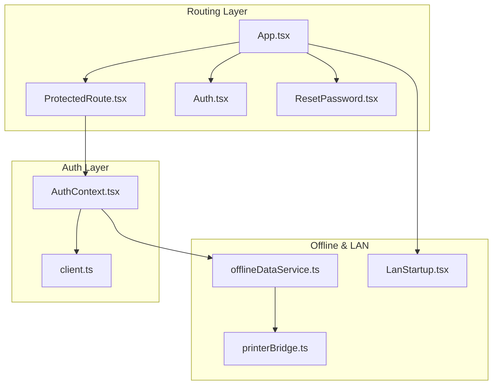
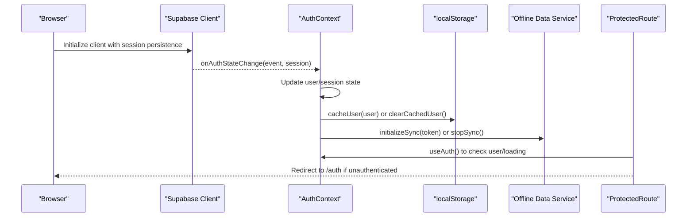
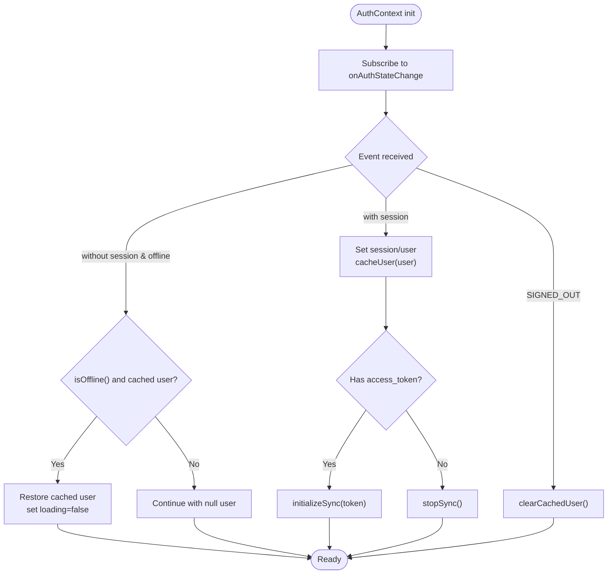
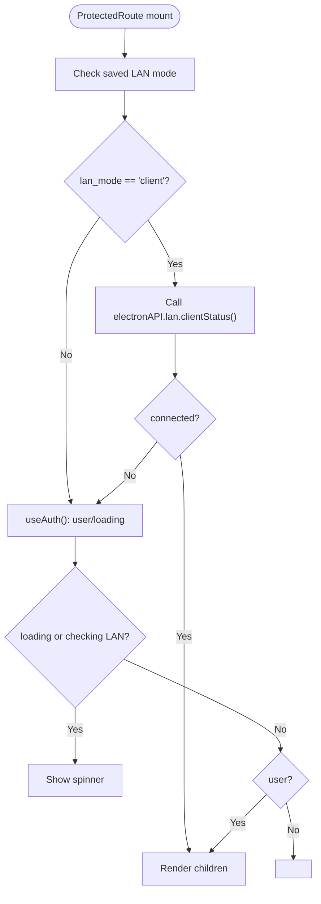
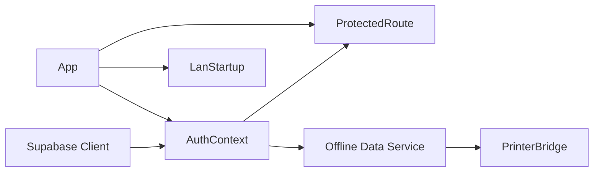

# Session Management & Persistence

<cite>
**Referenced Files in This Document**
- [AuthContext.tsx](file://src/contexts/AuthContext.tsx)
- [ProtectedRoute.tsx](file://src/components/ProtectedRoute.tsx)
- [Auth.tsx](file://src/pages/Auth.tsx)
- [client.ts](file://src/integrations/supabase/client.ts)
- [App.tsx](file://src/App.tsx)
- [offlineDataService.ts](file://src/services/offlineDataService.ts)
- [LanStartup.tsx](file://src/components/LanStartup.tsx)
- [printerBridge.ts](file://src/services/printerBridge.ts)
- [ResetPassword.tsx](file://src/pages/ResetPassword.tsx)
- [NotFound.tsx](file://src/pages/NotFound.tsx)
- [package.json](file://package.json)
</cite>

## Table of Contents
1. [Introduction](#introduction)
2. [Project Structure](#project-structure)
3. [Core Components](#core-components)
4. [Architecture Overview](#architecture-overview)
5. [Detailed Component Analysis](#detailed-component-analysis)
6. [Dependency Analysis](#dependency-analysis)
7. [Performance Considerations](#performance-considerations)
8. [Troubleshooting Guide](#troubleshooting-guide)
9. [Conclusion](#conclusion)

## Introduction
This document explains how TableFlow Pro manages user sessions, authentication persistence, and route protection. It covers:
- Local storage caching of user sessions and offline restoration
- The ProtectedRoute component and access control patterns
- Session lifecycle, automatic sign-out handling, and offline behavior
- Integration between authentication state and routing
- Error handling for unauthorized access attempts
- Security considerations for stored credentials
- Session timeout management and cache invalidation strategies

## Project Structure
The session management system spans several modules:
- Authentication provider and context
- Supabase client configuration for session persistence
- Protected route wrapper for access control
- Offline data service for connectivity-aware behavior
- LAN mode integration for client/server scenarios
- Reset password page for recovery sessions

**Diagram sources**
- [App.tsx:108-147](file://src/App.tsx#L108-L147)
- [ProtectedRoute.tsx:9-59](file://src/components/ProtectedRoute.tsx#L9-L59)
- [AuthContext.tsx:39-132](file://src/contexts/AuthContext.tsx#L39-L132)
- [client.ts:11-17](file://src/integrations/supabase/client.ts#L11-L17)
- [offlineDataService.ts:351-372](file://src/services/offlineDataService.ts#L351-L372)
- [LanStartup.tsx:23-71](file://src/components/LanStartup.tsx#L23-L71)
- [printerBridge.ts:20-31](file://src/services/printerBridge.ts#L20-L31)

**Section sources**
- [App.tsx:108-147](file://src/App.tsx#L108-L147)
- [AuthContext.tsx:39-132](file://src/contexts/AuthContext.tsx#L39-L132)
- [client.ts:11-17](file://src/integrations/supabase/client.ts#L11-L17)
- [offlineDataService.ts:351-372](file://src/services/offlineDataService.ts#L351-L372)
- [LanStartup.tsx:23-71](file://src/components/LanStartup.tsx#L23-L71)
- [printerBridge.ts:20-31](file://src/services/printerBridge.ts#L20-L31)

## Core Components
- AuthContext: Centralizes authentication state, persists user to localStorage, and integrates offline sync.
- ProtectedRoute: Enforces access control and handles LAN client mode bypass.
- Supabase client: Configured for session persistence and token refresh.
- Offline data service: Manages connectivity state and offline-first data access.
- LAN startup: Enables LAN mode selection and client/server configuration.
- Reset password page: Validates recovery sessions and updates passwords.

**Section sources**
- [AuthContext.tsx:28-132](file://src/contexts/AuthContext.tsx#L28-L132)
- [ProtectedRoute.tsx:5-59](file://src/components/ProtectedRoute.tsx#L5-L59)
- [client.ts:11-17](file://src/integrations/supabase/client.ts#L11-L17)
- [offlineDataService.ts:26-47](file://src/services/offlineDataService.ts#L26-L47)
- [LanStartup.tsx:23-71](file://src/components/LanStartup.tsx#L23-L71)
- [ResetPassword.tsx:11-61](file://src/pages/ResetPassword.tsx#L11-L61)

## Architecture Overview
The authentication and session lifecycle is driven by Supabase’s auth state change listener and local caching. AuthContext listens for auth events, updates React state, caches the user in localStorage, and starts/stops the offline sync engine. ProtectedRoute checks authentication state and allows LAN client mode bypass. Offline data service provides connectivity-aware data access and offline restoration.

**Diagram sources**
- [client.ts:11-17](file://src/integrations/supabase/client.ts#L11-L17)
- [AuthContext.tsx:44-97](file://src/contexts/AuthContext.tsx#L44-L97)
- [offlineDataService.ts:351-372](file://src/services/offlineDataService.ts#L351-L372)
- [ProtectedRoute.tsx:9-59](file://src/components/ProtectedRoute.tsx#L9-L59)

## Detailed Component Analysis

### AuthContext: Authentication Provider and Local Storage Caching
Responsibilities:
- Subscribe to Supabase auth state changes
- Persist user to localStorage for offline restoration
- Start/stop offline sync based on session availability
- Provide sign-up, sign-in, and sign-out actions

Key behaviors:
- Caching strategy: Stores the user object in localStorage keyed by a constant. The cache is not cleared on logout to enable offline restoration.
- Offline handling: When offline and session becomes null, restores user from cache if available and event is not SIGNED_OUT.
- Sync engine: Initializes sync with access token when present; stops when session ends.

**Diagram sources**
- [AuthContext.tsx:44-97](file://src/contexts/AuthContext.tsx#L44-L97)
- [offlineDataService.ts:351-372](file://src/services/offlineDataService.ts#L351-L372)

**Section sources**
- [AuthContext.tsx:6-26](file://src/contexts/AuthContext.tsx#L6-L26)
- [AuthContext.tsx:44-97](file://src/contexts/AuthContext.tsx#L44-L97)
- [offlineDataService.ts:351-372](file://src/services/offlineDataService.ts#L351-L372)

### ProtectedRoute: Access Control and LAN Client Mode
Responsibilities:
- Guard protected routes by checking authentication state
- Allow LAN client mode to bypass authentication when connected
- Show loading while checking auth and LAN status

Behavior:
- Loading states: Renders a spinner while auth or LAN status is being determined.
- LAN client mode: Reads saved mode from localStorage and verifies LAN client connectivity via Electron API. If connected, renders children without requiring authentication.
- Authentication requirement: Redirects to /auth if user is missing and not in LAN client mode.

**Diagram sources**
- [ProtectedRoute.tsx:9-59](file://src/components/ProtectedRoute.tsx#L9-L59)
- [LanStartup.tsx:23-71](file://src/components/LanStartup.tsx#L23-L71)

**Section sources**
- [ProtectedRoute.tsx:9-59](file://src/components/ProtectedRoute.tsx#L9-L59)
- [LanStartup.tsx:23-71](file://src/components/LanStartup.tsx#L23-L71)

### Supabase Client: Session Persistence and Token Refresh
Configuration:
- Uses localStorage for auth storage
- Persists sessions across browser restarts
- Automatically refreshes tokens

Integration:
- AuthContext relies on Supabase’s auth state change events to update React state and cache user
- Access token is passed to offline sync initialization

**Section sources**
- [client.ts:11-17](file://src/integrations/supabase/client.ts#L11-L17)
- [AuthContext.tsx:66-70](file://src/contexts/AuthContext.tsx#L66-L70)

### Offline Data Service: Connectivity and Offline Restoration
Capabilities:
- Tracks online/offline state and notifies listeners
- Provides offline-first data access for Electron/LAN modes
- Starts/stops sync engine based on auth state
- Supports manual sync and pending change counts

Offline restoration:
- AuthContext uses offline detection to decide whether to ignore a null session and restore cached user

**Section sources**
- [offlineDataService.ts:26-47](file://src/services/offlineDataService.ts#L26-L47)
- [offlineDataService.ts:351-372](file://src/services/offlineDataService.ts#L351-L372)
- [AuthContext.tsx:49-56](file://src/contexts/AuthContext.tsx#L49-L56)

### LAN Startup: Client/Server Mode Selection
Purpose:
- Allows users to select LAN mode and configure client connection
- Saves mode and configuration to localStorage
- Attempts to connect to LAN server via Electron API

Integration:
- App reads saved mode/config on startup and initializes LAN mode accordingly
- ProtectedRoute checks LAN mode and client status to bypass authentication

**Section sources**
- [LanStartup.tsx:23-71](file://src/components/LanStartup.tsx#L23-L71)
- [App.tsx:42-53](file://src/App.tsx#L42-L53)

### Reset Password: Recovery Session Validation
Behavior:
- Subscribes to auth state changes to detect PASSWORD_RECOVERY and valid sessions
- Validates current session on mount
- Updates user password upon submission

**Section sources**
- [ResetPassword.tsx:11-61](file://src/pages/ResetPassword.tsx#L11-L61)

## Dependency Analysis
High-level dependencies:
- AuthContext depends on Supabase client for auth state and on offline data service for sync control
- ProtectedRoute depends on AuthContext and LAN client status
- App orchestrates routing and provides providers for AuthContext and RestaurantContext
- Offline data service depends on Electron APIs for sync and SQLite operations

**Diagram sources**
- [client.ts:11-17](file://src/integrations/supabase/client.ts#L11-L17)
- [AuthContext.tsx:39-132](file://src/contexts/AuthContext.tsx#L39-L132)
- [offlineDataService.ts:351-372](file://src/services/offlineDataService.ts#L351-L372)
- [App.tsx:108-147](file://src/App.tsx#L108-L147)
- [printerBridge.ts:20-31](file://src/services/printerBridge.ts#L20-L31)

**Section sources**
- [client.ts:11-17](file://src/integrations/supabase/client.ts#L11-L17)
- [AuthContext.tsx:39-132](file://src/contexts/AuthContext.tsx#L39-L132)
- [offlineDataService.ts:351-372](file://src/services/offlineDataService.ts#L351-L372)
- [App.tsx:108-147](file://src/App.tsx#L108-L147)
- [printerBridge.ts:20-31](file://src/services/printerBridge.ts#L20-L31)

## Performance Considerations
- Auth state updates are lightweight; caching avoids repeated network calls for user identity.
- Offline restoration reduces latency by avoiding network requests when offline.
- Sync engine is started only when an access token is available, minimizing unnecessary overhead.
- ProtectedRoute defers rendering until auth and LAN status are known to prevent flicker.

## Troubleshooting Guide
Common issues and resolutions:
- Unauthorized access attempts:
  - Symptom: ProtectedRoute redirects to /auth.
  - Cause: user is null and not in LAN client mode.
  - Resolution: Ensure user is authenticated or enable LAN client mode.

- Stuck on loading spinner:
  - Symptom: ProtectedRoute shows spinner indefinitely.
  - Cause: AuthContext still loading or LAN status check pending.
  - Resolution: Wait for auth state to settle; verify Electron API availability for LAN checks.

- Offline session expiration:
  - Symptom: AuthContext ignores null session while offline.
  - Cause: isOffline() returns true and cached user is restored.
  - Resolution: Confirm offline mode and verify cached user presence.

- Sign-out not clearing cache:
  - Symptom: Cached user remains after SIGNED_OUT.
  - Cause: Cache is intentionally preserved for offline restoration.
  - Resolution: Clear cache manually if needed; note that sign-out clears cache on auth state change.

- LAN client not connecting:
  - Symptom: LAN client mode selected but not recognized.
  - Cause: Electron API not available or server unreachable.
  - Resolution: Verify server IP/port, firewall settings, and Electron API readiness.

**Section sources**
- [ProtectedRoute.tsx:40-59](file://src/components/ProtectedRoute.tsx#L40-L59)
- [AuthContext.tsx:49-75](file://src/contexts/AuthContext.tsx#L49-L75)
- [LanStartup.tsx:44-66](file://src/components/LanStartup.tsx#L44-L66)

## Conclusion
TableFlow Pro implements a robust session management system centered on Supabase’s auth state changes and local storage caching. AuthContext ensures seamless offline restoration and integrates with the offline data service for connectivity-aware behavior. ProtectedRoute enforces access control while accommodating LAN client mode. Together, these components deliver reliable authentication persistence, graceful offline handling, and secure credential storage.