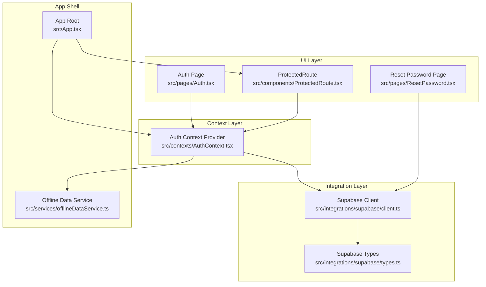
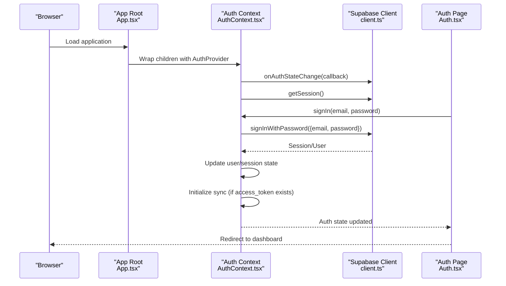
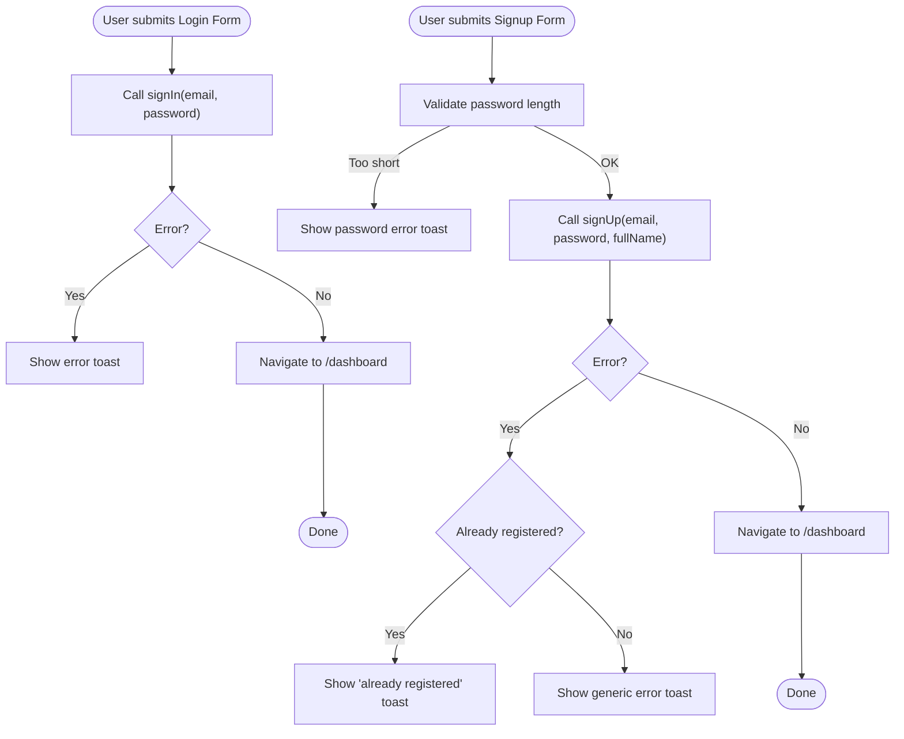
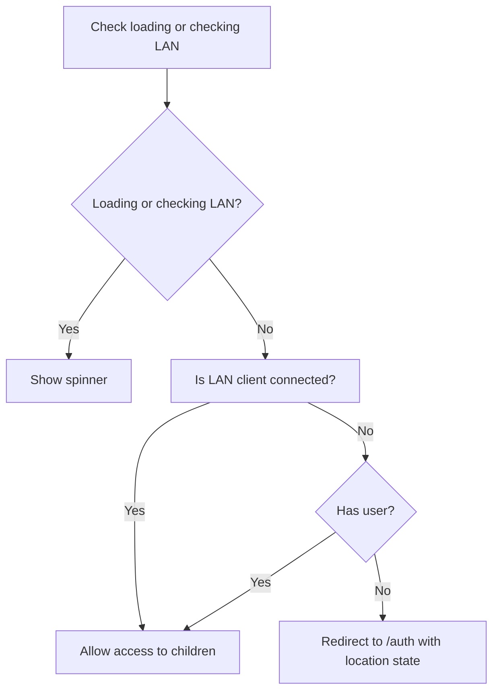
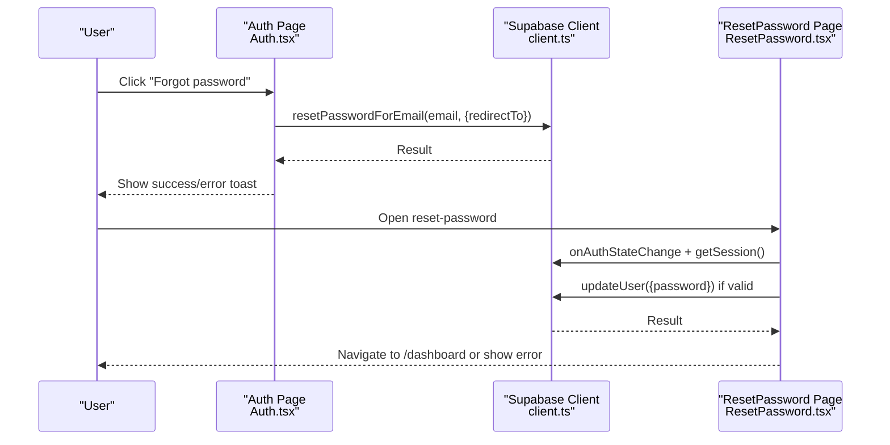
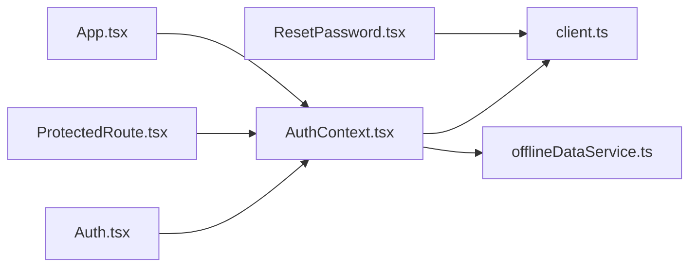

# User Authentication Flow

<cite>
**Referenced Files in This Document**
- [AuthContext.tsx](file://src/contexts/AuthContext.tsx)
- [Auth.tsx](file://src/pages/Auth.tsx)
- [client.ts](file://src/integrations/supabase/client.ts)
- [types.ts](file://src/integrations/supabase/types.ts)
- [App.tsx](file://src/App.tsx)
- [ProtectedRoute.tsx](file://src/components/ProtectedRoute.tsx)
- [ResetPassword.tsx](file://src/pages/ResetPassword.tsx)
- [offlineDataService.ts](file://src/services/offlineDataService.ts)
</cite>

## Table of Contents
1. [Introduction](#introduction)
2. [Project Structure](#project-structure)
3. [Core Components](#core-components)
4. [Architecture Overview](#architecture-overview)
5. [Detailed Component Analysis](#detailed-component-analysis)
6. [Dependency Analysis](#dependency-analysis)
7. [Performance Considerations](#performance-considerations)
8. [Troubleshooting Guide](#troubleshooting-guide)
9. [Conclusion](#conclusion)

## Introduction
This document explains the complete user authentication flow in TableFlow Pro, covering registration, login, logout, and password reset. It details the implementation of the signUp, signIn, and signOut methods, including parameter handling, error management, and response processing. It also documents the email/password authentication workflow, redirect URL configuration, user metadata handling during registration, and integration with Supabase authentication APIs. Practical examples of authentication hook usage, form validation patterns, and error handling strategies are included, along with session management, user state updates, common authentication scenarios, troubleshooting approaches, and security considerations.

## Project Structure
Authentication in TableFlow Pro is implemented through a dedicated context provider, a dedicated authentication page, protected routing, and integration with Supabase. The Supabase client is configured to persist sessions and refresh tokens automatically, while offline capabilities are handled by a dedicated offline data service.



**Diagram sources**
- [App.tsx:111-118](file://src/App.tsx#L111-L118)
- [AuthContext.tsx:39-132](file://src/contexts/AuthContext.tsx#L39-L132)
- [Auth.tsx:13-39](file://src/pages/Auth.tsx#L13-L39)
- [ResetPassword.tsx:11-34](file://src/pages/ResetPassword.tsx#L11-L34)
- [ProtectedRoute.tsx:9-59](file://src/components/ProtectedRoute.tsx#L9-L59)
- [client.ts:11-17](file://src/integrations/supabase/client.ts#L11-L17)
- [types.ts:9-688](file://src/integrations/supabase/types.ts#L9-L688)
- [offlineDataService.ts:351-361](file://src/services/offlineDataService.ts#L351-L361)

**Section sources**
- [App.tsx:111-118](file://src/App.tsx#L111-L118)
- [AuthContext.tsx:39-132](file://src/contexts/AuthContext.tsx#L39-L132)
- [Auth.tsx:13-39](file://src/pages/Auth.tsx#L13-L39)
- [ResetPassword.tsx:11-34](file://src/pages/ResetPassword.tsx#L11-L34)
- [ProtectedRoute.tsx:9-59](file://src/components/ProtectedRoute.tsx#L9-L59)
- [client.ts:11-17](file://src/integrations/supabase/client.ts#L11-L17)
- [types.ts:9-688](file://src/integrations/supabase/types.ts#L9-L688)
- [offlineDataService.ts:351-361](file://src/services/offlineDataService.ts#L351-L361)

## Core Components
- AuthContext: Provides authentication state, session lifecycle, and authentication methods (signUp, signIn, signOut). It listens to Supabase auth state changes, caches user data for offline use, and manages synchronization based on auth state.
- Auth Page: Implements the email/password login and registration forms, including basic validation and error feedback.
- ProtectedRoute: Guards dashboard routes and redirects unauthenticated users to the login page.
- Supabase Client: Configured with automatic token persistence and refresh.
- Reset Password Page: Handles password reset initiation and completion with session validation.
- Offline Data Service: Integrates with auth state to start/stop synchronization when a user is logged in or logged out.

**Section sources**
- [AuthContext.tsx:28-132](file://src/contexts/AuthContext.tsx#L28-L132)
- [Auth.tsx:13-87](file://src/pages/Auth.tsx#L13-L87)
- [ProtectedRoute.tsx:9-59](file://src/components/ProtectedRoute.tsx#L9-L59)
- [client.ts:11-17](file://src/integrations/supabase/client.ts#L11-L17)
- [ResetPassword.tsx:11-61](file://src/pages/ResetPassword.tsx#L11-L61)
- [offlineDataService.ts:351-361](file://src/services/offlineDataService.ts#L351-L361)

## Architecture Overview
The authentication architecture centers around a React context provider that wraps the application and exposes authentication methods. Supabase handles authentication state changes and session persistence. The ProtectedRoute enforces access control for protected routes. Offline capabilities are integrated so that when offline, the app can continue operating using cached user data.



**Diagram sources**
- [App.tsx:111-118](file://src/App.tsx#L111-L118)
- [AuthContext.tsx:44-97](file://src/contexts/AuthContext.tsx#L44-L97)
- [client.ts:11-17](file://src/integrations/supabase/client.ts#L11-L17)
- [Auth.tsx:25-39](file://src/pages/Auth.tsx#L25-L39)

## Detailed Component Analysis

### AuthContext: Authentication Provider
AuthContext centralizes authentication state and methods. It:
- Subscribes to Supabase auth state changes and updates React state accordingly.
- Persists user data in localStorage for offline use and restores it when offline.
- Starts/stops synchronization based on session availability.
- Exposes signUp, signIn, and signOut methods that delegate to Supabase.

Key implementation highlights:
- Auth state change listener handles offline scenarios by preserving cached user data when session is null.
- Session retrieval on mount ensures immediate user state initialization.
- signUp includes redirect URL configuration and user metadata injection (full_name).
- signIn uses password-based authentication.
- signOut delegates to Supabase signOut.

```mermaid
classDiagram
class AuthContext {
+user : User | null
+session : Session | null
+loading : boolean
+signUp(email, password, fullName) Promise~{error}~
+signIn(email, password) Promise~{error}~
+signOut() Promise~void~
}
class SupabaseClient {
+auth.onAuthStateChange()
+auth.getSession()
+auth.signUp(options)
+auth.signInWithPassword(credentials)
+auth.signOut()
}
AuthContext --> SupabaseClient : "delegates auth operations"
```

**Diagram sources**
- [AuthContext.tsx:28-132](file://src/contexts/AuthContext.tsx#L28-L132)
- [client.ts:11-17](file://src/integrations/supabase/client.ts#L11-L17)

**Section sources**
- [AuthContext.tsx:44-97](file://src/contexts/AuthContext.tsx#L44-L97)
- [AuthContext.tsx:99-125](file://src/contexts/AuthContext.tsx#L99-L125)

### Auth Page: Registration and Login Forms
The Auth page implements:
- Login form with email/password validation and submission.
- Registration form with password length validation and full name capture.
- Password reset initiation via Supabase resetPasswordForEmail with a redirect URL.
- Toast notifications for success and error messages.
- Navigation to the dashboard upon successful login or registration.



**Diagram sources**
- [Auth.tsx:25-87](file://src/pages/Auth.tsx#L25-L87)

**Section sources**
- [Auth.tsx:25-87](file://src/pages/Auth.tsx#L25-L87)

### ProtectedRoute: Access Control
ProtectedRoute enforces authentication for dashboard routes:
- Displays a loading spinner while auth state is initializing.
- Checks LAN client mode and allows access without authentication if LAN client is connected.
- Redirects unauthenticated users to the login page with location state.



**Diagram sources**
- [ProtectedRoute.tsx:40-59](file://src/components/ProtectedRoute.tsx#L40-L59)

**Section sources**
- [ProtectedRoute.tsx:9-59](file://src/components/ProtectedRoute.tsx#L9-L59)

### Password Reset Workflow
The reset password flow includes:
- Initiating password reset via resetPasswordForEmail with a redirect URL to the reset page.
- Validating session state on the reset page and allowing password update if valid.
- Enforcing password length and confirmation matching on the reset page.



**Diagram sources**
- [Auth.tsx:41-61](file://src/pages/Auth.tsx#L41-L61)
- [ResetPassword.tsx:18-61](file://src/pages/ResetPassword.tsx#L18-L61)
- [client.ts:11-17](file://src/integrations/supabase/client.ts#L11-L17)

**Section sources**
- [Auth.tsx:41-61](file://src/pages/Auth.tsx#L41-L61)
- [ResetPassword.tsx:18-61](file://src/pages/ResetPassword.tsx#L18-L61)

### Supabase Integration and Session Management
Supabase client configuration enables:
- Storage persistence in localStorage.
- Automatic session persistence and token refresh.
- Auth state change subscriptions for real-time updates.

Session management:
- AuthContext subscribes to onAuthStateChange to update React state and manage offline caching.
- AuthContext retrieves the current session on mount to initialize state.
- AuthContext clears cached user data on explicit sign out events.

**Section sources**
- [client.ts:11-17](file://src/integrations/supabase/client.ts#L11-L17)
- [AuthContext.tsx:44-97](file://src/contexts/AuthContext.tsx#L44-L97)

### Offline Data Service Integration
The offline data service integrates with authentication:
- Starts synchronization when a session access token is present.
- Stops synchronization when the user signs out or session is absent.
- Uses cached user data when offline to maintain continuity.

**Section sources**
- [AuthContext.tsx:66-70](file://src/contexts/AuthContext.tsx#L66-L70)
- [offlineDataService.ts:351-361](file://src/services/offlineDataService.ts#L351-L361)

## Dependency Analysis
Authentication depends on:
- Supabase client for authentication operations and session management.
- React context for state propagation across components.
- ProtectedRoute for enforcing access control.
- Offline data service for session-aware offline behavior.



**Diagram sources**
- [Auth.tsx:13-39](file://src/pages/Auth.tsx#L13-L39)
- [ProtectedRoute.tsx:9-59](file://src/components/ProtectedRoute.tsx#L9-L59)
- [AuthContext.tsx:39-132](file://src/contexts/AuthContext.tsx#L39-L132)
- [client.ts:11-17](file://src/integrations/supabase/client.ts#L11-L17)
- [offlineDataService.ts:351-361](file://src/services/offlineDataService.ts#L351-L361)
- [ResetPassword.tsx:11-34](file://src/pages/ResetPassword.tsx#L11-L34)
- [App.tsx:111-118](file://src/App.tsx#L111-L118)

**Section sources**
- [Auth.tsx:13-39](file://src/pages/Auth.tsx#L13-L39)
- [ProtectedRoute.tsx:9-59](file://src/components/ProtectedRoute.tsx#L9-L59)
- [AuthContext.tsx:39-132](file://src/contexts/AuthContext.tsx#L39-L132)
- [client.ts:11-17](file://src/integrations/supabase/client.ts#L11-L17)
- [offlineDataService.ts:351-361](file://src/services/offlineDataService.ts#L351-L361)
- [ResetPassword.tsx:11-34](file://src/pages/ResetPassword.tsx#L11-L34)
- [App.tsx:111-118](file://src/App.tsx#L111-L118)

## Performance Considerations
- Token persistence and auto-refresh reduce network overhead and improve responsiveness.
- Offline caching avoids unnecessary network requests and maintains user continuity.
- Session-aware synchronization ensures data sync only when authenticated, preventing redundant operations.

## Troubleshooting Guide
Common issues and resolutions:
- Authentication state not updating: Ensure onAuthStateChange subscription is active and getSession() is called on mount.
- Offline session expiration: Verify cached user restoration logic and offline detection.
- Password reset failures: Confirm redirect URL correctness and session validity checks on the reset page.
- Protected route redirects: Check LAN client status and user presence before redirecting.

Practical tips:
- Use toast notifications to surface error messages from Supabase operations.
- Validate form inputs before calling authentication methods.
- Monitor auth state changes and adjust UI loading states accordingly.

**Section sources**
- [AuthContext.tsx:44-97](file://src/contexts/AuthContext.tsx#L44-L97)
- [Auth.tsx:25-87](file://src/pages/Auth.tsx#L25-L87)
- [ResetPassword.tsx:18-61](file://src/pages/ResetPassword.tsx#L18-L61)
- [ProtectedRoute.tsx:40-59](file://src/components/ProtectedRoute.tsx#L40-L59)

## Conclusion
TableFlow Pro’s authentication system leverages Supabase for secure, session-aware authentication with robust offline support. The AuthContext encapsulates authentication logic, the Auth page provides intuitive forms, ProtectedRoute enforces access control, and the offline data service ensures continuity. The documented flows, error handling strategies, and integration points enable reliable user authentication across environments.