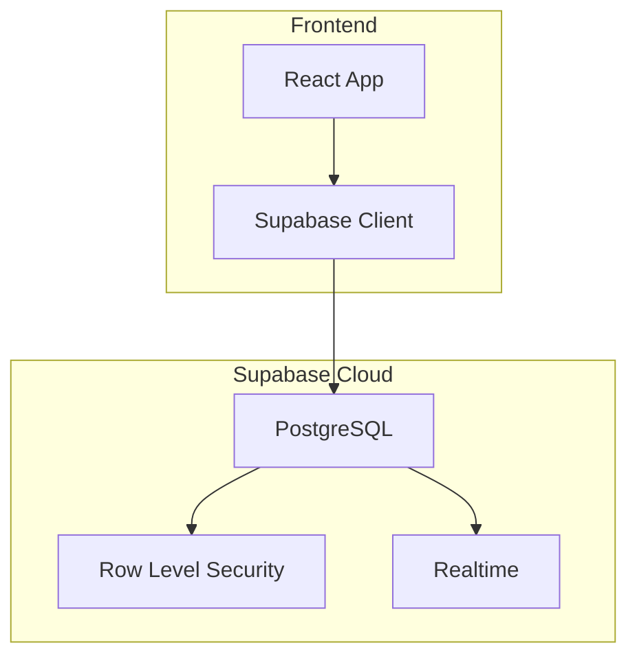
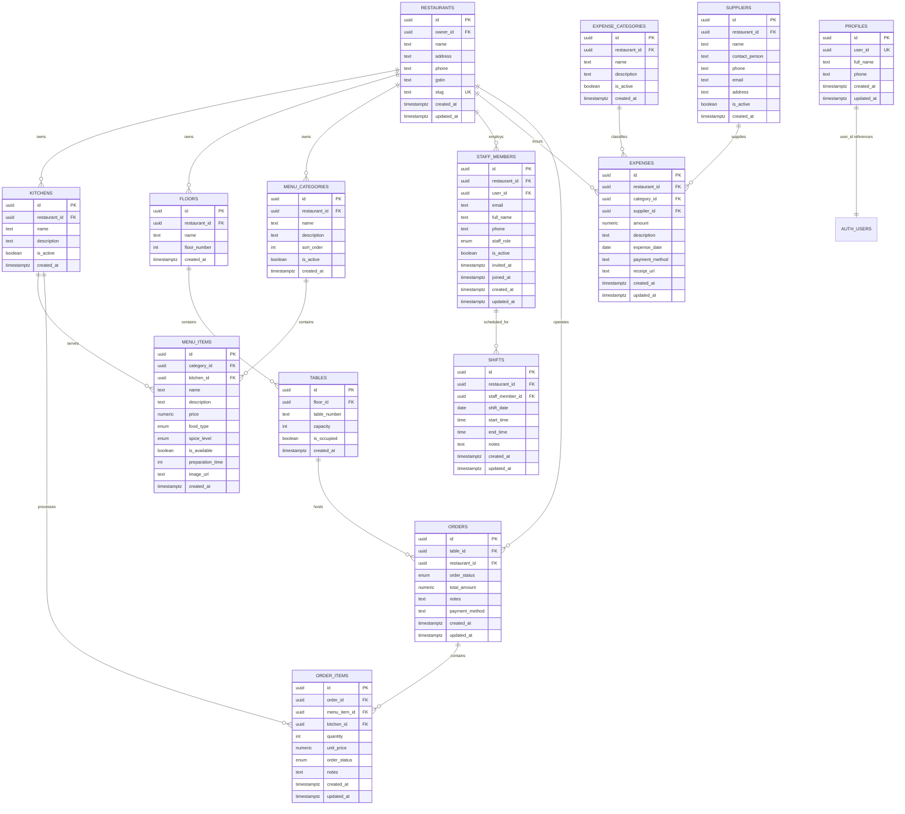
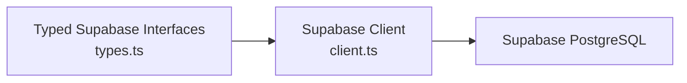

# Constraints & Data Validation

<cite>
**Referenced Files in This Document**
- [20251206042902_fc2b1d91-eb8e-4750-90c3-95b7e0feb6ba.sql](file://supabase/migrations/20251206042902_fc2b1d91-eb8e-4750-90c3-95b7e0feb6ba.sql)
- [20251206062448_4e2d7da9-9519-48ae-9d6c-bb1c994ed84a.sql](file://supabase/migrations/20251206062448_4e2d7da9-9519-48ae-9d6c-bb1c994ed84a.sql)
- [20251206081648_ef719884-b181-43d8-832a-02825f1b3a50.sql](file://supabase/migrations/20251206081648_ef719884-b181-43d8-832a-02825f1b3a50.sql)
- [20251206132719_11d13f91-c469-437f-9d98-63127362f20c.sql](file://supabase/migrations/20251206132719_11d13f91-c469-437f-9d98-63127362f20c.sql)
- [20251206133509_50399ee0-7c3e-4927-bf1a-00556ef24c8c.sql](file://supabase/migrations/20251206133509_50399ee0-7c3e-4927-bf1a-00556ef24c8c.sql)
- [20251206133955_231d3ef6-16e8-41de-8662-8dc09a54c6e3.sql](file://supabase/migrations/20251206133955_231d3ef6-16e8-41de-8662-8dc09a54c6e3.sql)
- [20251206134902_8243dfe0-8b9c-4c6d-9a42-278158976001.sql](file://supabase/migrations/20251206134902_8243dfe0-8b9c-4c6d-9a42-278158976001.sql)
- [20251212061838_061086f8-bf22-458f-b2e6-20f8199ee7ce.sql](file://supabase/migrations/20251212061838_061086f8-bf22-458f-b2e6-20f8199ee7ce.sql)
- [20260108133558_b2ed5e93-fda3-4022-bc45-a2fe64b46615.sql](file://supabase/migrations/20260108133558_b2ed5e93-fda3-4022-bc45-a2fe64b46615.sql)
- [types.ts](file://src/integrations/supabase/types.ts)
- [client.ts](file://src/integrations/supabase/client.ts)
- [DATABASE_ARCHITECTURE_ANALYSIS.md](file://DATABASE_ARCHITECTURE_ANALYSIS.md)
</cite>

## Table of Contents
1. [Introduction](#introduction)
2. [Project Structure](#project-structure)
3. [Core Components](#core-components)
4. [Architecture Overview](#architecture-overview)
5. [Detailed Component Analysis](#detailed-component-analysis)
6. [Dependency Analysis](#dependency-analysis)
7. [Performance Considerations](#performance-considerations)
8. [Troubleshooting Guide](#troubleshooting-guide)
9. [Conclusion](#conclusion)

## Introduction
This document explains how TableFlow Pro enforces data integrity through database constraints and validation mechanisms. It covers primary keys, unique constraints, defaults, generated values, foreign keys with cascade behaviors, and row-level security policies that reflect business rules. It also documents naming conventions, maintenance procedures, performance impacts, and troubleshooting steps for constraint-related issues.

## Project Structure
The database schema and constraints are defined in Supabase migrations. The frontend integrates with Supabase via a typed client and strongly-typed database interfaces. The architecture supports real-time updates and RLS-driven access control aligned with business roles.

**Diagram sources**
- [client.ts:11-17](file://src/integrations/supabase/client.ts#L11-L17)
- [20251206042902_fc2b1d91-eb8e-4750-90c3-95b7e0feb6ba.sql:110-119](file://supabase/migrations/20251206042902_fc2b1d91-eb8e-4750-90c3-95b7e0feb6ba.sql#L110-L119)
- [20251206042902_fc2b1d91-eb8e-4750-90c3-95b7e0feb6ba.sql:207-210](file://supabase/migrations/20251206042902_fc2b1d91-eb8e-4750-90c3-95b7e0feb6ba.sql#L207-L210)

**Section sources**
- [client.ts:11-17](file://src/integrations/supabase/client.ts#L11-L17)
- [types.ts:9-688](file://src/integrations/supabase/types.ts#L9-L688)

## Core Components
- Primary keys: All tables use UUID primary keys with default generation.
- Unique constraints: Unique indexes on user association and composite unique constraints.
- Defaults: Many columns specify sensible defaults for timestamps, booleans, enums, and numeric fields.
- Generated values: Triggers and functions update timestamps; a slug is generated and persisted.
- Foreign keys: Referential integrity enforced with cascades and SET NULL behaviors.
- Business rule validations: Enforced via defaults, enums, and RLS policies.
- Generated columns: Not present in the schema; computed values are handled by triggers/functions.

**Section sources**
- [20251206042902_fc2b1d91-eb8e-4750-90c3-95b7e0feb6ba.sql:7-14](file://supabase/migrations/20251206042902_fc2b1d91-eb8e-4750-90c3-95b7e0feb6ba.sql#L7-L14)
- [20251206062448_4e2d7da9-9519-48ae-9d6c-bb1c994ed84a.sql:1-64](file://supabase/migrations/20251206062448_4e2d7da9-9519-48ae-9d6c-bb1c994ed84a.sql#L1-L64)
- [20251206081648_ef719884-b181-43d8-832a-02825f1b3a50.sql:6-52](file://supabase/migrations/20251206081648_ef719884-b181-43d8-832a-02825f1b3a50.sql#L6-L52)
- [20251206133955_231d3ef6-16e8-41de-8662-8dc09a54c6e3.sql:48-63](file://supabase/migrations/20251206133955_231d3ef6-16e8-41de-8662-8dc09a54c6e3.sql#L48-L63)
- [20251206134902_8243dfe0-8b9c-4c6d-9a42-278158976001.sql:4-14](file://supabase/migrations/20251206134902_8243dfe0-8b9c-4c6d-9a42-278158976001.sql#L4-L14)

## Architecture Overview
The database enforces integrity at the schema level and augments it with RLS policies to align access with business roles. Triggers maintain audit fields. The frontend consumes a strongly-typed Supabase client.

**Diagram sources**
- [20251206042902_fc2b1d91-eb8e-4750-90c3-95b7e0feb6ba.sql:6-119](file://supabase/migrations/20251206042902_fc2b1d91-eb8e-4750-90c3-95b7e0feb6ba.sql#L6-L119)
- [20251206081648_ef719884-b181-43d8-832a-02825f1b3a50.sql:5-33](file://supabase/migrations/20251206081648_ef719884-b181-43d8-832a-02825f1b3a50.sql#L5-L33)
- [20251212061838_061086f8-bf22-458f-b2e6-20f8199ee7ce.sql:1-37](file://supabase/migrations/20251212061838_061086f8-bf22-458f-b2e6-20f8199ee7ce.sql#L1-L37)

## Detailed Component Analysis

### Primary Keys and Generated Identifiers
- All tables define a UUID primary key with a default generator.
- Implication: Deterministic global uniqueness across distributed writes; consistent foreign key relationships.

**Section sources**
- [20251206042902_fc2b1d91-eb8e-4750-90c3-95b7e0feb6ba.sql:7-14](file://supabase/migrations/20251206042902_fc2b1d91-eb8e-4750-90c3-95b7e0feb6ba.sql#L7-L14)
- [20251206081648_ef719884-b181-43d8-832a-02825f1b3a50.sql:6-19](file://supabase/migrations/20251206081648_ef719884-b181-43d8-832a-02825f1b3a50.sql#L6-L19)
- [20251212061838_061086f8-bf22-458f-b2e6-20f8199ee7ce.sql:2-9](file://supabase/migrations/20251212061838_061086f8-bf22-458f-b2e6-20f8199ee7ce.sql#L2-L9)

### Unique Constraints and Uniqueness Enforcement
- Unique constraints:
  - Profiles: user_id is unique and not null.
  - Restaurants: slug is unique and later made not null.
  - Staff members: composite unique on (restaurant_id, email).
- Enforcement: Database enforces uniqueness; application logic relies on these constraints to prevent duplicates.

**Section sources**
- [20251206042902_fc2b1d91-eb8e-4750-90c3-95b7e0feb6ba.sql:9](file://supabase/migrations/20251206042902_fc2b1d91-eb8e-4750-90c3-95b7e0feb6ba.sql#L9)
- [20251206062448_4e2d7da9-9519-48ae-9d6c-bb1c994ed84a.sql:2-3](file://supabase/migrations/20251206062448_4e2d7da9-9519-48ae-9d6c-bb1c994ed84a.sql#L2-L3)
- [20251206062448_4e2d7da9-9519-48ae-9d6c-bb1c994ed84a.sql:62-64](file://supabase/migrations/20251206062448_4e2d7da9-9519-48ae-9d6c-bb1c994ed84a.sql#L62-L64)
- [20251206081648_ef719884-b181-43d8-832a-02825f1b3a50.sql:19](file://supabase/migrations/20251206081648_ef719884-b181-43d8-832a-02825f1b3a50.sql#L19)

### Defaults and Generated Values
- Defaults:
  - Timestamps: created_at and updated_at commonly default to now().
  - Booleans: is_active defaults to true; is_occupied defaults to false.
  - Numerics: capacity defaults to 4; total_amount defaults to 0; preparation_time defaults to 15.
  - Enums: order_status defaults to pending; food_type defaults to veg; spice_level defaults to medium; staff_role defaults to waiter.
  - Text: payment_method defaults to null; others default to null unless otherwise specified.
- Generated values:
  - Slug: generated via function and trigger before insert; later made not null.
  - Updated_at: updated automatically via triggers.

**Section sources**
- [20251206042902_fc2b1d91-eb8e-4750-90c3-95b7e0feb6ba.sql:12-13](file://supabase/migrations/20251206042902_fc2b1d91-eb8e-4750-90c3-95b7e0feb6ba.sql#L12-L13)
- [20251206042902_fc2b1d91-eb8e-4750-90c3-95b7e0feb6ba.sql:52-54](file://supabase/migrations/20251206042902_fc2b1d91-eb8e-4750-90c3-95b7e0feb6ba.sql#L52-L54)
- [20251206042902_fc2b1d91-eb8e-4750-90c3-95b7e0feb6ba.sql:75-78](file://supabase/migrations/20251206042902_fc2b1d91-eb8e-4750-90c3-95b7e0feb6ba.sql#L75-L78)
- [20251206042902_fc2b1d91-eb8e-4750-90c3-95b7e0feb6ba.sql:89-93](file://supabase/migrations/20251206042902_fc2b1d91-eb8e-4750-90c3-95b7e0feb6ba.sql#L89-L93)
- [20251206062448_4e2d7da9-9519-48ae-9d6c-bb1c994ed84a.sql:52-55](file://supabase/migrations/20251206062448_4e2d7da9-9519-48ae-9d6c-bb1c994ed84a.sql#L52-L55)
- [20251206062448_4e2d7da9-9519-48ae-9d6c-bb1c994ed84a.sql:58-60](file://supabase/migrations/20251206062448_4e2d7da9-9519-48ae-9d6c-bb1c994ed84a.sql#L58-L60)
- [20251206042902_fc2b1d91-eb8e-4750-90c3-95b7e0feb6ba.sql:174-181](file://supabase/migrations/20251206042902_fc2b1d91-eb8e-4750-90c3-95b7e0feb6ba.sql#L174-L181)
- [20251206042902_fc2b1d91-eb8e-4750-90c3-95b7e0feb6ba.sql:183-187](file://supabase/migrations/20251206042902_fc2b1d91-eb8e-4750-90c3-95b7e0feb6ba.sql#L183-L187)

### Foreign Keys, Cascade Behaviors, and Referenced Columns
- Cascade delete/update behaviors:
  - Profiles.user_id -> auth.users(id) with ON DELETE CASCADE.
  - Restaurants.owner_id -> auth.users(id) with ON DELETE CASCADE.
  - Floors.restaurant_id -> restaurants(id) with ON DELETE CASCADE.
  - Tables.floor_id -> floors(id) with ON DELETE CASCADE.
  - Menu_categories.restaurant_id -> restaurants(id) with ON DELETE CASCADE.
  - Menu_items.category_id -> menu_categories(id) with ON DELETE CASCADE; kitchen_id with ON DELETE SET NULL.
  - Orders.table_id -> tables(id) with ON DELETE SET NULL; restaurant_id with ON DELETE CASCADE.
  - Order_items.order_id -> orders(id) with ON DELETE CASCADE; menu_item_id with ON DELETE SET NULL; kitchen_id with ON DELETE SET NULL.
  - Staff_members.restaurant_id -> restaurants(id) with ON DELETE CASCADE; user_id -> auth.users(id) with ON DELETE CASCADE.
  - Shifts.restaurant_id -> restaurants(id) with ON DELETE CASCADE; staff_member_id -> staff_members(id) with ON DELETE CASCADE.
  - Expense_categories.restaurant_id -> restaurants(id) with ON DELETE CASCADE.
  - Expenses.restaurant_id -> restaurants(id) with ON DELETE CASCADE; category_id with ON DELETE SET NULL; supplier_id with ON DELETE SET NULL.
- Notes:
  - Some child tables use SET NULL for optional relationships (e.g., kitchen_id in menu_items/order_items).
  - Others use CASCADE to propagate deletions upward (e.g., restaurants -> floors/tables).

**Section sources**
- [20251206042902_fc2b1d91-eb8e-4750-90c3-95b7e0feb6ba.sql:19](file://supabase/migrations/20251206042902_fc2b1d91-eb8e-4750-90c3-95b7e0feb6ba.sql#L19)
- [20251206042902_fc2b1d91-eb8e-4750-90c3-95b7e0feb6ba.sql:41](file://supabase/migrations/20251206042902_fc2b1d91-eb8e-4750-90c3-95b7e0feb6ba.sql#L41)
- [20251206042902_fc2b1d91-eb8e-4750-90c3-95b7e0feb6ba.sql:50](file://supabase/migrations/20251206042902_fc2b1d91-eb8e-4750-90c3-95b7e0feb6ba.sql#L50)
- [20251206042902_fc2b1d91-eb8e-4750-90c3-95b7e0feb6ba.sql:72](file://supabase/migrations/20251206042902_fc2b1d91-eb8e-4750-90c3-95b7e0feb6ba.sql#L72)
- [20251206042902_fc2b1d91-eb8e-4750-90c3-95b7e0feb6ba.sql:87-93](file://supabase/migrations/20251206042902_fc2b1d91-eb8e-4750-90c3-95b7e0feb6ba.sql#L87-L93)
- [20251206042902_fc2b1d91-eb8e-4750-90c3-95b7e0feb6ba.sql:99-107](file://supabase/migrations/20251206042902_fc2b1d91-eb8e-4750-90c3-95b7e0feb6ba.sql#L99-L107)
- [20251206081648_ef719884-b181-43d8-832a-02825f1b3a50.sql:8-18](file://supabase/migrations/20251206081648_ef719884-b181-43d8-832a-02825f1b3a50.sql#L8-L18)
- [20251206081648_ef719884-b181-43d8-832a-02825f1b3a50.sql:25-32](file://supabase/migrations/20251206081648_ef719884-b181-43d8-832a-02825f1b3a50.sql#L25-L32)
- [20251212061838_061086f8-bf22-458f-b2e6-20f8199ee7ce.sql:27-36](file://supabase/migrations/20251212061838_061086f8-bf22-458f-b2e6-20f8199ee7ce.sql#L27-L36)

### Business Rule Validations via Constraints and Defaults
- Price validation:
  - menu_items.price is a numeric field; defaults and application-side checks ensure non-negative pricing.
- Capacity limits:
  - tables.capacity defaults to 4; application logic should constrain reservations to capacity.
- Status transitions:
  - order_status and order_items.status use enums with predefined states; application enforces valid transitions.
- Availability and kitchen assignment:
  - menu_items.is_available defaults to true; kitchen_id may be null (SET NULL on delete).
- Payment method:
  - orders.payment_method is nullable; comments clarify allowed values.

**Section sources**
- [20251206042902_fc2b1d91-eb8e-4750-90c3-95b7e0feb6ba.sql:75](file://supabase/migrations/20251206042902_fc2b1d91-eb8e-4750-90c3-95b7e0feb6ba.sql#L75)
- [20251206042902_fc2b1d91-eb8e-4750-90c3-95b7e0feb6ba.sql:52](file://supabase/migrations/20251206042902_fc2b1d91-eb8e-4750-90c3-95b7e0feb6ba.sql#L52)
- [20251206042902_fc2b1d91-eb8e-4750-90c3-95b7e0feb6ba.sql:89](file://supabase/migrations/20251206042902_fc2b1d91-eb8e-4750-90c3-95b7e0feb6ba.sql#L89)
- [20251206042902_fc2b1d91-eb8e-4750-90c3-95b7e0feb6ba.sql:103](file://supabase/migrations/20251206042902_fc2b1d91-eb8e-4750-90c3-95b7e0feb6ba.sql#L103)
- [20260108133558_b2ed5e93-fda3-4022-bc45-a2fe64b46615.sql:1-6](file://supabase/migrations/20260108133558_b2ed5e93-fda3-4022-bc45-a2fe64b46615.sql#L1-L6)

### Row-Level Security (RLS) and Access Control
- All tables enable RLS.
- Policies grant access based on ownership or role:
  - Profiles: users can manage their own profile.
  - Restaurants: owners can manage; staff can view via helper functions.
  - Kitchens/Floors/Tables/Menu_*: access via restaurant ownership or management roles.
  - Orders/Order_items: staff can view/manage via restaurant membership checks.
  - Expenses/Expense_categories/Suppliers: owners manage; staff can view via management access.
- Helper functions:
  - is_restaurant_owner, has_management_access, get_staff_role, can_access_restaurant_as_staff, get_user_email, has_unlinked_staff_record_by_email.

**Section sources**
- [20251206042902_fc2b1d91-eb8e-4750-90c3-95b7e0feb6ba.sql:110-119](file://supabase/migrations/20251206042902_fc2b1d91-eb8e-4750-90c3-95b7e0feb6ba.sql#L110-L119)
- [20251206042902_fc2b1d91-eb8e-4750-90c3-95b7e0feb6ba.sql:121-172](file://supabase/migrations/20251206042902_fc2b1d91-eb8e-4750-90c3-95b7e0feb6ba.sql#L121-L172)
- [20251206081648_ef719884-b181-43d8-832a-02825f1b3a50.sql:39-80](file://supabase/migrations/20251206081648_ef719884-b181-43d8-832a-02825f1b3a50.sql#L39-L80)
- [20251206133955_231d3ef6-16e8-41de-8662-8dc09a54c6e3.sql:48-63](file://supabase/migrations/20251206133955_231d3ef6-16e8-41de-8662-8dc09a54c6e3.sql#L48-L63)
- [20251206134902_8243dfe0-8b9c-4c6d-9a42-278158976001.sql:4-76](file://supabase/migrations/20251206134902_8243dfe0-8b9c-4c6d-9a42-278158976001.sql#L4-L76)

### Generated Columns and Computed Behavior
- Not present as explicit generated columns in the schema.
- Computed-like behavior:
  - Slug generation via function and trigger.
  - Updated_at maintained via trigger.
  - Audit timestamps default to current time.

**Section sources**
- [20251206062448_4e2d7da9-9519-48ae-9d6c-bb1c994ed84a.sql:5-64](file://supabase/migrations/20251206062448_4e2d7da9-9519-48ae-9d6c-bb1c994ed84a.sql#L5-L64)
- [20251206042902_fc2b1d91-eb8e-4750-90c3-95b7e0feb6ba.sql:174-187](file://supabase/migrations/20251206042902_fc2b1d91-eb8e-4750-90c3-95b7e0feb6ba.sql#L174-L187)

### Constraint Naming Conventions
- Foreign key constraints follow a pattern: "<table>_<column>_fkey".
- Examples:
  - expense_categories_restaurant_id_fkey
  - expenses_category_id_fkey
  - orders_restaurant_id_fkey
  - order_items_order_id_fkey
  - staff_members_restaurant_id_fkey
- These names are visible in the generated types and help identify relationships.

**Section sources**
- [types.ts:42-50](file://src/integrations/supabase/types.ts#L42-L50)
- [types.ts:92-114](file://src/integrations/supabase/types.ts#L92-L114)
- [types.ts:376-391](file://src/integrations/supabase/types.ts#L376-L391)
- [types.ts:318-340](file://src/integrations/supabase/types.ts#L318-L340)
- [types.ts:559-567](file://src/integrations/supabase/types.ts#L559-L567)

### Maintenance Procedures
- Adding a new column with constraints:
  - Define NOT NULL, DEFAULT, or UNIQUE in the ALTER TABLE statement.
  - For enums, ensure the enum type exists before applying.
- Altering defaults or adding triggers:
  - Use CREATE OR REPLACE FUNCTION/TRIGGER to update behavior.
- Indexes:
  - Create indexes on frequently filtered/sorted columns (e.g., expenses restaurant_id, expense_date).
- RLS:
  - Add or modify policies using CREATE POLICY with helper functions to avoid direct auth lookup in policies.

**Section sources**
- [20251212061838_061086f8-bf22-458f-b2e6-20f8199ee7ce.sql:74-77](file://supabase/migrations/20251212061838_061086f8-bf22-458f-b2e6-20f8199ee7ce.sql#L74-L77)
- [20251206042902_fc2b1d91-eb8e-4750-90c3-95b7e0feb6ba.sql:174-187](file://supabase/migrations/20251206042902_fc2b1d91-eb8e-4750-90c3-95b7e0feb6ba.sql#L174-L187)

## Dependency Analysis
- Application depends on Supabase client and typed database interfaces.
- Frontend operations are constrained by RLS policies and database defaults.
- Foreign keys ensure referential integrity across related entities.

**Diagram sources**
- [types.ts:9-688](file://src/integrations/supabase/types.ts#L9-L688)
- [client.ts:11-17](file://src/integrations/supabase/client.ts#L11-L17)

**Section sources**
- [types.ts:9-688](file://src/integrations/supabase/types.ts#L9-L688)
- [client.ts:11-17](file://src/integrations/supabase/client.ts#L11-L17)

## Performance Considerations
- Indexes:
  - Added indexes on expense_categories, suppliers, and expenses improve query performance for filtering and joins.
- Triggers:
  - update_updated_at triggers add minimal overhead on updates; ensure they are only on tables requiring audit trails.
- RLS:
  - Policies add CPU overhead per query; keep them efficient and avoid heavy subqueries where possible.
- Data types:
  - Using numeric/decimal for currency avoids floating-point precision issues and simplifies aggregation.

**Section sources**
- [20251212061838_061086f8-bf22-458f-b2e6-20f8199ee7ce.sql:74-77](file://supabase/migrations/20251212061838_061086f8-bf22-458f-b2e6-20f8199ee7ce.sql#L74-L77)
- [20251206042902_fc2b1d91-eb8e-4750-90c3-95b7e0feb6ba.sql:174-187](file://supabase/migrations/20251206042902_fc2b1d91-eb8e-4750-90c3-95b7e0feb6ba.sql#L174-L187)

## Troubleshooting Guide
- Unique constraint violation:
  - Symptom: Insert/update rejected due to duplicate slug or email.
  - Resolution: Ensure slug generation runs before insert; verify composite unique on (restaurant_id, email) is respected.
- Foreign key violation:
  - Symptom: Insert/update fails because parent record does not exist.
  - Resolution: Create parent records first; confirm cascade behaviors match expectations.
- RLS denial:
  - Symptom: Query returns empty or access denied.
  - Resolution: Verify user’s role and restaurant membership via helper functions; ensure policies are created and not conflicting.
- Default mismatch:
  - Symptom: Unexpected nulls or incorrect defaults.
  - Resolution: Confirm default clauses in schema and application defaults align.
- Trigger not firing:
  - Symptom: updated_at not updating.
  - Resolution: Verify triggers exist and are enabled; check function permissions.

**Section sources**
- [20251206062448_4e2d7da9-9519-48ae-9d6c-bb1c994ed84a.sql:52-64](file://supabase/migrations/20251206062448_4e2d7da9-9519-48ae-9d6c-bb1c994ed84a.sql#L52-L64)
- [20251206042902_fc2b1d91-eb8e-4750-90c3-95b7e0feb6ba.sql:174-187](file://supabase/migrations/20251206042902_fc2b1d91-eb8e-4750-90c3-95b7e0feb6ba.sql#L174-L187)
- [20251206133955_231d3ef6-16e8-41de-8662-8dc09a54c6e3.sql:48-63](file://supabase/migrations/20251206133955_231d3ef6-16e8-41de-8662-8dc09a54c6e3.sql#L48-L63)

## Conclusion
TableFlow Pro’s database enforces robust data integrity through primary keys, unique constraints, defaults, foreign keys with carefully chosen cascade behaviors, and RLS policies. Together, these mechanisms ensure consistent business rules, prevent invalid states, and provide secure, auditable operations across the application.