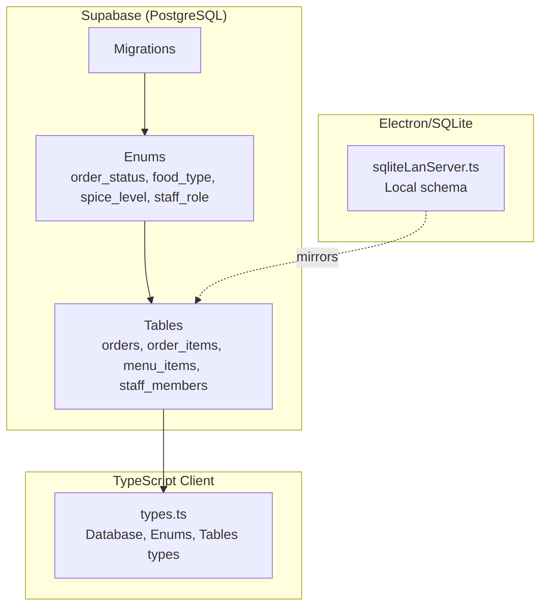
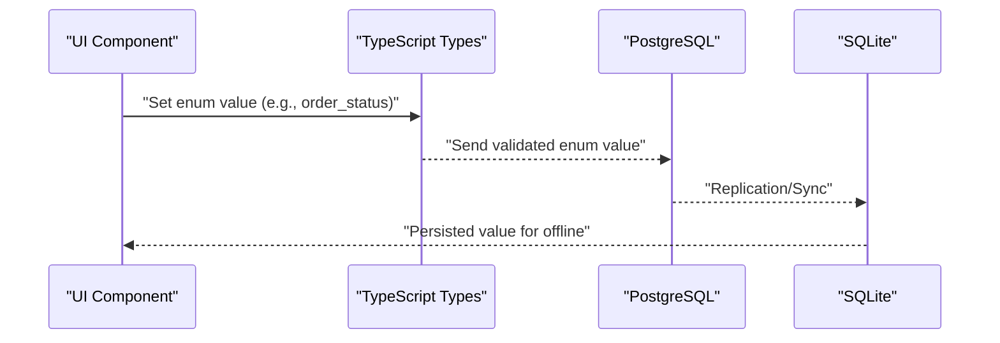
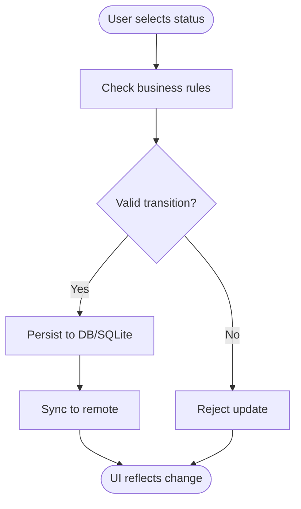
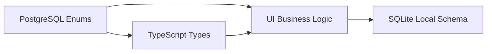

# Data Types & Enumerations

<cite>
**Referenced Files in This Document**
- [types.ts](file://src/integrations/supabase/types.ts)
- [20251206042902_fc2b1d91-eb8e-4750-90c3-95b7e0feb6ba.sql](file://supabase/migrations/20251206042902_fc2b1d91-eb8e-4750-90c3-95b7e0feb6ba.sql)
- [20251206081648_ef719884-b181-43d8-832a-02825f1b3a50.sql](file://supabase/migrations/20251206081648_ef719884-b181-43d8-832a-02825f1b3a50.sql)
- [20251206132719_11d13f91-c469-437f-9d98-63127362f20c.sql](file://supabase/migrations/20251206132719_11d13f91-c469-437f-9d98-63127362f20c.sql)
- [20251206133955_231d3ef6-16e8-41de-8662-8dc09a54c6e3.sql](file://supabase/migrations/20251206133955_231d3ef6-16e8-41de-8662-8dc09a54c6e3.sql)
- [20251206134902_8243dfe0-8b9c-4c6d-9a42-278158976001.sql](file://supabase/migrations/20251206134902_8243dfe0-8b9c-4c6d-9a42-278158976001.sql)
- [20260410120000_add_gst_percentages.sql](file://supabase/migrations/20260410120000_add_gst_percentages.sql)
- [Orders.tsx](file://src/pages/dashboard/Orders.tsx)
- [KitchenView.tsx](file://src/pages/dashboard/KitchenView.tsx)
- [Settings.tsx](file://src/pages/dashboard/Settings.tsx)
- [sqliteLanServer.ts](file://electron/services/sqliteLanServer.ts)
- [DATABASE_CONNECTIVITY_MAP.md](file://DATABASE_CONNECTIVITY_MAP.md)
</cite>

## Table of Contents
1. [Introduction](#introduction)
2. [Project Structure](#project-structure)
3. [Core Components](#core-components)
4. [Architecture Overview](#architecture-overview)
5. [Detailed Component Analysis](#detailed-component-analysis)
6. [Dependency Analysis](#dependency-analysis)
7. [Performance Considerations](#performance-considerations)
8. [Troubleshooting Guide](#troubleshooting-guide)
9. [Conclusion](#conclusion)

## Introduction
This document explains TableFlow Pro’s data types and enumerations, focusing on how custom enums enforce data consistency and business rules. It covers:
- Enumerations: food_type, order_status, spice_level, staff_role
- Numeric types for prices, quantities, GST percentages
- String types with constraints and validation
- Examples of enum usage in queries and UI flows
- Backward compatibility and schema migration strategies

## Project Structure
The schema and type definitions originate from Supabase migrations and are reflected in TypeScript types for client-side safety. Local Electron/SQLite schemas also define equivalent types for offline-first operation.

**Diagram sources**
- [20251206042902_fc2b1d91-eb8e-4750-90c3-95b7e0feb6ba.sql:1-210](file://supabase/migrations/20251206042902_fc2b1d91-eb8e-4750-90c3-95b7e0feb6ba.sql#L1-L210)
- [types.ts:679-684](file://src/integrations/supabase/types.ts#L679-L684)
- [sqliteLanServer.ts:316-357](file://electron/services/sqliteLanServer.ts#L316-L357)

**Section sources**
- [20251206042902_fc2b1d91-eb8e-4750-90c3-95b7e0feb6ba.sql:1-210](file://supabase/migrations/20251206042902_fc2b1d91-eb8e-4750-90c3-95b7e0feb6ba.sql#L1-L210)
- [types.ts:679-684](file://src/integrations/supabase/types.ts#L679-L684)
- [sqliteLanServer.ts:316-357](file://electron/services/sqliteLanServer.ts#L316-L357)

## Core Components
- Enumerations
  - food_type: veg, non_veg, egg
  - order_status: pending, cooking, ready, served, cancelled
  - spice_level: mild, medium, spicy, extra_spicy
  - staff_role: owner, manager, waiter, chef
- Numeric types
  - Prices and GST amounts: DECIMAL(10,2) in PostgreSQL; REAL in SQLite
  - Quantities: INTEGER
  - GST percentages: NUMERIC(5,2) in PostgreSQL; REAL in SQLite
- String types
  - Text fields: TEXT with constraints enforced by application logic and database defaults
  - Unique identifiers: UUID in PostgreSQL; TEXT primary keys in SQLite

These types are defined in migrations and mirrored in TypeScript types and local SQLite schema.

**Section sources**
- [20251206042902_fc2b1d91-eb8e-4750-90c3-95b7e0feb6ba.sql:1-82](file://supabase/migrations/20251206042902_fc2b1d91-eb8e-4750-90c3-95b7e0feb6ba.sql#L1-L82)
- [types.ts:679-684](file://src/integrations/supabase/types.ts#L679-L684)
- [sqliteLanServer.ts:316-357](file://electron/services/sqliteLanServer.ts#L316-L357)
- [20260410120000_add_gst_percentages.sql:1-8](file://supabase/migrations/20260410120000_add_gst_percentages.sql#L1-L8)

## Architecture Overview
The enum system enforces consistency across:
- Database schema (PostgreSQL enums)
- Strongly typed client (TypeScript enums)
- Offline-first local storage (SQLite TEXT with defaults)
- Business logic (UI updates and validations)

**Diagram sources**
- [types.ts:679-684](file://src/integrations/supabase/types.ts#L679-L684)
- [Orders.tsx:451-485](file://src/pages/dashboard/Orders.tsx#L451-L485)
- [KitchenView.tsx:280-345](file://src/pages/dashboard/KitchenView.tsx#L280-L345)
- [sqliteLanServer.ts:316-357](file://electron/services/sqliteLanServer.ts#L316-L357)

## Detailed Component Analysis

### Enumerations: Definition, Usage, and Validation

#### Enum Definitions
- PostgreSQL enums are created in the initial migration and referenced by tables.
- TypeScript types mirror these enums for compile-time safety.
- SQLite local schema uses TEXT with defaults to approximate enum semantics.

Key definitions:
- food_type: defined in initial migration and used in menu_items
- order_status: defined in initial migration and used in orders and order_items
- spice_level: defined in initial migration and used in menu_items
- staff_role: defined later and used in staff_members

**Section sources**
- [20251206042902_fc2b1d91-eb8e-4750-90c3-95b7e0feb6ba.sql:1-82](file://supabase/migrations/20251206042902_fc2b1d91-eb8e-4750-90c3-95b7e0feb6ba.sql#L1-L82)
- [20251206081648_ef719884-b181-43d8-832a-02825f1b3a50.sql:2-20](file://supabase/migrations/20251206081648_ef719884-b181-43d8-832a-02825f1b3a50.sql#L2-L20)
- [types.ts:679-684](file://src/integrations/supabase/types.ts#L679-L684)
- [sqliteLanServer.ts:346-357](file://electron/services/sqliteLanServer.ts#L346-L357)

#### Enforcement of Data Consistency
- Database-level: PostgreSQL enums restrict values to predefined sets.
- Client-level: TypeScript enums prevent invalid values at compile time.
- Offline-level: SQLite uses TEXT with defaults to maintain acceptable parity.

Validation examples in code:
- Updating order status transitions through pending → cooking → ready → served, with cancellation allowed at any time.
- Kitchen view updates order items’ statuses with conditional checks.

**Diagram sources**
- [Orders.tsx:451-485](file://src/pages/dashboard/Orders.tsx#L451-L485)
- [KitchenView.tsx:280-345](file://src/pages/dashboard/KitchenView.tsx#L280-L345)

**Section sources**
- [Orders.tsx:451-485](file://src/pages/dashboard/Orders.tsx#L451-L485)
- [KitchenView.tsx:280-345](file://src/pages/dashboard/KitchenView.tsx#L280-L345)

#### Example Queries and Business Rule Enforcement
- Orders page updates order status and frees the table upon served/cancelled.
- Kitchen view updates order items and cascades order status when all items are ready.
- These flows rely on enum values being valid and consistent across DB and UI.

**Section sources**
- [Orders.tsx:451-485](file://src/pages/dashboard/Orders.tsx#L451-L485)
- [KitchenView.tsx:280-345](file://src/pages/dashboard/KitchenView.tsx#L280-L345)

### Numeric Data Types: Precision, Scale, and Constraints

#### Prices and Amounts
- PostgreSQL: DECIMAL(10,2) ensures up to 99,999,999.99 with two decimal places.
- SQLite: REAL for prices; defaults align with typical currency representation.

Implications:
- Prevents floating-point rounding errors for financial calculations.
- Ensures consistent display and accounting.

**Section sources**
- [20251206042902_fc2b1d91-eb8e-4750-90c3-95b7e0feb6ba.sql:75-82](file://supabase/migrations/20251206042902_fc2b1d91-eb8e-4750-90c3-95b7e0feb6ba.sql#L75-L82)
- [sqliteLanServer.ts:352-357](file://electron/services/sqliteLanServer.ts#L352-L357)

#### Quantities
- Both PostgreSQL and SQLite use INTEGER for quantities.
- Application logic should validate non-negative values and reasonable upper bounds.

**Section sources**
- [20251206042902_fc2b1d91-eb8e-4750-90c3-95b7e0feb6ba.sql:102-108](file://supabase/migrations/20251206042902_fc2b1d91-eb8e-4750-90c3-95b7e0feb6ba.sql#L102-L108)
- [sqliteLanServer.ts:316-323](file://electron/services/sqliteLanServer.ts#L316-L323)

#### GST Percentages
- PostgreSQL: NUMERIC(5,2) supports up to 999.99 (e.g., 999.99%).
- SQLite: REAL for percentages; UI enforces 0–100 range with step=0.01.

**Section sources**
- [20260410120000_add_gst_percentages.sql:1-8](file://supabase/migrations/20260410120000_add_gst_percentages.sql#L1-L8)
- [Settings.tsx:240-265](file://src/pages/dashboard/Settings.tsx#L240-L265)
- [DATABASE_CONNECTIVITY_MAP.md:283-284](file://DATABASE_CONNECTIVITY_MAP.md#L283-L284)

### String Data Types: Length Constraints and Validation

- TEXT fields are used for names, descriptions, URLs, and identifiers.
- Constraints are enforced by:
  - Database defaults (e.g., NOT NULL, DEFAULT values)
  - Application-level validation (e.g., numeric inputs for percentages)
  - Unique constraints (e.g., restaurant slug)

Examples:
- Restaurant slug is generated and enforced as UNIQUE.
- Price and GST fields accept numeric input with step and range validation.

**Section sources**
- [20251206062448_4e2d7da9-9519-48ae-9d6c-bb1c994ed84a.sql:1-64](file://supabase/migrations/20251206062448_4e2d7da9-9519-48ae-9d6c-bb1c994ed84a.sql#L1-L64)
- [Settings.tsx:228-265](file://src/pages/dashboard/Settings.tsx#L228-L265)

### Schema Evolution and Backward Compatibility

#### Adding New Columns with Defaults
- Adding payment_method and GST percentage columns preserves existing rows by providing defaults.
- Comments clarify intended values and units.

**Section sources**
- [20260410120000_add_gst_percentages.sql:1-8](file://supabase/migrations/20260410120000_add_gst_percentages.sql#L1-L8)
- [202512060108133558_b2ed5e93-fda3-4022-bc45-a2fe64b46615.sql:1-6](file://supabase/migrations/20251206133509_50399ee0-7c3e-4927-bf1a-00556ef24c8c.sql#L1-L6)

#### Mirroring Enums Across Schemas
- PostgreSQL enums are mirrored in TypeScript types for compile-time safety.
- SQLite uses TEXT with defaults to approximate enum values, ensuring offline parity.

**Section sources**
- [types.ts:679-684](file://src/integrations/supabase/types.ts#L679-L684)
- [sqliteLanServer.ts:346-357](file://electron/services/sqliteLanServer.ts#L346-L357)

## Dependency Analysis
The enum system spans three layers: database, client types, and local storage. Dependencies are:

**Diagram sources**
- [20251206042902_fc2b1d91-eb8e-4750-90c3-95b7e0feb6ba.sql:1-82](file://supabase/migrations/20251206042902_fc2b1d91-eb8e-4750-90c3-95b7e0feb6ba.sql#L1-L82)
- [types.ts:679-684](file://src/integrations/supabase/types.ts#L679-L684)
- [Orders.tsx:451-485](file://src/pages/dashboard/Orders.tsx#L451-L485)
- [KitchenView.tsx:280-345](file://src/pages/dashboard/KitchenView.tsx#L280-L345)
- [sqliteLanServer.ts:316-357](file://electron/services/sqliteLanServer.ts#L316-L357)

**Section sources**
- [20251206042902_fc2b1d91-eb8e-4750-90c3-95b7e0feb6ba.sql:1-82](file://supabase/migrations/20251206042902_fc2b1d91-eb8e-4750-90c3-95b7e0feb6ba.sql#L1-L82)
- [types.ts:679-684](file://src/integrations/supabase/types.ts#L679-L684)
- [Orders.tsx:451-485](file://src/pages/dashboard/Orders.tsx#L451-L485)
- [KitchenView.tsx:280-345](file://src/pages/dashboard/KitchenView.tsx#L280-L345)
- [sqliteLanServer.ts:316-357](file://electron/services/sqliteLanServer.ts#L316-L357)

## Performance Considerations
- Use appropriate numeric scales to avoid overflow and maintain precision.
- Prefer ENUM types for frequently filtered fields (e.g., order_status) to leverage index-friendly discrete values.
- Keep offline-local TEXT enums aligned with server enums to minimize conversion overhead.

## Troubleshooting Guide
Common issues and resolutions:
- Invalid enum values
  - Symptom: Update fails with “invalid enum value”.
  - Resolution: Ensure values match server enums; use TypeScript enums for compile-time checks.
- Status transition errors
  - Symptom: Cannot move from pending to ready without cooking.
  - Resolution: Follow kitchen flow logic; update items to cooking first, then ready.
- GST percentage out of range
  - Symptom: UI rejects values outside 0–100.
  - Resolution: Adjust input to valid range; backend enforces NUMERIC(5,2).

**Section sources**
- [Orders.tsx:451-485](file://src/pages/dashboard/Orders.tsx#L451-L485)
- [KitchenView.tsx:280-345](file://src/pages/dashboard/KitchenView.tsx#L280-L345)
- [Settings.tsx:240-265](file://src/pages/dashboard/Settings.tsx#L240-L265)

## Conclusion
TableFlow Pro’s enum system combines PostgreSQL enums, TypeScript types, and SQLite TEXT defaults to enforce data consistency and support robust business rules. Numeric types are carefully scaled for financial accuracy, while string fields are validated through application logic and database defaults. Migrations add new capabilities with backward-compatible defaults, preserving existing data integrity.