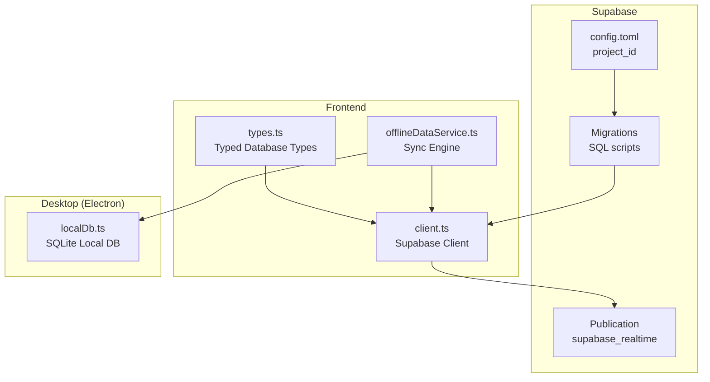
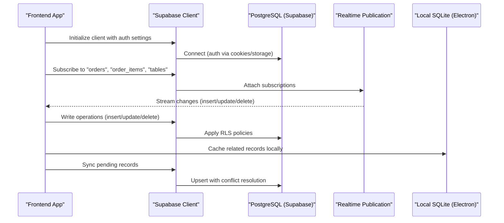
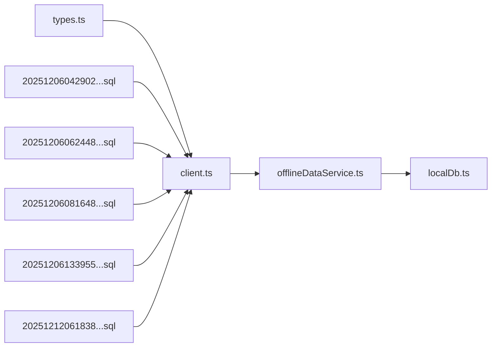

# Database Schema & Data Model

<cite>
**Referenced Files in This Document**
- [config.toml](file://supabase/config.toml)
- [client.ts](file://src/integrations/supabase/client.ts)
- [types.ts](file://src/integrations/supabase/types.ts)
- [20251206042902_fc2b1d91-eb8e-4750-90c3-95b7e0feb6ba.sql](file://supabase/migrations/20251206042902_fc2b1d91-eb8e-4750-90c3-95b7e0feb6ba.sql)
- [20251206062448_4e2d7da9-9519-48ae-9d6c-bb1c994ed84a.sql](file://supabase/migrations/20251206062448_4e2d7da9-9519-48ae-9d6c-bb1c994ed84a.sql)
- [20251206081648_ef719884-b181-43d8-832a-02825f1b3a50.sql](file://supabase/migrations/20251206081648_ef719884-b181-43d8-832a-02825f1b3a50.sql)
- [20251206132719_11d13f91-c469-437f-9d98-63127362f20c.sql](file://supabase/migrations/20251206132719_11d13f91-c469-437f-9d98-63127362f20c.sql)
- [20251206133509_50399ee0-7c3e-4927-bf1a-00556ef24c8c.sql](file://supabase/migrations/20251206133509_50399ee0-7c3e-4927-bf1a-00556ef24c8c.sql)
- [20251206133955_231d3ef6-16e8-41de-8662-8dc09a54c6e3.sql](file://supabase/migrations/20251206133955_231d3ef6-16e8-41de-8662-8dc09a54c6e3.sql)
- [20251206134902_8243dfe0-8b9c-4c6d-9a42-278158976001.sql](file://supabase/migrations/20251206134902_8243dfe0-8b9c-4c6d-9a42-278158976001.sql)
- [20251212061838_061086f8-bf22-458f-b2e6-20f8199ee7ce.sql](file://supabase/migrations/20251212061838_061086f8-bf22-458f-b2e6-20f8199ee7ce.sql)
- [20260410120000_add_gst_percentages.sql](file://supabase/migrations/20260410120000_add_gst_percentages.sql)
- [20260411120000_add_print_qr_on_bill.sql](file://supabase/migrations/20260411120000_add_print_qr_on_bill.sql)
- [offlineDataService.ts](file://src/services/offlineDataService.ts)
- [localDb.ts](file://electron/services/localDb.ts)
- [package.json](file://package.json)
</cite>

## Table of Contents
1. [Introduction](#introduction)
2. [Project Structure](#project-structure)
3. [Core Components](#core-components)
4. [Architecture Overview](#architecture-overview)
5. [Detailed Component Analysis](#detailed-component-analysis)
6. [Dependency Analysis](#dependency-analysis)
7. [Performance Considerations](#performance-considerations)
8. [Troubleshooting Guide](#troubleshooting-guide)
9. [Conclusion](#conclusion)
10. [Appendices](#appendices)

## Introduction
This document describes the Supabase-backed database schema and data model for TableFlow Pro. It covers entity definitions, relationships, constraints, enumerated types, triggers, policies, and schema evolution. It also documents integration with Supabase authentication and real-time, offline synchronization strategies, and outlines security, privacy, and access control mechanisms.

## Project Structure
The database is defined and evolved via Supabase migrations under the supabase/migrations directory. The frontend integrates with Supabase using a typed client and shared types. Offline capabilities are handled by an Electron-based local database and a synchronization service.



**Diagram sources**
- [config.toml:1-1](file://supabase/config.toml#L1-L1)
- [20251206042902_fc2b1d91-eb8e-4750-90c3-95b7e0feb6ba.sql:1-210](file://supabase/migrations/20251206042902_fc2b1d91-eb8e-4750-90c3-95b7e0feb6ba.sql#L1-L210)
- [client.ts:1-17](file://src/integrations/supabase/client.ts#L1-L17)
- [types.ts:1-818](file://src/integrations/supabase/types.ts#L1-L818)
- [offlineDataService.ts:62-518](file://src/services/offlineDataService.ts#L62-L518)
- [localDb.ts:159-400](file://electron/services/localDb.ts#L159-L400)

**Section sources**
- [config.toml:1-1](file://supabase/config.toml#L1-L1)
- [client.ts:1-17](file://src/integrations/supabase/client.ts#L1-L17)
- [types.ts:1-818](file://src/integrations/supabase/types.ts#L1-L818)

## Core Components
- Supabase project identifier and runtime environment are configured centrally.
- Typed database interface defines tables, views, enums, and functions for compile-time safety.
- Supabase client is initialized with authentication persistence and session refresh.
- Migrations define schema, enums, constraints, RLS, triggers, and publication configuration.
- Offline-first architecture uses a local SQLite database and a synchronization engine.

**Section sources**
- [config.toml:1-1](file://supabase/config.toml#L1-L1)
- [types.ts:9-688](file://src/integrations/supabase/types.ts#L9-L688)
- [client.ts:11-17](file://src/integrations/supabase/client.ts#L11-L17)
- [20251206042902_fc2b1d91-eb8e-4750-90c3-95b7e0feb6ba.sql:1-210](file://supabase/migrations/20251206042902_fc2b1d91-eb8e-4750-90c3-95b7e0feb6ba.sql#L1-L210)

## Architecture Overview
The system uses Supabase as the primary database with Row Level Security (RLS) and real-time subscriptions. The frontend authenticates via Supabase Auth and queries through the typed Supabase client. Offline scenarios are supported by an Electron local database and a synchronization service that reconciles changes with the cloud.



**Diagram sources**
- [client.ts:11-17](file://src/integrations/supabase/client.ts#L11-L17)
- [20251206042902_fc2b1d91-eb8e-4750-90c3-95b7e0feb6ba.sql:207-210](file://supabase/migrations/20251206042902_fc2b1d91-eb8e-4750-90c3-95b7e0feb6ba.sql#L207-L210)
- [offlineDataService.ts:62-518](file://src/services/offlineDataService.ts#L62-L518)
- [localDb.ts:159-400](file://electron/services/localDb.ts#L159-L400)

## Detailed Component Analysis

### Entities and Relationships
The schema centers around restaurants and their spatial/menu/order entities, plus staff and scheduling. Expense and supplier entities support financial management.

```mermaid
erDiagram
RESTAURANTS {
uuid id PK
uuid owner_id FK
string name
string slug UK
string address
string phone
string gstin
numeric cgst_percentage
numeric sgst_percentage
boolean print_qr_on_bill
timestamptz created_at
timestamptz updated_at
}
STAFF_MEMBERS {
uuid id PK
uuid restaurant_id FK
uuid user_id FK
string email
string full_name
string phone
enum staff_role role
boolean is_active
timestamptz invited_at
timestamptz joined_at
timestamptz created_at
timestamptz updated_at
}
SHIFTS {
uuid id PK
uuid restaurant_id FK
uuid staff_member_id FK
date shift_date
time start_time
time end_time
string notes
timestamptz created_at
timestamptz updated_at
}
FLOORS {
uuid id PK
uuid restaurant_id FK
string name
int floor_number
timestamptz created_at
}
TABLES {
uuid id PK
uuid floor_id FK
string table_number
int capacity
boolean is_occupied
timestamptz created_at
}
KITCHENS {
uuid id PK
uuid restaurant_id FK
string name
string description
boolean is_active
timestamptz created_at
}
MENU_CATEGORIES {
uuid id PK
uuid restaurant_id FK
string name
string description
int sort_order
boolean is_active
timestamptz created_at
}
MENU_ITEMS {
uuid id PK
uuid category_id FK
uuid kitchen_id FK
string name
string description
decimal price
enum food_type food_type
enum spice_level spice_level
boolean is_available
int preparation_time
string image_url
timestamptz created_at
}
ORDERS {
uuid id PK
uuid table_id FK
uuid restaurant_id FK
enum order_status status
decimal total_amount
string notes
timestamptz created_at
timestamptz updated_at
}
ORDER_ITEMS {
uuid id PK
uuid order_id FK
uuid menu_item_id FK
uuid kitchen_id FK
int quantity
decimal unit_price
enum order_status status
string notes
timestamptz created_at
timestamptz updated_at
}
EXPENSE_CATEGORIES {
uuid id PK
uuid restaurant_id FK
string name
string description
boolean is_active
timestamptz created_at
}
SUPPLIERS {
uuid id PK
uuid restaurant_id FK
string name
string contact_person
string phone
string email
string address
boolean is_active
timestamptz created_at
}
EXPENSES {
uuid id PK
uuid restaurant_id FK
uuid category_id FK
uuid supplier_id FK
numeric amount
string description
date expense_date
string payment_method
string receipt_url
timestamptz created_at
timestamptz updated_at
}
RESTAURANTS ||--o{ FLOORS : "owns"
FLOORS ||--o{ TABLES : "contains"
RESTAURANTS ||--o{ KITCHENS : "owns"
RESTAURANTS ||--o{ MENU_CATEGORIES : "owns"
MENU_CATEGORIES ||--o{ MENU_ITEMS : "contains"
RESTAURANTS ||--o{ ORDERS : "hosts"
TABLES ||--o{ ORDERS : "occupies"
RESTAURANTS ||--o{ EXPENSE_CATEGORIES : "owns"
RESTAURANTS ||--o{ SUPPLIERS : "owns"
RESTAURANTS ||--o{ EXPENSES : "incurs"
EXPENSE_CATEGORIES ||--o{ EXPENSES : "categorizes"
SUPPLIERS ||--o{ EXPENSES : "supplies"
KITCHENS ||--o{ MENU_ITEMS : "prepares"
KITCHENS ||--o{ ORDER_ITEMS : "processes"
MENU_ITEMS ||--o{ ORDER_ITEMS : "included_in"
ORDERS ||--o{ ORDER_ITEMS : "contains"
```

**Diagram sources**
- [20251206042902_fc2b1d91-eb8e-4750-90c3-95b7e0feb6ba.sql:16-108](file://supabase/migrations/20251206042902_fc2b1d91-eb8e-4750-90c3-95b7e0feb6ba.sql#L16-L108)
- [20251206081648_ef719884-b181-43d8-832a-02825f1b3a50.sql:5-33](file://supabase/migrations/20251206081648_ef719884-b181-43d8-832a-02825f1b3a50.sql#L5-L33)
- [20251212061838_061086f8-bf22-458f-b2e6-20f8199ee7ce.sql:1-37](file://supabase/migrations/20251212061838_061086f8-bf22-458f-b2e6-20f8199ee7ce.sql#L1-L37)
- [20251206062448_4e2d7da9-9519-48ae-9d6c-bb1c994ed84a.sql:1-64](file://supabase/migrations/20251206062448_4e2d7da9-9519-48ae-9d6c-bb1c994ed84a.sql#L1-L64)

**Section sources**
- [20251206042902_fc2b1d91-eb8e-4750-90c3-95b7e0feb6ba.sql:16-108](file://supabase/migrations/20251206042902_fc2b1d91-eb8e-4750-90c3-95b7e0feb6ba.sql#L16-L108)
- [20251206081648_ef719884-b181-43d8-832a-02825f1b3a50.sql:5-33](file://supabase/migrations/20251206081648_ef719884-b181-43d8-832a-02825f1b3a50.sql#L5-L33)
- [20251212061838_061086f8-bf22-458f-b2e6-20f8199ee7ce.sql:1-37](file://supabase/migrations/20251212061838_061086f8-bf22-458f-b2e6-20f8199ee7ce.sql#L1-L37)
- [20251206062448_4e2d7da9-9519-48ae-9d6c-bb1c994ed84a.sql:1-64](file://supabase/migrations/20251206062448_4e2d7da9-9519-48ae-9d6c-bb1c994ed84a.sql#L1-L64)

### Enumerated Types and Validations
- Enumerations:
  - order_status: pending, cooking, ready, served, cancelled
  - food_type: veg, non_veg, egg
  - spice_level: mild, medium, spicy, extra_spicy
  - staff_role: owner, manager, waiter, chef
- Constraints and defaults:
  - Numeric precision for prices and amounts.
  - Boolean defaults for availability and activity flags.
  - Timestamp defaults and automatic updated_at triggers.
  - Unique constraints (e.g., restaurant slug, staff email per restaurant).
  - Foreign keys with appropriate ON DELETE behaviors (CASCADE, SET NULL).

**Section sources**
- [20251206042902_fc2b1d91-eb8e-4750-90c3-95b7e0feb6ba.sql:2-4](file://supabase/migrations/20251206042902_fc2b1d91-eb8e-4750-90c3-95b7e0feb6ba.sql#L2-L4)
- [20251206042902_fc2b1d91-eb8e-4750-90c3-95b7e0feb6ba.sql:74-81](file://supabase/migrations/20251206042902_fc2b1d91-eb8e-4750-90c3-95b7e0feb6ba.sql#L74-L81)
- [20251206042902_fc2b1d91-eb8e-4750-90c3-95b7e0feb6ba.sql:110-120](file://supabase/migrations/20251206042902_fc2b1d91-eb8e-4750-90c3-95b7e0feb6ba.sql#L110-L120)
- [20251206062448_4e2d7da9-9519-48ae-9d6c-bb1c994ed84a.sql:2-3](file://supabase/migrations/20251206062448_4e2d7da9-9519-48ae-9d6c-bb1c994ed84a.sql#L2-L3)

### Triggers and Functions
- update_updated_at_column(): Automatically sets updated_at on UPDATE for selected tables.
- handle_new_user(): Inserts a profile when a new Auth user signs up.
- set_restaurant_slug(): Generates and assigns a unique slug for restaurants.
- Security-definer functions for role checks and access verification:
  - get_staff_role, is_restaurant_owner, has_management_access
  - can_access_restaurant_as_staff, get_user_email, has_unlinked_staff_record_by_email

**Section sources**
- [20251206042902_fc2b1d91-eb8e-4750-90c3-95b7e0feb6ba.sql:174-205](file://supabase/migrations/20251206042902_fc2b1d91-eb8e-4750-90c3-95b7e0feb6ba.sql#L174-L205)
- [20251206062448_4e2d7da9-9519-48ae-9d6c-bb1c994ed84a.sql:38-64](file://supabase/migrations/20251206062448_4e2d7da9-9519-48ae-9d6c-bb1c994ed84a.sql#L38-L64)
- [20251206081648_ef719884-b181-43d8-832a-02825f1b3a50.sql:39-80](file://supabase/migrations/20251206081648_ef719884-b181-43d8-832a-02825f1b3a50.sql#L39-L80)
- [20251206133955_231d3ef6-16e8-41de-8662-8dc09a54c6e3.sql:17-46](file://supabase/migrations/20251206133955_231d3ef6-16e8-41de-8662-8dc09a54c6e3.sql#L17-L46)

### Access Control and Policies
- Row Level Security enabled on all business tables.
- Policies grant access based on ownership or staff role membership:
  - Profiles: users can manage their own profile.
  - Restaurants: owners can manage; staff can view via restaurant access function.
  - Kitchens/Floors/Tables/Menu_*: owners and managers; staff can view via restaurant access.
  - Orders/Order Items: owners/managers/staff with restaurant access.
  - Staff Members/Shifts: owner-managed; staff can view own records; cross-linking by email with safe checks.
  - Expenses/Expense Categories/Suppliers: owner-managed; staff can view via management access.
- Safe policy functions prevent recursion and direct auth.users queries in RLS.

**Section sources**
- [20251206042902_fc2b1d91-eb8e-4750-90c3-95b7e0feb6ba.sql:121-172](file://supabase/migrations/20251206042902_fc2b1d91-eb8e-4750-90c3-95b7e0feb6ba.sql#L121-L172)
- [20251206081648_ef719884-b181-43d8-832a-02825f1b3a50.sql:81-118](file://supabase/migrations/20251206081648_ef719884-b181-43d8-832a-02825f1b3a50.sql#L81-L118)
- [20251206133509_50399ee0-7c3e-4927-bf1a-00556ef24c8c.sql:1-12](file://supabase/migrations/20251206133509_50399ee0-7c3e-4927-bf1a-00556ef24c8c.sql#L1-L12)
- [20251206133955_231d3ef6-16e8-41de-8662-8dc09a54c6e3.sql:48-63](file://supabase/migrations/20251206133955_231d3ef6-16e8-41de-8662-8dc09a54c6e3.sql#L48-L63)
- [20251206134902_8243dfe0-8b9c-4c6d-9a42-278158976001.sql:4-76](file://supabase/migrations/20251206134902_8243dfe0-8b9c-4c6d-9a42-278158976001.sql#L4-L76)
- [20251212061838_061086f8-bf22-458f-b2e6-20f8199ee7ce.sql:44-77](file://supabase/migrations/20251212061838_061086f8-bf22-458f-b2e6-20f8199ee7ce.sql#L44-L77)

### Real-Time Subscriptions
- Realtime publication supabase_realtime includes orders, order_items, and tables for live updates.

**Section sources**
- [20251206042902_fc2b1d91-eb8e-4750-90c3-95b7e0feb6ba.sql:207-210](file://supabase/migrations/20251206042902_fc2b1d91-eb8e-4750-90c3-95b7e0feb6ba.sql#L207-L210)

### Schema Evolution and Migration Management
- Migrations are applied in chronological order. Recent additions include:
  - Restaurant slug generation and uniqueness.
  - Staff roles, staff_members, shifts, and access control functions.
  - Staff access policies for core entities.
  - Expense and supplier management.
  - Additional restaurant attributes (GST percentages, QR printing flag).
- The typed client and types.ts reflect the current schema for compile-time safety.

**Section sources**
- [20251206062448_4e2d7da9-9519-48ae-9d6c-bb1c994ed84a.sql:1-64](file://supabase/migrations/20251206062448_4e2d7da9-9519-48ae-9d6c-bb1c994ed84a.sql#L1-L64)
- [20251206081648_ef719884-b181-43d8-832a-02825f1b3a50.sql:1-157](file://supabase/migrations/20251206081648_ef719884-b181-43d8-832a-02825f1b3a50.sql#L1-L157)
- [20251206132719_11d13f91-c469-437f-9d98-63127362f20c.sql:1-12](file://supabase/migrations/20251206132719_11d13f91-c469-437f-9d98-63127362f20c.sql#L1-L12)
- [20251206133509_50399ee0-7c3e-4927-bf1a-00556ef24c8c.sql:1-28](file://supabase/migrations/20251206133509_50399ee0-7c3e-4927-bf1a-00556ef24c8c.sql#L1-L28)
- [20251206133955_231d3ef6-16e8-41de-8662-8dc09a54c6e3.sql:1-63](file://supabase/migrations/20251206133955_231d3ef6-16e8-41de-8662-8dc09a54c6e3.sql#L1-L63)
- [20251206134902_8243dfe0-8b9c-4c6d-9a42-278158976001.sql:1-76](file://supabase/migrations/20251206134902_8243dfe0-8b9c-4c6d-9a42-278158976001.sql#L1-L76)
- [20251212061838_061086f8-bf22-458f-b2e6-20f8199ee7ce.sql:1-83](file://supabase/migrations/20251212061838_061086f8-bf22-458f-b2e6-20f8199ee7ce.sql#L1-L83)
- [20260410120000_add_gst_percentages.sql](file://supabase/migrations/20260410120000_add_gst_percentages.sql)
- [20260411120000_add_print_qr_on_bill.sql](file://supabase/migrations/20260411120000_add_print_qr_on_bill.sql)
- [types.ts:9-688](file://src/integrations/supabase/types.ts#L9-L688)

### Data Integrity Enforcement
- Foreign keys maintain referential integrity across entities.
- Unique constraints (e.g., restaurant slug, staff email+restaurant) prevent duplicates.
- Defaults ensure consistent initial states.
- Triggers enforce updated_at timestamps.
- RLS prevents unauthorized access and maintains tenant isolation.

**Section sources**
- [20251206042902_fc2b1d91-eb8e-4750-90c3-95b7e0feb6ba.sql:18-108](file://supabase/migrations/20251206042902_fc2b1d91-eb8e-4750-90c3-95b7e0feb6ba.sql#L18-L108)
- [20251206062448_4e2d7da9-9519-48ae-9d6c-bb1c994ed84a.sql:2-3](file://supabase/migrations/20251206062448_4e2d7da9-9519-48ae-9d6c-bb1c994ed84a.sql#L2-L3)
- [20251206081648_ef719884-b181-43d8-832a-02825f1b3a50.sql:19-20](file://supabase/migrations/20251206081648_ef719884-b181-43d8-832a-02825f1b3a50.sql#L19-L20)

### Practical Data Access Patterns and Query Optimization
- Prefer scoped queries by restaurant_id to leverage RLS and filters.
- Use indexes on frequently filtered columns (e.g., expenses by restaurant and date).
- Batch reads/writes for related entities to minimize round-trips.
- Use real-time subscriptions for live updates on orders and tables.
- For offline scenarios, cache parent entities first, then children, respecting foreign keys.

**Section sources**
- [20251212061838_061086f8-bf22-458f-b2e6-20f8199ee7ce.sql:74-77](file://supabase/migrations/20251212061838_061086f8-bf22-458f-b2e6-20f8199ee7ce.sql#L74-L77)
- [offlineDataService.ts:444-449](file://src/services/offlineDataService.ts#L444-L449)

### Integration with Supabase Authentication, Real-Time, and Edge Functions
- Authentication: Supabase Auth is integrated with local storage and session persistence.
- Real-time: Supabase publication includes key tables for live updates.
- Edge functions: Not present in the provided files; schema and policies are managed via migrations.

**Section sources**
- [client.ts:11-17](file://src/integrations/supabase/client.ts#L11-L17)
- [20251206042902_fc2b1d91-eb8e-4750-90c3-95b7e0feb6ba.sql:207-210](file://supabase/migrations/20251206042902_fc2b1d91-eb8e-4750-90c3-95b7e0feb6ba.sql#L207-L210)

### Data Security, Privacy, and Access Control
- Tenant isolation via restaurant_id and RLS policies.
- Role-based access using staff_role and management access functions.
- Safe policy functions prevent direct auth.users queries in RLS.
- Profile privacy enforced by user-scoped policies.

**Section sources**
- [20251206042902_fc2b1d91-eb8e-4750-90c3-95b7e0feb6ba.sql:121-124](file://supabase/migrations/20251206042902_fc2b1d91-eb8e-4750-90c3-95b7e0feb6ba.sql#L121-L124)
- [20251206081648_ef719884-b181-43d8-832a-02825f1b3a50.sql:81-99](file://supabase/migrations/20251206081648_ef719884-b181-43d8-832a-02825f1b3a50.sql#L81-L99)
- [20251206133955_231d3ef6-16e8-41de-8662-8dc09a54c6e3.sql:17-46](file://supabase/migrations/20251206133955_231d3ef6-16e8-41de-8662-8dc09a54c6e3.sql#L17-L46)

### Backup Strategies, Data Archiving, and Schema Versioning
- Schema versioning: Managed via timestamped migrations; apply sequentially.
- Backups: Use Supabase’s built-in project backup and point-in-time recovery.
- Archival: Archive historical expenses and reports externally while retaining references; keep audit logs via created_at/updated_at.
- Offline-first: Local SQLite cache supports offline operation; sync engine resolves conflicts and preserves timestamps.

**Section sources**
- [offlineDataService.ts:444-518](file://src/services/offlineDataService.ts#L444-L518)
- [localDb.ts:159-400](file://electron/services/localDb.ts#L159-L400)

## Dependency Analysis
The frontend depends on typed Supabase client and shared types. The client initializes with authentication settings. Migrations define the schema and policies. Offline sync depends on both cloud and local databases.



**Diagram sources**
- [types.ts:1-818](file://src/integrations/supabase/types.ts#L1-L818)
- [client.ts:1-17](file://src/integrations/supabase/client.ts#L1-L17)
- [20251206042902_fc2b1d91-eb8e-4750-90c3-95b7e0feb6ba.sql:1-210](file://supabase/migrations/20251206042902_fc2b1d91-eb8e-4750-90c3-95b7e0feb6ba.sql#L1-L210)
- [20251206062448_4e2d7da9-9519-48ae-9d6c-bb1c994ed84a.sql:1-64](file://supabase/migrations/20251206062448_4e2d7da9-9519-48ae-9d6c-bb1c994ed84a.sql#L1-L64)
- [20251206081648_ef719884-b181-43d8-832a-02825f1b3a50.sql:1-157](file://supabase/migrations/20251206081648_ef719884-b181-43d8-832a-02825f1b3a50.sql#L1-L157)
- [20251206133955_231d3ef6-16e8-41de-8662-8dc09a54c6e3.sql:1-63](file://supabase/migrations/20251206133955_231d3ef6-16e8-41de-8662-8dc09a54c6e3.sql#L1-L63)
- [20251212061838_061086f8-bf22-458f-b2e6-20f8199ee7ce.sql:1-83](file://supabase/migrations/20251212061838_061086f8-bf22-458f-b2e6-20f8199ee7ce.sql#L1-L83)
- [offlineDataService.ts:62-518](file://src/services/offlineDataService.ts#L62-L518)
- [localDb.ts:159-400](file://electron/services/localDb.ts#L159-L400)

**Section sources**
- [types.ts:1-818](file://src/integrations/supabase/types.ts#L1-L818)
- [client.ts:1-17](file://src/integrations/supabase/client.ts#L1-L17)
- [offlineDataService.ts:62-518](file://src/services/offlineDataService.ts#L62-L518)
- [localDb.ts:159-400](file://electron/services/localDb.ts#L159-L400)

## Performance Considerations
- Use indexes on high-cardinality foreign keys and date ranges (e.g., expenses).
- Prefer selective queries with restaurant_id to leverage RLS and reduce scans.
- Batch operations for related entities to minimize network overhead.
- Keep real-time subscriptions scoped to active views to reduce payload.

**Section sources**
- [20251212061838_061086f8-bf22-458f-b2e6-20f8199ee7ce.sql:74-77](file://supabase/migrations/20251212061838_061086f8-bf22-458f-b2e6-20f8199ee7ce.sql#L74-L77)

## Troubleshooting Guide
- Authentication issues: Verify client initialization and environment variables for Supabase URL and publishable key.
- RLS access denied: Confirm user role and restaurant membership via staff_members; ensure policies are applied.
- Real-time not updating: Check publication inclusion and client subscription setup.
- Offline sync failures: Inspect dependency order and FK nullification logic; validate timestamps preservation.

**Section sources**
- [client.ts:5-17](file://src/integrations/supabase/client.ts#L5-L17)
- [20251206042902_fc2b1d91-eb8e-4750-90c3-95b7e0feb6ba.sql:207-210](file://supabase/migrations/20251206042902_fc2b1d91-eb8e-4750-90c3-95b7e0feb6ba.sql#L207-L210)
- [offlineDataService.ts:444-518](file://src/services/offlineDataService.ts#L444-L518)

## Conclusion
TableFlow Pro employs a robust, tenant-isolated schema with strong access controls, real-time subscriptions, and offline-first capabilities. Migrations drive schema evolution, while typed clients and policies ensure correctness and security. The design balances operational simplicity with extensibility for future enhancements.

## Appendices

### Appendix A: Environment and Dependencies
- Supabase client and typed database interface are included as dependencies and generated types.
- Electron-based local database and synchronization service support offline scenarios.

**Section sources**
- [package.json:17-77](file://package.json#L17-L77)
- [types.ts:1-818](file://src/integrations/supabase/types.ts#L1-L818)
- [offlineDataService.ts:62-518](file://src/services/offlineDataService.ts#L62-L518)
- [localDb.ts:159-400](file://electron/services/localDb.ts#L159-L400)