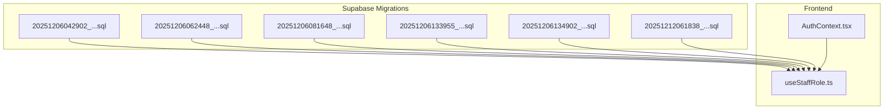
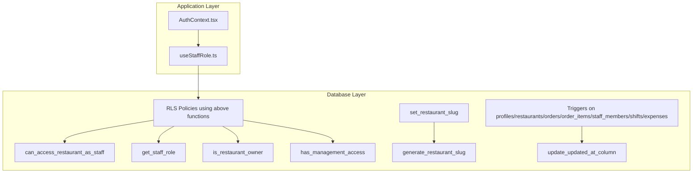
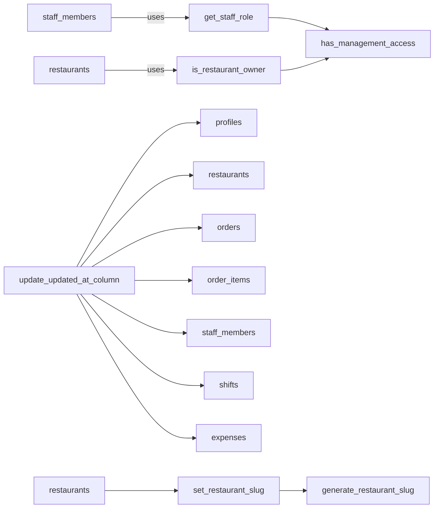

# Database Triggers & Functions

<cite>
**Referenced Files in This Document**
- [20251206042902_fc2b1d91-eb8e-4750-90c3-95b7e0feb6ba.sql](file://supabase/migrations/20251206042902_fc2b1d91-eb8e-4750-90c3-95b7e0feb6ba.sql)
- [20251206062448_4e2d7da9-9519-48ae-9d6c-bb1c994ed84a.sql](file://supabase/migrations/20251206062448_4e2d7da9-9519-48ae-9d6c-bb1c994ed84a.sql)
- [20251206081648_ef719884-b181-43d8-832a-02825f1b3a50.sql](file://supabase/migrations/20251206081648_ef719884-b181-43d8-832a-02825f1b3a50.sql)
- [20251206133955_231d3ef6-16e8-41de-8662-8dc09a54c6e3.sql](file://supabase/migrations/20251206133955_231d3ef6-16e8-41de-8662-8dc09a54c6e3.sql)
- [20251206134902_8243dfe0-8b9c-4c6d-9a42-278158976001.sql](file://supabase/migrations/20251206134902_8243dfe0-8b9c-4c6d-9a42-278158976001.sql)
- [20251212061838_061086f8-bf22-458f-b2e6-20f8199ee7ce.sql](file://supabase/migrations/20251212061838_061086f8-bf22-458f-b2e6-20f8199ee7ce.sql)
- [useStaffRole.ts](file://src/hooks/useStaffRole.ts)
- [AuthContext.tsx](file://src/contexts/AuthContext.tsx)
</cite>

## Table of Contents
1. [Introduction](#introduction)
2. [Project Structure](#project-structure)
3. [Core Components](#core-components)
4. [Architecture Overview](#architecture-overview)
5. [Detailed Component Analysis](#detailed-component-analysis)
6. [Dependency Analysis](#dependency-analysis)
7. [Performance Considerations](#performance-considerations)
8. [Troubleshooting Guide](#troubleshooting-guide)
9. [Conclusion](#conclusion)

## Introduction
This document explains the database-level triggers and stored functions that implement complex business logic in TableFlow Pro. It focuses on authorization and access control functions, URL-friendly identifier generation, automatic timestamp updates, and policies that enforce business rules. It also documents how these database constructs integrate with the application’s frontend authorization hooks.

## Project Structure
The database logic is primarily defined in Supabase migration files under the supabase/migrations directory. The frontend integrates with Supabase to consume authorization and access control decisions made by the database.

**Diagram sources**
- [20251206042902_fc2b1d91-eb8e-4750-90c3-95b7e0feb6ba.sql:174-210](file://supabase/migrations/20251206042902_fc2b1d91-eb8e-4750-90c3-95b7e0feb6ba.sql#L174-L210)
- [20251206062448_4e2d7da9-9519-48ae-9d6c-bb1c994ed84a.sql:5-64](file://supabase/migrations/20251206062448_4e2d7da9-9519-48ae-9d6c-bb1c994ed84a.sql#L5-L64)
- [20251206081648_ef719884-b181-43d8-832a-02825f1b3a50.sql:39-157](file://supabase/migrations/20251206081648_ef719884-b181-43d8-832a-02825f1b3a50.sql#L39-L157)
- [20251206133955_231d3ef6-16e8-41de-8662-8dc09a54c6e3.sql:17-63](file://supabase/migrations/20251206133955_231d3ef6-16e8-41de-8662-8dc09a54c6e3.sql#L17-L63)
- [20251206134902_8243dfe0-8b9c-4c6d-9a42-278158976001.sql:1-76](file://supabase/migrations/20251206134902_8243dfe0-8b9c-4c6d-9a42-278158976001.sql#L1-L76)
- [20251212061838_061086f8-bf22-458f-b2e6-20f8199ee7ce.sql:79-83](file://supabase/migrations/20251212061838_061086f8-bf22-458f-b2e6-20f8199ee7ce.sql#L79-L83)
- [useStaffRole.ts:1-190](file://src/hooks/useStaffRole.ts#L1-L190)
- [AuthContext.tsx:1-141](file://src/contexts/AuthContext.tsx#L1-L141)

**Section sources**
- [20251206042902_fc2b1d91-eb8e-4750-90c3-95b7e0feb6ba.sql:1-210](file://supabase/migrations/20251206042902_fc2b1d91-eb8e-4750-90c3-95b7e0feb6ba.sql#L1-L210)
- [20251206062448_4e2d7da9-9519-48ae-9d6c-bb1c994ed84a.sql:1-64](file://supabase/migrations/20251206062448_4e2d7da9-9519-48ae-9d6c-bb1c994ed84a.sql#L1-L64)
- [20251206081648_ef719884-b181-43d8-832a-02825f1b3a50.sql:1-157](file://supabase/migrations/20251206081648_ef719884-b181-43d8-832a-02825f1b3a50.sql#L1-L157)
- [20251206133955_231d3ef6-16e8-41de-8662-8dc09a54c6e3.sql:1-63](file://supabase/migrations/20251206133955_231d3ef6-16e8-41de-8662-8dc09a54c6e3.sql#L1-L63)
- [20251206134902_8243dfe0-8b9c-4c6d-9a42-278158976001.sql:1-76](file://supabase/migrations/20251206134902_8243dfe0-8b9c-4c6d-9a42-278158976001.sql#L1-L76)
- [20251212061838_061086f8-bf22-458f-b2e6-20f8199ee7ce.sql:1-83](file://supabase/migrations/20251212061838_061086f8-bf22-458f-b2e6-20f8199ee7ce.sql#L1-L83)
- [useStaffRole.ts:1-190](file://src/hooks/useStaffRole.ts#L1-L190)
- [AuthContext.tsx:1-141](file://src/contexts/AuthContext.tsx#L1-L141)

## Core Components
- Authorization and Access Control Functions
  - can_access_restaurant_as_staff: Determines if a user can access a restaurant via staff membership.
  - get_staff_role: Returns the active role of a user at a restaurant.
  - is_restaurant_owner: Checks if a user owns a restaurant.
  - has_management_access: Grants access for owners and managers.
- URL Identifier Generation
  - generate_restaurant_slug: Produces a URL-friendly, unique slug from a restaurant name.
  - set_restaurant_slug: Trigger-driven function to populate slug on insert.
- Automatic Timestamp Maintenance
  - update_updated_at_column: Shared function to set updated_at to current time.
  - Triggers: update_profiles_updated_at, update_restaurants_updated_at, update_orders_updated_at, update_order_items_updated_at, update_staff_members_updated_at, update_shifts_updated_at, update_expenses_updated_at.
- Additional Business Logic
  - handle_new_user: Creates a profile when a new Supabase auth user is inserted.
  - add_owner_as_staff: Auto-links the restaurant owner as the initial staff member.

**Section sources**
- [20251206042902_fc2b1d91-eb8e-4750-90c3-95b7e0feb6ba.sql:174-210](file://supabase/migrations/20251206042902_fc2b1d91-eb8e-4750-90c3-95b7e0feb6ba.sql#L174-L210)
- [20251206062448_4e2d7da9-9519-48ae-9d6c-bb1c994ed84a.sql:5-64](file://supabase/migrations/20251206062448_4e2d7da9-9519-48ae-9d6c-bb1c994ed84a.sql#L5-L64)
- [20251206081648_ef719884-b181-43d8-832a-02825f1b3a50.sql:39-157](file://supabase/migrations/20251206081648_ef719884-b181-43d8-832a-02825f1b3a50.sql#L39-L157)
- [20251206133955_231d3ef6-16e8-41de-8662-8dc09a54c6e3.sql:17-63](file://supabase/migrations/20251206133955_231d3ef6-16e8-41de-8662-8dc09a54c6e3.sql#L17-L63)
- [20251206134902_8243dfe0-8b9c-4c6d-9a42-278158976001.sql:1-76](file://supabase/migrations/20251206134902_8243dfe0-8b9c-4c6d-9a42-278158976001.sql#L1-L76)
- [20251212061838_061086f8-bf22-458f-b2e6-20f8199ee7ce.sql:79-83](file://supabase/migrations/20251212061838_061086f8-bf22-458f-b2e6-20f8199ee7ce.sql#L79-L83)

## Architecture Overview
The system enforces authorization and access control at the database level using security definer functions and row-level security (RLS) policies. Frontend hooks query the database to derive roles and permissions, ensuring consistent enforcement even if the app layer is bypassed.

**Diagram sources**
- [20251206042902_fc2b1d91-eb8e-4750-90c3-95b7e0feb6ba.sql:174-210](file://supabase/migrations/20251206042902_fc2b1d91-eb8e-4750-90c3-95b7e0feb6ba.sql#L174-L210)
- [20251206062448_4e2d7da9-9519-48ae-9d6c-bb1c994ed84a.sql:5-64](file://supabase/migrations/20251206062448_4e2d7da9-9519-48ae-9d6c-bb1c994ed84a.sql#L5-L64)
- [20251206081648_ef719884-b181-43d8-832a-02825f1b3a50.sql:39-157](file://supabase/migrations/20251206081648_ef719884-b181-43d8-832a-02825f1b3a50.sql#L39-L157)
- [20251206133955_231d3ef6-16e8-41de-8662-8dc09a54c6e3.sql:17-63](file://supabase/migrations/20251206133955_231d3ef6-16e8-41de-8662-8dc09a54c6e3.sql#L17-L63)
- [20251206134902_8243dfe0-8b9c-4c6d-9a42-278158976001.sql:1-76](file://supabase/migrations/20251206134902_8243dfe0-8b9c-4c6d-9a42-278158976001.sql#L1-L76)
- [useStaffRole.ts:1-190](file://src/hooks/useStaffRole.ts#L1-L190)
- [AuthContext.tsx:1-141](file://src/contexts/AuthContext.tsx#L1-L141)

## Detailed Component Analysis

### Authorization and Access Control Functions

#### can_access_restaurant_as_staff
- Purpose: Determine if a user can access a restaurant via staff membership.
- Parameters: user_id (UUID), restaurant_id (UUID)
- Return Type: boolean
- Behavior: Checks staff_members for an active record matching either user_id or email, scoped to the restaurant.
- Security: SECURITY DEFINER; uses a helper to fetch user email safely.
- Integration: Used by RLS policies to grant staff access to related tables.

**Section sources**
- [20251206133955_231d3ef6-16e8-41de-8662-8dc09a54c6e3.sql:17-31](file://supabase/migrations/20251206133955_231d3ef6-16e8-41de-8662-8dc09a54c6e3.sql#L17-L31)

#### get_staff_role
- Purpose: Retrieve the active role of a user at a restaurant.
- Parameters: user_id (UUID), restaurant_id (UUID)
- Return Type: enum (staff_role)
- Behavior: Selects the role from staff_members where the user is linked to the restaurant and is_active is true.
- Security: SECURITY DEFINER; prevents RLS recursion by encapsulating lookup.

**Section sources**
- [20251206081648_ef719884-b181-43d8-832a-02825f1b3a50.sql:39-52](file://supabase/migrations/20251206081648_ef719884-b181-43d8-832a-02825f1b3a50.sql#L39-L52)

#### is_restaurant_owner
- Purpose: Check if a user owns a restaurant.
- Parameters: user_id (UUID), restaurant_id (UUID)
- Return Type: boolean
- Behavior: Simple existence check against restaurants where owner_id equals user_id.

**Section sources**
- [20251206081648_ef719884-b181-43d8-832a-02825f1b3a50.sql:54-66](file://supabase/migrations/20251206081648_ef719884-b181-43d8-832a-02825f1b3a50.sql#L54-L66)

#### has_management_access
- Purpose: Grant management-level access to owners and managers.
- Parameters: user_id (UUID), restaurant_id (UUID)
- Return Type: boolean
- Behavior: Returns true if the user is owner OR has role owner/manager.

**Section sources**
- [20251206081648_ef719884-b181-43d8-832a-02825f1b3a50.sql:68-79](file://supabase/migrations/20251206081648_ef719884-b181-43d8-832a-02825f1b3a50.sql#L68-L79)

### URL-Friendly Identifier Generation

#### generate_restaurant_slug
- Purpose: Produce a URL-safe, unique slug from a restaurant name.
- Parameters: name (text), owner_id (UUID)
- Return Type: text
- Behavior: Normalizes name to lowercase, replaces spaces with hyphens, removes special characters, ensures uniqueness by appending a counter if needed, defaults to a placeholder if normalization yields empty.

**Section sources**
- [20251206062448_4e2d7da9-9519-48ae-9d6c-bb1c994ed84a.sql:5-36](file://supabase/migrations/20251206062448_4e2d7da9-9519-48ae-9d6c-bb1c994ed84a.sql#L5-L36)

#### set_restaurant_slug
- Purpose: Populate slug before insert if not provided.
- Trigger Timing: BEFORE INSERT
- Trigger Target: restaurants
- Behavior: Calls generate_restaurant_slug with NEW.name and NEW.owner_id; assigns result to NEW.slug.

**Section sources**
- [20251206062448_4e2d7da9-9519-48ae-9d6c-bb1c994ed84a.sql:38-55](file://supabase/migrations/20251206062448_4e2d7da9-9519-48ae-9d6c-bb1c994ed84a.sql#L38-L55)

### Automatic Timestamp Maintenance

#### update_updated_at_column
- Purpose: Set updated_at to current time on row updates.
- Triggered By: Multiple tables’ BEFORE UPDATE events.
- Behavior: Assigns now() to NEW.updated_at and returns NEW.

**Section sources**
- [20251206042902_fc2b1d91-eb8e-4750-90c3-95b7e0feb6ba.sql:174-181](file://supabase/migrations/20251206042902_fc2b1d91-eb8e-4750-90c3-95b7e0feb6ba.sql#L174-L181)

#### Timestamp Triggers
- Profiles: update_profiles_updated_at (BEFORE UPDATE)
- Restaurants: update_restaurants_updated_at (BEFORE UPDATE)
- Orders: update_orders_updated_at (BEFORE UPDATE)
- Order Items: update_order_items_updated_at (BEFORE UPDATE)
- Staff Members: update_staff_members_updated_at (BEFORE UPDATE)
- Shifts: update_shifts_updated_at (BEFORE UPDATE)
- Expenses: update_expenses_updated_at (BEFORE UPDATE)

**Section sources**
- [20251206042902_fc2b1d91-eb8e-4750-90c3-95b7e0feb6ba.sql:183-187](file://supabase/migrations/20251206042902_fc2b1d91-eb8e-4750-90c3-95b7e0feb6ba.sql#L183-L187)
- [20251206081648_ef719884-b181-43d8-832a-02825f1b3a50.sql:120-129](file://supabase/migrations/20251206081648_ef719884-b181-43d8-832a-02825f1b3a50.sql#L120-L129)
- [20251212061838_061086f8-bf22-458f-b2e6-20f8199ee7ce.sql:79-83](file://supabase/migrations/20251212061838_061086f8-bf22-458f-b2e6-20f8199ee7ce.sql#L79-L83)

### Additional Business Logic

#### handle_new_user
- Purpose: Automatically create a profile when a new auth user is inserted.
- Trigger Timing: AFTER INSERT on auth.users
- Behavior: Inserts a new profile row with user_id and full_name extracted from user metadata.

**Section sources**
- [20251206042902_fc2b1d91-eb8e-4750-90c3-95b7e0feb6ba.sql:189-205](file://supabase/migrations/20251206042902_fc2b1d91-eb8e-4750-90c3-95b7e0feb6ba.sql#L189-L205)

#### add_owner_as_staff
- Purpose: Auto-link the restaurant owner as the initial staff member upon restaurant creation.
- Trigger Timing: AFTER INSERT on restaurants
- Behavior: Looks up owner’s email and full_name from auth.users and inserts a staff_members record with role owner.

**Section sources**
- [20251206081648_ef719884-b181-43d8-832a-02825f1b3a50.sql:131-157](file://supabase/migrations/20251206081648_ef719884-b181-43d8-832a-02825f1b3a50.sql#L131-L157)

### Staff Access Policies for Related Tables
- Orders: Staff can view/manage orders of their restaurants using can_access_restaurant_as_staff.
- Order Items: Select/manage policies derived from parent order’s restaurant access.
- Tables: Select policies derived from parent floor’s restaurant access.
- Floors: Staff can view floors of their restaurants.
- Menu Categories/Items/Kitchens: Staff can view categories/items/kitchens of their restaurants.

**Section sources**
- [20251206134902_8243dfe0-8b9c-4c6d-9a42-278158976001.sql:4-76](file://supabase/migrations/20251206134902_8243dfe0-8b9c-4c6d-9a42-278158976001.sql#L4-L76)

### Frontend Integration
- useStaffRole hook:
  - Links unlinked staff records by email during login.
  - Fetches active staff memberships and restaurant details.
  - Computes role flags (owner, manager, waiter, chef) and management access.
- AuthContext manages authentication state and initializes synchronization.

**Section sources**
- [useStaffRole.ts:1-190](file://src/hooks/useStaffRole.ts#L1-L190)
- [AuthContext.tsx:1-141](file://src/contexts/AuthContext.tsx#L1-L141)

## Dependency Analysis
The authorization functions are tightly coupled with RLS policies and staff membership data. The slug generation depends on restaurants and auth.users metadata. Timestamp triggers depend on update_updated_at_column across multiple tables.

**Diagram sources**
- [20251206081648_ef719884-b181-43d8-832a-02825f1b3a50.sql:39-79](file://supabase/migrations/20251206081648_ef719884-b181-43d8-832a-02825f1b3a50.sql#L39-L79)
- [20251206042902_fc2b1d91-eb8e-4750-90c3-95b7e0feb6ba.sql:174-187](file://supabase/migrations/20251206042902_fc2b1d91-eb8e-4750-90c3-95b7e0feb6ba.sql#L174-L187)
- [20251206062448_4e2d7da9-9519-48ae-9d6c-bb1c994ed84a.sql:38-55](file://supabase/migrations/20251206062448_4e2d7da9-9519-48ae-9d6c-bb1c994ed84a.sql#L38-L55)

**Section sources**
- [20251206081648_ef719884-b181-43d8-832a-02825f1b3a50.sql:39-79](file://supabase/migrations/20251206081648_ef719884-b181-43d8-832a-02825f1b3a50.sql#L39-L79)
- [20251206042902_fc2b1d91-eb8e-4750-90c3-95b7e0feb6ba.sql:174-187](file://supabase/migrations/20251206042902_fc2b1d91-eb8e-4750-90c3-95b7e0feb6ba.sql#L174-L187)
- [20251206062448_4e2d7da9-9519-48ae-9d6c-bb1c994ed84a.sql:38-55](file://supabase/migrations/20251206062448_4e2d7da9-9519-48ae-9d6c-bb1c994ed84a.sql#L38-L55)

## Performance Considerations
- Function volatility: Functions declared STABLE (e.g., get_staff_role, is_restaurant_owner, has_management_access) are optimized by the planner; ensure they remain deterministic and avoid heavy operations.
- Indexes: Consider adding indexes on frequently filtered columns (e.g., staff_members(user_id, restaurant_id), restaurants(owner_id)).
- Slug generation: Uniqueness loop may be expensive for very long names; keep names concise to minimize collisions.
- Triggers: Minimal overhead; ensure they only modify updated_at and avoid heavy computations.

[No sources needed since this section provides general guidance]

## Troubleshooting Guide
- Slug collision: If slug uniqueness fails, verify generate_restaurant_slug logic and confirm the uniqueness loop executes. Ensure slug is NOT NULL after population.
- Staff access denied: Confirm RLS policies are using can_access_restaurant_as_staff and that staff_members records are active and correctly linked (user_id/email).
- Management access issues: Verify has_management_access relies on is_restaurant_owner and get_staff_role; check role values and active status.
- Timestamp not updating: Ensure BEFORE UPDATE triggers are attached to the relevant tables and update_updated_at_column is properly defined.
- New user profile not created: Check handle_new_user trigger timing (AFTER INSERT on auth.users) and that raw_user_meta_data contains full_name.

**Section sources**
- [20251206062448_4e2d7da9-9519-48ae-9d6c-bb1c994ed84a.sql:57-64](file://supabase/migrations/20251206062448_4e2d7da9-9519-48ae-9d6c-bb1c994ed84a.sql#L57-L64)
- [20251206133955_231d3ef6-16e8-41de-8662-8dc09a54c6e3.sql:48-63](file://supabase/migrations/20251206133955_231d3ef6-16e8-41de-8662-8dc09a54c6e3.sql#L48-L63)
- [20251206042902_fc2b1d91-eb8e-4750-90c3-95b7e0feb6ba.sql:183-205](file://supabase/migrations/20251206042902_fc2b1d91-eb8e-4750-90c3-95b7e0feb6ba.sql#L183-L205)

## Conclusion
TableFlow Pro’s authorization model is enforced at the database level using security definer functions and RLS policies. The functions can_access_restaurant_as_staff, get_staff_role, is_restaurant_owner, and has_management_access provide a robust foundation for role-based access control. URL-friendly slugs are generated deterministically and triggers ensure consistent timestamps. Together, these mechanisms create a secure, auditable, and scalable backend that the frontend consumes through straightforward hooks.