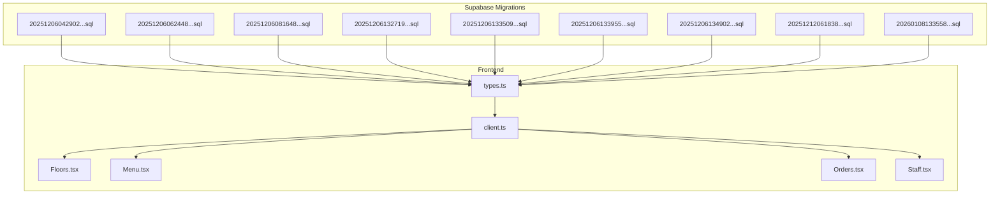
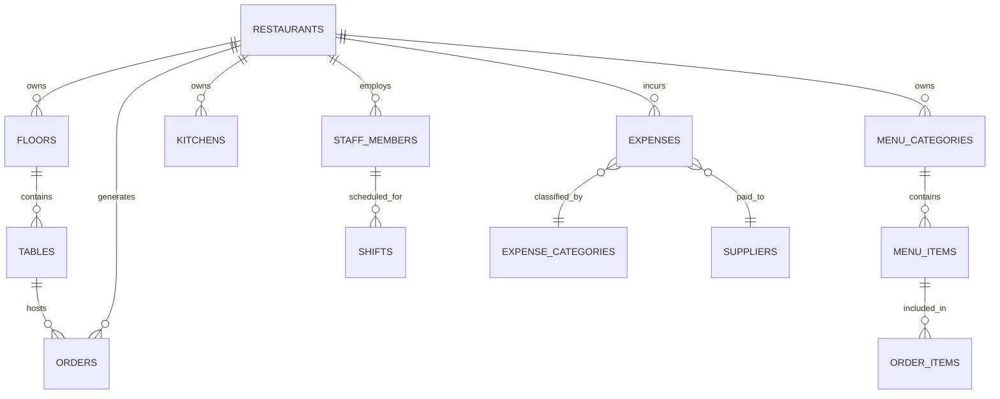
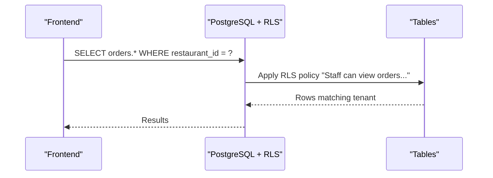
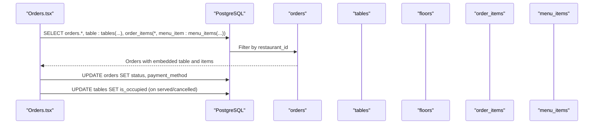
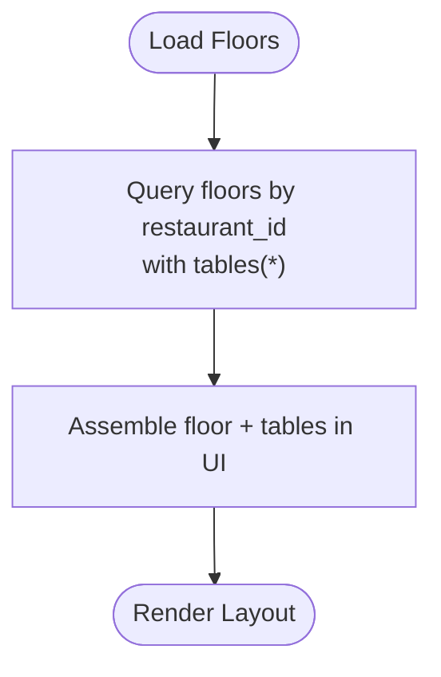
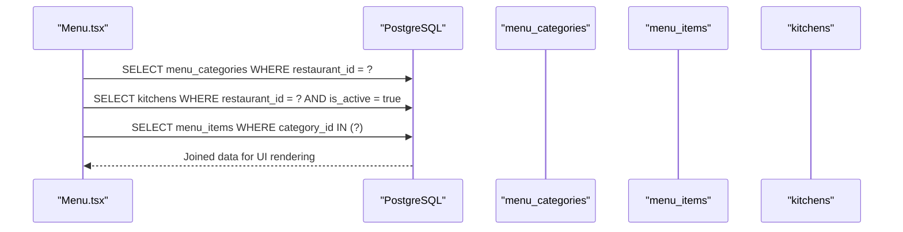
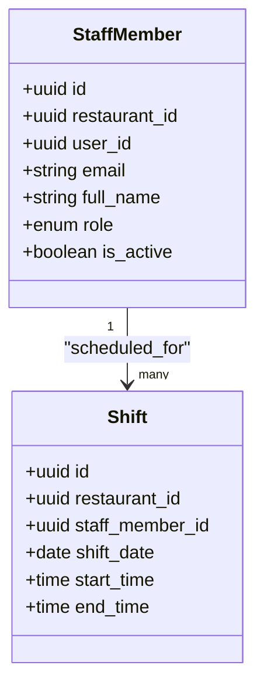
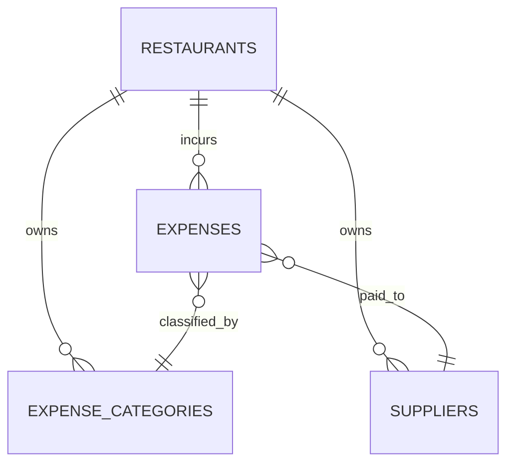
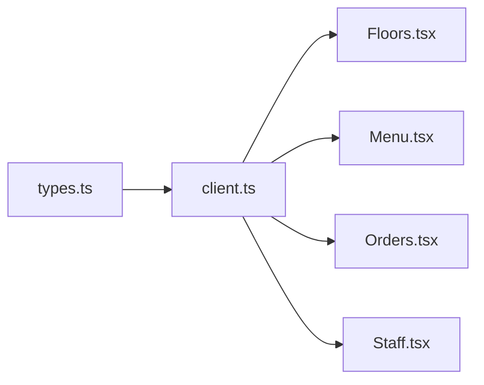

# Entity Relationships & Schema Design

<cite>
**Referenced Files in This Document**
- [20251206042902_fc2b1d91-eb8e-4750-90c3-95b7e0feb6ba.sql](file://supabase/migrations/20251206042902_fc2b1d91-eb8e-4750-90c3-95b7e0feb6ba.sql)
- [20251206062448_4e2d7da9-9519-48ae-9d6c-bb1c994ed84a.sql](file://supabase/migrations/20251206062448_4e2d7da9-9519-48ae-9d6c-bb1c994ed84a.sql)
- [20251206081648_ef719884-b181-43d8-832a-02825f1b3a50.sql](file://supabase/migrations/20251206081648_ef719884-b181-43d8-832a-02825f1b3a50.sql)
- [20251206132719_11d13f91-c469-437f-9d98-63127362f20c.sql](file://supabase/migrations/20251206132719_11d13f91-c469-437f-9d98-63127362f20c.sql)
- [20251206133509_50399ee0-7c3e-4927-bf1a-00556ef24c8c.sql](file://supabase/migrations/20251206133509_50399ee0-7c3e-4927-bf1a-00556ef24c8c.sql)
- [20251206133955_231d3ef6-16e8-41de-8662-8dc09a54c6e3.sql](file://supabase/migrations/20251206133955_231d3ef6-16e8-41de-8662-8dc09a54c6e3.sql)
- [20251206134902_8243dfe0-8b9c-4c6d-9a42-278158976001.sql](file://supabase/migrations/20251206134902_8243dfe0-8b9c-4c6d-9a42-278158976001.sql)
- [20251212061838_061086f8-bf22-458f-b2e6-20f8199ee7ce.sql](file://supabase/migrations/20251212061838_061086f8-bf22-458f-b2e6-20f8199ee7ce.sql)
- [20260108133558_b2ed5e93-fda3-4022-bc45-a2fe64b46615.sql](file://supabase/migrations/20260108133558_b2ed5e93-fda3-4022-bc45-a2fe64b46615.sql)
- [types.ts](file://src/integrations/supabase/types.ts)
- [client.ts](file://src/integrations/supabase/client.ts)
- [Floors.tsx](file://src/pages/dashboard/Floors.tsx)
- [Menu.tsx](file://src/pages/dashboard/Menu.tsx)
- [Orders.tsx](file://src/pages/dashboard/Orders.tsx)
- [Staff.tsx](file://src/pages/dashboard/Staff.tsx)
</cite>

## Table of Contents
1. [Introduction](#introduction)
2. [Project Structure](#project-structure)
3. [Core Components](#core-components)
4. [Architecture Overview](#architecture-overview)
5. [Detailed Component Analysis](#detailed-component-analysis)
6. [Dependency Analysis](#dependency-analysis)
7. [Performance Considerations](#performance-considerations)
8. [Troubleshooting Guide](#troubleshooting-guide)
9. [Conclusion](#conclusion)

## Introduction
This document explains the normalized entity relationship design and schema architecture of TableFlow Pro. It focuses on how restaurants, staff_members, orders, menu_items, tables, and floors relate to each other, the referential integrity constraints and cascade behaviors, and how the multi-restaurant architecture enforces tenant isolation via restaurant_id. It also documents how the frontend integrates with the backend schema and real-time features to support the application’s business logic.

## Project Structure
The schema is defined in Supabase migrations and surfaced to the frontend via typed TypeScript definitions. The frontend pages demonstrate typical join patterns and data flows across related entities.

**Diagram sources**
- [20251206042902_fc2b1d91-eb8e-4750-90c3-95b7e0feb6ba.sql:1-210](file://supabase/migrations/20251206042902_fc2b1d91-eb8e-4750-90c3-95b7e0feb6ba.sql#L1-L210)
- [20251206062448_4e2d7da9-9519-48ae-9d6c-bb1c994ed84a.sql:1-64](file://supabase/migrations/20251206062448_4e2d7da9-9519-48ae-9d6c-bb1c994ed84a.sql#L1-L64)
- [20251206081648_ef719884-b181-43d8-832a-02825f1b3a50.sql:1-157](file://supabase/migrations/20251206081648_ef719884-b181-43d8-832a-02825f1b3a50.sql#L1-L157)
- [20251206132719_11d13f91-c469-437f-9d98-63127362f20c.sql:1-12](file://supabase/migrations/20251206132719_11d13f91-c469-437f-9d98-63127362f20c.sql#L1-L12)
- [20251206133509_50399ee0-7c3e-4927-bf1a-00556ef24c8c.sql:1-28](file://supabase/migrations/20251206133509_50399ee0-7c3e-4927-bf1a-00556ef24c8c.sql#L1-L28)
- [20251206133955_231d3ef6-16e8-41de-8662-8dc09a54c6e3.sql:1-63](file://supabase/migrations/20251206133955_231d3ef6-16e8-41de-8662-8dc09a54c6e3.sql#L1-L63)
- [20251206134902_8243dfe0-8b9c-4c6d-9a42-278158976001.sql:1-76](file://supabase/migrations/20251206134902_8243dfe0-8b9c-4c6d-9a42-278158976001.sql#L1-L76)
- [20251212061838_061086f8-bf22-458f-b2e6-20f8199ee7ce.sql:1-83](file://supabase/migrations/20251212061838_061086f8-bf22-458f-b2e6-20f8199ee7ce.sql#L1-L83)
- [20260108133558_b2ed5e93-fda3-4022-bc45-a2fe64b46615.sql:1-6](file://supabase/migrations/20260108133558_b2ed5e93-fda3-4022-bc45-a2fe64b46615.sql#L1-L6)
- [types.ts:1-818](file://src/integrations/supabase/types.ts#L1-L818)
- [client.ts:1-17](file://src/integrations/supabase/client.ts#L1-L17)
- [Floors.tsx:1-559](file://src/pages/dashboard/Floors.tsx#L1-L559)
- [Menu.tsx:1-844](file://src/pages/dashboard/Menu.tsx#L1-L844)
- [Orders.tsx:1-1119](file://src/pages/dashboard/Orders.tsx#L1-L1119)
- [Staff.tsx:1-205](file://src/pages/dashboard/Staff.tsx#L1-L205)

**Section sources**
- [20251206042902_fc2b1d91-eb8e-4750-90c3-95b7e0feb6ba.sql:1-210](file://supabase/migrations/20251206042902_fc2b1d91-eb8e-4750-90c3-95b7e0feb6ba.sql#L1-L210)
- [types.ts:1-818](file://src/integrations/supabase/types.ts#L1-L818)
- [client.ts:1-17](file://src/integrations/supabase/client.ts#L1-L17)

## Core Components
This section outlines the core entities and their relationships, focusing on primary keys, foreign keys, referential integrity, and cascade behaviors.

- restaurants
  - Primary key: id
  - Tenant isolation anchor via owner_id referencing auth.users
  - Additional attributes: name, address, phone, gstin, slug, timestamps
  - Slug generation handled by migration and trigger

- staff_members
  - Primary key: id
  - Foreign keys: restaurant_id → restaurants.id (CASCADE), user_id → auth.users.id (CASCADE)
  - Unique constraint: (restaurant_id, email)
  - Roles: owner, manager, waiter, chef

- shifts
  - Primary key: id
  - Foreign keys: restaurant_id → restaurants.id (CASCADE), staff_member_id → staff_members.id (CASCADE)

- floors
  - Primary key: id
  - Foreign key: restaurant_id → restaurants.id (CASCADE)

- tables
  - Primary key: id
  - Foreign key: floor_id → floors.id (CASCADE)

- menu_categories
  - Primary key: id
  - Foreign key: restaurant_id → restaurants.id (CASCADE)

- menu_items
  - Primary key: id
  - Foreign keys: category_id → menu_categories.id (CASCADE), kitchen_id → kitchens.id (SET NULL)

- kitchens
  - Primary key: id
  - Foreign key: restaurant_id → restaurants.id (CASCADE)

- orders
  - Primary key: id
  - Foreign keys: table_id → tables.id (SET NULL), restaurant_id → restaurants.id (CASCADE)
  - Status: enum order_status

- order_items
  - Primary key: id
  - Foreign keys: order_id → orders.id (CASCADE), menu_item_id → menu_items.id (SET NULL), kitchen_id → kitchens.id (SET NULL)
  - Status: enum order_status

- expenses, expense_categories, suppliers
  - Primary key: id
  - Foreign keys: restaurant_id → restaurants.id (CASCADE), category_id → expense_categories.id (SET NULL), supplier_id → suppliers.id (SET NULL)

Key referential integrity and cascade behaviors:
- Restaurant-level deletions cascade to floors, tables, menu_categories, menu_items, orders, order_items, kitchens, and expenses-related entities.
- Deletion of a staff member cascades to shifts.
- Deletion of a table sets order.table_id to NULL (SET NULL).
- Deletion of a menu item sets order_items.menu_item_id and menu_items.kitchen_id to NULL (SET NULL).
- Deletion of a kitchen sets order_items.kitchen_id to NULL (SET NULL).

**Section sources**
- [20251206042902_fc2b1d91-eb8e-4750-90c3-95b7e0feb6ba.sql:16-108](file://supabase/migrations/20251206042902_fc2b1d91-eb8e-4750-90c3-95b7e0feb6ba.sql#L16-L108)
- [20251206081648_ef719884-b181-43d8-832a-02825f1b3a50.sql:5-33](file://supabase/migrations/20251206081648_ef719884-b181-43d8-832a-02825f1b3a50.sql#L5-L33)
- [20251212061838_061086f8-bf22-458f-b2e6-20f8199ee7ce.sql:1-37](file://supabase/migrations/20251212061838_061086f8-bf22-458f-b2e6-20f8199ee7ce.sql#L1-L37)
- [20260108133558_b2ed5e93-fda3-4022-bc45-a2fe64b46615.sql:1-6](file://supabase/migrations/20260108133558_b2ed5e93-fda3-4022-bc45-a2fe64b46615.sql#L1-L6)

## Architecture Overview
The schema supports a multi-tenant architecture centered on restaurants. Each tenant (restaurant) is isolated by foreign keys anchored to restaurant_id or owner_id. Row Level Security (RLS) policies enforce tenant boundaries and role-based access. Frontend pages query related entities using joins and filters to present coherent views.

**Diagram sources**
- [20251206042902_fc2b1d91-eb8e-4750-90c3-95b7e0feb6ba.sql:16-108](file://supabase/migrations/20251206042902_fc2b1d91-eb8e-4750-90c3-95b7e0feb6ba.sql#L16-L108)
- [20251206081648_ef719884-b181-43d8-832a-02825f1b3a50.sql:5-33](file://supabase/migrations/20251206081648_ef719884-b181-43d8-832a-02825f1b3a50.sql#L5-L33)
- [20251212061838_061086f8-bf22-458f-b2e6-20f8199ee7ce.sql:1-37](file://supabase/migrations/20251212061838_061086f8-bf22-458f-b2e6-20f8199ee7ce.sql#L1-L37)

## Detailed Component Analysis

### Multi-Restaurant Tenant Isolation
- restaurants.owner_id ties ownership to auth.users and anchors RLS policies.
- All other tenant-relevant tables include restaurant_id as a foreign key to enforce isolation.
- RLS policies use helper functions to determine access based on user identity and staff role.

**Diagram sources**
- [20251206134902_8243dfe0-8b9c-4c6d-9a42-278158976001.sql:4-14](file://supabase/migrations/20251206134902_8243dfe0-8b9c-4c6d-9a42-278158976001.sql#L4-L14)

**Section sources**
- [20251206042902_fc2b1d91-eb8e-4750-90c3-95b7e0feb6ba.sql:126-172](file://supabase/migrations/20251206042902_fc2b1d91-eb8e-4750-90c3-95b7e0feb6ba.sql#L126-L172)
- [20251206133955_231d3ef6-16e8-41de-8662-8dc09a54c6e3.sql:48-63](file://supabase/migrations/20251206133955_231d3ef6-16e8-41de-8662-8dc09a54c6e3.sql#L48-L63)
- [20251206134902_8243dfe0-8b9c-4c6d-9a42-278158976001.sql:4-76](file://supabase/migrations/20251206134902_8243dfe0-8b9c-4c6d-9a42-278158976001.sql#L4-L76)

### Orders and Order Items Flow
- Orders link to tables (optional) and restaurants.
- Order items reference menu items and kitchens, capturing per-item status and kitchen assignment.
- The frontend composes order details by joining orders with tables, floors, and order_items with menu_items.

**Diagram sources**
- [Orders.tsx:170-293](file://src/pages/dashboard/Orders.tsx#L170-L293)
- [20251206042902_fc2b1d91-eb8e-4750-90c3-95b7e0feb6ba.sql:84-108](file://supabase/migrations/20251206042902_fc2b1d91-eb8e-4750-90c3-95b7e0feb6ba.sql#L84-L108)

**Section sources**
- [Orders.tsx:170-293](file://src/pages/dashboard/Orders.tsx#L170-L293)
- [20251206042902_fc2b1d91-eb8e-4750-90c3-95b7e0feb6ba.sql:84-108](file://supabase/migrations/20251206042902_fc2b1d91-eb8e-4750-90c3-95b7e0feb6ba.sql#L84-L108)

### Floors and Tables Layout
- Floors belong to restaurants; tables belong to floors.
- The frontend queries floors with nested tables and manages occupancy.

**Diagram sources**
- [Floors.tsx:62-106](file://src/pages/dashboard/Floors.tsx#L62-L106)
- [20251206042902_fc2b1d91-eb8e-4750-90c3-95b7e0feb6ba.sql:38-55](file://supabase/migrations/20251206042902_fc2b1d91-eb8e-4750-90c3-95b7e0feb6ba.sql#L38-L55)

**Section sources**
- [Floors.tsx:62-106](file://src/pages/dashboard/Floors.tsx#L62-L106)
- [20251206042902_fc2b1d91-eb8e-4750-90c3-95b7e0feb6ba.sql:38-55](file://supabase/migrations/20251206042902_fc2b1d91-eb8e-4750-90c3-95b7e0feb6ba.sql#L38-L55)

### Menu Categories and Items
- Menu categories belong to restaurants; menu items belong to categories and optionally to kitchens.
- The frontend fetches categories and items, filtering by restaurant context.

**Diagram sources**
- [Menu.tsx:128-195](file://src/pages/dashboard/Menu.tsx#L128-L195)
- [20251206042902_fc2b1d91-eb8e-4750-90c3-95b7e0feb6ba.sql:57-82](file://supabase/migrations/20251206042902_fc2b1d91-eb8e-4750-90c3-95b7e0feb6ba.sql#L57-L82)

**Section sources**
- [Menu.tsx:128-195](file://src/pages/dashboard/Menu.tsx#L128-L195)
- [20251206042902_fc2b1d91-eb8e-4750-90c3-95b7e0feb6ba.sql:57-82](file://supabase/migrations/20251206042902_fc2b1d91-eb8e-4750-90c3-95b7e0feb6ba.sql#L57-L82)

### Staff and Access Control
- staff_members links users to restaurants with roles and ensures uniqueness per restaurant+email.
- Shifts link staff to restaurants and dates/times.
- RLS policies rely on helper functions to determine access based on ownership or management roles.

**Diagram sources**
- [20251206081648_ef719884-b181-43d8-832a-02825f1b3a50.sql:5-33](file://supabase/migrations/20251206081648_ef719884-b181-43d8-832a-02825f1b3a50.sql#L5-L33)

**Section sources**
- [20251206081648_ef719884-b181-43d8-832a-02825f1b3a50.sql:5-33](file://supabase/migrations/20251206081648_ef719884-b181-43d8-832a-02825f1b3a50.sql#L5-L33)
- [20251206132719_11d13f91-c469-437f-9d98-63127362f20c.sql:1-12](file://supabase/migrations/20251206132719_11d13f91-c469-437f-9d98-63127362f20c.sql#L1-L12)
- [20251206133509_50399ee0-7c3e-4927-bf1a-00556ef24c8c.sql:14-28](file://supabase/migrations/20251206133509_50399ee0-7c3e-4927-bf1a-00556ef24c8c.sql#L14-L28)
- [20251206133955_231d3ef6-16e8-41de-8662-8dc09a54c6e3.sql:17-31](file://supabase/migrations/20251206133955_231d3ef6-16e8-41de-8662-8dc09a54c6e3.sql#L17-L31)
- [20251206134902_8243dfe0-8b9c-4c6d-9a42-278158976001.sql:16-38](file://supabase/migrations/20251206134902_8243dfe0-8b9c-4c6d-9a42-278158976001.sql#L16-L38)

### Expenses Module
- expense_categories and suppliers are restaurant-scoped.
- expenses references categories and suppliers with SET NULL on delete.

**Diagram sources**
- [20251212061838_061086f8-bf22-458f-b2e6-20f8199ee7ce.sql:1-37](file://supabase/migrations/20251212061838_061086f8-bf22-458f-b2e6-20f8199ee7ce.sql#L1-L37)

**Section sources**
- [20251212061838_061086f8-bf22-458f-b2e6-20f8199ee7ce.sql:1-37](file://supabase/migrations/20251212061838_061086f8-bf22-458f-b2e6-20f8199ee7ce.sql#L1-L37)

## Dependency Analysis
The frontend depends on typed Supabase client definitions to ensure safe queries against the schema. The typed definitions enumerate tables, enums, and relationships, enabling compile-time checks and IDE support.

**Diagram sources**
- [types.ts:9-688](file://src/integrations/supabase/types.ts#L9-L688)
- [client.ts:1-17](file://src/integrations/supabase/client.ts#L1-L17)
- [Floors.tsx:1-559](file://src/pages/dashboard/Floors.tsx#L1-L559)
- [Menu.tsx:1-844](file://src/pages/dashboard/Menu.tsx#L1-L844)
- [Orders.tsx:1-1119](file://src/pages/dashboard/Orders.tsx#L1-L1119)
- [Staff.tsx:1-205](file://src/pages/dashboard/Staff.tsx#L1-L205)

**Section sources**
- [types.ts:9-688](file://src/integrations/supabase/types.ts#L9-L688)
- [client.ts:1-17](file://src/integrations/supabase/client.ts#L1-L17)

## Performance Considerations
- Indexes for expense queries improve filtering by date and foreign keys.
- Triggers maintain updated_at timestamps consistently across relevant tables.
- Real-time subscriptions enable near real-time updates for orders and order_items.

Recommendations:
- Ensure restaurant_id is indexed for all tenant-scoped tables (already enforced by foreign keys).
- Consider adding composite indexes for frequent filters (e.g., orders by restaurant_id and created_at).
- Use selective projections and joins to minimize payload sizes in frontend queries.

**Section sources**
- [20251212061838_061086f8-bf22-458f-b2e6-20f8199ee7ce.sql:74-77](file://supabase/migrations/20251212061838_061086f8-bf22-458f-b2e6-20f8199ee7ce.sql#L74-L77)
- [20251206042902_fc2b1d91-eb8e-4750-90c3-95b7e0feb6ba.sql:174-209](file://supabase/migrations/20251206042902_fc2b1d91-eb8e-4750-90c3-95b7e0feb6ba.sql#L174-L209)

## Troubleshooting Guide
Common issues and resolutions:
- Permission denied errors
  - Cause: RLS policies restrict access to tenant data.
  - Resolution: Ensure currentRestaurant context is set and user has appropriate role (owner/manager) or matches staff record.

- Missing data in offline mode
  - Cause: Offline caching requires explicit joins to local storage for related entities.
  - Resolution: Verify cache assembly logic for orders and order_items; ensure local joins with menu_items, tables, and floors occur before rendering.

- Cascade deletion surprises
  - Cause: Deleting a restaurant deletes dependent entities; deleting a table sets order.table_id to NULL.
  - Resolution: Confirm intended cascade behavior; avoid accidental restaurant deletion.

- Slug conflicts
  - Cause: Duplicate restaurant names leading to slug collisions.
  - Resolution: Slug generation appends counters; ensure slug uniqueness is maintained.

**Section sources**
- [20251206134902_8243dfe0-8b9c-4c6d-9a42-278158976001.sql:4-76](file://supabase/migrations/20251206134902_8243dfe0-8b9c-4c6d-9a42-278158976001.sql#L4-L76)
- [20251206062448_4e2d7da9-9519-48ae-9d6c-bb1c994ed84a.sql:5-64](file://supabase/migrations/20251206062448_4e2d7da9-9519-48ae-9d6c-bb1c994ed84a.sql#L5-L64)
- [Orders.tsx:217-289](file://src/pages/dashboard/Orders.tsx#L217-L289)

## Conclusion
TableFlow Pro employs a normalized, multi-tenant schema centered on restaurants with robust referential integrity and RLS policies. The relationships between floors, tables, menus, orders, and staff are designed to support the application’s business logic while maintaining tenant isolation. The frontend leverages typed Supabase clients and real-time subscriptions to deliver responsive, secure experiences across the platform.