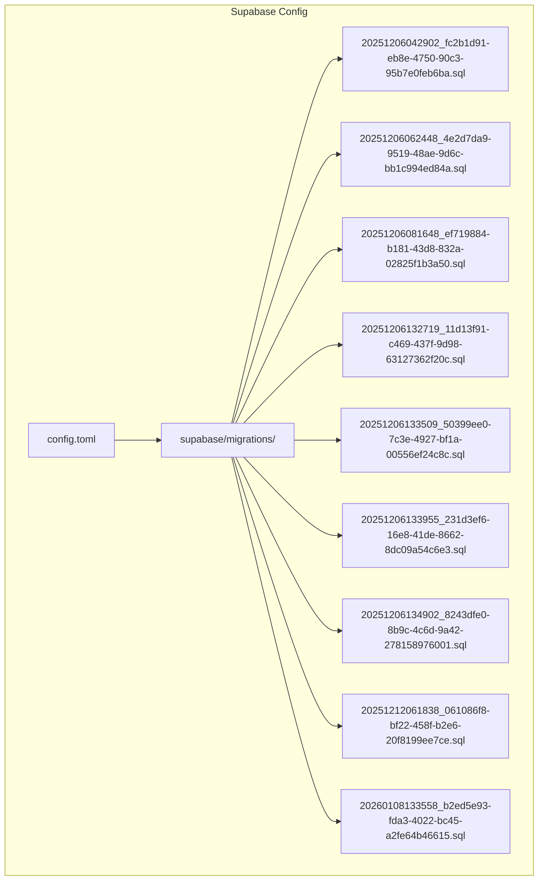
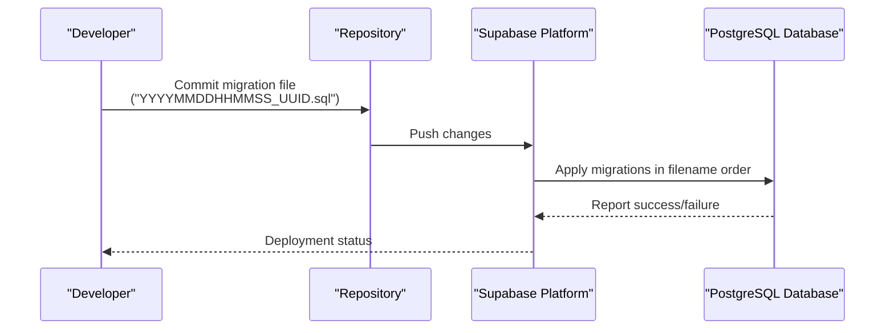
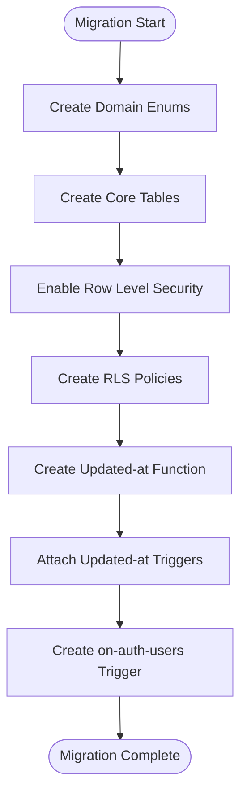
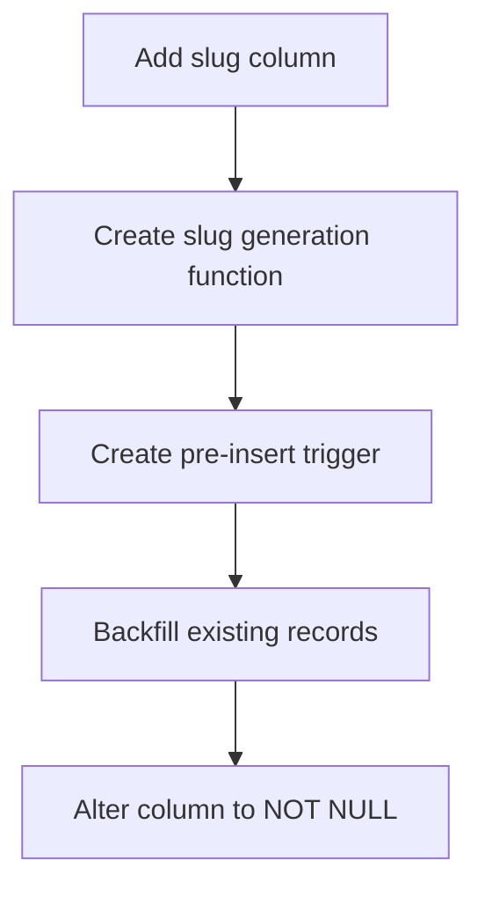
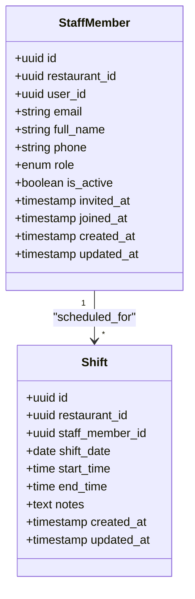
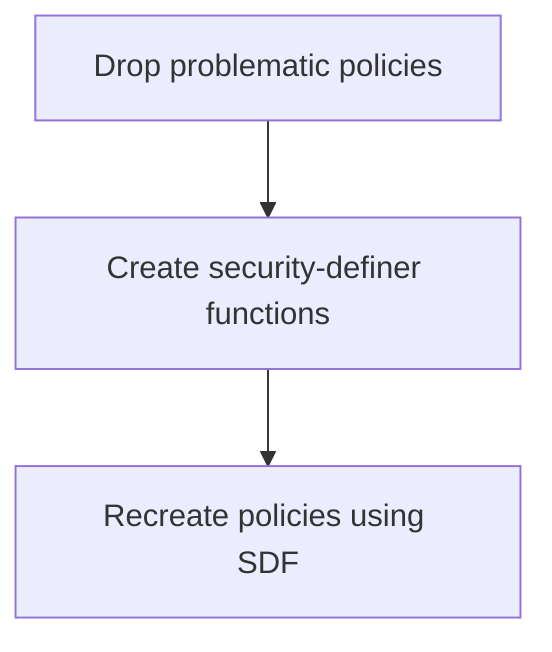
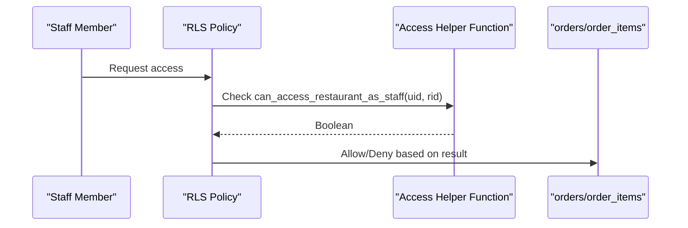
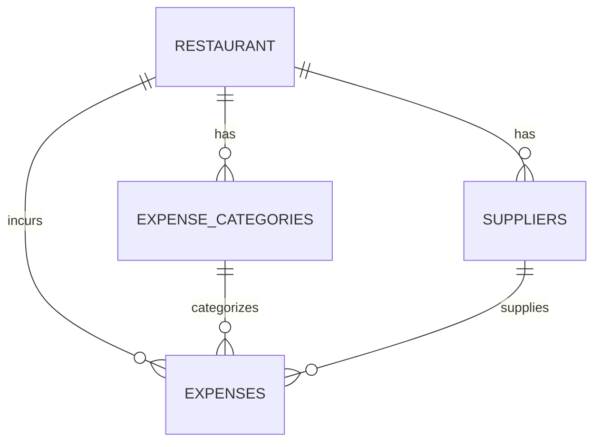
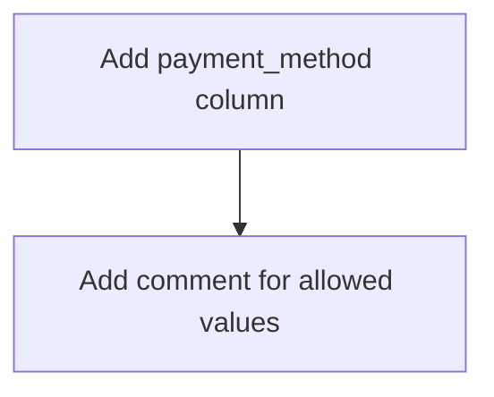
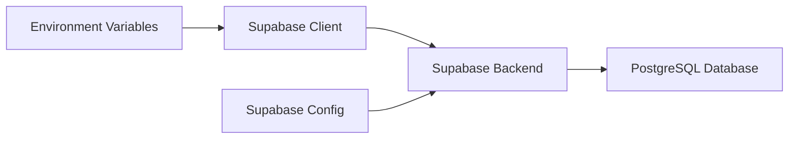

# Migration Management & Schema Evolution

<cite>
**Referenced Files in This Document**
- [20251206042902_fc2b1d91-eb8e-4750-90c3-95b7e0feb6ba.sql](file://supabase/migrations/20251206042902_fc2b1d91-eb8e-4750-90c3-95b7e0feb6ba.sql)
- [20251206062448_4e2d7da9-9519-48ae-9d6c-bb1c994ed84a.sql](file://supabase/migrations/20251206062448_4e2d7da9-9519-48ae-9d6c-bb1c994ed84a.sql)
- [20251206081648_ef719884-b181-43d8-832a-02825f1b3a50.sql](file://supabase/migrations/20251206081648_ef719884-b181-43d8-832a-02825f1b3a50.sql)
- [20251206132719_11d13f91-c469-437f-9d98-63127362f20c.sql](file://supabase/migrations/20251206132719_11d13f91-c469-437f-9d98-63127362f20c.sql)
- [20251206133509_50399ee0-7c3e-4927-bf1a-00556ef24c8c.sql](file://supabase/migrations/20251206133509_50399ee0-7c3e-4927-bf1a-00556ef24c8c.sql)
- [20251206133955_231d3ef6-16e8-41de-8662-8dc09a54c6e3.sql](file://supabase/migrations/20251206133955_231d3ef6-16e8-41de-8662-8dc09a54c6e3.sql)
- [20251206134902_8243dfe0-8b9c-4c6d-9a42-278158976001.sql](file://supabase/migrations/20251206134902_8243dfe0-8b9c-4c6d-9a42-278158976001.sql)
- [20251212061838_061086f8-bf22-458f-b2e6-20f8199ee7ce.sql](file://supabase/migrations/20251212061838_061086f8-bf22-458f-b2e6-20f8199ee7ce.sql)
- [20260108133558_b2ed5e93-fda3-4022-bc45-a2fe64b46615.sql](file://supabase/migrations/20260108133558_b2ed5e93-fda3-4022-bc45-a2fe64b46615.sql)
- [config.toml](file://supabase/config.toml)
- [client.ts](file://src/integrations/supabase/client.ts)
- [package.json](file://package.json)
</cite>

## Table of Contents
1. [Introduction](#introduction)
2. [Project Structure](#project-structure)
3. [Core Components](#core-components)
4. [Architecture Overview](#architecture-overview)
5. [Detailed Component Analysis](#detailed-component-analysis)
6. [Dependency Analysis](#dependency-analysis)
7. [Performance Considerations](#performance-considerations)
8. [Troubleshooting Guide](#troubleshooting-guide)
9. [Conclusion](#conclusion)
10. [Appendices](#appendices)

## Introduction
This document explains TableFlow Pro’s database migration system and schema evolution strategy. It covers migration file structure, naming conventions, timestamp-based ordering, schema and data changes, backward compatibility, execution and rollback procedures, testing strategies, environment-specific behavior, and best practices. The system leverages Supabase-managed migrations under the supabase/migrations directory, with deterministic filenames that encode timestamps and UUID suffixes to ensure consistent ordering across environments.

## Project Structure
The migration system is organized under the Supabase configuration directory. Each migration is a SQL script named with a timestamp prefix followed by a dash and a UUID suffix. These files are applied in ascending order by filename, ensuring reproducible schema evolution across development, staging, and production.

**Diagram sources**
- [config.toml](file://supabase/config.toml)
- [20251206042902_fc2b1d91-eb8e-4750-90c3-95b7e0feb6ba.sql](file://supabase/migrations/20251206042902_fc2b1d91-eb8e-4750-90c3-95b7e0feb6ba.sql)
- [20251206062448_4e2d7da9-9519-48ae-9d6c-bb1c994ed84a.sql](file://supabase/migrations/20251206062448_4e2d7da9-9519-48ae-9d6c-bb1c994ed84a.sql)
- [20251206081648_ef719884-b181-43d8-832a-02825f1b3a50.sql](file://supabase/migrations/20251206081648_ef719884-b181-43d8-832a-02825f1b3a50.sql)
- [20251206132719_11d13f91-c469-437f-9d98-63127362f20c.sql](file://supabase/migrations/20251206132719_11d13f91-c469-437f-9d98-63127362f20c.sql)
- [20251206133509_50399ee0-7c3e-4927-bf1a-00556ef24c8c.sql](file://supabase/migrations/20251206133509_50399ee0-7c3e-4927-bf1a-00556ef24c8c.sql)
- [20251206133955_231d3ef6-16e8-41de-8662-8dc09a54c6e3.sql](file://supabase/migrations/20251206133955_231d3ef6-16e8-41de-8662-8dc09a54c6e3.sql)
- [20251206134902_8243dfe0-8b9c-4c6d-9a42-278158976001.sql](file://supabase/migrations/20251206134902_8243dfe0-8b9c-4c6d-9a42-278158976001.sql)
- [20251212061838_061086f8-bf22-458f-b2e6-20f8199ee7ce.sql](file://supabase/migrations/20251212061838_061086f8-bf22-458f-b2e6-20f8199ee7ce.sql)
- [20260108133558_b2ed5e93-fda3-4022-bc45-a2fe64b46615.sql](file://supabase/migrations/20260108133558_b2ed5e93-fda3-4022-bc45-a2fe64b46615.sql)

**Section sources**
- [config.toml](file://supabase/config.toml)
- [20251206042902_fc2b1d91-eb8e-4750-90c3-95b7e0feb6ba.sql](file://supabase/migrations/20251206042902_fc2b1d91-eb8e-4750-90c3-95b7e0feb6ba.sql)
- [20251206062448_4e2d7da9-9519-48ae-9d6c-bb1c994ed84a.sql](file://supabase/migrations/20251206062448_4e2d7da9-9519-48ae-9d6c-bb1c994ed84a.sql)
- [20251206081648_ef719884-b181-43d8-832a-02825f1b3a50.sql](file://supabase/migrations/20251206081648_ef719884-b181-43d8-832a-02825f1b3a50.sql)
- [20251206132719_11d13f91-c469-437f-9d98-63127362f20c.sql](file://supabase/migrations/20251206132719_11d13f91-c469-437f-9d98-63127362f20c.sql)
- [20251206133509_50399ee0-7c3e-4927-bf1a-00556ef24c8c.sql](file://supabase/migrations/20251206133509_50399ee0-7c3e-4927-bf1a-00556ef24c8c.sql)
- [20251206133955_231d3ef6-16e8-41de-8662-8dc09a54c6e3.sql](file://supabase/migrations/20251206133955_231d3ef6-16e8-41de-8662-8dc09a54c6e3.sql)
- [20251206134902_8243dfe0-8b9c-4c6d-9a42-278158976001.sql](file://supabase/migrations/20251206134902_8243dfe0-8b9c-4c6d-9a42-278158976001.sql)
- [20251212061838_061086f8-bf22-458f-b2e6-20f8199ee7ce.sql](file://supabase/migrations/20251212061838_061086f8-bf22-458f-b2e6-20f8199ee7ce.sql)
- [20260108133558_b2ed5e93-fda3-4022-bc45-a2fe64b46615.sql](file://supabase/migrations/20260108133558_b2ed5e93-fda3-4022-bc45-a2fe64b46615.sql)

## Core Components
- Migration files: Deterministic SQL scripts named with timestamp prefixes and UUID suffixes to guarantee ordering.
- Supabase project configuration: Defines the Supabase project identifier used by the platform.
- Supabase client: Application-side client initialization for interacting with the Supabase backend.

Key characteristics:
- Timestamp-based ordering ensures chronological application across environments.
- Each migration encapsulates schema and data changes as atomic units.
- RLS policies and security functions are introduced progressively to maintain data isolation and access controls.
- Realtime publication updates accompany schema changes to keep clients synchronized.

**Section sources**
- [config.toml](file://supabase/config.toml)
- [client.ts](file://src/integrations/supabase/client.ts)

## Architecture Overview
The migration architecture follows a strict chronological sequence defined by filenames. Supabase applies migrations in ascending order by filename. The system evolves through layered changes: initial schema creation, feature additions, RLS refinement, and operational enhancements.

**Diagram sources**
- [20251206042902_fc2b1d91-eb8e-4750-90c3-95b7e0feb6ba.sql](file://supabase/migrations/20251206042902_fc2b1d91-eb8e-4750-90c3-95b7e0feb6ba.sql)
- [20251206062448_4e2d7da9-9519-48ae-9d6c-bb1c994ed84a.sql](file://supabase/migrations/20251206062448_4e2d7da9-9519-48ae-9d6c-bb1c994ed84a.sql)
- [20251206081648_ef719884-b181-43d8-832a-02825f1b3a50.sql](file://supabase/migrations/20251206081648_ef719884-b181-43d8-832a-02825f1b3a50.sql)
- [20251206132719_11d13f91-c469-437f-9d98-63127362f20c.sql](file://supabase/migrations/20251206132719_11d13f91-c469-437f-9d98-63127362f20c.sql)
- [20251206133509_50399ee0-7c3e-4927-bf1a-00556ef24c8c.sql](file://supabase/migrations/20251206133509_50399ee0-7c3e-4927-bf1a-00556ef24c8c.sql)
- [20251206133955_231d3ef6-16e8-41de-8662-8dc09a54c6e3.sql](file://supabase/migrations/20251206133955_231d3ef6-16e8-41de-8662-8dc09a54c6e3.sql)
- [20251206134902_8243dfe0-8b9c-4c6d-9a42-278158976001.sql](file://supabase/migrations/20251206134902_8243dfe0-8b9c-4c6d-9a42-278158976001.sql)
- [20251212061838_061086f8-bf22-458f-b2e6-20f8199ee7ce.sql](file://supabase/migrations/20251212061838_061086f8-bf22-458f-b2e6-20f8199ee7ce.sql)
- [20260108133558_b2ed5e93-fda3-4022-bc45-a2fe64b46615.sql](file://supabase/migrations/20260108133558_b2ed5e93-fda3-4022-bc45-a2fe64b46615.sql)

## Detailed Component Analysis

### Initial Schema Creation (Enums, Tables, RLS, Triggers)
- Creates domain enums for status and classification.
- Establishes core business tables with foreign keys and default timestamps.
- Enables row-level security on all tables.
- Adds RLS policies per entity to enforce ownership and role-based access.
- Implements a shared function and triggers to automatically update updated_at timestamps.
- Sets up a trigger on auth.users to bootstrap user profiles.

**Diagram sources**
- [20251206042902_fc2b1d91-eb8e-4750-90c3-95b7e0feb6ba.sql](file://supabase/migrations/20251206042902_fc2b1d91-eb8e-4750-90c3-95b7e0feb6ba.sql)

**Section sources**
- [20251206042902_fc2b1d91-eb8e-4750-90c3-95b7e0feb6ba.sql](file://supabase/migrations/20251206042902_fc2b1d91-eb8e-4750-90c3-95b7e0feb6ba.sql)

### Restaurant Slug Generation and Uniqueness
- Adds a slug column to restaurants with a unique constraint.
- Provides a function to generate slugs from restaurant names.
- Attaches a pre-insert trigger to auto-fill slugs.
- Backfills existing records and enforces NOT NULL after population.

**Diagram sources**
- [20251206062448_4e2d7da9-9519-48ae-9d6c-bb1c994ed84a.sql](file://supabase/migrations/20251206062448_4e2d7da9-9519-48ae-9d6c-bb1c994ed84a.sql)

**Section sources**
- [20251206062448_4e2d7da9-9519-48ae-9d6c-bb1c994ed84a.sql](file://supabase/migrations/20251206062448_4e2d7da9-9519-48ae-9d6c-bb1c994ed84a.sql)

### Staff Management and Access Controls
- Introduces staff roles and staff_members table with unique constraints.
- Adds shifts table for scheduling.
- Implements security-definer functions to avoid RLS recursion and enforce access checks.
- Creates RLS policies for staff_members and shifts aligned with ownership and management roles.
- Adds triggers for updated_at timestamps.
- Automatically creates owner staff records when restaurants are created.

**Diagram sources**
- [20251206081648_ef719884-b181-43d8-832a-02825f1b3a50.sql](file://supabase/migrations/20251206081648_ef719884-b181-43d8-832a-02825f1b3a50.sql)

**Section sources**
- [20251206081648_ef719884-b181-43d8-832a-02825f1b3a50.sql](file://supabase/migrations/20251206081648_ef719884-b181-43d8-832a-02825f1b3a50.sql)

### RLS Policy Refinement and Safety Functions
- Drops problematic policies that directly query auth.users inside RLS.
- Introduces security-definer functions to safely fetch user email and check staff access.
- Recreates policies using these safe functions to prevent recursion and improve reliability.

**Diagram sources**
- [20251206133955_231d3ef6-16e8-41de-8662-8dc09a54c6e3.sql](file://supabase/migrations/20251206133955_231d3ef6-16e8-41de-8662-8dc09a54c6e3.sql)

**Section sources**
- [20251206133955_231d3ef6-16e8-41de-8662-8dc09a54c6e3.sql](file://supabase/migrations/20251206133955_231d3ef6-16e8-41de-8662-8dc09a54c6e3.sql)

### Staff Access to Operational Entities
- Extends RLS policies to allow staff members access to orders, order_items, tables, floors, menu_items, and menu_categories via helper functions.
- Ensures access is granted based on active staff membership and restaurant association.

**Diagram sources**
- [20251206134902_8243dfe0-8b9c-4c6d-9a42-278158976001.sql](file://supabase/migrations/20251206134902_8243dfe0-8b9c-4c6d-9a42-278158976001.sql)

**Section sources**
- [20251206134902_8243dfe0-8b9c-4c6d-9a42-278158976001.sql](file://supabase/migrations/20251206134902_8243dfe0-8b9c-4c6d-9a42-278158976001.sql)

### Expense Module and Indexing
- Adds expense_categories, suppliers, and expenses tables with appropriate foreign keys.
- Enables RLS on new tables and defines policies for owners and managers.
- Creates indexes on frequently queried columns to improve performance.
- Adds updated_at triggers for auditability.

**Diagram sources**
- [20251212061838_061086f8-bf22-458f-b2e6-20f8199ee7ce.sql](file://supabase/migrations/20251212061838_061086f8-bf22-458f-b2e6-20f8199ee7ce.sql)

**Section sources**
- [20251212061838_061086f8-bf22-458f-b2e6-20f8199ee7ce.sql](file://supabase/migrations/20251212061838_061086f8-bf22-458f-b2e6-20f8199ee7ce.sql)

### Payment Method Extension
- Adds a nullable payment_method column to orders with a comment describing allowed values.
- Maintains backward compatibility by defaulting to null for existing records.

**Diagram sources**
- [20260108133558_b2ed5e93-fda3-4022-bc45-a2fe64b46615.sql](file://supabase/migrations/20260108133558_b2ed5e93-fda3-4022-bc45-a2fe64b46615.sql)

**Section sources**
- [20260108133558_b2ed5e93-fda3-4022-bc45-a2fe64b46615.sql](file://supabase/migrations/20260108133558_b2ed5e93-fda3-4022-bc45-a2fe64b46615.sql)

## Dependency Analysis
- Supabase client depends on environment variables for endpoint configuration.
- Migrations depend on Supabase project identity defined in config.toml.
- Application code interacts with Supabase through the initialized client.

**Diagram sources**
- [client.ts](file://src/integrations/supabase/client.ts)
- [config.toml](file://supabase/config.toml)

**Section sources**
- [client.ts](file://src/integrations/supabase/client.ts)
- [config.toml](file://supabase/config.toml)
- [package.json](file://package.json)

## Performance Considerations
- Indexes on expense tables improve query performance for reporting and filtering.
- Triggers for updated_at timestamps are lightweight but should be monitored in high-write scenarios.
- RLS policies using security-definer functions reduce recursion risk and improve reliability.

## Troubleshooting Guide
Common issues and resolutions:
- Migration ordering conflicts: Ensure filenames follow the timestamp-UUID pattern and apply in ascending order.
- RLS policy failures: Prefer security-definer functions for cross-table checks to avoid recursion.
- Data integrity during schema changes: Use NOT NULL constraints and defaults; backfill data in separate steps.
- Realtime synchronization: Confirm publication updates are included alongside schema changes.

**Section sources**
- [20251206133955_231d3ef6-16e8-41de-8662-8dc09a54c6e3.sql](file://supabase/migrations/20251206133955_231d3ef6-16e8-41de-8662-8dc09a54c6e3.sql)
- [20251212061838_061086f8-bf22-458f-b2e6-20f8199ee7ce.sql](file://supabase/migrations/20251212061838_061086f8-bf22-458f-b2e6-20f8199ee7ce.sql)
- [20260108133558_b2ed5e93-fda3-4022-bc45-a2fe64b46615.sql](file://supabase/migrations/20260108133558_b2ed5e93-fda3-4022-bc45-a2fe64b46615.sql)

## Conclusion
TableFlow Pro’s migration system uses deterministic, timestamp-UUID-named SQL scripts to evolve the schema safely and consistently. The approach supports incremental feature delivery, robust access control via RLS, and operational enhancements while maintaining backward compatibility. Following the documented patterns and best practices ensures reliable deployments across environments.

## Appendices

### Migration Execution and Rollback Procedures
- Execution: Supabase applies migrations in ascending filename order. Ensure environment variables are configured for the Supabase client.
- Rollback: Supabase-managed migrations are designed to be forward-only. For reversible changes, introduce companion “down” operations within the same migration or use declarative schema management tools. Keep backups before applying migrations.

**Section sources**
- [client.ts](file://src/integrations/supabase/client.ts)
- [config.toml](file://supabase/config.toml)

### Environment-Specific Behavior
- Development: Use local Supabase CLI or dashboard to preview and test migrations.
- Staging: Apply migrations to a staging database mirroring production schema.
- Production: Review migration impact, schedule maintenance windows, and monitor logs post-deployment.

### Testing Strategies
- Unit tests for security-definer functions to validate access checks.
- Integration tests to verify RLS policies and trigger behavior.
- Regression tests to confirm data integrity after schema changes.

### Best Practices and Conflict Resolution
- Always add comments explaining intent and constraints.
- Use UUIDs for primary keys and enforce referential integrity with ON DELETE actions.
- Prefer NOT NULL with defaults for new columns to preserve data integrity.
- Keep migrations small and focused; group related changes in a single file.
- Use triggers sparingly; measure performance impact.

### Common Migration Patterns
- Adding columns: Define defaults and constraints; backfill data if needed.
- Creating tables: Add foreign keys, indexes, and RLS policies; enable row-level security.
- Modifying constraints: Use ALTER TABLE with explicit NOT NULL or UNIQUE constraints.
- Updating enum values: Create new enums and migrate data carefully; avoid breaking existing rows.