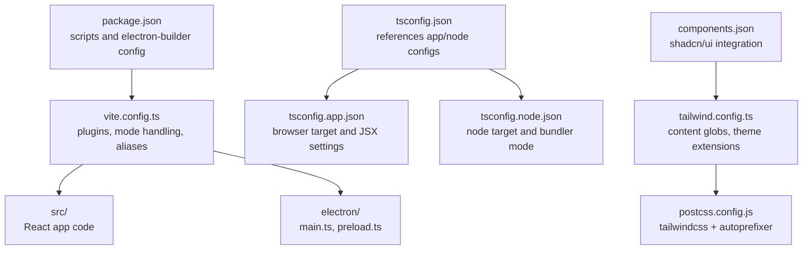
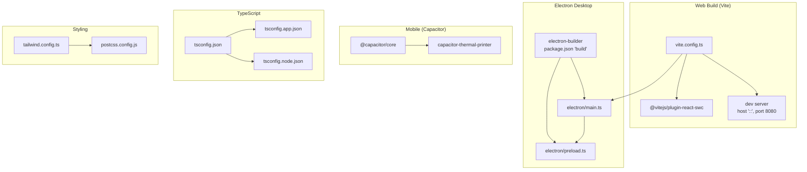
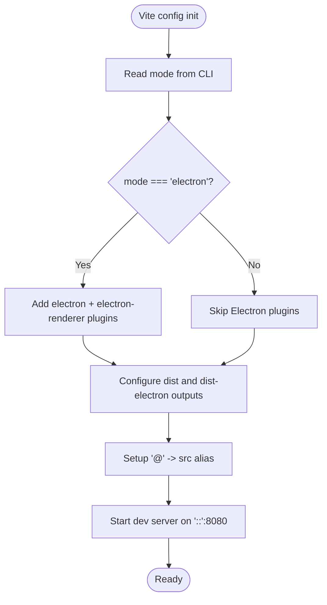
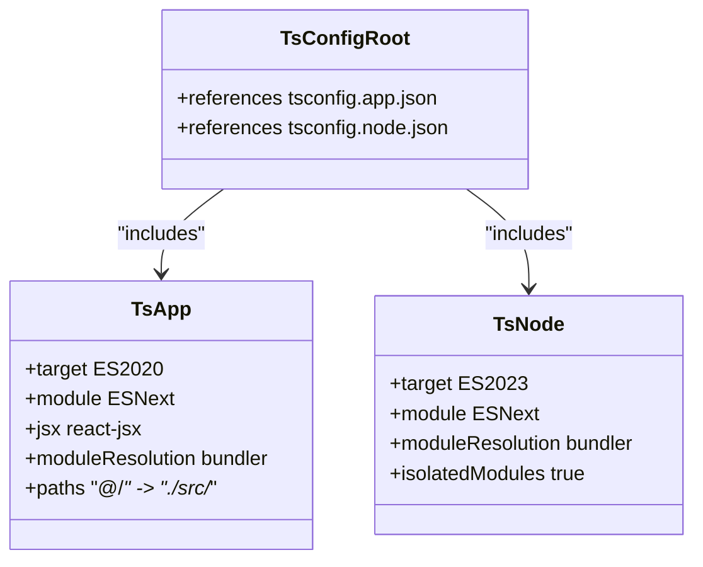
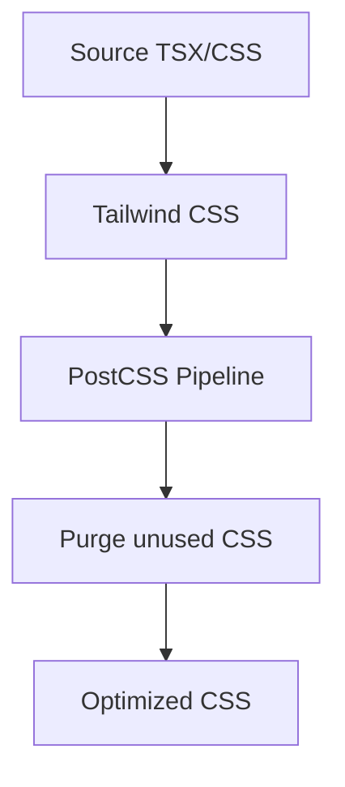
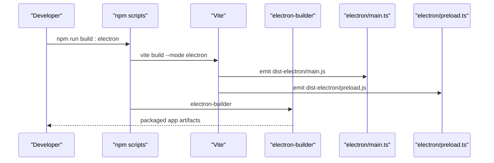
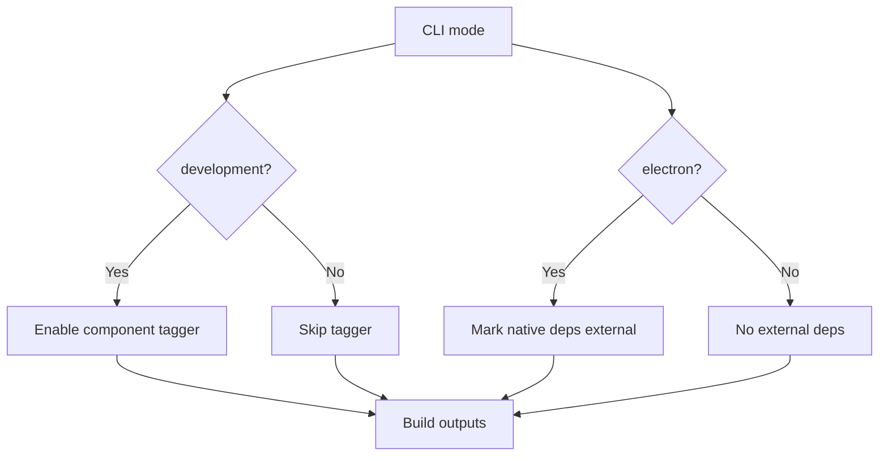
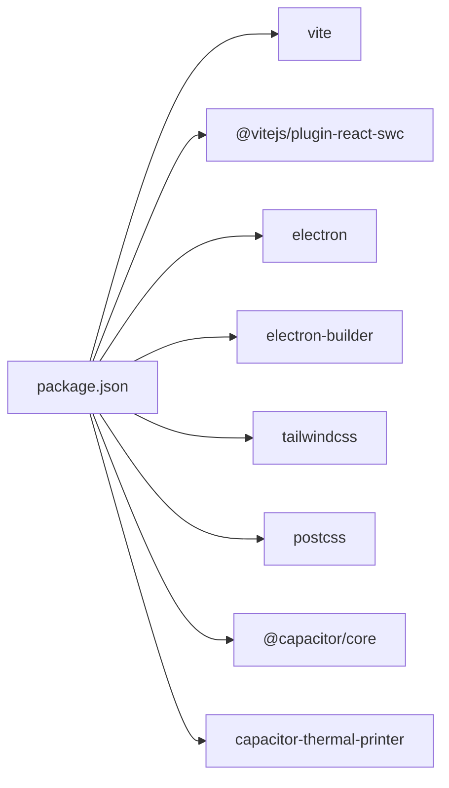

# Build Configuration & Optimization

<cite>
**Referenced Files in This Document**
- [package.json](file://package.json)
- [vite.config.ts](file://vite.config.ts)
- [tsconfig.json](file://tsconfig.json)
- [tsconfig.app.json](file://tsconfig.app.json)
- [tsconfig.node.json](file://tsconfig.node.json)
- [tailwind.config.ts](file://tailwind.config.ts)
- [postcss.config.js](file://postcss.config.js)
- [components.json](file://components.json)
- [electron/main.ts](file://electron/main.ts)
- [electron/preload.ts](file://electron/preload.ts)
</cite>

## Table of Contents
1. [Introduction](#introduction)
2. [Project Structure](#project-structure)
3. [Core Components](#core-components)
4. [Architecture Overview](#architecture-overview)
5. [Detailed Component Analysis](#detailed-component-analysis)
6. [Dependency Analysis](#dependency-analysis)
7. [Performance Considerations](#performance-considerations)
8. [Troubleshooting Guide](#troubleshooting-guide)
9. [Conclusion](#conclusion)
10. [Appendices](#appendices)

## Introduction
This document explains the build configuration and optimization strategies for TableFlow Pro. It covers the Vite build system setup, TypeScript compilation configuration, and Tailwind CSS optimization. It documents multi-platform build targets (web, desktop via Electron, and mobile via Capacitor), build modes and environment-specific configurations, and production deployment optimizations. It also details the Vite and TypeScript configuration files, asset optimization, code splitting, and bundle analysis approaches, along with practical customization examples and troubleshooting guidance.

## Project Structure
TableFlow Pro uses Vite for building the web application, with optional Electron integration for desktop builds and Capacitor for mobile capabilities. The repository includes:
- Vite configuration for development and production builds
- TypeScript configuration split across app and node environments
- Tailwind CSS configuration and PostCSS pipeline
- Electron main and preload scripts for desktop packaging
- Capacitor integration for mobile printing and platform features

**Diagram sources**
- [package.json:1-131](file://package.json#L1-L131)
- [vite.config.ts:1-69](file://vite.config.ts#L1-L69)
- [tsconfig.json:1-24](file://tsconfig.json#L1-L24)
- [tsconfig.app.json:1-32](file://tsconfig.app.json#L1-L32)
- [tsconfig.node.json:1-23](file://tsconfig.node.json#L1-L23)
- [tailwind.config.ts:1-114](file://tailwind.config.ts#L1-L114)
- [postcss.config.js:1-7](file://postcss.config.js#L1-L7)
- [components.json:1-21](file://components.json#L1-L21)

**Section sources**
- [package.json:1-131](file://package.json#L1-L131)
- [vite.config.ts:1-69](file://vite.config.ts#L1-L69)
- [tsconfig.json:1-24](file://tsconfig.json#L1-L24)
- [tsconfig.app.json:1-32](file://tsconfig.app.json#L1-L32)
- [tsconfig.node.json:1-23](file://tsconfig.node.json#L1-L23)
- [tailwind.config.ts:1-114](file://tailwind.config.ts#L1-L114)
- [postcss.config.js:1-7](file://postcss.config.js#L1-L7)
- [components.json:1-21](file://components.json#L1-L21)

## Core Components
- Vite configuration defines plugins, mode-based behavior, server settings, and Electron integration.
- TypeScript configurations separate browser and node targets for optimal type checking and bundling.
- Tailwind CSS and PostCSS handle styling and CSS optimization.
- Electron main and preload scripts enable native capabilities and secure IPC bridges.
- Capacitor integration supports mobile printing and native platform features.

**Section sources**
- [vite.config.ts:1-69](file://vite.config.ts#L1-L69)
- [tsconfig.app.json:1-32](file://tsconfig.app.json#L1-L32)
- [tsconfig.node.json:1-23](file://tsconfig.node.json#L1-L23)
- [tailwind.config.ts:1-114](file://tailwind.config.ts#L1-L114)
- [postcss.config.js:1-7](file://postcss.config.js#L1-L7)
- [electron/main.ts:1-450](file://electron/main.ts#L1-L450)
- [electron/preload.ts:1-90](file://electron/preload.ts#L1-L90)

## Architecture Overview
The build architecture integrates Vite for web assets, Electron for desktop packaging, and Capacitor for mobile features. Vite handles React compilation, plugin composition, and development server. Electron builds the main process and preload bridge, while Capacitor enables mobile printing and platform detection.

**Diagram sources**
- [vite.config.ts:1-69](file://vite.config.ts#L1-L69)
- [package.json:107-129](file://package.json#L107-L129)
- [electron/main.ts:1-450](file://electron/main.ts#L1-L450)
- [electron/preload.ts:1-90](file://electron/preload.ts#L1-L90)
- [tsconfig.json:1-24](file://tsconfig.json#L1-L24)
- [tsconfig.app.json:1-32](file://tsconfig.app.json#L1-L32)
- [tsconfig.node.json:1-23](file://tsconfig.node.json#L1-L23)
- [tailwind.config.ts:1-114](file://tailwind.config.ts#L1-L114)
- [postcss.config.js:1-7](file://postcss.config.js#L1-L7)

## Detailed Component Analysis

### Vite Build System Setup
- Mode handling: The Vite config reads the current mode and activates Electron-specific plugins and outputs when the mode is set to electron.
- Plugins: React plugin for fast compilation, component tagger in development, and Electron plugins for main and preload builds.
- Aliasing: Path alias @ resolves to src for clean imports.
- Server: Host and port configured for development; Electron loads from dev server or built files depending on environment.

**Diagram sources**
- [vite.config.ts:9-68](file://vite.config.ts#L9-L68)

**Section sources**
- [vite.config.ts:1-69](file://vite.config.ts#L1-L69)

### TypeScript Compilation Configuration
- Root tsconfig references app and node configs for separation of concerns.
- App config targets modern browsers, JSX transform, and bundler module resolution.
- Node config targets Node runtime, bundler mode, and strictness for Vite config typing.

**Diagram sources**
- [tsconfig.json:1-24](file://tsconfig.json#L1-L24)
- [tsconfig.app.json:1-32](file://tsconfig.app.json#L1-L32)
- [tsconfig.node.json:1-23](file://tsconfig.node.json#L1-L23)

**Section sources**
- [tsconfig.json:1-24](file://tsconfig.json#L1-L24)
- [tsconfig.app.json:1-32](file://tsconfig.app.json#L1-L32)
- [tsconfig.node.json:1-23](file://tsconfig.node.json#L1-L23)

### Tailwind CSS Optimization
- Content scanning includes pages, components, app, and src directories to purge unused styles.
- Theme extends typography, spacing, shadows, gradients, animations, and color palettes.
- PostCSS pipeline applies Tailwind and Autoprefixer for optimized CSS output.

**Diagram sources**
- [tailwind.config.ts:1-114](file://tailwind.config.ts#L1-L114)
- [postcss.config.js:1-7](file://postcss.config.js#L1-L7)

**Section sources**
- [tailwind.config.ts:1-114](file://tailwind.config.ts#L1-L114)
- [postcss.config.js:1-7](file://postcss.config.js#L1-L7)
- [components.json:1-21](file://components.json#L1-L21)

### Multi-Platform Build Targets
- Web: Standard Vite build for browsers.
- Desktop (Electron): Vite builds main and preload, packaged with electron-builder.
- Mobile (Capacitor): Capacitor core and thermal printer plugin for mobile printing and platform detection.

**Diagram sources**
- [package.json:7-15](file://package.json#L7-L15)
- [vite.config.ts:22-59](file://vite.config.ts#L22-L59)
- [electron/main.ts:34-40](file://electron/main.ts#L34-L40)
- [electron/preload.ts:1-90](file://electron/preload.ts#L1-L90)
- [package.json:107-129](file://package.json#L107-L129)

**Section sources**
- [package.json:7-15](file://package.json#L7-L15)
- [vite.config.ts:1-69](file://vite.config.ts#L1-L69)
- [electron/main.ts:1-450](file://electron/main.ts#L1-L450)
- [electron/preload.ts:1-90](file://electron/preload.ts#L1-L90)
- [package.json:107-129](file://package.json#L107-L129)

### Build Modes and Environment-Specific Configurations
- Development mode: React plugin active, component tagger enabled for development builds.
- Electron mode: Electron plugin chain compiles main and preload, sets external dependencies, and outputs to dist-electron.
- Production mode: Vite minifies and optimizes bundles; electron-builder packages installers.

**Diagram sources**
- [vite.config.ts:9-61](file://vite.config.ts#L9-L61)

**Section sources**
- [vite.config.ts:1-69](file://vite.config.ts#L1-L69)

### Asset Optimization, Code Splitting, and Bundle Analysis
- Asset optimization: Tailwind purging and PostCSS autoprefixing reduce CSS size; Vite minification reduces JS/CSS.
- Code splitting: Vite’s bundler naturally splits chunks; configure dynamic imports for route-level splitting.
- Bundle analysis: Use Vite plugins or Rollup analyzer to inspect bundle composition and identify large dependencies.

[No sources needed since this section provides general guidance]

### Practical Examples of Build Customization
- Enable component tagging in development: Keep the component tagger plugin active during development for improved DX.
- Adjust Electron externals: Add or remove native dependencies in the Electron build’s external list to control packaging size.
- Customize Tailwind content globs: Expand content paths to include new component directories to prevent style purging.
- Optimize PostCSS: Add or adjust PostCSS plugins for advanced CSS transformations as needed.

[No sources needed since this section provides general guidance]

## Dependency Analysis
The build system relies on Vite, TypeScript, Tailwind CSS, and Electron builder. Dependencies are declared in package.json, with devDependencies for build-time tools and dependencies for runtime features.

**Diagram sources**
- [package.json:17-106](file://package.json#L17-L106)

**Section sources**
- [package.json:1-131](file://package.json#L1-L131)

## Performance Considerations
- Prefer dynamic imports for routes and heavy components to leverage Vite’s code splitting.
- Keep Tailwind content globs precise to avoid unnecessary CSS generation.
- Minimize external native dependencies in Electron main/preload to reduce installer size.
- Use production builds for performance testing and profiling.

[No sources needed since this section provides general guidance]

## Troubleshooting Guide
- Electron rebuild failures: Run the postinstall script to rebuild native modules for Electron.
- Missing native dependencies in production: Ensure externals in the Electron build exclude Node/Electron-native modules.
- Tailwind utilities missing in production: Verify content globs and re-run builds to regenerate CSS.
- Capacitor mobile printing not available on web: Use platform checks to guard mobile-only features.

**Section sources**
- [package.json:13](file://package.json#L13)
- [vite.config.ts:32](file://vite.config.ts#L32)
- [tailwind.config.ts:5](file://tailwind.config.ts#L5)
- [electron/main.ts:34-40](file://electron/main.ts#L34-L40)

## Conclusion
TableFlow Pro’s build system combines Vite, TypeScript, Tailwind CSS, and Electron builder to support web, desktop, and mobile targets. By leveraging mode-aware configurations, precise content globs, and Electron externals, teams can optimize builds for speed, size, and reliability across platforms.

[No sources needed since this section summarizes without analyzing specific files]

## Appendices
- Build scripts reference: [package.json:7-15](file://package.json#L7-L15)
- Electron builder configuration: [package.json:107-129](file://package.json#L107-L129)
- Vite config reference: [vite.config.ts:1-69](file://vite.config.ts#L1-L69)
- TypeScript configs reference: [tsconfig.json:1-24](file://tsconfig.json#L1-L24), [tsconfig.app.json:1-32](file://tsconfig.app.json#L1-L32), [tsconfig.node.json:1-23](file://tsconfig.node.json#L1-L23)
- Tailwind and PostCSS reference: [tailwind.config.ts:1-114](file://tailwind.config.ts#L1-L114), [postcss.config.js:1-7](file://postcss.config.js#L1-L7)
- Electron main/preload reference: [electron/main.ts:1-450](file://electron/main.ts#L1-L450), [electron/preload.ts:1-90](file://electron/preload.ts#L1-L90)