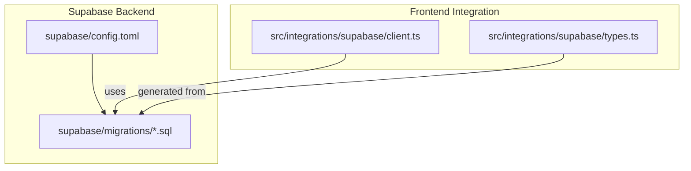
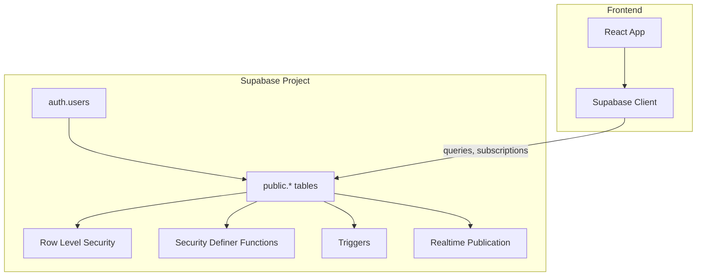
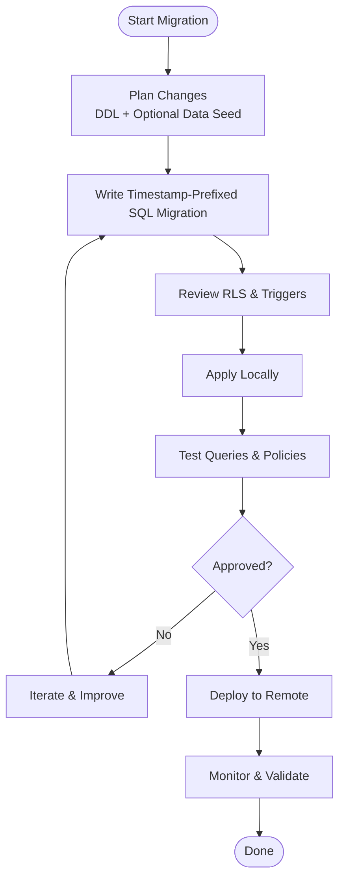
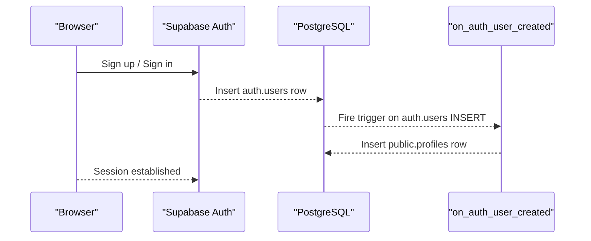
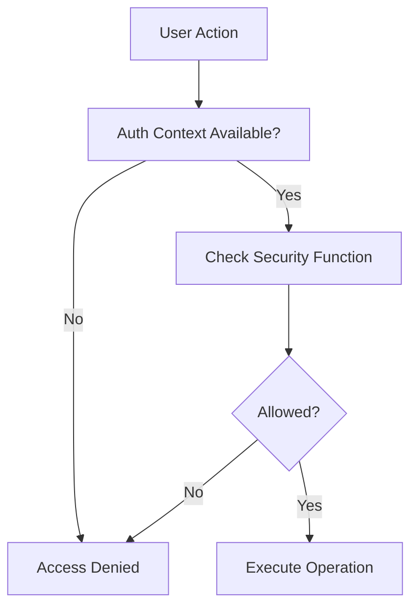
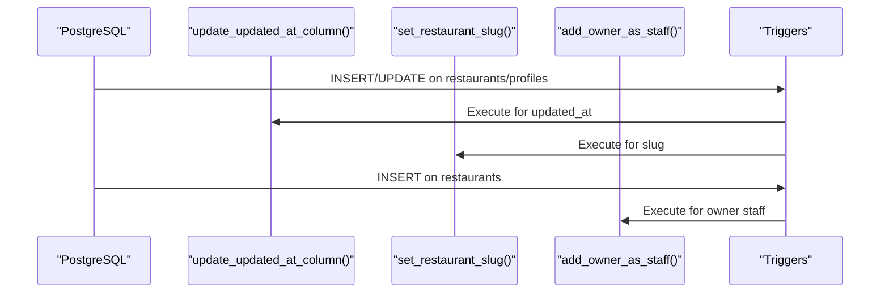
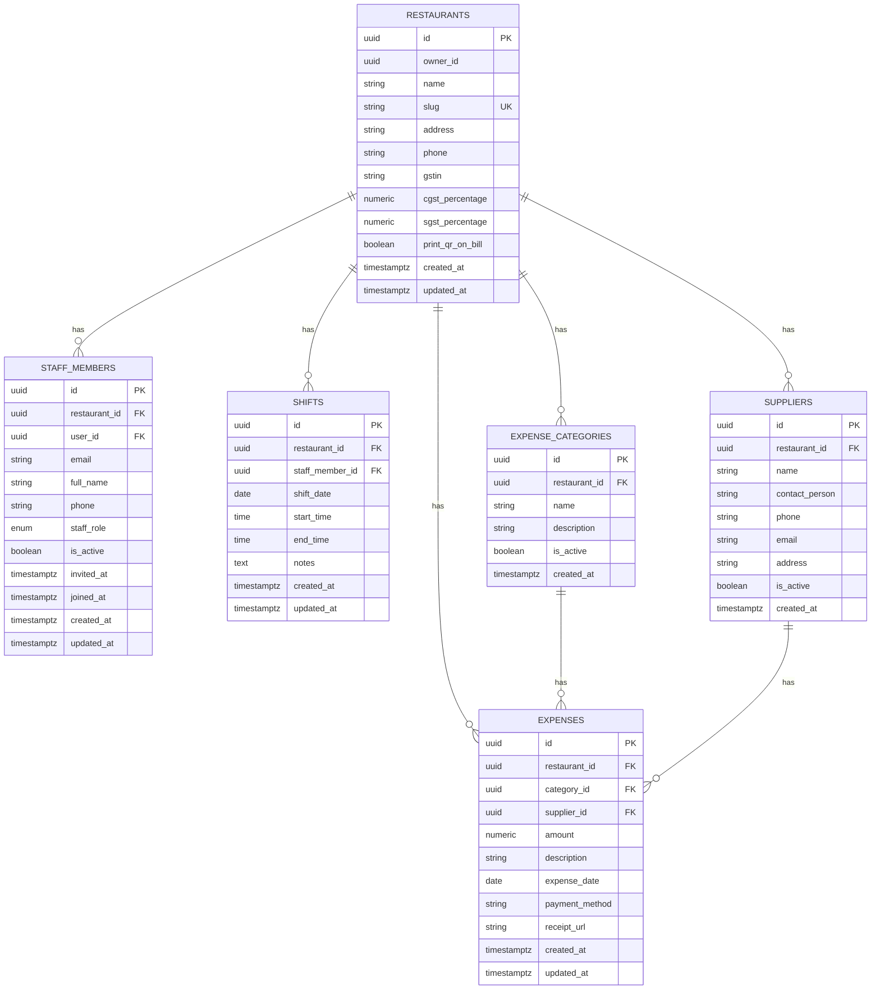
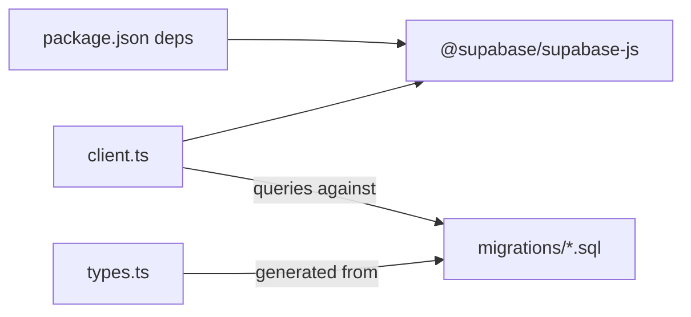

# Database Deployment & Supabase Management

<cite>
**Referenced Files in This Document**
- [config.toml](file://supabase/config.toml)
- [client.ts](file://src/integrations/supabase/client.ts)
- [types.ts](file://src/integrations/supabase/types.ts)
- [package.json](file://package.json)
- [README.md](file://README.md)
- [20251206042902_fc2b1d91-eb8e-4750-90c3-95b7e0feb6ba.sql](file://supabase/migrations/20251206042902_fc2b1d91-eb8e-4750-90c3-95b7e0feb6ba.sql)
- [20251206062448_4e2d7da9-9519-48ae-9d6c-bb1c994ed84a.sql](file://supabase/migrations/20251206062448_4e2d7da9-9519-48ae-9d6c-bb1c994ed84a.sql)
- [20251206081648_ef719884-b181-43d8-832a-02825f1b3a50.sql](file://supabase/migrations/20251206081648_ef719884-b181-43d8-832a-02825f1b3a50.sql)
- [20251206132719_11d13f91-c469-437f-9d98-63127362f20c.sql](file://supabase/migrations/20251206132719_11d13f91-c469-437f-9d98-63127362f20c.sql)
- [20251206133509_50399ee0-7c3e-4927-bf1a-00556ef24c8c.sql](file://supabase/migrations/20251206133509_50399ee0-7c3e-4927-bf1a-00556ef24c8c.sql)
- [20251206133955_231d3ef6-16e8-41de-8662-8dc09a54c6e3.sql](file://supabase/migrations/20251206133955_231d3ef6-16e8-41de-8662-8dc09a54c6e3.sql)
- [20251206134902_8243dfe0-8b9c-4c6d-9a42-278158976001.sql](file://supabase/migrations/20251206134902_8243dfe0-8b9c-4c6d-9a42-278158976001.sql)
- [20251212061838_061086f8-bf22-458f-b2e6-20f8199ee7ce.sql](file://supabase/migrations/20251212061838_061086f8-bf22-458f-b2e6-20f8199ee7ce.sql)
- [20260108133558_b2ed5e93-fda3-4022-bc45-a2fe64b46615.sql](file://supabase/migrations/20260108133558_b2ed5e93-fda3-4022-bc45-a2fe64b46615.sql)
</cite>

## Table of Contents
1. [Introduction](#introduction)
2. [Project Structure](#project-structure)
3. [Core Components](#core-components)
4. [Architecture Overview](#architecture-overview)
5. [Detailed Component Analysis](#detailed-component-analysis)
6. [Dependency Analysis](#dependency-analysis)
7. [Performance Considerations](#performance-considerations)
8. [Troubleshooting Guide](#troubleshooting-guide)
9. [Conclusion](#conclusion)
10. [Appendices](#appendices)

## Introduction
This document provides comprehensive guidance for deploying and managing the Supabase backend used by TableFlow Pro. It covers Supabase project setup, database schema deployment via migrations, migration management, authentication configuration, row-level security (RLS) policies, database triggers, and practical procedures for initialization, schema updates, and data seeding. It also outlines environment-specific setup, monitoring, backups, and production performance optimization strategies.

## Project Structure
The Supabase configuration and schema are managed under the supabase directory, with migrations stored as SQL files named with timestamp prefixes. The frontend integrates with Supabase using a dedicated client and TypeScript-generated database types.

**Diagram sources**
- [config.toml:1-1](file://supabase/config.toml#L1-L1)
- [client.ts:1-17](file://src/integrations/supabase/client.ts#L1-L17)
- [types.ts:1-818](file://src/integrations/supabase/types.ts#L1-L818)

**Section sources**
- [README.md:1-13](file://README.md#L1-L13)
- [config.toml:1-1](file://supabase/config.toml#L1-L1)
- [client.ts:1-17](file://src/integrations/supabase/client.ts#L1-L17)
- [types.ts:1-818](file://src/integrations/supabase/types.ts#L1-L818)

## Core Components
- Supabase project configuration: Defines the Supabase project identifier used during local development and deployment.
- Supabase client: Initializes the Supabase client with environment variables for URL and publishable key, enabling session persistence and token refresh.
- Database types: TypeScript types generated from the Supabase schema, enabling type-safe database operations across the frontend.

Key responsibilities:
- Project configuration ties local development to the correct Supabase project.
- The client encapsulates Supabase authentication and session behavior.
- Types provide compile-time safety for database operations.

**Section sources**
- [config.toml:1-1](file://supabase/config.toml#L1-L1)
- [client.ts:5-17](file://src/integrations/supabase/client.ts#L5-L17)
- [types.ts:9-688](file://src/integrations/supabase/types.ts#L9-L688)

## Architecture Overview
The Supabase backend is composed of:
- PostgreSQL database with RLS-enabled tables and security-definer functions.
- Authentication via Supabase Auth (auth.users).
- Realtime subscriptions for selected tables.
- Triggers to maintain updated_at timestamps and automate auxiliary tasks (e.g., profile creation, slug generation, owner staff assignment).

**Diagram sources**
- [20251206042902_fc2b1d91-eb8e-4750-90c3-95b7e0feb6ba.sql:110-210](file://supabase/migrations/20251206042902_fc2b1d91-eb8e-4750-90c3-95b7e0feb6ba.sql#L110-L210)
- [20251206081648_ef719884-b181-43d8-832a-02825f1b3a50.sql:39-157](file://supabase/migrations/20251206081648_ef719884-b181-43d8-832a-02825f1b3a50.sql#L39-L157)
- [20251206062448_4e2d7da9-9519-48ae-9d6c-bb1c994ed84a.sql:38-64](file://supabase/migrations/20251206062448_4e2d7da9-9519-48ae-9d6c-bb1c994ed84a.sql#L38-L64)
- [client.ts:11-17](file://src/integrations/supabase/client.ts#L11-L17)

## Detailed Component Analysis

### Supabase Project Setup
- Project identifier: The project ID is defined in the Supabase configuration file and is used to bind local development to the correct Supabase project.
- Environment variables: The Supabase client reads runtime environment variables for the Supabase URL and publishable key, ensuring configuration separation between environments.

Practical steps:
- Set VITE_SUPABASE_URL and VITE_SUPABASE_PUBLISHABLE_KEY in your environment.
- Use the Supabase CLI to push migrations and manage the project remotely.

**Section sources**
- [config.toml:1-1](file://supabase/config.toml#L1-L1)
- [client.ts:5-17](file://src/integrations/supabase/client.ts#L5-L17)

### Database Schema Deployment and Migration Management
The schema is deployed and evolved through SQL migration files. Each migration file is timestamp-prefixed and contains:
- Type definitions (enums).
- Table creation with primary keys, foreign keys, defaults, and constraints.
- RLS enablement and policies.
- Security-definer functions and triggers.
- Realtime publication adjustments.

Migration workflow:
- Create a new migration file with a timestamp prefix.
- Add DDL statements for schema changes.
- Optionally add data seeding or updates.
- Apply migrations locally and in CI/CD pipelines.

Rollback strategies:
- Prefer forward-only migrations with corrective changes in subsequent migrations.
- For reversible changes, encapsulate them in a transaction and add a companion migration to revert.

**Section sources**
- [20251206042902_fc2b1d91-eb8e-4750-90c3-95b7e0feb6ba.sql:1-210](file://supabase/migrations/20251206042902_fc2b1d91-eb8e-4750-90c3-95b7e0feb6ba.sql#L1-L210)
- [20251206062448_4e2d7da9-9519-48ae-9d6c-bb1c994ed84a.sql:1-64](file://supabase/migrations/20251206062448_4e2d7da9-9519-48ae-9d6c-bb1c994ed84a.sql#L1-L64)
- [20251206081648_ef719884-b181-43d8-832a-02825f1b3a50.sql:1-157](file://supabase/migrations/20251206081648_ef719884-b181-43d8-832a-02825f1b3a50.sql#L1-L157)
- [20251212061838_061086f8-bf22-458f-b2e6-20f8199ee7ce.sql:1-83](file://supabase/migrations/20251212061838_061086f8-bf22-458f-b2e6-20f8199ee7ce.sql#L1-L83)

### Authentication Configuration
- Supabase Auth integration: The client initializes with session persistence and automatic token refresh.
- User lifecycle: A trigger on auth.users creates a profile for each new user.
- Role-based access: Staff members link users to restaurants with roles; security-definer functions check ownership and management access.

**Diagram sources**
- [20251206042902_fc2b1d91-eb8e-4750-90c3-95b7e0feb6ba.sql:189-205](file://supabase/migrations/20251206042902_fc2b1d91-eb8e-4750-90c3-95b7e0feb6ba.sql#L189-L205)
- [client.ts:11-17](file://src/integrations/supabase/client.ts#L11-L17)

**Section sources**
- [client.ts:11-17](file://src/integrations/supabase/client.ts#L11-L17)
- [20251206042902_fc2b1d91-eb8e-4750-90c3-95b7e0feb6ba.sql:189-205](file://supabase/migrations/20251206042902_fc2b1d91-eb8e-4750-90c3-95b7e0feb6ba.sql#L189-L205)

### Row-Level Security Policies
RLS is enabled on most tables and enforced via security-definer functions to prevent recursion and simplify policy logic. Policies grant access based on:
- Ownership checks (owner of a restaurant).
- Management access (owner or manager).
- Staff membership and activity status.
- Email-based linking for unlinked staff records.

**Diagram sources**
- [20251206081648_ef719884-b181-43d8-832a-02825f1b3a50.sql:39-80](file://supabase/migrations/20251206081648_ef719884-b181-43d8-832a-02825f1b3a50.sql#L39-L80)
- [20251206133955_231d3ef6-16e8-41de-8662-8dc09a54c6e3.sql:17-46](file://supabase/migrations/20251206133955_231d3ef6-16e8-41de-8662-8dc09a54c6e3.sql#L17-L46)
- [20251206134902_8243dfe0-8b9c-4c6d-9a42-278158976001.sql:4-76](file://supabase/migrations/20251206134902_8243dfe0-8b9c-4c6d-9a42-278158976001.sql#L4-L76)

**Section sources**
- [20251206042902_fc2b1d91-eb8e-4750-90c3-95b7e0feb6ba.sql:110-172](file://supabase/migrations/20251206042902_fc2b1d91-eb8e-4750-90c3-95b7e0feb6ba.sql#L110-L172)
- [20251206081648_ef719884-b181-43d8-832a-02825f1b3a50.sql:81-118](file://supabase/migrations/20251206081648_ef719884-b181-43d8-832a-02825f1b3a50.sql#L81-L118)
- [20251212061838_061086f8-bf22-458f-b2e6-20f8199ee7ce.sql:39-72](file://supabase/migrations/20251212061838_061086f8-bf22-458f-b2e6-20f8199ee7ce.sql#L39-L72)

### Database Triggers and Functions
- Timestamp maintenance: A generic function updates updated_at on supported tables.
- New user handling: Automatically creates a profile when a user signs up.
- Slug generation: Generates unique restaurant slugs and applies them on insert/update.
- Owner assignment: Automatically adds the restaurant owner as a staff member upon creation.

**Diagram sources**
- [20251206042902_fc2b1d91-eb8e-4750-90c3-95b7e0feb6ba.sql:174-205](file://supabase/migrations/20251206042902_fc2b1d91-eb8e-4750-90c3-95b7e0feb6ba.sql#L174-L205)
- [20251206062448_4e2d7da9-9519-48ae-9d6c-bb1c994ed84a.sql:38-64](file://supabase/migrations/20251206062448_4e2d7da9-9519-48ae-9d6c-bb1c994ed84a.sql#L38-L64)
- [20251206081648_ef719884-b181-43d8-832a-02825f1b3a50.sql:131-157](file://supabase/migrations/20251206081648_ef719884-b181-43d8-832a-02825f1b3a50.sql#L131-L157)

**Section sources**
- [20251206042902_fc2b1d91-eb8e-4750-90c3-95b7e0feb6ba.sql:174-210](file://supabase/migrations/20251206042902_fc2b1d91-eb8e-4750-90c3-95b7e0feb6ba.sql#L174-L210)
- [20251206062448_4e2d7da9-9519-48ae-9d6c-bb1c994ed84a.sql:38-64](file://supabase/migrations/20251206062448_4e2d7da9-9519-48ae-9d6c-bb1c994ed84a.sql#L38-L64)
- [20251206081648_ef719884-b181-43d8-832a-02825f1b3a50.sql:131-157](file://supabase/migrations/20251206081648_ef719884-b181-43d8-832a-02825f1b3a50.sql#L131-L157)

### Practical Procedures

#### Database Initialization
- Apply all migrations in order to create the initial schema.
- Verify RLS policies and triggers are active.
- Confirm that the Supabase client connects using the configured environment variables.

References:
- [20251206042902_fc2b1d91-eb8e-4750-90c3-95b7e0feb6ba.sql:1-210](file://supabase/migrations/20251206042902_fc2b1d91-eb8e-4750-90c3-95b7e0feb6ba.sql#L1-L210)

#### Schema Updates
- Create a new timestamp-prefixed migration file.
- Add DDL statements; if adding data, include seed data updates.
- Validate RLS and triggers remain intact.
- Apply locally, test, then deploy to remote.

References:
- [20251206062448_4e2d7da9-9519-48ae-9d6c-bb1c994ed84a.sql:1-64](file://supabase/migrations/20251206062448_4e2d7da9-9519-48ae-9d6c-bb1c994ed84a.sql#L1-L64)
- [20251212061838_061086f8-bf22-458f-b2e6-20f8199ee7ce.sql:1-83](file://supabase/migrations/20251212061838_061086f8-bf22-458f-b2e6-20f8199ee7ce.sql#L1-L83)

#### Data Seeding
- Seed minimal data in the same migration where applicable.
- For large datasets, prefer separate migrations and keep them idempotent.

References:
- [20251206062448_4e2d7da9-9519-48ae-9d6c-bb1c994ed84a.sql:57-64](file://supabase/migrations/20251206062448_4e2d7da9-9519-48ae-9d6c-bb1c994ed84a.sql#L57-L64)

#### Supabase CLI Usage
- Configure the project using the project ID from the configuration file.
- Push migrations to apply schema changes.
- Manage secrets and environment variables via the CLI.

References:
- [config.toml:1-1](file://supabase/config.toml#L1-L1)
- [package.json:7-16](file://package.json#L7-L16)

#### Environment-Specific Setup
- Local development: Use VITE_SUPABASE_URL and VITE_SUPABASE_PUBLISHABLE_KEY.
- Staging/Production: Set environment variables accordingly and restrict access to secrets.

References:
- [client.ts:5-17](file://src/integrations/supabase/client.ts#L5-L17)

### Data Model Overview
The schema centers around restaurants, staff, menus, orders, and related entities, with RLS policies ensuring tenant isolation and role-based access.

**Diagram sources**
- [20251206042902_fc2b1d91-eb8e-4750-90c3-95b7e0feb6ba.sql:16-82](file://supabase/migrations/20251206042902_fc2b1d91-eb8e-4750-90c3-95b7e0feb6ba.sql#L16-L82)
- [20251206081648_ef719884-b181-43d8-832a-02825f1b3a50.sql:5-33](file://supabase/migrations/20251206081648_ef719884-b181-43d8-832a-02825f1b3a50.sql#L5-L33)
- [20251212061838_061086f8-bf22-458f-b2e6-20f8199ee7ce.sql:1-37](file://supabase/migrations/20251212061838_061086f8-bf22-458f-b2e6-20f8199ee7ce.sql#L1-L37)

## Dependency Analysis
- Frontend depends on the Supabase client and TypeScript types.
- Migrations define the canonical schema and policies.
- Security-definer functions centralize access control logic.

**Diagram sources**
- [package.json:47-47](file://package.json#L47-L47)
- [client.ts:2-3](file://src/integrations/supabase/client.ts#L2-L3)
- [types.ts:1-14](file://src/integrations/supabase/types.ts#L1-L14)
- [20251206042902_fc2b1d91-eb8e-4750-90c3-95b7e0feb6ba.sql:1-210](file://supabase/migrations/20251206042902_fc2b1d91-eb8e-4750-90c3-95b7e0feb6ba.sql#L1-L210)

**Section sources**
- [package.json:47-47](file://package.json#L47-L47)
- [client.ts:2-3](file://src/integrations/supabase/client.ts#L2-L3)
- [types.ts:1-14](file://src/integrations/supabase/types.ts#L1-L14)

## Performance Considerations
- Indexes: Create indexes on frequently filtered columns (e.g., expenses restaurant and date).
- Triggers: Keep trigger functions lightweight; avoid heavy computations.
- RLS: Security-definer functions reduce policy complexity and recursion risk.
- Realtime: Limit subscribed tables to those requiring live updates.

References:
- [20251212061838_061086f8-bf22-458f-b2e6-20f8199ee7ce.sql:74-83](file://supabase/migrations/20251212061838_061086f8-bf22-458f-b2e6-20f8199ee7ce.sql#L74-L83)

## Troubleshooting Guide
Common issues and resolutions:
- Authentication failures: Verify VITE_SUPABASE_URL and VITE_SUPABASE_PUBLISHABLE_KEY are set and correct.
- RLS access denied: Confirm the user’s role and restaurant membership; review security-definer functions.
- Slug conflicts: Ensure slug generation function uniqueness and re-run population for existing records.
- Missing staff records: Use the owner assignment trigger or run the data seeding migration.

References:
- [client.ts:5-17](file://src/integrations/supabase/client.ts#L5-L17)
- [20251206062448_4e2d7da9-9519-48ae-9d6c-bb1c994ed84a.sql:57-64](file://supabase/migrations/20251206062448_4e2d7da9-9519-48ae-9d6c-bb1c994ed84a.sql#L57-L64)
- [20251206081648_ef719884-b181-43d8-832a-02825f1b3a50.sql:131-157](file://supabase/migrations/20251206081648_ef719884-b181-43d8-832a-02825f1b3a50.sql#L131-L157)

## Conclusion
TableFlow Pro’s Supabase backend is structured for tenant isolation, role-based access, and scalable evolution through migrations. By following the documented migration workflow, leveraging RLS and security-definer functions, and applying performance best practices, teams can reliably deploy, monitor, and operate the database in development and production environments.

## Appendices

### Appendix A: Migration Reference
- Initial schema and RLS: [20251206042902_fc2b1d91-eb8e-4750-90c3-95b7e0feb6ba.sql:1-210](file://supabase/migrations/20251206042902_fc2b1d91-eb8e-4750-90c3-95b7e0feb6ba.sql#L1-L210)
- Restaurant slug generation: [20251206062448_4e2d7da9-9519-48ae-9d6c-bb1c994ed84a.sql:1-64](file://supabase/migrations/20251206062448_4e2d7da9-9519-48ae-9d6c-bb1c994ed84a.sql#L1-L64)
- Staff and shifts: [20251206081648_ef719884-b181-43d8-832a-02825f1b3a50.sql:1-157](file://supabase/migrations/20251206081648_ef719884-b181-43d8-832a-02825f1b3a50.sql#L1-L157)
- Staff email linking and restaurant access: [20251206133955_231d3ef6-16e8-41de-8662-8dc09a54c6e3.sql:1-63](file://supabase/migrations/20251206133955_231d3ef6-16e8-41de-8662-8dc09a54c6e3.sql#L1-L63)
- Expanded staff access to orders and related tables: [20251206134902_8243dfe0-8b9c-4c6d-9a42-278158976001.sql:1-76](file://supabase/migrations/20251206134902_8243dfe0-8b9c-4c6d-9a42-278158976001.sql#L1-L76)
- Expenses module: [20251212061838_061086f8-bf22-458f-b2e6-20f8199ee7ce.sql:1-83](file://supabase/migrations/20251212061838_061086f8-bf22-458f-b2e6-20f8199ee7ce.sql#L1-L83)
- Payment method on orders: [20260108133558_b2ed5e93-fda3-4022-bc45-a2fe64b46615.sql:1-6](file://supabase/migrations/20260108133558_b2ed5e93-fda3-4022-bc45-a2fe64b46615.sql#L1-L6)

### Appendix B: Supabase CLI and Environment Variables
- Project configuration: [config.toml:1-1](file://supabase/config.toml#L1-L1)
- Client environment variables: [client.ts:5-17](file://src/integrations/supabase/client.ts#L5-L17)
- Scripts for local development and build: [package.json:7-16](file://package.json#L7-L16)