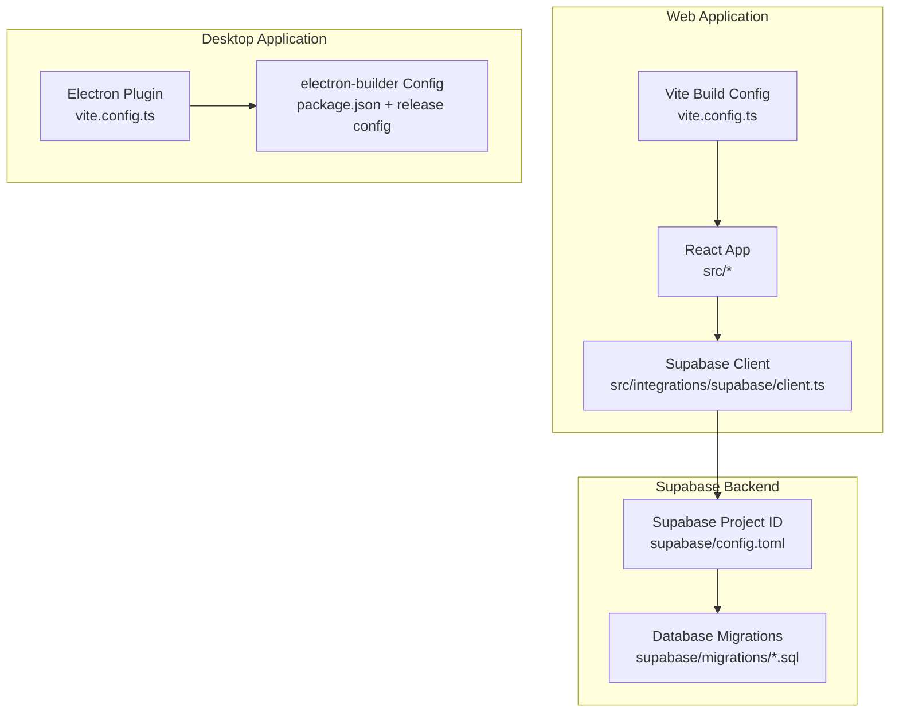
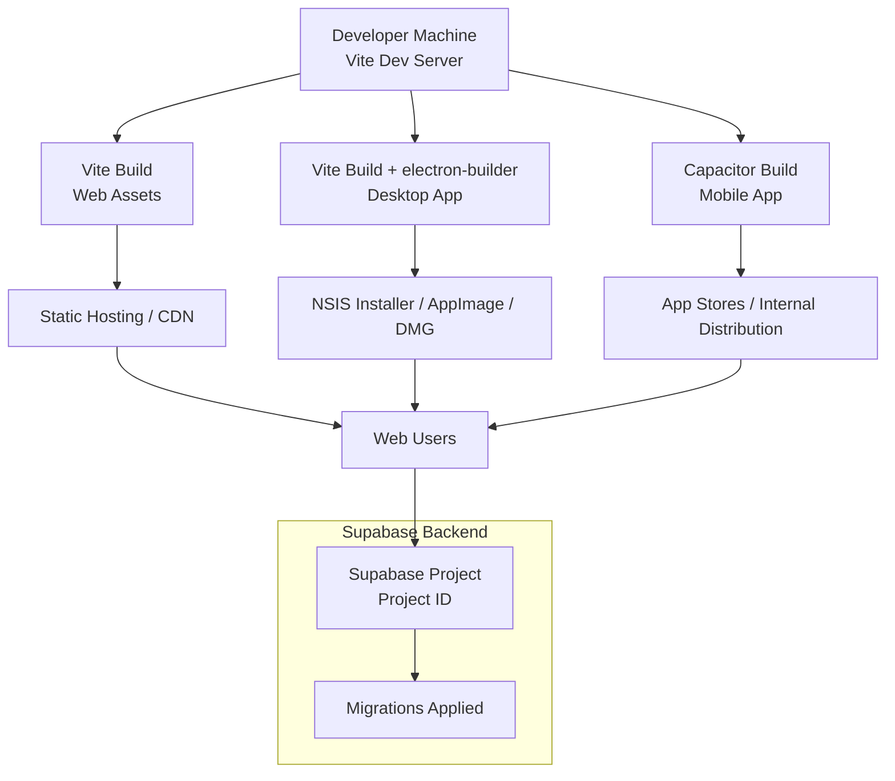
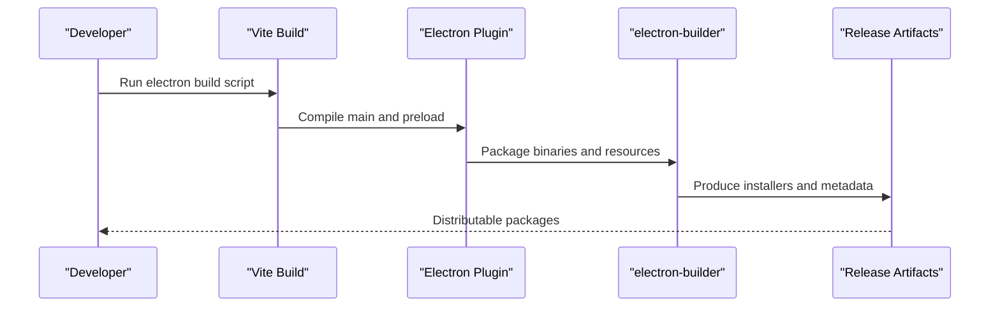
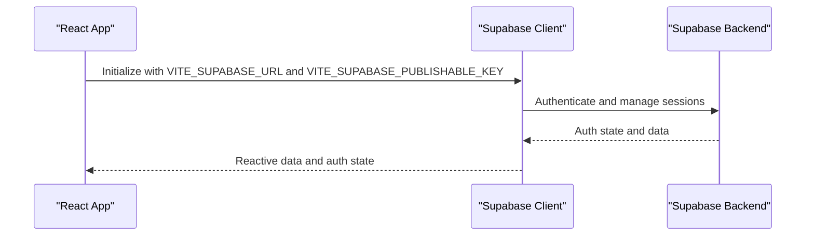
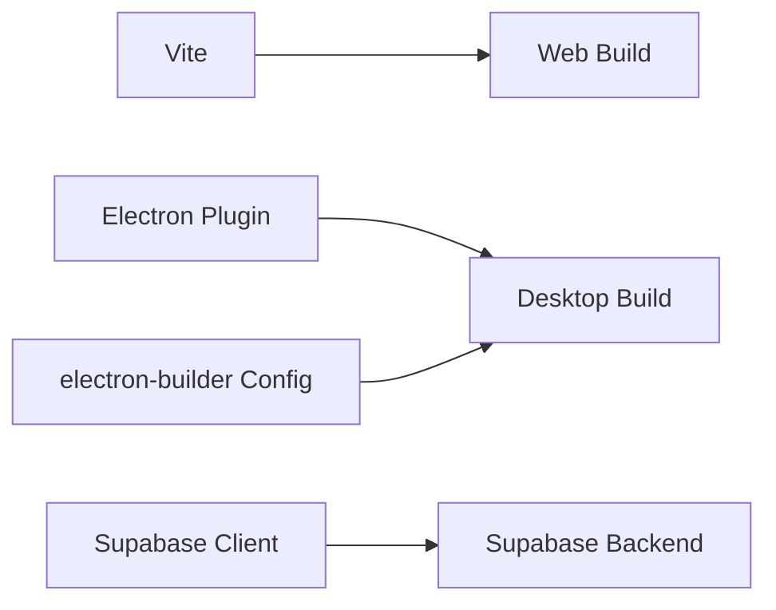

# Deployment & Production

<cite>
**Referenced Files in This Document**
- [package.json](file://package.json)
- [vite.config.ts](file://vite.config.ts)
- [README.md](file://README.md)
- [supabase/config.toml](file://supabase/config.toml)
- [src/integrations/supabase/client.ts](file://src/integrations/supabase/client.ts)
- [release/builder-effective-config.yaml](file://release/builder-effective-config.yaml)
</cite>

## Table of Contents
1. [Introduction](#introduction)
2. [Project Structure](#project-structure)
3. [Core Components](#core-components)
4. [Architecture Overview](#architecture-overview)
5. [Detailed Component Analysis](#detailed-component-analysis)
6. [Dependency Analysis](#dependency-analysis)
7. [Performance Considerations](#performance-considerations)
8. [Troubleshooting Guide](#troubleshooting-guide)
9. [Conclusion](#conclusion)
10. [Appendices](#appendices)

## Introduction
This document provides comprehensive deployment and production guidance for TableFlow Pro. It covers build configuration and optimization, environment configuration management, production deployment strategies, and monitoring and maintenance approaches. It also documents the deployment pipeline for web, desktop, and mobile platforms, CI/CD integration and automated deployment processes, environment variable management, security considerations, performance optimization for production environments, practical deployment procedures, rollback strategies, incident response protocols, Supabase deployment configuration, database migration strategies, infrastructure requirements, monitoring setup, logging configuration, and maintenance schedules.

## Project Structure
TableFlow Pro is a modern frontend application built with Vite, React, TypeScript, and integrates Supabase for authentication and real-time features. The repository includes:
- Web application built with Vite and React
- Desktop application packaging via Electron and electron-builder
- Supabase configuration and migrations for backend services
- Environment variable usage for Supabase integration
- Release configuration for desktop builds

**Diagram sources**
- [vite.config.ts:1-69](file://vite.config.ts#L1-L69)
- [src/integrations/supabase/client.ts:1-17](file://src/integrations/supabase/client.ts#L1-L17)
- [supabase/config.toml:1-1](file://supabase/config.toml#L1-L1)
- [package.json:107-129](file://package.json#L107-L129)
- [release/builder-effective-config.yaml:1-21](file://release/builder-effective-config.yaml#L1-L21)

**Section sources**
- [README.md:1-13](file://README.md#L1-L13)
- [vite.config.ts:1-69](file://vite.config.ts#L1-L69)
- [package.json:107-129](file://package.json#L107-L129)
- [release/builder-effective-config.yaml:1-21](file://release/builder-effective-config.yaml#L1-L21)

## Core Components
- Build and bundling: Vite with React plugin and optional Electron plugin for desktop builds
- Environment configuration: Supabase client configured via Vite import meta env variables
- Desktop packaging: electron-builder configuration embedded in package.json and effective builder config
- Supabase integration: Supabase client initialization and session persistence

Key production considerations:
- Build modes and targets: web, development, and electron modes
- Asset base path and server configuration for local development
- Electron renderer and preload scripts for desktop builds
- Environment variable exposure for Supabase URL and publishable key

**Section sources**
- [vite.config.ts:9-68](file://vite.config.ts#L9-L68)
- [src/integrations/supabase/client.ts:5-17](file://src/integrations/supabase/client.ts#L5-L17)
- [package.json:107-129](file://package.json#L107-L129)
- [release/builder-effective-config.yaml:1-21](file://release/builder-effective-config.yaml#L1-L21)

## Architecture Overview
The production architecture comprises three primary deployment targets:
- Web: Static assets served via a CDN or web server
- Desktop: Electron app packaged via electron-builder
- Mobile: Capacitor-based mobile app (Capacitor Core is declared as a dependency)

**Diagram sources**
- [vite.config.ts:1-69](file://vite.config.ts#L1-L69)
- [package.json:107-129](file://package.json#L107-L129)
- [release/builder-effective-config.yaml:1-21](file://release/builder-effective-config.yaml#L1-L21)
- [supabase/config.toml:1-1](file://supabase/config.toml#L1-L1)

## Detailed Component Analysis

### Web Build and Deployment
- Build command: Vite build generates optimized static assets
- Development server: Host set to all interfaces with configurable port
- Base path: Relative base path for asset resolution
- Plugins: React SWC and optional component tagger in development mode

Production steps:
- Build artifacts: Collect from the default Vite output directory
- Hosting: Deploy to a CDN or static hosting provider
- HTTPS and caching: Configure TLS termination and cache headers at the CDN or edge
- Health checks: Expose a lightweight health endpoint for load balancers

**Section sources**
- [vite.config.ts:9-68](file://vite.config.ts#L9-L68)
- [package.json:7-16](file://package.json#L7-L16)

### Desktop Build and Packaging
- Electron mode: Vite configuration enables Electron plugin and renderer plugin
- Preload and main scripts: Separate entry points compiled to dist-electron
- electron-builder: Packaged via configuration embedded in package.json and effective builder config
- Windows installer: NSIS target with custom options (desktop/start menu shortcuts, uninstall behavior)
- Output: Release directory with platform-specific installers

Production steps:
- Build: Run the electron build script to produce distributables
- Signing: Configure code signing for Windows/macOS/Linux before distribution
- Auto-updates: Integrate Squirrel-based update mechanism or equivalent
- Distribution: Publish installers to internal channels or public download sites

**Diagram sources**
- [vite.config.ts:21-59](file://vite.config.ts#L21-L59)
- [package.json:12-12](file://package.json#L12-L12)
- [release/builder-effective-config.yaml:10-19](file://release/builder-effective-config.yaml#L10-L19)

**Section sources**
- [vite.config.ts:21-59](file://vite.config.ts#L21-L59)
- [package.json:12-12](file://package.json#L12-L12)
- [release/builder-effective-config.yaml:10-19](file://release/builder-effective-config.yaml#L10-L19)

### Mobile Build and Deployment
- Capacitor Core dependency present for cross-platform mobile support
- Typical workflow: Build web assets, sync to Capacitor, then build native projects (iOS/Android)
- Distribution: App Store and Google Play stores or enterprise distribution

Production steps:
- Build web assets with Vite
- Sync to Capacitor and configure native app IDs and versions
- Build iOS/Android apps and sign for distribution
- Automated distribution via CI/CD pipelines

**Section sources**
- [package.json:18-18](file://package.json#L18-L18)

### Supabase Integration and Configuration
- Supabase client initialized with URL and publishable key from environment variables
- Session persistence enabled with localStorage and automatic token refresh
- Supabase project ID configured in Supabase CLI configuration

Production steps:
- Set environment variables for Supabase URL and publishable key in production
- Secure credentials: avoid committing secrets; use CI/CD secret stores
- Monitor Supabase metrics and logs for authentication and database performance

**Diagram sources**
- [src/integrations/supabase/client.ts:5-17](file://src/integrations/supabase/client.ts#L5-L17)
- [supabase/config.toml:1-1](file://supabase/config.toml#L1-L1)

**Section sources**
- [src/integrations/supabase/client.ts:5-17](file://src/integrations/supabase/client.ts#L5-L17)
- [supabase/config.toml:1-1](file://supabase/config.toml#L1-L1)

### Database Migration Strategies
- Migrations stored under supabase/migrations with timestamped filenames
- Apply migrations via Supabase CLI or managed migration tooling
- Version control: Keep migration files under version control for reproducibility

Production steps:
- Review migration order and dependencies
- Apply migrations in staging before production
- Rollback plan: Maintain reversible migrations or snapshot-based recovery

**Section sources**
- [supabase/config.toml:1-1](file://supabase/config.toml#L1-L1)

## Dependency Analysis
- Build-time dependencies: Vite, React, TypeScript, electron-builder, and related plugins
- Runtime dependencies: Supabase client, React ecosystem, and platform-specific libraries
- Desktop packaging: electron-builder configuration and release metadata

**Diagram sources**
- [vite.config.ts:18-60](file://vite.config.ts#L18-L60)
- [package.json:107-129](file://package.json#L107-L129)
- [src/integrations/supabase/client.ts:2-2](file://src/integrations/supabase/client.ts#L2-L2)

**Section sources**
- [vite.config.ts:18-60](file://vite.config.ts#L18-L60)
- [package.json:107-129](file://package.json#L107-L129)
- [src/integrations/supabase/client.ts:2-2](file://src/integrations/supabase/client.ts#L2-L2)

## Performance Considerations
- Optimize bundle size: Enable tree-shaking and code splitting via Vite
- Asset optimization: Compress images and minify CSS/JS
- Lazy loading: Load non-critical features on demand
- CDN caching: Configure long-term caching for immutable assets and short caching for HTML
- Desktop performance: Minimize preload script complexity and avoid blocking main process operations
- Supabase performance: Use connection pooling and optimize queries; monitor backend latency

[No sources needed since this section provides general guidance]

## Troubleshooting Guide
Common production issues and resolutions:
- Environment variables missing: Ensure VITE_SUPABASE_URL and VITE_SUPABASE_PUBLISHABLE_KEY are set in production
- Desktop installer issues: Verify electron-builder configuration and signing certificates
- Supabase connectivity: Confirm project ID and network access; check firewall and DNS
- Migration failures: Validate migration SQL syntax and permissions; apply incrementally

**Section sources**
- [src/integrations/supabase/client.ts:5-17](file://src/integrations/supabase/client.ts#L5-L17)
- [release/builder-effective-config.yaml:10-19](file://release/builder-effective-config.yaml#L10-L19)

## Conclusion
TableFlow Pro supports web, desktop, and mobile deployments with a unified Vite-based build system and Supabase integration. Production readiness requires secure environment variable management, robust CI/CD pipelines, careful desktop packaging and signing, and disciplined database migration practices. Monitoring and maintenance should focus on application performance, backend reliability, and user experience across platforms.

[No sources needed since this section summarizes without analyzing specific files]

## Appendices

### A. Environment Variable Management
- Required variables for Supabase:
  - VITE_SUPABASE_URL
  - VITE_SUPABASE_PUBLISHABLE_KEY
- Recommended practices:
  - Store secrets in CI/CD secret stores
  - Never commit secrets to version control
  - Use separate variables for development, staging, and production

**Section sources**
- [src/integrations/supabase/client.ts:5-6](file://src/integrations/supabase/client.ts#L5-L6)

### B. CI/CD Integration and Automated Deployment
- Web: Build and deploy static assets to CDN or hosting provider
- Desktop: Build with electron-builder and publish installers to distribution channels
- Mobile: Build Capacitor apps and distribute via app stores or enterprise channels
- Recommended tools: GitHub Actions, GitLab CI, or Jenkins with artifact publishing

[No sources needed since this section provides general guidance]

### C. Security Considerations
- Secrets protection: Use CI/CD secret stores and environment-specific configurations
- Transport security: Enforce HTTPS and secure cookies
- Access control: Restrict Supabase API keys and manage row-level security policies
- Desktop security: Sign executables and enable auto-updates with integrity verification

**Section sources**
- [src/integrations/supabase/client.ts:11-17](file://src/integrations/supabase/client.ts#L11-L17)

### D. Monitoring Setup and Logging
- Application monitoring: Integrate application performance monitoring (APM) and error tracking
- Backend monitoring: Track Supabase metrics, database performance, and authentication rates
- Logs: Centralize logs from web, desktop, and backend services; retain for compliance

[No sources needed since this section provides general guidance]

### E. Maintenance Schedules
- Routine tasks: Apply database migrations, update dependencies, rotate secrets, and review logs
- Patching: Regularly update runtime dependencies and OS-level components for desktop
- Backups: Schedule regular database backups and test restore procedures

[No sources needed since this section provides general guidance]