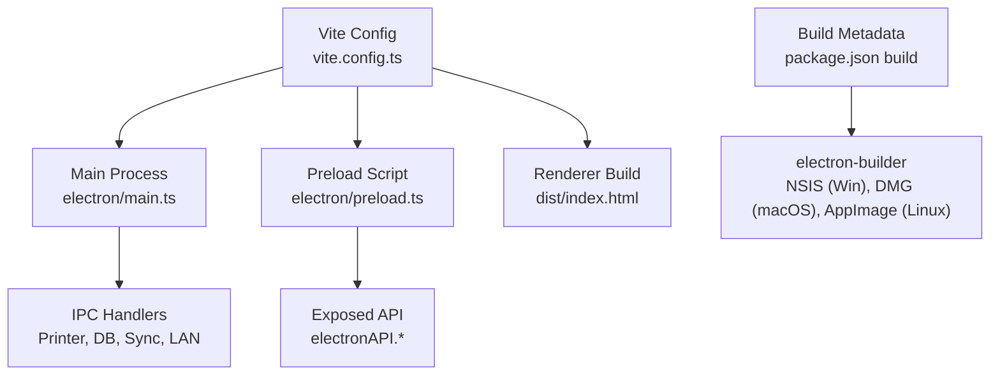
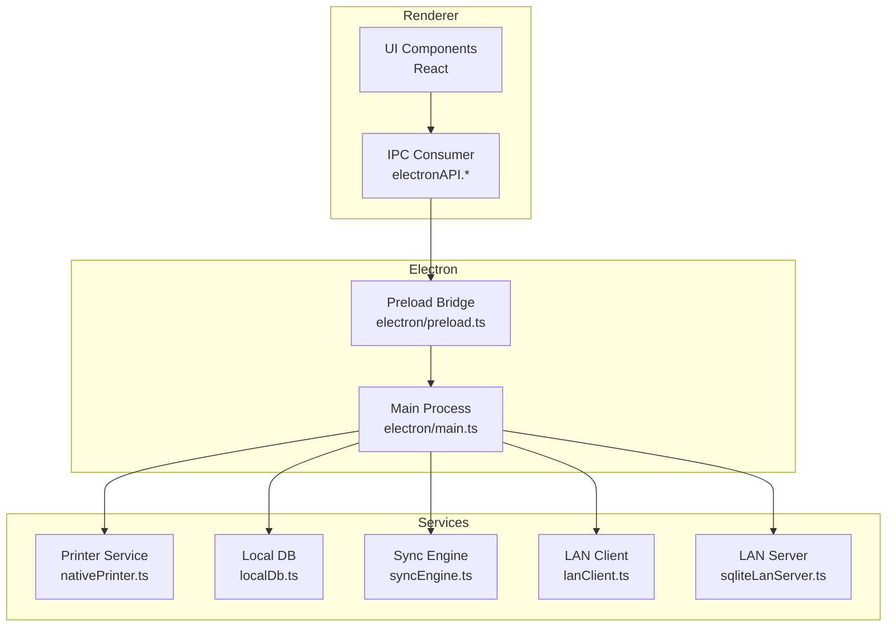
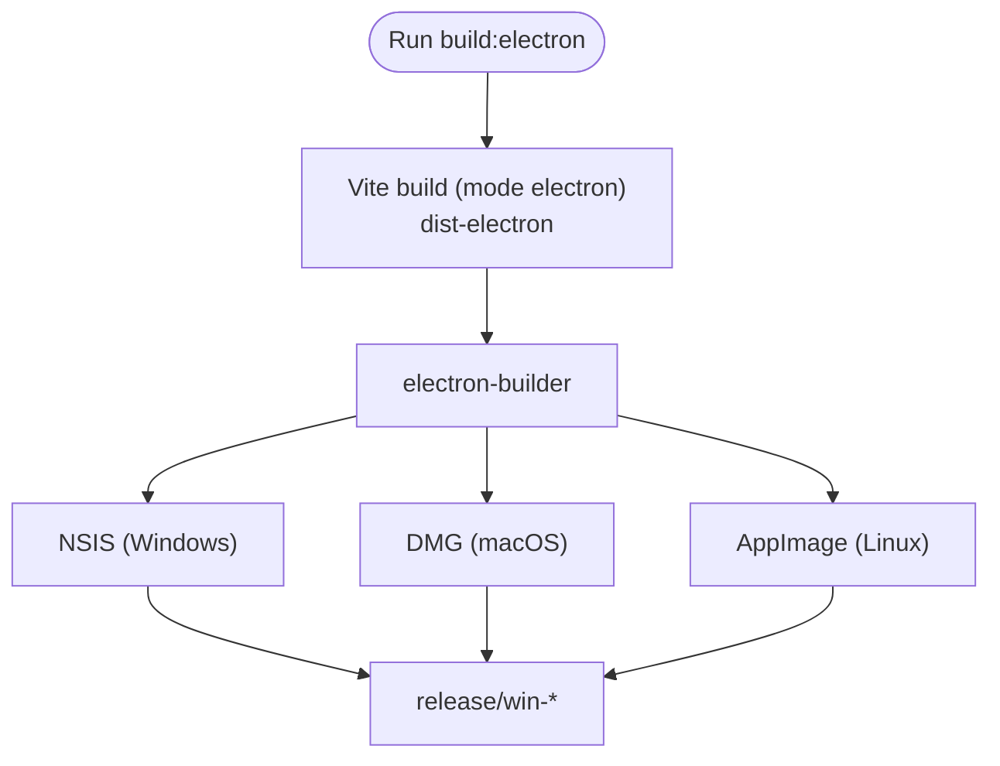
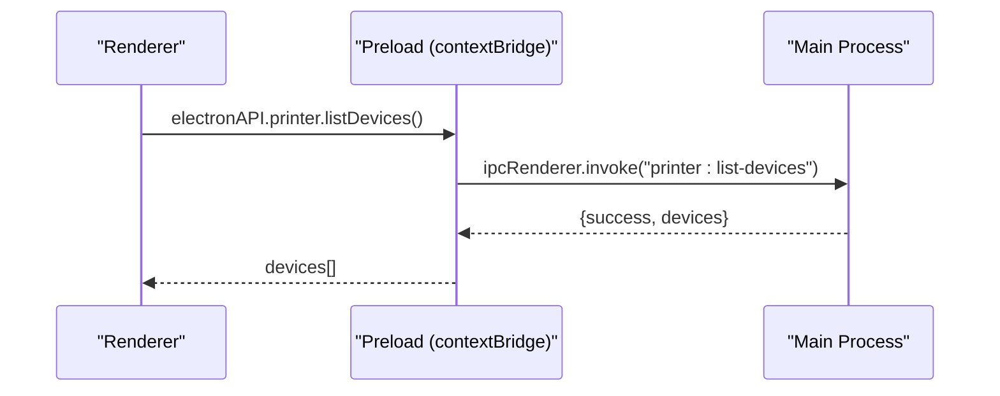
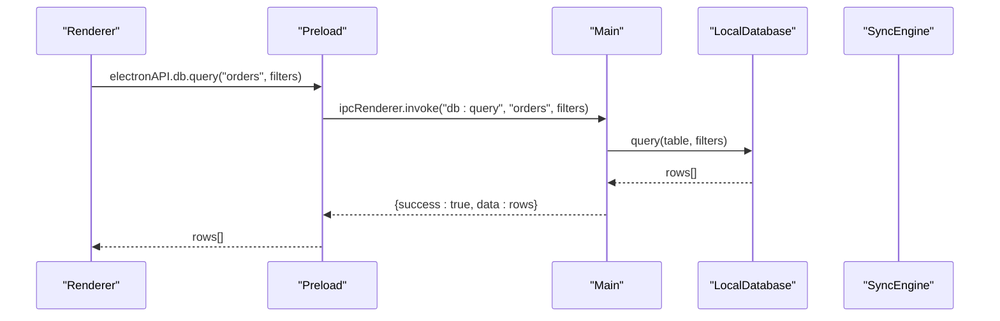
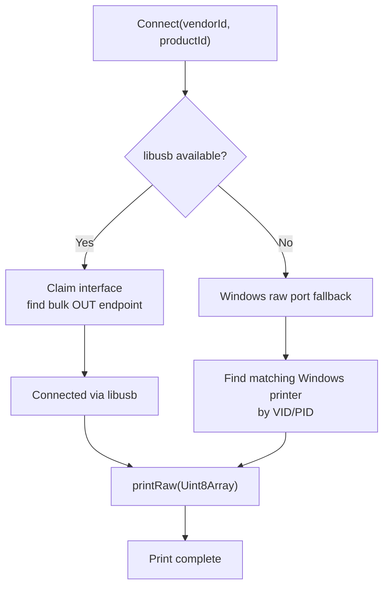
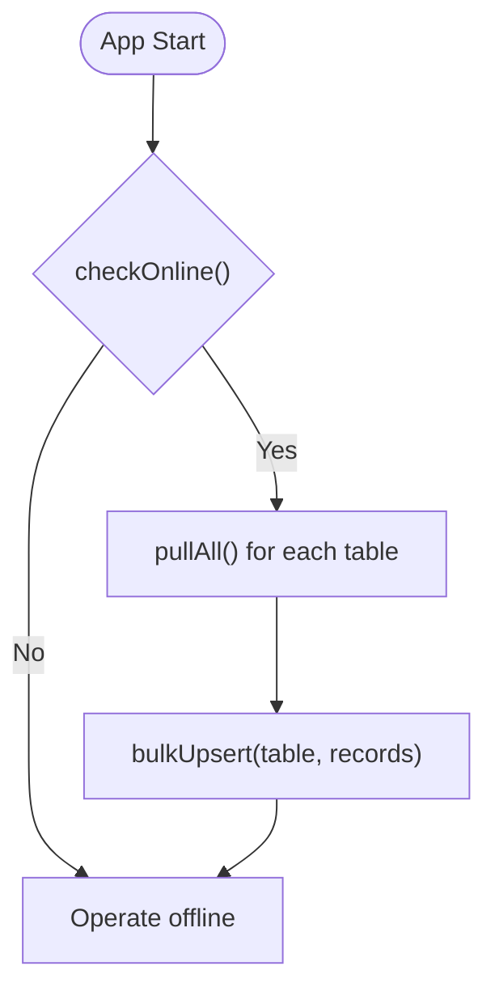
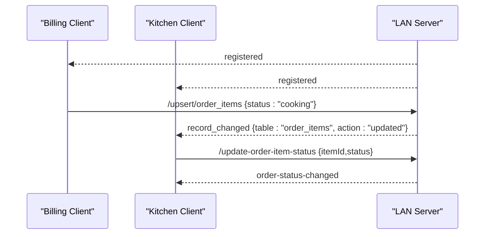
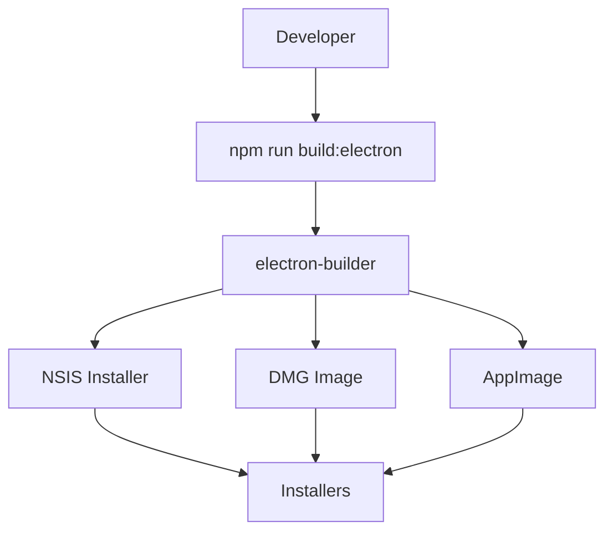
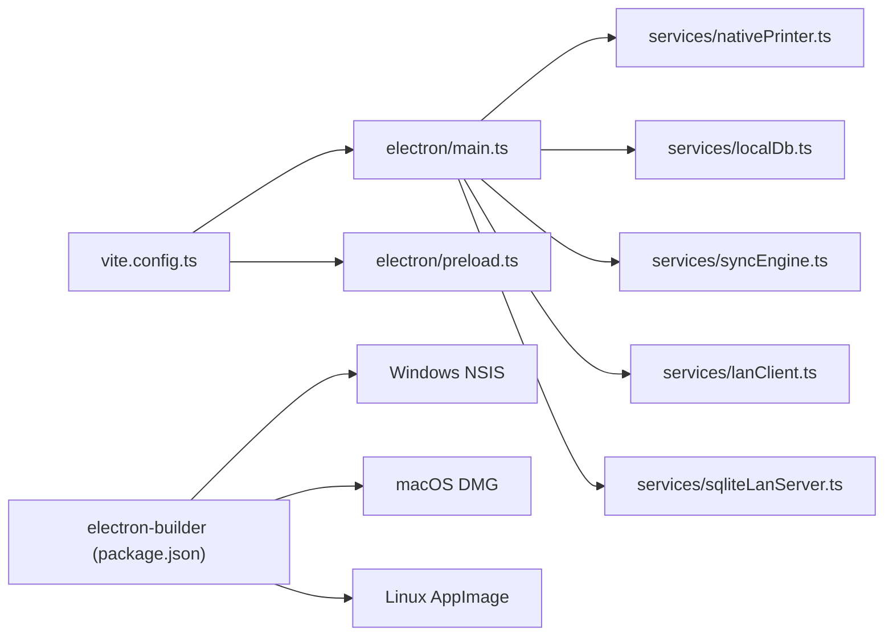

# Desktop Application Deployment (Electron)

<cite>
**Referenced Files in This Document**
- [package.json](file://package.json)
- [vite.config.ts](file://vite.config.ts)
- [electron/main.ts](file://electron/main.ts)
- [electron/preload.ts](file://electron/preload.ts)
- [electron/preload.cjs](file://electron/preload.cjs)
- [electron/tsconfig.json](file://electron/tsconfig.json)
- [electron/services/nativePrinter.ts](file://electron/services/nativePrinter.ts)
- [electron/services/localDb.ts](file://electron/services/localDb.ts)
- [electron/services/syncEngine.ts](file://electron/services/syncEngine.ts)
- [electron/services/lanClient.ts](file://electron/services/lanClient.ts)
- [electron/services/sqliteLanServer.ts](file://electron/services/sqliteLanServer.ts)
</cite>

## Table of Contents
1. [Introduction](#introduction)
2. [Project Structure](#project-structure)
3. [Core Components](#core-components)
4. [Architecture Overview](#architecture-overview)
5. [Detailed Component Analysis](#detailed-component-analysis)
6. [Dependency Analysis](#dependency-analysis)
7. [Performance Considerations](#performance-considerations)
8. [Troubleshooting Guide](#troubleshooting-guide)
9. [Conclusion](#conclusion)
10. [Appendices](#appendices)

## Introduction
This document provides comprehensive desktop deployment guidance for the Electron-based TableFlow Pro application. It covers the electron-builder configuration, platform-specific packaging (Windows NSIS installer, macOS DMG, Linux AppImage), distribution channels, code signing and notarization requirements, security considerations, build processes, auto-updater implementation, installation procedures, and practical examples for distribution and troubleshooting. It also documents the preload script security model, context isolation, and IPC communication setup used during desktop deployment.

## Project Structure
TableFlow Pro uses Vite with Electron plugins to build the main process, preload script, and renderer assets. The Electron configuration is integrated into the Vite build pipeline, and electron-builder handles cross-platform packaging and distribution metadata.

**Diagram sources**
- [vite.config.ts:1-69](file://vite.config.ts#L1-L69)
- [package.json:107-129](file://package.json#L107-L129)
- [electron/main.ts:1-450](file://electron/main.ts#L1-L450)
- [electron/preload.ts:1-90](file://electron/preload.ts#L1-L90)

**Section sources**
- [vite.config.ts:1-69](file://vite.config.ts#L1-L69)
- [package.json:107-129](file://package.json#L107-L129)

## Core Components
- Electron main process initializes the BrowserWindow, registers IPC handlers, and manages lifecycle events.
- Preload script exposes a controlled API surface via contextBridge to the renderer.
- Services encapsulate printer integration, local database, synchronization, and LAN networking.

Key responsibilities:
- Main process: window creation, security settings (contextIsolation), IPC registration, app lifecycle.
- Preload: safe exposure of IPC-backed APIs to renderer.
- Services: printer device management, offline SQLite storage, cloud sync, LAN server/client.

**Section sources**
- [electron/main.ts:20-50](file://electron/main.ts#L20-L50)
- [electron/preload.ts:3-89](file://electron/preload.ts#L3-L89)
- [electron/services/nativePrinter.ts:45-531](file://electron/services/nativePrinter.ts#L45-L531)
- [electron/services/localDb.ts:164-401](file://electron/services/localDb.ts#L164-L401)
- [electron/services/syncEngine.ts:15-124](file://electron/services/syncEngine.ts#L15-L124)
- [electron/services/lanClient.ts:22-364](file://electron/services/lanClient.ts#L22-L364)
- [electron/services/sqliteLanServer.ts:23-520](file://electron/services/sqliteLanServer.ts#L23-L520)

## Architecture Overview
The desktop architecture separates concerns across main, preload, and service layers. The renderer communicates with main via typed IPC channels exposed through the preload bridge.

**Diagram sources**
- [electron/main.ts:1-450](file://electron/main.ts#L1-L450)
- [electron/preload.ts:1-90](file://electron/preload.ts#L1-L90)
- [electron/services/nativePrinter.ts:1-542](file://electron/services/nativePrinter.ts#L1-L542)
- [electron/services/localDb.ts:1-401](file://electron/services/localDb.ts#L1-L401)
- [electron/services/syncEngine.ts:1-124](file://electron/services/syncEngine.ts#L1-L124)
- [electron/services/lanClient.ts:1-364](file://electron/services/lanClient.ts#L1-L364)
- [electron/services/sqliteLanServer.ts:1-520](file://electron/services/sqliteLanServer.ts#L1-L520)

## Detailed Component Analysis

### Electron Builder Configuration and Packaging
- Build metadata defines appId, productName, output directory, included files, and Windows NSIS options.
- Vite builds main and preload into dist-electron; electron-builder packages per platform.

**Diagram sources**
- [package.json:12](file://package.json#L12)
- [package.json:107-129](file://package.json#L107-L129)
- [vite.config.ts:21-59](file://vite.config.ts#L21-L59)

**Section sources**
- [package.json:107-129](file://package.json#L107-L129)
- [vite.config.ts:21-59](file://vite.config.ts#L21-L59)

### Security Model: Context Isolation and Preload Bridge
- The BrowserWindow enables contextIsolation and disables nodeIntegration.
- The preload script uses contextBridge to expose a typed API surface (electronAPI.*) to the renderer.
- Renderer code interacts exclusively through ipcRenderer.invoke/on, keeping Node.js APIs sandboxed.

**Diagram sources**
- [electron/main.ts:53-124](file://electron/main.ts#L53-L124)
- [electron/preload.ts:4-13](file://electron/preload.ts#L4-L13)

**Section sources**
- [electron/main.ts:27-32](file://electron/main.ts#L27-L32)
- [electron/preload.ts:3-89](file://electron/preload.ts#L3-L89)

### IPC Communication Setup
- Main registers ipcMain.handle handlers grouped by domain: printer, database, sync, LAN.
- Renderer invokes these handlers via preload, receiving structured responses.

**Diagram sources**
- [electron/main.ts:127-175](file://electron/main.ts#L127-L175)
- [electron/services/localDb.ts:247-268](file://electron/services/localDb.ts#L247-L268)
- [electron/preload.ts:15-26](file://electron/preload.ts#L15-L26)

**Section sources**
- [electron/main.ts:53-391](file://electron/main.ts#L53-L391)
- [electron/preload.ts:4-89](file://electron/preload.ts#L4-L89)

### Printer Integration Service
- Discovers USB devices, connects via libusb or Windows raw spooler fallback.
- Sends raw ESC/POS receipts and supports switching Windows printers for the same VID/PID.

**Diagram sources**
- [electron/services/nativePrinter.ts:101-201](file://electron/services/nativePrinter.ts#L101-L201)
- [electron/services/nativePrinter.ts:429-450](file://electron/services/nativePrinter.ts#L429-L450)

**Section sources**
- [electron/services/nativePrinter.ts:45-531](file://electron/services/nativePrinter.ts#L45-L531)

### Local Database and Sync Engine
- LocalDatabase uses better-sqlite3 with WAL mode and foreign keys enabled.
- SyncEngine performs initial pull from Supabase on app start; push is manual-only from renderer.

**Diagram sources**
- [electron/services/syncEngine.ts:32-106](file://electron/services/syncEngine.ts#L32-L106)
- [electron/services/localDb.ts:315-323](file://electron/services/localDb.ts#L315-L323)

**Section sources**
- [electron/services/localDb.ts:164-401](file://electron/services/localDb.ts#L164-L401)
- [electron/services/syncEngine.ts:15-124](file://electron/services/syncEngine.ts#L15-L124)

### LAN Networking (Server and Client)
- LAN Server: Express + WebSocket server with SQLite persistence, HTTP endpoints, and broadcast on changes.
- LAN Client: WebSocket client with reconnection, ping, and HTTP API wrappers for queries and mutations.

**Diagram sources**
- [electron/services/sqliteLanServer.ts:51-189](file://electron/services/sqliteLanServer.ts#L51-L189)
- [electron/services/lanClient.ts:65-144](file://electron/services/lanClient.ts#L65-L144)

**Section sources**
- [electron/services/sqliteLanServer.ts:23-520](file://electron/services/sqliteLanServer.ts#L23-L520)
- [electron/services/lanClient.ts:22-364](file://electron/services/lanClient.ts#L22-L364)

### Conceptual Overview
- Distribution channels: Windows (NSIS), macOS (DMG), Linux (AppImage).
- Auto-updater: Not present in the current configuration; distribution relies on installer updates.
- Security: contextIsolation enabled, preload-controlled API surface, strict webPreferences.

[No sources needed since this diagram shows conceptual workflow, not actual code structure]

## Dependency Analysis
- Vite plugin configuration builds main and preload with separate outputs and external Node modules.
- electron-builder consumes Vite outputs and platform targets defined in package.json.
- Main process depends on service modules for printer, DB, sync, and LAN.

**Diagram sources**
- [vite.config.ts:21-59](file://vite.config.ts#L21-L59)
- [package.json:107-129](file://package.json#L107-L129)
- [electron/main.ts:1-10](file://electron/main.ts#L1-L10)

**Section sources**
- [vite.config.ts:21-59](file://vite.config.ts#L21-L59)
- [package.json:107-129](file://package.json#L107-L129)
- [electron/main.ts:1-10](file://electron/main.ts#L1-L10)

## Performance Considerations
- SQLite WAL mode improves concurrency and write performance for LAN server and local DB.
- Chunked USB transfers reduce blocking during print operations.
- LAN client queues messages until WebSocket opens to avoid lost updates.
- Avoid heavy synchronous operations in main; delegate to services and use async IPC.

[No sources needed since this section provides general guidance]

## Troubleshooting Guide
Common issues and resolutions:
- Windows printer not found or driver missing:
  - Install WinUSB driver using Zadig for VID/PID matching.
  - Ensure a compatible Windows printer driver is installed (thermal/receipt POS).
- USB printer connection fails:
  - Verify libusb support; fallback to Windows raw port if needed.
  - Reconnect device and retry; ensure no kernel driver conflicts.
- LAN server fails to start:
  - Check port availability; default port is in use.
  - Review server logs for initialization errors.
- LAN client cannot connect:
  - Confirm server host/port and network reachability.
  - Verify device registration and ping/pong behavior.
- Auto-updater not triggered:
  - Not configured in current setup; rely on installer updates.

**Section sources**
- [electron/services/nativePrinter.ts:114-121](file://electron/services/nativePrinter.ts#L114-L121)
- [electron/services/nativePrinter.ts:207-229](file://electron/services/nativePrinter.ts#L207-L229)
- [electron/services/sqliteLanServer.ts:451-468](file://electron/services/sqliteLanServer.ts#L451-L468)
- [electron/services/lanClient.ts:65-144](file://electron/services/lanClient.ts#L65-L144)

## Conclusion
TableFlow Pro’s desktop deployment leverages Vite and electron-builder for streamlined cross-platform packaging. The security model centers on contextIsolation and a controlled preload bridge, while robust services handle printer integration, offline-first storage, cloud sync, and LAN networking. Installer-based distribution is currently used; future enhancements can integrate an auto-updater with code signing and notarization for seamless updates.

[No sources needed since this section summarizes without analyzing specific files]

## Appendices

### Build and Distribution Commands
- Build renderer and main: npm run build:electron
- Platform packaging: electron-builder invoked by the build script
- Output artifacts: release/<platform>-unpacked and signed installers

**Section sources**
- [package.json:12](file://package.json#L12)

### Security and Signing Checklist
- Windows:
  - Provide certificate and password for publisher and signing.
  - Configure NSIS signing options in electron-builder.
- macOS:
  - Code signing entitlements and hardened runtime.
  - Notarization with Apple credentials.
- Linux:
  - AppImage signing and desktop integration metadata.

[No sources needed since this section provides general guidance]

### Installation Procedures
- Windows: Run generated NSIS installer; choose installation directory; shortcuts created.
- macOS: Open DMG and drag to Applications; may require Gatekeeper adjustments.
- Linux: Make AppImage executable; run directly or integrate with desktop environments.

[No sources needed since this section provides general guidance]