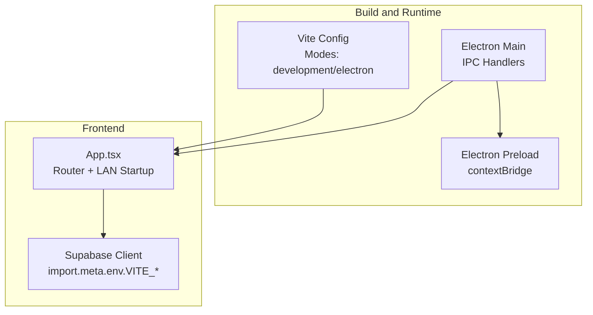
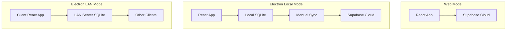
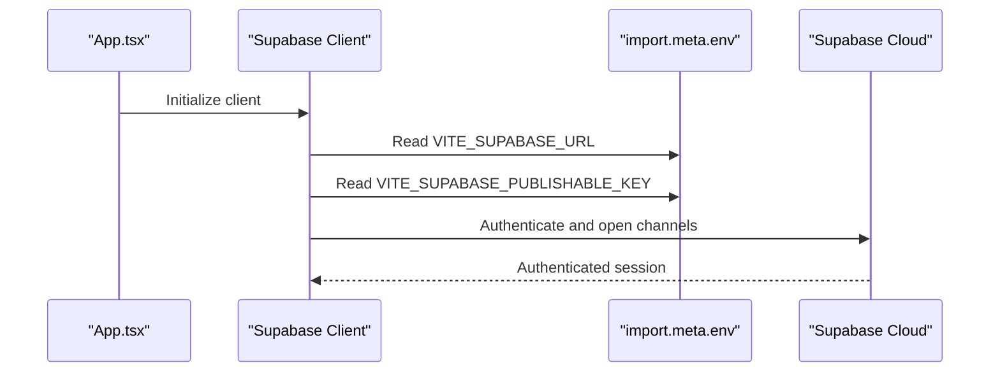
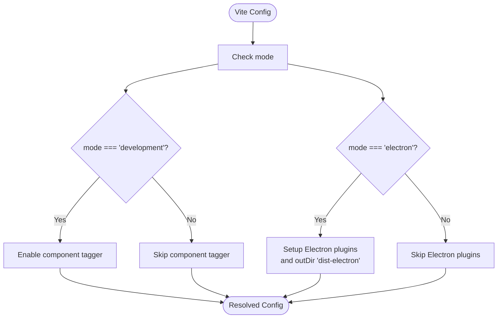
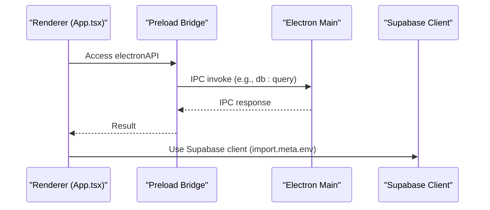
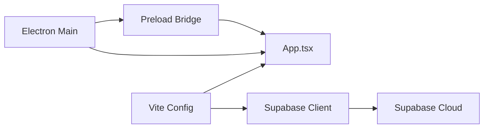

# Environment Configuration & Management

<cite>
**Referenced Files in This Document**
- [package.json](file://package.json)
- [vite.config.ts](file://vite.config.ts)
- [src/vite-env.d.ts](file://src/vite-env.d.ts)
- [src/integrations/supabase/client.ts](file://src/integrations/supabase/client.ts)
- [src/integrations/supabase/types.ts](file://src/integrations/supabase/types.ts)
- [supabase/config.toml](file://supabase/config.toml)
- [src/App.tsx](file://src/App.tsx)
- [src/main.tsx](file://src/main.tsx)
- [electron/main.ts](file://electron/main.ts)
- [electron/preload.ts](file://electron/preload.ts)
- [DATABASE_ARCHITECTURE_ANALYSIS.md](file://DATABASE_ARCHITECTURE_ANALYSIS.md)
</cite>

## Table of Contents
1. [Introduction](#introduction)
2. [Project Structure](#project-structure)
3. [Core Components](#core-components)
4. [Architecture Overview](#architecture-overview)
5. [Detailed Component Analysis](#detailed-component-analysis)
6. [Dependency Analysis](#dependency-analysis)
7. [Performance Considerations](#performance-considerations)
8. [Troubleshooting Guide](#troubleshooting-guide)
9. [Conclusion](#conclusion)
10. [Appendices](#appendices)

## Introduction
This document provides comprehensive environment configuration and management guidance for TableFlow Pro. It covers environment variable management across development, staging, and production environments; Supabase configuration setup, database connection strings, and API keys management; environment-specific build configurations and feature flags; runtime behavior differences; security best practices; dotenv configuration, environment validation, and configuration loading mechanisms; and practical examples for various deployment scenarios along with troubleshooting tips.

## Project Structure
TableFlow Pro integrates a web frontend (React + Vite), an Electron shell, and optional LAN and local SQLite modes. Environment configuration primarily affects:
- Build modes and Electron integration via Vite modes
- Supabase client initialization using Vite’s import.meta.env
- Runtime mode detection for router and LAN behavior
- Electron main/preload bridges for native capabilities

**Diagram sources**
- [vite.config.ts:1-69](file://vite.config.ts#L1-L69)
- [src/App.tsx:1-150](file://src/App.tsx#L1-L150)
- [src/integrations/supabase/client.ts:1-17](file://src/integrations/supabase/client.ts#L1-L17)
- [electron/main.ts:1-450](file://electron/main.ts#L1-L450)
- [electron/preload.ts:1-90](file://electron/preload.ts#L1-L90)

**Section sources**
- [vite.config.ts:1-69](file://vite.config.ts#L1-L69)
- [src/App.tsx:1-150](file://src/App.tsx#L1-L150)
- [src/integrations/supabase/client.ts:1-17](file://src/integrations/supabase/client.ts#L1-L17)
- [electron/main.ts:1-450](file://electron/main.ts#L1-L450)
- [electron/preload.ts:1-90](file://electron/preload.ts#L1-L90)

## Core Components
- Supabase client initialization depends on Vite’s import.meta.env variables for URL and publishable key.
- Vite supports multiple modes (development, electron) affecting server and plugin behavior.
- Electron exposes native capabilities via IPC; runtime mode detection influences router and LAN startup.
- LAN and local modes are defined in the project’s architecture documentation.

Key environment variables used by the codebase:
- VITE_SUPABASE_URL
- VITE_SUPABASE_PUBLISHABLE_KEY

These variables are consumed in the Supabase client module.

**Section sources**
- [src/integrations/supabase/client.ts:5-6](file://src/integrations/supabase/client.ts#L5-L6)
- [vite.config.ts:9-11](file://vite.config.ts#L9-L11)
- [src/App.tsx:32-34](file://src/App.tsx#L32-L34)
- [DATABASE_ARCHITECTURE_ANALYSIS.md:21-549](file://DATABASE_ARCHITECTURE_ANALYSIS.md#L21-L549)

## Architecture Overview
The environment configuration underpins three operational modes:
- Web mode: Direct Supabase Cloud connectivity
- Electron local mode: Local SQLite with manual cloud sync
- Electron LAN mode: LAN server SQLite with real-time updates

**Diagram sources**
- [DATABASE_ARCHITECTURE_ANALYSIS.md:21-549](file://DATABASE_ARCHITECTURE_ANALYSIS.md#L21-L549)

**Section sources**
- [DATABASE_ARCHITECTURE_ANALYSIS.md:21-549](file://DATABASE_ARCHITECTURE_ANALYSIS.md#L21-L549)

## Detailed Component Analysis

### Supabase Environment Configuration
Supabase client initialization relies on Vite’s import.meta.env variables. The client is configured to persist sessions and refresh tokens automatically.

**Diagram sources**
- [src/integrations/supabase/client.ts:5-17](file://src/integrations/supabase/client.ts#L5-L17)
- [src/App.tsx:1-150](file://src/App.tsx#L1-L150)

Implementation highlights:
- Variables are read from import.meta.env at build time.
- The client enables session persistence and token auto-refresh.
- Supabase project identifier is defined in Supabase CLI config.

Security and validation:
- Ensure VITE_* variables are prefixed with VITE_ so they are injected at build time.
- Keep VITE_SUPABASE_PUBLISHABLE_KEY as the publishable key; avoid embedding service keys in the frontend.

**Section sources**
- [src/integrations/supabase/client.ts:1-17](file://src/integrations/supabase/client.ts#L1-L17)
- [supabase/config.toml:1-1](file://supabase/config.toml#L1-L1)

### Vite Build Modes and Feature Flags
Vite supports multiple modes that influence runtime behavior:
- development: Standard dev server and optional component tagging
- electron: Electron integration with dedicated plugins and outDirs

**Diagram sources**
- [vite.config.ts:9-61](file://vite.config.ts#L9-L61)

Feature flags and runtime behavior:
- Router selection: HashRouter for Electron, BrowserRouter for web
- Electron mode detection via window.electronAPI presence

**Section sources**
- [vite.config.ts:1-69](file://vite.config.ts#L1-L69)
- [src/App.tsx:32-34](file://src/App.tsx#L32-L34)

### Electron Environment and IPC
Electron main process loads either the dev server URL or the built index and registers IPC handlers for printer, database, sync, and LAN operations. The preload script exposes a safe API surface via contextBridge.

**Diagram sources**
- [electron/preload.ts:1-90](file://electron/preload.ts#L1-L90)
- [electron/main.ts:1-450](file://electron/main.ts#L1-L450)
- [src/App.tsx:1-150](file://src/App.tsx#L1-L150)
- [src/integrations/supabase/client.ts:1-17](file://src/integrations/supabase/client.ts#L1-L17)

Runtime behavior differences:
- Router type determined by Electron presence
- LAN startup screen shown only in Electron when mode is not initialized
- IPC handlers enable native capabilities and LAN operations

**Section sources**
- [electron/preload.ts:1-90](file://electron/preload.ts#L1-L90)
- [electron/main.ts:1-450](file://electron/main.ts#L1-L450)
- [src/App.tsx:32-106](file://src/App.tsx#L32-L106)

### Environment Variable Management Across Environments
- Development: Use Vite’s import.meta.env.VITE_SUPABASE_URL and VITE_SUPABASE_PUBLISHABLE_KEY. These are injected at build time.
- Staging/Production: Ensure the same variables are present in the deployed environment. For web builds, these variables must be served by the Vite dev server or embedded in the built assets.
- Electron: Variables are injected at build time; ensure the electron build respects the selected mode.

Security best practices:
- Never commit secrets to version control. Use separate .env files per environment and exclude them from source control.
- Prefix all frontend-visible variables with VITE_ so they are injected at build time.
- Store Supabase service keys server-side or behind backend proxies; only expose the publishable key in the frontend.

Validation and loading mechanisms:
- Vite injects import.meta.env.* during build. Verify variables are present before runtime.
- Electron main checks for VITE_DEV_SERVER_URL to decide whether to load the dev server or the built HTML.

**Section sources**
- [src/integrations/supabase/client.ts:5-6](file://src/integrations/supabase/client.ts#L5-L6)
- [vite.config.ts:35-40](file://vite.config.ts#L35-L40)
- [electron/main.ts:35-40](file://electron/main.ts#L35-L40)

### Supabase Configuration Setup
- Supabase project identifier is defined in Supabase CLI config.
- The Supabase client is initialized with URL and publishable key from environment variables.

Operational notes:
- The types module defines the database schema and enums used by the client.
- Authentication persists sessions and refreshes tokens automatically.

**Section sources**
- [supabase/config.toml:1-1](file://supabase/config.toml#L1-L1)
- [src/integrations/supabase/client.ts:1-17](file://src/integrations/supabase/client.ts#L1-L17)
- [src/integrations/supabase/types.ts:1-818](file://src/integrations/supabase/types.ts#L1-L818)

### Environment-Specific Build Configurations
- Scripts define modes and targets:
  - dev: Vite dev server
  - build: Production build
  - build:dev: Development build
  - dev:electron: Electron dev mode
  - build:electron: Electron production build with electron-builder
- Vite mode controls plugin activation and output directories.

Recommendations:
- Use separate scripts for each environment to ensure deterministic builds.
- For Electron, ensure external dependencies are declared to prevent bundling issues.

**Section sources**
- [package.json:7-16](file://package.json#L7-L16)
- [vite.config.ts:9-61](file://vite.config.ts#L9-L61)

### Feature Flags and Runtime Behavior Differences
- Router selection: HashRouter for Electron, BrowserRouter for web
- LAN mode: Electron-only feature with startup screen and mode persistence
- Supabase client behavior: Session persistence and token auto-refresh

**Section sources**
- [src/App.tsx:32-106](file://src/App.tsx#L32-L106)
- [src/integrations/supabase/client.ts:11-17](file://src/integrations/supabase/client.ts#L11-L17)

## Dependency Analysis
The environment configuration touches several subsystems. The following diagram shows key dependencies among configuration components.

**Diagram sources**
- [vite.config.ts:1-69](file://vite.config.ts#L1-L69)
- [src/App.tsx:1-150](file://src/App.tsx#L1-L150)
- [src/integrations/supabase/client.ts:1-17](file://src/integrations/supabase/client.ts#L1-L17)
- [electron/main.ts:1-450](file://electron/main.ts#L1-L450)
- [electron/preload.ts:1-90](file://electron/preload.ts#L1-L90)

**Section sources**
- [vite.config.ts:1-69](file://vite.config.ts#L1-L69)
- [src/App.tsx:1-150](file://src/App.tsx#L1-L150)
- [src/integrations/supabase/client.ts:1-17](file://src/integrations/supabase/client.ts#L1-L17)
- [electron/main.ts:1-450](file://electron/main.ts#L1-L450)
- [electron/preload.ts:1-90](file://electron/preload.ts#L1-L90)

## Performance Considerations
- Minimize environment variable bloat; only expose necessary variables to the frontend.
- Prefer build-time injection over runtime fetching to reduce overhead.
- In Electron, keep IPC calls synchronous only when necessary; offload heavy tasks to worker threads if needed.
- For LAN mode, ensure efficient WebSocket usage and batch updates to reduce network overhead.

## Troubleshooting Guide
Common environment-related issues and resolutions:
- Supabase client fails to initialize:
  - Verify VITE_SUPABASE_URL and VITE_SUPABASE_PUBLISHABLE_KEY are present in the build.
  - Confirm the environment variables are prefixed with VITE_ so they are injected at build time.
- Electron app does not load assets:
  - Ensure VITE_DEV_SERVER_URL is set during development; otherwise, the app expects built assets.
  - Check that the electron build outputs to dist-electron and that preload and main scripts are correctly configured.
- Router mismatch in Electron:
  - Confirm window.electronAPI presence triggers HashRouter; otherwise, BrowserRouter is used.
- LAN mode not working:
  - Verify LAN server is started on the designated machine and clients can connect.
  - Check IPC handler responses for errors and logs in the main process.

**Section sources**
- [src/integrations/supabase/client.ts:5-6](file://src/integrations/supabase/client.ts#L5-L6)
- [vite.config.ts:35-40](file://vite.config.ts#L35-L40)
- [electron/main.ts:35-40](file://electron/main.ts#L35-L40)
- [src/App.tsx:32-106](file://src/App.tsx#L32-L106)

## Conclusion
TableFlow Pro’s environment configuration centers on Vite’s import.meta.env for Supabase credentials, Vite modes for build and runtime behavior, and Electron IPC for native capabilities. By adhering to secure practices—prefixing frontend variables with VITE_, avoiding secret exposure, and validating environment variables—you can reliably deploy across development, staging, and production environments while maintaining robust runtime behavior across web and Electron deployments.

## Appendices

### Appendix A: Environment Variable Reference
- VITE_SUPABASE_URL: Supabase project URL
- VITE_SUPABASE_PUBLISHABLE_KEY: Supabase publishable key

Ensure these variables are present in each environment and properly injected at build time.

**Section sources**
- [src/integrations/supabase/client.ts:5-6](file://src/integrations/supabase/client.ts#L5-L6)

### Appendix B: Deployment Scenarios
- Web deployment:
  - Build with production mode and serve static assets.
  - Ensure environment variables are injected at build time.
- Electron desktop:
  - Use electron build mode and electron-builder for packaging.
  - Validate IPC handlers and router behavior.
- LAN deployment:
  - Start LAN server on the designated machine.
  - Configure clients to connect to the server IP and port.

**Section sources**
- [package.json:7-16](file://package.json#L7-L16)
- [vite.config.ts:9-61](file://vite.config.ts#L9-L61)
- [electron/main.ts:229-260](file://electron/main.ts#L229-L260)