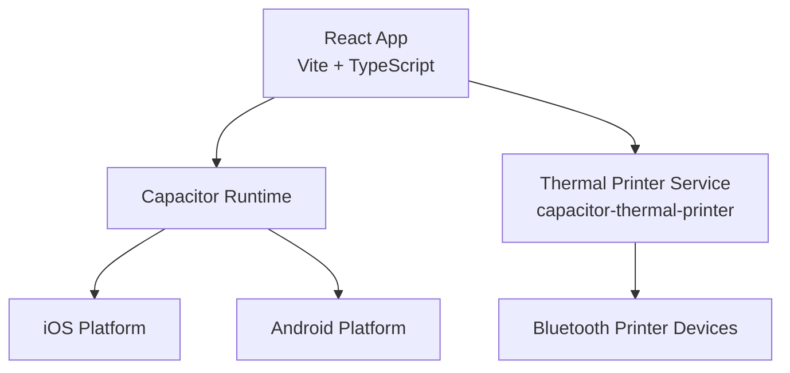
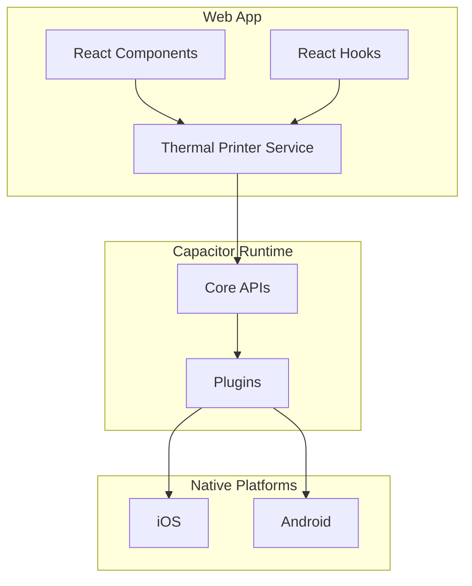
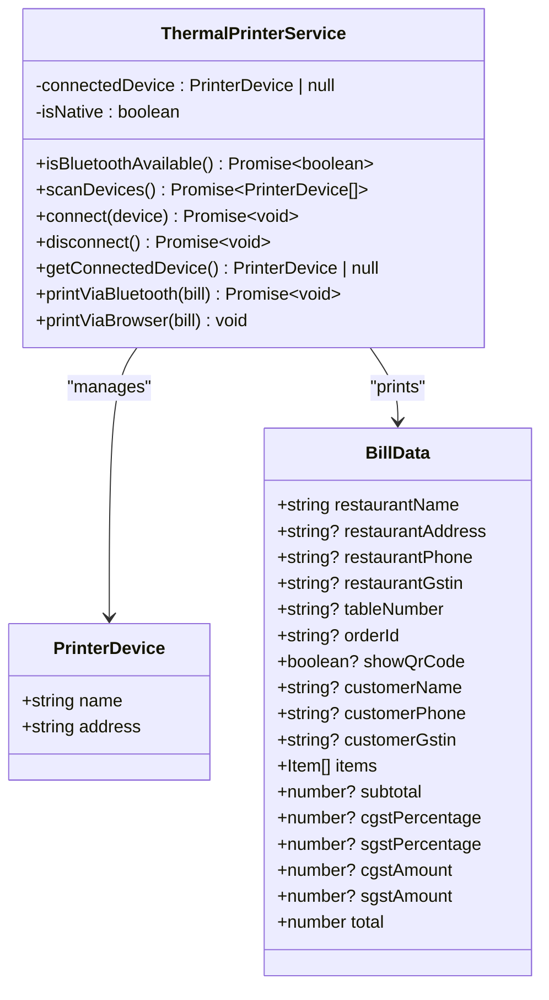
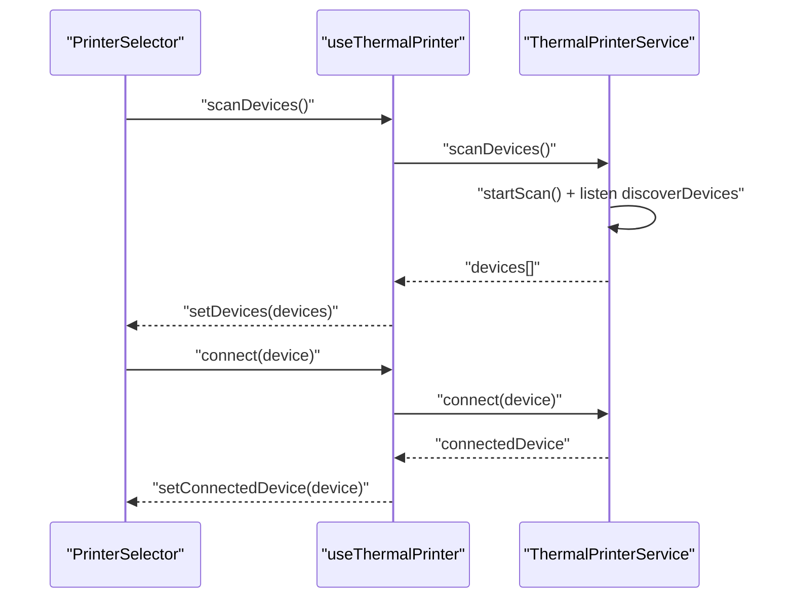
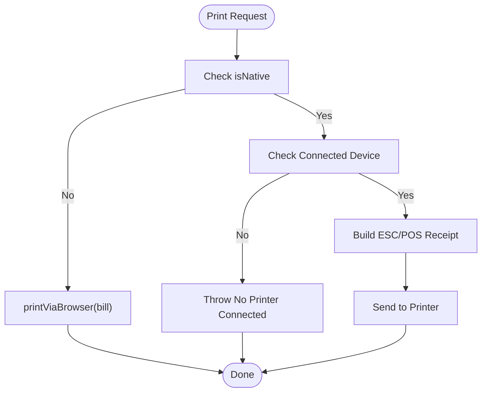
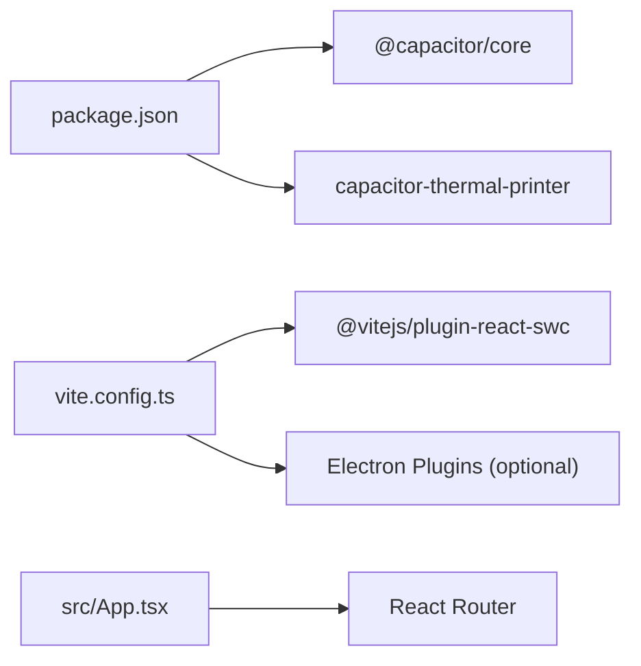

# Mobile Application Deployment (Capacitor)

<cite>
**Referenced Files in This Document**
- [package.json](file://package.json)
- [vite.config.ts](file://vite.config.ts)
- [src/App.tsx](file://src/App.tsx)
- [src/services/thermalPrinter.ts](file://src/services/thermalPrinter.ts)
- [src/hooks/useThermalPrinter.ts](file://src/hooks/useThermalPrinter.ts)
- [src/components/PrinterSelector.tsx](file://src/components/PrinterSelector.tsx)
- [README.md](file://README.md)
</cite>

## Table of Contents
1. [Introduction](#introduction)
2. [Project Structure](#project-structure)
3. [Core Components](#core-components)
4. [Architecture Overview](#architecture-overview)
5. [Detailed Component Analysis](#detailed-component-analysis)
6. [Dependency Analysis](#dependency-analysis)
7. [Performance Considerations](#performance-considerations)
8. [Troubleshooting Guide](#troubleshooting-guide)
9. [Conclusion](#conclusion)
10. [Appendices](#appendices)

## Introduction
This document provides a comprehensive guide to deploying the TableFlow Pro Capacitor-based mobile application across iOS and Android platforms. It covers Capacitor configuration, platform setup, native plugin integration for thermal printers, permissions, build processes, code signing, and distribution to the Apple App Store and Google Play Store. Practical examples, testing procedures, and troubleshooting steps are included to support reliable mobile deployments.

## Project Structure
TableFlow Pro is a React application built with Vite and TypeScript. The project integrates Capacitor for cross-platform capabilities and includes a dedicated thermal printer service for mobile printing via Bluetooth.

Key characteristics:
- Framework stack: Vite, React, TypeScript
- Cross-platform runtime: Capacitor
- Native printing: capacitor-thermal-printer plugin
- Build pipeline: Vite with optional Electron mode
- UI framework: shadcn/ui with Tailwind CSS

**Diagram sources**
- [src/services/thermalPrinter.ts:1-339](file://src/services/thermalPrinter.ts#L1-L339)
- [package.json:17-78](file://package.json#L17-L78)

**Section sources**
- [README.md:1-13](file://README.md#L1-L13)
- [package.json:17-78](file://package.json#L17-L78)
- [vite.config.ts:1-69](file://vite.config.ts#L1-L69)

## Core Components
- Capacitor runtime and core dependencies enable mobile compilation and native plugin access.
- Thermal printer service encapsulates Bluetooth discovery, connection, and ESC/POS-based printing.
- React hooks coordinate UI state and printer lifecycle.
- Printer selector UI provides scanning, connection, and disconnection controls.

Key integration points:
- Capacitor detection of native platform to gate Bluetooth operations.
- Plugin event listeners for device discovery.
- ESC/POS builder for thermal receipts.

**Section sources**
- [package.json:17-78](file://package.json#L17-L78)
- [src/services/thermalPrinter.ts:1-339](file://src/services/thermalPrinter.ts#L1-L339)
- [src/hooks/useThermalPrinter.ts:1-69](file://src/hooks/useThermalPrinter.ts#L1-L69)
- [src/components/PrinterSelector.tsx:1-121](file://src/components/PrinterSelector.tsx#L1-L121)

## Architecture Overview
The mobile architecture leverages Capacitor to compile the web app into native containers. The thermal printer service runs exclusively on native platforms, while browser printing serves as a fallback for non-native environments.

**Diagram sources**
- [src/services/thermalPrinter.ts:1-339](file://src/services/thermalPrinter.ts#L1-L339)
- [src/hooks/useThermalPrinter.ts:1-69](file://src/hooks/useThermalPrinter.ts#L1-L69)
- [package.json:17-78](file://package.json#L17-L78)

## Detailed Component Analysis

### Thermal Printer Service
The thermal printer service manages Bluetooth discovery, connection, and printing on native platforms. It validates platform capability, listens for device events, and constructs ESC/POS receipts.

**Diagram sources**
- [src/services/thermalPrinter.ts:1-339](file://src/services/thermalPrinter.ts#L1-L339)

**Section sources**
- [src/services/thermalPrinter.ts:33-120](file://src/services/thermalPrinter.ts#L33-L120)
- [src/services/thermalPrinter.ts:118-219](file://src/services/thermalPrinter.ts#L118-L219)

### Printer Selector UI
The printer selector UI coordinates scanning, connecting, and disconnecting with the thermal printer service. It surfaces device availability and connection state to the user.

**Diagram sources**
- [src/components/PrinterSelector.tsx:1-121](file://src/components/PrinterSelector.tsx#L1-L121)
- [src/hooks/useThermalPrinter.ts:17-54](file://src/hooks/useThermalPrinter.ts#L17-L54)
- [src/services/thermalPrinter.ts:41-101](file://src/services/thermalPrinter.ts#L41-L101)

**Section sources**
- [src/components/PrinterSelector.tsx:16-121](file://src/components/PrinterSelector.tsx#L16-L121)
- [src/hooks/useThermalPrinter.ts:4-69](file://src/hooks/useThermalPrinter.ts#L4-L69)

### Printing Workflow
The printing workflow builds an ESC/POS receipt and sends it to the connected thermal printer. It falls back to browser printing when not on a native platform.

**Diagram sources**
- [src/services/thermalPrinter.ts:118-219](file://src/services/thermalPrinter.ts#L118-L219)
- [src/hooks/useThermalPrinter.ts:43-54](file://src/hooks/useThermalPrinter.ts#L43-L54)

**Section sources**
- [src/services/thermalPrinter.ts:118-219](file://src/services/thermalPrinter.ts#L118-L219)
- [src/hooks/useThermalPrinter.ts:43-54](file://src/hooks/useThermalPrinter.ts#L43-L54)

## Dependency Analysis
The project relies on Capacitor core and the thermal printer plugin. The Vite configuration supports Electron mode but does not include Capacitor CLI commands.

**Diagram sources**
- [package.json:17-78](file://package.json#L17-L78)
- [vite.config.ts:18-61](file://vite.config.ts#L18-L61)
- [src/App.tsx:1-150](file://src/App.tsx#L1-L150)

**Section sources**
- [package.json:17-78](file://package.json#L17-L78)
- [vite.config.ts:18-61](file://vite.config.ts#L18-L61)
- [src/App.tsx:32-34](file://src/App.tsx#L32-L34)

## Performance Considerations
- Minimize unnecessary re-renders in the printer selector by using memoized callbacks from the hook.
- Debounce or throttle repeated print requests to avoid overwhelming the printer.
- Cache the connected device to reduce repeated connection attempts.
- Prefer native printing on mobile for reliability; use browser fallback only when necessary.

## Troubleshooting Guide
Common issues and resolutions:
- Bluetooth scanning unavailable on web: Ensure the app runs on a native platform. The service checks the native platform flag and throws if scanning is attempted on non-native environments.
- No printer connected before printing: Verify a successful connection before invoking the print method.
- Print failures: Confirm the printer is powered and in range; retry connection; check ESC/POS command correctness.
- Router mismatch in Electron: The app selects a router based on the presence of Electron APIs. Ensure the correct router is used depending on the environment.

**Section sources**
- [src/services/thermalPrinter.ts:42-44](file://src/services/thermalPrinter.ts#L42-L44)
- [src/services/thermalPrinter.ts:119-121](file://src/services/thermalPrinter.ts#L119-L121)
- [src/services/thermalPrinter.ts:123-125](file://src/services/thermalPrinter.ts#L123-L125)
- [src/App.tsx:32-34](file://src/App.tsx#L32-L34)

## Conclusion
TableFlow Pro’s mobile deployment centers on Capacitor for cross-platform compilation and a dedicated thermal printer service for native Bluetooth printing. By validating platform capabilities, managing device connections, and constructing ESC/POS receipts, the application delivers reliable mobile printing. Follow the build and distribution steps below to deploy to iOS and Android stores.

## Appendices

### Capacitor Configuration and Platform Setup
- Capacitor core is included as a dependency. Ensure Capacitor CLI is installed globally and initialize platforms as needed.
- Add iOS and Android platforms using Capacitor CLI commands.
- Configure app identifiers and versions in Capacitor configuration files generated by the CLI.

Practical steps:
- Install Capacitor CLI globally.
- Initialize platforms: iOS and Android.
- Configure bundle identifier and version in platform-specific Capacitor config.
- Sync assets and update plugins as needed.

Note: The repository includes Capacitor core and the thermal printer plugin. Platform initialization and configuration files are managed via Capacitor CLI.

**Section sources**
- [package.json:17-78](file://package.json#L17-L78)

### iOS Build and Distribution
Build steps:
- Open Xcode workspace from the iOS platform directory.
- Select a valid development team and provisioning profile.
- Configure app icons and launch screens.
- Archive the app for release.

Distribution:
- Upload the archive to App Store Connect.
- Submit for review.

Code signing requirements:
- Provisioning profiles and certificates configured in Xcode.
- Team selection and automatic signing enabled or manually configured.

Platform-specific optimizations:
- Enable background modes if needed for printer connectivity.
- Optimize memory usage for thermal printing tasks.
- Test on various iOS versions and device types.

### Android Build and Distribution
Build steps:
- Open Android Studio and import the Android platform project.
- Configure signing configurations and generate a signed APK or Android App Bundle.
- Validate minimum SDK and target SDK versions.

Distribution:
- Publish to Google Play Console.
- Manage internal, closed, or open testing tracks as needed.

Code signing requirements:
- Keystore file and passwords configured in Gradle.
- Align signing configurations with production requirements.

Platform-specific optimizations:
- Request and declare Bluetooth permissions in Android manifests.
- Handle runtime permission prompts for Bluetooth scanning.
- Optimize for low-latency printing and battery usage.

### Permissions Configuration
- iOS: Bluetooth permissions are handled by the thermal printer plugin. Ensure Info.plist entries are present if required by the plugin.
- Android: Declare Bluetooth permissions and request runtime permissions for location and Bluetooth scanning as needed.

### Testing Procedures
- Test Bluetooth discovery and pairing on physical devices.
- Validate receipt formatting across different thermal printer models.
- Verify print quality and paper cut behavior.
- Test offline scenarios and reconnection logic.
- Perform regression tests after plugin updates.

### Practical Examples
- Example: Using the thermal printer service to print a bill on a native platform.
  - Reference: [src/services/thermalPrinter.ts:118-219](file://src/services/thermalPrinter.ts#L118-L219)
- Example: Integrating the printer selector UI in a page.
  - Reference: [src/components/PrinterSelector.tsx:16-121](file://src/components/PrinterSelector.tsx#L16-L121)
- Example: Hook usage for scanning and connecting printers.
  - Reference: [src/hooks/useThermalPrinter.ts:17-54](file://src/hooks/useThermalPrinter.ts#L17-L54)