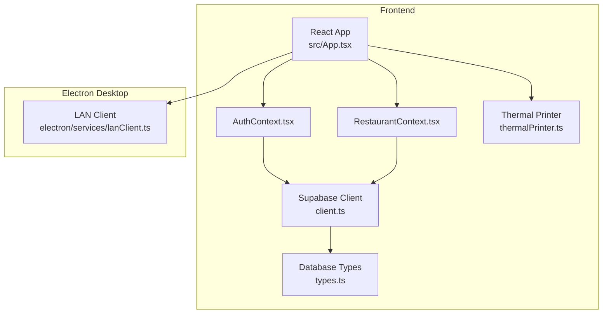
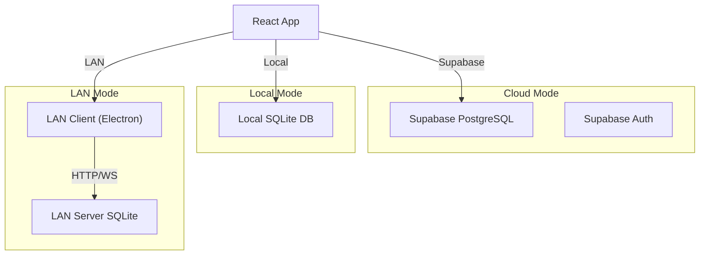
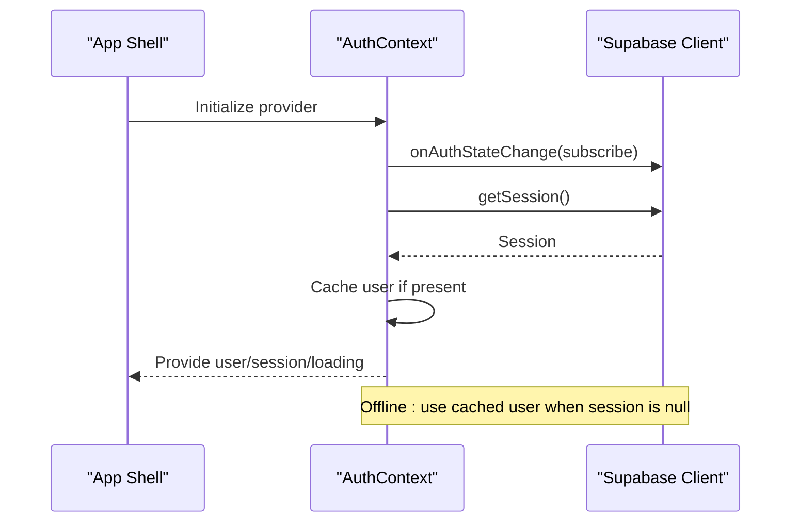
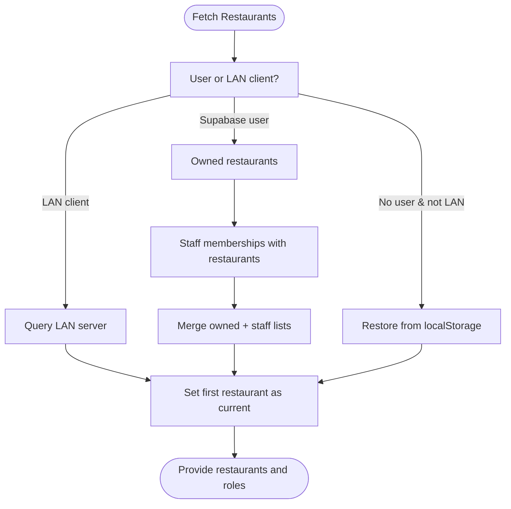
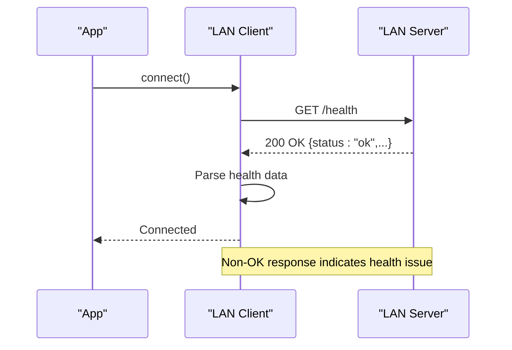
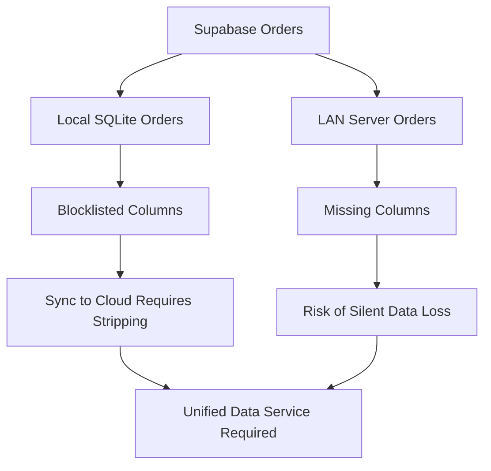
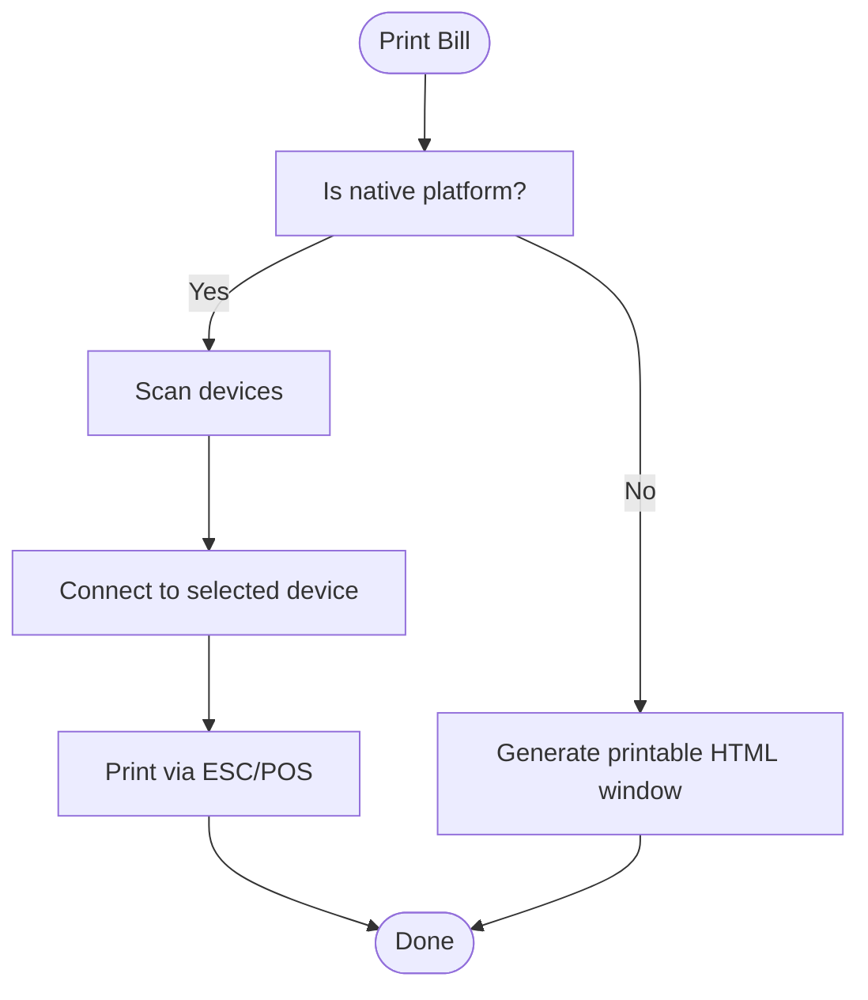
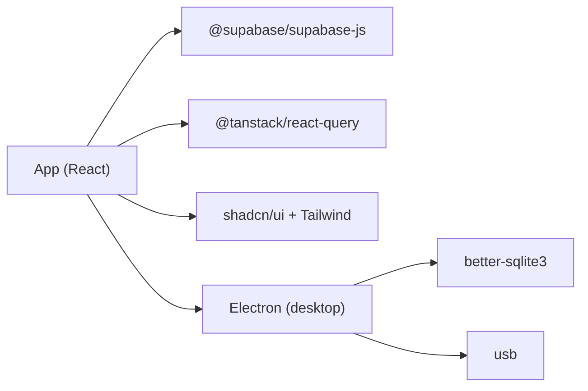

# Monitoring & Production Maintenance

<cite>
**Referenced Files in This Document**
- [README.md](file://README.md)
- [package.json](file://package.json)
- [src/App.tsx](file://src/App.tsx)
- [src/integrations/supabase/client.ts](file://src/integrations/supabase/client.ts)
- [src/integrations/supabase/types.ts](file://src/integrations/supabase/types.ts)
- [src/contexts/AuthContext.tsx](file://src/contexts/AuthContext.tsx)
- [src/contexts/RestaurantContext.tsx](file://src/contexts/RestaurantContext.tsx)
- [src/services/thermalPrinter.ts](file://src/services/thermalPrinter.ts)
- [electron/services/lanClient.ts](file://electron/services/lanClient.ts)
- [DATABASE_CONNECTIVITY_MAP.md](file://DATABASE_CONNECTIVITY_MAP.md)
- [DATABASE_ARCHITECTURE_ANALYSIS.md](file://DATABASE_ARCHITECTURE_ANALYSIS.md)
</cite>

## Table of Contents
1. [Introduction](#introduction)
2. [Project Structure](#project-structure)
3. [Core Components](#core-components)
4. [Architecture Overview](#architecture-overview)
5. [Detailed Component Analysis](#detailed-component-analysis)
6. [Dependency Analysis](#dependency-analysis)
7. [Performance Considerations](#performance-considerations)
8. [Troubleshooting Guide](#troubleshooting-guide)
9. [Conclusion](#conclusion)
10. [Appendices](#appendices)

## Introduction
This document provides comprehensive monitoring and production maintenance guidance for TableFlow Pro. It covers application performance monitoring, error tracking, logging configuration, health checks, uptime monitoring, alerting, maintenance procedures (database cleanup, log rotation, optimization), practical dashboards and metrics, incident response, backup and disaster recovery, data integrity, and security and compliance considerations. The guidance is grounded in the repository’s frontend architecture, Supabase integration, offline-first design, LAN client connectivity, and database schema evolution artifacts.

## Project Structure
TableFlow Pro is a React application with TypeScript, using Supabase for authentication and real-time data, and supporting offline/local modes with SQLite. Electron is used for desktop builds, and LAN connectivity enables client-server synchronization for on-premise deployments.

**Diagram sources**
- [src/App.tsx:1-150](file://src/App.tsx#L1-L150)
- [src/contexts/AuthContext.tsx:1-141](file://src/contexts/AuthContext.tsx#L1-L141)
- [src/contexts/RestaurantContext.tsx:1-391](file://src/contexts/RestaurantContext.tsx#L1-L391)
- [src/integrations/supabase/client.ts:1-17](file://src/integrations/supabase/client.ts#L1-L17)
- [src/integrations/supabase/types.ts:1-818](file://src/integrations/supabase/types.ts#L1-L818)
- [src/services/thermalPrinter.ts:1-339](file://src/services/thermalPrinter.ts#L1-L339)
- [electron/services/lanClient.ts:38-82](file://electron/services/lanClient.ts#L38-L82)

**Section sources**
- [README.md:1-13](file://README.md#L1-L13)
- [package.json:1-131](file://package.json#L1-L131)
- [src/App.tsx:1-150](file://src/App.tsx#L1-L150)

## Core Components
- Application shell and routing: [src/App.tsx:1-150](file://src/App.tsx#L1-L150)
- Authentication and session management: [src/contexts/AuthContext.tsx:1-141](file://src/contexts/AuthContext.tsx#L1-L141)
- Restaurant and role-aware context: [src/contexts/RestaurantContext.tsx:1-391](file://src/contexts/RestaurantContext.tsx#L1-L391)
- Supabase client initialization and environment configuration: [src/integrations/supabase/client.ts:1-17](file://src/integrations/supabase/client.ts#L1-L17), [src/integrations/supabase/types.ts:1-818](file://src/integrations/supabase/types.ts#L1-L818)
- Thermal printer integration: [src/services/thermalPrinter.ts:1-339](file://src/services/thermalPrinter.ts#L1-L339)
- LAN client connectivity and health checks: [electron/services/lanClient.ts:38-82](file://electron/services/lanClient.ts#L38-L82)

Key production monitoring touchpoints:
- Console logs for lifecycle events and error reporting (e.g., LAN connection, auth state changes, restaurant fetches).
- Supabase auth state change hooks for session transitions and offline behavior.
- LAN client health endpoint usage for uptime checks.

**Section sources**
- [src/App.tsx:32-100](file://src/App.tsx#L32-L100)
- [src/contexts/AuthContext.tsx:44-97](file://src/contexts/AuthContext.tsx#L44-L97)
- [src/contexts/RestaurantContext.tsx:78-136](file://src/contexts/RestaurantContext.tsx#L78-L136)
- [electron/services/lanClient.ts:65-82](file://electron/services/lanClient.ts#L65-L82)

## Architecture Overview
TableFlow Pro supports three operational modes:
- Web/desktop with Supabase cloud
- Local SQLite (offline-first)
- LAN client/server (on-premise)

**Diagram sources**
- [src/contexts/RestaurantContext.tsx:78-136](file://src/contexts/RestaurantContext.tsx#L78-L136)
- [electron/services/lanClient.ts:57-82](file://electron/services/lanClient.ts#L57-L82)

## Detailed Component Analysis

### Authentication and Session Monitoring
- Auth state changes are subscribed to and logged; offline handling preserves cached user sessions.
- Startup restores session and caches user for offline resilience.
- Token refresh and persistence are configured via Supabase client.

**Diagram sources**
- [src/contexts/AuthContext.tsx:44-97](file://src/contexts/AuthContext.tsx#L44-L97)
- [src/integrations/supabase/client.ts:11-17](file://src/integrations/supabase/client.ts#L11-L17)

**Section sources**
- [src/contexts/AuthContext.tsx:44-97](file://src/contexts/AuthContext.tsx#L44-L97)
- [src/integrations/supabase/client.ts:11-17](file://src/integrations/supabase/client.ts#L11-L17)

### Restaurant Context and Data Flow Monitoring
- Restaurant context orchestrates data retrieval from Supabase or LAN client, with offline fallback and caching.
- Role-aware access is derived from staff membership and ownership.

**Diagram sources**
- [src/contexts/RestaurantContext.tsx:78-284](file://src/contexts/RestaurantContext.tsx#L78-L284)

**Section sources**
- [src/contexts/RestaurantContext.tsx:78-284](file://src/contexts/RestaurantContext.tsx#L78-L284)

### LAN Client Health Checks and Uptime Monitoring
- The LAN client performs an HTTP health check before WebSocket connections.
- Health endpoint response is logged; non-OK responses indicate downtime or misconfiguration.

**Diagram sources**
- [electron/services/lanClient.ts:65-82](file://electron/services/lanClient.ts#L65-L82)

**Section sources**
- [electron/services/lanClient.ts:65-82](file://electron/services/lanClient.ts#L65-L82)

### Database Connectivity and Integrity Monitoring
- The repository includes detailed analyses of schema mismatches and data integrity risks across Supabase, local SQLite, and LAN server schemas.
- Critical gaps include missing customer/payment fields in LAN server orders and lack of indexes/foreign keys enforcement.

**Diagram sources**
- [DATABASE_CONNECTIVITY_MAP.md:46-77](file://DATABASE_CONNECTIVITY_MAP.md#L46-L77)
- [DATABASE_ARCHITECTURE_ANALYSIS.md:74-111](file://DATABASE_ARCHITECTURE_ANALYSIS.md#L74-L111)

**Section sources**
- [DATABASE_CONNECTIVITY_MAP.md:46-77](file://DATABASE_CONNECTIVITY_MAP.md#L46-L77)
- [DATABASE_ARCHITECTURE_ANALYSIS.md:74-111](file://DATABASE_ARCHITECTURE_ANALYSIS.md#L74-L111)

### Thermal Printer Monitoring
- Printer availability and connection status are platform-dependent.
- Print operations log failures; browser mode falls back to printable HTML windows.

**Diagram sources**
- [src/services/thermalPrinter.ts:37-120](file://src/services/thermalPrinter.ts#L37-L120)
- [src/services/thermalPrinter.ts:221-335](file://src/services/thermalPrinter.ts#L221-L335)

**Section sources**
- [src/services/thermalPrinter.ts:37-120](file://src/services/thermalPrinter.ts#L37-L120)
- [src/services/thermalPrinter.ts:221-335](file://src/services/thermalPrinter.ts#L221-L335)

## Dependency Analysis
- Frontend runtime dependencies include Supabase JS client, React Query, and UI libraries.
- Electron build scripts and native module rebuild steps are defined for desktop packaging.
- The app uses environment variables for Supabase URLs and publishable keys.

**Diagram sources**
- [package.json:17-77](file://package.json#L17-L77)
- [package.json:107-129](file://package.json#L107-L129)

**Section sources**
- [package.json:17-77](file://package.json#L17-L77)
- [package.json:107-129](file://package.json#L107-L129)

## Performance Considerations
- Use React Query for efficient caching and background refetching of restaurant and order data.
- Minimize re-renders by leveraging context providers and memoization where appropriate.
- Offload heavy computations to worker threads if needed; avoid blocking the UI thread.
- Monitor network requests to Supabase and LAN endpoints; implement retry/backoff strategies for transient failures.
- Optimize database queries with proper indexing and limit selections to required columns.

[No sources needed since this section provides general guidance]

## Troubleshooting Guide
Common production issues and resolutions:
- Auth session null while offline: The auth context intentionally uses cached user to maintain continuity. Verify cached user presence and clear cache only on explicit sign-out.
- Restaurant data missing without user: Restaurant context attempts to restore from localStorage when offline/electron; ensure persisted keys exist.
- LAN client not connecting: Perform health check manually at the LAN server’s /health endpoint; confirm server host/port configuration and firewall rules.
- Data integrity warnings: Review schema mismatch artifacts; ensure LAN server schema aligns with Supabase and local SQLite to prevent silent data loss.

**Section sources**
- [src/contexts/AuthContext.tsx:44-97](file://src/contexts/AuthContext.tsx#L44-L97)
- [src/contexts/RestaurantContext.tsx:78-136](file://src/contexts/RestaurantContext.tsx#L78-L136)
- [electron/services/lanClient.ts:65-82](file://electron/services/lanClient.ts#L65-L82)
- [DATABASE_CONNECTIVITY_MAP.md:46-77](file://DATABASE_CONNECTIVITY_MAP.md#L46-L77)

## Conclusion
TableFlow Pro’s production readiness hinges on robust monitoring of authentication, data contexts, LAN connectivity, and database integrity. Implement health checks, structured logging, and alerting around auth state changes, LAN server reachability, and database schema alignment. Adopt a unified data service and batch operations to mitigate risks and improve reliability.

[No sources needed since this section summarizes without analyzing specific files]

## Appendices

### A. Monitoring and Logging Configuration
- Console logging: Use structured logs for auth events, restaurant fetches, LAN connection outcomes, and printer operations.
- Error boundaries: Wrap critical components to capture and report errors to an external logging service.
- Environment variables: Ensure Supabase URL and publishable key are configured per environment.

**Section sources**
- [src/contexts/AuthContext.tsx:44-97](file://src/contexts/AuthContext.tsx#L44-L97)
- [src/contexts/RestaurantContext.tsx:78-136](file://src/contexts/RestaurantContext.tsx#L78-L136)
- [electron/services/lanClient.ts:65-82](file://electron/services/lanClient.ts#L65-L82)
- [src/integrations/supabase/client.ts:5-6](file://src/integrations/supabase/client.ts#L5-L6)

### B. Health Checks and Uptime Monitoring
- Supabase: Use Supabase client health endpoints or simple auth/session checks.
- LAN: Call the LAN server’s /health endpoint from the LAN client during connect.
- Frontend: Expose a lightweight /health route returning application state and connected backend status.

**Section sources**
- [electron/services/lanClient.ts:72-82](file://electron/services/lanClient.ts#L72-L82)

### C. Alerting Setup
- Auth: Alert on repeated auth state changes or token refresh failures.
- Data: Alert on persistent schema mismatch detections or LAN connectivity timeouts.
- Print: Alert on repeated printer connection/print failures.

[No sources needed since this section provides general guidance]

### D. Maintenance Procedures
- Database cleanup: Remove stale records based on retention policies; ensure referential integrity before deletion.
- Log rotation: Rotate and archive application logs; retain logs for compliance periods.
- System optimization: Pre-warm database connections, cache frequently accessed data, and monitor memory/CPU usage.

[No sources needed since this section provides general guidance]

### E. Backup and Disaster Recovery
- Supabase: Rely on managed backups; test restoration procedures regularly.
- Local SQLite: Back up the database file; verify checksums.
- LAN server: Back up the LAN SQLite database; replicate to secondary storage.

[No sources needed since this section provides general guidance]

### F. Security Monitoring and Compliance
- Audit logs: Track authentication, authorization, and administrative actions.
- Access control: Enforce least privilege; monitor role changes and access attempts.
- Data protection: Encrypt sensitive data at rest and in transit; review schema for PII fields.

[No sources needed since this section provides general guidance]