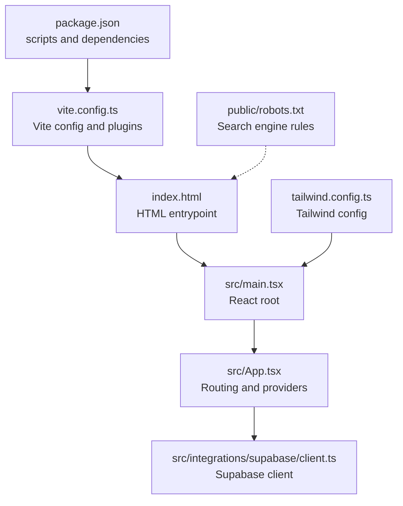
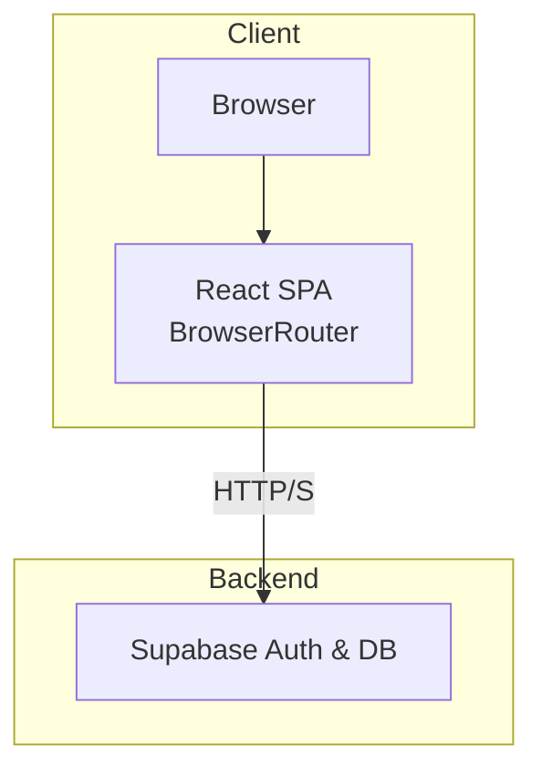
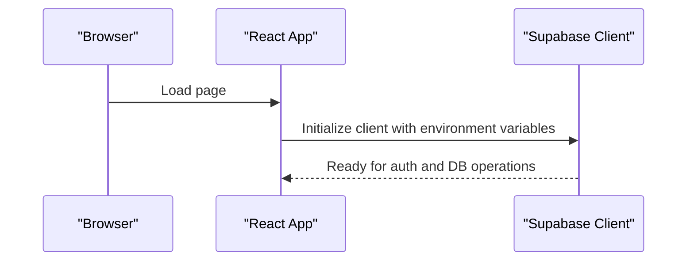
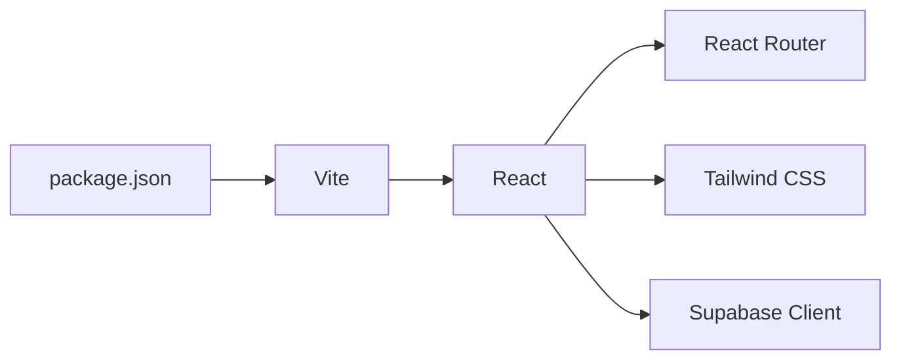

# Web Application Deployment

<cite>
**Referenced Files in This Document**
- [package.json](file://package.json)
- [vite.config.ts](file://vite.config.ts)
- [index.html](file://index.html)
- [README.md](file://README.md)
- [tailwind.config.ts](file://tailwind.config.ts)
- [public/robots.txt](file://public/robots.txt)
- [src/App.tsx](file://src/App.tsx)
- [src/main.tsx](file://src/main.tsx)
- [src/integrations/supabase/client.ts](file://src/integrations/supabase/client.ts)
- [supabase/config.toml](file://supabase/config.toml)
</cite>

## Table of Contents
1. [Introduction](#introduction)
2. [Project Structure](#project-structure)
3. [Core Components](#core-components)
4. [Architecture Overview](#architecture-overview)
5. [Detailed Component Analysis](#detailed-component-analysis)
6. [Dependency Analysis](#dependency-analysis)
7. [Performance Considerations](#performance-considerations)
8. [Troubleshooting Guide](#troubleshooting-guide)
9. [Conclusion](#conclusion)
10. [Appendices](#appendices)

## Introduction
This document provides comprehensive web deployment guidance for TableFlow Pro. It covers static site hosting options, CDN configuration, SSL/TLS setup, platform-specific deployment steps for Vercel, Netlify, AWS S3/CloudFront, and traditional web servers, and outlines the build process, asset optimization, caching strategies, server configuration requirements, proxy settings, API endpoint configuration, continuous deployment workflows, automated testing integration, rollback procedures, and troubleshooting tips.

## Project Structure
TableFlow Pro is a Vite-powered React application with TypeScript. The repository includes:
- Build and dev scripts for Vite
- A Vite configuration supporting both web and Electron modes
- A minimal HTML entry pointing to the React root
- Tailwind CSS configuration for styling
- Supabase client integration for authentication and database operations
- Public assets and SEO metadata

**Diagram sources**
- [package.json:1-131](file://package.json#L1-L131)
- [vite.config.ts:1-69](file://vite.config.ts#L1-L69)
- [index.html:1-25](file://index.html#L1-L25)
- [src/main.tsx:1-6](file://src/main.tsx#L1-L6)
- [src/App.tsx:1-150](file://src/App.tsx#L1-L150)
- [src/integrations/supabase/client.ts:1-17](file://src/integrations/supabase/client.ts#L1-L17)
- [tailwind.config.ts:1-114](file://tailwind.config.ts#L1-L114)
- [public/robots.txt:1-15](file://public/robots.txt#L1-L15)

**Section sources**
- [README.md:1-13](file://README.md#L1-L13)
- [package.json:1-131](file://package.json#L1-L131)
- [vite.config.ts:1-69](file://vite.config.ts#L1-L69)
- [index.html:1-25](file://index.html#L1-L25)
- [tailwind.config.ts:1-114](file://tailwind.config.ts#L1-L114)
- [public/robots.txt:1-15](file://public/robots.txt#L1-L15)

## Core Components
- Build and scripts: Vite-based build pipeline with development and production modes.
- Routing: Uses BrowserRouter for web deployments; HashRouter is conditionally selected for Electron.
- Supabase integration: Client initialization with environment variables for Supabase URL and publishable key.
- Static assets: Minimal HTML entry with meta tags and OpenGraph properties.

Key deployment-relevant aspects:
- Base path is configured for relative asset resolution.
- Environment variables for Supabase are injected at build time.
- Tailwind is configured for content scanning across components and pages.

**Section sources**
- [package.json:7-16](file://package.json#L7-L16)
- [vite.config.ts:12-17](file://vite.config.ts#L12-L17)
- [src/App.tsx:32-34](file://src/App.tsx#L32-L34)
- [src/integrations/supabase/client.ts:5-6](file://src/integrations/supabase/client.ts#L5-L6)
- [tailwind.config.ts:4-5](file://tailwind.config.ts#L4-L5)

## Architecture Overview
The web application is a single-page application (SPA) served statically. Authentication and data persistence rely on Supabase. The SPA routing is handled by React Router, with environment-driven configuration for Supabase.

**Diagram sources**
- [src/App.tsx:32-34](file://src/App.tsx#L32-L34)
- [src/integrations/supabase/client.ts:11-17](file://src/integrations/supabase/client.ts#L11-L17)

## Detailed Component Analysis

### Build and Asset Pipeline
- Vite configuration sets a relative base path suitable for static hosting.
- Plugins include React and optional Electron-related plugins for desktop builds.
- Aliasing for @ resolves to src for consistent imports.

Optimization and asset handling:
- Use Vite’s default minification and asset inlining for JS/CSS.
- Tailwind CSS is configured to scan components and pages; ensure production builds include all relevant paths.

**Section sources**
- [vite.config.ts:12-17](file://vite.config.ts#L12-L17)
- [vite.config.ts:62-66](file://vite.config.ts#L62-L66)
- [tailwind.config.ts:4-5](file://tailwind.config.ts#L4-L5)

### Routing and SPA Behavior
- BrowserRouter is used for web deployments.
- HashRouter is used in Electron mode to support file:// protocol.
- Ensure server-side redirects are configured to serve index.html for all routes to enable client-side routing.

**Section sources**
- [src/App.tsx:32-34](file://src/App.tsx#L32-L34)

### Supabase Client Configuration
- Supabase client is initialized with Vite environment variables for URL and publishable key.
- Authentication persistence and token refresh are enabled.

Environment variables to configure:
- VITE_SUPABASE_URL
- VITE_SUPABASE_PUBLISHABLE_KEY

**Diagram sources**
- [src/integrations/supabase/client.ts:5-6](file://src/integrations/supabase/client.ts#L5-L6)
- [src/integrations/supabase/client.ts:11-17](file://src/integrations/supabase/client.ts#L11-L17)

**Section sources**
- [src/integrations/supabase/client.ts:1-17](file://src/integrations/supabase/client.ts#L1-L17)
- [supabase/config.toml:1](file://supabase/config.toml#L1)

### HTML Entrypoint and Meta Tags
- index.html defines viewport, title, and social media meta tags.
- The script tag loads the React root module.

Ensure the production build output is deployed under the configured base path.

**Section sources**
- [index.html:1-25](file://index.html#L1-L25)

### Search Engine and Social Metadata
- robots.txt allows indexing for major crawlers.
- index.html includes OpenGraph and Twitter meta tags for social previews.

**Section sources**
- [public/robots.txt:1-15](file://public/robots.txt#L1-L15)
- [index.html:10-17](file://index.html#L10-L17)

## Dependency Analysis
- Vite is the build tool and dev server.
- React and React Router power the UI and routing.
- Supabase client handles authentication and database operations.
- Tailwind CSS provides styling with a content-based scanning configuration.

**Diagram sources**
- [package.json:17-77](file://package.json#L17-L77)
- [vite.config.ts:18-20](file://vite.config.ts#L18-L20)
- [tailwind.config.ts:4-5](file://tailwind.config.ts#L4-L5)
- [src/integrations/supabase/client.ts:2](file://src/integrations/supabase/client.ts#L2)

**Section sources**
- [package.json:17-77](file://package.json#L17-L77)
- [vite.config.ts:18-20](file://vite.config.ts#L18-L20)
- [tailwind.config.ts:4-5](file://tailwind.config.ts#L4-L5)

## Performance Considerations
- Build optimization: Use Vite’s production build for minification and asset optimization.
- CSS optimization: Tailwind purges unused styles during production builds; ensure all component paths are included in the content configuration.
- Asset delivery: Serve static assets via a CDN for improved global latency.
- Caching: Configure long-term caching for immutable assets (hashed filenames) and appropriate cache headers for HTML and dynamic resources.
- Preloading: Consider preloading critical fonts and assets to improve First Contentful Paint.

[No sources needed since this section provides general guidance]

## Troubleshooting Guide
Common deployment issues and resolutions:
- 404 on deep links: Configure server to redirect unmatched routes to index.html to support client-side routing.
- Supabase errors: Verify VITE_SUPABASE_URL and VITE_SUPABASE_PUBLISHABLE_KEY are set in the hosting environment.
- Mixed content warnings: Ensure HTTPS is enforced and all assets are served over HTTPS.
- CDN cache misses: Invalidate CDN caches after deployments and confirm cache-control headers.
- Robots blocking indexing: Confirm robots.txt allows crawling of intended paths.

**Section sources**
- [src/App.tsx:32-34](file://src/App.tsx#L32-L34)
- [src/integrations/supabase/client.ts:5-6](file://src/integrations/supabase/client.ts#L5-L6)

## Conclusion
TableFlow Pro is a modern React SPA built with Vite and TypeScript, designed for straightforward static hosting. By configuring environment variables for Supabase, setting up server-side routing fallbacks, leveraging CDN and caching strategies, and enforcing HTTPS, you can deploy reliably across multiple platforms.

[No sources needed since this section summarizes without analyzing specific files]

## Appendices

### A. Static Site Hosting Options and CDN Configuration
- Choose a static host that supports SPA routing fallbacks (e.g., Netlify, Vercel, AWS S3 + CloudFront, traditional servers with rewrites).
- Configure CDN to cache static assets with long TTLs and appropriate cache-control headers.
- Set origin response headers to allow caching for immutable assets and short TTLs for HTML.

[No sources needed since this section provides general guidance]

### B. SSL Certificate Setup
- Enforce HTTPS at the CDN and origin.
- Use HSTS headers where applicable.
- Ensure all internal API calls and third-party resources are HTTPS-only.

[No sources needed since this section provides general guidance]

### C. Platform-Specific Deployment Guides

#### Vercel
- Steps:
  - Connect your Git repository.
  - Set build command to the Vite build script.
  - Set output directory to the Vite dist folder.
  - Configure environment variables for Supabase.
  - Enable SPA routing fallback to index.html.
  - Configure domain and SSL certificates via Vercel.
- Example environment variables:
  - VITE_SUPABASE_URL
  - VITE_SUPABASE_PUBLISHABLE_KEY

**Section sources**
- [package.json:10](file://package.json#L10)
- [src/integrations/supabase/client.ts:5-6](file://src/integrations/supabase/client.ts#L5-L6)

#### Netlify
- Steps:
  - Connect your Git repository.
  - Set build command and publish directory.
  - Add environment variables for Supabase.
  - Add a _redirects file to rewrite all routes to /index.html for SPA routing.
  - Configure custom domain and SSL.
- Example _redirects content:
  - /* /index.html 200

**Section sources**
- [src/App.tsx:32-34](file://src/App.tsx#L32-L34)
- [src/integrations/supabase/client.ts:5-6](file://src/integrations/supabase/client.ts#L5-L6)

#### AWS S3 + CloudFront
- Steps:
  - Build the app and upload to an S3 bucket.
  - Enable static website hosting on the bucket.
  - Configure CloudFront distribution with the bucket as origin.
  - Set origin response headers for caching.
  - Configure Lambda@Edge or origin request behavior to redirect non-file requests to index.html for SPA routing.
  - Set up SSL certificate via AWS Certificate Manager and associate with CloudFront.
- Example CloudFront behavior:
  - If the request path does not contain a “.” (no file extension), forward to index.html.

**Section sources**
- [src/App.tsx:32-34](file://src/App.tsx#L32-L34)
- [src/integrations/supabase/client.ts:5-6](file://src/integrations/supabase/client.ts#L5-L6)

#### Traditional Web Servers (Apache/Nginx)
- Apache:
  - Enable mod_rewrite and .htaccess.
  - Add rewrite rules to route all non-file requests to index.html.
- Nginx:
  - Add location blocks to serve index.html for unmatched routes.
  - Configure gzip and cache headers for static assets.

**Section sources**
- [src/App.tsx:32-34](file://src/App.tsx#L32-L34)

### D. Build Process for Web-Only Deployment
- Install dependencies and run the Vite build script.
- Deploy the generated static files to your chosen host.
- Verify SPA routing fallbacks and environment variable configuration.

**Section sources**
- [package.json:10](file://package.json#L10)
- [vite.config.ts:12-17](file://vite.config.ts#L12-L17)

### E. Asset Optimization and Caching Strategies
- Use Vite’s default minification and asset hashing.
- Tailwind purges unused styles in production.
- Serve images and fonts via CDN with appropriate cache-control headers.
- Implement long-term caching for immutable assets and short-term caching for HTML.

**Section sources**
- [tailwind.config.ts:4-5](file://tailwind.config.ts#L4-L5)

### F. Server Configuration Requirements, Proxy Settings, and API Endpoint Configuration
- SPA routing fallback: Ensure all routes fall back to index.html.
- Proxy settings: If using a reverse proxy, forward all non-API paths to the SPA.
- API endpoints: Configure Supabase URLs via environment variables; ensure CORS is set up on the Supabase side for your domain.

**Section sources**
- [src/App.tsx:32-34](file://src/App.tsx#L32-L34)
- [src/integrations/supabase/client.ts:5-6](file://src/integrations/supabase/client.ts#L5-L6)

### G. Continuous Deployment Workflows, Automated Testing Integration, and Rollback Procedures
- CD workflows:
  - Use provider-native CI/CD (e.g., Vercel/Netlify Git integration).
  - Run tests before building and deploying.
- Automated testing:
  - Integrate unit and E2E tests in your CI pipeline.
- Rollback:
  - Keep previous build artifacts or use blue/green deployments.
  - Revert domain DNS or CDN behavior to the last known good version.

[No sources needed since this section provides general guidance]