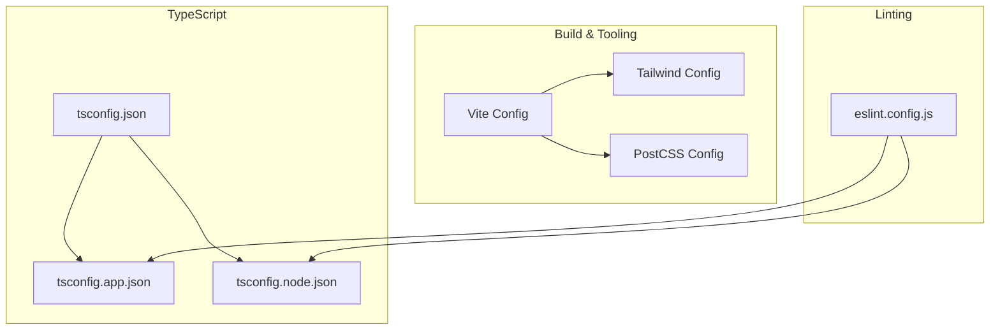
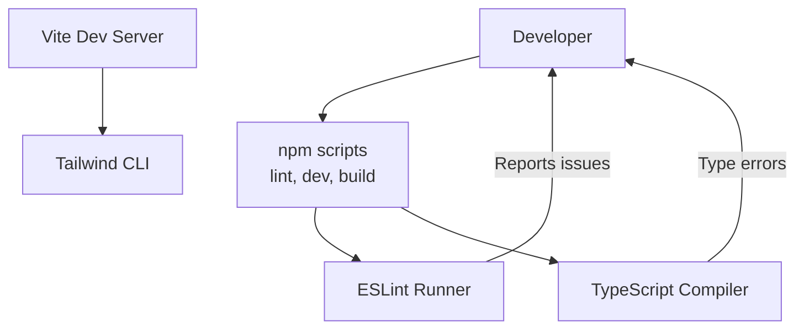
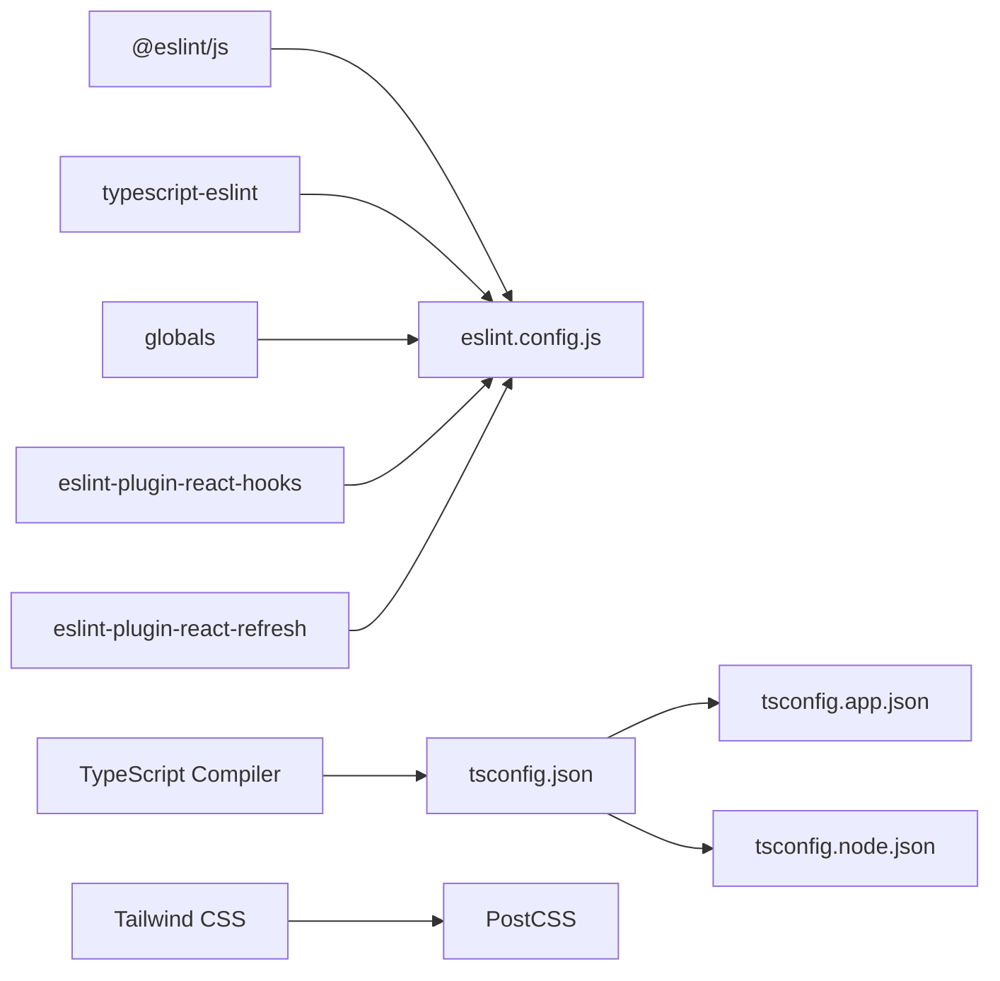

# Code Quality & Linting

<cite>
**Referenced Files in This Document**
- [eslint.config.js](file://eslint.config.js)
- [package.json](file://package.json)
- [tsconfig.json](file://tsconfig.json)
- [tsconfig.app.json](file://tsconfig.app.json)
- [tsconfig.node.json](file://tsconfig.node.json)
- [tailwind.config.ts](file://tailwind.config.ts)
- [postcss.config.js](file://postcss.config.js)
</cite>

## Table of Contents
1. [Introduction](#introduction)
2. [Project Structure](#project-structure)
3. [Core Components](#core-components)
4. [Architecture Overview](#architecture-overview)
5. [Detailed Component Analysis](#detailed-component-analysis)
6. [Dependency Analysis](#dependency-analysis)
7. [Performance Considerations](#performance-considerations)
8. [Troubleshooting Guide](#troubleshooting-guide)
9. [Conclusion](#conclusion)
10. [Appendices](#appendices)

## Introduction
This document defines the code quality and linting standards for TableFlow Pro. It covers the ESLint configuration, TypeScript compiler settings, formatting and naming conventions, pre-commit and CI/CD integration points, and performance considerations for type checking and compilation. The goal is to ensure consistent, maintainable, and reliable code across the multi-platform React, Vite, Electron, Capacitor, and Supabase stack.

## Project Structure
The project uses a modern frontend toolchain with Vite, React, TypeScript, Tailwind CSS, and optional Electron/Capacitor targets. ESLint and TypeScript configurations are centralized to enforce consistent rules across the app and node contexts.

**Diagram sources**
- [tsconfig.json:1-24](file://tsconfig.json#L1-L24)
- [tsconfig.app.json:1-32](file://tsconfig.app.json#L1-L32)
- [tsconfig.node.json:1-23](file://tsconfig.node.json#L1-L23)
- [eslint.config.js:1-27](file://eslint.config.js#L1-L27)
- [tailwind.config.ts:1-114](file://tailwind.config.ts#L1-L114)
- [postcss.config.js:1-7](file://postcss.config.js#L1-L7)

**Section sources**
- [tsconfig.json:1-24](file://tsconfig.json#L1-L24)
- [tsconfig.app.json:1-32](file://tsconfig.app.json#L1-L32)
- [tsconfig.node.json:1-23](file://tsconfig.node.json#L1-L23)
- [eslint.config.js:1-27](file://eslint.config.js#L1-L27)
- [tailwind.config.ts:1-114](file://tailwind.config.ts#L1-L114)
- [postcss.config.js:1-7](file://postcss.config.js#L1-L7)

## Core Components
- ESLint configuration: Centralized in a flat config using the modern ESLint flat config format. Extends recommended JS and TypeScript ESLint configs, enables React Hooks and React Refresh plugins, and applies project-specific rules.
- TypeScript configuration: Three configs split by concern:
  - Root tsconfig.json orchestrates app and node configs and disables strictness globally.
  - tsconfig.app.json configures bundler module resolution, JSX transform, DOM libs, and relaxed strictness for app code.
  - tsconfig.node.json enforces strictness for Vite config and similar Node-side code.
- Formatting and styling: Tailwind CSS and PostCSS are configured via dedicated files; no standalone formatter (Prettier) config is present in the repository.

Key capabilities:
- Linting: TypeScript-aware linting with React Hooks and React Refresh rules.
- Type checking: Dual-mode type checking via separate configs; app code is less strict, while Node/Vite config is strict.
- Formatting: Tailwind-based styling pipeline; import order and naming conventions are not enforced by tooling in this repository.

**Section sources**
- [eslint.config.js:1-27](file://eslint.config.js#L1-L27)
- [package.json:1-131](file://package.json#L1-L131)
- [tsconfig.json:1-24](file://tsconfig.json#L1-L24)
- [tsconfig.app.json:1-32](file://tsconfig.app.json#L1-L32)
- [tsconfig.node.json:1-23](file://tsconfig.node.json#L1-L23)
- [tailwind.config.ts:1-114](file://tailwind.config.ts#L1-L114)
- [postcss.config.js:1-7](file://postcss.config.js#L1-L7)

## Architecture Overview
The linting and type-checking architecture is designed to support:
- Fast feedback during development with relaxed app-side strictness.
- Strict verification for build-time and Node-side code.
- Consistent formatting through Tailwind and PostCSS.

[No sources needed since this diagram shows conceptual workflow, not actual code structure]

## Detailed Component Analysis

### ESLint Configuration
- Flat config export: Uses a single exported array of config objects for simplicity and compatibility with modern ESLint.
- Extensions:
  - Base JS recommended rules.
  - TypeScript ESLint recommended rules.
- Plugins:
  - React Hooks recommended rules.
  - React Refresh with a specific rule to allow constant exports.
- Language options:
  - ECMAScript version 2020.
  - Browser globals enabled.
- Files targeted:
  - Applies to TypeScript and TSX files.
- Ignored paths:
  - Ignores the dist folder.

Notable rule adjustments:
- Unused variable detection is disabled at the ESLint level.

Practical impact:
- Faster local iteration with fewer noise rules.
- Enforced React Hooks best practices.
- Controlled refresh behavior for component exports.

**Section sources**
- [eslint.config.js:1-27](file://eslint.config.js#L1-L27)
- [package.json:7-16](file://package.json#L7-L16)

### TypeScript Compiler Configuration
Root configuration:
- Allows JavaScript files.
- Disables several strictness checks (any, unused locals, unused parameters).
- Enables path mapping via tsconfig references.
- Skips library checks for faster builds.
- Disables strict null checks.

App configuration:
- Bundler module resolution and detection.
- JSX transform set to React JSX.
- DOM and DOM.Iterable libraries included.
- Module target and resolution optimized for bundlers.
- No emit for app code.
- Relaxed strictness compared to Node config.

Node/Vite configuration:
- Stricter settings enabled for Node-side code.
- Includes Vite config file.
- Enforces unused locals/parameters and fall-through switch checks.

Implications:
- App code prioritizes fast feedback and flexibility.
- Node/Vite code prioritizes correctness and safety.
- Path aliases unified across configs.

**Section sources**
- [tsconfig.json:1-24](file://tsconfig.json#L1-L24)
- [tsconfig.app.json:1-32](file://tsconfig.app.json#L1-L32)
- [tsconfig.node.json:1-23](file://tsconfig.node.json#L1-L23)

### Formatting and Styling Standards
- Tailwind CSS:
  - Content globs include pages, components, app, and src directories.
  - Dark mode strategy via class.
  - Extends theme with custom colors, shadows, animations, and gradients.
- PostCSS:
  - Enables Tailwind and Autoprefixer plugins.

Guidelines derived from repository:
- Use Tailwind utilities for styling.
- Keep content globs aligned with component locations.
- Prefer Tailwind-based animations and transitions.

**Section sources**
- [tailwind.config.ts:1-114](file://tailwind.config.ts#L1-L114)
- [postcss.config.js:1-7](file://postcss.config.js#L1-L7)

### Naming Conventions and Import Ordering
- Path aliases:
  - @/* mapped to ./src/* in both app and root configs.
- Import ordering:
  - No explicit import ordering enforced by ESLint/TSLint in this repository.
- Naming conventions:
  - No naming convention rules enforced by ESLint/TSLint in this repository.

Recommendations:
- Align import alias usage (@/*) consistently across the codebase.
- Establish and document import grouping (external, internal, same-project) and alphabetical ordering if desired.
- Define naming conventions (e.g., PascalCase for components, camelCase for hooks) and add ESLint rules if adopted.

**Section sources**
- [tsconfig.json:7-11](file://tsconfig.json#L7-L11)
- [tsconfig.app.json:19-23](file://tsconfig.app.json#L19-L23)

### Pre-commit Hooks and CI/CD Integration
- Current state:
  - No dedicated pre-commit hook configuration found in the repository.
  - No CI/CD workflow files found in the repository.
- Suggested integration points:
  - npm scripts: Use the existing lint script to run ESLint locally and in CI.
  - Build scripts: Use existing dev/build scripts to trigger Vite and related tooling.
- Recommended additions:
  - Add a pre-commit hook runner (e.g., Husky with lint-staged) to run linting and optionally formatting before commits.
  - Add CI workflows to run linting and type checking on pull requests and pushes.

**Section sources**
- [package.json:7-16](file://package.json#L7-L16)

### Practical Examples of Linting Violations and Fixes
Note: The following examples describe typical violations and their fixes without reproducing code. Apply these patterns consistently across the codebase.

- Unused variables:
  - Symptom: ESLint reports unused variables.
  - Fix: Remove unused variables or prefix with underscore if intentionally unused.
  - Reference: Unused variable rule is disabled in the ESLint config; consider enabling it for stricter teams.

- React Hook dependency warnings:
  - Symptom: React Hooks plugin warns about missing dependencies.
  - Fix: Add all dependencies to the dependency array or refactor to avoid unnecessary re-renders.

- Constant export with react-refresh:
  - Symptom: React Refresh rule warns on constant exports.
  - Fix: Allow constant exports per the current rule configuration.

- Missing type annotations:
  - Symptom: TypeScript suggests adding explicit types.
  - Fix: Add explicit types for props, return values, and complex objects.

- Switch fall-through:
  - Symptom: Node config enforces switch fall-through checks.
  - Fix: Add break statements or handle fall-through intentionally with comments.

**Section sources**
- [eslint.config.js:20-25](file://eslint.config.js#L20-L25)
- [tsconfig.node.json:15-20](file://tsconfig.node.json#L15-L20)

## Dependency Analysis
- ESLint depends on:
  - @eslint/js for base JS rules.
  - typescript-eslint for TypeScript rules.
  - globals for environment globals.
  - Plugins for React Hooks and React Refresh.
- TypeScript depends on:
  - tsconfig references to coordinate app and node configs.
  - Bundler-friendly module resolution and JSX transform in app config.
- Styling depends on:
  - Tailwind CSS and PostCSS configuration.

**Diagram sources**
- [eslint.config.js:1-27](file://eslint.config.js#L1-L27)
- [tsconfig.json:16-23](file://tsconfig.json#L16-L23)
- [tsconfig.app.json:1-32](file://tsconfig.app.json#L1-L32)
- [tsconfig.node.json:1-23](file://tsconfig.node.json#L1-L23)
- [tailwind.config.ts:1-114](file://tailwind.config.ts#L1-L114)
- [postcss.config.js:1-7](file://postcss.config.js#L1-L7)

**Section sources**
- [eslint.config.js:1-27](file://eslint.config.js#L1-L27)
- [package.json:79-106](file://package.json#L79-L106)
- [tsconfig.json:1-24](file://tsconfig.json#L1-L24)
- [tsconfig.app.json:1-32](file://tsconfig.app.json#L1-L32)
- [tsconfig.node.json:1-23](file://tsconfig.node.json#L1-L23)
- [tailwind.config.ts:1-114](file://tailwind.config.ts#L1-L114)
- [postcss.config.js:1-7](file://postcss.config.js#L1-L7)

## Performance Considerations
- Skip library checks:
  - Enabled in both app and root configs to reduce type-check overhead.
- Relaxed strictness:
  - App config avoids strict mode to speed up development.
  - Node config enables strictness for correctness.
- Bundler-friendly settings:
  - App config uses bundler module resolution and detection to align with Vite.
- Recommendations:
  - Keep library checks disabled only for app code; keep Node config strict.
  - Use incremental builds and watch mode during development.
  - Consider partitioning large projects to enable faster incremental type checking if the codebase grows.

**Section sources**
- [tsconfig.json:12-13](file://tsconfig.json#L12-L13)
- [tsconfig.app.json:13-14](file://tsconfig.app.json#L13-L14)
- [tsconfig.node.json:6-19](file://tsconfig.node.json#L6-L19)

## Troubleshooting Guide
- ESLint runs but reports no issues:
  - Verify files match the configured extensions and are not ignored.
  - Confirm the lint script exists and is executed from the project root.
- TypeScript errors in Node/Vite config:
  - Review strictness settings and fix missing types or unreachable code.
- Tailwind not generating styles:
  - Ensure content globs include all relevant directories.
  - Run the build process so Tailwind processes the files.

**Section sources**
- [package.json:7-16](file://package.json#L7-L16)
- [tsconfig.node.json:15-20](file://tsconfig.node.json#L15-L20)
- [tailwind.config.ts:4-5](file://tailwind.config.ts#L4-L5)

## Conclusion
TableFlow Pro’s current configuration emphasizes developer productivity with relaxed app-side strictness and strict Node/Vite settings. ESLint and TypeScript configurations are modular and aligned with the project’s multi-target architecture. To further improve consistency, consider adopting import ordering and naming convention rules, integrating pre-commit hooks, and establishing CI/CD checks for linting and type checking.

## Appendices

### Appendix A: ESLint Rule Summary
- Enabled plugins: React Hooks, React Refresh.
- Extended configs: Base JS recommended, TypeScript ESLint recommended.
- Notable rule adjustments: Unused variables disabled; constant exports allowed for refresh.

**Section sources**
- [eslint.config.js:10-25](file://eslint.config.js#L10-L25)

### Appendix B: TypeScript Strictness Matrix
- Root config: Relaxed strictness; skips library checks.
- App config: Bundler-friendly, JSX transform, DOM libs; relaxed strictness.
- Node config: Strict mode enabled for correctness.

**Section sources**
- [tsconfig.json:2-14](file://tsconfig.json#L2-L14)
- [tsconfig.app.json:2-28](file://tsconfig.app.json#L2-L28)
- [tsconfig.node.json:2-20](file://tsconfig.node.json#L2-L20)