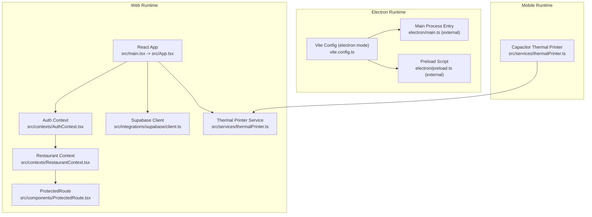
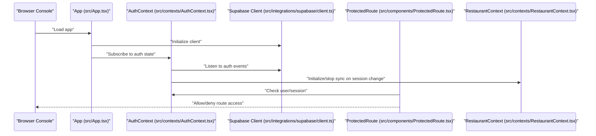
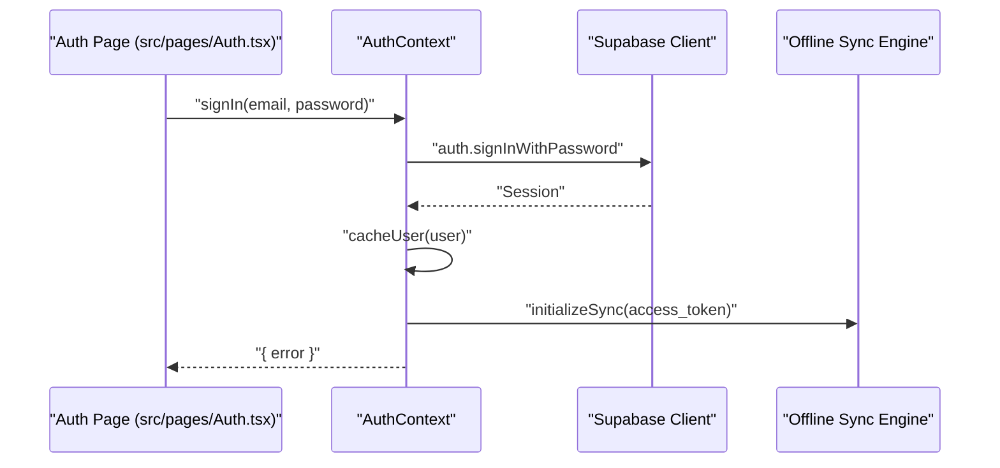
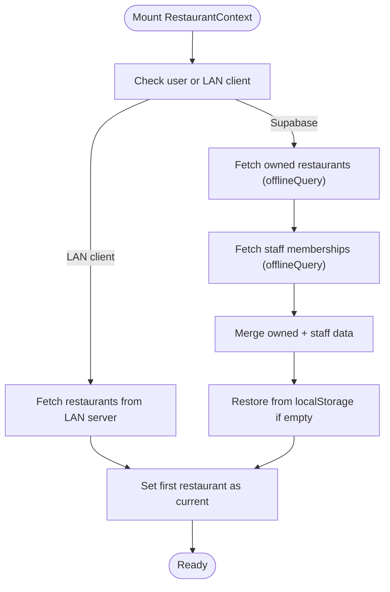
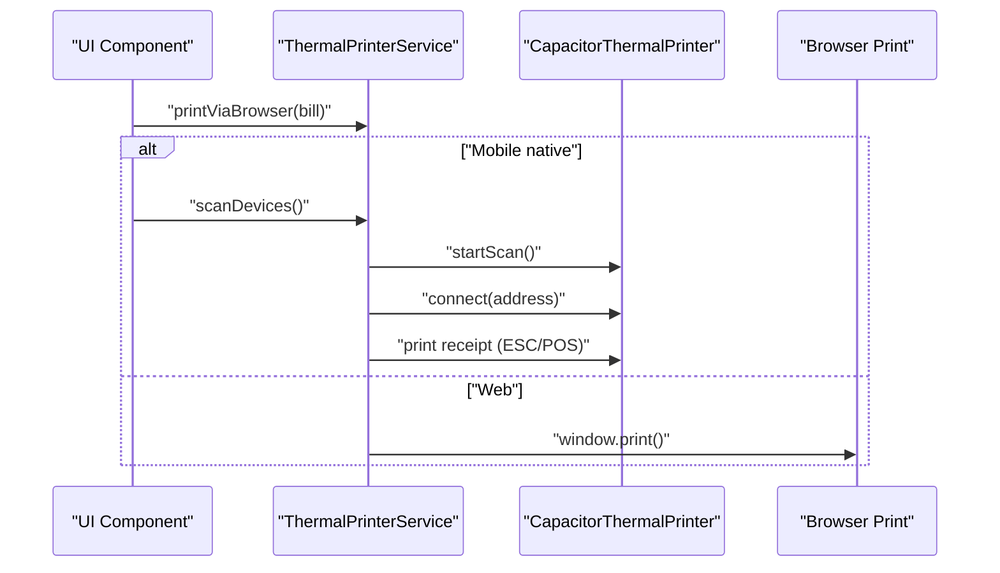
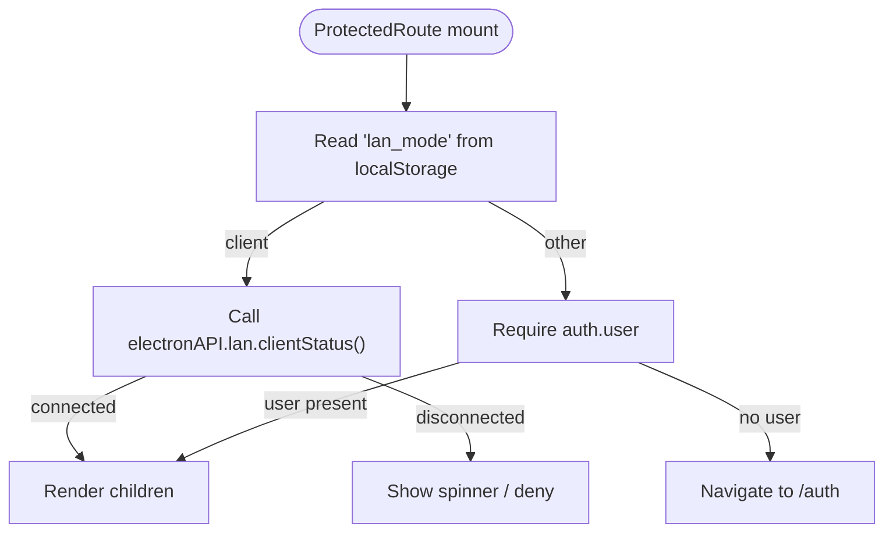
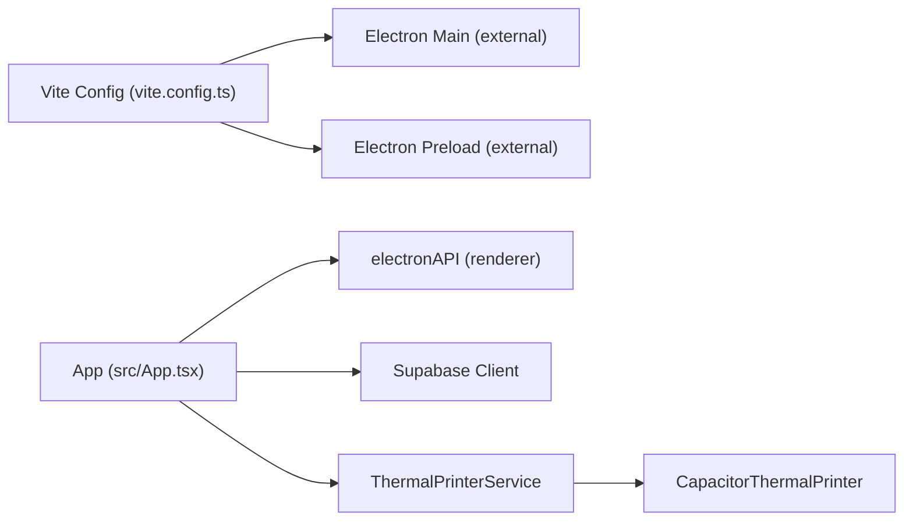

# Debugging & Troubleshooting

<cite>
**Referenced Files in This Document**
- [package.json](file://package.json)
- [vite.config.ts](file://vite.config.ts)
- [src/main.tsx](file://src/main.tsx)
- [src/App.tsx](file://src/App.tsx)
- [src/integrations/supabase/client.ts](file://src/integrations/supabase/client.ts)
- [src/contexts/AuthContext.tsx](file://src/contexts/AuthContext.tsx)
- [src/contexts/RestaurantContext.tsx](file://src/contexts/RestaurantContext.tsx)
- [src/components/ProtectedRoute.tsx](file://src/components/ProtectedRoute.tsx)
- [src/services/thermalPrinter.ts](file://src/services/thermalPrinter.ts)
- [src/hooks/use-toast.ts](file://src/hooks/use-toast.ts)
- [src/pages/Auth.tsx](file://src/pages/Auth.tsx)
</cite>

## Table of Contents
1. [Introduction](#introduction)
2. [Project Structure](#project-structure)
3. [Core Components](#core-components)
4. [Architecture Overview](#architecture-overview)
5. [Detailed Component Analysis](#detailed-component-analysis)
6. [Dependency Analysis](#dependency-analysis)
7. [Performance Considerations](#performance-considerations)
8. [Troubleshooting Guide](#troubleshooting-guide)
9. [Conclusion](#conclusion)
10. [Appendices](#appendices)

## Introduction
This document provides a comprehensive debugging and troubleshooting guide for TableFlow Pro. It covers techniques for the web, desktop (Electron), and mobile (Capacitor) layers, with emphasis on browser developer tools, React DevTools, Electron debugging workflows, logging strategies, error tracking, and performance monitoring. It also includes troubleshooting steps for common issues such as authentication problems, database connectivity, printer integration failures, offline synchronization errors, Supabase Realtime connection issues, and LAN networking concerns. Platform-specific guidance is included for Windows, macOS, and Linux environments.

## Project Structure
TableFlow Pro is a Vite + React application with optional Electron packaging and Capacitor-based mobile features. The app uses Supabase for authentication and data, React Query for caching and background synchronization, and local storage for offline persistence. Electron is integrated via Vite plugins to enable desktop builds.

**Diagram sources**
- [src/main.tsx:1-6](file://src/main.tsx#L1-L6)
- [src/App.tsx:32-34](file://src/App.tsx#L32-L34)
- [src/contexts/AuthContext.tsx:1-141](file://src/contexts/AuthContext.tsx#L1-L141)
- [src/contexts/RestaurantContext.tsx:1-391](file://src/contexts/RestaurantContext.tsx#L1-L391)
- [src/components/ProtectedRoute.tsx:1-60](file://src/components/ProtectedRoute.tsx#L1-L60)
- [src/integrations/supabase/client.ts:1-17](file://src/integrations/supabase/client.ts#L1-L17)
- [src/services/thermalPrinter.ts:1-339](file://src/services/thermalPrinter.ts#L1-L339)
- [vite.config.ts:9-61](file://vite.config.ts#L9-L61)

**Section sources**
- [package.json:1-131](file://package.json#L1-L131)
- [vite.config.ts:1-69](file://vite.config.ts#L1-L69)
- [src/main.tsx:1-6](file://src/main.tsx#L1-L6)
- [src/App.tsx:32-34](file://src/App.tsx#L32-L34)

## Core Components
- Application bootstrap and routing: The app initializes React DOM and selects either HashRouter (Electron) or BrowserRouter (web) based on runtime detection. It wires providers for authentication, restaurant data, tooltips, and React Query.
- Authentication: Supabase client is configured with localStorage-backed persistence and automatic token refresh. Auth state changes are observed and used to initialize or stop offline synchronization.
- Restaurant data: RestaurantContext fetches data from Supabase or LAN server depending on mode, with offline fallback and localStorage caching.
- ProtectedRoute: Enforces authentication for protected routes, with special handling for LAN client mode.
- Thermal printer: Provides cross-platform printing via Capacitor on mobile and via browser print on web.
- Logging and notifications: Extensive use of console logs and toast notifications for user feedback and diagnostics.

**Section sources**
- [src/App.tsx:32-34](file://src/App.tsx#L32-L34)
- [src/contexts/AuthContext.tsx:44-97](file://src/contexts/AuthContext.tsx#L44-L97)
- [src/contexts/RestaurantContext.tsx:78-284](file://src/contexts/RestaurantContext.tsx#L78-L284)
- [src/components/ProtectedRoute.tsx:9-59](file://src/components/ProtectedRoute.tsx#L9-L59)
- [src/services/thermalPrinter.ts:33-339](file://src/services/thermalPrinter.ts#L33-L339)
- [src/hooks/use-toast.ts:1-187](file://src/hooks/use-toast.ts#L1-L187)

## Architecture Overview
The system integrates three primary runtimes:
- Web: Standard browser runtime with Supabase authentication and React Query caching.
- Desktop (Electron): Uses HashRouter and exposes a custom electronAPI to the renderer for LAN operations.
- Mobile (Capacitor): Uses CapacitorThermalPrinter for Bluetooth printing.

**Diagram sources**
- [src/App.tsx:32-34](file://src/App.tsx#L32-L34)
- [src/contexts/AuthContext.tsx:44-97](file://src/contexts/AuthContext.tsx#L44-L97)
- [src/integrations/supabase/client.ts:11-17](file://src/integrations/supabase/client.ts#L11-L17)
- [src/components/ProtectedRoute.tsx:9-59](file://src/components/ProtectedRoute.tsx#L9-L59)
- [src/contexts/RestaurantContext.tsx:61-70](file://src/contexts/RestaurantContext.tsx#L61-L70)

## Detailed Component Analysis

### Authentication and Session Management
Key behaviors:
- Supabase client configured with localStorage-backed auth storage and automatic token refresh.
- Auth state subscription updates user/session and caches user for offline scenarios.
- Offline-aware logic prevents clearing cached user during offline token refresh events.
- Initialization of offline synchronization is triggered by access tokens.

**Diagram sources**
- [src/pages/Auth.tsx:25-39](file://src/pages/Auth.tsx#L25-L39)
- [src/contexts/AuthContext.tsx:115-125](file://src/contexts/AuthContext.tsx#L115-L125)
- [src/contexts/AuthContext.tsx:66-70](file://src/contexts/AuthContext.tsx#L66-L70)

**Section sources**
- [src/integrations/supabase/client.ts:11-17](file://src/integrations/supabase/client.ts#L11-L17)
- [src/contexts/AuthContext.tsx:44-97](file://src/contexts/AuthContext.tsx#L44-L97)
- [src/pages/Auth.tsx:25-39](file://src/pages/Auth.tsx#L25-L39)

### Restaurant Data and Offline Persistence
Key behaviors:
- RestaurantContext fetches data from Supabase or LAN server depending on mode.
- Offline fallback uses localStorage-cached restaurant and role data.
- LAN client mode queries the LAN server and sets a manager role for clients.
- ProtectedRoute checks LAN client status to bypass authentication.

**Diagram sources**
- [src/contexts/RestaurantContext.tsx:78-284](file://src/contexts/RestaurantContext.tsx#L78-L284)
- [src/components/ProtectedRoute.tsx:15-38](file://src/components/ProtectedRoute.tsx#L15-L38)

**Section sources**
- [src/contexts/RestaurantContext.tsx:78-284](file://src/contexts/RestaurantContext.tsx#L78-L284)
- [src/components/ProtectedRoute.tsx:15-38](file://src/components/ProtectedRoute.tsx#L15-L38)

### Thermal Printer Integration
Key behaviors:
- Mobile (Capacitor): Scans for printers, connects, and prints receipts using ESC/POS commands.
- Web: Generates HTML receipts and opens a print dialog.
- Error logging is performed for connection and print failures.

**Diagram sources**
- [src/services/thermalPrinter.ts:41-87](file://src/services/thermalPrinter.ts#L41-L87)
- [src/services/thermalPrinter.ts:89-112](file://src/services/thermalPrinter.ts#L89-L112)
- [src/services/thermalPrinter.ts:118-219](file://src/services/thermalPrinter.ts#L118-L219)
- [src/services/thermalPrinter.ts:221-335](file://src/services/thermalPrinter.ts#L221-L335)

**Section sources**
- [src/services/thermalPrinter.ts:33-339](file://src/services/thermalPrinter.ts#L33-L339)

### ProtectedRoute and LAN Mode
Key behaviors:
- Determines if the app is running in LAN client mode and verifies connection status.
- Allows access without authentication when LAN client is connected.

**Diagram sources**
- [src/components/ProtectedRoute.tsx:9-59](file://src/components/ProtectedRoute.tsx#L9-L59)

**Section sources**
- [src/components/ProtectedRoute.tsx:9-59](file://src/components/ProtectedRoute.tsx#L9-L59)

## Dependency Analysis
- Electron integration: Vite plugins configure electron main and preload entries, with externals for native modules. The app detects Electron via a global electronAPI and switches routing accordingly.
- Supabase: Used for authentication and data access; configured with localStorage-backed persistence.
- Capacitor: Enables mobile printing via CapacitorThermalPrinter.

**Diagram sources**
- [vite.config.ts:21-60](file://vite.config.ts#L21-L60)
- [src/App.tsx:32-34](file://src/App.tsx#L32-L34)
- [src/services/thermalPrinter.ts:1-3](file://src/services/thermalPrinter.ts#L1-L3)

**Section sources**
- [vite.config.ts:21-60](file://vite.config.ts#L21-L60)
- [package.json:17-77](file://package.json#L17-L77)

## Performance Considerations
- React Query caching: Use queryClient to inspect cache state and invalidate queries when needed.
- Network requests: Monitor XHR/fetch in browser devtools Network tab; filter by domain for Supabase and LAN endpoints.
- Rendering performance: Use React DevTools Profiler to identify expensive renders; memoize heavy components.
- Electron performance: Profile main process separately; avoid blocking the main thread with long operations.
- Printing latency: Minimize DOM generation on web; prefer ESC/POS commands on mobile for speed.

## Troubleshooting Guide

### Browser Developer Tools and React DevTools
- Enable React DevTools in your browser and use the Profiler to identify slow components.
- Open the Console to review logged messages from AuthContext, RestaurantContext, and ProtectedRoute.
- Use the Network panel to inspect:
  - Supabase authentication and data requests.
  - LAN client requests if running in Electron with LAN mode.
- Use the Application panel to inspect localStorage keys related to user, restaurant, and LAN configuration.

**Section sources**
- [src/contexts/AuthContext.tsx:44-97](file://src/contexts/AuthContext.tsx#L44-L97)
- [src/contexts/RestaurantContext.tsx:78-284](file://src/contexts/RestaurantContext.tsx#L78-L284)
- [src/components/ProtectedRoute.tsx:15-38](file://src/components/ProtectedRoute.tsx#L15-L38)

### Electron Debugging Workflows
- Start the Electron build with the electron mode script to enable plugins and preload wiring.
- Use the built-in Electron debugger to attach to the main process and renderer.
- Verify electronAPI availability in the renderer console; test LAN client/server mode toggling.
- Check Vite plugin configuration for external modules and build outputs.

**Section sources**
- [package.json:8-12](file://package.json#L8-L12)
- [vite.config.ts:21-60](file://vite.config.ts#L21-L60)

### Authentication Problems
Symptoms:
- Login/signup fails or redirects incorrectly.
- Token refresh errors cause unexpected logout.

Checklist:
- Confirm Supabase environment variables are set in the build environment.
- Review AuthContext logs for auth state transitions and offline handling.
- Inspect localStorage for cached user and session data.
- Validate redirect URLs and email confirmations.

**Section sources**
- [src/integrations/supabase/client.ts:5-6](file://src/integrations/supabase/client.ts#L5-L6)
- [src/contexts/AuthContext.tsx:44-97](file://src/contexts/AuthContext.tsx#L44-L97)
- [src/pages/Auth.tsx:25-39](file://src/pages/Auth.tsx#L25-L39)

### Database Connectivity and Offline Synchronization
Symptoms:
- Restaurant data does not load or appears stale.
- Operations fail while offline.

Checklist:
- Verify Supabase client initialization and environment variables.
- Confirm offlineQuery and offlineMutate usage in RestaurantContext.
- Check localStorage restoration logic for cached restaurant and role.
- Review ProtectedRoute LAN client status to ensure correct mode.

**Section sources**
- [src/contexts/RestaurantContext.tsx:78-284](file://src/contexts/RestaurantContext.tsx#L78-L284)
- [src/components/ProtectedRoute.tsx:15-38](file://src/components/ProtectedRoute.tsx#L15-L38)

### Printer Integration Failures
Symptoms:
- Cannot discover or connect to Bluetooth printers.
- Print job fails or does not start.

Checklist:
- Ensure Capacitor is detected as a native platform for mobile printing.
- Review thermalPrinter logs for connection and print errors.
- On web, verify popups are allowed and print dialog opens.
- Validate ESC/POS command sequences and paper cut commands.

**Section sources**
- [src/services/thermalPrinter.ts:33-339](file://src/services/thermalPrinter.ts#L33-L339)

### Supabase Realtime Connections
Symptoms:
- Live data not updating in real-time.
- Frequent reconnections or timeouts.

Checklist:
- Confirm Supabase Realtime endpoint accessibility from the environment.
- Inspect browser Network tab for WebSocket connections and frames.
- Validate authentication state remains valid during Realtime subscriptions.
- Review AuthContext onAuthStateChange for session expiry handling.

**Section sources**
- [src/integrations/supabase/client.ts:11-17](file://src/integrations/supabase/client.ts#L11-L17)
- [src/contexts/AuthContext.tsx:44-97](file://src/contexts/AuthContext.tsx#L44-L97)

### LAN Networking Issues
Symptoms:
- LAN client cannot connect to server.
- Data not syncing between client and server.

Checklist:
- Verify LAN mode selection and saved configuration in localStorage.
- Test electronAPI.lan connectivity and clientStatus in the console.
- Ensure LAN server is reachable on the local network and firewall allows connections.
- Confirm LAN client and server are on the same subnet or properly bridged.

**Section sources**
- [src/App.tsx:56-89](file://src/App.tsx#L56-L89)
- [src/components/ProtectedRoute.tsx:15-38](file://src/components/ProtectedRoute.tsx#L15-L38)

### Platform-Specific Debugging (Windows, macOS, Linux)
- Windows:
  - Use Task Manager to monitor Electron process memory/CPU.
  - Check Windows Event Viewer for native module errors.
- macOS:
  - Use Activity Monitor and Console.app to inspect renderer/main process behavior.
  - Review Gatekeeper and notarization issues if distribution is involved.
- Linux:
  - Use htop/top and journalctl for process diagnostics.
  - Verify shared library dependencies for native modules.

### Diagnostic Scripts and Log Analysis
- Console logging:
  - Search for "[App]", "[Auth]", "[RestaurantContext]", "[ProtectedRoute]" prefixes in the browser console.
- LocalStorage inspection:
  - Keys: "lan_mode", "lan_config", "restroflow_cached_user", "restroflow_current_restaurant", "restroflow_current_role".
- Network logs:
  - Filter by Supabase domain and LAN endpoints; note status codes and response times.
- Toast notifications:
  - Use the toast hook to surface actionable errors and confirm successful operations.

**Section sources**
- [src/App.tsx:67-81](file://src/App.tsx#L67-L81)
- [src/contexts/AuthContext.tsx:49-56](file://src/contexts/AuthContext.tsx#L49-L56)
- [src/contexts/RestaurantContext.tsx:87-98](file://src/contexts/RestaurantContext.tsx#L87-L98)
- [src/hooks/use-toast.ts:137-164](file://src/hooks/use-toast.ts#L137-L164)

### Performance Profiling Methods
- React Profiler:
  - Measure component render times and identify hot paths.
- Network panel:
  - Identify slow API calls and optimize retry/backoff strategies.
- Electron main process:
  - Use Node profiler to analyze CPU/memory usage in the main thread.
- Thermal printing:
  - Compare ESC/POS vs HTML print performance; reduce DOM operations on web.

## Conclusion
This guide consolidates debugging and troubleshooting practices for TableFlow Pro across web, desktop, and mobile environments. By leveraging browser devtools, React DevTools, Electron debugging, and the application’s built-in logging and toast mechanisms, most issues can be quickly diagnosed and resolved. For persistent problems, focus on environment configuration, offline persistence, printer drivers, and LAN connectivity.

## Appendices

### Quick Reference: Environment Variables
- Supabase URL and publishable key are loaded from Vite environment variables.

**Section sources**
- [src/integrations/supabase/client.ts:5-6](file://src/integrations/supabase/client.ts#L5-L6)

### Quick Reference: Key LocalStorage Keys
- "lan_mode", "lan_config", "restroflow_cached_user", "restroflow_current_restaurant", "restroflow_current_role"

**Section sources**
- [src/contexts/AuthContext.tsx:6-26](file://src/contexts/AuthContext.tsx#L6-L26)
- [src/contexts/RestaurantContext.tsx:8-76](file://src/contexts/RestaurantContext.tsx#L8-L76)