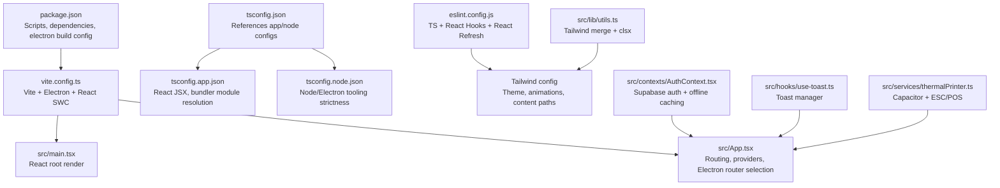
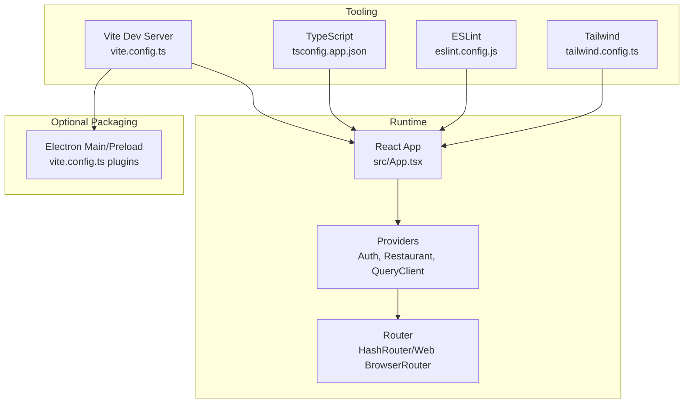
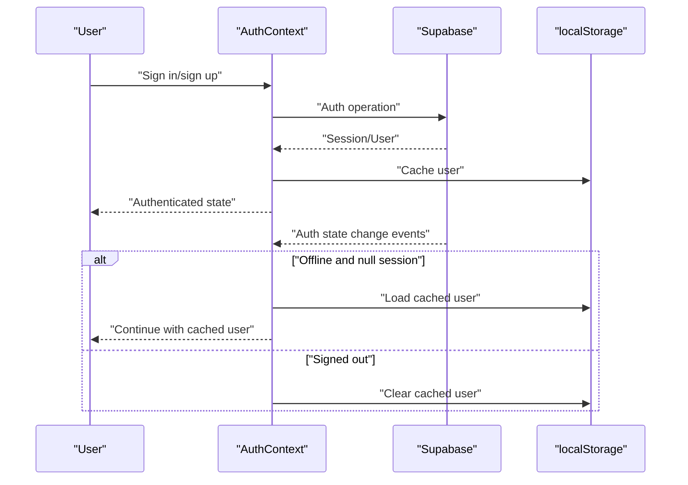
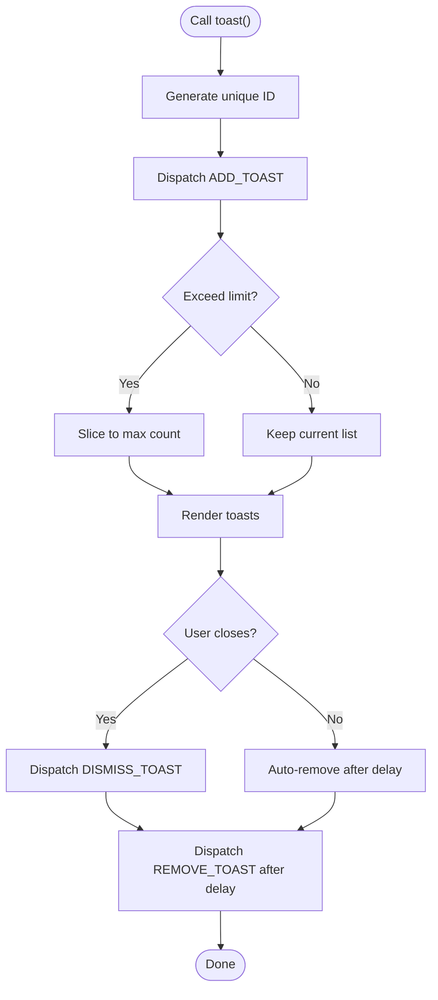
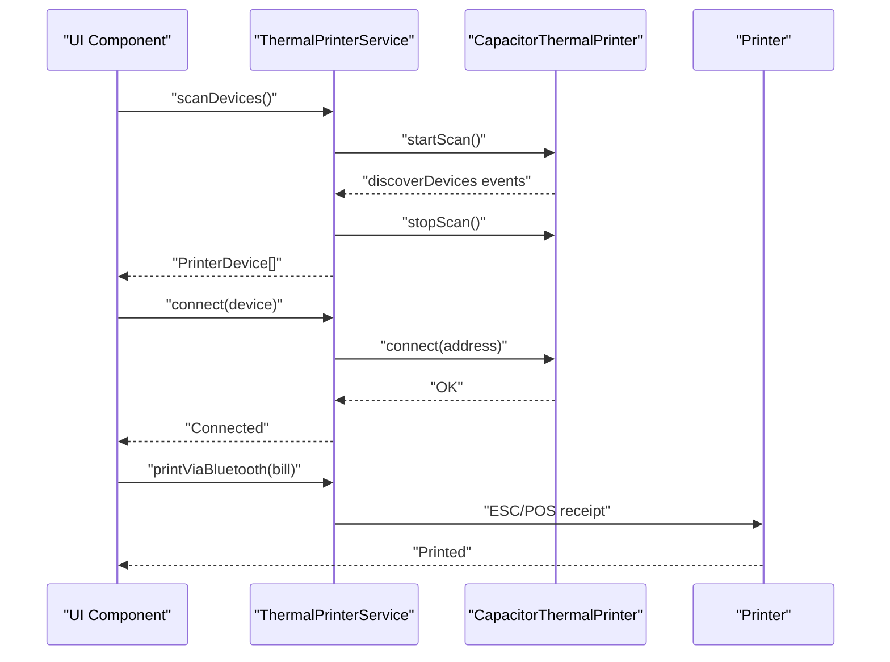
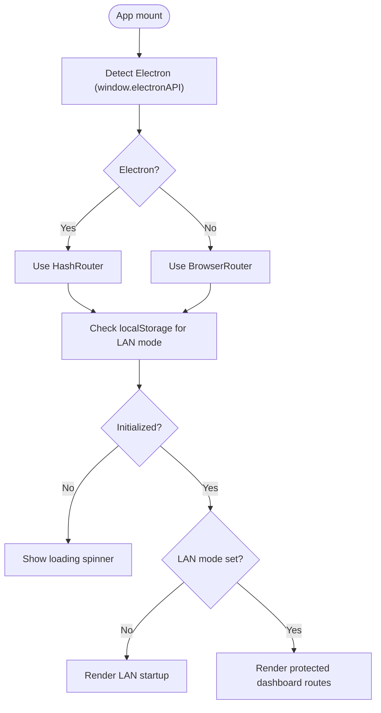
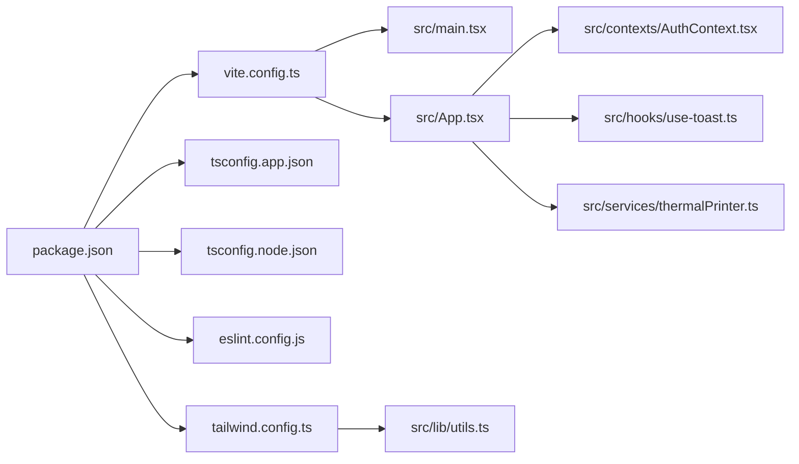

# Development & Testing

<cite>
**Referenced Files in This Document**
- [package.json](file://package.json)
- [vite.config.ts](file://vite.config.ts)
- [eslint.config.js](file://eslint.config.js)
- [tsconfig.json](file://tsconfig.json)
- [tsconfig.app.json](file://tsconfig.app.json)
- [tsconfig.node.json](file://tsconfig.node.json)
- [tailwind.config.ts](file://tailwind.config.ts)
- [src/main.tsx](file://src/main.tsx)
- [src/App.tsx](file://src/App.tsx)
- [src/lib/utils.ts](file://src/lib/utils.ts)
- [src/contexts/AuthContext.tsx](file://src/contexts/AuthContext.tsx)
- [src/hooks/use-toast.ts](file://src/hooks/use-toast.ts)
- [src/services/thermalPrinter.ts](file://src/services/thermalPrinter.ts)
</cite>

## Table of Contents
1. [Introduction](#introduction)
2. [Project Structure](#project-structure)
3. [Core Components](#core-components)
4. [Architecture Overview](#architecture-overview)
5. [Detailed Component Analysis](#detailed-component-analysis)
6. [Dependency Analysis](#dependency-analysis)
7. [Performance Considerations](#performance-considerations)
8. [Troubleshooting Guide](#troubleshooting-guide)
9. [Conclusion](#conclusion)
10. [Appendices](#appendices)

## Introduction
This document provides comprehensive development and testing guidance for TableFlow Pro. It covers the development workflow and tools, code quality and linting configuration, testing strategies and frameworks, debugging and troubleshooting approaches, build configuration, TypeScript compilation settings, and development environment optimization. It also explains testing methodologies across unit, integration, and end-to-end layers, along with practical examples for setup, debugging, and performance profiling. Continuous integration, code review processes, and quality assurance practices are addressed alongside development best practices, code organization patterns, and maintainability considerations.

## Project Structure
TableFlow Pro is a Vite-powered React application with optional Electron packaging and Capacitor-based thermal printer integration. The project uses TypeScript for type safety, Tailwind CSS for styling, ESLint for code quality, and Supabase for authentication and real-time features. Key configuration files define scripts, plugins, TypeScript compilation, linting rules, and build targets.

**Diagram sources**
- [package.json:1-131](file://package.json#L1-L131)
- [vite.config.ts:1-69](file://vite.config.ts#L1-L69)
- [src/main.tsx:1-6](file://src/main.tsx#L1-L6)
- [src/App.tsx:1-150](file://src/App.tsx#L1-L150)
- [tsconfig.json:1-24](file://tsconfig.json#L1-L24)
- [tsconfig.app.json:1-32](file://tsconfig.app.json#L1-L32)
- [tsconfig.node.json:1-23](file://tsconfig.node.json#L1-L23)
- [eslint.config.js:1-27](file://eslint.config.js#L1-L27)
- [tailwind.config.ts:1-114](file://tailwind.config.ts#L1-L114)
- [src/lib/utils.ts:1-7](file://src/lib/utils.ts#L1-L7)
- [src/contexts/AuthContext.tsx:1-141](file://src/contexts/AuthContext.tsx#L1-L141)
- [src/hooks/use-toast.ts:1-187](file://src/hooks/use-toast.ts#L1-L187)
- [src/services/thermalPrinter.ts:1-339](file://src/services/thermalPrinter.ts#L1-L339)

**Section sources**
- [package.json:1-131](file://package.json#L1-L131)
- [vite.config.ts:1-69](file://vite.config.ts#L1-L69)
- [tsconfig.json:1-24](file://tsconfig.json#L1-L24)
- [tsconfig.app.json:1-32](file://tsconfig.app.json#L1-L32)
- [tsconfig.node.json:1-23](file://tsconfig.node.json#L1-L23)
- [eslint.config.js:1-27](file://eslint.config.js#L1-L27)
- [tailwind.config.ts:1-114](file://tailwind.config.ts#L1-L114)
- [src/main.tsx:1-6](file://src/main.tsx#L1-L6)
- [src/App.tsx:1-150](file://src/App.tsx#L1-L150)
- [src/lib/utils.ts:1-7](file://src/lib/utils.ts#L1-L7)
- [src/contexts/AuthContext.tsx:1-141](file://src/contexts/AuthContext.tsx#L1-L141)
- [src/hooks/use-toast.ts:1-187](file://src/hooks/use-toast.ts#L1-L187)
- [src/services/thermalPrinter.ts:1-339](file://src/services/thermalPrinter.ts#L1-L339)

## Core Components
- Application bootstrap and routing: The React root renders the App component, which selects between HashRouter and BrowserRouter depending on Electron presence and sets up providers for authentication, restaurant context, and React Query.
- Authentication and offline support: AuthContext integrates with Supabase for auth state changes, session caching, and offline-aware behavior.
- Toast notifications: A centralized toast manager controls toasts with deduplication and timed dismissal.
- Thermal printer service: A Capacitor-based service handles Bluetooth device discovery, connection, and ESC/POS printing on native platforms, with a browser fallback for receipts.
- Styling utilities: Tailwind utilities are merged via a helper to simplify conditional class composition.

**Section sources**
- [src/main.tsx:1-6](file://src/main.tsx#L1-L6)
- [src/App.tsx:1-150](file://src/App.tsx#L1-L150)
- [src/contexts/AuthContext.tsx:1-141](file://src/contexts/AuthContext.tsx#L1-L141)
- [src/hooks/use-toast.ts:1-187](file://src/hooks/use-toast.ts#L1-L187)
- [src/services/thermalPrinter.ts:1-339](file://src/services/thermalPrinter.ts#L1-L339)
- [src/lib/utils.ts:1-7](file://src/lib/utils.ts#L1-L7)

## Architecture Overview
The runtime architecture combines a web UI with optional Electron packaging and native printer integration. Vite orchestrates development and builds, with plugins enabling React Fast Refresh and Electron support. TypeScript compiles application and Node/Electron tooling separately. ESLint enforces code quality. Tailwind generates styles from configured content paths.

**Diagram sources**
- [vite.config.ts:1-69](file://vite.config.ts#L1-L69)
- [tsconfig.app.json:1-32](file://tsconfig.app.json#L1-L32)
- [eslint.config.js:1-27](file://eslint.config.js#L1-L27)
- [tailwind.config.ts:1-114](file://tailwind.config.ts#L1-L114)
- [src/App.tsx:1-150](file://src/App.tsx#L1-L150)

## Detailed Component Analysis

### Authentication and Offline Context
The AuthContext manages Supabase authentication state, caches the current user, and coordinates offline behavior. It initializes or stops synchronization based on session availability and persists user data for offline sessions.

**Diagram sources**
- [src/contexts/AuthContext.tsx:1-141](file://src/contexts/AuthContext.tsx#L1-L141)

**Section sources**
- [src/contexts/AuthContext.tsx:1-141](file://src/contexts/AuthContext.tsx#L1-L141)

### Toast Management
The toast system maintains a capped list of toasts, assigns unique identifiers, and schedules removal. It exposes imperative and reactive APIs for adding, updating, dismissing, and removing toasts.

**Diagram sources**
- [src/hooks/use-toast.ts:1-187](file://src/hooks/use-toast.ts#L1-L187)

**Section sources**
- [src/hooks/use-toast.ts:1-187](file://src/hooks/use-toast.ts#L1-L187)

### Thermal Printer Service
The thermal printer service abstracts device scanning, connection, and printing across native and browser environments. It constructs ESC/POS receipts for native platforms and HTML print windows for browsers.

**Diagram sources**
- [src/services/thermalPrinter.ts:1-339](file://src/services/thermalPrinter.ts#L1-L339)

**Section sources**
- [src/services/thermalPrinter.ts:1-339](file://src/services/thermalPrinter.ts#L1-L339)

### Routing and Electron Mode Selection
The App component detects Electron mode and switches routers accordingly. It also manages LAN mode selection and initialization, rendering protected routes under a slug-based dashboard.

**Diagram sources**
- [src/App.tsx:1-150](file://src/App.tsx#L1-L150)

**Section sources**
- [src/App.tsx:1-150](file://src/App.tsx#L1-L150)

## Dependency Analysis
The project’s dependency graph centers around Vite tooling, React ecosystem, Supabase, React Query, and optional Electron packaging. TypeScript configurations separate application and Node/Electron concerns. ESLint and Tailwind configurations enforce code quality and styling consistency.

**Diagram sources**
- [package.json:1-131](file://package.json#L1-L131)
- [vite.config.ts:1-69](file://vite.config.ts#L1-L69)
- [tsconfig.app.json:1-32](file://tsconfig.app.json#L1-L32)
- [tsconfig.node.json:1-23](file://tsconfig.node.json#L1-L23)
- [eslint.config.js:1-27](file://eslint.config.js#L1-L27)
- [tailwind.config.ts:1-114](file://tailwind.config.ts#L1-L114)
- [src/main.tsx:1-6](file://src/main.tsx#L1-L6)
- [src/App.tsx:1-150](file://src/App.tsx#L1-L150)
- [src/contexts/AuthContext.tsx:1-141](file://src/contexts/AuthContext.tsx#L1-L141)
- [src/hooks/use-toast.ts:1-187](file://src/hooks/use-toast.ts#L1-L187)
- [src/services/thermalPrinter.ts:1-339](file://src/services/thermalPrinter.ts#L1-L339)
- [src/lib/utils.ts:1-7](file://src/lib/utils.ts#L1-L7)

**Section sources**
- [package.json:1-131](file://package.json#L1-L131)
- [vite.config.ts:1-69](file://vite.config.ts#L1-L69)
- [tsconfig.json:1-24](file://tsconfig.json#L1-L24)
- [tsconfig.app.json:1-32](file://tsconfig.app.json#L1-L32)
- [tsconfig.node.json:1-23](file://tsconfig.node.json#L1-L23)
- [eslint.config.js:1-27](file://eslint.config.js#L1-L27)
- [tailwind.config.ts:1-114](file://tailwind.config.ts#L1-L114)
- [src/main.tsx:1-6](file://src/main.tsx#L1-L6)
- [src/App.tsx:1-150](file://src/App.tsx#L1-L150)
- [src/contexts/AuthContext.tsx:1-141](file://src/contexts/AuthContext.tsx#L1-L141)
- [src/hooks/use-toast.ts:1-187](file://src/hooks/use-toast.ts#L1-L187)
- [src/services/thermalPrinter.ts:1-339](file://src/services/thermalPrinter.ts#L1-L339)
- [src/lib/utils.ts:1-7](file://src/lib/utils.ts#L1-L7)

## Performance Considerations
- Prefer lazy loading for heavy dashboard routes to reduce initial bundle size.
- Use React Query’s caching and background refetching strategically to minimize redundant network calls.
- Optimize Tailwind content globs to avoid unnecessary rebuilds during development.
- Enable production builds for profiling to capture accurate metrics.
- Use browser devtools performance panel and React DevTools Profiler for identifying bottlenecks.
- For Electron builds, monitor IPC overhead and preload script interactions.

## Troubleshooting Guide
Common issues and resolutions:
- Authentication state inconsistencies: Verify Supabase auth state callbacks and local storage caching logic. Confirm offline mode behavior and cached user persistence.
- Toast not dismissing: Ensure the toast lifecycle is respected and timeouts are scheduled correctly.
- Thermal printer failures: Validate platform checks, device connectivity, and ESC/POS command sequences. Test browser fallback printing via print windows.
- Router mismatch in Electron: Confirm Electron detection logic and router selection.
- ESLint errors: Run lint fixes and ensure plugin configurations align with TypeScript rules.
- Tailwind not generating styles: Verify content paths and class usage patterns.

**Section sources**
- [src/contexts/AuthContext.tsx:1-141](file://src/contexts/AuthContext.tsx#L1-L141)
- [src/hooks/use-toast.ts:1-187](file://src/hooks/use-toast.ts#L1-L187)
- [src/services/thermalPrinter.ts:1-339](file://src/services/thermalPrinter.ts#L1-L339)
- [src/App.tsx:1-150](file://src/App.tsx#L1-L150)
- [eslint.config.js:1-27](file://eslint.config.js#L1-L27)
- [tailwind.config.ts:1-114](file://tailwind.config.ts#L1-L114)

## Conclusion
TableFlow Pro leverages modern tooling and modular architecture to deliver a responsive, offline-aware, and optionally packaged desktop/mobile application. Adhering to the outlined development workflow, code quality standards, and testing strategies ensures maintainability and reliability across layers.

## Appendices

### Development Workflow and Tools
- Install dependencies and run the development server:
  - Install: [package.json:1-131](file://package.json#L1-L131)
  - Dev server: [vite.config.ts:1-69](file://vite.config.ts#L1-L69)
- Build for production:
  - Production build: [package.json:1-131](file://package.json#L1-L131)
  - Electron build: [package.json:1-131](file://package.json#L1-L131), [vite.config.ts:1-69](file://vite.config.ts#L1-L69)
- Preview built assets:
  - Preview: [package.json:1-131](file://package.json#L1-L131)

**Section sources**
- [package.json:1-131](file://package.json#L1-L131)
- [vite.config.ts:1-69](file://vite.config.ts#L1-L69)

### Code Quality and Linting
- ESLint configuration:
  - Rules and plugins: [eslint.config.js:1-27](file://eslint.config.js#L1-L27)
- TypeScript compilation:
  - Root references: [tsconfig.json:1-24](file://tsconfig.json#L1-L24)
  - App settings: [tsconfig.app.json:1-32](file://tsconfig.app.json#L1-L32)
  - Node/Electron tooling: [tsconfig.node.json:1-23](file://tsconfig.node.json#L1-L23)
- Styling:
  - Tailwind configuration: [tailwind.config.ts:1-114](file://tailwind.config.ts#L1-L114)
  - Utility helper: [src/lib/utils.ts:1-7](file://src/lib/utils.ts#L1-L7)

**Section sources**
- [eslint.config.js:1-27](file://eslint.config.js#L1-L27)
- [tsconfig.json:1-24](file://tsconfig.json#L1-L24)
- [tsconfig.app.json:1-32](file://tsconfig.app.json#L1-L32)
- [tsconfig.node.json:1-23](file://tsconfig.node.json#L1-L23)
- [tailwind.config.ts:1-114](file://tailwind.config.ts#L1-L114)
- [src/lib/utils.ts:1-7](file://src/lib/utils.ts#L1-L7)

### Testing Strategies and Frameworks
- Unit tests:
  - Use React Testing Library with Jest or Vitest for component and hook tests.
  - Example focus areas: AuthContext provider behavior, toast reducer actions, thermal printer method stubs.
- Integration tests:
  - Mock Supabase auth state changes and local storage to validate offline caching.
  - Validate router selection logic and protected route rendering.
- End-to-end tests:
  - Use Playwright or Cypress to automate user flows across dashboard routes, authentication, and LAN mode selection.
  - For Electron, test IPC interactions and preload script behavior.
- Test setup tips:
  - Configure test environment to match Vite aliases and TypeScript paths.
  - Snapshot Tailwind-generated classes cautiously due to dynamic variants.

[No sources needed since this section provides general guidance]

### Debugging and Profiling
- Browser debugging:
  - React DevTools, Redux DevTools (if used), and Network tab for API calls.
- Electron debugging:
  - Inspect main process logs and renderer debugging via devtools.
- Thermal printer debugging:
  - Log device discovery events, connection attempts, and ESC/POS write outcomes.
- Performance profiling:
  - Use Chrome DevTools Performance panel and React Profiler.
  - Measure render durations and network latency for dashboard routes.

[No sources needed since this section provides general guidance]

### Build Configuration and Optimization
- Vite configuration highlights:
  - Aliases and server settings: [vite.config.ts:1-69](file://vite.config.ts#L1-L69)
  - Electron plugin wiring and externals: [vite.config.ts:1-69](file://vite.config.ts#L1-L69)
- TypeScript optimization:
  - Strictness toggles and module resolution: [tsconfig.app.json:1-32](file://tsconfig.app.json#L1-L32), [tsconfig.node.json:1-23](file://tsconfig.node.json#L1-L23)
- Tailwind optimization:
  - Content globs and dark mode strategy: [tailwind.config.ts:1-114](file://tailwind.config.ts#L1-L114)

**Section sources**
- [vite.config.ts:1-69](file://vite.config.ts#L1-L69)
- [tsconfig.app.json:1-32](file://tsconfig.app.json#L1-L32)
- [tsconfig.node.json:1-23](file://tsconfig.node.json#L1-L23)
- [tailwind.config.ts:1-114](file://tailwind.config.ts#L1-L114)

### Continuous Integration and QA
- CI pipeline recommendations:
  - Lint and type-check on pull requests.
  - Run unit and integration tests across matrix of browsers and Node versions.
  - Build and artifact upload for Electron releases.
- Code review checklist:
  - Correctness of auth state transitions and offline behavior.
  - Accessibility and Tailwind class usage.
  - Security of API keys and environment variables.
- Quality gates:
  - Enforce ESLint pass, TypeScript no implicit any, and minimal test coverage thresholds.

[No sources needed since this section provides general guidance]

### Best Practices and Maintainability
- Code organization:
  - Feature-based grouping under src/components, pages, services, hooks, contexts.
  - Centralized utilities for styling and shared logic.
- Error handling:
  - Fail fast with clear messages for printer operations and auth flows.
- Documentation:
  - Inline comments for complex logic and cross-file dependencies.
- Refactoring:
  - Extract reusable hooks and services; keep components declarative.

[No sources needed since this section provides general guidance]