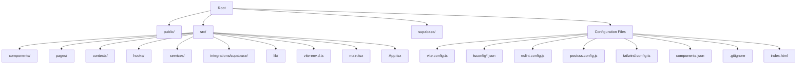
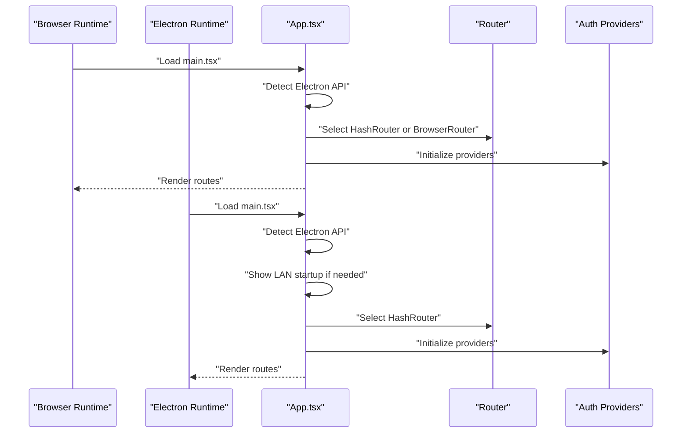
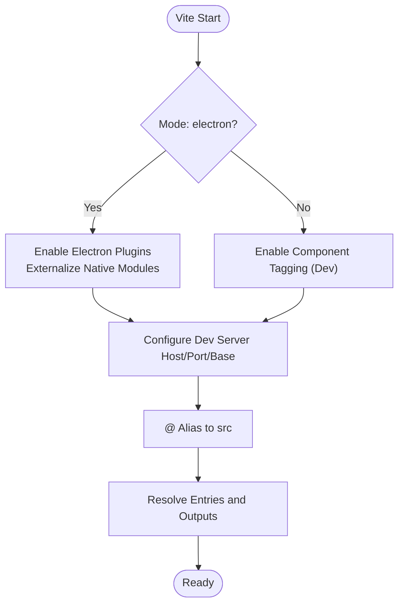
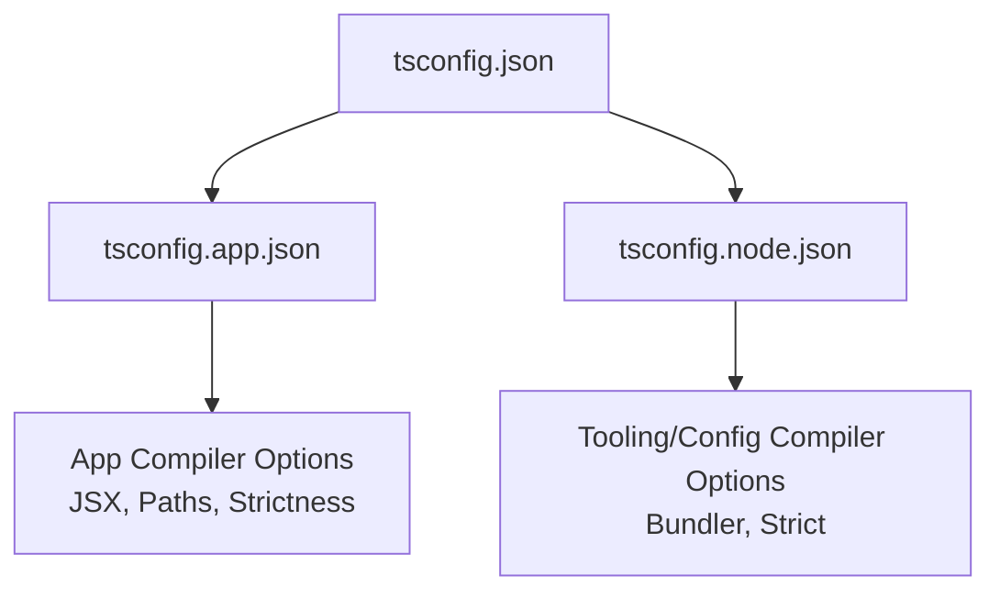
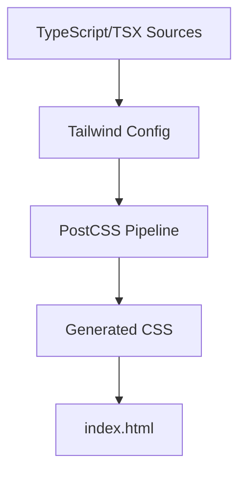
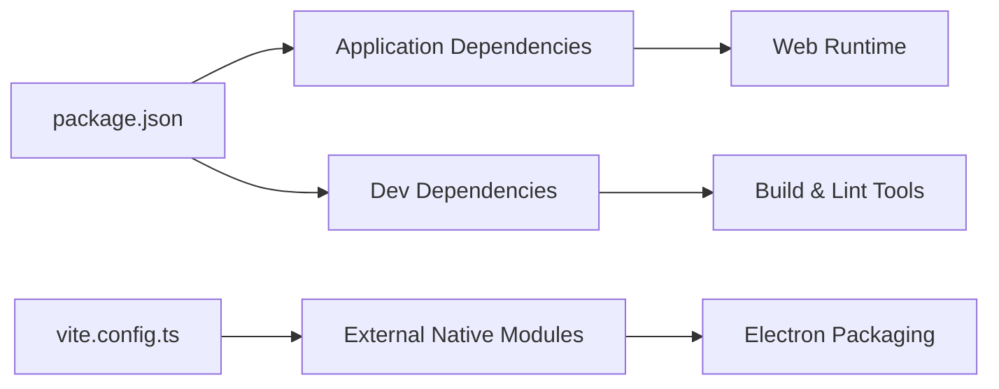

# Development Workflow

<cite>
**Referenced Files in This Document**
- [package.json](file://package.json)
- [vite.config.ts](file://vite.config.ts)
- [index.html](file://index.html)
- [src/main.tsx](file://src/main.tsx)
- [src/App.tsx](file://src/App.tsx)
- [tsconfig.json](file://tsconfig.json)
- [tsconfig.app.json](file://tsconfig.app.json)
- [tsconfig.node.json](file://tsconfig.node.json)
- [postcss.config.js](file://postcss.config.js)
- [tailwind.config.ts](file://tailwind.config.ts)
- [components.json](file://components.json)
- [eslint.config.js](file://eslint.config.js)
- [.gitignore](file://.gitignore)
- [README.md](file://README.md)
</cite>

## Table of Contents
1. [Introduction](#introduction)
2. [Project Structure](#project-structure)
3. [Core Components](#core-components)
4. [Architecture Overview](#architecture-overview)
5. [Detailed Component Analysis](#detailed-component-analysis)
6. [Dependency Analysis](#dependency-analysis)
7. [Performance Considerations](#performance-considerations)
8. [Troubleshooting Guide](#troubleshooting-guide)
9. [Conclusion](#conclusion)
10. [Appendices](#appendices)

## Introduction
This document describes the complete development workflow for TableFlow Pro, including environment setup, build system configuration, development server behavior, project structure, best practices, scripts and environment handling, optimization techniques, troubleshooting, and Git collaboration guidelines. The project uses Vite, TypeScript, React, Radix UI, shadcn/ui, and Tailwind CSS. It supports both web and Electron modes via Vite’s mode configuration and plugins.

## Project Structure
The repository follows a conventional frontend monorepo-like structure with a clear separation between source code, configuration, and assets:
- Public assets and HTML entry live under the root.
- Source code is organized under src with subfolders for components, pages, contexts, hooks, services, integrations, and shared utilities.
- Build-time configurations reside at the repository root (Vite, TypeScript, ESLint, PostCSS, Tailwind, component scaffolding).
- Supabase migration files are under supabase/migrations and configuration under supabase/config.toml.

**Diagram sources**
- [vite.config.ts:1-69](file://vite.config.ts#L1-L69)
- [tsconfig.json:1-24](file://tsconfig.json#L1-L24)
- [tsconfig.app.json:1-32](file://tsconfig.app.json#L1-L32)
- [tsconfig.node.json:1-23](file://tsconfig.node.json#L1-L23)
- [eslint.config.js:1-27](file://eslint.config.js#L1-L27)
- [postcss.config.js:1-7](file://postcss.config.js#L1-L7)
- [tailwind.config.ts:1-114](file://tailwind.config.ts#L1-L114)
- [components.json:1-21](file://components.json#L1-L21)
- [.gitignore:1-27](file://.gitignore#L1-L27)
- [index.html:1-25](file://index.html#L1-L25)

**Section sources**
- [README.md:1-13](file://README.md#L1-L13)
- [package.json:1-131](file://package.json#L1-L131)

## Core Components
- Vite configuration defines dev server host/port, plugin pipeline, aliases, and Electron-specific builds.
- TypeScript configurations split app and node contexts for strictness and bundler compatibility.
- Tailwind and PostCSS enable utility-first styling and automatic vendor prefixing.
- ESLint enforces TypeScript and React refresh rules with recommended defaults.
- Electron mode is enabled via Vite mode and plugins, with separate main/preload builds and externalized native modules.

Key behaviors:
- Development server binds to all interfaces and runs on port 8080.
- Aliasing @ to src simplifies imports across the codebase.
- Electron mode toggles plugins and externalizes native dependencies for packaging.

**Section sources**
- [vite.config.ts:9-68](file://vite.config.ts#L9-L68)
- [tsconfig.app.json:1-32](file://tsconfig.app.json#L1-L32)
- [tsconfig.node.json:1-23](file://tsconfig.node.json#L1-L23)
- [tailwind.config.ts:1-114](file://tailwind.config.ts#L1-L114)
- [postcss.config.js:1-7](file://postcss.config.js#L1-L7)
- [eslint.config.js:1-27](file://eslint.config.js#L1-L27)
- [package.json:7-16](file://package.json#L7-L16)

## Architecture Overview
The runtime architecture switches routing strategy depending on Electron presence and handles LAN mode initialization during startup.

**Diagram sources**
- [src/main.tsx:1-6](file://src/main.tsx#L1-L6)
- [src/App.tsx:32-34](file://src/App.tsx#L32-L34)
- [src/App.tsx:104-106](file://src/App.tsx#L104-L106)

**Section sources**
- [src/main.tsx:1-6](file://src/main.tsx#L1-L6)
- [src/App.tsx:32-34](file://src/App.tsx#L32-L34)
- [src/App.tsx:104-106](file://src/App.tsx#L104-L106)

## Detailed Component Analysis

### Vite Build System and Development Server
- Mode-driven configuration: Electron mode activates Electron plugins and externalizes native modules; development mode enables component tagging.
- Dev server: Host set to all interfaces, port 8080, with base path configured for relative asset resolution.
- Aliasing: @ resolves to src for concise imports.
- Electron builds: Separate entries for main and preload with dedicated output directories and externalized modules.

**Diagram sources**
- [vite.config.ts:9-68](file://vite.config.ts#L9-L68)

**Section sources**
- [vite.config.ts:9-68](file://vite.config.ts#L9-L68)

### TypeScript Configuration Strategy
- Root tsconfig orchestrates app and node configurations.
- App configuration targets ES2020, JSX transform, bundler module resolution, and path mapping.
- Node configuration targets ESNext/ES2023, strictness for Vite config, and bundler detection.

**Diagram sources**
- [tsconfig.json:1-24](file://tsconfig.json#L1-L24)
- [tsconfig.app.json:1-32](file://tsconfig.app.json#L1-L32)
- [tsconfig.node.json:1-23](file://tsconfig.node.json#L1-L23)

**Section sources**
- [tsconfig.json:1-24](file://tsconfig.json#L1-L24)
- [tsconfig.app.json:1-32](file://tsconfig.app.json#L1-L32)
- [tsconfig.node.json:1-23](file://tsconfig.node.json#L1-L23)

### Styling Pipeline (Tailwind and PostCSS)
- Tailwind scans components/pages/app sources and supports dark mode, custom shadows, gradients, and animations.
- PostCSS applies Tailwind and Autoprefixer automatically.

**Diagram sources**
- [tailwind.config.ts:1-114](file://tailwind.config.ts#L1-L114)
- [postcss.config.js:1-7](file://postcss.config.js#L1-L7)
- [index.html:1-25](file://index.html#L1-L25)

**Section sources**
- [tailwind.config.ts:1-114](file://tailwind.config.ts#L1-L114)
- [postcss.config.js:1-7](file://postcss.config.js#L1-L7)
- [index.html:1-25](file://index.html#L1-L25)

### ESLint and Formatting
- ESLint uses TypeScript + React Hooks + React Refresh recommended rules with a permissive rule for exported components.
- Global browser environment is configured for linting.

**Section sources**
- [eslint.config.js:1-27](file://eslint.config.js#L1-L27)

### Shadcn/ui Scaffolding
- Component scaffolding configuration maps aliases for components, utils, ui, lib, and hooks to simplify reuse and consistent styling.

**Section sources**
- [components.json:1-21](file://components.json#L1-L21)

### Electron Packaging and Scripts
- Scripts support dev, build, preview, and Electron packaging with postinstall rebuild for native modules.
- Electron mode is activated via Vite mode and plugins; native modules are externalized for packaging.

**Section sources**
- [package.json:7-16](file://package.json#L7-L16)
- [package.json:107-129](file://package.json#L107-L129)
- [vite.config.ts:21-60](file://vite.config.ts#L21-L60)

## Dependency Analysis
- Application dependencies include React, React Router, TanStack Query, shadcn/ui components, Supabase client, Tailwind-based UI libraries, and printer integration packages.
- Development dependencies include Vite, React SWC plugin, TypeScript, ESLint, Tailwind, Electron tooling, and builder utilities.
- Electron mode externalizes native modules to avoid bundling them into the renderer process.

**Diagram sources**
- [package.json:17-106](file://package.json#L17-L106)
- [vite.config.ts:32-34](file://vite.config.ts#L32-L34)

**Section sources**
- [package.json:17-106](file://package.json#L17-L106)
- [vite.config.ts:32-34](file://vite.config.ts#L32-L34)

## Performance Considerations
- Prefer lazy loading for heavy pages and dialogs to reduce initial bundle size.
- Keep Tailwind scanning scoped to relevant folders to minimize CSS generation overhead.
- Use React’s built-in memoization and query caching to avoid unnecessary re-renders and network requests.
- Disable development-only plugins in production builds (component tagging is already gated behind development mode).
- Optimize images and assets; leverage CDN for static assets if distributing Electron builds.

## Troubleshooting Guide
Common issues and resolutions:
- Port conflicts: Change dev server port in Vite configuration.
- Aliasing errors: Ensure @ alias resolves to src and path mappings are consistent across TS configs.
- Electron native module rebuild: Run the postinstall script to rebuild native dependencies.
- ESLint errors: Fix unused vars or export warnings as per ESLint configuration.
- Tailwind utilities missing: Verify Tailwind content globs and regenerate CSS after adding new components.

**Section sources**
- [vite.config.ts:14-17](file://vite.config.ts#L14-L17)
- [tsconfig.app.json:19-22](file://tsconfig.app.json#L19-L22)
- [package.json:13](file://package.json#L13)
- [eslint.config.js:20-24](file://eslint.config.js#L20-L24)
- [tailwind.config.ts:4](file://tailwind.config.ts#L4)

## Conclusion
TableFlow Pro provides a modern, efficient development workflow centered on Vite, TypeScript, and React. The configuration cleanly separates concerns between web and Electron modes, while Tailwind and ESLint streamline styling and code quality. Following the steps below ensures a smooth setup and productive development lifecycle.

## Appendices

### Environment Setup and Installation
- Prerequisites
  - Node.js LTS recommended (check engine requirements if present).
  - Git for version control and collaboration.
- Steps
  1. Clone the repository.
  2. Install dependencies using your preferred package manager (npm, pnpm, yarn).
  3. Run the development server in web mode or Electron mode as needed.
  4. Open http://localhost:8080 in your browser.

Notes:
- The project uses ES modules and modern Node APIs; ensure your environment supports them.
- For Windows/macOS/Linux parity, use the same Node.js version across platforms.

**Section sources**
- [package.json:1-131](file://package.json#L1-L131)

### Development Scripts
- dev: Start the Vite dev server in web mode.
- dev:electron: Start the Vite dev server in Electron mode.
- build: Build the web application.
- build:dev: Build with development mode.
- build:electron: Build for Electron and package with electron-builder.
- preview: Preview the production build locally.
- lint: Run ESLint across the project.
- postinstall: Rebuild native modules for Electron.

Environment variables:
- None explicitly defined in scripts; use .env files if needed alongside dotenv.

**Section sources**
- [package.json:7-16](file://package.json#L7-L16)

### Build Optimization Techniques
- Enable production mode for builds to optimize assets.
- Keep component libraries tree-shaken by importing only used components.
- Minimize global CSS and scope Tailwind scanning to relevant paths.
- Use React Suspense boundaries for data-heavy pages to improve perceived performance.

### Git Workflow, Branching, and Collaboration
- Branching model
  - Use feature branches for new work.
  - Rebase or merge develop/main regularly to keep up-to-date.
- Commit hygiene
  - Keep commits small and focused.
  - Write clear commit messages describing intent and impact.
- Pull requests
  - Open PRs for review; address comments promptly.
  - Squash or rebase before merging to maintain a clean history.
- Ignored artifacts
  - node_modules, dist, dist-electron, release, logs, and IDE files are ignored by default.

**Section sources**
- [.gitignore:1-27](file://.gitignore#L1-L27)