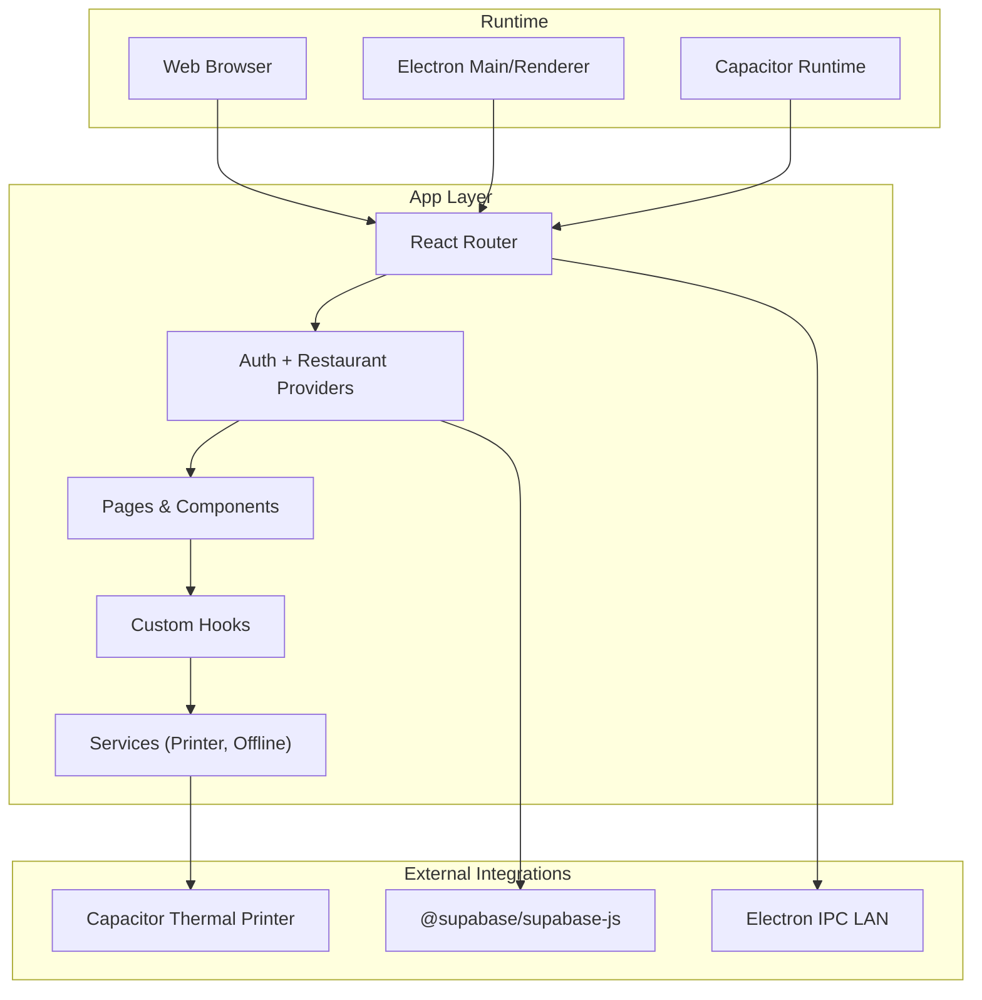
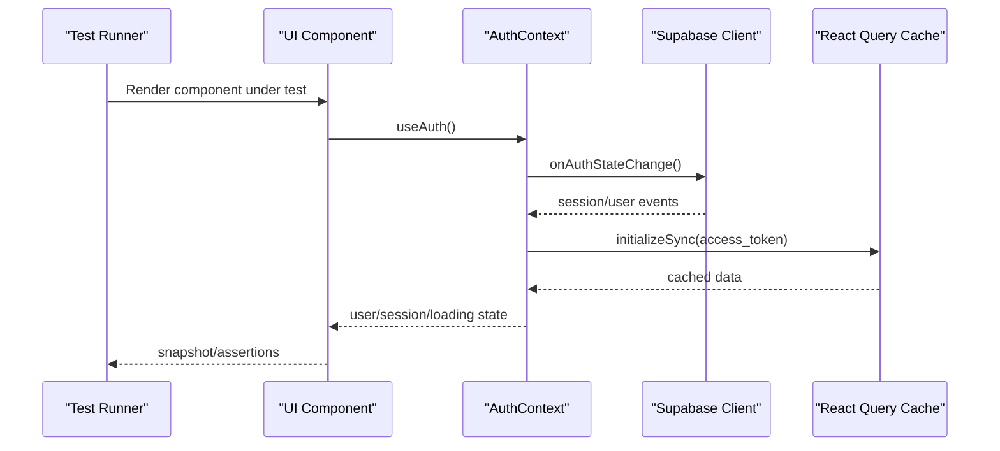
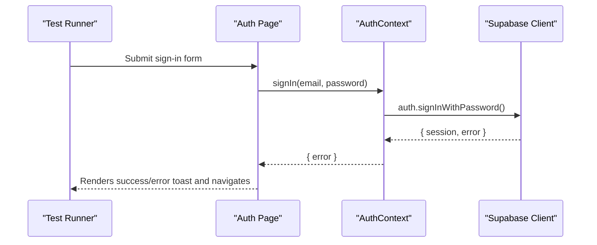
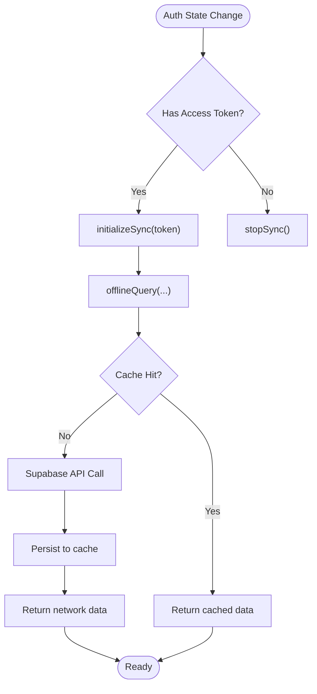
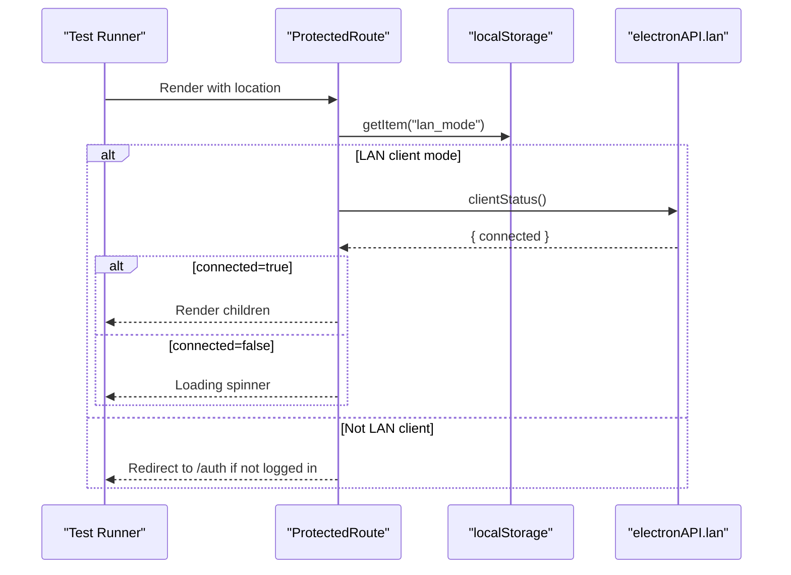
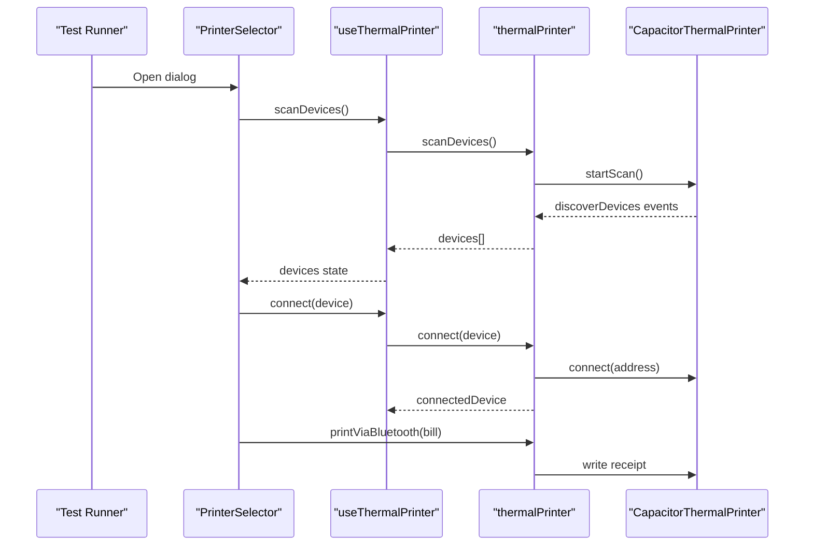
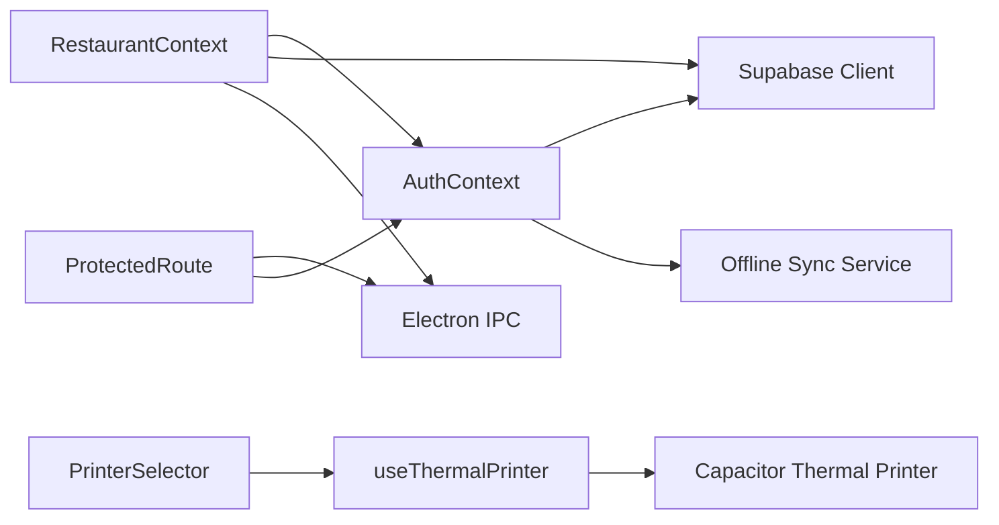

# Testing Strategies

<cite>
**Referenced Files in This Document**
- [package.json](file://package.json)
- [vite.config.ts](file://vite.config.ts)
- [src/main.tsx](file://src/main.tsx)
- [src/App.tsx](file://src/App.tsx)
- [src/pages/Auth.tsx](file://src/pages/Auth.tsx)
- [src/components/ProtectedRoute.tsx](file://src/components/ProtectedRoute.tsx)
- [src/components/PrinterSelector.tsx](file://src/components/PrinterSelector.tsx)
- [src/contexts/AuthContext.tsx](file://src/contexts/AuthContext.tsx)
- [src/contexts/RestaurantContext.tsx](file://src/contexts/RestaurantContext.tsx)
- [src/hooks/use-mobile.tsx](file://src/hooks/use-mobile.tsx)
- [src/hooks/use-toast.ts](file://src/hooks/use-toast.ts)
- [src/services/thermalPrinter.ts](file://src/services/thermalPrinter.ts)
- [src/integrations/supabase/client.ts](file://src/integrations/supabase/client.ts)
</cite>

## Table of Contents
1. [Introduction](#introduction)
2. [Project Structure](#project-structure)
3. [Core Components](#core-components)
4. [Architecture Overview](#architecture-overview)
5. [Detailed Component Analysis](#detailed-component-analysis)
6. [Dependency Analysis](#dependency-analysis)
7. [Performance Considerations](#performance-considerations)
8. [Troubleshooting Guide](#troubleshooting-guide)
9. [Conclusion](#conclusion)
10. [Appendices](#appendices)

## Introduction
This document defines a comprehensive testing strategy for TableFlow Pro. It outlines a testing pyramid approach covering unit tests, integration tests, and end-to-end testing. It documents the testing framework setup, recommended configuration, and testing patterns for UI components, hooks, services, and context providers. Practical examples are included for authentication flows, data synchronization, offline functionality, mobile and desktop printer integration, and LAN networking scenarios. Mocking strategies for Supabase, Electron IPC, and Capacitor plugins are provided, along with guidelines for coverage and CI workflows.

## Project Structure
TableFlow Pro is a Vite + React application with optional Electron packaging and Capacitor mobile support. The app uses React Router for routing, React Query for caching and background synchronization, Supabase for authentication and real-time data, and local storage for offline persistence. Key areas for testing include:
- Authentication and protected routes
- Context providers for auth and restaurant state
- Hooks for UI responsiveness and toast notifications
- Services for thermal printer integration
- Supabase client and offline synchronization
- LAN mode selection and Electron IPC integration

**Diagram sources**
- [src/App.tsx:32-34](file://src/App.tsx#L32-L34)
- [src/App.tsx:108-147](file://src/App.tsx#L108-L147)
- [src/contexts/AuthContext.tsx:39-132](file://src/contexts/AuthContext.tsx#L39-L132)
- [src/contexts/RestaurantContext.tsx:47-382](file://src/contexts/RestaurantContext.tsx#L47-L382)
- [src/services/thermalPrinter.ts:33-339](file://src/services/thermalPrinter.ts#L33-L339)
- [src/integrations/supabase/client.ts:11-17](file://src/integrations/supabase/client.ts#L11-L17)

**Section sources**
- [package.json:17-77](file://package.json#L17-L77)
- [vite.config.ts:9-68](file://vite.config.ts#L9-L68)
- [src/App.tsx:32-34](file://src/App.tsx#L32-L34)
- [src/App.tsx:108-147](file://src/App.tsx#L108-L147)

## Core Components
- Authentication Context: Provides auth state, sign-up/sign-in, and session lifecycle with offline-aware caching and sync initialization.
- Restaurant Context: Manages restaurant lists, roles, current selection, and offline fallbacks; integrates with LAN client mode.
- ProtectedRoute: Guards routes based on auth state or LAN client connectivity.
- Auth Page: Implements sign-in, sign-up, and password reset flows using Supabase.
- Thermal Printer Service: Handles device discovery, connection, disconnection, and printing on native platforms; falls back to browser printing on web.
- Supabase Client: Configured with localStorage-backed auth storage and automatic token refresh.
- Custom Hooks: Responsive detection and toast management.

Key testing targets:
- AuthContext behavior under online/offline conditions and session changes
- RestaurantContext data loading, caching, and LAN mode transitions
- ProtectedRoute navigation logic and LAN client checks
- Auth page form validation and error handling
- Printer service device scanning and printing flows
- Supabase client environment configuration and auth events

**Section sources**
- [src/contexts/AuthContext.tsx:28-141](file://src/contexts/AuthContext.tsx#L28-L141)
- [src/contexts/RestaurantContext.tsx:31-391](file://src/contexts/RestaurantContext.tsx#L31-L391)
- [src/components/ProtectedRoute.tsx:9-60](file://src/components/ProtectedRoute.tsx#L9-L60)
- [src/pages/Auth.tsx:13-224](file://src/pages/Auth.tsx#L13-L224)
- [src/services/thermalPrinter.ts:33-339](file://src/services/thermalPrinter.ts#L33-L339)
- [src/integrations/supabase/client.ts:11-17](file://src/integrations/supabase/client.ts#L11-L17)
- [src/hooks/use-mobile.tsx:5-19](file://src/hooks/use-mobile.tsx#L5-L19)
- [src/hooks/use-toast.ts:166-187](file://src/hooks/use-toast.ts#L166-L187)

## Architecture Overview
The testing strategy aligns with the runtime architecture:
- Web: React Router with BrowserRouter; React Query caching; Supabase auth/data; browser printing fallback.
- Desktop (Electron): Uses HashRouter; exposes electronAPI for LAN IPC; better-sqlite3 and express for LAN server.
- Mobile (Capacitor): Native thermal printer plugin; Bluetooth scanning and printing.

**Diagram sources**
- [src/contexts/AuthContext.tsx:44-97](file://src/contexts/AuthContext.tsx#L44-L97)
- [src/contexts/AuthContext.tsx:115-125](file://src/contexts/AuthContext.tsx#L115-L125)
- [src/App.tsx:108-147](file://src/App.tsx#L108-L147)

## Detailed Component Analysis

### Authentication Flow Testing
Patterns:
- Unit tests for AuthContext actions (sign-in, sign-up, sign-out) with mocked Supabase client.
- Integration tests for Auth page forms validating user inputs and toast messages.
- E2E tests verifying route protection and redirect behavior via ProtectedRoute.

**Diagram sources**
- [src/pages/Auth.tsx:25-39](file://src/pages/Auth.tsx#L25-L39)
- [src/contexts/AuthContext.tsx:115-121](file://src/contexts/AuthContext.tsx#L115-L121)

Practical examples:
- Snapshot test the Auth page rendering under different states (loading, login tab, signup tab).
- Mock Supabase auth responses to assert error handling and success flows.
- Use React Router testing utilities to assert navigation to dashboard after successful sign-in.

**Section sources**
- [src/pages/Auth.tsx:13-224](file://src/pages/Auth.tsx#L13-L224)
- [src/contexts/AuthContext.tsx:99-125](file://src/contexts/AuthContext.tsx#L99-L125)
- [src/components/ProtectedRoute.tsx:9-60](file://src/components/ProtectedRoute.tsx#L9-L60)

### Data Synchronization and Offline Functionality
Patterns:
- Unit tests for offline-aware queries and mutations using React Query helpers.
- Integration tests for RestaurantContext data loading and role inference.
- E2E tests simulating network failures and verifying localStorage fallbacks.

**Diagram sources**
- [src/contexts/AuthContext.tsx:66-70](file://src/contexts/AuthContext.tsx#L66-L70)
- [src/contexts/RestaurantContext.tsx:160-170](file://src/contexts/RestaurantContext.tsx#L160-L170)

Practical examples:
- Mock offline mode and assert RestaurantContext restores from localStorage.
- Simulate Supabase errors and verify fallback to cached data.
- Test role inference and current restaurant updates across refresh cycles.

**Section sources**
- [src/contexts/RestaurantContext.tsx:78-284](file://src/contexts/RestaurantContext.tsx#L78-L284)
- [src/contexts/AuthContext.tsx:44-97](file://src/contexts/AuthContext.tsx#L44-L97)

### Protected Routes and LAN Mode
Patterns:
- Unit tests for ProtectedRoute logic: auth-required vs LAN client bypass.
- Integration tests for LAN mode selection and Electron IPC calls.

**Diagram sources**
- [src/components/ProtectedRoute.tsx:16-38](file://src/components/ProtectedRoute.tsx#L16-L38)
- [src/App.tsx:42-53](file://src/App.tsx#L42-L53)

Practical examples:
- Mock electronAPI.lan and assert route behavior in LAN client mode.
- Verify redirect to auth when not signed in and not in LAN client mode.

**Section sources**
- [src/components/ProtectedRoute.tsx:9-60](file://src/components/ProtectedRoute.tsx#L9-L60)
- [src/App.tsx:42-53](file://src/App.tsx#L42-L53)

### Thermal Printer Integration (Mobile/Desktop)
Patterns:
- Unit tests for printer service methods (scan, connect, disconnect, print).
- Integration tests for PrinterSelector dialog and hook usage.
- E2E tests for device discovery and printing flows.

**Diagram sources**
- [src/components/PrinterSelector.tsx:16-59](file://src/components/PrinterSelector.tsx#L16-L59)
- [src/services/thermalPrinter.ts:41-101](file://src/services/thermalPrinter.ts#L41-L101)
- [src/services/thermalPrinter.ts:118-219](file://src/services/thermalPrinter.ts#L118-L219)

Practical examples:
- Mock CapacitorThermalPrinter APIs to simulate device discovery and printing.
- Assert toast notifications for success and failure paths.
- Test browser fallback printing for desktop environments.

**Section sources**
- [src/components/PrinterSelector.tsx:16-169](file://src/components/PrinterSelector.tsx#L16-L169)
- [src/services/thermalPrinter.ts:33-339](file://src/services/thermalPrinter.ts#L33-L339)

### UI Components, Hooks, and Services Testing Patterns
- UI Components: Use React Testing Library to render components with providers, mock environment-specific globals (Electron/Capacitor), and assert snapshots and interactions.
- Hooks: Test hook logic independently by rendering a test component and asserting state changes and side effects.
- Services: Mock external SDKs (Capacitor, Supabase) and assert method calls and error handling.
- Context Providers: Wrap tests with provider components to simulate global state and environment.

Recommended patterns:
- Provide minimal providers (e.g., AuthProvider, RestaurantProvider) around components under test.
- Mock window.electronAPI and Capacitor runtime to isolate platform-specific behavior.
- Use fake timers for toast timeouts and async flows.

**Section sources**
- [src/hooks/use-mobile.tsx:5-19](file://src/hooks/use-mobile.tsx#L5-L19)
- [src/hooks/use-toast.ts:166-187](file://src/hooks/use-toast.ts#L166-L187)
- [src/App.tsx:108-147](file://src/App.tsx#L108-L147)

## Dependency Analysis
Testing dependencies and coupling:
- AuthContext depends on Supabase client and offline sync service; tests should mock Supabase and sync service.
- RestaurantContext depends on AuthContext, Supabase, and Electron IPC; tests should mock all three.
- ProtectedRoute depends on localStorage and Electron IPC; tests should mock both.
- PrinterSelector depends on useThermalPrinter hook and Capacitor; tests should mock Capacitor APIs.
- Supabase client depends on environment variables; tests should set Vite env vars.

**Diagram sources**
- [src/contexts/AuthContext.tsx:3-4](file://src/contexts/AuthContext.tsx#L3-L4)
- [src/contexts/RestaurantContext.tsx:2-6](file://src/contexts/RestaurantContext.tsx#L2-L6)
- [src/components/ProtectedRoute.tsx:16-32](file://src/components/ProtectedRoute.tsx#L16-L32)
- [src/services/thermalPrinter.ts:1-2](file://src/services/thermalPrinter.ts#L1-L2)

**Section sources**
- [src/contexts/AuthContext.tsx:3-4](file://src/contexts/AuthContext.tsx#L3-L4)
- [src/contexts/RestaurantContext.tsx:2-6](file://src/contexts/RestaurantContext.tsx#L2-L6)
- [src/services/thermalPrinter.ts:1-2](file://src/services/thermalPrinter.ts#L1-L2)

## Performance Considerations
- Prefer unit tests for pure logic and deterministic behavior.
- Use fast mocks for external integrations to reduce flakiness and speed up CI.
- Limit heavy DOM rendering in unit tests; favor shallow rendering for UI components.
- Use fake timers to control async flows and timeouts in hooks and services.
- Cache React Query data in tests to avoid repeated network calls.

## Troubleshooting Guide
Common issues and resolutions:
- Supabase environment variables missing: Set VITE_SUPABASE_URL and VITE_SUPABASE_PUBLISHABLE_KEY in test environment.
- Electron IPC not available: Mock window.electronAPI in tests to simulate LAN client behavior.
- Capacitor APIs unavailable: Mock CapacitorThermalPrinter methods to simulate device scanning and printing.
- Toast timing: Use fake timers to advance toast timeouts deterministically.
- Router differences (web vs Electron): Configure router mode based on environment during tests.

**Section sources**
- [src/integrations/supabase/client.ts:5-6](file://src/integrations/supabase/client.ts#L5-L6)
- [src/App.tsx:32-34](file://src/App.tsx#L32-L34)
- [src/services/thermalPrinter.ts:35-38](file://src/services/thermalPrinter.ts#L35-L38)
- [src/hooks/use-toast.ts:55-69](file://src/hooks/use-toast.ts#L55-L69)

## Conclusion
A robust testing strategy for TableFlow Pro requires layered tests:
- Unit tests for hooks, services, and pure logic
- Integration tests for context providers and component interactions
- E2E tests for critical flows (auth, LAN mode, printing)

Mocking Supabase, Electron IPC, and Capacitor enables reliable, fast, and deterministic tests across web, desktop, and mobile environments.

## Appendices

### Testing Framework Setup and Configuration
- Framework: Jest (via Vite) with React Testing Library
- Environment: Vite test mode; configure environment variables for Supabase
- Router: Use HashRouter for Electron/E2E; BrowserRouter for web unit tests
- Providers: Wrap tests with AuthProvider and RestaurantProvider as needed
- Mocks: Use jest.mock for external SDKs and environment globals

Guidelines:
- Keep tests isolated; avoid shared mutable state
- Use beforeEach/afterEach to reset mocks and timers
- Prefer deterministic assertions over timing-sensitive waits

**Section sources**
- [package.json:79-106](file://package.json#L79-L106)
- [vite.config.ts:9-68](file://vite.config.ts#L9-L68)
- [src/App.tsx:32-34](file://src/App.tsx#L32-L34)

### Coverage Requirements
- Unit tests: Target 80%+ line and branch coverage for business logic
- Integration tests: Cover critical provider and component interactions
- E2E tests: Focus on high-value flows (auth, LAN, printing)
- Exclusions: Generated files, polyfills, and third-party libraries

### Continuous Integration Workflows
- Run unit and integration tests on pull requests
- Run E2E tests on push to main with a headless browser
- Cache node_modules and jest cache for faster builds
- Upload coverage reports to a coverage service

**Section sources**
- [package.json:7-16](file://package.json#L7-L16)