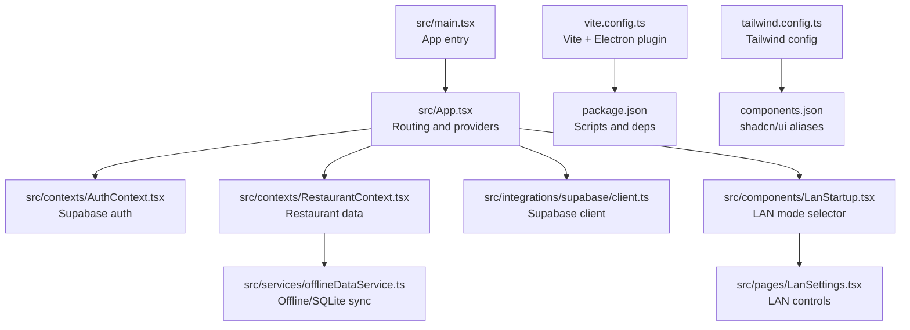
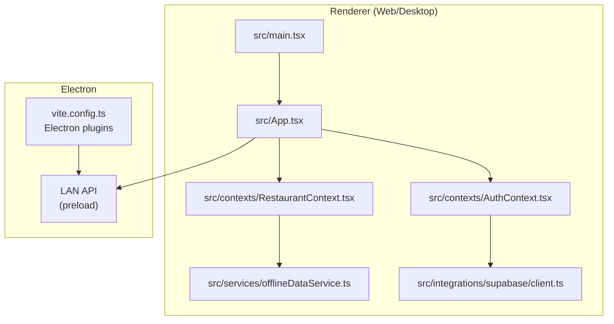
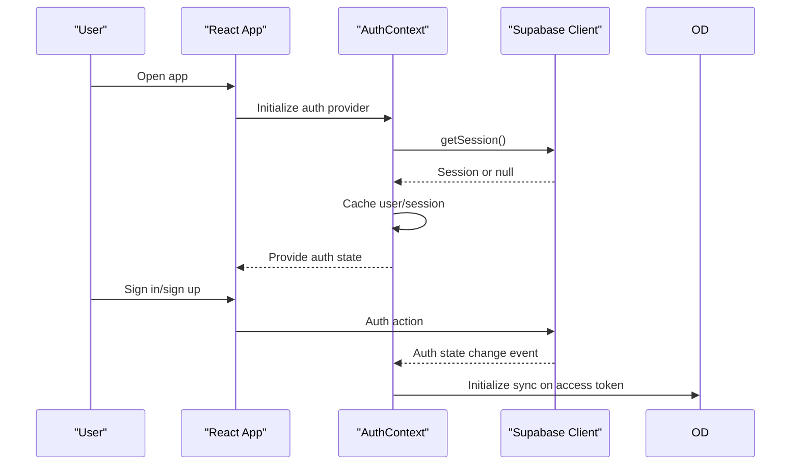
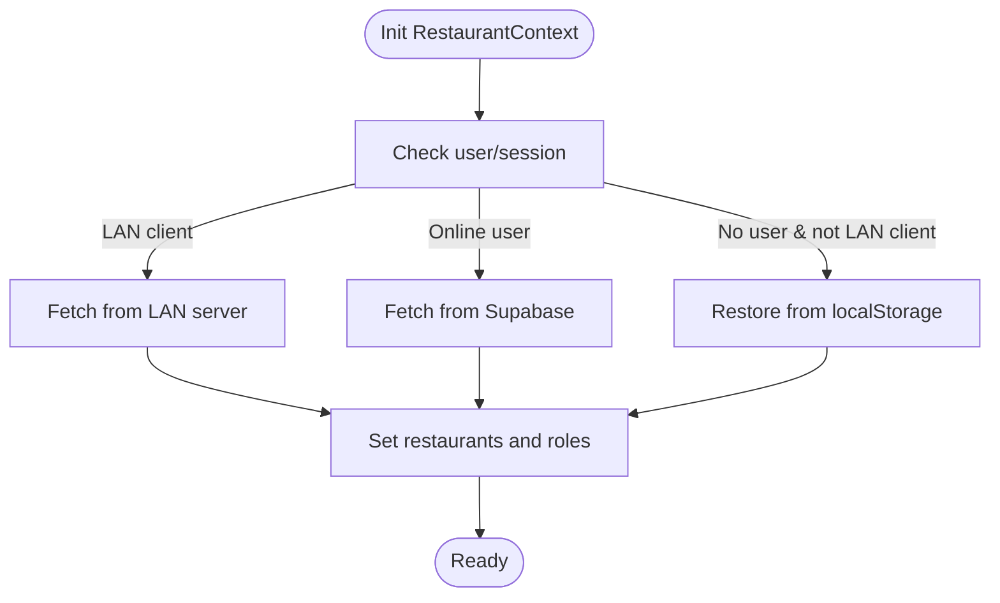
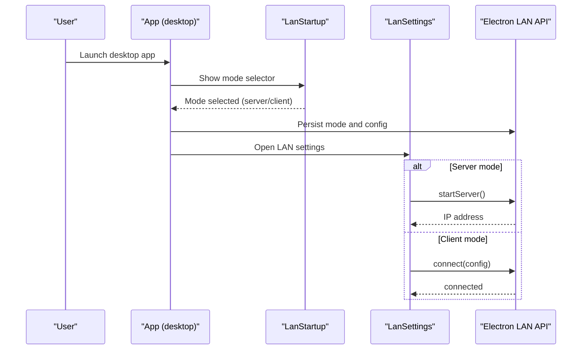
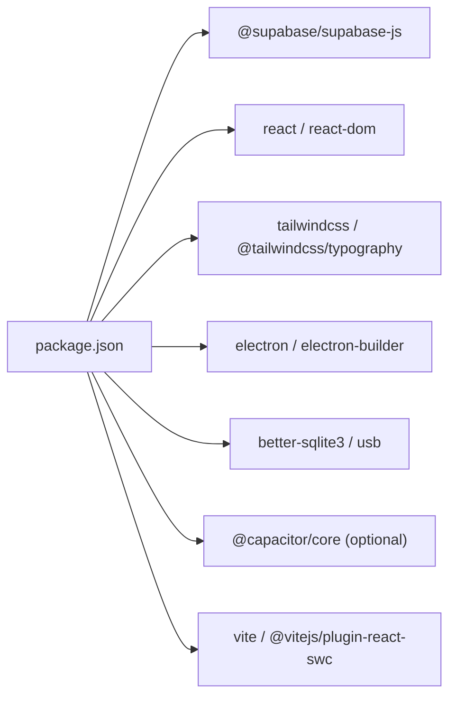

# Getting Started

<cite>
**Referenced Files in This Document**
- [README.md](file://README.md)
- [package.json](file://package.json)
- [vite.config.ts](file://vite.config.ts)
- [tailwind.config.ts](file://tailwind.config.ts)
- [tsconfig.json](file://tsconfig.json)
- [components.json](file://components.json)
- [src/main.tsx](file://src/main.tsx)
- [src/App.tsx](file://src/App.tsx)
- [src/contexts/AuthContext.tsx](file://src/contexts/AuthContext.tsx)
- [src/contexts/RestaurantContext.tsx](file://src/contexts/RestaurantContext.tsx)
- [src/integrations/supabase/client.ts](file://src/integrations/supabase/client.ts)
- [src/services/offlineDataService.ts](file://src/services/offlineDataService.ts)
- [src/components/LanStartup.tsx](file://src/components/LanStartup.tsx)
- [src/pages/LanSettings.tsx](file://src/pages/LanSettings.tsx)
- [supabase/config.toml](file://supabase/config.toml)
</cite>

## Table of Contents
1. [Introduction](#introduction)
2. [Project Structure](#project-structure)
3. [Prerequisites](#prerequisites)
4. [Installation](#installation)
5. [Build and Run](#build-and-run)
6. [First Run and Environment](#first-run-and-environment)
7. [Platform-Specific Notes](#platform-specific-notes)
8. [Architecture Overview](#architecture-overview)
9. [Detailed Component Analysis](#detailed-component-analysis)
10. [Dependency Analysis](#dependency-analysis)
11. [Performance Considerations](#performance-considerations)
12. [Troubleshooting Guide](#troubleshooting-guide)
13. [Conclusion](#conclusion)

## Introduction
This guide helps you set up and run TableFlow Pro (formerly RestroFlow) for web, desktop (Electron), and LAN modes. It covers prerequisites, installation, environment configuration, building, first-run setup, and troubleshooting. The project is a React application with TypeScript, Vite, Tailwind CSS, and Supabase for authentication and data. It supports:
- Web browser (SPA)
- Desktop app via Electron
- LAN networking for multi-device setups

## Project Structure
High-level structure and key configuration files:
- Application entry and routing live in src/main.tsx and src/App.tsx
- Authentication and restaurant contexts integrate with Supabase
- Offline data service manages SQLite-backed data for desktop
- LAN mode is available only in the desktop app and is initiated at startup

**Diagram sources**
- [src/main.tsx:1-6](file://src/main.tsx#L1-L6)
- [src/App.tsx:1-150](file://src/App.tsx#L1-L150)
- [src/contexts/AuthContext.tsx:1-141](file://src/contexts/AuthContext.tsx#L1-L141)
- [src/contexts/RestaurantContext.tsx:1-391](file://src/contexts/RestaurantContext.tsx#L1-L391)
- [src/services/offlineDataService.ts:1-769](file://src/services/offlineDataService.ts#L1-L769)
- [src/integrations/supabase/client.ts:1-17](file://src/integrations/supabase/client.ts#L1-L17)
- [src/components/LanStartup.tsx:1-260](file://src/components/LanStartup.tsx#L1-L260)
- [src/pages/LanSettings.tsx:1-533](file://src/pages/LanSettings.tsx#L1-L533)
- [vite.config.ts:1-69](file://vite.config.ts#L1-L69)
- [package.json:1-131](file://package.json#L1-L131)
- [tailwind.config.ts:1-114](file://tailwind.config.ts#L1-L114)
- [components.json:1-21](file://components.json#L1-L21)

**Section sources**
- [README.md:1-13](file://README.md#L1-L13)
- [package.json:1-131](file://package.json#L1-L131)
- [vite.config.ts:1-69](file://vite.config.ts#L1-L69)
- [tailwind.config.ts:1-114](file://tailwind.config.ts#L1-L114)
- [tsconfig.json:1-24](file://tsconfig.json#L1-L24)
- [components.json:1-21](file://components.json#L1-L21)

## Prerequisites
- Operating systems
  - Windows, macOS, or Linux for desktop and web
- Node.js and package manager
  - Node.js 18+ recommended
  - Use npm or Bun for dependency management
- Desktop development (Electron)
  - Python 3.x and a compiler toolchain for native module rebuilds
  - Windows: Visual Studio Build Tools or Visual Studio Community
  - macOS: Xcode Command Line Tools
  - Linux: GCC/G++ and pkg-config
- Optional: USB printer support (requires system permissions and drivers)
- Optional: Capacitor (mobile) — see Mobile section

**Section sources**
- [package.json:17-77](file://package.json#L17-L77)
- [package.json:79-106](file://package.json#L79-L106)
- [vite.config.ts:22-35](file://vite.config.ts#L22-L35)

## Installation
1. Install dependencies
   - npm: npm ci
   - bun: bun install
2. Post-install (desktop)
   - Electron rebuild runs automatically after install to prepare native modules (better-sqlite3, usb)
3. Verify setup
   - Run dev server (web): npm run dev or bun run dev
   - Run desktop (Electron): npm run dev:electron or bun run dev:electron

Notes:
- The project uses Vite for fast builds and hot reload
- Electron mode is enabled via a Vite mode flag

**Section sources**
- [package.json:7-16](file://package.json#L7-L16)
- [package.json:13-13](file://package.json#L13-L13)
- [vite.config.ts:9-10](file://vite.config.ts#L9-L10)
- [vite.config.ts:21-60](file://vite.config.ts#L21-L60)

## Build and Run
Supported modes and commands:
- Web (browser SPA)
  - Development: npm run dev
  - Production build: npm run build
- Desktop (Electron)
  - Development: npm run dev:electron
  - Production build: npm run build:electron
- Preview production locally: npm run preview

Build configuration:
- Vite mode controls plugins and Electron packaging
- Aliases and Tailwind scanning paths are configured centrally

**Section sources**
- [package.json:7-16](file://package.json#L7-L16)
- [vite.config.ts:9-68](file://vite.config.ts#L9-L68)
- [tailwind.config.ts:4-5](file://tailwind.config.ts#L4-L5)

## First Run and Environment
1. Environment variables
   - Supabase client requires runtime environment variables (Vite injects them at build time)
   - Variables used by the app:
     - VITE_SUPABASE_URL
     - VITE_SUPABASE_PUBLISHABLE_KEY
   - Set these in your environment or via a .env file recognized by Vite
2. Initial project verification
   - Start dev server and confirm the app loads
   - Sign in or sign up via Supabase
   - Create a restaurant to populate data contexts
3. LAN mode (desktop only)
   - On first launch in desktop mode, the app shows a LAN mode selector
   - Choose “Main PC” to host the database or “Second PC” to connect to another
   - Configure device name and role (billing, kitchen, manager)

Verification checklist:
- Web: Auth works, dashboard routes render
- Desktop: Electron APIs available, LAN controls visible
- LAN: Server shows IP, clients can connect

**Section sources**
- [src/integrations/supabase/client.ts:5-6](file://src/integrations/supabase/client.ts#L5-L6)
- [src/App.tsx:32-34](file://src/App.tsx#L32-L34)
- [src/App.tsx:91-106](file://src/App.tsx#L91-L106)
- [src/components/LanStartup.tsx:23-71](file://src/components/LanStartup.tsx#L23-L71)
- [src/pages/LanSettings.tsx:31-92](file://src/pages/LanSettings.tsx#L31-L92)

## Platform-Specific Notes
- Web
  - Uses BrowserRouter for routing
  - Requires Supabase credentials at runtime
- Desktop (Electron)
  - Uses HashRouter for file:// protocol compatibility
  - Exposes Electron APIs to renderer via preload
  - Supports offline data via SQLite and optional LAN server
- LAN
  - Available only in desktop app
  - Server runs a local database and broadcasts updates
  - Clients connect automatically and sync data
- Mobile (Capacitor)
  - Capacitor packages are present in dependencies
  - Additional Capacitor configuration and platform setup would be required to enable mobile builds

**Section sources**
- [src/App.tsx:32-34](file://src/App.tsx#L32-L34)
- [vite.config.ts:21-59](file://vite.config.ts#L21-L59)
- [src/components/LanStartup.tsx:1-260](file://src/components/LanStartup.tsx#L1-L260)
- [src/pages/LanSettings.tsx:1-533](file://src/pages/LanSettings.tsx#L1-L533)
- [package.json:18-18](file://package.json#L18-L18)

## Architecture Overview
High-level runtime architecture:
- Entry point initializes React and providers
- Auth provider manages Supabase sessions and offline caching
- Restaurant provider resolves current restaurant and roles
- Offline data service coordinates SQLite and optional cloud sync
- LAN mode integrates with Electron’s LAN API for multi-device sharing

**Diagram sources**
- [src/main.tsx:1-6](file://src/main.tsx#L1-L6)
- [src/App.tsx:1-150](file://src/App.tsx#L1-L150)
- [src/contexts/AuthContext.tsx:1-141](file://src/contexts/AuthContext.tsx#L1-L141)
- [src/contexts/RestaurantContext.tsx:1-391](file://src/contexts/RestaurantContext.tsx#L1-L391)
- [src/services/offlineDataService.ts:1-769](file://src/services/offlineDataService.ts#L1-L769)
- [src/integrations/supabase/client.ts:1-17](file://src/integrations/supabase/client.ts#L1-L17)
- [vite.config.ts:1-69](file://vite.config.ts#L1-L69)

## Detailed Component Analysis

### Authentication Flow

**Diagram sources**
- [src/contexts/AuthContext.tsx:39-97](file://src/contexts/AuthContext.tsx#L39-L97)
- [src/integrations/supabase/client.ts:11-17](file://src/integrations/supabase/client.ts#L11-L17)
- [src/services/offlineDataService.ts:351-360](file://src/services/offlineDataService.ts#L351-L360)

**Section sources**
- [src/contexts/AuthContext.tsx:1-141](file://src/contexts/AuthContext.tsx#L1-L141)
- [src/integrations/supabase/client.ts:1-17](file://src/integrations/supabase/client.ts#L1-L17)

### Restaurant Context and Offline Data

**Diagram sources**
- [src/contexts/RestaurantContext.tsx:47-300](file://src/contexts/RestaurantContext.tsx#L47-L300)

**Section sources**
- [src/contexts/RestaurantContext.tsx:1-391](file://src/contexts/RestaurantContext.tsx#L1-L391)

### LAN Startup and Settings

**Diagram sources**
- [src/components/LanStartup.tsx:23-71](file://src/components/LanStartup.tsx#L23-L71)
- [src/pages/LanSettings.tsx:97-229](file://src/pages/LanSettings.tsx#L97-L229)
- [src/App.tsx:56-89](file://src/App.tsx#L56-L89)

**Section sources**
- [src/components/LanStartup.tsx:1-260](file://src/components/LanStartup.tsx#L1-L260)
- [src/pages/LanSettings.tsx:1-533](file://src/pages/LanSettings.tsx#L1-L533)
- [src/App.tsx:32-106](file://src/App.tsx#L32-L106)

## Dependency Analysis
Key runtime dependencies and their roles:
- Supabase client for auth and data
- React and React Router for UI and routing
- Tailwind CSS and shadcn/ui for styling
- Electron and related plugins for desktop packaging
- Offline data service with SQLite for desktop and LAN

**Diagram sources**
- [package.json:17-77](file://package.json#L17-L77)
- [package.json:79-106](file://package.json#L79-L106)

**Section sources**
- [package.json:1-131](file://package.json#L1-L131)

## Performance Considerations
- Prefer web mode for quick iteration; use desktop mode for offline and LAN scenarios
- Keep Supabase queries scoped and use offline data service to reduce network calls
- Avoid unnecessary re-renders by leveraging context and query client state
- For LAN setups, ensure stable network connectivity and minimal latency between devices

## Troubleshooting Guide
Common setup and runtime issues:
- Missing environment variables
  - Symptom: Auth fails or blank dashboard
  - Fix: Provide VITE_SUPABASE_URL and VITE_SUPABASE_PUBLISHABLE_KEY
- Electron rebuild failures
  - Symptom: Native module errors during dev or build
  - Fix: Ensure Python and compiler toolchain are installed; re-run install
- LAN mode not available
  - Symptom: LAN settings hidden
  - Fix: Run in desktop mode; verify Electron APIs are present
- Cannot connect to LAN server
  - Symptom: Connection errors or timeouts
  - Fix: Confirm server is running and IP is correct; check firewall and network
- SQLite not available in desktop
  - Symptom: Offline data operations fail
  - Fix: Ensure Electron APIs are loaded and SQLite is initialized

Verification steps:
- Confirm dev server runs without errors
- Test auth sign-in and restaurant creation
- In desktop, open LAN settings and verify server/client controls

**Section sources**
- [src/integrations/supabase/client.ts:5-6](file://src/integrations/supabase/client.ts#L5-L6)
- [package.json:13-13](file://package.json#L13-L13)
- [src/pages/LanSettings.tsx:120-157](file://src/pages/LanSettings.tsx#L120-L157)
- [src/services/offlineDataService.ts:351-360](file://src/services/offlineDataService.ts#L351-L360)

## Conclusion
You now have the essentials to set up TableFlow Pro for web, desktop (Electron), and LAN environments. Use the provided scripts and environment variables to run and build the app, configure LAN for multi-device setups, and leverage offline data capabilities in desktop mode. For mobile targets, Capacitor is present in dependencies and can be integrated with additional platform configuration.