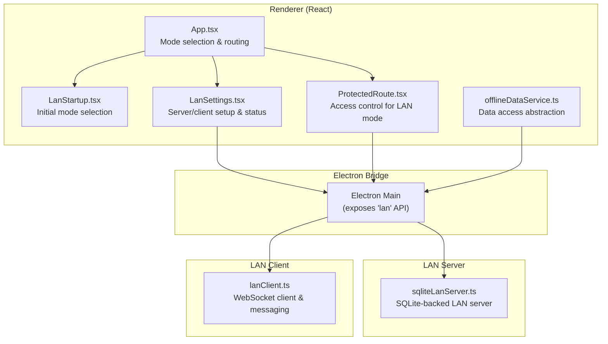
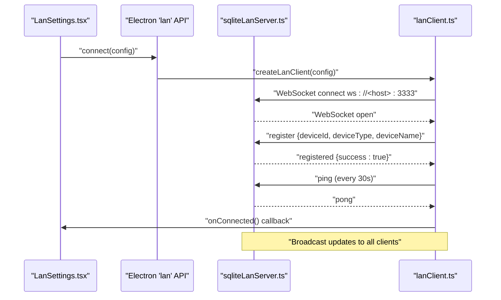
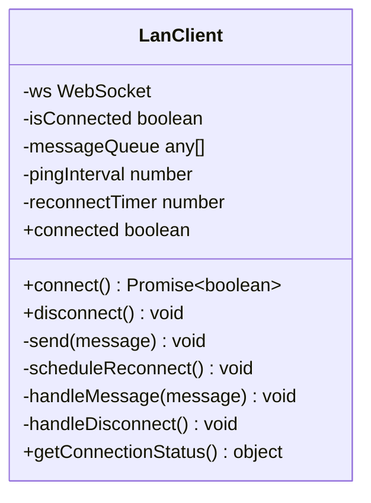
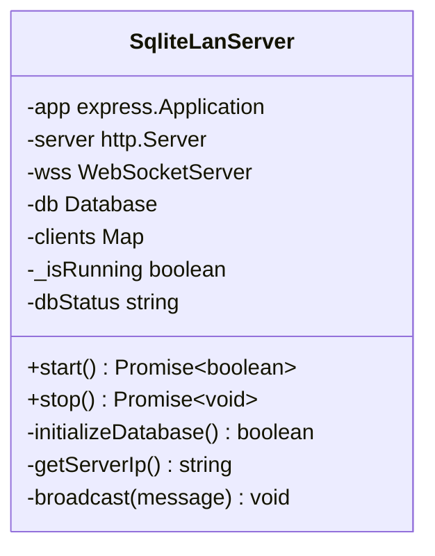
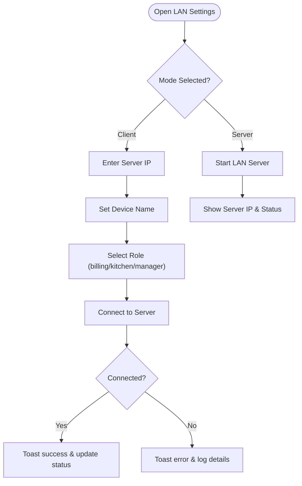
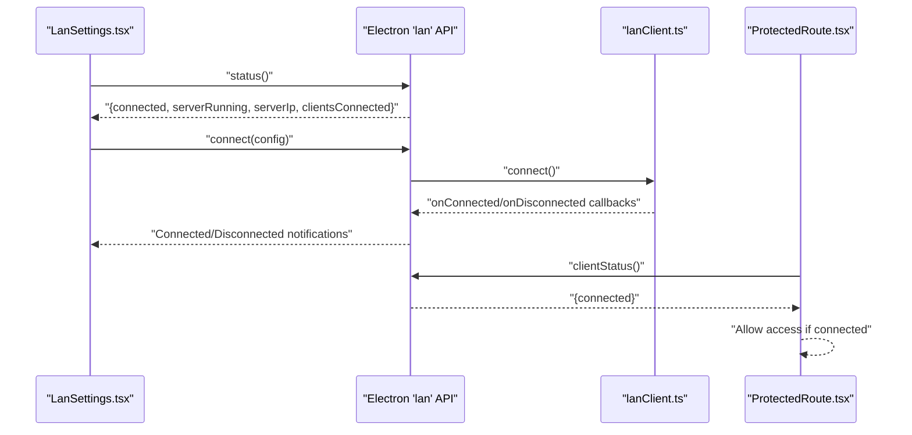
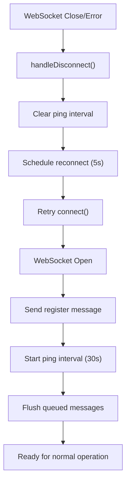
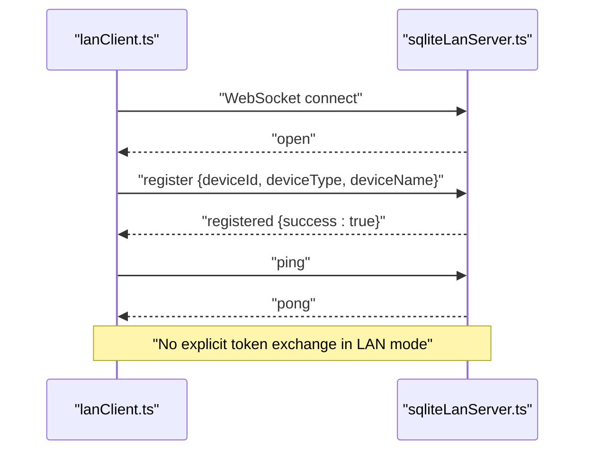
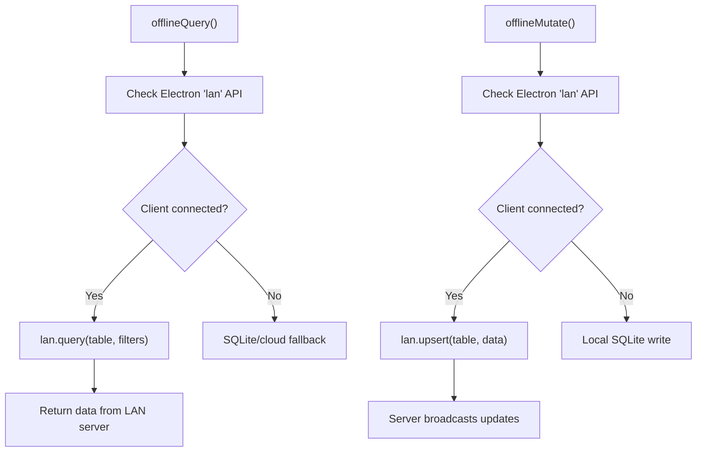
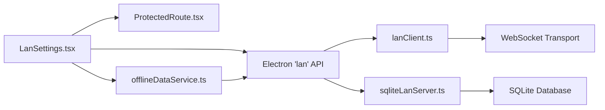

# LAN Client Connection Management

<cite>
**Referenced Files in This Document**
- [App.tsx](file://src/App.tsx)
- [LanSettings.tsx](file://src/pages/LanSettings.tsx)
- [LanStartup.tsx](file://src/components/LanStartup.tsx)
- [ProtectedRoute.tsx](file://src/components/ProtectedRoute.tsx)
- [offlineDataService.ts](file://src/services/offlineDataService.ts)
- [sqliteLanServer.ts](file://electron/services/sqliteLanServer.ts)
- [lanClient.ts](file://electron/services/lanClient.ts)
</cite>

## Table of Contents
1. [Introduction](#introduction)
2. [Project Structure](#project-structure)
3. [Core Components](#core-components)
4. [Architecture Overview](#architecture-overview)
5. [Detailed Component Analysis](#detailed-component-analysis)
6. [Dependency Analysis](#dependency-analysis)
7. [Performance Considerations](#performance-considerations)
8. [Troubleshooting Guide](#troubleshooting-guide)
9. [Conclusion](#conclusion)

## Introduction
This document explains how TableFlow Pro manages LAN client connections in the desktop application. It covers client-side connection establishment, server discovery, device registration, configuration workflows, connection state management, automatic reconnection, network failure recovery, device management, status monitoring, disconnection procedures, the client-server handshake protocol, authentication mechanisms, and data synchronization coordination. It also provides troubleshooting guidance and performance optimization recommendations tailored to real-time data synchronization over LAN.

## Project Structure
The LAN connectivity spans three layers:
- Frontend UI and routing: React components manage mode selection, configuration, and status display.
- Electron bridge: The Electron main process exposes LAN APIs to the renderer for server lifecycle and client operations.
- LAN server and client: A WebSocket-based LAN server runs on the main PC, while client devices connect and synchronize data.

**Diagram sources**
- [App.tsx:36-89](file://src/App.tsx#L36-L89)
- [LanStartup.tsx:23-66](file://src/components/LanStartup.tsx#L23-L66)
- [LanSettings.tsx:31-92](file://src/pages/LanSettings.tsx#L31-L92)
- [ProtectedRoute.tsx:9-38](file://src/components/ProtectedRoute.tsx#L9-L38)
- [offlineDataService.ts:151-250](file://src/services/offlineDataService.ts#L151-L250)
- [sqliteLanServer.ts:23-492](file://electron/services/sqliteLanServer.ts#L23-L492)
- [lanClient.ts:78-363](file://electron/services/lanClient.ts#L78-L363)

**Section sources**
- [App.tsx:36-89](file://src/App.tsx#L36-L89)
- [LanStartup.tsx:23-66](file://src/components/LanStartup.tsx#L23-L66)
- [LanSettings.tsx:31-92](file://src/pages/LanSettings.tsx#L31-L92)
- [ProtectedRoute.tsx:9-38](file://src/components/ProtectedRoute.tsx#L9-L38)
- [offlineDataService.ts:151-250](file://src/services/offlineDataService.ts#L151-L250)
- [sqliteLanServer.ts:23-492](file://electron/services/sqliteLanServer.ts#L23-L492)
- [lanClient.ts:78-363](file://electron/services/lanClient.ts#L78-L363)

## Core Components
- LAN Startup and Mode Selection: Guides users to choose server or client mode and collects device configuration (role, name).
- LAN Settings Page: Manages server lifecycle (start/stop), client connection/disconnection, and displays connection status and server IP.
- Protected Route: Allows LAN clients to bypass authentication when connected to a LAN server.
- Offline Data Service: Provides a unified data access layer that routes queries/mutations to LAN server when connected, falling back to local storage or cloud depending on mode.
- LAN Server: Runs on the main PC, serves WebSocket connections, maintains client registry, and broadcasts updates.
- LAN Client: Establishes WebSocket connection, registers device, handles ping/pong, queues messages until connected, and manages reconnection.

**Section sources**
- [LanStartup.tsx:23-66](file://src/components/LanStartup.tsx#L23-L66)
- [LanSettings.tsx:174-229](file://src/pages/LanSettings.tsx#L174-L229)
- [ProtectedRoute.tsx:9-38](file://src/components/ProtectedRoute.tsx#L9-L38)
- [offlineDataService.ts:151-250](file://src/services/offlineDataService.ts#L151-L250)
- [sqliteLanServer.ts:196-229](file://electron/services/sqliteLanServer.ts#L196-L229)
- [lanClient.ts:78-144](file://electron/services/lanClient.ts#L78-L144)

## Architecture Overview
The LAN architecture uses a client-server model with a WebSocket transport. The server runs on the main PC and the client runs on secondary PCs. The client connects to the server, registers itself, and receives real-time updates. The system supports automatic reconnection and graceful disconnection handling.

**Diagram sources**
- [LanSettings.tsx:174-214](file://src/pages/LanSettings.tsx#L174-L214)
- [sqliteLanServer.ts:196-205](file://electron/services/sqliteLanServer.ts#L196-L205)
- [lanClient.ts:78-118](file://electron/services/lanClient.ts#L78-L118)

## Detailed Component Analysis

### LAN Client Implementation
The LAN client manages connection lifecycle, device registration, message queuing, and automatic reconnection.

**Diagram sources**
- [lanClient.ts:78-363](file://electron/services/lanClient.ts#L78-L363)

Key behaviors:
- Connection establishment: Creates a WebSocket to the server host on port 3333, resolves on open, sends registration, starts ping interval, flushes queued messages, and invokes onConnect.
- Device registration: Sends a register message containing device ID, type, and name upon successful connection.
- Heartbeat: Periodic ping messages keep the connection alive; pong responses are acknowledged silently.
- Message handling: Processes registered, pong, record_changed, and order_item_status_changed events.
- Disconnection: Clears intervals, invokes onDisconnect, and schedules a reconnect after a delay.
- Reconnection: Automatically retries connection after a fixed delay if disconnected unexpectedly.

**Section sources**
- [lanClient.ts:78-144](file://electron/services/lanClient.ts#L78-L144)
- [lanClient.ts:146-186](file://electron/services/lanClient.ts#L146-L186)
- [lanClient.ts:188-214](file://electron/services/lanClient.ts#L188-L214)

### LAN Server Implementation
The LAN server hosts the WebSocket server, maintains a registry of connected clients, and broadcasts updates.

**Diagram sources**
- [sqliteLanServer.ts:23-492](file://electron/services/sqliteLanServer.ts#L23-L492)

Key behaviors:
- Server lifecycle: Starts HTTP server and WebSocket server, initializes SQLite database with migrations, and listens on port 3333.
- Client registry: Stores client WebSocket connections with device metadata (type, name).
- Messaging: Handles register and ping messages; responds with registered and pong acknowledgments; broadcasts messages to all connected clients.
- IP discovery: Determines the server's LAN IP address for client configuration.

**Section sources**
- [sqliteLanServer.ts:432-474](file://electron/services/sqliteLanServer.ts#L432-L474)
- [sqliteLanServer.ts:196-229](file://electron/services/sqliteLanServer.ts#L196-L229)
- [sqliteLanServer.ts:231-242](file://electron/services/sqliteLanServer.ts#L231-L242)

### Client Configuration Workflow
The configuration workflow captures server IP, device name, and role, then initiates connection.

**Diagram sources**
- [LanSettings.tsx:174-214](file://src/pages/LanSettings.tsx#L174-L214)
- [LanStartup.tsx:44-66](file://src/components/LanStartup.tsx#L44-L66)

**Section sources**
- [LanSettings.tsx:38-41](file://src/pages/LanSettings.tsx#L38-L41)
- [LanSettings.tsx:174-214](file://src/pages/LanSettings.tsx#L174-L214)
- [LanStartup.tsx:44-66](file://src/components/LanStartup.tsx#L44-L66)

### Connection State Management and Monitoring
Connection state is monitored and surfaced to the UI and routing layer.

**Diagram sources**
- [LanSettings.tsx:97-109](file://src/pages/LanSettings.tsx#L97-L109)
- [LanSettings.tsx:77-91](file://src/pages/LanSettings.tsx#L77-L91)
- [ProtectedRoute.tsx:15-38](file://src/components/ProtectedRoute.tsx#L15-L38)
- [lanClient.ts:129-138](file://electron/services/lanClient.ts#L129-L138)

**Section sources**
- [LanSettings.tsx:97-109](file://src/pages/LanSettings.tsx#L97-L109)
- [LanSettings.tsx:77-91](file://src/pages/LanSettings.tsx#L77-L91)
- [ProtectedRoute.tsx:15-38](file://src/components/ProtectedRoute.tsx#L15-L38)
- [lanClient.ts:129-138](file://electron/services/lanClient.ts#L129-L138)

### Automatic Reconnection and Failure Recovery
Automatic reconnection is handled by the LAN client with a scheduled retry.

**Diagram sources**
- [lanClient.ts:129-138](file://electron/services/lanClient.ts#L129-L138)
- [lanClient.ts:166-186](file://electron/services/lanClient.ts#L166-L186)
- [lanClient.ts:188-214](file://electron/services/lanClient.ts#L188-L214)

**Section sources**
- [lanClient.ts:166-186](file://electron/services/lanClient.ts#L166-L186)
- [lanClient.ts:188-214](file://electron/services/lanClient.ts#L188-L214)

### Client-Server Handshake Protocol and Authentication
Handshake and authentication flow:

**Diagram sources**
- [sqliteLanServer.ts:196-205](file://electron/services/sqliteLanServer.ts#L196-L205)
- [lanClient.ts:97-108](file://electron/services/lanClient.ts#L97-L108)

**Section sources**
- [sqliteLanServer.ts:196-205](file://electron/services/sqliteLanServer.ts#L196-L205)
- [lanClient.ts:97-108](file://electron/services/lanClient.ts#L97-L108)

### Data Synchronization Coordination
Data access is abstracted to route queries/mutations to the LAN server when connected, enabling real-time synchronization across devices.

**Diagram sources**
- [offlineDataService.ts:151-250](file://src/services/offlineDataService.ts#L151-L250)
- [offlineDataService.ts:220-287](file://src/services/offlineDataService.ts#L220-L287)

**Section sources**
- [offlineDataService.ts:151-250](file://src/services/offlineDataService.ts#L151-L250)
- [offlineDataService.ts:220-287](file://src/services/offlineDataService.ts#L220-L287)

### Client-Side Device Management
- Device registration stores device metadata (type, name) on the server.
- The server maintains a registry of connected clients and broadcasts updates to all devices.
- Roles (billing, kitchen, manager) are captured during configuration and associated with the registered device.

**Section sources**
- [sqliteLanServer.ts:196-201](file://electron/services/sqliteLanServer.ts#L196-L201)
- [LanSettings.tsx:38-41](file://src/pages/LanSettings.tsx#L38-L41)

### Disconnection Procedures
- Manual disconnection: Calls the Electron API to close the WebSocket and clears timers.
- Automatic disconnection: Triggers on close/error; clears intervals and schedules reconnection.
- UI feedback: Toast notifications inform users of connection/disconnection events.

**Section sources**
- [lanClient.ts:196-213](file://electron/services/lanClient.ts#L196-L213)
- [LanSettings.tsx:216-229](file://src/pages/LanSettings.tsx#L216-L229)

## Dependency Analysis
The LAN system depends on:
- Electron main process exposing the 'lan' API to the renderer.
- WebSocket transport for bidirectional communication.
- SQLite database for persistent storage on the server.
- React components for UI and routing.

**Diagram sources**
- [LanSettings.tsx:97-109](file://src/pages/LanSettings.tsx#L97-L109)
- [sqliteLanServer.ts:23-492](file://electron/services/sqliteLanServer.ts#L23-L492)
- [lanClient.ts:78-363](file://electron/services/lanClient.ts#L78-L363)
- [offlineDataService.ts:151-250](file://src/services/offlineDataService.ts#L151-L250)
- [ProtectedRoute.tsx:15-38](file://src/components/ProtectedRoute.tsx#L15-L38)

**Section sources**
- [LanSettings.tsx:97-109](file://src/pages/LanSettings.tsx#L97-L109)
- [sqliteLanServer.ts:23-492](file://electron/services/sqliteLanServer.ts#L23-L492)
- [lanClient.ts:78-363](file://electron/services/lanClient.ts#L78-L363)
- [offlineDataService.ts:151-250](file://src/services/offlineDataService.ts#L151-L250)
- [ProtectedRoute.tsx:15-38](file://src/components/ProtectedRoute.tsx#L15-L38)

## Performance Considerations
- Minimize payload sizes: Send only changed records and compact identifiers to reduce bandwidth.
- Batch updates: Coalesce frequent updates into fewer messages to lower overhead.
- Efficient polling alternatives: Use WebSocket push for real-time updates; avoid periodic polling.
- Database indexing: Ensure server-side indexes on frequently queried columns to speed up queries.
- Connection reuse: Keep a single WebSocket per device; avoid multiple concurrent connections.
- Graceful degradation: When disconnected, queue operations locally and replay after reconnection.

## Troubleshooting Guide
Common issues and resolutions:
- Connection fails immediately:
  - Verify server IP and port (default 3333).
  - Confirm the LAN server is running and accessible on the network.
  - Check firewall settings to allow inbound connections on port 3333.
- Registration rejected:
  - Ensure the client sends a register message with valid device metadata.
  - Confirm the server is accepting connections and not overloaded.
- Frequent reconnections:
  - Investigate network stability and latency.
  - Review ping/pong behavior; ensure no NAT timeouts or proxy interference.
- No real-time updates:
  - Confirm the server is broadcasting messages to clients.
  - Verify client is connected and registered.
- Device role/name not applied:
  - Re-enter configuration and reconnect.
  - Check that the selected role aligns with intended device behavior.

Operational checks:
- Use the LAN Settings page to view server IP, client count, and connection status.
- Utilize debug information to confirm Electron API availability and method exposure.
- Monitor toast notifications for connection/disconnection events.

**Section sources**
- [LanSettings.tsx:120-157](file://src/pages/LanSettings.tsx#L120-L157)
- [LanSettings.tsx:159-172](file://src/pages/LanSettings.tsx#L159-L172)
- [sqliteLanServer.ts:432-474](file://electron/services/sqliteLanServer.ts#L432-L474)
- [lanClient.ts:166-186](file://electron/services/lanClient.ts#L166-L186)

## Conclusion
TableFlow Pro’s LAN client connection management provides a robust, real-time synchronization solution for multi-device restaurant environments. The system leverages a simple WebSocket-based handshake, automatic reconnection, and a unified data access layer to ensure reliable operation across billing, kitchen, and manager stations. By following the configuration workflows, monitoring connection status, and applying the troubleshooting steps and performance recommendations outlined here, administrators can deploy and maintain a stable LAN setup tailored to their operational needs.