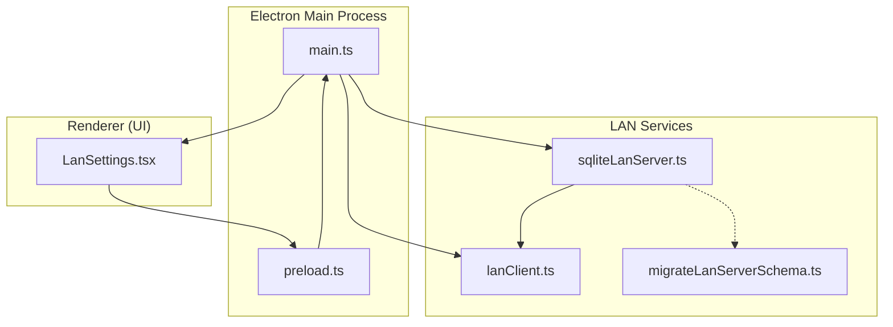
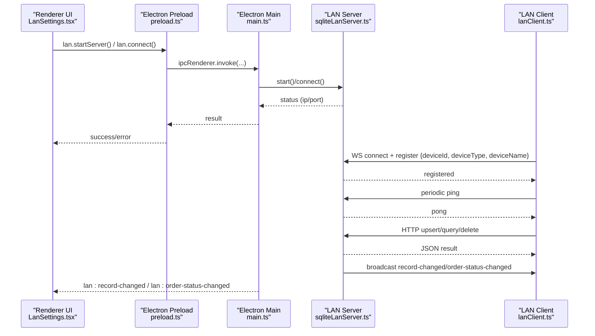
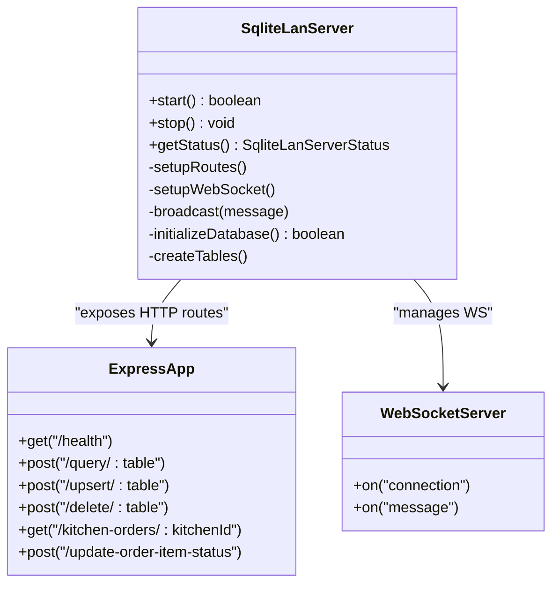
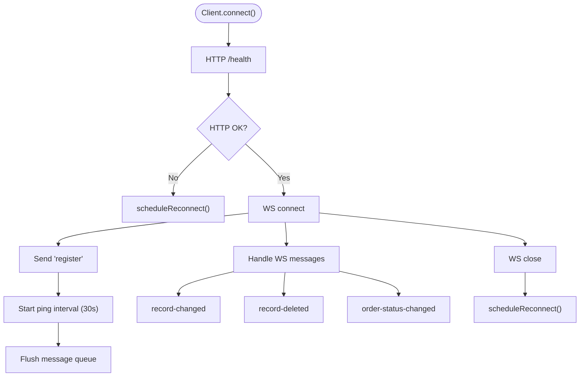
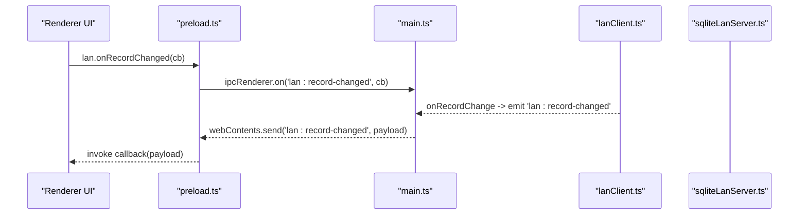
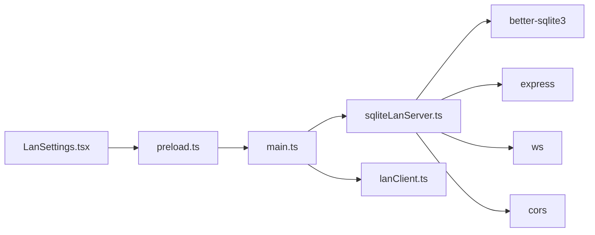

# LAN Communication Protocols

<cite>
**Referenced Files in This Document**
- [lanClient.ts](file://electron/services/lanClient.ts)
- [sqliteLanServer.ts](file://electron/services/sqliteLanServer.ts)
- [main.ts](file://electron/main.ts)
- [preload.ts](file://electron/preload.ts)
- [LanSettings.tsx](file://src/pages/LanSettings.tsx)
- [offlineDataService.ts](file://src/services/offlineDataService.ts)
- [migrateLanServerSchema.ts](file://electron/services/migrateLanServerSchema.ts)
- [vite.config.ts](file://vite.config.ts)
</cite>

## Table of Contents
1. [Introduction](#introduction)
2. [Project Structure](#project-structure)
3. [Core Components](#core-components)
4. [Architecture Overview](#architecture-overview)
5. [Detailed Component Analysis](#detailed-component-analysis)
6. [Dependency Analysis](#dependency-analysis)
7. [Performance Considerations](#performance-considerations)
8. [Troubleshooting Guide](#troubleshooting-guide)
9. [Conclusion](#conclusion)

## Introduction
This document describes the LAN communication protocols used by TableFlow Pro for real-time synchronization across multiple desktop terminals. It covers the client-server architecture, message formats, event-driven updates, conflict resolution strategies, network discovery, peer-to-peer patterns, IPC between Electron main and renderer processes, and protocol specifications for order data, menu updates, staff changes, and system notifications. It also documents security considerations, encryption, authentication, and debugging tools for protocol-level troubleshooting.

## Project Structure
The LAN functionality spans three layers:
- Electron Main Process: orchestrates server/client lifecycle, exposes IPC handlers, and forwards events to the renderer.
- Electron Renderer: UI controls for LAN mode, status monitoring, and event subscriptions.
- LAN Server/Client Services: HTTP/WebSocket server and client implementing the LAN protocol.

**Diagram sources**
- [main.ts:227-391](file://electron/main.ts#L227-L391)
- [preload.ts:1-90](file://electron/preload.ts#L1-L90)
- [sqliteLanServer.ts:1-520](file://electron/services/sqliteLanServer.ts#L1-L520)
- [lanClient.ts:1-364](file://electron/services/lanClient.ts#L1-L364)
- [migrateLanServerSchema.ts:1-301](file://electron/services/migrateLanServerSchema.ts#L1-L301)
- [LanSettings.tsx:1-533](file://src/pages/LanSettings.tsx#L1-L533)

**Section sources**
- [main.ts:227-391](file://electron/main.ts#L227-L391)
- [preload.ts:1-90](file://electron/preload.ts#L1-L90)
- [sqliteLanServer.ts:1-520](file://electron/services/sqliteLanServer.ts#L1-L520)
- [lanClient.ts:1-364](file://electron/services/lanClient.ts#L1-L364)
- [migrateLanServerSchema.ts:1-301](file://electron/services/migrateLanServerSchema.ts#L1-L301)
- [LanSettings.tsx:1-533](file://src/pages/LanSettings.tsx#L1-L533)

## Core Components
- LAN Server (SQLite-backed): HTTP + WebSocket server exposing CRUD endpoints and broadcasting changes to connected clients.
- LAN Client: WebSocket client that registers with the server, maintains a ping heartbeat, queues messages until connected, and forwards events to the renderer.
- IPC Bridge: Electron’s contextBridge exposes a typed API to renderer for LAN operations, status, and event subscriptions.
- Renderer UI: LAN settings panel allowing users to start/stop server, connect as client, monitor status, and subscribe to live events.

Key responsibilities:
- Real-time synchronization: HTTP endpoints for query/upsert/delete; WebSocket broadcasts for record changes and order status updates.
- Event-driven updates: Renderer receives 'lan:record-changed' and 'lan:order-status-changed' events.
- Conflict resolution: Last-write-wins via HTTP upsert; ordering enforced by server-side SQL constraints and indexes.
- Security: No explicit encryption/authentication in the LAN protocol; operates over localhost/lan with basic device registration.

**Section sources**
- [sqliteLanServer.ts:51-189](file://electron/services/sqliteLanServer.ts#L51-L189)
- [lanClient.ts:146-164](file://electron/services/lanClient.ts#L146-L164)
- [preload.ts:37-80](file://electron/preload.ts#L37-L80)
- [LanSettings.tsx:31-92](file://src/pages/LanSettings.tsx#L31-L92)

## Architecture Overview
The LAN architecture uses a single server (main PC) and multiple clients (billing/kitchen PCs). The server exposes:
- HTTP endpoints for data operations
- WebSocket for real-time broadcasts
Clients connect via WebSocket, register with device metadata, and receive live updates.

**Diagram sources**
- [main.ts:227-391](file://electron/main.ts#L227-L391)
- [sqliteLanServer.ts:191-229](file://electron/services/sqliteLanServer.ts#L191-L229)
- [lanClient.ts:65-144](file://electron/services/lanClient.ts#L65-L144)
- [preload.ts:37-80](file://electron/preload.ts#L37-L80)
- [LanSettings.tsx:120-229](file://src/pages/LanSettings.tsx#L120-L229)

## Detailed Component Analysis

### LAN Server (sqliteLanServer.ts)
- HTTP routes:
  - GET /health: server status and client count
  - POST /query/:table: filter records by body filters
  - POST /upsert/:table: insert/update record; broadcasts 'record-changed'
  - POST /delete/:table: delete by id; broadcasts 'record-deleted'
  - GET /kitchen-orders/:kitchenId?status=:status: join order_items with orders/menu_items
  - POST /update-order-item-status: update order item status; broadcasts 'order-status-changed'
- WebSocket:
  - Handles 'register' and 'ping'/'pong'
  - Maintains client registry with device metadata
  - Broadcasts changes to all connected clients
- Database:
  - SQLite with WAL mode and foreign keys enabled
  - Creates tables for restaurants, floors, tables, menu categories/items, kitchens, orders, order_items, staff_members
  - Automatic schema migration and indexing

**Diagram sources**
- [sqliteLanServer.ts:23-44](file://electron/services/sqliteLanServer.ts#L23-L44)
- [sqliteLanServer.ts:51-189](file://electron/services/sqliteLanServer.ts#L51-L189)
- [sqliteLanServer.ts:191-229](file://electron/services/sqliteLanServer.ts#L191-L229)

**Section sources**
- [sqliteLanServer.ts:51-189](file://electron/services/sqliteLanServer.ts#L51-L189)
- [sqliteLanServer.ts:191-229](file://electron/services/sqliteLanServer.ts#L191-L229)
- [sqliteLanServer.ts:243-286](file://electron/services/sqliteLanServer.ts#L243-L286)
- [sqliteLanServer.ts:288-429](file://electron/services/sqliteLanServer.ts#L288-L429)

### LAN Client (lanClient.ts)
- Connection lifecycle:
  - Health check via HTTP /health
  - WebSocket connect and 'register' message
  - Periodic 'ping' every 30 seconds
  - Reconnection timer on disconnect
- Message handling:
  - 'registered', 'pong'
  - 'record-changed', 'record-deleted'
  - 'order-item-status-changed'
- HTTP API wrappers:
  - query(table, filters)
  - upsert(table, data)
  - delete(table, id)
  - getKitchenOrders(kitchenId?, status?)
  - updateOrderItemStatus(itemId, status)

**Diagram sources**
- [lanClient.ts:65-144](file://electron/services/lanClient.ts#L65-L144)
- [lanClient.ts:146-164](file://electron/services/lanClient.ts#L146-L164)
- [lanClient.ts:178-186](file://electron/services/lanClient.ts#L178-L186)

**Section sources**
- [lanClient.ts:65-144](file://electron/services/lanClient.ts#L65-L144)
- [lanClient.ts:146-164](file://electron/services/lanClient.ts#L146-L164)
- [lanClient.ts:217-317](file://electron/services/lanClient.ts#L217-L317)

### IPC Bridge (preload.ts and main.ts)
- Preload exposes:
  - lan.startServer(), lan.stopServer()
  - lan.connect(config), lan.disconnect()
  - lan.status(), lan.clientStatus()
  - lan.query/upsert/delete/getKitchenOrders/updateOrderItemStatus
  - Event listeners: onConnected, onDisconnected, onRecordChanged, onOrderStatusChanged
- Main registers IPC handlers and forwards LAN events to renderer via webContents.send('lan:*').

**Diagram sources**
- [preload.ts:64-79](file://electron/preload.ts#L64-L79)
- [main.ts:285-302](file://electron/main.ts#L285-L302)

**Section sources**
- [preload.ts:37-80](file://electron/preload.ts#L37-L80)
- [main.ts:227-391](file://electron/main.ts#L227-L391)

### Renderer UI (LanSettings.tsx)
- Displays LAN status (mode, connected, server running, IP, clients connected)
- Starts/stops server and connects/disconnects as client
- Subscribes to 'lan:connected' and 'lan:disconnected' events
- Provides debug info about exposed APIs

**Section sources**
- [LanSettings.tsx:31-92](file://src/pages/LanSettings.tsx#L31-L92)
- [LanSettings.tsx:120-229](file://src/pages/LanSettings.tsx#L120-L229)

### Data Layer Integration (offlineDataService.ts)
- In LAN mode, offlineQuery/offlineMutate route through LAN client when connected
- Ensures IDs and timestamps are set for records
- Soft deletes in Electron local mode; direct delete in LAN mode

**Section sources**
- [offlineDataService.ts:151-211](file://src/services/offlineDataService.ts#L151-L211)
- [offlineDataService.ts:220-287](file://src/services/offlineDataService.ts#L220-L287)
- [offlineDataService.ts:295-347](file://src/services/offlineDataService.ts#L295-L347)

### Schema Migration (migrateLanServerSchema.ts)
- Adds missing columns to orders, staff_members, and order_items
- Recreates order_items with foreign key constraints
- Adds indexes and enables foreign keys and WAL mode

**Section sources**
- [migrateLanServerSchema.ts:10-49](file://electron/services/migrateLanServerSchema.ts#L10-L49)
- [migrateLanServerSchema.ts:189-242](file://electron/services/migrateLanServerSchema.ts#L189-L242)
- [migrateLanServerSchema.ts:247-271](file://electron/services/migrateLanServerSchema.ts#L247-L271)

## Dependency Analysis
- Runtime dependencies:
  - Electron main process depends on sqliteLanServer and lanClient
  - Renderer depends on preload bridge for LAN operations
  - LAN server depends on better-sqlite3, express, ws, cors
- IPC dependencies:
  - main.ts registers handlers for 'lan:*' and forwards events to renderer
  - preload.ts exposes typed 'lan' API to renderer

**Diagram sources**
- [main.ts:227-391](file://electron/main.ts#L227-L391)
- [sqliteLanServer.ts:4-12](file://electron/services/sqliteLanServer.ts#L4-L12)
- [preload.ts:1-90](file://electron/preload.ts#L1-L90)
- [LanSettings.tsx:1-533](file://src/pages/LanSettings.tsx#L1-L533)

**Section sources**
- [main.ts:227-391](file://electron/main.ts#L227-L391)
- [sqliteLanServer.ts:4-12](file://electron/services/sqliteLanServer.ts#L4-L12)
- [preload.ts:1-90](file://electron/preload.ts#L1-L90)

## Performance Considerations
- Database tuning:
  - WAL mode improves concurrency for multiple clients
  - Foreign keys enabled for data integrity
  - Indexes created for common query patterns
- Network:
  - WebSocket ping keeps connections alive and detects failures quickly
  - Queued messages ensure reliability during reconnection
- Scalability:
  - SQLite is single-writer; consider load balancing or sharding if many concurrent writers are needed
  - Broadcast pattern scales with number of clients; consider selective subscription if needed

[No sources needed since this section provides general guidance]

## Troubleshooting Guide

Common issues and resolutions:
- Server fails to start:
  - Check port availability; server listens on fixed port and reports EADDRINUSE if in use
  - Verify database initialization logs for schema migration errors
- Client cannot connect:
  - Confirm server IP is visible to clients
  - Ensure firewall allows TCP traffic on server port
  - Check client health check to server /health endpoint
- Disconnections:
  - Inspect ping/pong heartbeats; frequent reconnects indicate network instability
  - Review client message queue flushing after reconnection
- Data not updating:
  - Verify 'record-changed'/'order-status-changed' events are being emitted and received
  - Check server broadcast logic and client event handlers
- Debugging tools:
  - Renderer debug info card shows available APIs and keys
  - Use offline data service debug dump to inspect local SQLite contents
  - Monitor Electron main process logs for server/client lifecycle events

**Section sources**
- [sqliteLanServer.ts:458-468](file://electron/services/sqliteLanServer.ts#L458-L468)
- [lanClient.ts:178-186](file://electron/services/lanClient.ts#L178-L186)
- [LanSettings.tsx:44-64](file://src/pages/LanSettings.tsx#L44-L64)
- [offlineDataService.ts:739-765](file://src/services/offlineDataService.ts#L739-L765)

## Protocol Specifications

### Client-Server Message Formats
- Registration:
  - Client sends: { type: 'register', deviceId, deviceType, deviceName }
  - Server responds: { type: 'registered', success: true }
- Heartbeat:
  - Client sends: { type: 'ping' }
  - Server responds: { type: 'pong', timestamp }
- Data Change Notifications:
  - Server broadcasts: { type: 'record-changed', table, data }
  - Server broadcasts: { type: 'record-deleted', table, id }
  - Server broadcasts: { type: 'order-status-changed', itemId, status }

**Section sources**
- [sqliteLanServer.ts:197-205](file://electron/services/sqliteLanServer.ts#L197-L205)
- [lanClient.ts:147-162](file://electron/services/lanClient.ts#L147-L162)

### HTTP Endpoints
- GET /health
  - Purpose: Health and diagnostics
  - Response: { status, dbStatus, clients }
- POST /query/:table
  - Body: { filters: Record<string, any> }
  - Response: { success, data }
- POST /upsert/:table
  - Body: Record payload (last-insert wins)
  - Response: { success, id? }
- POST /delete/:table
  - Body: { id }
  - Response: { success }
- GET /kitchen-orders/:kitchenId?status=:status
  - Response: { success, data: order_items joined with orders/menu_items }
- POST /update-order-item-status
  - Body: { itemId, status }
  - Response: { success }

**Section sources**
- [sqliteLanServer.ts:52-189](file://electron/services/sqliteLanServer.ts#L52-L189)

### Data Exchange Protocols
- Order Data:
  - Orders and order_items synchronized via upsert; order status updates broadcast
- Menu Updates:
  - Menu categories/items synchronized via upsert; deletions broadcast
- Staff Changes:
  - Staff members synchronized via upsert; deletions broadcast
- System Notifications:
  - Broadcast via WebSocket for record changes and order status updates

**Section sources**
- [sqliteLanServer.ts:104-105](file://electron/services/sqliteLanServer.ts#L104-L105)
- [sqliteLanServer.ts:124](file://electron/services/sqliteLanServer.ts#L124)
- [sqliteLanServer.ts:182](file://electron/services/sqliteLanServer.ts#L182)

### Real-Time Synchronization Mechanisms
- WebSocket registration and ping keep clients connected
- Server broadcasts changes immediately upon upsert/delete
- Renderer subscribes to 'lan:record-changed' and 'lan:order-status-changed'

**Section sources**
- [sqliteLanServer.ts:197-205](file://electron/services/sqliteLanServer.ts#L197-L205)
- [lanClient.ts:147-162](file://electron/services/lanClient.ts#L147-L162)
- [preload.ts:64-79](file://electron/preload.ts#L64-L79)

### Conflict Resolution Strategies
- Last-write-wins: HTTP upsert replaces existing records by id
- Integrity: SQLite foreign keys and indexes enforce referential integrity
- Ordering: Server-side SQL ensures consistent ordering for kitchen queries

**Section sources**
- [sqliteLanServer.ts:100](file://electron/services/sqliteLanServer.ts#L100)
- [sqliteLanServer.ts:269](file://electron/services/sqliteLanServer.ts#L269)
- [sqliteLanServer.ts:420-426](file://electron/services/sqliteLanServer.ts#L420-L426)

### Network Discovery and Peer-to-Peer Patterns
- Server auto-detects IP address and exposes it to clients
- Clients connect using server IP and fixed port
- No broadcast discovery; manual IP entry required

**Section sources**
- [sqliteLanServer.ts:231-241](file://electron/services/sqliteLanServer.ts#L231-L241)
- [LanSettings.tsx:188-194](file://src/pages/LanSettings.tsx#L188-L194)

### IPC Protocols (Electron)
- Renderer invokes 'lan:*' IPC handlers via preload bridge
- Main process forwards LAN events to renderer via webContents.send('lan:*')

**Section sources**
- [preload.ts:37-80](file://electron/preload.ts#L37-L80)
- [main.ts:285-302](file://electron/main.ts#L285-L302)

### Security, Encryption, and Authentication
- Transport: HTTP and WebSocket over TCP (no TLS/encryption)
- Authentication: None; server accepts any client that registers
- Recommendations:
  - Use LAN segment isolation
  - Consider adding optional TLS termination at LAN gateway
  - Add device authorization tokens if scaling beyond trusted LAN

**Section sources**
- [lanClient.ts:57-63](file://electron/services/lanClient.ts#L57-L63)
- [sqliteLanServer.ts:197-205](file://electron/services/sqliteLanServer.ts#L197-L205)

### Debugging Tools and Monitoring
- Renderer:
  - Debug info card shows available APIs and keys
  - Toast notifications for connection events
- Main process:
  - Extensive logging for server start/stop, client connect/disconnect, and error paths
- Data:
  - Offline data service debug dump for SQLite inspection

**Section sources**
- [LanSettings.tsx:44-64](file://src/pages/LanSettings.tsx#L44-L64)
- [offlineDataService.ts:739-765](file://src/services/offlineDataService.ts#L739-L765)
- [main.ts:230-259](file://electron/main.ts#L230-L259)

## Conclusion
TableFlow Pro’s LAN protocol provides a lightweight, reliable mechanism for sharing restaurant data across multiple terminals. The design leverages a central server with HTTP endpoints and WebSocket broadcasts, ensuring real-time updates with minimal overhead. While the protocol currently lacks encryption and authentication, it is suitable for trusted LAN environments. The IPC bridge and UI components offer robust operational visibility and control, enabling smooth deployment and maintenance.