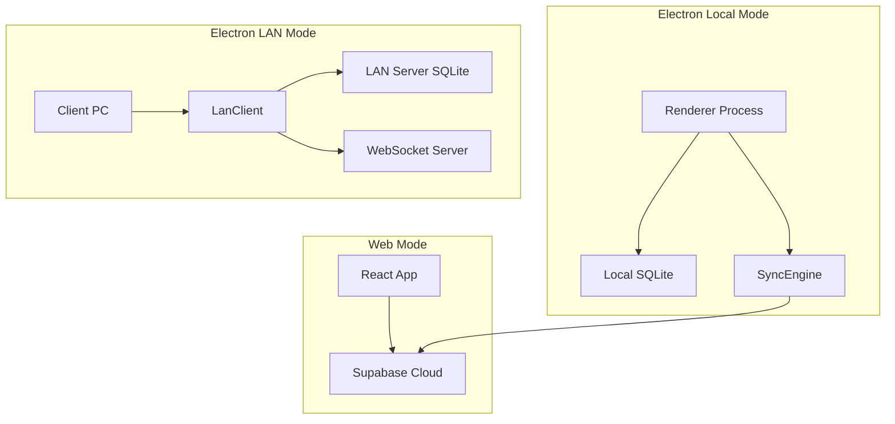
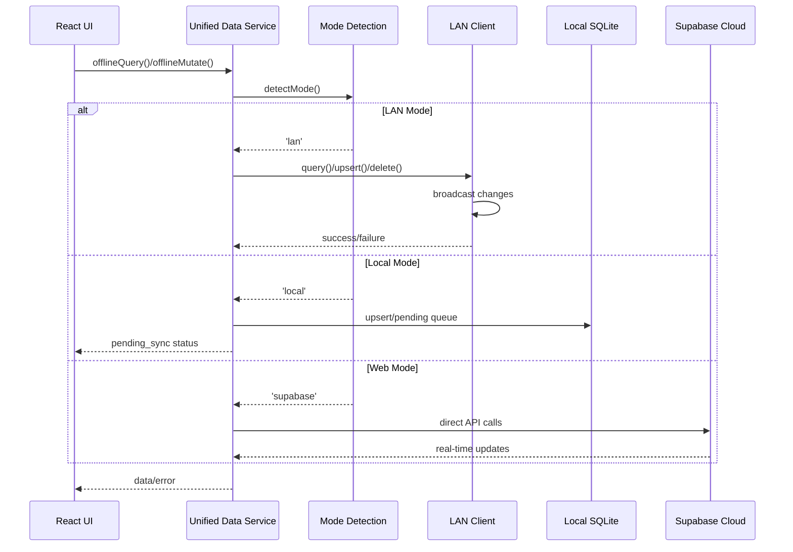
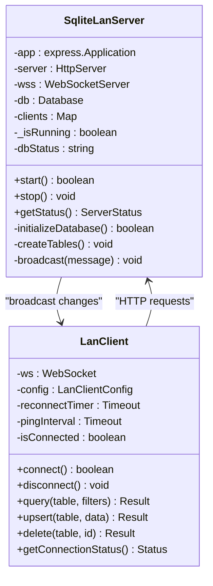
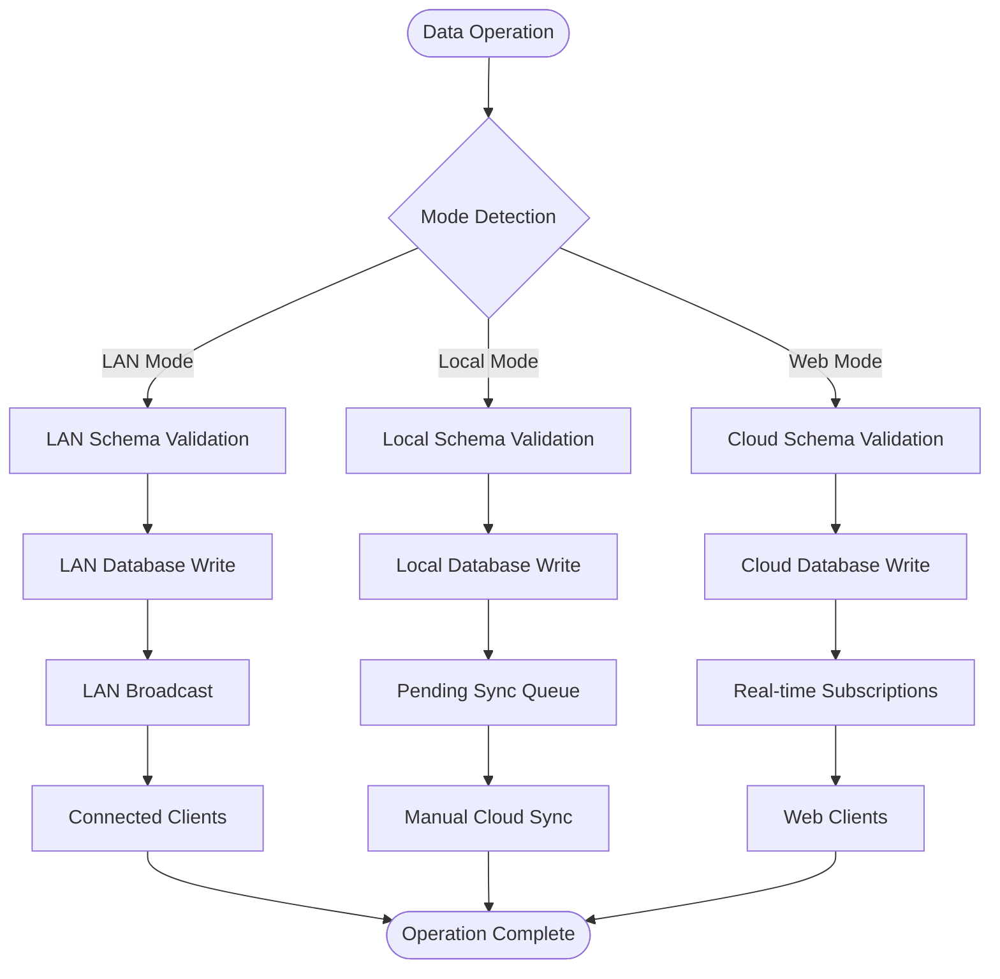
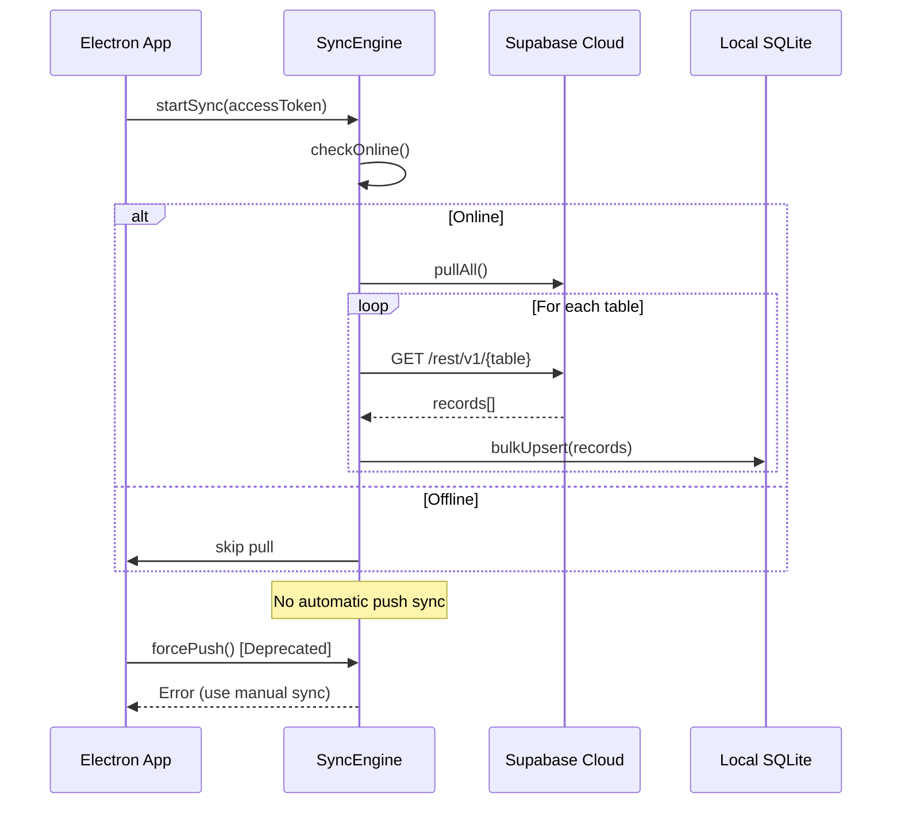
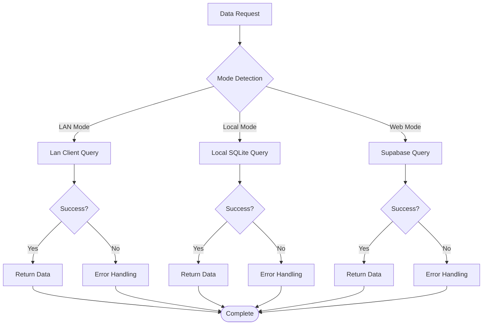
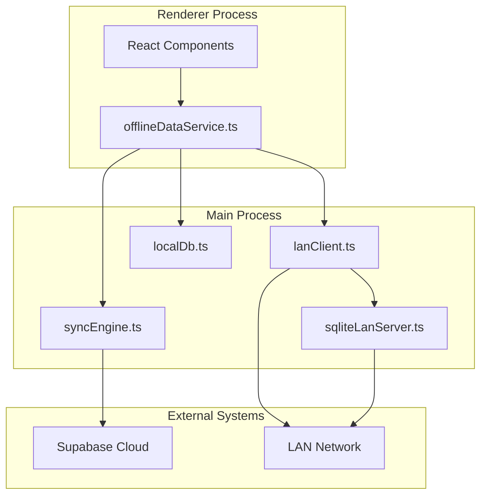

# LAN Data Synchronization

<cite>
**Referenced Files in This Document**
- [syncEngine.ts](file://electron/services/syncEngine.ts)
- [offlineDataService.ts](file://src/services/offlineDataService.ts)
- [lanClient.ts](file://electron/services/lanClient.ts)
- [sqliteLanServer.ts](file://electron/services/sqliteLanServer.ts)
- [localDb.ts](file://electron/services/localDb.ts)
- [main.ts](file://electron/main.ts)
- [LanSettings.tsx](file://src/pages/LanSettings.tsx)
- [DATABASE_ARCHITECTURE_ANALYSIS.md](file://DATABASE_ARCHITECTURE_ANALYSIS.md)
- [DATABASE_CONNECTIVITY_MAP.md](file://DATABASE_CONNECTIVITY_MAP.md)
- [IMPLEMENTATION_CHECKLIST.md](file://IMPLEMENTATION_CHECKLIST.md)
</cite>

## Table of Contents
1. [Introduction](#introduction)
2. [Project Structure](#project-structure)
3. [Core Components](#core-components)
4. [Architecture Overview](#architecture-overview)
5. [Detailed Component Analysis](#detailed-component-analysis)
6. [Dependency Analysis](#dependency-analysis)
7. [Performance Considerations](#performance-considerations)
8. [Troubleshooting Guide](#troubleshooting-guide)
9. [Conclusion](#conclusion)

## Introduction
This document provides comprehensive LAN data synchronization documentation for TableFlow Pro. It details the distributed data consistency mechanisms, conflict resolution strategies, and synchronization algorithms used across three operational modes: Web (cloud-only), Electron Local (offline-first with manual sync), and Electron LAN (real-time multi-device sharing). The focus areas include real-time data propagation from server to clients, offline-first approach with pending operation queues, conflict detection, replication strategies, incremental updates, batch synchronization, performance optimization, error handling, rollback mechanisms, and monitoring tools.

## Project Structure
TableFlow Pro implements a unified data architecture with three database layers:
- Supabase Cloud (PostgreSQL): Central cloud database with real-time subscriptions for web mode
- Local SQLite (Electron): Offline-first cache for single-device mode with manual cloud sync
- LAN Server SQLite (Electron): Shared database for multi-device LAN mode with real-time WebSocket updates



**Diagram sources**
- [DATABASE_ARCHITECTURE_ANALYSIS.md:9-54](file://DATABASE_ARCHITECTURE_ANALYSIS.md#L9-L54)
- [sqliteLanServer.ts:23-44](file://electron/services/sqliteLanServer.ts#L23-L44)

**Section sources**
- [DATABASE_ARCHITECTURE_ANALYSIS.md:9-54](file://DATABASE_ARCHITECTURE_ANALYSIS.md#L9-L54)

## Core Components
The synchronization system comprises four primary components:

### 1. SyncEngine (Electron Main Process)
Handles initial cloud-to-local data loading and maintains online status detection.

### 2. Offline Data Service (Renderer Process)
Provides offline-first data access with mode-aware routing and manual cloud sync capabilities.

### 3. LAN Client (Electron Main Process)
Manages LAN server connectivity, WebSocket communication, and HTTP API wrappers.

### 4. LAN Server (Electron Main Process)
Serves as the central SQLite database for LAN mode with HTTP endpoints and WebSocket broadcasting.

**Section sources**
- [syncEngine.ts:15-26](file://electron/services/syncEngine.ts#L15-L26)
- [offlineDataService.ts:1-769](file://src/services/offlineDataService.ts#L1-L769)
- [lanClient.ts:22-38](file://electron/services/lanClient.ts#L22-L38)
- [sqliteLanServer.ts:23-44](file://electron/services/sqliteLanServer.ts#L23-L44)

## Architecture Overview
TableFlow Pro supports three distinct data flow modes with unified routing logic:



**Diagram sources**
- [offlineDataService.ts:151-211](file://src/services/offlineDataService.ts#L151-L211)
- [offlineDataService.ts:220-287](file://src/services/offlineDataService.ts#L220-L287)

The architecture ensures data consistency through:
- Unified schema validation across all databases
- Mode-aware routing with consistent behavior
- Pending operation queues for offline scenarios
- Real-time WebSocket broadcasting in LAN mode
- Manual cloud sync with conflict detection

**Section sources**
- [DATABASE_ARCHITECTURE_ANALYSIS.md:275-396](file://DATABASE_ARCHITECTURE_ANALYSIS.md#L275-L396)

## Detailed Component Analysis

### LAN Server Implementation
The LAN Server serves as the central coordinator for multi-device synchronization:



**Diagram sources**
- [sqliteLanServer.ts:23-514](file://electron/services/sqliteLanServer.ts#L23-L514)
- [lanClient.ts:22-364](file://electron/services/lanClient.ts#L22-L364)

Key features include:
- WebSocket-based real-time broadcasting of data changes
- HTTP endpoints for CRUD operations with parameter validation
- Kitchen-specific order management endpoints
- Built-in health checking and client registration
- Transaction support for batch operations

**Section sources**
- [sqliteLanServer.ts:51-189](file://electron/services/sqliteLanServer.ts#L51-L189)
- [sqliteLanServer.ts:288-429](file://electron/services/sqliteLanServer.ts#L288-L429)

### Data Consistency and Conflict Resolution
The system implements multiple layers of data consistency:



**Diagram sources**
- [offlineDataService.ts:375-541](file://src/services/offlineDataService.ts#L375-L541)
- [sqliteLanServer.ts:88-130](file://electron/services/sqliteLanServer.ts#L88-L130)

Conflict resolution mechanisms include:
- Last-write-wins strategy with timestamp preservation
- Foreign key constraint enforcement in LAN mode
- Pending operation queuing with sync_status tracking
- UUID validation for referential integrity
- Batch transaction support for atomic operations

**Section sources**
- [offlineDataService.ts:475-527](file://src/services/offlineDataService.ts#L475-L527)
- [localDb.ts:328-348](file://electron/services/localDb.ts#L328-L348)

### SyncEngine for Cloud Synchronization
The SyncEngine manages cloud-to-local data synchronization in Electron mode:



**Diagram sources**
- [syncEngine.ts:32-106](file://electron/services/syncEngine.ts#L32-L106)

**Section sources**
- [syncEngine.ts:70-106](file://electron/services/syncEngine.ts#L70-L106)
- [syncEngine.ts:109-122](file://electron/services/syncEngine.ts#L109-L122)

### Offline-First Data Management
The offline data service provides comprehensive offline support:



**Diagram sources**
- [offlineDataService.ts:151-211](file://src/services/offlineDataService.ts#L151-L211)

**Section sources**
- [offlineDataService.ts:141-211](file://src/services/offlineDataService.ts#L141-L211)
- [offlineDataService.ts:295-347](file://src/services/offlineDataService.ts#L295-L347)

## Dependency Analysis
The synchronization system exhibits clear separation of concerns with minimal coupling:



**Diagram sources**
- [main.ts:178-224](file://electron/main.ts#L178-L224)
- [offlineDataService.ts:351-372](file://src/services/offlineDataService.ts#L351-L372)

Key dependency relationships:
- Renderer depends on unified offline service for all data operations
- Main process handles platform-specific database and networking
- LAN mode creates bidirectional dependency between client and server
- Cloud sync is initiated manually from renderer process

**Section sources**
- [main.ts:178-224](file://electron/main.ts#L178-L224)
- [DATABASE_ARCHITECTURE_ANALYSIS.md:508-549](file://DATABASE_ARCHITECTURE_ANALYSIS.md#L508-L549)

## Performance Considerations
The system implements several performance optimization strategies:

### Network Efficiency
- **Batch Operations**: LAN server supports batch upsert endpoints to reduce HTTP overhead
- **Connection Reuse**: Persistent WebSocket connections eliminate handshake costs
- **Selective Broadcasting**: Only changed records are broadcast to clients
- **Compression**: JSON responses are sent without compression overhead

### Database Optimization
- **Index Strategy**: Strategic indexing on frequently queried columns
- **WAL Mode**: Write-Ahead Logging improves concurrent access performance
- **Transaction Batching**: Atomic operations for multiple record updates
- **Foreign Key Enforcement**: Prevents orphaned records and maintains data integrity

### Memory Management
- **Lazy Loading**: Data loaded on-demand rather than pre-loading entire datasets
- **Connection Pooling**: Efficient resource utilization for database operations
- **Garbage Collection**: Automatic cleanup of unused WebSocket connections

**Section sources**
- [sqliteLanServer.ts:415-426](file://electron/services/sqliteLanServer.ts#L415-L426)
- [localDb.ts:150-160](file://electron/services/localDb.ts#L150-L160)
- [IMPLEMENTATION_CHECKLIST.md:156-182](file://IMPLEMENTATION_CHECKLIST.md#L156-L182)

## Troubleshooting Guide

### Common Synchronization Issues

#### LAN Mode Data Loss
**Symptoms**: Customer information disappears when creating orders in LAN mode
**Root Cause**: Missing columns in LAN server SQLite schema
**Resolution**: Apply schema migration to add missing customer and payment fields

#### Offline Sync Failures
**Symptoms**: Pending operations not syncing to cloud
**Root Cause**: Network connectivity issues or invalid UUID references
**Resolution**: Check network status, validate record IDs, and retry manual sync

#### Real-time Updates Not Working
**Symptoms**: Changes not reflected across devices
**Root Cause**: WebSocket connection drops or client registration failures
**Resolution**: Verify LAN server status, restart client connections, and check firewall settings

### Monitoring and Diagnostics

#### LAN Server Status
```typescript
// Check LAN server health and client connections
const status = await window.electronAPI.lan.status();
console.log('Server IP:', status.serverIp);
console.log('Clients connected:', status.clientsConnected);
console.log('Server running:', status.serverRunning);
```

#### Sync Progress Tracking
```typescript
// Monitor pending sync operations
const pendingCount = await window.electronAPI.db.getPending();
console.log('Pending sync operations:', pendingCount.length);

// Check sync status
const syncStatus = await window.electronAPI.sync.status();
console.log('Online status:', syncStatus.isOnline);
```

#### Error Handling Patterns
The system implements comprehensive error handling:
- Network timeouts with graceful fallback
- Database transaction rollbacks on failure
- Client reconnection with exponential backoff
- Validation errors with detailed error messages

**Section sources**
- [LanSettings.tsx:97-109](file://src/pages/LanSettings.tsx#L97-L109)
- [offlineDataService.ts:546-560](file://src/services/offlineDataService.ts#L546-L560)
- [lanClient.ts:178-186](file://electron/services/lanClient.ts#L178-L186)

### Rollback and Recovery
The system supports multiple recovery mechanisms:
- **Schema Migration Rollback**: Reverse database schema changes
- **Data Validation**: Prevent invalid data from corrupting the system
- **Transaction Rollback**: Atomic operations ensure data consistency
- **Manual Sync Retry**: Failed operations can be retried individually

**Section sources**
- [IMPLEMENTATION_CHECKLIST.md:555-580](file://IMPLEMENTATION_CHECKLIST.md#L555-L580)
- [offlineDataService.ts:397-541](file://src/services/offlineDataService.ts#L397-L541)

## Conclusion
TableFlow Pro implements a robust LAN data synchronization system that seamlessly integrates three operational modes while maintaining data consistency and reliability. The architecture successfully balances offline-first capabilities with real-time collaboration, providing comprehensive conflict resolution and performance optimization. Key strengths include unified schema validation, mode-aware routing, comprehensive error handling, and efficient batch operations. The system's modular design enables easy maintenance and future enhancements while ensuring reliable data synchronization across diverse deployment scenarios.