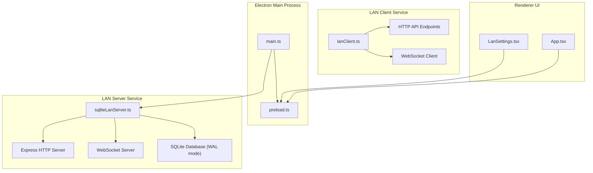
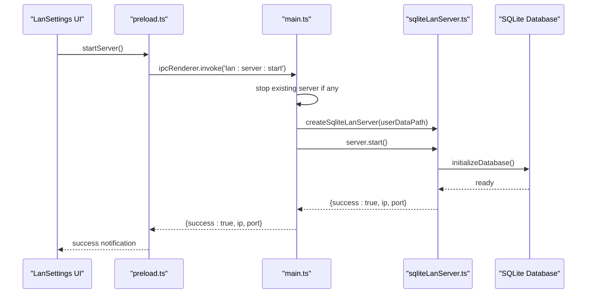
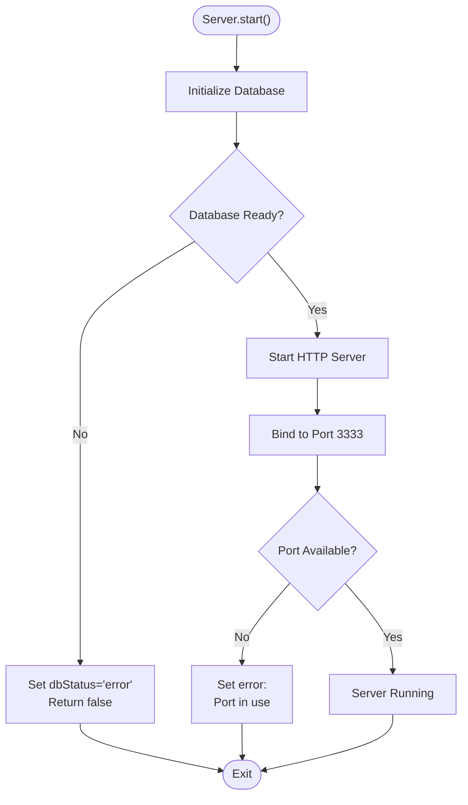
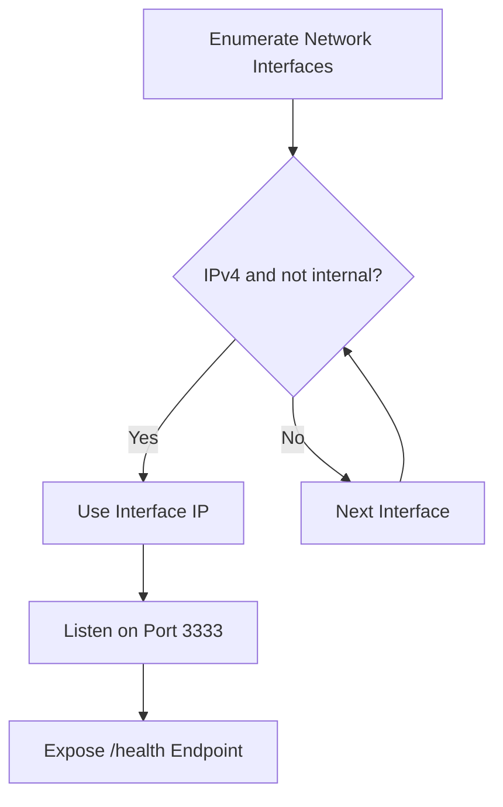
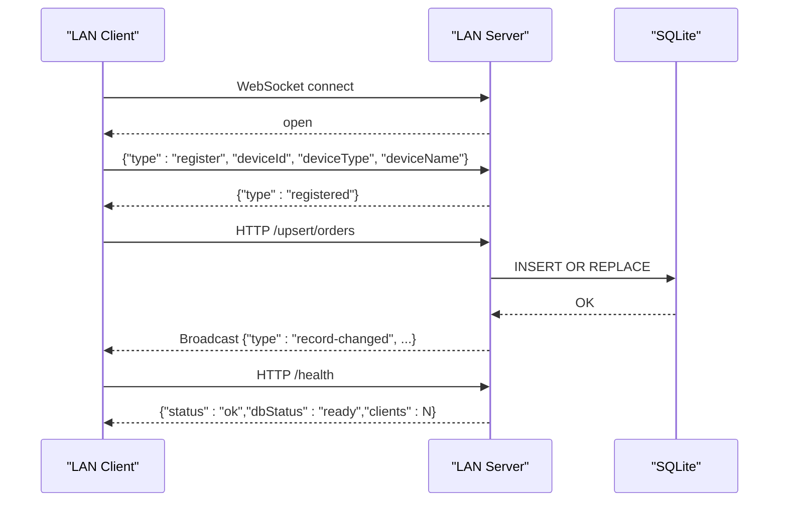
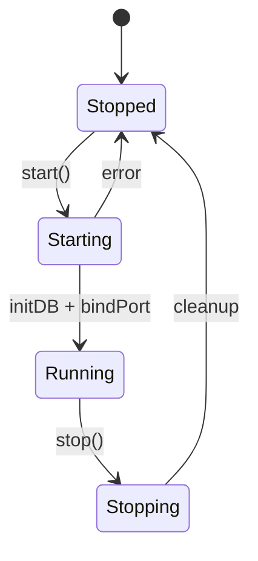
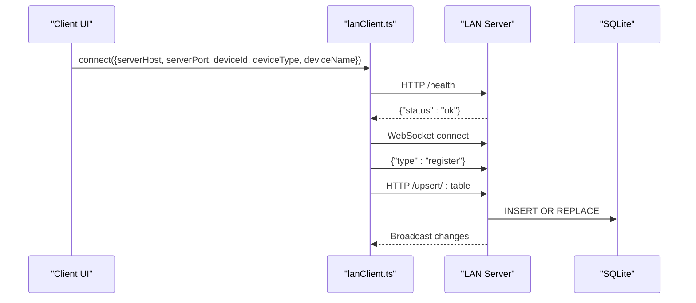
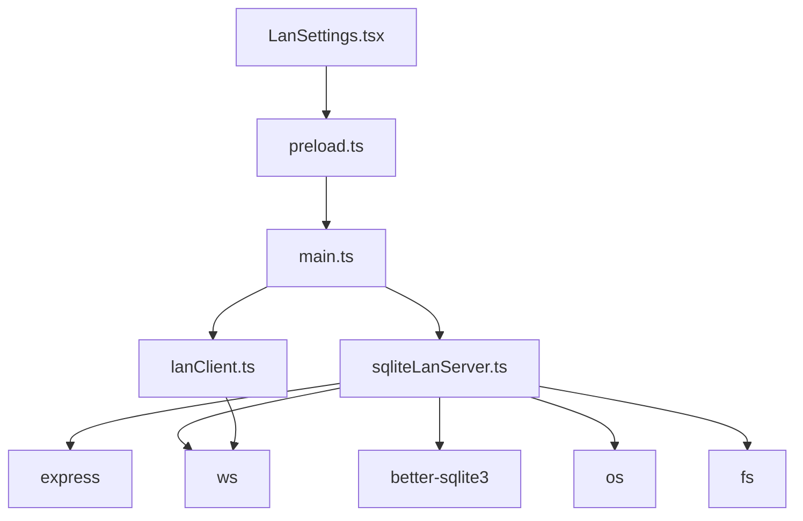

# LAN Server Setup & Configuration

<cite>
**Referenced Files in This Document**
- [sqliteLanServer.ts](file://electron/services/sqliteLanServer.ts)
- [lanClient.ts](file://electron/services/lanClient.ts)
- [main.ts](file://electron/main.ts)
- [LanSettings.tsx](file://src/pages/LanSettings.tsx)
- [package.json](file://package.json)
- [DATABASE_CONNECTIVITY_MAP.md](file://DATABASE_CONNECTIVITY_MAP.md)
- [DATABASE_ARCHITECTURE_ANALYSIS.md](file://DATABASE_ARCHITECTURE_ANALYSIS.md)
- [preload.ts](file://electron/preload.ts)
- [App.tsx](file://src/App.tsx)
</cite>

## Table of Contents
1. [Introduction](#introduction)
2. [Project Structure](#project-structure)
3. [Core Components](#core-components)
4. [Architecture Overview](#architecture-overview)
5. [Detailed Component Analysis](#detailed-component-analysis)
6. [Dependency Analysis](#dependency-analysis)
7. [Performance Considerations](#performance-considerations)
8. [Troubleshooting Guide](#troubleshooting-guide)
9. [Conclusion](#conclusion)
10. [Appendices](#appendices)

## Introduction
This document provides comprehensive LAN server setup and configuration guidance for TableFlow Pro. It explains how the LAN server initializes automatically, how the SQLite database is managed, how network configuration works, and how to monitor and manage the server lifecycle. It also covers client connection procedures, firewall requirements, health monitoring, and security considerations for LAN deployments.

## Project Structure
The LAN server implementation spans three primary areas:
- Electron main process handlers that orchestrate server lifecycle and expose IPC APIs
- A dedicated LAN server service that runs an Express HTTP server with WebSocket broadcasting
- A LAN client service used by client machines to connect to the LAN server

**Diagram sources**
- [main.ts:227-391](file://electron/main.ts#L227-L391)
- [sqliteLanServer.ts:22-43](file://electron/services/sqliteLanServer.ts#L22-L43)
- [lanClient.ts:22-63](file://electron/services/lanClient.ts#L22-L63)
- [LanSettings.tsx:120-172](file://src/pages/LanSettings.tsx#L120-L172)
- [preload.ts:4-26](file://electron/preload.ts#L4-L26)

**Section sources**
- [main.ts:227-391](file://electron/main.ts#L227-L391)
- [sqliteLanServer.ts:22-43](file://electron/services/sqliteLanServer.ts#L22-L43)
- [lanClient.ts:22-63](file://electron/services/lanClient.ts#L22-L63)
- [LanSettings.tsx:120-172](file://src/pages/LanSettings.tsx#L120-L172)
- [preload.ts:4-26](file://electron/preload.ts#L4-L26)

## Core Components
- LAN Server Service: An Express server with WebSocket broadcasting that exposes HTTP endpoints for querying, upserting, deleting, and kitchen order management. It manages a SQLite database in WAL mode with foreign key enforcement and indexes.
- LAN Client Service: A client that connects to the LAN server via HTTP and WebSocket, registers devices, handles reconnection, and forwards real-time updates to the renderer.
- Electron Main Process: Registers IPC handlers for starting/stopping the LAN server, connecting/disconnecting clients, and exposing status information to the renderer.
- Renderer UI: Provides a simplified interface for starting the LAN server on the main PC and connecting client PCs to the LAN server.

Key capabilities:
- Automatic database initialization and schema creation
- Real-time synchronization via WebSocket broadcasts
- Health monitoring endpoints and status reporting
- Graceful shutdown with cleanup of connections and database

**Section sources**
- [sqliteLanServer.ts:22-491](file://electron/services/sqliteLanServer.ts#L22-L491)
- [lanClient.ts:22-344](file://electron/services/lanClient.ts#L22-L344)
- [main.ts:227-391](file://electron/main.ts#L227-L391)
- [LanSettings.tsx:120-172](file://src/pages/LanSettings.tsx#L120-L172)

## Architecture Overview
The LAN server architecture consists of a single main PC hosting the server and multiple client PCs connecting to it. The server exposes HTTP endpoints and a WebSocket channel for real-time updates. Clients can query, upsert, delete, and receive live notifications about changes.

**Diagram sources**
- [LanSettings.tsx:120-157](file://src/pages/LanSettings.tsx#L120-L157)
- [preload.ts:4-26](file://electron/preload.ts#L4-L26)
- [main.ts:227-260](file://electron/main.ts#L227-L260)
- [sqliteLanServer.ts:420-463](file://electron/services/sqliteLanServer.ts#L420-L463)

**Section sources**
- [sqliteLanServer.ts:22-491](file://electron/services/sqliteLanServer.ts#L22-L491)
- [main.ts:227-391](file://electron/main.ts#L227-L391)
- [LanSettings.tsx:120-172](file://src/pages/LanSettings.tsx#L120-L172)

## Detailed Component Analysis

### LAN Server Initialization and Database Management
The LAN server initializes automatically when started from the UI. It performs two main steps:
1. Initialize the SQLite database:
   - Creates a dedicated data directory under the user data path
   - Opens the database with WAL mode for improved concurrency
   - Enables foreign keys
   - Creates all required tables and indexes
2. Start the HTTP and WebSocket servers:
   - Binds to a fixed port
   - Detects the server IP address from available network interfaces
   - Handles errors such as port conflicts

**Diagram sources**
- [sqliteLanServer.ts:242-275](file://electron/services/sqliteLanServer.ts#L242-L275)
- [sqliteLanServer.ts:420-463](file://electron/services/sqliteLanServer.ts#L420-L463)

**Section sources**
- [sqliteLanServer.ts:242-275](file://electron/services/sqliteLanServer.ts#L242-L275)
- [sqliteLanServer.ts:420-463](file://electron/services/sqliteLanServer.ts#L420-L463)

### Network Configuration and IP Detection
The LAN server detects its IP address by enumerating network interfaces and selecting the first non-loopback IPv4 address. If none is found, it falls back to localhost. The server listens on a fixed port and exposes a health endpoint for clients to verify connectivity.

**Diagram sources**
- [sqliteLanServer.ts:230-240](file://electron/services/sqliteLanServer.ts#L230-L240)
- [sqliteLanServer.ts:50-58](file://electron/services/sqliteLanServer.ts#L50-L58)

**Section sources**
- [sqliteLanServer.ts:230-240](file://electron/services/sqliteLanServer.ts#L230-L240)
- [sqliteLanServer.ts:50-58](file://electron/services/sqliteLanServer.ts#L50-L58)

### HTTP API Endpoints and WebSocket Communication
The LAN server exposes the following HTTP endpoints:
- GET /health: Returns server status and client counts
- POST /query/:table: Queries records with filter support
- POST /upsert/:table: Inserts or replaces a record
- POST /delete/:table: Deletes a record by ID
- GET /kitchen-orders/:kitchenId: Retrieves kitchen-specific orders
- POST /update-order-item-status: Updates order item status

WebSocket communication supports:
- Registration of devices with device metadata
- Periodic ping/pong for liveness
- Broadcasting of record changes to all connected clients

**Diagram sources**
- [sqliteLanServer.ts:50-187](file://electron/services/sqliteLanServer.ts#L50-L187)
- [sqliteLanServer.ts:190-228](file://electron/services/sqliteLanServer.ts#L190-L228)
- [lanClient.ts:65-144](file://electron/services/lanClient.ts#L65-L144)

**Section sources**
- [sqliteLanServer.ts:50-187](file://electron/services/sqliteLanServer.ts#L50-L187)
- [sqliteLanServer.ts:190-228](file://electron/services/sqliteLanServer.ts#L190-L228)
- [lanClient.ts:65-144](file://electron/services/lanClient.ts#L65-L144)

### Server Lifecycle Management (Start/Stop)
The Electron main process exposes IPC handlers to start and stop the LAN server. The server lifecycle includes:
- Start: Stop any existing server, create a new instance, initialize the database, and bind to the port
- Stop: Close all WebSocket connections, shut down the HTTP server, and close the database

**Diagram sources**
- [main.ts:227-276](file://electron/main.ts#L227-L276)
- [sqliteLanServer.ts:420-491](file://electron/services/sqliteLanServer.ts#L420-L491)

**Section sources**
- [main.ts:227-276](file://electron/main.ts#L227-L276)
- [sqliteLanServer.ts:420-491](file://electron/services/sqliteLanServer.ts#L420-L491)

### Client Connection Procedures
Client PCs connect to the LAN server by:
- Obtaining the server IP from the LAN server status
- Using the fixed port 3333
- Establishing a WebSocket connection and registering with device metadata
- Performing HTTP requests for CRUD operations
- Receiving real-time updates via WebSocket broadcasts

**Diagram sources**
- [LanSettings.tsx:174-214](file://src/pages/LanSettings.tsx#L174-L214)
- [lanClient.ts:65-144](file://electron/services/lanClient.ts#L65-L144)
- [sqliteLanServer.ts:50-187](file://electron/services/sqliteLanServer.ts#L50-L187)

**Section sources**
- [LanSettings.tsx:174-214](file://src/pages/LanSettings.tsx#L174-L214)
- [lanClient.ts:65-144](file://electron/services/lanClient.ts#L65-L144)
- [sqliteLanServer.ts:50-187](file://electron/services/sqliteLanServer.ts#L50-L187)

## Dependency Analysis
The LAN server relies on several key dependencies and external libraries:
- Express for HTTP routing
- WebSocket for real-time communication
- better-sqlite3 for embedded database storage
- OS networking APIs for IP detection
- File system for data directory management

**Diagram sources**
- [sqliteLanServer.ts:4-11](file://electron/services/sqliteLanServer.ts#L4-L11)
- [lanClient.ts](file://electron/services/lanClient.ts#L4)
- [main.ts:1-9](file://electron/main.ts#L1-L9)
- [LanSettings.tsx:1-10](file://src/pages/LanSettings.tsx#L1-L10)
- [preload.ts](file://electron/preload.ts#L1)

**Section sources**
- [sqliteLanServer.ts:4-11](file://electron/services/sqliteLanServer.ts#L4-L11)
- [lanClient.ts](file://electron/services/lanClient.ts#L4)
- [main.ts:1-9](file://electron/main.ts#L1-L9)
- [LanSettings.tsx:1-10](file://src/pages/LanSettings.tsx#L1-L10)
- [preload.ts](file://electron/preload.ts#L1)

## Performance Considerations
- Database concurrency: WAL mode improves concurrent read/write performance.
- Indexes: The LAN server creates indexes on frequently queried columns to speed up queries.
- Batch operations: Consider implementing batch endpoints to reduce HTTP overhead for bulk operations.
- Network overhead: WebSocket broadcasting ensures efficient real-time updates without polling.

[No sources needed since this section provides general guidance]

## Troubleshooting Guide

Common startup issues:
- Port already in use: The server reports a specific error when the port is taken. Stop any conflicting service and retry.
- Database initialization failure: Check permissions for the data directory and available disk space.
- Network interface detection: If no suitable IP is found, the server falls back to localhost. Verify network configuration.

Network conflicts:
- Ensure the LAN server machine has a stable IP on the local network.
- Confirm that port 3333 is not blocked by firewalls or antivirus software.

Database initialization problems:
- Verify the data directory exists and is writable.
- Check for permission errors or insufficient disk space.

Security considerations:
- The LAN server does not implement authentication or encryption. Deploy only on trusted LAN networks.
- Restrict access to the LAN server machine and ensure physical security of the network.

Client connection issues:
- Confirm the server IP is correct and reachable from client machines.
- Verify that the server is running and responding to health checks.

**Section sources**
- [sqliteLanServer.ts:447-456](file://electron/services/sqliteLanServer.ts#L447-L456)
- [sqliteLanServer.ts:242-275](file://electron/services/sqliteLanServer.ts#L242-L275)
- [sqliteLanServer.ts:230-240](file://electron/services/sqliteLanServer.ts#L230-L240)
- [lanClient.ts:65-144](file://electron/services/lanClient.ts#L65-L144)

## Conclusion
TableFlow Pro’s LAN server provides a straightforward, automatic setup for multi-station deployments. The server initializes the database, binds to a fixed port, and exposes a simple HTTP/WebSocket API for real-time collaboration. With proper network configuration and basic security practices, teams can deploy reliable LAN-based order management across multiple workstations.

[No sources needed since this section summarizes without analyzing specific files]

## Appendices

### Step-by-Step LAN Server Setup
1. Open the LAN settings in the desktop application.
2. On the main PC, click "Start Server".
3. Note the server IP address displayed in the status panel.
4. On client PCs, enter the server IP and click "Connect".
5. Verify the connection status and device registration.

**Section sources**
- [LanSettings.tsx:120-172](file://src/pages/LanSettings.tsx#L120-L172)
- [LanSettings.tsx:174-214](file://src/pages/LanSettings.tsx#L174-L214)

### Firewall Configuration Requirements
- Allow inbound traffic on TCP port 3333 from client machines to the server machine.
- Ensure outbound WebSocket connections from clients to the server are permitted.

**Section sources**
- [sqliteLanServer.ts:420-463](file://electron/services/sqliteLanServer.ts#L420-L463)
- [lanClient.ts:65-144](file://electron/services/lanClient.ts#L65-L144)

### Server Status Monitoring
- Use the health endpoint to verify server readiness and client counts.
- Monitor the UI status panel for server running and client connection indicators.

**Section sources**
- [sqliteLanServer.ts:50-58](file://electron/services/sqliteLanServer.ts#L50-L58)
- [LanSettings.tsx:97-109](file://src/pages/LanSettings.tsx#L97-L109)

### Client Connection Limits and Resource Management
- The server tracks the number of connected clients and broadcasts updates to all devices.
- Manage resources by ensuring adequate CPU and memory on the server machine and network bandwidth for real-time updates.

**Section sources**
- [sqliteLanServer.ts:190-228](file://electron/services/sqliteLanServer.ts#L190-L228)
- [sqliteLanServer.ts:493-502](file://electron/services/sqliteLanServer.ts#L493-L502)