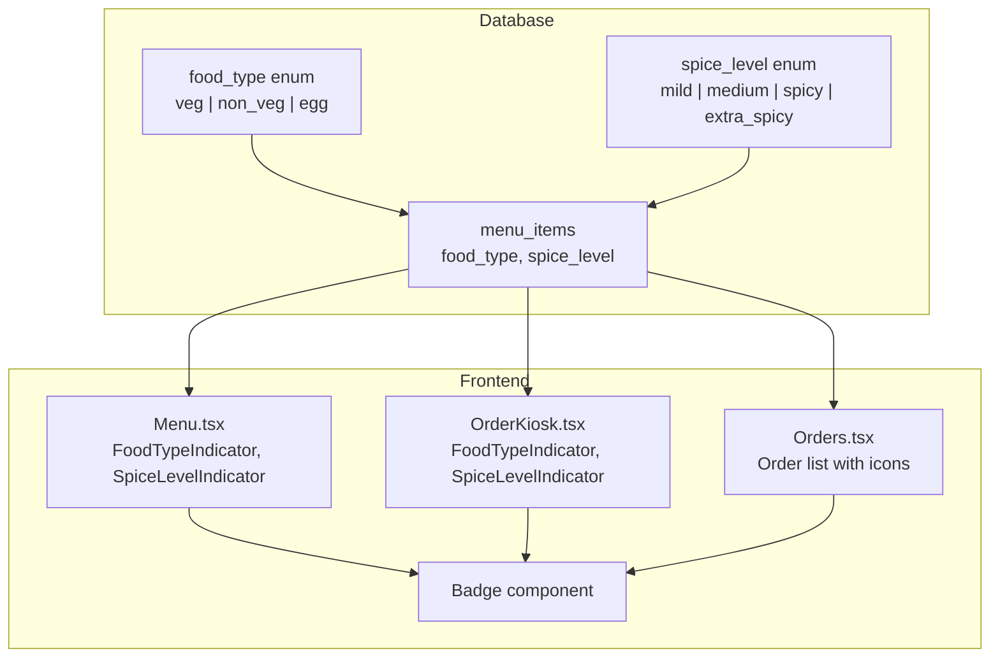
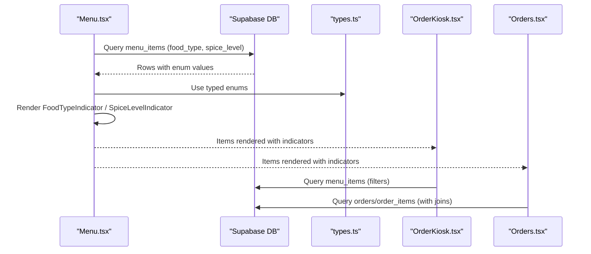
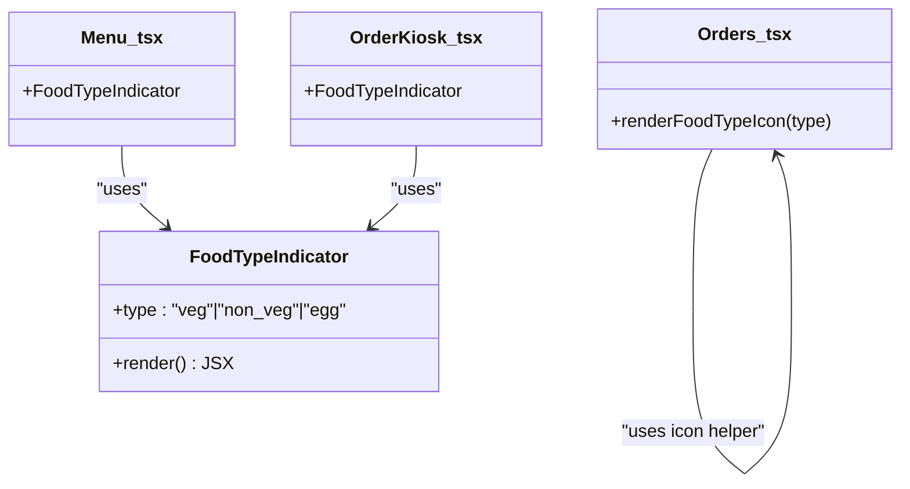
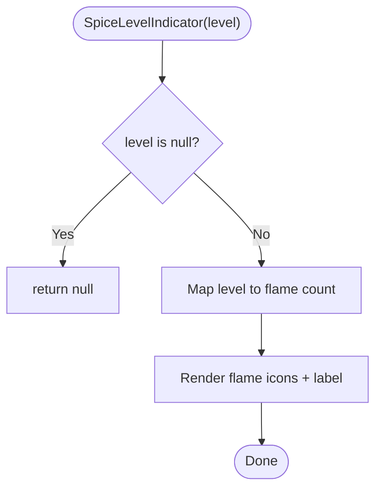
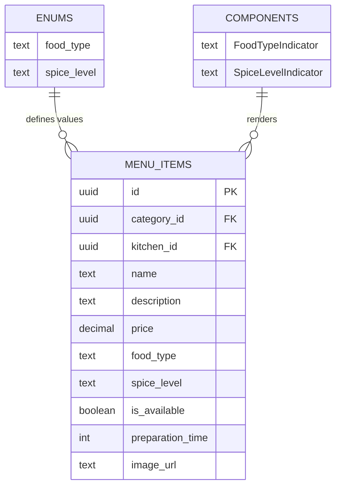

# Food Types & Spice Levels

<cite>
**Referenced Files in This Document**
- [Menu.tsx](file://src/pages/dashboard/Menu.tsx)
- [OrderKiosk.tsx](file://src/pages/dashboard/OrderKiosk.tsx)
- [Orders.tsx](file://src/pages/dashboard/Orders.tsx)
- [badge.tsx](file://src/components/ui/badge.tsx)
- [types.ts](file://src/integrations/supabase/types.ts)
- [20251206042902_fc2b1d91-eb8e-4750-90c3-95b7e0feb6ba.sql](file://supabase/migrations/20251206042902_fc2b1d91-eb8e-4750-90c3-95b7e0feb6ba.sql)
- [20251206062448_4e2d7da9-9519-48ae-9d6c-bb1c994ed84a.sql](file://supabase/migrations/20251206062448_4e2d7da9-9519-48ae-9d6c-bb1c994ed84a.sql)
- [sqliteLanServer.ts](file://electron/services/sqliteLanServer.ts)
</cite>

## Table of Contents
1. [Introduction](#introduction)
2. [Project Structure](#project-structure)
3. [Core Components](#core-components)
4. [Architecture Overview](#architecture-overview)
5. [Detailed Component Analysis](#detailed-component-analysis)
6. [Dependency Analysis](#dependency-analysis)
7. [Performance Considerations](#performance-considerations)
8. [Troubleshooting Guide](#troubleshooting-guide)
9. [Conclusion](#conclusion)
10. [Appendices](#appendices)

## Introduction
This document explains how TableFlow Pro manages food types and spice levels across the menu and ordering interfaces. It covers:
- Three food type classifications: vegetarian, non-vegetarian, and egg
- Four spice level categories: mild, medium, spicy, extra spicy
- Visual indicators and color coding
- Integration in menu management, order kiosk, and orders screens
- Practical configuration examples and recommendations
- Accessibility, internationalization, and customization considerations

## Project Structure
Food type and spice level data are defined in Supabase enums and persisted in the database. The frontend components render these values consistently across:
- Menu management screen for creating/editing items
- Order kiosk for customer ordering
- Orders screen for staff operations

**Diagram sources**
- [20251206042902_fc2b1d91-eb8e-4750-90c3-95b7e0feb6ba.sql:3-4](file://supabase/migrations/20251206042902_fc2b1d91-eb8e-4750-90c3-95b7e0feb6ba.sql#L3-L4)
- [Menu.tsx:41-54](file://src/pages/dashboard/Menu.tsx#L41-L54)
- [OrderKiosk.tsx:72-82](file://src/pages/dashboard/OrderKiosk.tsx#L72-L82)
- [Orders.tsx:79-87](file://src/pages/dashboard/Orders.tsx#L79-L87)
- [badge.tsx:1-30](file://src/components/ui/badge.tsx#L1-L30)

**Section sources**
- [Menu.tsx:41-54](file://src/pages/dashboard/Menu.tsx#L41-L54)
- [OrderKiosk.tsx:72-82](file://src/pages/dashboard/OrderKiosk.tsx#L72-L82)
- [Orders.tsx:79-87](file://src/pages/dashboard/Orders.tsx#L79-L87)
- [20251206042902_fc2b1d91-eb8e-4750-90c3-95b7e0feb6ba.sql:3-4](file://supabase/migrations/20251206042902_fc2b1d91-eb8e-4750-90c3-95b7e0feb6ba.sql#L3-L4)

## Core Components
- Food type indicator: renders a small circle with a border and label for veg/non-veg/egg
- Spice level indicator: renders flame icons and a short label for mild/medium/spicy/extra spicy
- Badge component: used for price tags and secondary labels

Implementation highlights:
- FoodTypeIndicator and SpiceLevelIndicator are defined in Menu.tsx and reused in OrderKiosk.tsx
- The Orders screen displays food type icons and spice indicators in order lists
- Enums are defined in Supabase and typed in the frontend

**Section sources**
- [Menu.tsx:61-98](file://src/pages/dashboard/Menu.tsx#L61-L98)
- [OrderKiosk.tsx:109-136](file://src/pages/dashboard/OrderKiosk.tsx#L109-L136)
- [Orders.tsx:553-557](file://src/pages/dashboard/Orders.tsx#L553-L557)
- [Orders.tsx:733-740](file://src/pages/dashboard/Orders.tsx#L733-L740)
- [badge.tsx:1-30](file://src/components/ui/badge.tsx#L1-L30)

## Architecture Overview
The system stores food type and spice level as database enums and exposes them through the Supabase client. Frontend components consume these values to render visual indicators.

**Diagram sources**
- [Menu.tsx:168-184](file://src/pages/dashboard/Menu.tsx#L168-L184)
- [OrderKiosk.tsx:254-274](file://src/pages/dashboard/OrderKiosk.tsx#L254-L274)
- [Orders.tsx:177-210](file://src/pages/dashboard/Orders.tsx#L177-L210)
- [types.ts:679-684](file://src/integrations/supabase/types.ts#L679-L684)

## Detailed Component Analysis

### Food Type Indicators
- Visual representation: a small bordered circle filled with a color-coded dot
- Color coding:
  - Vegetarian: success color
  - Non-vegetarian: destructive color
  - Egg: warning color
- Labels: short textual labels for quick recognition

Integration points:
- Menu.tsx: inline indicators on menu cards
- OrderKiosk.tsx: compact indicators in item rows
- Orders.tsx: icons in order item lists

**Diagram sources**
- [Menu.tsx:61-77](file://src/pages/dashboard/Menu.tsx#L61-L77)
- [OrderKiosk.tsx:109-122](file://src/pages/dashboard/OrderKiosk.tsx#L109-L122)
- [Orders.tsx:553-557](file://src/pages/dashboard/Orders.tsx#L553-L557)

**Section sources**
- [Menu.tsx:61-77](file://src/pages/dashboard/Menu.tsx#L61-L77)
- [OrderKiosk.tsx:109-122](file://src/pages/dashboard/OrderKiosk.tsx#L109-L122)
- [Orders.tsx:553-557](file://src/pages/dashboard/Orders.tsx#L553-L557)

### Spice Level Indicators
- Visual representation: flame icons scaled by intensity
- Categories:
  - Mild: 1 flame
  - Medium: 2 flames
  - Spicy: 3 flames
  - Extra Spicy: 4 flames
- Labels: short labels appended to flame icons

Integration points:
- Menu.tsx: inline indicators on menu cards
- OrderKiosk.tsx: compact indicators in item rows
- Orders.tsx: flame icons in order item lists

**Diagram sources**
- [Menu.tsx:79-98](file://src/pages/dashboard/Menu.tsx#L79-L98)
- [OrderKiosk.tsx:124-136](file://src/pages/dashboard/OrderKiosk.tsx#L124-L136)
- [Orders.tsx:733-740](file://src/pages/dashboard/Orders.tsx#L733-L740)

**Section sources**
- [Menu.tsx:79-98](file://src/pages/dashboard/Menu.tsx#L79-L98)
- [OrderKiosk.tsx:124-136](file://src/pages/dashboard/OrderKiosk.tsx#L124-L136)
- [Orders.tsx:733-740](file://src/pages/dashboard/Orders.tsx#L733-L740)

### Menu Management Screen
- Form fields for food type and spice level
- Validation and persistence via offline-aware mutations
- Display of indicators alongside item details

Key UI elements:
- Food type selection with visual swatches
- Spice level selection with emoji-enhanced labels
- Inline indicators on menu cards

**Section sources**
- [Menu.tsx:635-682](file://src/pages/dashboard/Menu.tsx#L635-L682)
- [Menu.tsx:770-795](file://src/pages/dashboard/Menu.tsx#L770-L795)

### Order Kiosk Screen
- Displays menu items with food type and spice indicators
- Supports adding items to cart and submitting orders
- Uses compact indicators suitable for touch interfaces

**Section sources**
- [OrderKiosk.tsx:254-274](file://src/pages/dashboard/OrderKiosk.tsx#L254-L274)
- [OrderKiosk.tsx:109-136](file://src/pages/dashboard/OrderKiosk.tsx#L109-L136)

### Orders Screen
- Shows order items with food type icons and optional spice indicators
- Supports order status transitions and billing

**Section sources**
- [Orders.tsx:588-599](file://src/pages/dashboard/Orders.tsx#L588-L599)
- [Orders.tsx:733-740](file://src/pages/dashboard/Orders.tsx#L733-L740)

## Dependency Analysis
- Database enums define food_type and spice_level
- Frontend types reflect these enums
- Components depend on these enums for rendering

**Diagram sources**
- [20251206042902_fc2b1d91-eb8e-4750-90c3-95b7e0feb6ba.sql:69-82](file://supabase/migrations/20251206042902_fc2b1d91-eb8e-4750-90c3-95b7e0feb6ba.sql#L69-L82)
- [types.ts:221-263](file://src/integrations/supabase/types.ts#L221-L263)
- [Menu.tsx:41-54](file://src/pages/dashboard/Menu.tsx#L41-L54)

**Section sources**
- [20251206042902_fc2b1d91-eb8e-4750-90c3-95b7e0feb6ba.sql:3-4](file://supabase/migrations/20251206042902_fc2b1d91-eb8e-4750-90c3-95b7e0feb6ba.sql#L3-L4)
- [types.ts:679-684](file://src/integrations/supabase/types.ts#L679-L684)
- [Menu.tsx:41-54](file://src/pages/dashboard/Menu.tsx#L41-L54)

## Performance Considerations
- Rendering indicators is lightweight; flame counts are small integers
- Offline-first architecture ensures smooth UX when network is unavailable
- Local SQLite caching in Electron mode reduces repeated network calls

[No sources needed since this section provides general guidance]

## Troubleshooting Guide
Common issues and resolutions:
- Missing or unexpected indicators
  - Verify enum values are set on menu items
  - Confirm components are passing the correct props
- Offline data inconsistencies
  - Check local SQLite tables for menu items and enums
- Order display discrepancies
  - Ensure order queries join menu items to fetch food_type and spice_level

**Section sources**
- [sqliteLanServer.ts:346-360](file://electron/services/sqliteLanServer.ts#L346-L360)
- [Menu.tsx:168-184](file://src/pages/dashboard/Menu.tsx#L168-L184)
- [OrderKiosk.tsx:254-274](file://src/pages/dashboard/OrderKiosk.tsx#L254-L274)
- [Orders.tsx:177-210](file://src/pages/dashboard/Orders.tsx#L177-L210)

## Conclusion
TableFlow Pro’s food type and spice level system provides clear, consistent visual cues across the menu and ordering experiences. The implementation leverages database enums and reusable UI components to ensure accuracy and maintainability. The approach supports practical configurations, customer communication, and operational workflows while remaining extensible for future enhancements.

[No sources needed since this section summarizes without analyzing specific files]

## Appendices

### Practical Configuration Examples
- Vegetarian items
  - Set food_type to “veg”
  - Recommended spice levels: mild or medium for broad appeal
- Non-vegetarian items
  - Set food_type to “non_veg”
  - Recommended spice levels: medium or spicy for flavor balance
- Egg-containing items
  - Set food_type to “egg”
  - Recommended spice levels: mild to medium for sensitive palates
- Spice level recommendations
  - Mild: safe for children and mild heat-sensitive customers
  - Medium: balanced for most adults
  - Spicy: for heat-tolerant customers
  - Extra Spicy: for experienced spice lovers

[No sources needed since this section provides general guidance]

### Accessibility Considerations
- Prefer color combinations with sufficient contrast
- Include textual labels alongside icons for screen readers
- Avoid conveying critical information using color alone
- Ensure flame icons are accompanied by readable labels

[No sources needed since this section provides general guidance]

### Internationalization and Localization
- Food type labels are currently short and concise
- Consider translating labels in localized builds
- Ensure enum values remain consistent across locales

[No sources needed since this section provides general guidance]

### Customization Options
- Restaurant-specific dietary categories
  - Current schema defines three food types
  - Extend database enums and frontend components to support additional categories
- Custom spice level descriptors
  - Modify labels and flame counts in indicator components
- Branding and theming
  - Adjust colors and styles to match brand guidelines

[No sources needed since this section provides general guidance]