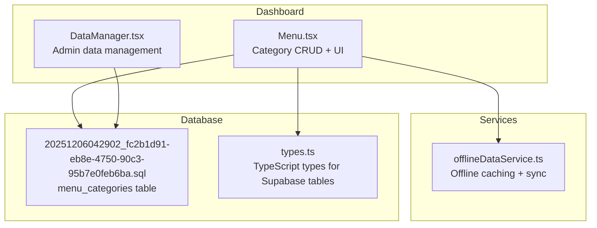
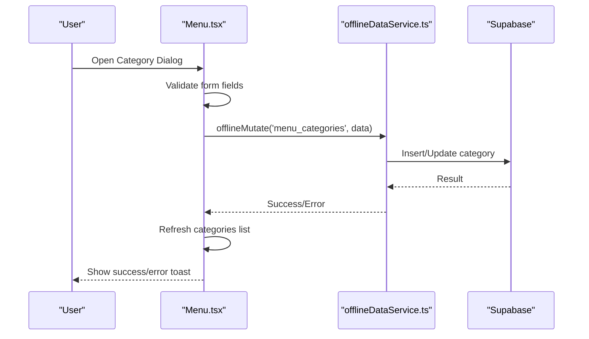
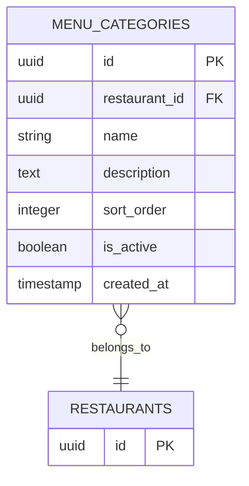
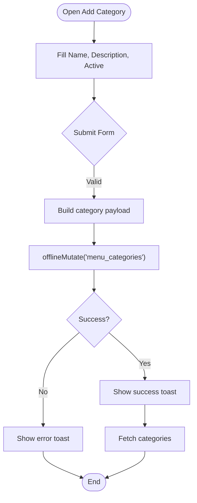
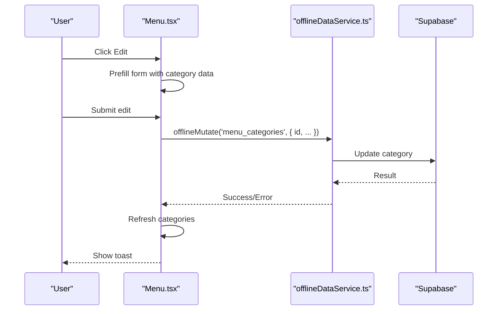
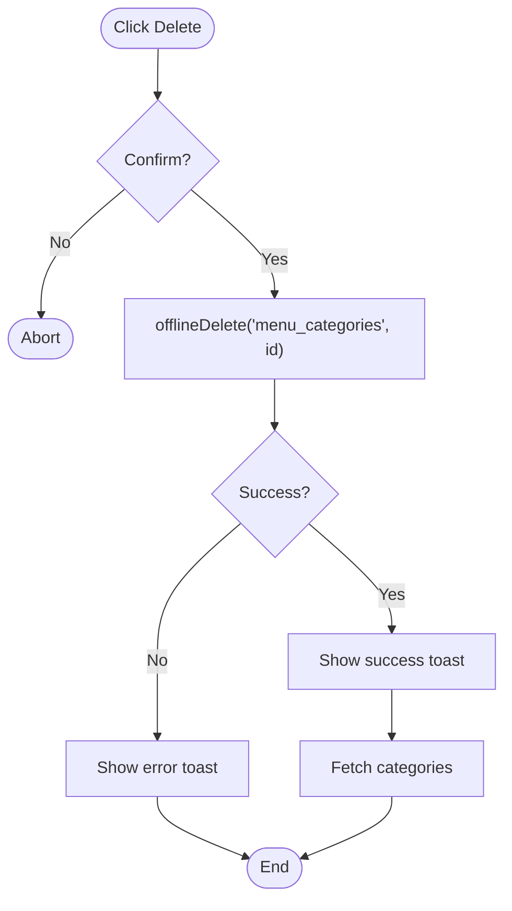
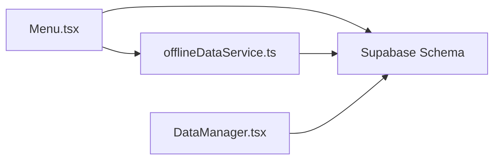

# Menu Categories

<cite>
**Referenced Files in This Document**
- [Menu.tsx](file://src/pages/dashboard/Menu.tsx)
- [DataManager.tsx](file://src/pages/dashboard/DataManager.tsx)
- [offlineDataService.ts](file://src/services/offlineDataService.ts)
- [20251206042902_fc2b1d91-eb8e-4750-90c3-95b7e0feb6ba.sql](file://supabase/migrations/20251206042902_fc2b1d91-eb8e-4750-90c3-95b7e0feb6ba.sql)
- [types.ts](file://src/integrations/supabase/types.ts)
- [OrderKiosk.tsx](file://src/pages/dashboard/OrderKiosk.tsx)
</cite>

## Table of Contents
1. [Introduction](#introduction)
2. [Project Structure](#project-structure)
3. [Core Components](#core-components)
4. [Architecture Overview](#architecture-overview)
5. [Detailed Component Analysis](#detailed-component-analysis)
6. [Dependency Analysis](#dependency-analysis)
7. [Performance Considerations](#performance-considerations)
8. [Troubleshooting Guide](#troubleshooting-guide)
9. [Conclusion](#conclusion)

## Introduction
This document explains the menu categories management system in TableFlow Pro. It covers how categories are created, edited, and deleted, how form validation works, how active/inactive status is managed, and how sorting is handled. It also documents the category data model, the category selection interface, category cards with visual indicators, and integration with menu items. Additional topics include category visibility controls, search functionality, and performance considerations for large category lists.

## Project Structure
The menu categories feature is primarily implemented in the dashboard’s Menu page, with supporting infrastructure for offline data handling and database schema definitions.

**Diagram sources**
- [Menu.tsx:100-844](file://src/pages/dashboard/Menu.tsx#L100-L844)
- [offlineDataService.ts:151-361](file://src/services/offlineDataService.ts#L151-L361)
- [20251206042902_fc2b1d91-eb8e-4750-90c3-95b7e0feb6ba.sql:57-66](file://supabase/migrations/20251206042902_fc2b1d91-eb8e-4750-90c3-95b7e0feb6ba.sql#L57-L66)
- [types.ts:183-220](file://src/integrations/supabase/types.ts#L183-L220)

**Section sources**
- [Menu.tsx:100-844](file://src/pages/dashboard/Menu.tsx#L100-L844)
- [offlineDataService.ts:151-361](file://src/services/offlineDataService.ts#L151-L361)
- [20251206042902_fc2b1d91-eb8e-4750-90c3-95b7e0feb6ba.sql:57-66](file://supabase/migrations/20251206042902_fc2b1d91-eb8e-4750-90c3-95b7e0feb6ba.sql#L57-L66)
- [types.ts:183-220](file://src/integrations/supabase/types.ts#L183-L220)

## Core Components
- Category CRUD in the Menu page:
  - Creation and editing via a modal dialog with form fields for name, description, and active status.
  - Deletion with confirmation and cascading removal of associated menu items.
  - Sorting is handled by assigning a sequential sort_order during creation and ordering by sort_order when displaying categories.
- Offline data handling:
  - Queries, mutations, and deletes are routed through an offline service that supports local SQLite storage and LAN/cloud modes.
- Database schema:
  - The menu_categories table defines the category model with restaurant scoping, active flag, and sort order.

**Section sources**
- [Menu.tsx:197-273](file://src/pages/dashboard/Menu.tsx#L197-L273)
- [offlineDataService.ts:151-361](file://src/services/offlineDataService.ts#L151-L361)
- [20251206042902_fc2b1d91-eb8e-4750-90c3-95b7e0feb6ba.sql:57-66](file://supabase/migrations/20251206042902_fc2b1d91-eb8e-4750-90c3-95b7e0feb6ba.sql#L57-L66)

## Architecture Overview
The category management flow integrates UI, offline data services, and database operations.

**Diagram sources**
- [Menu.tsx:217-257](file://src/pages/dashboard/Menu.tsx#L217-L257)
- [offlineDataService.ts:220-287](file://src/services/offlineDataService.ts#L220-L287)

## Detailed Component Analysis

### Category Data Model
The category entity is defined in both the UI and the database schema.

- Fields:
  - id: Unique identifier
  - restaurant_id: Links category to a restaurant
  - name: Required text
  - description: Optional text
  - is_active: Boolean flag controlling visibility
  - sort_order: Integer used for ordering
  - created_at: Timestamp

- TypeScript types:
  - The Supabase types define row, insert, and update shapes for menu_categories.

- Database schema:
  - The migration creates the menu_categories table with the above fields and enforces foreign key constraints.

**Diagram sources**
- [20251206042902_fc2b1d91-eb8e-4750-90c3-95b7e0feb6ba.sql:57-66](file://supabase/migrations/20251206042902_fc2b1d91-eb8e-4750-90c3-95b7e0feb6ba.sql#L57-L66)
- [types.ts:183-220](file://src/integrations/supabase/types.ts#L183-L220)

**Section sources**
- [types.ts:183-220](file://src/integrations/supabase/types.ts#L183-L220)
- [20251206042902_fc2b1d91-eb8e-4750-90c3-95b7e0feb6ba.sql:57-66](file://supabase/migrations/20251206042902_fc2b1d91-eb8e-4750-90c3-95b7e0feb6ba.sql#L57-L66)

### Category Creation Workflow
- Form fields:
  - Name (required)
  - Description (optional)
  - Active (boolean switch)
- Validation:
  - The form requires a name. The UI applies HTML5 required attributes on the name field.
- Persistence:
  - On submit, the handler constructs category data including restaurant_id, name, description, is_active, and sort_order.
  - Uses offlineMutate to persist to the database.
  - After success, resets the form, closes the dialog, and refreshes data.

**Diagram sources**
- [Menu.tsx:217-257](file://src/pages/dashboard/Menu.tsx#L217-L257)

**Section sources**
- [Menu.tsx:217-257](file://src/pages/dashboard/Menu.tsx#L217-L257)

### Category Editing Workflow
- Pre-population:
  - When opening the edit dialog, the form is prefilled with the selected category’s name, description, and active status.
- Update logic:
  - The handler sends an update request with the category id included.
  - Uses offlineMutate to update the record.
  - On success, shows a success toast and refreshes the list.

**Diagram sources**
- [Menu.tsx:205-257](file://src/pages/dashboard/Menu.tsx#L205-L257)
- [offlineDataService.ts:220-287](file://src/services/offlineDataService.ts#L220-L287)

**Section sources**
- [Menu.tsx:205-257](file://src/pages/dashboard/Menu.tsx#L205-L257)

### Category Deletion Workflow
- Confirmation:
  - The UI prompts for confirmation before deleting a category.
- Cascade behavior:
  - The backend deletes the category; menu items in that category are also removed due to foreign key constraints.
- Persistence:
  - Uses offlineDelete to remove the category.
  - On success, shows a success toast and refreshes the list.

**Diagram sources**
- [Menu.tsx:259-273](file://src/pages/dashboard/Menu.tsx#L259-L273)
- [offlineDataService.ts:295-347](file://src/services/offlineDataService.ts#L295-L347)

**Section sources**
- [Menu.tsx:259-273](file://src/pages/dashboard/Menu.tsx#L259-L273)

### Active/Inactive Status Management
- UI indicator:
  - Each category card displays an active/inactive badge reflecting is_active.
- Toggle behavior:
  - The active switch in the category form toggles the is_active flag during creation/edit.
- Visibility:
  - The UI renders category cards differently based on is_active (visual styling and badge text).

**Section sources**
- [Menu.tsx:516-518](file://src/pages/dashboard/Menu.tsx#L516-L518)
- [Menu.tsx:444-451](file://src/pages/dashboard/Menu.tsx#L444-L451)

### Sorting Functionality
- Initial sort_order:
  - When creating a category, sort_order is set to the current number of categories (sequential).
- Display order:
  - Categories are fetched and ordered by sort_order ascending in the UI.
- Note:
  - The current implementation assigns sort_order sequentially. There is no explicit drag-and-drop reordering UI shown in the referenced code.

**Section sources**
- [Menu.tsx:227-239](file://src/pages/dashboard/Menu.tsx#L227-L239)
- [Menu.tsx:139-142](file://src/pages/dashboard/Menu.tsx#L139-L142)

### Category Selection Interface
- Filtering:
  - The menu items tab includes a category filter dropdown that allows users to show items from a specific category or all categories.
- Integration:
  - The category list is used to populate the filter options.

**Section sources**
- [Menu.tsx:557-567](file://src/pages/dashboard/Menu.tsx#L557-L567)

### Category Cards with Visual Indicators
- Visual elements:
  - Each category card shows:
    - An icon indicating active/inactive state
    - A badge for active/inactive status
    - A count of items in the category
  - Hover actions reveal edit and delete buttons.

**Section sources**
- [Menu.tsx:504-549](file://src/pages/dashboard/Menu.tsx#L504-L549)

### Bulk Operations
- Current state:
  - The referenced code does not implement bulk operations for categories (e.g., multi-select delete).
  - Bulk operations could be added by extending the UI to support selecting multiple categories and invoking batch delete operations.

[No sources needed since this section provides general guidance]

### Practical Examples: Category Setup for Different Restaurant Types
- Casual dining:
  - Typical categories: Starters, Main Courses, Desserts, Beverages.
  - Use is_active to hide seasonal or temporary categories.
- Fine dining:
  - Categories: Appetizers, Fish Course, Meat Course, Cheese Board, Desserts, Cocktails.
  - Use sort_order to reflect the course sequence.
- Quick-service:
  - Categories: Burgers, Wraps, Sides, Drinks, Desserts.
  - Keep categories minimal and highly visible.

[No sources needed since this section provides general guidance]

### Category Organization Best Practices
- Keep categories meaningful and distinct.
- Use is_active to temporarily hide categories (e.g., seasonal items).
- Maintain a logical sort_order to guide customer flow.
- Use descriptions sparingly for clarity.

[No sources needed since this section provides general guidance]

### Integration with Menu Items
- Relationship:
  - Menu items belong to a category via category_id.
- Impact of category deletion:
  - Deleting a category removes all associated menu items due to foreign key constraints.
- Filtering:
  - The menu items tab filters items by the selected category.

**Section sources**
- [20251206042902_fc2b1d91-eb8e-4750-90c3-95b7e0feb6ba.sql:69-82](file://supabase/migrations/20251206042902_fc2b1d91-eb8e-4750-90c3-95b7e0feb6ba.sql#L69-L82)
- [Menu.tsx:168-185](file://src/pages/dashboard/Menu.tsx#L168-L185)

### Category Visibility Controls
- Restaurant-scoped:
  - Categories are scoped to a restaurant via restaurant_id.
- Access control:
  - Row-level security policies ensure users can only access categories belonging to their restaurant.

**Section sources**
- [20251206042902_fc2b1d91-eb8e-4750-90c3-95b7e0feb6ba.sql:150-154](file://supabase/migrations/20251206042902_fc2b1d91-eb8e-4750-90c3-95b7e0feb6ba.sql#L150-L154)

### Search Functionality
- Category-level search:
  - The order kiosk demonstrates a category filter bar that lets users quickly navigate between categories.
- Implementation pattern:
  - The pattern uses a category selector and a search input to filter items by category and text.

**Section sources**
- [OrderKiosk.tsx:1358-1390](file://src/pages/dashboard/OrderKiosk.tsx#L1358-L1390)

## Dependency Analysis
The category management module depends on UI components, offline data services, and the database schema.

**Diagram sources**
- [Menu.tsx:100-844](file://src/pages/dashboard/Menu.tsx#L100-L844)
- [offlineDataService.ts:151-361](file://src/services/offlineDataService.ts#L151-L361)
- [DataManager.tsx:124-139](file://src/pages/dashboard/DataManager.tsx#L124-L139)

**Section sources**
- [Menu.tsx:100-844](file://src/pages/dashboard/Menu.tsx#L100-L844)
- [offlineDataService.ts:151-361](file://src/services/offlineDataService.ts#L151-L361)
- [DataManager.tsx:124-139](file://src/pages/dashboard/DataManager.tsx#L124-L139)

## Performance Considerations
- Offline-first architecture:
  - The offline service reads from local SQLite first (in Electron/LAN modes) and falls back to cloud when needed, reducing latency and enabling offline operation.
- Efficient queries:
  - Categories are fetched with ordering by sort_order and filtered by restaurant_id to minimize client-side filtering.
- Batch loading:
  - Categories and items are fetched concurrently to reduce load time.
- Large lists:
  - For very large category lists, consider virtualized rendering of category cards and lazy-loading of item counts.

**Section sources**
- [offlineDataService.ts:151-211](file://src/services/offlineDataService.ts#L151-L211)
- [Menu.tsx:131-191](file://src/pages/dashboard/Menu.tsx#L131-L191)

## Troubleshooting Guide
- Category creation fails:
  - Verify the restaurant context is set and the name field is not empty.
  - Check the offline service logs for SQLite availability and network connectivity.
- Category not appearing:
  - Ensure the restaurant_id filter is applied and categories are ordered by sort_order.
- Deletion issues:
  - Confirm the category has no items remaining (or rely on cascade delete).
  - Check offline service logs for pending_sync/pending_delete states.

**Section sources**
- [Menu.tsx:197-273](file://src/pages/dashboard/Menu.tsx#L197-L273)
- [offlineDataService.ts:295-347](file://src/services/offlineDataService.ts#L295-L347)

## Conclusion
TableFlow Pro’s category management provides a robust, offline-capable system for organizing menus. It supports creation, editing, deletion, active/inactive toggling, and sorting. Categories integrate tightly with menu items and benefit from restaurant-scoped visibility and RLS policies. For large datasets, leveraging the offline-first architecture and considering UI enhancements (e.g., category search and potential bulk operations) can improve usability and performance.