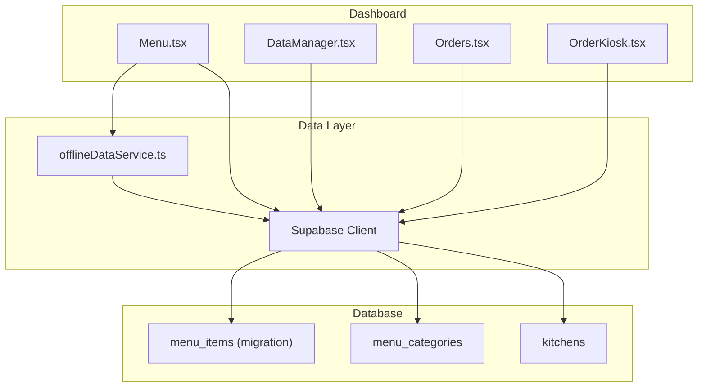
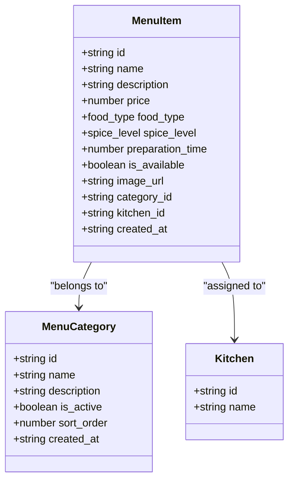
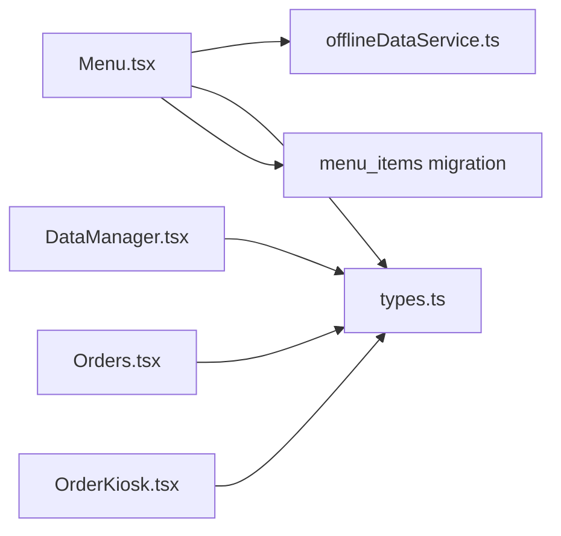

# Menu Items

<cite>
**Referenced Files in This Document**
- [Menu.tsx](file://src/pages/dashboard/Menu.tsx)
- [types.ts](file://src/integrations/supabase/types.ts)
- [20251206042902_fc2b1d91-eb8e-4750-90c3-95b7e0feb6ba.sql](file://supabase/migrations/20251206042902_fc2b1d91-eb8e-4750-90c3-95b7e0feb6ba.sql)
- [offlineDataService.ts](file://src/services/offlineDataService.ts)
- [DataManager.tsx](file://src/pages/dashboard/DataManager.tsx)
- [Orders.tsx](file://src/pages/dashboard/Orders.tsx)
- [OrderKiosk.tsx](file://src/pages/dashboard/OrderKiosk.tsx)
</cite>

## Table of Contents
1. [Introduction](#introduction)
2. [Project Structure](#project-structure)
3. [Core Components](#core-components)
4. [Architecture Overview](#architecture-overview)
5. [Detailed Component Analysis](#detailed-component-analysis)
6. [Dependency Analysis](#dependency-analysis)
7. [Performance Considerations](#performance-considerations)
8. [Troubleshooting Guide](#troubleshooting-guide)
9. [Conclusion](#conclusion)
10. [Appendices](#appendices)

## Introduction
This document provides comprehensive documentation for menu items management in TableFlow Pro. It covers item creation, modification, and deletion workflows; the item data model and validation rules; food type indicators, spice level visualization, and preparation time tracking; practical configuration examples; categorization and kitchen assignment; bulk operations; and integration with the order management system. It also documents search, filtering, and sorting capabilities across the UI.

## Project Structure
Menu items are managed primarily in the Menu page, with supporting data definitions in Supabase types and migrations, offline-first persistence via the offline data service, and additional views for order intake and kiosk usage.



**Diagram sources**
- [Menu.tsx:100-844](file://src/pages/dashboard/Menu.tsx#L100-L844)
- [offlineDataService.ts:151-347](file://src/services/offlineDataService.ts#L151-L347)
- [20251206042902_fc2b1d91-eb8e-4750-90c3-95b7e0feb6ba.sql:68-82](file://supabase/migrations/20251206042902_fc2b1d91-eb8e-4750-90c3-95b7e0feb6ba.sql#L68-L82)

**Section sources**
- [Menu.tsx:100-844](file://src/pages/dashboard/Menu.tsx#L100-L844)
- [offlineDataService.ts:151-347](file://src/services/offlineDataService.ts#L151-L347)
- [20251206042902_fc2b1d91-eb8e-4750-90c3-95b7e0feb6ba.sql:68-82](file://supabase/migrations/20251206042902_fc2b1d91-eb8e-4750-90c3-95b7e0feb6ba.sql#L68-L82)

## Core Components
- Menu page: Full CRUD for menu items and categories, kitchen assignment, availability toggling, and category filtering.
- Data types and enums: Strongly typed item model and enum definitions for food type and spice level.
- Offline data service: SQLite-first offline persistence with fallback to Supabase, enabling offline-capable menu management.
- DataManager: Generic table editor with search/filtering for menu items and categories.
- Order intake and kiosks: Consumers of menu items for placing orders and displaying items with food type/spice indicators.

**Section sources**
- [Menu.tsx:32-59](file://src/pages/dashboard/Menu.tsx#L32-L59)
- [types.ts:679-684](file://src/integrations/supabase/types.ts#L679-L684)
- [offlineDataService.ts:151-347](file://src/services/offlineDataService.ts#L151-L347)
- [DataManager.tsx:140-161](file://src/pages/dashboard/DataManager.tsx#L140-L161)
- [Orders.tsx:79-109](file://src/pages/dashboard/Orders.tsx#L79-L109)

## Architecture Overview
Menu item management follows an offline-first pattern:
- UI reads from local cache when available (SQLite/Electron LAN), falls back to Supabase on web.
- Mutations are written locally first and synchronized to the cloud later.
- The menu page orchestrates category and item CRUD, while DataManager provides a generic editor for advanced bulk operations.

```mermaid
sequenceDiagram
participant UI as "Menu UI"
participant OFF as "offlineDataService"
participant LAN as "LAN/SQLite"
participant SUP as "Supabase"
UI->>OFF : offlineQuery(menu_items)
alt LAN connected
OFF->>LAN : query menu_items
LAN-->>OFF : data
else Web
OFF->>SUP : select menu_items
SUP-->>OFF : data
end
OFF-->>UI : {data, fromCache}
UI->>OFF : offlineMutate(menu_items, payload)
alt LAN connected
OFF->>LAN : upsert payload
LAN-->>OFF : success
else Web
OFF->>SUP : insert/update
SUP-->>OFF : success
end
OFF-->>UI : {data, pendingSync?}
```

**Diagram sources**
- [Menu.tsx:128-191](file://src/pages/dashboard/Menu.tsx#L128-L191)
- [offlineDataService.ts:151-347](file://src/services/offlineDataService.ts#L151-L347)

**Section sources**
- [Menu.tsx:128-191](file://src/pages/dashboard/Menu.tsx#L128-L191)
- [offlineDataService.ts:151-347](file://src/services/offlineDataService.ts#L151-L347)

## Detailed Component Analysis

### Data Model and Field Definitions
The menu item entity is defined with TypeScript interfaces and enforced by Supabase enums and migrations.



- Fields:
  - id, name, description, price, food_type, spice_level, preparation_time, is_available, image_url, category_id, kitchen_id, created_at.
- Enums:
  - food_type: veg, non_veg, egg.
  - spice_level: mild, medium, spicy, extra_spicy.

Validation rules observed in code:
- Name and price are required when creating/updating items.
- Category ID is required when creating items.
- Price is parsed as a number; preparation_time defaults to 15 if empty.
- Availability toggles are supported per item.

**Diagram sources**
- [Menu.tsx:32-59](file://src/pages/dashboard/Menu.tsx#L32-L59)
- [types.ts:183-280](file://src/integrations/supabase/types.ts#L183-L280)

**Section sources**
- [Menu.tsx:32-59](file://src/pages/dashboard/Menu.tsx#L32-L59)
- [types.ts:183-280](file://src/integrations/supabase/types.ts#L183-L280)
- [20251206042902_fc2b1d91-eb8e-4750-90c3-95b7e0feb6ba.sql:68-82](file://supabase/migrations/20251206042902_fc2b1d91-eb8e-4750-90c3-95b7e0feb6ba.sql#L68-L82)

### Food Type Indicators
- Visual indicator displays a colored dot representing vegetarian, non-vegetarian, or egg.
- Used in the menu grid and order intake/kiosk screens.

**Section sources**
- [Menu.tsx:61-77](file://src/pages/dashboard/Menu.tsx#L61-L77)
- [Orders.tsx:57-59](file://src/pages/dashboard/Orders.tsx#L57-L59)
- [OrderKiosk.tsx:95-105](file://src/pages/dashboard/OrderKiosk.tsx#L95-L105)

### Spice Level Visualization
- Displays 1–4 flame icons based on level: mild, medium, spicy, extra_spicy.
- Used in menu cards and order intake.

**Section sources**
- [Menu.tsx:79-98](file://src/pages/dashboard/Menu.tsx#L79-L98)
- [Orders.tsx:127-132](file://src/pages/dashboard/Orders.tsx#L127-L132)
- [OrderKiosk.tsx:107-119](file://src/pages/dashboard/OrderKiosk.tsx#L107-L119)

### Preparation Time Tracking
- Preparation time is stored as an integer (minutes) and shown as a clock icon with minutes in the UI.
- Defaults to 15 when empty during creation.

**Section sources**
- [Menu.tsx:48](file://src/pages/dashboard/Menu.tsx#L48)
- [Menu.tsx:684-694](file://src/pages/dashboard/Menu.tsx#L684-L694)
- [Menu.tsx:789-794](file://src/pages/dashboard/Menu.tsx#L789-L794)

### Item Creation, Modification, Deletion
- Creation and update forms capture name, description, price, food type, spice level, prep time, availability, category, and optional kitchen assignment.
- Availability can be toggled inline.
- Deletion prompts are confirmed before removal.

```mermaid
sequenceDiagram
participant User as "User"
participant UI as "Menu UI"
participant OFF as "offlineDataService"
participant SUP as "Supabase"
User->>UI : Open Add/Edit Item
UI->>UI : Validate required fields
UI->>OFF : offlineMutate(menu_items, payload)
alt LAN/Web
OFF->>SUP : insert/update
SUP-->>OFF : success
else Local only
OFF-->>UI : pending_sync
end
OFF-->>UI : success
UI->>UI : Refresh list
```

**Diagram sources**
- [Menu.tsx:275-377](file://src/pages/dashboard/Menu.tsx#L275-L377)
- [offlineDataService.ts:220-287](file://src/services/offlineDataService.ts#L220-L287)

**Section sources**
- [Menu.tsx:275-377](file://src/pages/dashboard/Menu.tsx#L275-L377)
- [offlineDataService.ts:220-287](file://src/services/offlineDataService.ts#L220-L287)

### Availability Management
- Inline toggle switches change is_available per item.
- Visual badges reflect availability status.

**Section sources**
- [Menu.tsx:365-377](file://src/pages/dashboard/Menu.tsx#L365-L377)
- [Menu.tsx:820-832](file://src/pages/dashboard/Menu.tsx#L820-L832)

### Kitchen Assignment Workflow
- Items can be optionally assigned to a kitchen via a select control.
- Kitchens are fetched and filtered by active status for selection.
- The kitchen_id is persisted with the item.

**Section sources**
- [Menu.tsx:104](file://src/pages/dashboard/Menu.tsx#L104)
- [Menu.tsx:696-709](file://src/pages/dashboard/Menu.tsx#L696-L709)
- [20251206042902_fc2b1d91-eb8e-4750-90c3-95b7e0feb6ba.sql:28-36](file://supabase/migrations/20251206042902_fc2b1d91-eb8e-4750-90c3-95b7e0feb6ba.sql#L28-L36)

### Item Categorization
- Items belong to a category via category_id.
- Categories can be created, edited, and deleted; deleting a category cascades to delete its items.
- The menu grid filters items by selected category.

**Section sources**
- [Menu.tsx:32-59](file://src/pages/dashboard/Menu.tsx#L32-L59)
- [Menu.tsx:197-273](file://src/pages/dashboard/Menu.tsx#L197-L273)
- [Menu.tsx:768-770](file://src/pages/dashboard/Menu.tsx#L768-L770)

### Bulk Operations and Data Manager
- DataManager provides a generic table editor for menu_items and menu_categories with:
  - Insert, edit, delete rows.
  - Required field validation.
  - Search/filter across all columns.
  - Numeric conversions for number fields.
- Useful for bulk edits and administrative tasks.

**Section sources**
- [DataManager.tsx:140-161](file://src/pages/dashboard/DataManager.tsx#L140-L161)
- [DataManager.tsx:271-358](file://src/pages/dashboard/DataManager.tsx#L271-L358)

### Integration with Order Management System
- Orders and order_items reference menu items and kitchens.
- Order intake and kiosk screens consume menu items for ordering, displaying food type and spice indicators.
- Order items track quantity, unit price, status, and kitchen assignment.

**Section sources**
- [types.ts:281-341](file://src/integrations/supabase/types.ts#L281-L341)
- [Orders.tsx:79-109](file://src/pages/dashboard/Orders.tsx#L79-L109)
- [OrderKiosk.tsx:1180-1390](file://src/pages/dashboard/OrderKiosk.tsx#L1180-L1390)

### Search, Filtering, and Sorting
- Menu page:
  - Category filter dropdown to show all or items from a specific category.
  - Grid view renders items with name, price, food type, spice level, prep time, and availability.
- DataManager:
  - Global search across all visible columns.
  - Editable and insertable columns with required field enforcement.
- Order intake and kiosk:
  - Search input to filter menu items by name.
  - Category tabs to filter by category.

**Section sources**
- [Menu.tsx:556-567](file://src/pages/dashboard/Menu.tsx#L556-L567)
- [Menu.tsx:768-770](file://src/pages/dashboard/Menu.tsx#L768-L770)
- [DataManager.tsx:360-366](file://src/pages/dashboard/DataManager.tsx#L360-L366)
- [Orders.tsx:704-711](file://src/pages/dashboard/Orders.tsx#L704-L711)
- [OrderKiosk.tsx:1204-1236](file://src/pages/dashboard/OrderKiosk.tsx#L1204-L1236)

## Dependency Analysis
- Menu.tsx depends on:
  - Supabase client for queries and mutations.
  - offlineDataService for offline-first behavior.
  - UI primitives from the shared component library.
- Types and enums are defined centrally and consumed across components.
- DataManager reuses the same Supabase client and column configurations.



**Diagram sources**
- [Menu.tsx:100-844](file://src/pages/dashboard/Menu.tsx#L100-L844)
- [offlineDataService.ts:151-347](file://src/services/offlineDataService.ts#L151-L347)
- [types.ts:679-684](file://src/integrations/supabase/types.ts#L679-L684)
- [20251206042902_fc2b1d91-eb8e-4750-90c3-95b7e0feb6ba.sql:68-82](file://supabase/migrations/20251206042902_fc2b1d91-eb8e-4750-90c3-95b7e0feb6ba.sql#L68-L82)

**Section sources**
- [Menu.tsx:100-844](file://src/pages/dashboard/Menu.tsx#L100-L844)
- [offlineDataService.ts:151-347](file://src/services/offlineDataService.ts#L151-L347)
- [types.ts:679-684](file://src/integrations/supabase/types.ts#L679-L684)
- [20251206042902_fc2b1d91-eb8e-4750-90c3-95b7e0feb6ba.sql:68-82](file://supabase/migrations/20251206042902_fc2b1d91-eb8e-4750-90c3-95b7e0feb6ba.sql#L68-L82)

## Performance Considerations
- Offline-first reduces latency and enables operation without network connectivity.
- Category-scoped queries limit item sets for rendering and filtering.
- Numeric parsing and defaults minimize runtime conversion overhead.
- Consider indexing on frequently filtered columns (category_id, kitchen_id) at the database layer for large datasets.

[No sources needed since this section provides general guidance]

## Troubleshooting Guide
Common issues and resolutions:
- Network errors during mutations: The offline service returns errors; retry after connectivity is restored.
- Empty local cache: The offline service returns empty arrays when SQLite data is unavailable; ensure data is downloaded or online sync is performed.
- Invalid IDs or FK violations: The offline service strips unsupported columns and nullifies invalid foreign keys before syncing.
- Confirmed deletions: Category deletion cascades to items; confirm before proceeding.

**Section sources**
- [offlineDataService.ts:177-184](file://src/services/offlineDataService.ts#L177-L184)
- [offlineDataService.ts:207-210](file://src/services/offlineDataService.ts#L207-L210)
- [offlineDataService.ts:466-493](file://src/services/offlineDataService.ts#L466-L493)
- [Menu.tsx:259-273](file://src/pages/dashboard/Menu.tsx#L259-L273)

## Conclusion
TableFlow Pro’s menu items management combines a robust data model with an offline-first UI, enabling reliable creation, modification, and deletion of menu offerings. Food type and spice level indicators enhance discoverability, while kitchen assignment and categorization streamline operational workflows. Integration with order intake systems ensures seamless consumption of menu data, and DataManager offers powerful bulk-editing capabilities for administrators.

[No sources needed since this section summarizes without analyzing specific files]

## Appendices

### Practical Configuration Examples
- Pricing strategies:
  - Use price tiers aligned with category average pricing.
  - Apply consistent decimal precision (two decimals) as enforced by the schema.
- Cuisine-specific configurations:
  - Assign distinct categories (e.g., “North Indian”, “South Indian”) and set typical prep times.
  - Use spice levels to communicate heat intensity clearly.
- Availability management:
  - Temporarily set is_available to false for seasonal or out-of-stock items.
  - Use kitchen assignment to route orders to appropriate stations.

[No sources needed since this section provides general guidance]