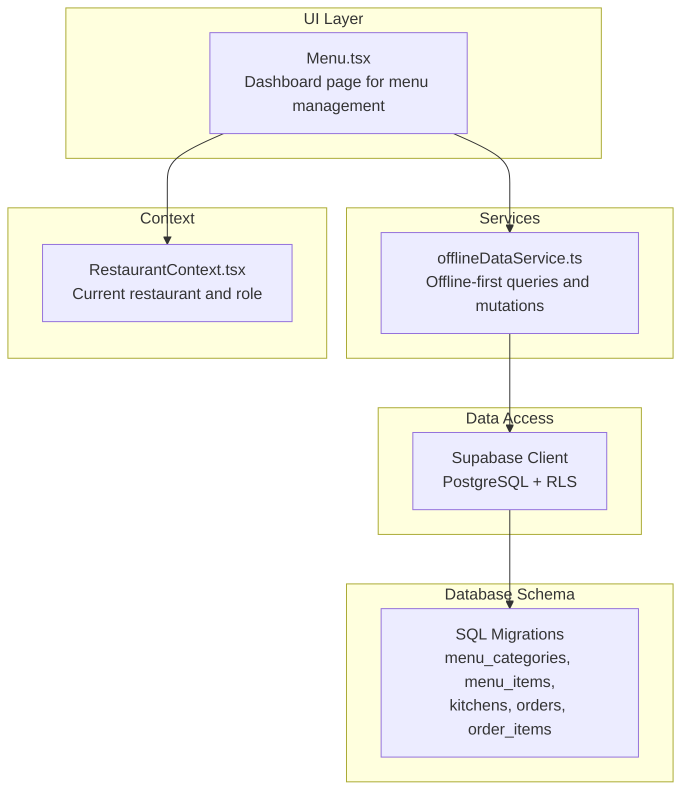
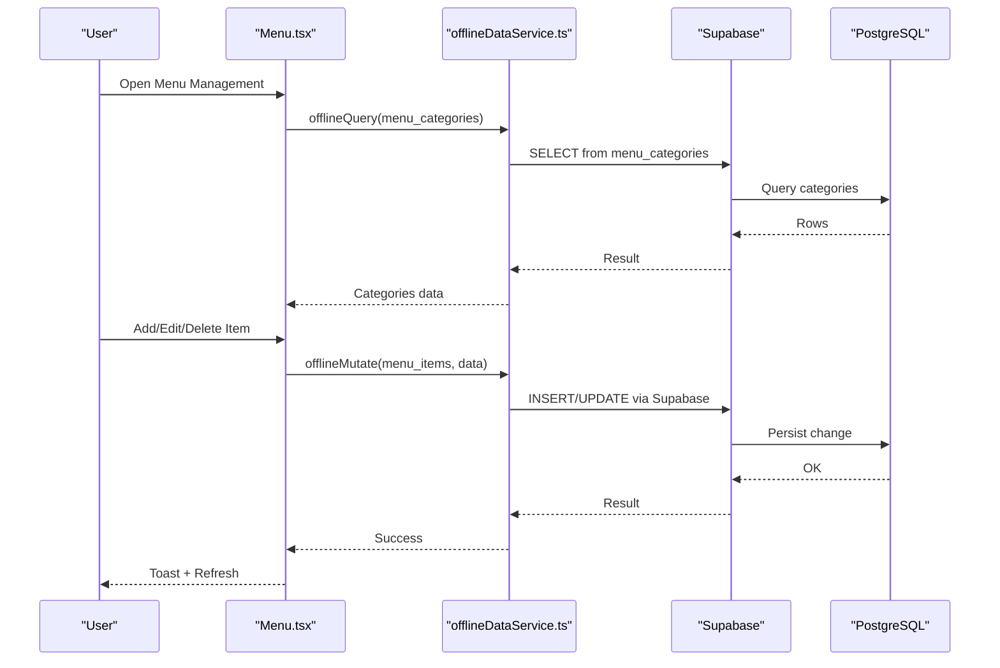
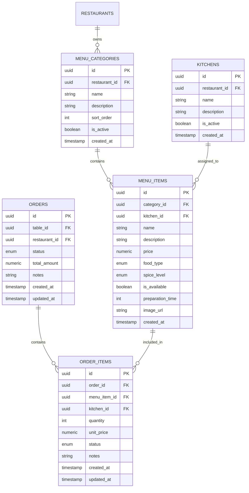
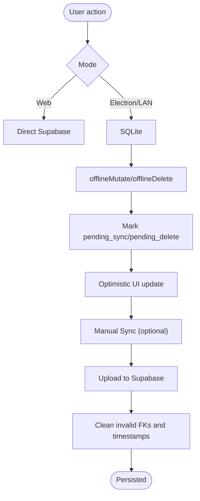
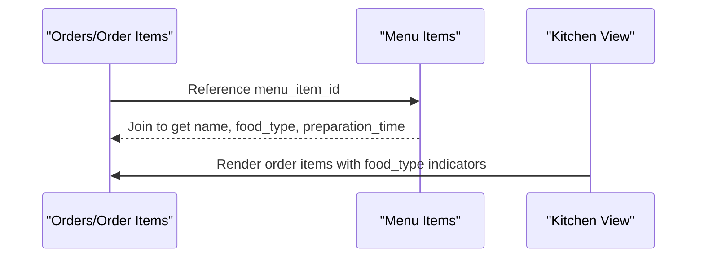
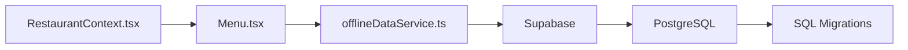

# Menu Management

<cite>
**Referenced Files in This Document**
- [Menu.tsx](file://src/pages/dashboard/Menu.tsx)
- [offlineDataService.ts](file://src/services/offlineDataService.ts)
- [types.ts](file://src/integrations/supabase/types.ts)
- [20251206042902_fc2b1d91-eb8e-4750-90c3-95b7e0feb6ba.sql](file://supabase/migrations/20251206042902_fc2b1d91-eb8e-4750-90c3-95b7e0feb6ba.sql)
- [20251206062448_4e2d7da9-9519-48ae-9d6c-bb1c994ed84a.sql](file://supabase/migrations/20251206062448_4e2d7da9-9519-48ae-9d6c-bb1c994ed84a.sql)
- [20251206081648_ef719884-b181-43d8-832a-02825f1b3a50.sql](file://supabase/migrations/20251206081648_ef719884-b181-43d8-832a-02825f1b3a50.sql)
- [20251212061838_061086f8-bf22-458f-b2e6-20f8199ee7ce.sql](file://supabase/migrations/20251212061838_061086f8-bf22-458f-b2e6-20f8199ee7ce.sql)
- [20260108133558_b2ed5e93-fda3-4022-bc45-a2fe64b46615.sql](file://supabase/migrations/20260108133558_b2ed5e93-fda3-4022-bc45-a2fe64b46615.sql)
- [RestaurantContext.tsx](file://src/contexts/RestaurantContext.tsx)
</cite>

## Table of Contents
1. [Introduction](#introduction)
2. [Project Structure](#project-structure)
3. [Core Components](#core-components)
4. [Architecture Overview](#architecture-overview)
5. [Detailed Component Analysis](#detailed-component-analysis)
6. [Dependency Analysis](#dependency-analysis)
7. [Performance Considerations](#performance-considerations)
8. [Troubleshooting Guide](#troubleshooting-guide)
9. [Conclusion](#conclusion)
10. [Appendices](#appendices)

## Introduction
This document explains the menu management system in TableFlow Pro. It covers how categories and menu items are organized, how food types and spice levels are configured, and how pricing and availability are managed. It also documents the underlying data model, offline-first synchronization, and integration with the order management system. Practical workflows for creating and modifying menu items, bulk operations, versioning, seasonal changes, and promotional pricing are included.

## Project Structure
The menu management feature centers around a single dashboard page that orchestrates category and item CRUD operations, integrates with Supabase for persistence, and supports offline-first behavior. Supporting services provide offline caching and synchronization, while database migrations define the schema and row-level security policies.

**Diagram sources**
- [Menu.tsx:100-195](file://src/pages/dashboard/Menu.tsx#L100-L195)
- [offlineDataService.ts:151-211](file://src/services/offlineDataService.ts#L151-L211)
- [20251206042902_fc2b1d91-eb8e-4750-90c3-95b7e0feb6ba.sql:57-82](file://supabase/migrations/20251206042902_fc2b1d91-eb8e-4750-90c3-95b7e0feb6ba.sql#L57-L82)

**Section sources**
- [Menu.tsx:100-195](file://src/pages/dashboard/Menu.tsx#L100-L195)
- [offlineDataService.ts:151-211](file://src/services/offlineDataService.ts#L151-L211)
- [RestaurantContext.tsx:319-353](file://src/contexts/RestaurantContext.tsx#L319-L353)

## Core Components
- Menu page: Renders categories and menu items, provides forms to create/update/delete, toggles availability, and filters items by category.
- Offline service: Wraps Supabase calls with SQLite-first caching and optional LAN/cloud sync.
- Database schema: Defines enums for food types and spice levels, and tables for categories, items, kitchens, orders, and order items.
- Restaurant context: Supplies the current restaurant and role to enforce access control and scoping.

Key capabilities:
- Create, update, delete menu categories and items.
- Configure food type (vegetarian, non-vegetarian, egg) and spice level (mild to extra spicy).
- Set availability and preparation time per item.
- Toggle availability with a single click.
- View kitchen association per item.
- Offline-first behavior with explicit sync controls.

**Section sources**
- [Menu.tsx:100-195](file://src/pages/dashboard/Menu.tsx#L100-L195)
- [Menu.tsx:217-273](file://src/pages/dashboard/Menu.tsx#L217-L273)
- [Menu.tsx:308-363](file://src/pages/dashboard/Menu.tsx#L308-L363)
- [Menu.tsx:365-377](file://src/pages/dashboard/Menu.tsx#L365-L377)
- [offlineDataService.ts:151-211](file://src/services/offlineDataService.ts#L151-L211)
- [20251206042902_fc2b1d91-eb8e-4750-90c3-95b7e0feb6ba.sql:68-82](file://supabase/migrations/20251206042902_fc2b1d91-eb8e-4750-90c3-95b7e0feb6ba.sql#L68-L82)

## Architecture Overview
The menu management flow combines UI orchestration, offline-first data access, and backend persistence with row-level security.

**Diagram sources**
- [Menu.tsx:128-191](file://src/pages/dashboard/Menu.tsx#L128-L191)
- [Menu.tsx:308-347](file://src/pages/dashboard/Menu.tsx#L308-L347)
- [offlineDataService.ts:220-287](file://src/services/offlineDataService.ts#L220-L287)
- [20251206042902_fc2b1d91-eb8e-4750-90c3-95b7e0feb6ba.sql:68-82](file://supabase/migrations/20251206042902_fc2b1d91-eb8e-4750-90c3-95b7e0feb6ba.sql#L68-L82)

## Detailed Component Analysis

### Data Model and Enums
The schema defines:
- Enumerations for food types and spice levels.
- Tables for menu categories and menu items, kitchens, orders, and order items.
- Row-level security policies scoped to the current restaurant.

**Diagram sources**
- [20251206042902_fc2b1d91-eb8e-4750-90c3-95b7e0feb6ba.sql:57-82](file://supabase/migrations/20251206042902_fc2b1d91-eb8e-4750-90c3-95b7e0feb6ba.sql#L57-L82)
- [20251206042902_fc2b1d91-eb8e-4750-90c3-95b7e0feb6ba.sql:84-108](file://supabase/migrations/20251206042902_fc2b1d91-eb8e-4750-90c3-95b7e0feb6ba.sql#L84-L108)

**Section sources**
- [20251206042902_fc2b1d91-eb8e-4750-90c3-95b7e0feb6ba.sql:1-82](file://supabase/migrations/20251206042902_fc2b1d91-eb8e-4750-90c3-95b7e0feb6ba.sql#L1-L82)
- [types.ts:183-280](file://src/integrations/supabase/types.ts#L183-L280)

### Menu Categories
- Create/edit categories with name, description, activity flag, and sort order.
- Deletion cascades to associated menu items.

Implementation highlights:
- Form state binding and submission handler.
- Offline mutation with optimistic UI updates.
- Fetch categories with ordering by sort order.

**Section sources**
- [Menu.tsx:112-127](file://src/pages/dashboard/Menu.tsx#L112-L127)
- [Menu.tsx:217-273](file://src/pages/dashboard/Menu.tsx#L217-L273)
- [20251206042902_fc2b1d91-eb8e-4750-90c3-95b7e0feb6ba.sql:57-66](file://supabase/migrations/20251206042902_fc2b1d91-eb8e-4750-90c3-95b7e0feb6ba.sql#L57-L66)

### Menu Items
- Create/edit items with name, description, price, food type, spice level, prep time, availability, category, and optional kitchen assignment.
- Toggle availability with a single click.
- Delete items with confirmation.

Implementation highlights:
- Form state binding and submission handler.
- Price and prep time parsing/validation via form inputs.
- Offline mutation with optimistic UI updates.
- Availability toggle mutation.

**Section sources**
- [Menu.tsx:117-126](file://src/pages/dashboard/Menu.tsx#L117-L126)
- [Menu.tsx:289-306](file://src/pages/dashboard/Menu.tsx#L289-L306)
- [Menu.tsx:308-363](file://src/pages/dashboard/Menu.tsx#L308-L363)
- [Menu.tsx:365-377](file://src/pages/dashboard/Menu.tsx#L365-L377)

### Offline-First Behavior
- Queries: SQLite-first in Electron/LAN modes; fallback to Supabase in web mode.
- Mutations: Write to SQLite with pending_sync; deletions soft-delete with pending_delete.
- Sync: Manual push to cloud preserves timestamps and handles FK constraints.

**Diagram sources**
- [offlineDataService.ts:151-211](file://src/services/offlineDataService.ts#L151-L211)
- [offlineDataService.ts:220-287](file://src/services/offlineDataService.ts#L220-L287)
- [offlineDataService.ts:295-347](file://src/services/offlineDataService.ts#L295-L347)
- [offlineDataService.ts:397-541](file://src/services/offlineDataService.ts#L397-L541)

**Section sources**
- [offlineDataService.ts:151-211](file://src/services/offlineDataService.ts#L151-L211)
- [offlineDataService.ts:220-287](file://src/services/offlineDataService.ts#L220-L287)
- [offlineDataService.ts:295-347](file://src/services/offlineDataService.ts#L295-L347)
- [offlineDataService.ts:397-541](file://src/services/offlineDataService.ts#L397-L541)

### Integration with Order Management
- Order items reference menu items and can carry kitchen assignments.
- Kitchen visibility and food type indicators are used in kitchen view and order kiosk.

**Diagram sources**
- [20251206042902_fc2b1d91-eb8e-4750-90c3-95b7e0feb6ba.sql:96-108](file://supabase/migrations/20251206042902_fc2b1d91-eb8e-4750-90c3-95b7e0feb6ba.sql#L96-L108)
- [20251206042902_fc2b1d91-eb8e-4750-90c3-95b7e0feb6ba.sql:28-36](file://supabase/migrations/20251206042902_fc2b1d91-eb8e-4750-90c3-95b7e0feb6ba.sql#L28-L36)

**Section sources**
- [20251206042902_fc2b1d91-eb8e-4750-90c3-95b7e0feb6ba.sql:96-108](file://supabase/migrations/20251206042902_fc2b1d91-eb8e-4750-90c3-95b7e0feb6ba.sql#L96-L108)

### Validation Rules and Business Logic
- Required fields: Name and price for items; category selection; food type/spice level are constrained by enums.
- Defaults: Food type defaults to vegetarian; spice level defaults to medium; availability defaults to true; prep time defaults to 15 minutes.
- RLS: Access to categories and items is scoped to the current restaurant via policies.
- Kitchen association: Optional kitchen linkage for items; null allowed.

**Section sources**
- [Menu.tsx:312-323](file://src/pages/dashboard/Menu.tsx#L312-L323)
- [20251206042902_fc2b1d91-eb8e-4750-90c3-95b7e0feb6ba.sql:68-82](file://supabase/migrations/20251206042902_fc2b1d91-eb8e-4750-90c3-95b7e0feb6ba.sql#L68-L82)
- [20251206042902_fc2b1d91-eb8e-4750-90c3-95b7e0feb6ba.sql:150-160](file://supabase/migrations/20251206042902_fc2b1d91-eb8e-4750-90c3-95b7e0feb6ba.sql#L150-L160)

### Practical Workflows

#### Creating a Menu Category
- Open the categories tab and click Add Category.
- Fill in name, description, and activity flag.
- Submit to create a new category; it appears immediately in the list.

**Section sources**
- [Menu.tsx:217-248](file://src/pages/dashboard/Menu.tsx#L217-L248)

#### Adding a Menu Item
- Open the items tab and click Add Menu Item.
- Choose category, enter name, description, price, food type, spice level, prep time, and kitchen.
- Toggle availability as needed.
- Submit to create the item.

**Section sources**
- [Menu.tsx:289-347](file://src/pages/dashboard/Menu.tsx#L289-L347)

#### Modifying an Existing Item
- Select Edit from the item’s action menu.
- Adjust fields as needed.
- Submit to update; availability can be toggled instantly.

**Section sources**
- [Menu.tsx:289-347](file://src/pages/dashboard/Menu.tsx#L289-L347)
- [Menu.tsx:365-377](file://src/pages/dashboard/Menu.tsx#L365-L377)

#### Bulk Operations
- Filtering by category allows quick bulk actions (e.g., changing availability).
- Use the category filter dropdown to limit the visible items for batch operations.

**Section sources**
- [Menu.tsx:557-567](file://src/pages/dashboard/Menu.tsx#L557-L567)
- [Menu.tsx:768-769](file://src/pages/dashboard/Menu.tsx#L768-L769)

#### Seasonal Changes and Promotional Pricing
- Use availability toggles to hide seasonal items without deleting them.
- Create temporary categories for seasonal collections.
- For time-bound promotions, temporarily adjust prices and re-enable items after the period.

[No sources needed since this section provides general guidance]

### Real-Time Updates and Sync
- Offline-first UI remains responsive; changes are persisted locally and synchronized manually.
- Manual sync preserves original timestamps and cleans invalid foreign keys before upload.

**Section sources**
- [offlineDataService.ts:397-541](file://src/services/offlineDataService.ts#L397-L541)

## Dependency Analysis
Menu management depends on:
- Restaurant context for scoping and access control.
- Offline service for data persistence and synchronization.
- Supabase for backend storage and RLS enforcement.
- Database migrations for schema and policies.

**Diagram sources**
- [RestaurantContext.tsx:319-353](file://src/contexts/RestaurantContext.tsx#L319-L353)
- [Menu.tsx:100-195](file://src/pages/dashboard/Menu.tsx#L100-L195)
- [offlineDataService.ts:151-211](file://src/services/offlineDataService.ts#L151-L211)
- [20251206042902_fc2b1d91-eb8e-4750-90c3-95b7e0feb6ba.sql:57-82](file://supabase/migrations/20251206042902_fc2b1d91-eb8e-4750-90c3-95b7e0feb6ba.sql#L57-L82)

**Section sources**
- [RestaurantContext.tsx:319-353](file://src/contexts/RestaurantContext.tsx#L319-L353)
- [Menu.tsx:100-195](file://src/pages/dashboard/Menu.tsx#L100-L195)
- [offlineDataService.ts:151-211](file://src/services/offlineDataService.ts#L151-L211)

## Performance Considerations
- Use category filtering to reduce rendering and mutation scope.
- Batch operations via category filtering minimize repeated network calls.
- Offline mode reduces latency and improves reliability; schedule sync during low-traffic periods.

[No sources needed since this section provides general guidance]

## Troubleshooting Guide
Common issues and resolutions:
- No restaurant selected: The menu page displays a prompt to select or create a restaurant.
- Network errors: Offline mode falls back to cached data; confirm connectivity and retry sync.
- Sync failures: Review pending changes and resolve invalid foreign keys; ensure timestamps are preserved.

**Section sources**
- [Menu.tsx:379-389](file://src/pages/dashboard/Menu.tsx#L379-L389)
- [offlineDataService.ts:402-541](file://src/services/offlineDataService.ts#L402-L541)

## Conclusion
TableFlow Pro’s menu management provides a robust, offline-first interface for organizing categories and items, configuring food types and spice levels, setting pricing and availability, and integrating with the order management system. The schema enforces strong constraints and access control, while the offline service ensures reliable operation across environments.

## Appendices

### Appendix A: Enums and Constraints
- Food type: vegetarian, non-vegetarian, egg.
- Spice level: mild, medium, spicy, extra spicy.
- Availability: boolean flag per item.
- Prep time: integer minutes with default.

**Section sources**
- [20251206042902_fc2b1d91-eb8e-4750-90c3-95b7e0feb6ba.sql:3-4](file://supabase/migrations/20251206042902_fc2b1d91-eb8e-4750-90c3-95b7e0feb6ba.sql#L3-L4)
- [20251206042902_fc2b1d91-eb8e-4750-90c3-95b7e0feb6ba.sql:68-82](file://supabase/migrations/20251206042902_fc2b1d91-eb8e-4750-90c3-95b7e0feb6ba.sql#L68-L82)

### Appendix B: Additional Schema Notes
- Slug generation for restaurants with auto-generation trigger.
- Staff roles and management access functions.
- Expense and supplier tables for financial management.
- Payment method column added to orders.

**Section sources**
- [20251206062448_4e2d7da9-9519-48ae-9d6c-bb1c994ed84a.sql:1-64](file://supabase/migrations/20251206062448_4e2d7da9-9519-48ae-9d6c-bb1c994ed84a.sql#L1-L64)
- [20251206081648_ef719884-b181-43d8-832a-02825f1b3a50.sql:1-157](file://supabase/migrations/20251206081648_ef719884-b181-43d8-832a-02825f1b3a50.sql#L1-L157)
- [20251212061838_061086f8-bf22-458f-b2e6-20f8199ee7ce.sql:1-83](file://supabase/migrations/20251212061838_061086f8-bf22-458f-b2e6-20f8199ee7ce.sql#L1-L83)
- [20260108133558_b2ed5e93-fda3-4022-bc45-a2fe64b46615.sql:1-6](file://supabase/migrations/20260108133558_b2ed5e93-fda3-4022-bc45-a2fe64b46615.sql#L1-L6)