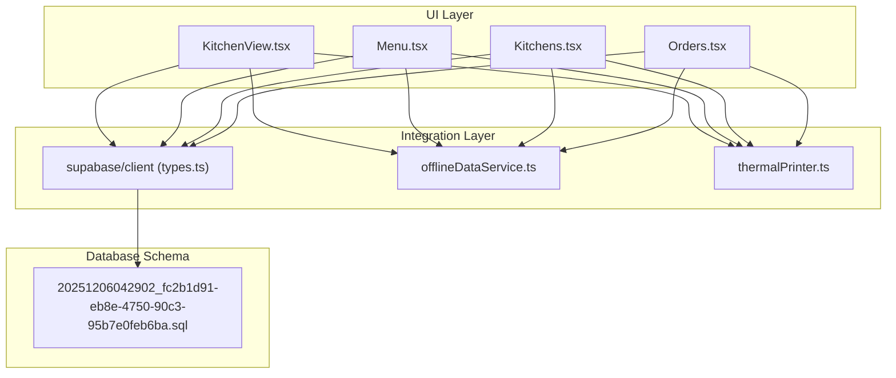
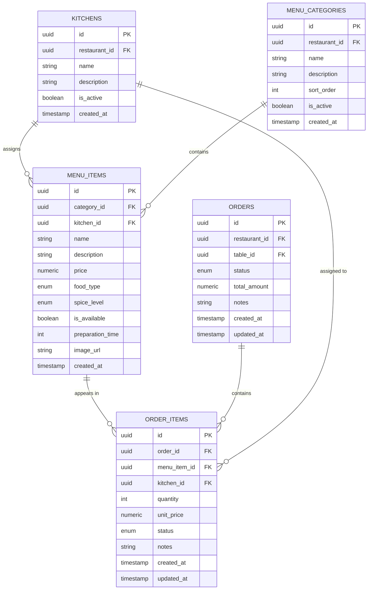
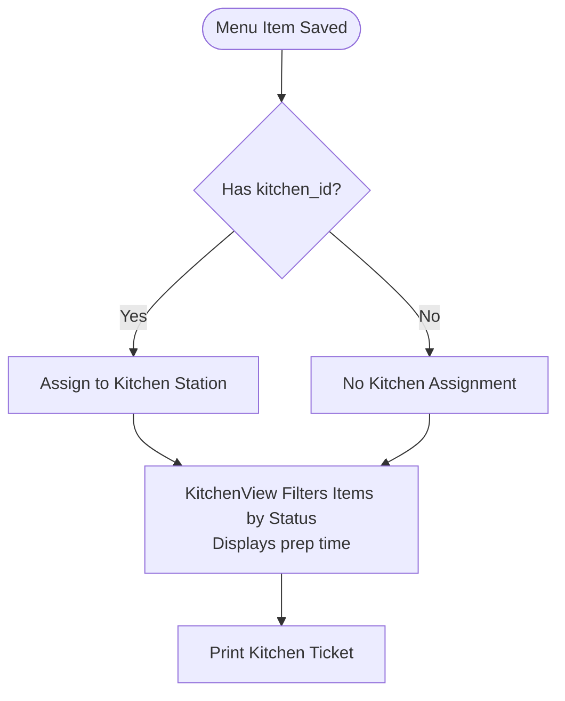
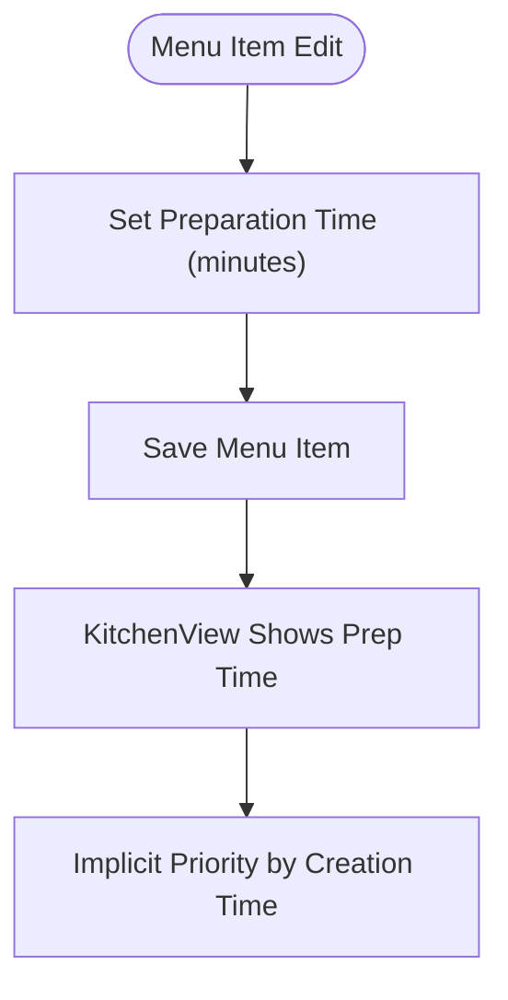
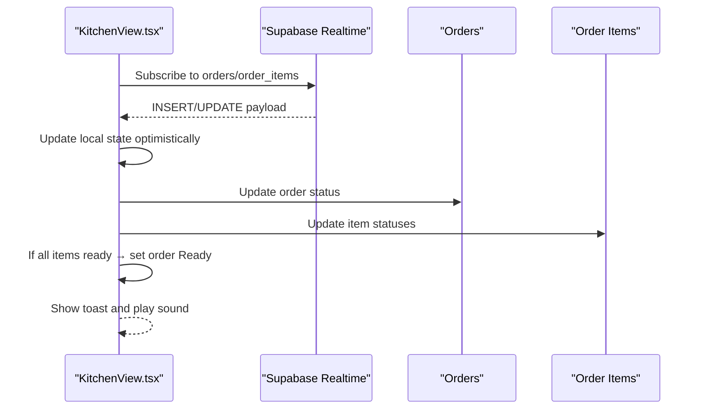
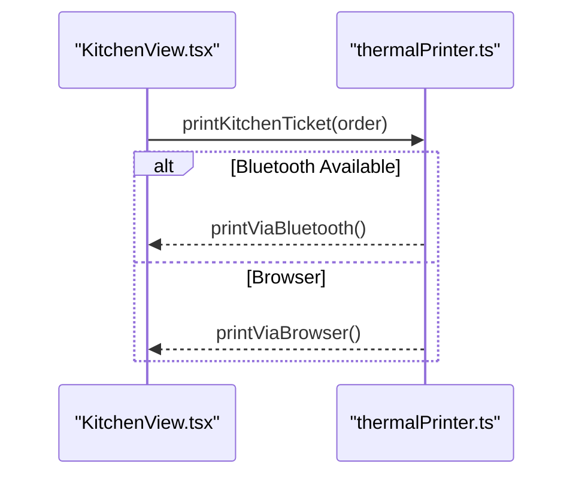
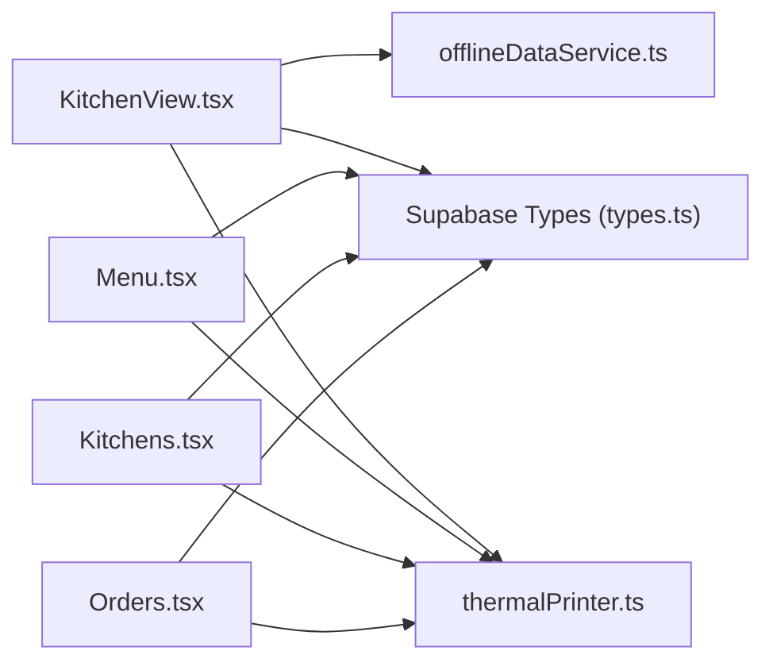

# Preparation Time & Kitchen Integration

<cite>
**Referenced Files in This Document**
- [KitchenView.tsx](file://src/pages/dashboard/KitchenView.tsx)
- [Kitchens.tsx](file://src/pages/dashboard/Kitchens.tsx)
- [Menu.tsx](file://src/pages/dashboard/Menu.tsx)
- [Orders.tsx](file://src/pages/dashboard/Orders.tsx)
- [types.ts](file://src/integrations/supabase/types.ts)
- [20251206042902_fc2b1d91-eb8e-4750-90c3-95b7e0feb6ba.sql](file://supabase/migrations/20251206042902_fc2b1d91-eb8e-4750-90c3-95b7e0feb6ba.sql)
- [offlineDataService.ts](file://src/services/offlineDataService.ts)
- [thermalPrinter.ts](file://src/services/thermalPrinter.ts)
- [useThermalPrinter.ts](file://src/hooks/useThermalPrinter.ts)
- [TableOccupiedTimer.tsx](file://src/components/TableOccupiedTimer.tsx)
</cite>

## Table of Contents
1. [Introduction](#introduction)
2. [Project Structure](#project-structure)
3. [Core Components](#core-components)
4. [Architecture Overview](#architecture-overview)
5. [Detailed Component Analysis](#detailed-component-analysis)
6. [Dependency Analysis](#dependency-analysis)
7. [Performance Considerations](#performance-considerations)
8. [Troubleshooting Guide](#troubleshooting-guide)
9. [Conclusion](#conclusion)

## Introduction
This document explains preparation time management and kitchen integration in TableFlow Pro. It covers how menu items are configured with preparation times, how kitchen assignments are managed, and how the real-time kitchen display system operates. It also documents the kitchen data model, preparation time calculation methods, kitchen-specific menu organization, preparation priority systems, and workflow automation features. Practical examples demonstrate setup for different restaurant types, best practices for preparation time configuration, and capacity management strategies.

## Project Structure
TableFlow Pro implements a hybrid online/offline architecture with Supabase as the backend and optional Electron-based local storage for offline-first experiences. Kitchen-related features span:
- Kitchen management UI for creating and maintaining kitchen stations
- Menu management with kitchen assignment and preparation time configuration
- Real-time kitchen view for order status updates and printing
- Offline-first data synchronization for seamless operation in low-connectivity environments



**Diagram sources**
- [KitchenView.tsx:1-785](file://src/pages/dashboard/KitchenView.tsx#L1-L785)
- [Menu.tsx:1-844](file://src/pages/dashboard/Menu.tsx#L1-L844)
- [Kitchens.tsx:1-355](file://src/pages/dashboard/Kitchens.tsx#L1-L355)
- [Orders.tsx:1-1119](file://src/pages/dashboard/Orders.tsx#L1-L1119)
- [types.ts:1-818](file://src/integrations/supabase/types.ts#L1-L818)
- [20251206042902_fc2b1d91-eb8e-4750-90c3-95b7e0feb6ba.sql:1-210](file://supabase/migrations/20251206042902_fc2b1d91-eb8e-4750-90c3-95b7e0feb6ba.sql#L1-L210)
- [offlineDataService.ts:1-769](file://src/services/offlineDataService.ts#L1-L769)
- [thermalPrinter.ts:1-339](file://src/services/thermalPrinter.ts#L1-L339)

**Section sources**
- [KitchenView.tsx:1-785](file://src/pages/dashboard/KitchenView.tsx#L1-L785)
- [Menu.tsx:1-844](file://src/pages/dashboard/Menu.tsx#L1-L844)
- [Kitchens.tsx:1-355](file://src/pages/dashboard/Kitchens.tsx#L1-L355)
- [Orders.tsx:1-1119](file://src/pages/dashboard/Orders.tsx#L1-L1119)
- [types.ts:1-818](file://src/integrations/supabase/types.ts#L1-L818)
- [20251206042902_fc2b1d91-eb8e-4750-90c3-95b7e0feb6ba.sql:1-210](file://supabase/migrations/20251206042902_fc2b1d91-eb8e-4750-90c3-95b7e0feb6ba.sql#L1-L210)
- [offlineDataService.ts:1-769](file://src/services/offlineDataService.ts#L1-L769)
- [thermalPrinter.ts:1-339](file://src/services/thermalPrinter.ts#L1-L339)

## Core Components
- KitchenView: Real-time kitchen display with three columns (Pending, Cooking, Ready), status updates, and kitchen ticket printing.
- Kitchens: Kitchen station management with activation/deactivation and CRUD operations.
- Menu: Menu item management with kitchen assignment, preparation time, availability, and food type/spice indicators.
- Orders: Order lifecycle management, including creation, status transitions, and serving/billing.
- Offline Data Service: SQLite-first caching and synchronization for offline operation.
- Thermal Printing: Browser and Bluetooth thermal printer integration for kitchen tickets and bills.

**Section sources**
- [KitchenView.tsx:1-785](file://src/pages/dashboard/KitchenView.tsx#L1-L785)
- [Kitchens.tsx:1-355](file://src/pages/dashboard/Kitchens.tsx#L1-L355)
- [Menu.tsx:1-844](file://src/pages/dashboard/Menu.tsx#L1-L844)
- [Orders.tsx:1-1119](file://src/pages/dashboard/Orders.tsx#L1-L1119)
- [offlineDataService.ts:1-769](file://src/services/offlineDataService.ts#L1-L769)
- [thermalPrinter.ts:1-339](file://src/services/thermalPrinter.ts#L1-L339)

## Architecture Overview
The system integrates Supabase for real-time data and PostgreSQL for persistence, with optional Electron-based local SQLite for offline-first experiences. Kitchen data flows through:
- Menu items carry preparation_time and kitchen_id
- Orders and order_items track per-item status and kitchen assignment
- KitchenView subscribes to real-time order/order_item changes and renders status columns
- Offline mutations write to SQLite with pending_sync markers and can be manually synced later

```mermaid
sequenceDiagram
participant UI as "KitchenView.tsx"
participant OFF as "offlineDataService.ts"
participant DB as "Supabase/SQLite"
participant PRN as "thermalPrinter.ts"
UI->>OFF : offlineQuery("orders", filters)
OFF->>DB : Query orders with joins
DB-->>OFF : Orders with order_items and menu_items
OFF-->>UI : Orders data (from cache/cloud)
UI->>OFF : offlineMutate("orders"/"order_items", {status})
OFF->>DB : Upsert with sync_status=pending_sync
DB-->>OFF : Success
OFF-->>UI : Pending sync
UI->>PRN : printKitchenTicket(order)
PRN-->>UI : Print success/failure
```

**Diagram sources**
- [KitchenView.tsx:106-191](file://src/pages/dashboard/KitchenView.tsx#L106-L191)
- [offlineDataService.ts:151-211](file://src/services/offlineDataService.ts#L151-L211)
- [offlineDataService.ts:220-287](file://src/services/offlineDataService.ts#L220-L287)
- [thermalPrinter.ts:338-339](file://src/services/thermalPrinter.ts#L338-L339)

**Section sources**
- [KitchenView.tsx:106-191](file://src/pages/dashboard/KitchenView.tsx#L106-L191)
- [offlineDataService.ts:151-211](file://src/services/offlineDataService.ts#L151-L211)
- [offlineDataService.ts:220-287](file://src/services/offlineDataService.ts#L220-L287)
- [thermalPrinter.ts:338-339](file://src/services/thermalPrinter.ts#L338-L339)

## Detailed Component Analysis

### Kitchen Data Model
The kitchen data model defines kitchens, menu categories, menu items, orders, and order items. Key relationships:
- kitchens.id → menu_items.kitchen_id (optional)
- menu_items.id → order_items.menu_item_id
- kitchens.id → order_items.kitchen_id (optional)
- orders.id → order_items.order_id



**Diagram sources**
- [20251206042902_fc2b1d91-eb8e-4750-90c3-95b7e0feb6ba.sql:28-108](file://supabase/migrations/20251206042902_fc2b1d91-eb8e-4750-90c3-95b7e0feb6ba.sql#L28-L108)
- [types.ts:148-341](file://src/integrations/supabase/types.ts#L148-L341)

**Section sources**
- [20251206042902_fc2b1d91-eb8e-4750-90c3-95b7e0feb6ba.sql:28-108](file://supabase/migrations/20251206042902_fc2b1d91-eb8e-4750-90c3-95b7e0feb6ba.sql#L28-L108)
- [types.ts:148-341](file://src/integrations/supabase/types.ts#L148-L341)

### Kitchen Assignment and Menu Organization
- Menu items can be assigned to a kitchen via kitchen_id. This enables kitchen-specific menu organization and targeted preparation workflows.
- KitchenView filters order items by status per column and displays preparation_time when present.
- KitchenView prints kitchen tickets with item names, quantities, and food type indicators.



**Diagram sources**
- [Menu.tsx:308-347](file://src/pages/dashboard/Menu.tsx#L308-L347)
- [KitchenView.tsx:378-486](file://src/pages/dashboard/KitchenView.tsx#L378-L486)

**Section sources**
- [Menu.tsx:308-347](file://src/pages/dashboard/Menu.tsx#L308-L347)
- [KitchenView.tsx:378-486](file://src/pages/dashboard/KitchenView.tsx#L378-L486)

### Preparation Time Configuration and Calculation
- Menu items store preparation_time in minutes. This field is optional and defaults to null.
- KitchenView displays preparation_time alongside items in the Cooking column.
- Preparation priority is implicit: items are processed in order of creation (earlier created_at appears first in Pending).



**Diagram sources**
- [Menu.tsx:123-126](file://src/pages/dashboard/Menu.tsx#L123-L126)
- [Menu.tsx:318-318](file://src/pages/dashboard/Menu.tsx#L318-L318)
- [KitchenView.tsx:615-620](file://src/pages/dashboard/KitchenView.tsx#L615-L620)

**Section sources**
- [Menu.tsx:123-126](file://src/pages/dashboard/Menu.tsx#L123-L126)
- [Menu.tsx:318-318](file://src/pages/dashboard/Menu.tsx#L318-L318)
- [KitchenView.tsx:615-620](file://src/pages/dashboard/KitchenView.tsx#L615-L620)

### Kitchen Workflow and Real-Time Updates
- KitchenView subscribes to Supabase real-time channels for orders and order_items, updating the UI instantly when changes occur.
- Status transitions:
  - Pending → Cooking: Start cooking
  - Cooking → Ready: Mark item ready; if all items ready, mark order Ready
  - Ready → Served: Serve order; frees table if applicable
- Sound notifications and toast messages provide feedback for new orders and status changes.



**Diagram sources**
- [KitchenView.tsx:210-253](file://src/pages/dashboard/KitchenView.tsx#L210-L253)
- [KitchenView.tsx:255-369](file://src/pages/dashboard/KitchenView.tsx#L255-L369)

**Section sources**
- [KitchenView.tsx:210-253](file://src/pages/dashboard/KitchenView.tsx#L210-L253)
- [KitchenView.tsx:255-369](file://src/pages/dashboard/KitchenView.tsx#L255-L369)

### Kitchen Setup Examples
- Quick-Service Restaurant:
  - Single kitchen for all items; set preparation_time on popular items; use Ready column to batch serve.
- Full-Service Restaurant:
  - Multiple kitchens (Grill, Fryer, Oven); assign menu items accordingly; monitor each kitchen’s Pending/Cooking columns.
- Cafe/Bakery:
  - Separate prep station for pastries and coffee; shorter preparation_time; frequent Ready checks.

[No sources needed since this section provides conceptual examples]

### Kitchen Capacity Management
- Tables track occupancy and elapsed time using a timer component. While not directly tied to kitchen capacity, it supports efficient table turnover to maintain kitchen throughput.
- Use Orders page to manage table assignments and occupancy; KitchenView to monitor order flow.

**Section sources**
- [TableOccupiedTimer.tsx:1-51](file://src/components/TableOccupiedTimer.tsx#L1-L51)
- [Orders.tsx:1-1119](file://src/pages/dashboard/Orders.tsx#L1-L1119)

### Kitchen-Specific Menu Modifications
- Menu items can be toggled available/unavailable; unavailable items do not appear in active ordering.
- Food type and spice level indicators help kitchen staff prepare accordingly.
- Notes on orders and order items can communicate special requests to kitchen staff.

**Section sources**
- [Menu.tsx:365-377](file://src/pages/dashboard/Menu.tsx#L365-L377)
- [Menu.tsx:778-789](file://src/pages/dashboard/Menu.tsx#L778-L789)
- [Orders.tsx:599-602](file://src/pages/dashboard/Orders.tsx#L599-L602)

### Preparation Time Tracking and Alerts
- Preparation time is displayed on KitchenView for each item.
- No explicit preparation-time-based alerts are implemented; however, the Ready column and status automation reduce manual oversight.

**Section sources**
- [KitchenView.tsx:615-620](file://src/pages/dashboard/KitchenView.tsx#L615-L620)
- [KitchenView.tsx:344-361](file://src/pages/dashboard/KitchenView.tsx#L344-L361)

### Kitchen View Display Integration
- KitchenView prints kitchen tickets with item details, quantities, and food type indicators.
- Tickets can be printed via browser or Bluetooth thermal printers when available.



**Diagram sources**
- [KitchenView.tsx:378-486](file://src/pages/dashboard/KitchenView.tsx#L378-L486)
- [thermalPrinter.ts:118-219](file://src/services/thermalPrinter.ts#L118-L219)
- [thermalPrinter.ts:221-335](file://src/services/thermalPrinter.ts#L221-L335)

**Section sources**
- [KitchenView.tsx:378-486](file://src/pages/dashboard/KitchenView.tsx#L378-L486)
- [thermalPrinter.ts:118-219](file://src/services/thermalPrinter.ts#L118-L219)
- [thermalPrinter.ts:221-335](file://src/services/thermalPrinter.ts#L221-L335)

### Kitchen Assignment Validation
- KitchenView does not enforce kitchen assignment validation; items without kitchen_id can still be prepared.
- Menu management allows assigning items to kitchens; missing kitchen_id implies no kitchen assignment.

**Section sources**
- [Menu.tsx:318-322](file://src/pages/dashboard/Menu.tsx#L318-L322)
- [KitchenView.tsx:378-486](file://src/pages/dashboard/KitchenView.tsx#L378-L486)

### Kitchen Workflow Automation Features
- Automatic order-to-ready propagation: when all items in an order are Ready, the order status updates to Ready.
- Automatic table release: when an order is marked Served, the associated table is freed.
- Real-time updates via Supabase channels eliminate polling overhead.

**Section sources**
- [KitchenView.tsx:344-361](file://src/pages/dashboard/KitchenView.tsx#L344-L361)
- [KitchenView.tsx:308-316](file://src/pages/dashboard/KitchenView.tsx#L308-L316)

## Dependency Analysis
Kitchen-related dependencies and relationships:
- KitchenView depends on Supabase for real-time updates and offlineDataService for offline queries/mutations.
- Menu management depends on Supabase for kitchen assignment and preparation time persistence.
- Kitchens management depends on Supabase for CRUD operations.
- Thermal printing integrates with KitchenView and Orders for ticket generation.



**Diagram sources**
- [KitchenView.tsx:1-28](file://src/pages/dashboard/KitchenView.tsx#L1-L28)
- [Menu.tsx:1-30](file://src/pages/dashboard/Menu.tsx#L1-L30)
- [Kitchens.tsx:1-21](file://src/pages/dashboard/Kitchens.tsx#L1-L21)
- [Orders.tsx:1-67](file://src/pages/dashboard/Orders.tsx#L1-L67)
- [types.ts:1-25](file://src/integrations/supabase/types.ts#L1-L25)
- [offlineDataService.ts:1-7](file://src/services/offlineDataService.ts#L1-L7)
- [thermalPrinter.ts:1-339](file://src/services/thermalPrinter.ts#L1-L339)

**Section sources**
- [KitchenView.tsx:1-28](file://src/pages/dashboard/KitchenView.tsx#L1-L28)
- [Menu.tsx:1-30](file://src/pages/dashboard/Menu.tsx#L1-L30)
- [Kitchens.tsx:1-21](file://src/pages/dashboard/Kitchens.tsx#L1-L21)
- [Orders.tsx:1-67](file://src/pages/dashboard/Orders.tsx#L1-L67)
- [types.ts:1-25](file://src/integrations/supabase/types.ts#L1-L25)
- [offlineDataService.ts:1-7](file://src/services/offlineDataService.ts#L1-L7)
- [thermalPrinter.ts:1-339](file://src/services/thermalPrinter.ts#L1-L339)

## Performance Considerations
- Real-time subscriptions minimize polling and improve responsiveness.
- Offline-first design reduces latency and improves reliability in low-connectivity environments.
- Preparation time display adds minimal rendering overhead; consider lazy loading for large menus.
- Batch-ready detection prevents redundant updates by setting order Ready only when all items are Ready.

[No sources needed since this section provides general guidance]

## Troubleshooting Guide
- KitchenView shows no orders:
  - Verify restaurant selection and network connectivity.
  - Confirm Supabase real-time publication includes orders and order_items.
- Status updates not reflected:
  - Check real-time subscription initialization and channel filters.
  - Ensure offlineMutate writes are recorded with pending_sync.
- Printing issues:
  - Confirm thermal printer availability and connection state.
  - Verify browser pop-up allowance for ticket printing.
- Offline sync:
  - Use manual sync to upload pending changes to Supabase.
  - Clear local data only when necessary and re-download from cloud.

**Section sources**
- [KitchenView.tsx:210-253](file://src/pages/dashboard/KitchenView.tsx#L210-L253)
- [offlineDataService.ts:397-541](file://src/services/offlineDataService.ts#L397-L541)
- [thermalPrinter.ts:221-335](file://src/services/thermalPrinter.ts#L221-L335)

## Conclusion
TableFlow Pro’s kitchen integration centers on a robust data model linking kitchens, menu items, orders, and order items. Preparation time is configurable per menu item and surfaced in the kitchen view. Real-time updates, offline-first capabilities, and kitchen ticket printing streamline kitchen operations. By structuring menu items with kitchen assignments and preparation times, restaurants can optimize throughput, reduce errors, and maintain smooth workflows across diverse operational models.