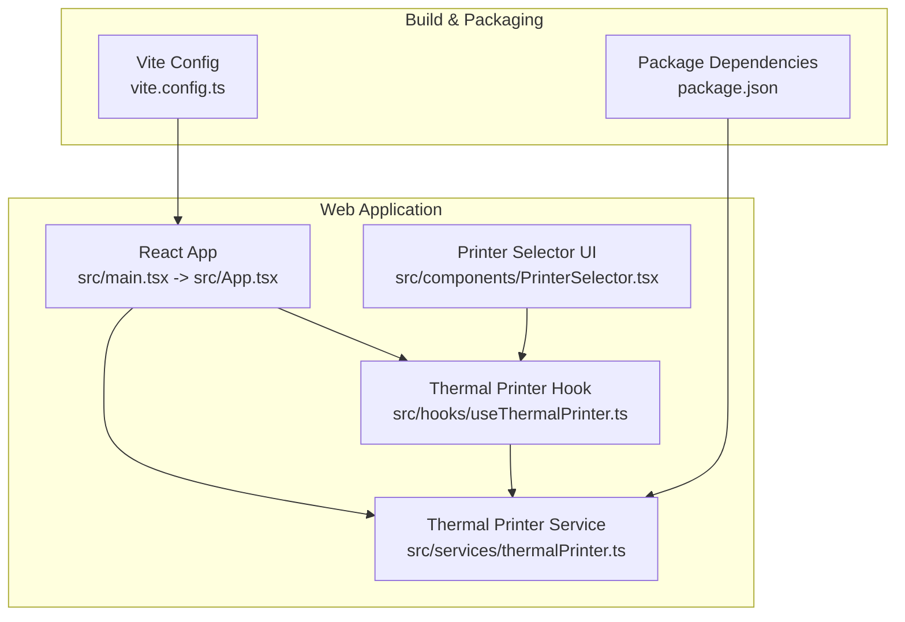
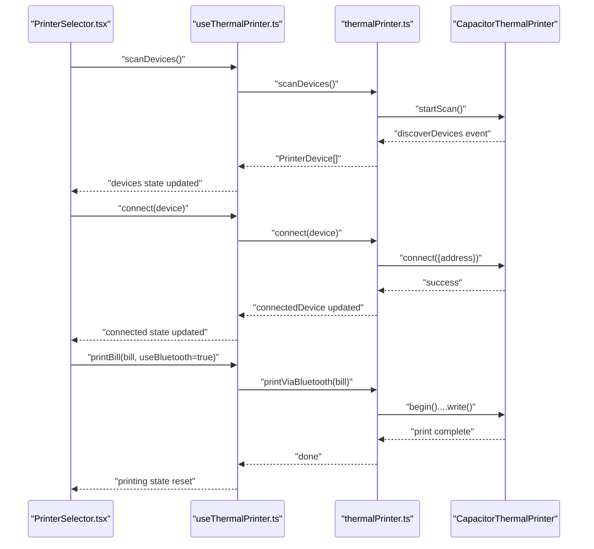
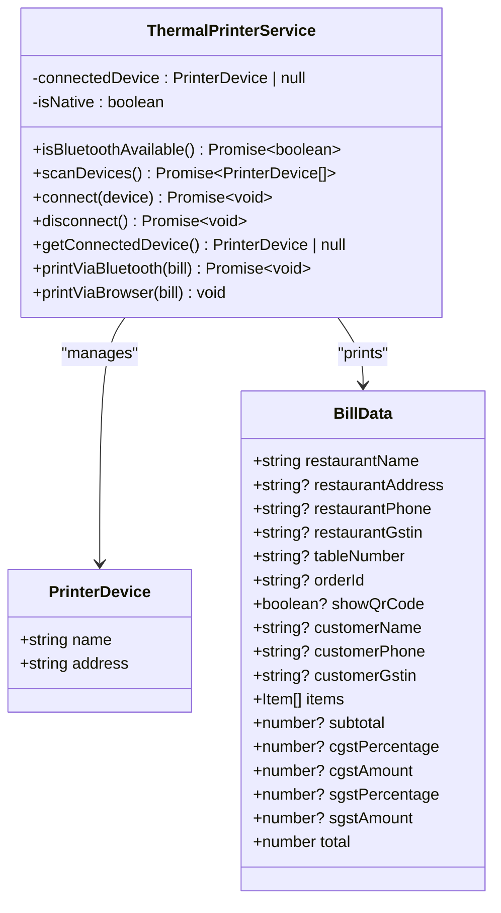
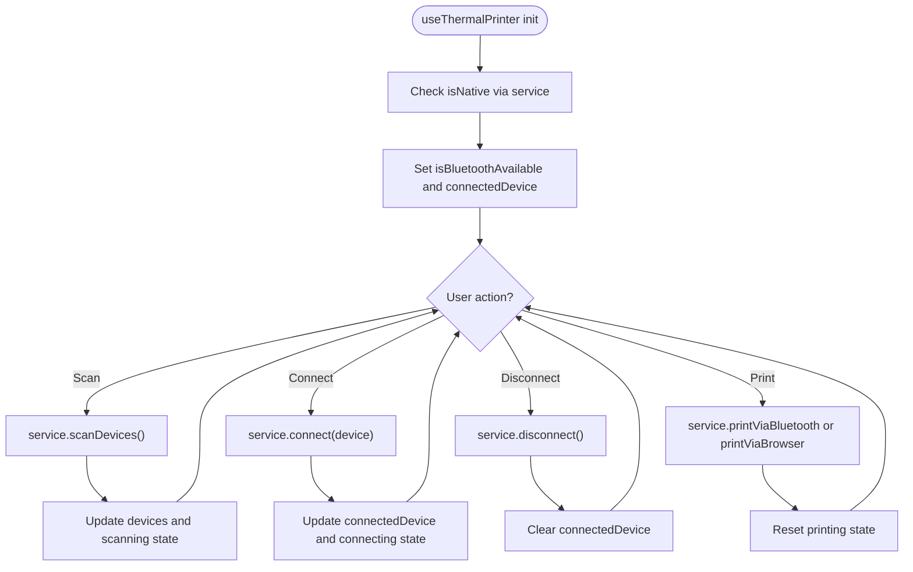
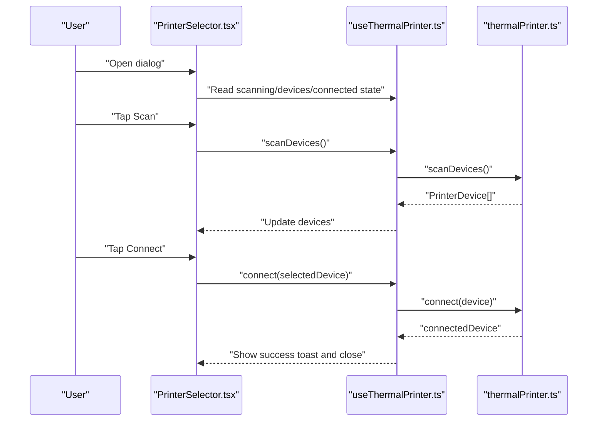
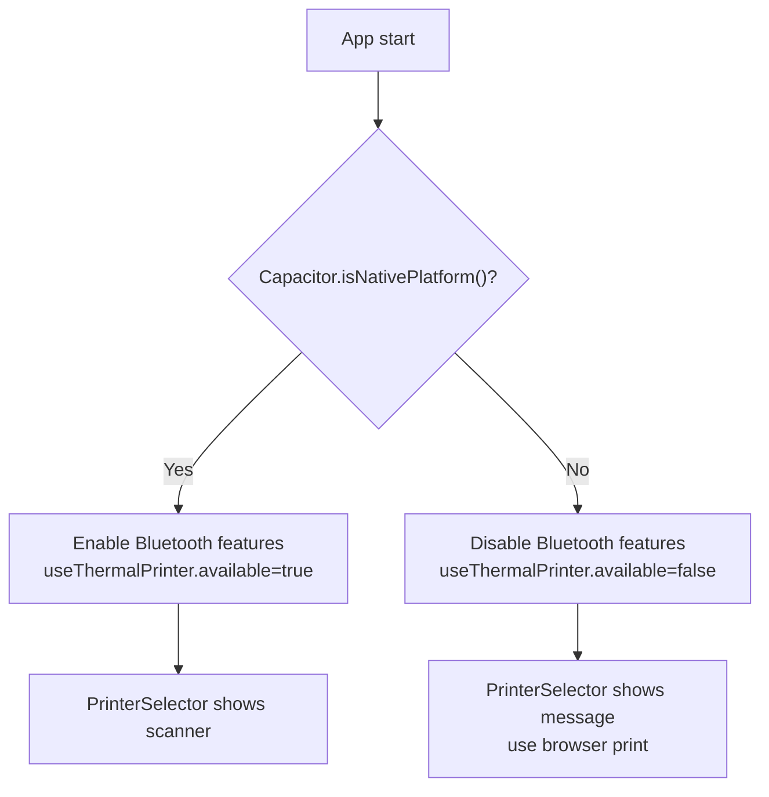
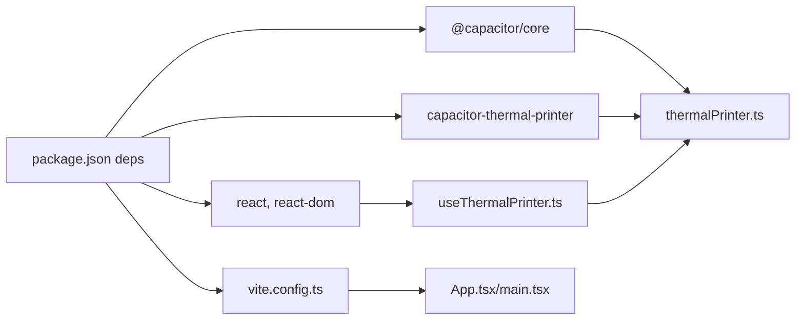

# Capacitor Mobile Integration

<cite>
**Referenced Files in This Document**
- [package.json](file://package.json)
- [vite.config.ts](file://vite.config.ts)
- [README.md](file://README.md)
- [src/services/thermalPrinter.ts](file://src/services/thermalPrinter.ts)
- [src/hooks/useThermalPrinter.ts](file://src/hooks/useThermalPrinter.ts)
- [src/components/PrinterSelector.tsx](file://src/components/PrinterSelector.tsx)
- [src/hooks/use-mobile.tsx](file://src/hooks/use-mobile.tsx)
- [src/App.tsx](file://src/App.tsx)
- [src/main.tsx](file://src/main.tsx)
</cite>

## Table of Contents
1. [Introduction](#introduction)
2. [Project Structure](#project-structure)
3. [Core Components](#core-components)
4. [Architecture Overview](#architecture-overview)
5. [Detailed Component Analysis](#detailed-component-analysis)
6. [Dependency Analysis](#dependency-analysis)
7. [Performance Considerations](#performance-considerations)
8. [Troubleshooting Guide](#troubleshooting-guide)
9. [Conclusion](#conclusion)
10. [Appendices](#appendices)

## Introduction
This document explains how TableFlow Pro integrates Capacitor for mobile capabilities, focusing on the thermal printer plugin architecture, Bluetooth connectivity, and cross-platform runtime behavior. It also covers how the web application is wrapped for mobile platforms, build processes, plugin installation, and runtime environment differences. Practical examples demonstrate mobile-specific implementations, plugin usage patterns, and native feature integration. Distribution, platform-specific optimizations, and debugging strategies for mobile environments are included.

## Project Structure
TableFlow Pro is a Vite + React + TypeScript application. Capacitor is integrated as a core dependency, enabling mobile wrapping and native plugin access. The project’s build pipeline supports Electron alongside web builds, but Capacitor-related mobile features are implemented via the thermal printer service and React hooks.

**Diagram sources**
- [src/main.tsx:1-6](file://src/main.tsx#L1-L6)
- [src/App.tsx:1-150](file://src/App.tsx#L1-L150)
- [src/services/thermalPrinter.ts:1-339](file://src/services/thermalPrinter.ts#L1-L339)
- [src/hooks/useThermalPrinter.ts:1-69](file://src/hooks/useThermalPrinter.ts#L1-L69)
- [src/components/PrinterSelector.tsx:1-121](file://src/components/PrinterSelector.tsx#L1-L121)
- [vite.config.ts:1-69](file://vite.config.ts#L1-L69)
- [package.json:1-131](file://package.json#L1-L131)

**Section sources**
- [README.md:1-13](file://README.md#L1-L13)
- [package.json:17-78](file://package.json#L17-L78)
- [vite.config.ts:9-69](file://vite.config.ts#L9-L69)
- [src/main.tsx:1-6](file://src/main.tsx#L1-L6)
- [src/App.tsx:32-34](file://src/App.tsx#L32-L34)

## Core Components
- Capacitor Core: Provides runtime detection for native vs web environments.
- Thermal Printer Plugin: Implements Bluetooth discovery, connection, and ESC/POS printing via a Capacitor plugin.
- React Service Layer: Encapsulates printer operations, device lifecycle, and cross-platform logic.
- React Hooks: Expose scanning, connecting, disconnecting, and printing to UI components.
- UI Component: Presents printer selection and status to users.

Key responsibilities:
- Detect native platform and gate mobile-only features.
- Manage Bluetooth device lifecycle and ESC/POS receipts.
- Provide fallback printing for non-native environments.
- Integrate with React components for a seamless UX.

**Section sources**
- [package.json:18-50](file://package.json#L18-L50)
- [src/services/thermalPrinter.ts:33-339](file://src/services/thermalPrinter.ts#L33-L339)
- [src/hooks/useThermalPrinter.ts:1-69](file://src/hooks/useThermalPrinter.ts#L1-L69)
- [src/components/PrinterSelector.tsx:16-77](file://src/components/PrinterSelector.tsx#L16-L77)

## Architecture Overview
The mobile integration centers on a service that detects the native platform and delegates to the Capacitor thermal printer plugin for Bluetooth operations. The hook exposes state and actions to React components, while the UI component renders a printer selector dialog with scanning and connection controls.

**Diagram sources**
- [src/components/PrinterSelector.tsx:30-58](file://src/components/PrinterSelector.tsx#L30-L58)
- [src/hooks/useThermalPrinter.ts:17-54](file://src/hooks/useThermalPrinter.ts#L17-L54)
- [src/services/thermalPrinter.ts:41-87](file://src/services/thermalPrinter.ts#L41-L87)
- [src/services/thermalPrinter.ts:89-112](file://src/services/thermalPrinter.ts#L89-L112)
- [src/services/thermalPrinter.ts:118-219](file://src/services/thermalPrinter.ts#L118-L219)

## Detailed Component Analysis

### Thermal Printer Service
The service encapsulates all printer operations, including device discovery, connection, disconnection, and printing. It checks the native platform and throws descriptive errors when attempting mobile-only operations on non-native environments. It builds ESC/POS receipts and writes them to the connected device.

**Diagram sources**
- [src/services/thermalPrinter.ts:33-339](file://src/services/thermalPrinter.ts#L33-L339)

**Section sources**
- [src/services/thermalPrinter.ts:33-39](file://src/services/thermalPrinter.ts#L33-L39)
- [src/services/thermalPrinter.ts:41-87](file://src/services/thermalPrinter.ts#L41-L87)
- [src/services/thermalPrinter.ts:89-112](file://src/services/thermalPrinter.ts#L89-L112)
- [src/services/thermalPrinter.ts:118-219](file://src/services/thermalPrinter.ts#L118-L219)
- [src/services/thermalPrinter.ts:221-335](file://src/services/thermalPrinter.ts#L221-L335)

### Thermal Printer Hook
The hook manages UI state for scanning, connecting, disconnecting, and printing. It initializes the native availability flag and tracks the currently connected device. It delegates printing to the service, choosing Bluetooth or browser fallback based on capability and preference.

**Diagram sources**
- [src/hooks/useThermalPrinter.ts:12-54](file://src/hooks/useThermalPrinter.ts#L12-L54)
- [src/services/thermalPrinter.ts:35](file://src/services/thermalPrinter.ts#L35)

**Section sources**
- [src/hooks/useThermalPrinter.ts:4-15](file://src/hooks/useThermalPrinter.ts#L4-L15)
- [src/hooks/useThermalPrinter.ts:17-54](file://src/hooks/useThermalPrinter.ts#L17-L54)

### Printer Selector UI
The UI component renders a dialog for discovering and connecting to Bluetooth thermal printers. It displays the connected device, scanning status, and provides actions to scan, connect, and disconnect. It informs users when Bluetooth printing is unavailable outside native platforms.

**Diagram sources**
- [src/components/PrinterSelector.tsx:30-58](file://src/components/PrinterSelector.tsx#L30-L58)
- [src/hooks/useThermalPrinter.ts:17-41](file://src/hooks/useThermalPrinter.ts#L17-L41)
- [src/services/thermalPrinter.ts:89-112](file://src/services/thermalPrinter.ts#L89-L112)

**Section sources**
- [src/components/PrinterSelector.tsx:16-77](file://src/components/PrinterSelector.tsx#L16-L77)

### Cross-Platform Runtime Behavior
- Native Platform Detection: The service checks the Capacitor runtime to determine whether Bluetooth operations are supported.
- Browser Fallback: When not on a native platform, the service falls back to HTML printing via a new window and the browser’s print dialog.
- Router Selection: The app selects the appropriate router depending on whether it runs inside an Electron environment, ensuring correct routing behavior across modes.

**Diagram sources**
- [src/services/thermalPrinter.ts:35](file://src/services/thermalPrinter.ts#L35)
- [src/hooks/useThermalPrinter.ts:12-15](file://src/hooks/useThermalPrinter.ts#L12-L15)
- [src/App.tsx:32-34](file://src/App.tsx#L32-L34)

**Section sources**
- [src/services/thermalPrinter.ts:35](file://src/services/thermalPrinter.ts#L35)
- [src/hooks/useThermalPrinter.ts:12-15](file://src/hooks/useThermalPrinter.ts#L12-L15)
- [src/App.tsx:32-34](file://src/App.tsx#L32-L34)

## Dependency Analysis
- Capacitor Core: Provides platform detection and runtime APIs.
- Thermal Printer Plugin: Enables Bluetooth discovery and ESC/POS printing on native platforms.
- React + Hooks: Provide state and lifecycle management for printer operations.
- Vite: Builds the web application and integrates optional Electron plugins.

**Diagram sources**
- [package.json:18-50](file://package.json#L18-L50)
- [vite.config.ts:1-69](file://vite.config.ts#L1-L69)
- [src/services/thermalPrinter.ts:1-3](file://src/services/thermalPrinter.ts#L1-L3)
- [src/hooks/useThermalPrinter.ts:1-2](file://src/hooks/useThermalPrinter.ts#L1-L2)
- [src/App.tsx:1-10](file://src/App.tsx#L1-L10)
- [src/main.tsx:1-3](file://src/main.tsx#L1-L3)

**Section sources**
- [package.json:18-50](file://package.json#L18-L50)
- [vite.config.ts:18-61](file://vite.config.ts#L18-L61)

## Performance Considerations
- Bluetooth Scanning Timeout: The service stops scanning after a fixed duration to avoid indefinite waits.
- Event Listener Cleanup: Listeners are removed after scanning completes to prevent memory leaks.
- ESC/POS Construction: Receipt building uses method chaining; keep payloads minimal to reduce write time.
- Browser Printing: HTML generation occurs synchronously; defer heavy operations off the main thread if needed.
- Router Mode: Using HashRouter in Electron avoids file protocol routing issues and reduces initial render overhead.

[No sources needed since this section provides general guidance]

## Troubleshooting Guide
Common issues and resolutions:
- Attempting Bluetooth Operations on Non-Native Platforms: The service throws descriptive errors. Ensure the app runs on a native platform (iOS/Android) for Bluetooth features.
- Scanner Not Discovering Devices: Verify permissions and that the device is advertising. The service stops scanning after a timeout; retry scanning if needed.
- Connection Failures: Confirm the device address and that the printer is powered on and discoverable.
- Printing Failures: Review ESC/POS command sequences and ensure the printer supports the commands used.
- Router Behavior in Electron: The app chooses HashRouter when running in Electron to avoid file protocol routing problems.

**Section sources**
- [src/services/thermalPrinter.ts:42-44](file://src/services/thermalPrinter.ts#L42-L44)
- [src/services/thermalPrinter.ts:80-85](file://src/services/thermalPrinter.ts#L80-L85)
- [src/services/thermalPrinter.ts:97-100](file://src/services/thermalPrinter.ts#L97-L100)
- [src/services/thermalPrinter.ts:215-218](file://src/services/thermalPrinter.ts#L215-L218)
- [src/App.tsx:32-34](file://src/App.tsx#L32-L34)

## Conclusion
TableFlow Pro leverages Capacitor to deliver native-like mobile capabilities, specifically Bluetooth thermal printer integration. The service and hook architecture cleanly separates concerns, enabling robust device lifecycle management and ESC/POS printing. The UI adapts to platform capabilities, guiding users appropriately. With proper build configuration and platform-specific considerations, the application delivers a consistent experience across web and native environments.

[No sources needed since this section summarizes without analyzing specific files]

## Appendices

### Capacitor Configuration Setup
- Dependencies: Ensure Capacitor Core and the thermal printer plugin are installed and aligned with the Capacitor version used by the project.
- Platform Detection: Use the Capacitor runtime to gate mobile-only features.
- Build Pipeline: Vite handles web builds; Capacitor CLI would be used to generate native projects and integrate plugins.

**Section sources**
- [package.json:18-50](file://package.json#L18-L50)
- [src/services/thermalPrinter.ts:35](file://src/services/thermalPrinter.ts#L35)

### Plugin Installation and Usage Patterns
- Install the thermal printer plugin and Capacitor Core as per the project dependencies.
- Gate UI and actions behind platform checks.
- Use the service to manage device discovery, connection, and printing.
- Provide a fallback mechanism for non-native environments.

**Section sources**
- [package.json:18-50](file://package.json#L18-L50)
- [src/services/thermalPrinter.ts:41-112](file://src/services/thermalPrinter.ts#L41-L112)
- [src/hooks/useThermalPrinter.ts:17-54](file://src/hooks/useThermalPrinter.ts#L17-L54)

### Cross-Platform Compatibility Considerations
- Native vs Web: Use platform detection to enable Bluetooth features only on native platforms.
- Router Modes: Choose appropriate routers for Electron vs web deployments.
- UI Adaptation: Inform users when Bluetooth printing is unavailable and guide them to browser-based alternatives.

**Section sources**
- [src/services/thermalPrinter.ts:35](file://src/services/thermalPrinter.ts#L35)
- [src/App.tsx:32-34](file://src/App.tsx#L32-L34)
- [src/components/PrinterSelector.tsx:60-77](file://src/components/PrinterSelector.tsx#L60-L77)

### Practical Examples
- Scanning for Printers: Trigger scanning via the hook and update the UI with discovered devices.
- Connecting to a Printer: Use the selected device address to establish a connection.
- Printing a Bill: Build the bill payload and choose Bluetooth printing when available; otherwise, use the browser fallback.

**Section sources**
- [src/components/PrinterSelector.tsx:30-58](file://src/components/PrinterSelector.tsx#L30-L58)
- [src/hooks/useThermalPrinter.ts:17-54](file://src/hooks/useThermalPrinter.ts#L17-L54)
- [src/services/thermalPrinter.ts:118-219](file://src/services/thermalPrinter.ts#L118-L219)

### Mobile App Distribution and Debugging
- Distribution: Use Capacitor CLI to build iOS and Android apps, integrating the thermal printer plugin per platform requirements.
- Debugging: Enable Capacitor logs and inspect Bluetooth events. Validate ESC/POS command sequences and printer compatibility.

[No sources needed since this section provides general guidance]