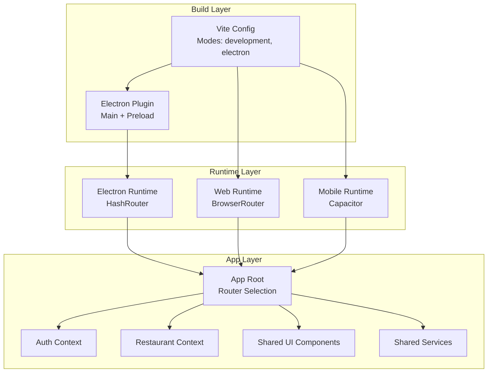
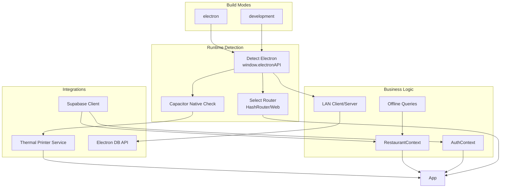
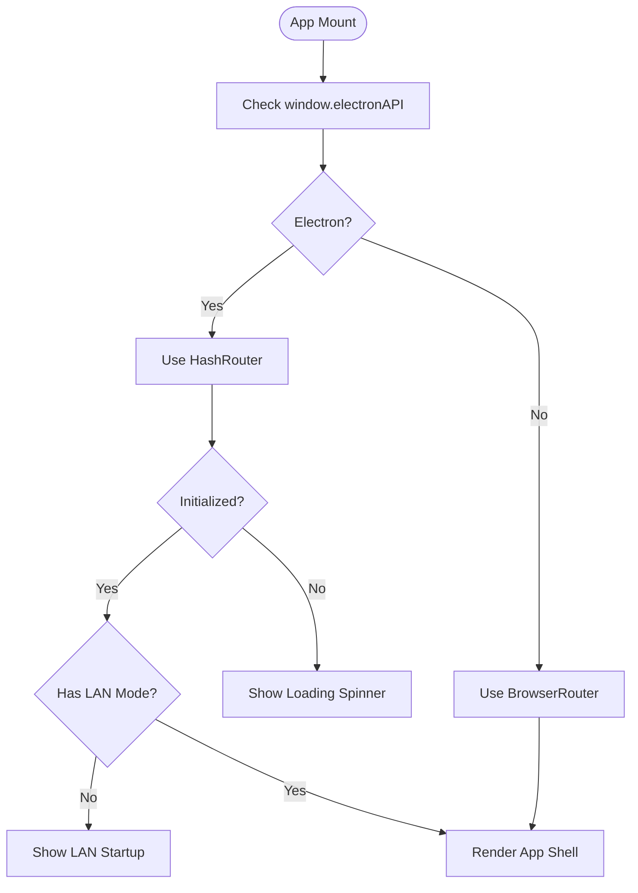
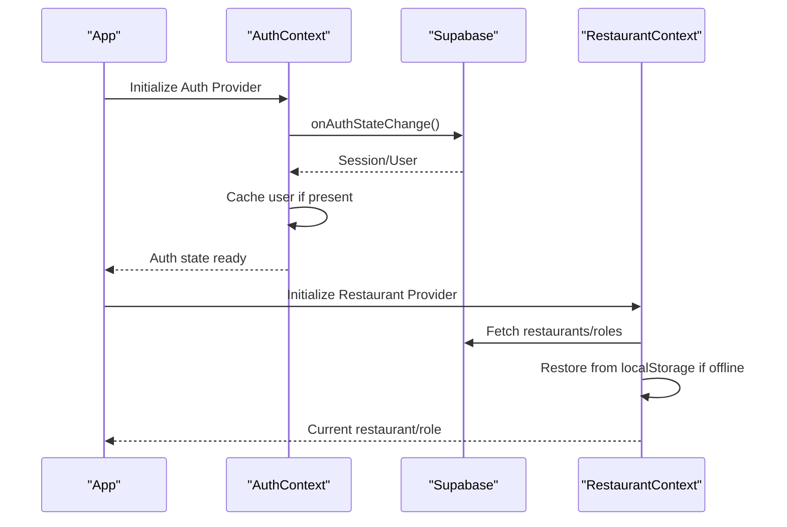
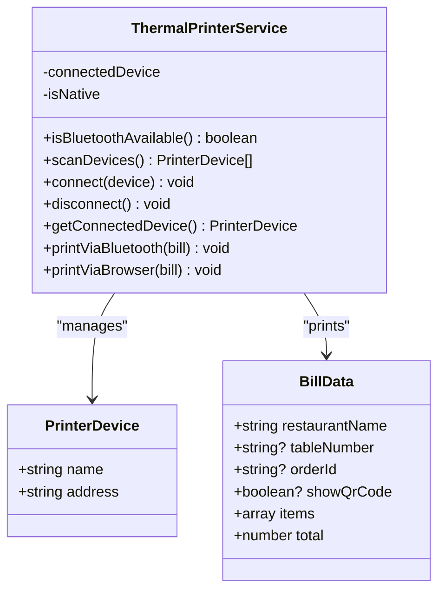
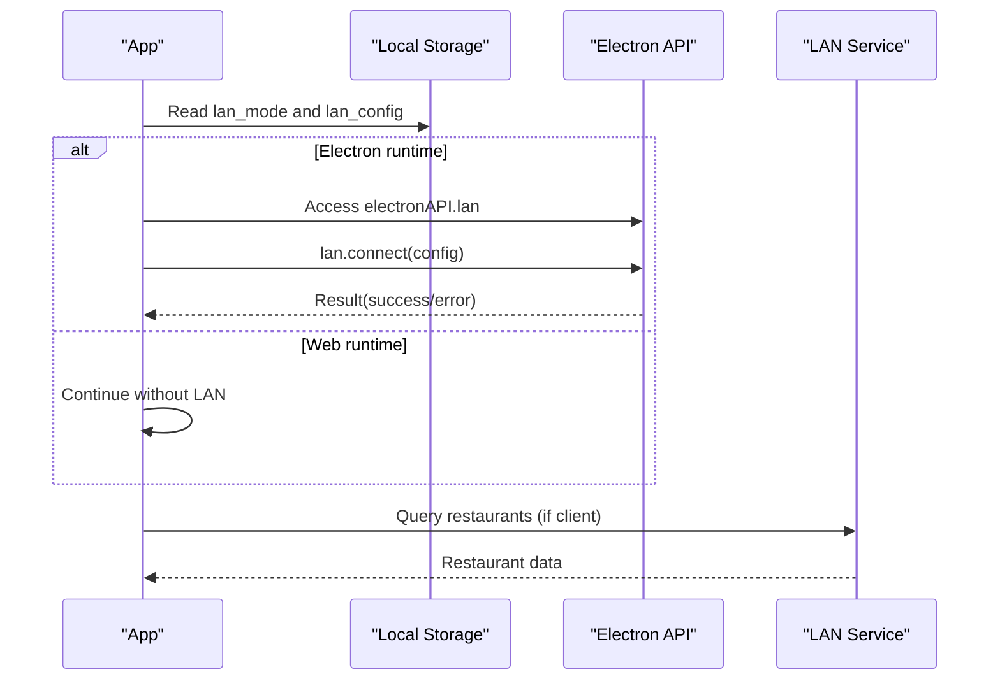
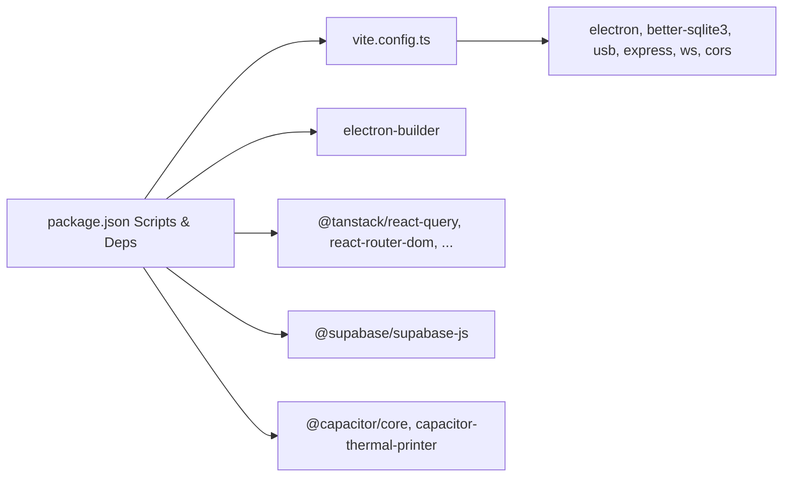

# Cross-Platform Development Strategies

<cite>
**Referenced Files in This Document**
- [package.json](file://package.json)
- [vite.config.ts](file://vite.config.ts)
- [src/main.tsx](file://src/main.tsx)
- [src/App.tsx](file://src/App.tsx)
- [src/hooks/use-mobile.tsx](file://src/hooks/use-mobile.tsx)
- [src/components/LanStartup.tsx](file://src/components/LanStartup.tsx)
- [src/contexts/AuthContext.tsx](file://src/contexts/AuthContext.tsx)
- [src/contexts/RestaurantContext.tsx](file://src/contexts/RestaurantContext.tsx)
- [src/services/thermalPrinter.ts](file://src/services/thermalPrinter.ts)
- [src/pages/dashboard/DashboardHome.tsx](file://src/pages/dashboard/DashboardHome.tsx)
</cite>

## Table of Contents
1. [Introduction](#introduction)
2. [Project Structure](#project-structure)
3. [Core Components](#core-components)
4. [Architecture Overview](#architecture-overview)
5. [Detailed Component Analysis](#detailed-component-analysis)
6. [Dependency Analysis](#dependency-analysis)
7. [Performance Considerations](#performance-considerations)
8. [Troubleshooting Guide](#troubleshooting-guide)
9. [Conclusion](#conclusion)
10. [Appendices](#appendices)

## Introduction
This document explains how TableFlow Pro achieves a unified codebase across web, mobile, and desktop platforms. It details platform detection, conditional rendering, shared business logic, build configuration differences, environment variable management, and platform-specific optimizations. Practical examples demonstrate platform-aware components, shared services, LAN client/server networking, and thermal printer integration. Testing, debugging, and deployment strategies are included, along with Vite configuration specifics for different build modes.

## Project Structure
The project is a React application using Vite for bundling and Electron for desktop builds. Capacitor is present for potential hybrid/mobile targets. The codebase organizes shared UI, business logic, and platform-specific integrations under a single source tree.

**Diagram sources**
- [vite.config.ts:1-69](file://vite.config.ts#L1-L69)
- [src/App.tsx:32-34](file://src/App.tsx#L32-L34)
- [src/contexts/AuthContext.tsx:39-131](file://src/contexts/AuthContext.tsx#L39-L131)
- [src/contexts/RestaurantContext.tsx:47-381](file://src/contexts/RestaurantContext.tsx#L47-L381)

**Section sources**
- [package.json:7-16](file://package.json#L7-L16)
- [vite.config.ts:9-61](file://vite.config.ts#L9-L61)
- [src/App.tsx:32-34](file://src/App.tsx#L32-L34)

## Core Components
- Platform detection and router selection: The app detects Electron runtime and switches between HashRouter and BrowserRouter to accommodate file:// protocol constraints.
- LAN startup and mode selection: A dedicated startup screen allows choosing server or client LAN modes, persisting selections in local storage and triggering Electron LAN connections when applicable.
- Authentication and restaurant contexts: Centralized providers manage auth state, caching, and restaurant selection with offline-aware queries and LAN overrides.
- Shared services: Thermal printer service abstracts native vs browser printing behind a unified interface.
- Responsive hooks: A mobile breakpoint hook enables responsive UI decisions.

**Section sources**
- [src/App.tsx:32-34](file://src/App.tsx#L32-L34)
- [src/components/LanStartup.tsx:23-260](file://src/components/LanStartup.tsx#L23-L260)
- [src/contexts/AuthContext.tsx:39-131](file://src/contexts/AuthContext.tsx#L39-L131)
- [src/contexts/RestaurantContext.tsx:47-381](file://src/contexts/RestaurantContext.tsx#L47-L381)
- [src/services/thermalPrinter.ts:33-339](file://src/services/thermalPrinter.ts#L33-L339)
- [src/hooks/use-mobile.tsx:5-19](file://src/hooks/use-mobile.tsx#L5-L19)

## Architecture Overview
The architecture separates concerns into:
- Build-time modes: Vite supports development and electron modes, enabling Electron main/preload builds and renderer bundling.
- Runtime-time platforms: Router selection, LAN mode handling, and native capability checks (e.g., Capacitor) enable unified UI across web, desktop, and mobile.
- Shared business logic: Auth and restaurant contexts encapsulate Supabase and offline data flows, with LAN-specific overrides.
- Platform-specific integrations: Thermal printing differs by platform; Electron adds database and LAN APIs via preload; Capacitor enables native device features.

**Diagram sources**
- [vite.config.ts:9-61](file://vite.config.ts#L9-L61)
- [src/App.tsx:32-34](file://src/App.tsx#L32-L34)
- [src/contexts/AuthContext.tsx:39-131](file://src/contexts/AuthContext.tsx#L39-L131)
- [src/contexts/RestaurantContext.tsx:78-136](file://src/contexts/RestaurantContext.tsx#L78-L136)
- [src/services/thermalPrinter.ts:33-339](file://src/services/thermalPrinter.ts#L33-L339)

## Detailed Component Analysis

### Platform Detection and Conditional Rendering
- Router selection: The app checks for the Electron API presence to choose HashRouter for desktop and BrowserRouter for web.
- LAN mode: On Electron, a startup screen lets users pick server or client mode, saving preferences to local storage and invoking Electron LAN APIs when available.
- Mobile responsiveness: A hook detects viewport breakpoints to adapt UI for smaller screens.

**Diagram sources**
- [src/App.tsx:32-34](file://src/App.tsx#L32-L34)
- [src/App.tsx:92-106](file://src/App.tsx#L92-L106)
- [src/components/LanStartup.tsx:23-260](file://src/components/LanStartup.tsx#L23-L260)

**Section sources**
- [src/App.tsx:32-34](file://src/App.tsx#L32-L34)
- [src/App.tsx:92-106](file://src/App.tsx#L92-L106)
- [src/components/LanStartup.tsx:23-260](file://src/components/LanStartup.tsx#L23-L260)

### Shared Business Logic: Authentication and Restaurant Contexts
- Authentication context manages Supabase auth state, caches user sessions for offline use, and starts/stops synchronization engines based on auth events.
- Restaurant context orchestrates restaurant and role selection, with offline-first and LAN overrides. It restores state from local storage when appropriate and listens for LAN connectivity changes.

**Diagram sources**
- [src/contexts/AuthContext.tsx:39-131](file://src/contexts/AuthContext.tsx#L39-L131)
- [src/contexts/RestaurantContext.tsx:47-381](file://src/contexts/RestaurantContext.tsx#L47-L381)

**Section sources**
- [src/contexts/AuthContext.tsx:39-131](file://src/contexts/AuthContext.tsx#L39-L131)
- [src/contexts/RestaurantContext.tsx:47-381](file://src/contexts/RestaurantContext.tsx#L47-L381)

### Platform-Aware Component: Thermal Printer Service
- The service exposes a unified interface for printing bills across platforms:
  - Native mobile: Uses Capacitor to discover/connect to Bluetooth printers and send ESC/POS commands.
  - Browser/web: Generates printable HTML and opens a new window for user-initiated printing.
- Native capability detection is performed via Capacitor’s platform check.

**Diagram sources**
- [src/services/thermalPrinter.ts:33-339](file://src/services/thermalPrinter.ts#L33-L339)

**Section sources**
- [src/services/thermalPrinter.ts:33-339](file://src/services/thermalPrinter.ts#L33-L339)

### LAN Client/Server Integration
- Electron main process exposes LAN APIs to the renderer via preload. The app reads saved LAN mode and config from local storage and invokes Electron LAN APIs when available.
- Restaurant context queries LAN server for restaurant data when operating as a LAN client.

**Diagram sources**
- [src/App.tsx:56-89](file://src/App.tsx#L56-L89)
- [src/App.tsx:104-106](file://src/App.tsx#L104-L106)
- [src/contexts/RestaurantContext.tsx:104-136](file://src/contexts/RestaurantContext.tsx#L104-L136)

**Section sources**
- [src/App.tsx:56-89](file://src/App.tsx#L56-L89)
- [src/App.tsx:104-106](file://src/App.tsx#L104-L106)
- [src/contexts/RestaurantContext.tsx:104-136](file://src/contexts/RestaurantContext.tsx#L104-L136)

### Responsive UI Hook
- A mobile detection hook observes media queries and updates state when the viewport crosses the mobile breakpoint, enabling responsive layouts and component behavior.

**Section sources**
- [src/hooks/use-mobile.tsx:5-19](file://src/hooks/use-mobile.tsx#L5-L19)

## Dependency Analysis
- Build-time dependencies:
  - Vite plugins: React, Electron plugin, Electron renderer plugin.
  - Electron builder configuration for desktop packaging.
- Runtime dependencies:
  - React ecosystem, routing, state management, UI primitives.
  - Supabase for auth and data.
  - Capacitor for native capabilities (mobile).
  - Electron for desktop main/preload and native modules.

**Diagram sources**
- [package.json:7-16](file://package.json#L7-L16)
- [package.json:107-129](file://package.json#L107-L129)
- [vite.config.ts:18-61](file://vite.config.ts#L18-L61)

**Section sources**
- [package.json:17-77](file://package.json#L17-L77)
- [package.json:107-129](file://package.json#L107-L129)
- [vite.config.ts:18-61](file://vite.config.ts#L18-L61)

## Performance Considerations
- Offline-first data fetching: Contexts use offline-aware queries to reduce latency and improve resilience.
- Conditional rendering: Router and LAN mode selection prevent unnecessary work on unsupported platforms.
- Platform-specific optimizations:
  - Native mobile printing avoids DOM overhead.
  - Electron main/preload separation reduces renderer load.
- Asset handling: Vite aliases and base path configuration ensure assets resolve consistently across environments.

[No sources needed since this section provides general guidance]

## Troubleshooting Guide
- Router mismatch on desktop:
  - Symptom: Navigation fails or URLs behave unexpectedly.
  - Cause: Using BrowserRouter in Electron.
  - Fix: Ensure HashRouter is used in Electron runtime.
  - Reference: [src/App.tsx:32-34](file://src/App.tsx#L32-L34)
- LAN connection failures:
  - Symptom: Cannot connect to LAN server or client mode not applied.
  - Causes: Missing electronAPI, invalid server IP, or network issues.
  - Fix: Verify saved LAN mode/config and Electron preload availability; confirm server accessibility.
  - References: [src/App.tsx:56-89](file://src/App.tsx#L56-L89), [src/components/LanStartup.tsx:44-66](file://src/components/LanStartup.tsx#L44-L66)
- Auth state inconsistencies:
  - Symptom: Null session while offline or stale user.
  - Cause: Supabase firing refresh events with null session when offline.
  - Fix: Rely on cached user during offline periods; clear cache on explicit sign-out.
  - Reference: [src/contexts/AuthContext.tsx:44-77](file://src/contexts/AuthContext.tsx#L44-L77)
- Restaurant context not loading:
  - Symptom: No current restaurant despite logged in.
  - Causes: Network issues, missing cached data, or LAN client not connected.
  - Fix: Restore from localStorage fallback; ensure LAN client connects; re-fetch on LAN connected.
  - References: [src/contexts/RestaurantContext.tsx:78-136](file://src/contexts/RestaurantContext.tsx#L78-L136), [src/contexts/RestaurantContext.tsx:298-317](file://src/contexts/RestaurantContext.tsx#L298-L317)
- Thermal printing errors:
  - Symptom: Print fails or not supported.
  - Causes: Not on native platform or no connected device.
  - Fix: Check native capability; connect device before printing; handle browser fallback.
  - Reference: [src/services/thermalPrinter.ts:33-339](file://src/services/thermalPrinter.ts#L33-L339)

**Section sources**
- [src/App.tsx:32-34](file://src/App.tsx#L32-L34)
- [src/App.tsx:56-89](file://src/App.tsx#L56-L89)
- [src/components/LanStartup.tsx:44-66](file://src/components/LanStartup.tsx#L44-L66)
- [src/contexts/AuthContext.tsx:44-77](file://src/contexts/AuthContext.tsx#L44-L77)
- [src/contexts/RestaurantContext.tsx:78-136](file://src/contexts/RestaurantContext.tsx#L78-L136)
- [src/contexts/RestaurantContext.tsx:298-317](file://src/contexts/RestaurantContext.tsx#L298-L317)
- [src/services/thermalPrinter.ts:33-339](file://src/services/thermalPrinter.ts#L33-L339)

## Conclusion
TableFlow Pro leverages a unified React/Vite codebase augmented by platform-specific runtime detection and integrations. Electron enables desktop builds with LAN and database APIs; Capacitor prepares the app for mobile native features; Supabase and offline-aware queries power robust business logic. The documented patterns and configurations provide a blueprint for maintaining a single codebase across web, mobile, and desktop while preserving optimal user experiences per platform.

[No sources needed since this section summarizes without analyzing specific files]

## Appendices

### Build Configuration Differences Across Platforms
- Development mode:
  - Standard Vite dev server with React plugin.
  - Optional component tagger in development mode.
  - Reference: [vite.config.ts:9-21](file://vite.config.ts#L9-L21)
- Electron mode:
  - Electron plugin configured for main entry and preload build.
  - Renderer plugin for isolated renderer build.
  - Externalized Electron and native modules in main build.
  - Output directories separated for main and renderer.
  - Reference: [vite.config.ts:21-61](file://vite.config.ts#L21-L61)
- Desktop packaging:
  - Electron builder configuration defines app metadata, output directories, and Windows installer settings.
  - Reference: [package.json:107-129](file://package.json#L107-L129)

**Section sources**
- [vite.config.ts:9-61](file://vite.config.ts#L9-L61)
- [package.json:107-129](file://package.json#L107-L129)

### Environment Variables Management
- The project includes dotenv as a dependency. Use environment variables for API keys and feature flags, and load them via Vite’s environment variable handling. Keep secrets out of client bundles and use backend proxies where necessary.

[No sources needed since this section provides general guidance]

### Feature Flag Implementation
- Example pattern:
  - Define flags in a centralized configuration module.
  - Gate UI and logic behind flags in components and services.
  - Toggle flags via environment variables or remote configuration.
- Apply flags to:
  - Conditional rendering in components.
  - Feature availability in services (e.g., thermal printing).
  - Navigation and route visibility.

[No sources needed since this section provides general guidance]

### Testing Strategies Across Platforms
- Unit tests:
  - Use a testing framework to test pure functions and hooks.
  - Mock platform APIs (e.g., electronAPI, Capacitor) for isolation.
- Integration tests:
  - Test AuthContext and RestaurantContext flows with mocked Supabase and offline helpers.
- E2E tests:
  - Web: Playwright/Cypress against dev server.
  - Desktop: Same E2E suite targeting packaged Electron app.
  - Mobile: Detox or similar for native device/emulator runs.

[No sources needed since this section provides general guidance]

### Debugging Workflows
- Web:
  - Use browser devtools; enable React DevTools; inspect network requests and local storage.
- Desktop:
  - Inspect main and renderer processes; log via Electron’s devtools; verify preload wiring.
- Mobile:
  - Use Capacitor Devtools; debug native plugin logs; simulate device capabilities.

[No sources needed since this section provides general guidance]

### Deployment Pipelines for Multi-Platform Distribution
- CI pipeline stages:
  - Lint and unit tests.
  - Build web artifacts.
  - Build Electron app (with electron-builder).
  - Package installers (Windows NSIS).
  - Publish artifacts and release notes.
- Secrets management:
  - Store signing certificates and API keys in CI secrets.
- Artifacts:
  - Host web build on CDN; publish desktop installers to release page.

[No sources needed since this section provides general guidance]

### Vite Configuration for Different Build Modes
- Modes:
  - development: Fast HMR, optional component tagging.
  - electron: Electron main/preload builds, externalized native modules, separate output directories.
- Aliasing and base path:
  - Alias @ to src for clean imports.
  - Base path set to relative to support various deployment roots.

**Section sources**
- [vite.config.ts:9-61](file://vite.config.ts#L9-L61)