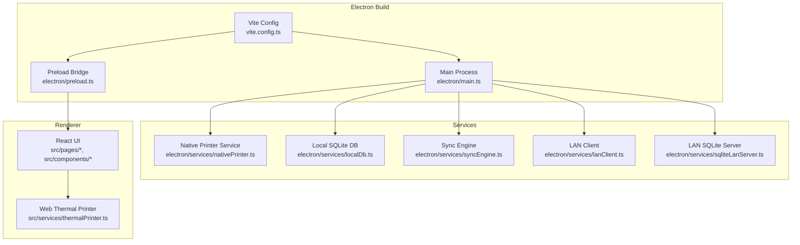
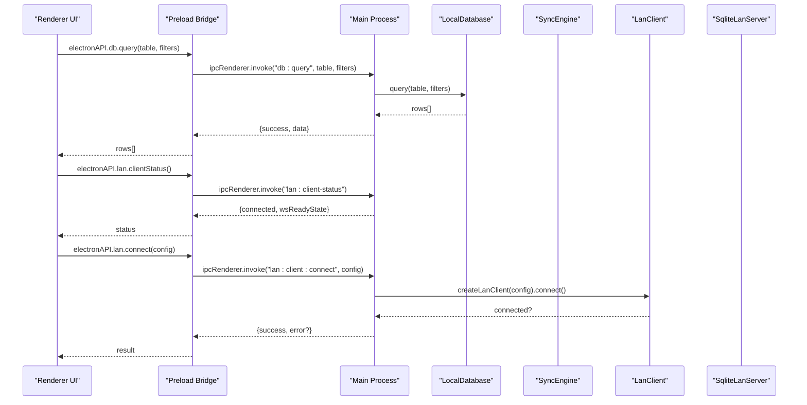
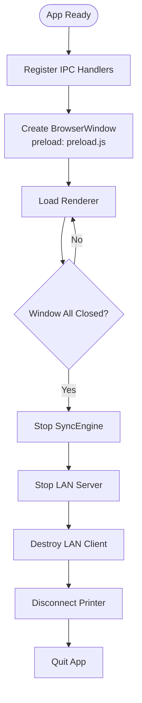
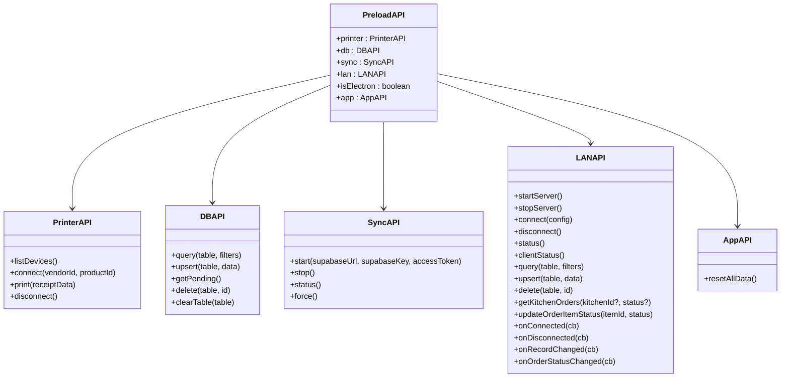
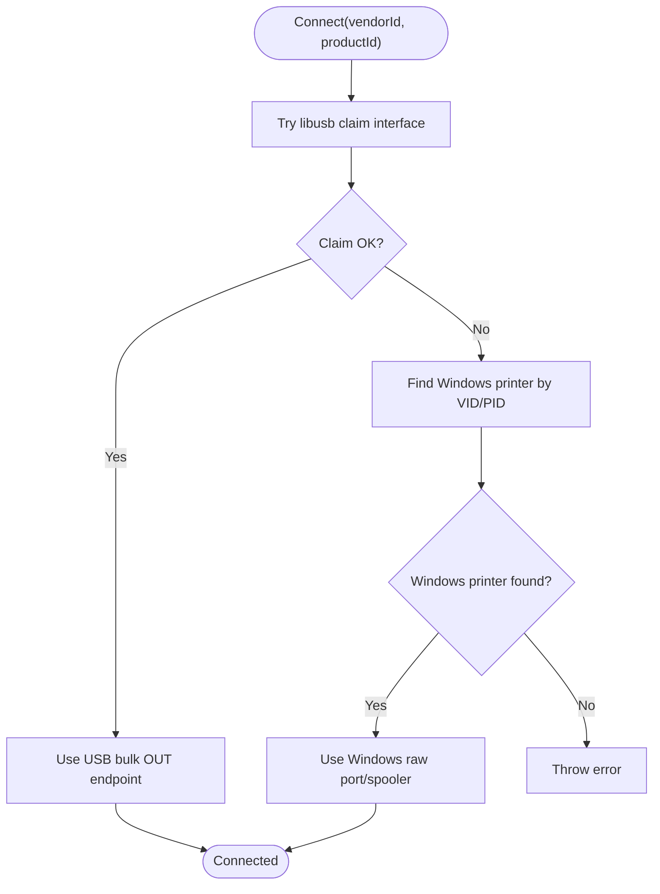
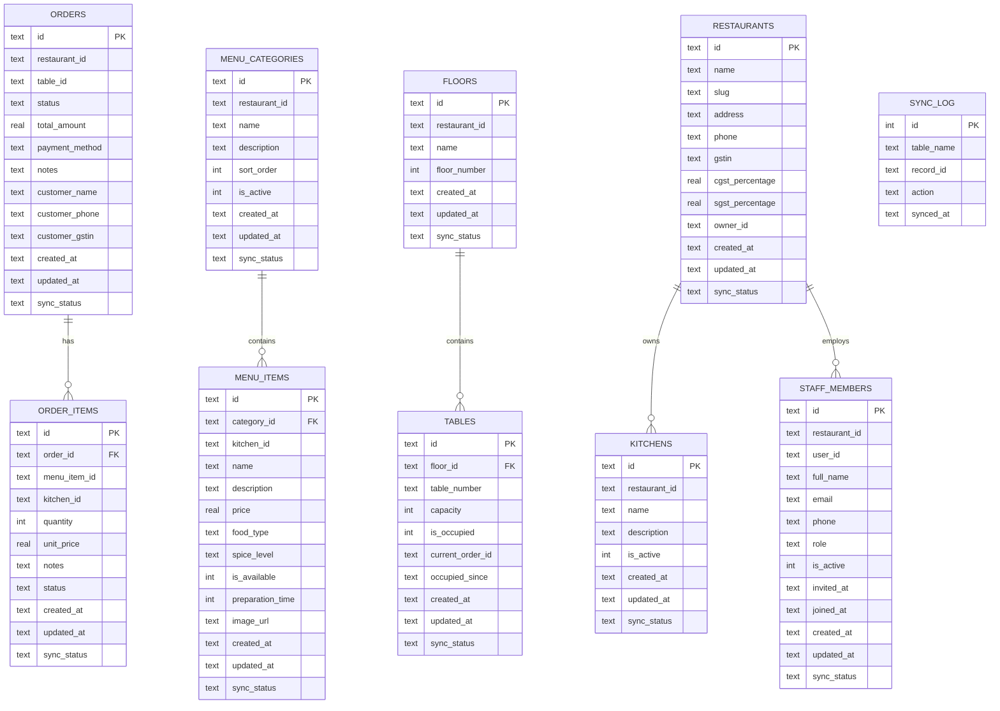
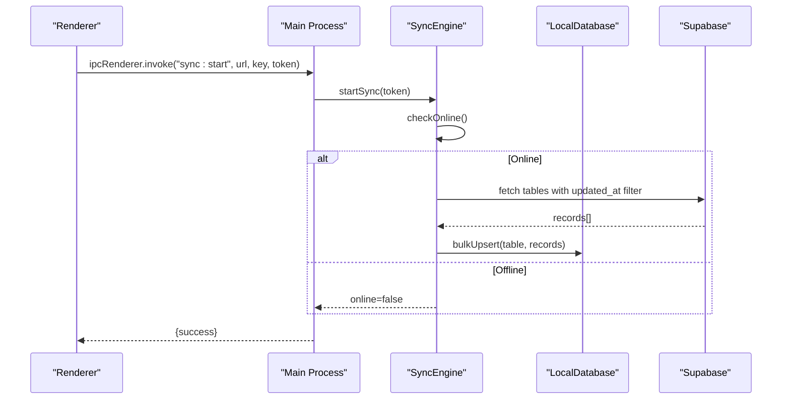
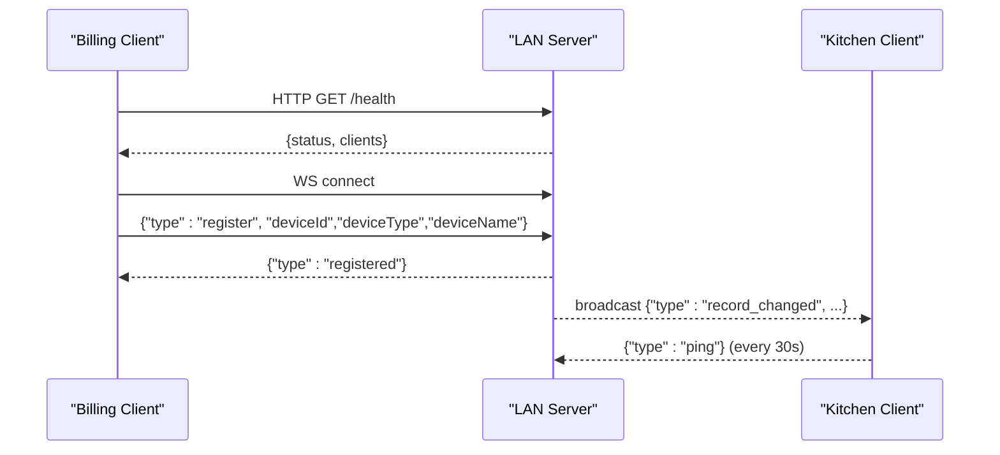
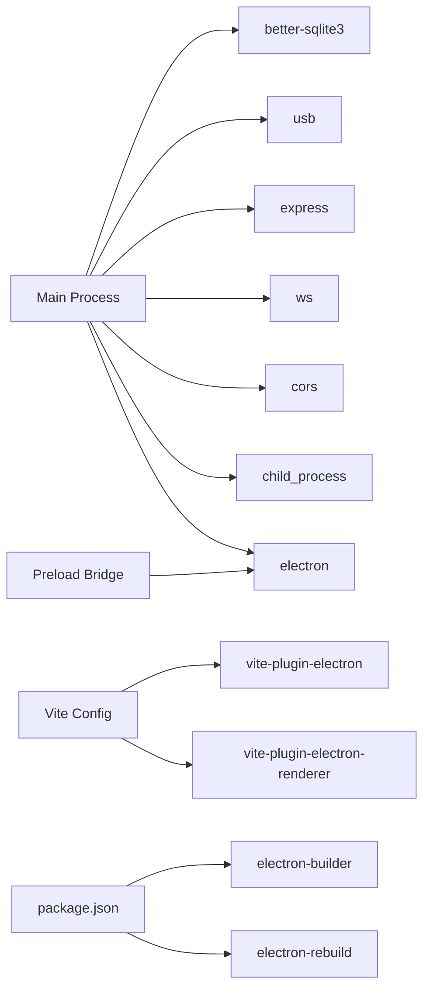
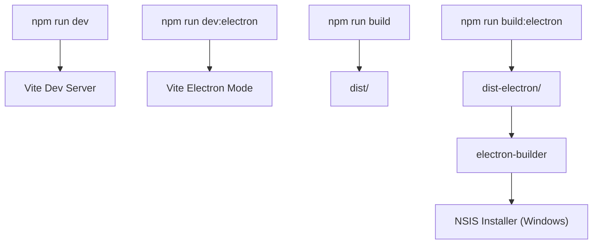

# Electron Desktop Integration

<cite>
**Referenced Files in This Document**
- [package.json](file://package.json)
- [vite.config.ts](file://vite.config.ts)
- [electron/main.ts](file://electron/main.ts)
- [electron/preload.ts](file://electron/preload.ts)
- [electron/services/nativePrinter.ts](file://electron/services/nativePrinter.ts)
- [electron/services/localDb.ts](file://electron/services/localDb.ts)
- [electron/services/syncEngine.ts](file://electron/services/syncEngine.ts)
- [electron/services/lanClient.ts](file://electron/services/lanClient.ts)
- [electron/services/sqliteLanServer.ts](file://electron/services/sqliteLanServer.ts)
- [src/services/thermalPrinter.ts](file://src/services/thermalPrinter.ts)
</cite>

## Table of Contents
1. [Introduction](#introduction)
2. [Project Structure](#project-structure)
3. [Core Components](#core-components)
4. [Architecture Overview](#architecture-overview)
5. [Detailed Component Analysis](#detailed-component-analysis)
6. [Dependency Analysis](#dependency-analysis)
7. [Performance Considerations](#performance-considerations)
8. [Security Considerations](#security-considerations)
9. [Build and Packaging](#build-and-packaging)
10. [Troubleshooting Guide](#troubleshooting-guide)
11. [Conclusion](#conclusion)

## Introduction
This document explains the Electron desktop integration architecture for the project. It covers the main process structure, preload bridge, inter-process communication (IPC) patterns, offline-first database design, LAN synchronization, native printer integration, and desktop packaging. It also highlights security hardening and platform-specific deployment considerations for Windows deployments.

## Project Structure
The desktop integration is implemented under the electron/ directory with supporting services and a preload bridge. The Vite configuration wires Electron builds and renders the React frontend. The package.json defines scripts, native module rebuild hooks, and electron-builder configuration for packaging.

**Diagram sources**
- [vite.config.ts:1-69](file://vite.config.ts#L1-L69)
- [electron/main.ts:1-450](file://electron/main.ts#L1-L450)
- [electron/preload.ts:1-90](file://electron/preload.ts#L1-L90)
- [electron/services/nativePrinter.ts:1-542](file://electron/services/nativePrinter.ts#L1-L542)
- [electron/services/localDb.ts:1-401](file://electron/services/localDb.ts#L1-L401)
- [electron/services/syncEngine.ts:1-124](file://electron/services/syncEngine.ts#L1-L124)
- [electron/services/lanClient.ts:1-364](file://electron/services/lanClient.ts#L1-L364)
- [electron/services/sqliteLanServer.ts:1-520](file://electron/services/sqliteLanServer.ts#L1-L520)
- [src/services/thermalPrinter.ts:1-339](file://src/services/thermalPrinter.ts#L1-L339)

**Section sources**
- [vite.config.ts:1-69](file://vite.config.ts#L1-L69)
- [package.json:1-131](file://package.json#L1-L131)

## Core Components
- Main process: Creates the BrowserWindow, registers IPC handlers for printer, database, sync, and LAN operations, and manages lifecycle events.
- Preload bridge: Exposes a typed API surface to the renderer via contextBridge, forwarding invocations to the main process.
- Native printer service: USB and Windows raw-port printing with fallbacks and Windows printer selection.
- Local database: Offline-first SQLite with sync tracking and indexes for key tables.
- Sync engine: One-time pull from Supabase into local SQLite; push is manual-triggered from the renderer.
- LAN client/server: HTTP + WebSocket server/client for multi-device synchronization and kitchen order streaming.

**Section sources**
- [electron/main.ts:1-450](file://electron/main.ts#L1-L450)
- [electron/preload.ts:1-90](file://electron/preload.ts#L1-L90)
- [electron/services/nativePrinter.ts:1-542](file://electron/services/nativePrinter.ts#L1-L542)
- [electron/services/localDb.ts:1-401](file://electron/services/localDb.ts#L1-L401)
- [electron/services/syncEngine.ts:1-124](file://electron/services/syncEngine.ts#L1-L124)
- [electron/services/lanClient.ts:1-364](file://electron/services/lanClient.ts#L1-L364)
- [electron/services/sqliteLanServer.ts:1-520](file://electron/services/sqliteLanServer.ts#L1-L520)

## Architecture Overview
The desktop app runs a single BrowserWindow with contextIsolation enabled and a preload bridge. Renderer code invokes electronAPI methods, which use ipcRenderer.invoke/listener to communicate with the main process. The main process delegates to service modules for printer control, local storage, synchronization, and LAN networking.

**Diagram sources**
- [electron/preload.ts:1-90](file://electron/preload.ts#L1-L90)
- [electron/main.ts:126-391](file://electron/main.ts#L126-L391)
- [electron/services/localDb.ts:247-268](file://electron/services/localDb.ts#L247-L268)
- [electron/services/lanClient.ts:65-144](file://electron/services/lanClient.ts#L65-L144)
- [electron/services/sqliteLanServer.ts:431-474](file://electron/services/sqliteLanServer.ts#L431-L474)

## Detailed Component Analysis

### Main Process
Responsibilities:
- Create BrowserWindow with preload and strict webPreferences.
- Register IPC handlers for:
  - Printer: list devices, connect, print raw, disconnect, Windows printer helpers.
  - Database: query, upsert, get pending, delete, clear table.
  - Sync: start, stop, status, force (deprecated).
  - LAN: server start/stop, client connect/disconnect, status, HTTP API wrappers, event forwarding.
- Manage app lifecycle: start services on ready, stop on window-all-closed.

**Diagram sources**
- [electron/main.ts:394-438](file://electron/main.ts#L394-L438)

**Section sources**
- [electron/main.ts:20-50](file://electron/main.ts#L20-L50)
- [electron/main.ts:52-124](file://electron/main.ts#L52-L124)
- [electron/main.ts:126-175](file://electron/main.ts#L126-L175)
- [electron/main.ts:177-224](file://electron/main.ts#L177-L224)
- [electron/main.ts:226-391](file://electron/main.ts#L226-L391)
- [electron/main.ts:393-450](file://electron/main.ts#L393-L450)

### Preload Bridge
Responsibilities:
- Expose electronAPI to renderer via contextBridge.
- Provide typed methods for printer, database, sync, LAN, and app reset.
- Support event subscriptions for LAN connection and record changes.

**Diagram sources**
- [electron/preload.ts:4-89](file://electron/preload.ts#L4-L89)

**Section sources**
- [electron/preload.ts:1-90](file://electron/preload.ts#L1-L90)

### Native Printer Service
Capabilities:
- Enumerate USB devices and filter by known thermal printer vendor IDs.
- Connect via libusb bulk endpoint or fall back to Windows raw port/spooler.
- Print raw ESC/POS buffers with chunked transfers.
- Windows-specific helpers: list matching printers by VID/PID, switch printers, and list all matching printers.

**Diagram sources**
- [electron/services/nativePrinter.ts:101-201](file://electron/services/nativePrinter.ts#L101-L201)
- [electron/services/nativePrinter.ts:207-229](file://electron/services/nativePrinter.ts#L207-L229)
- [electron/services/nativePrinter.ts:429-450](file://electron/services/nativePrinter.ts#L429-L450)

**Section sources**
- [electron/services/nativePrinter.ts:1-542](file://electron/services/nativePrinter.ts#L1-L542)

### Local Database (Offline-First)
Design:
- Uses better-sqlite3 with WAL mode and foreign keys enabled.
- Mirrors Supabase tables with sync_status tracking and indexes.
- Provides query, upsert (ON CONFLICT), bulkUpsert, getPendingSync, markSynced, delete, clear, and last sync time.

**Diagram sources**
- [electron/services/localDb.ts:15-160](file://electron/services/localDb.ts#L15-L160)

**Section sources**
- [electron/services/localDb.ts:1-401](file://electron/services/localDb.ts#L1-L401)

### Sync Engine
Behavior:
- One-time pull from Supabase to local SQLite on app start when online.
- Manual push is disabled/deprecated; push is triggered from renderer UI.
- Online detection via HEAD request to Supabase.

**Diagram sources**
- [electron/main.ts:177-224](file://electron/main.ts#L177-L224)
- [electron/services/syncEngine.ts:32-106](file://electron/services/syncEngine.ts#L32-L106)

**Section sources**
- [electron/services/syncEngine.ts:1-124](file://electron/services/syncEngine.ts#L1-L124)

### LAN Client and Server
- LAN Server: Express + WebSocket server with SQLite backend, exposes HTTP CRUD endpoints and broadcasts changes to clients.
- LAN Client: Registers device, maintains WebSocket, handles record change and order status events, queues messages until connected.

**Diagram sources**
- [electron/services/sqliteLanServer.ts:52-189](file://electron/services/sqliteLanServer.ts#L52-L189)
- [electron/services/sqliteLanServer.ts:191-229](file://electron/services/sqliteLanServer.ts#L191-L229)
- [electron/services/lanClient.ts:65-144](file://electron/services/lanClient.ts#L65-L144)
- [electron/services/lanClient.ts:146-164](file://electron/services/lanClient.ts#L146-L164)

**Section sources**
- [electron/services/lanClient.ts:1-364](file://electron/services/lanClient.ts#L1-L364)
- [electron/services/sqliteLanServer.ts:1-520](file://electron/services/sqliteLanServer.ts#L1-L520)

### Web Thermal Printer (Browser Path)
The renderer-side thermal printer service supports:
- Mobile: Capacitor-based Bluetooth printing.
- Desktop/Browser: HTML-to-print rendering with window.print.

Note: This is separate from the Electron-native printer service and is used when running in a browser context.

**Section sources**
- [src/services/thermalPrinter.ts:1-339](file://src/services/thermalPrinter.ts#L1-L339)

## Dependency Analysis
External native modules and integrations:
- better-sqlite3: Local database and LAN server storage.
- usb: Direct USB device enumeration and bulk transfer for printer.
- express + ws + cors: LAN server HTTP and WebSocket endpoints.
- node child_process: Windows PowerShell-based raw printing fallback.
- electron-builder: Packaging for Windows installer.

**Diagram sources**
- [package.json:13-131](file://package.json#L13-L131)
- [vite.config.ts:21-60](file://vite.config.ts#L21-L60)
- [electron/main.ts:1-11](file://electron/main.ts#L1-L11)

**Section sources**
- [package.json:17-106](file://package.json#L17-L106)
- [vite.config.ts:18-61](file://vite.config.ts#L18-L61)

## Performance Considerations
- SQLite WAL mode improves concurrency and write throughput for the LAN server.
- Chunked USB transfers prevent buffer overflows and improve reliability.
- LAN client queues messages until WebSocket opens to reduce lost updates.
- SyncEngine performs one-time pull; push is manual to avoid network contention.
- Consider batching database upserts and deferring heavy UI work during LAN broadcasts.

## Security Considerations
- Context isolation enabled; preload bridge exposes only explicit APIs.
- IPC handlers validate inputs and return structured {success,error} responses.
- Windows raw printing uses PowerShell with temporary files; ensure least-privilege execution and secure temp directories.
- LAN server listens locally; restrict exposure and monitor client counts.
- Avoid exposing internal paths or sensitive data in error responses.

**Section sources**
- [electron/main.ts:27-32](file://electron/main.ts#L27-L32)
- [electron/preload.ts:1-90](file://electron/preload.ts#L1-L90)
- [electron/services/nativePrinter.ts:455-509](file://electron/services/nativePrinter.ts#L455-L509)

## Build and Packaging
- Scripts:
  - dev: Vite dev server.
  - dev:electron: Vite with electron mode.
  - build: Vite build.
  - build:electron: Vite electron build followed by electron-builder.
  - postinstall: electron-rebuild for native modules (better-sqlite3, usb).
- Vite plugin wiring:
  - Electron main entry with externalized native modules.
  - Preload build as CJS library.
  - Renderer plugin for compatibility.
- electron-builder configuration:
  - appId, productName, output directory.
  - Windows target nsis with installer options.

**Diagram sources**
- [package.json:7-16](file://package.json#L7-L16)
- [vite.config.ts:21-60](file://vite.config.ts#L21-L60)
- [package.json:107-129](file://package.json#L107-L129)

**Section sources**
- [package.json:7-16](file://package.json#L7-L16)
- [package.json:107-129](file://package.json#L107-L129)
- [vite.config.ts:18-61](file://vite.config.ts#L18-L61)

## Troubleshooting Guide
Common issues and remedies:
- USB printer not found:
  - Ensure the device is connected and not a hub/HID device.
  - Install WinUSB driver using Zadig for direct USB access.
- Windows raw printing fails:
  - Verify a thermal/receipt printer is installed with a USB port.
  - Use the Windows printer selection helpers to choose the correct printer.
- LAN server fails to start:
  - Check port 3333 availability; stop other instances.
  - Confirm data directory creation permissions.
- LAN client disconnects:
  - Inspect reconnect timer and ping intervals.
  - Validate server health endpoint and firewall rules.
- Sync pull does not occur:
  - Confirm online connectivity and Supabase credentials.
  - Check initial pull logs and table filters.

**Section sources**
- [electron/services/nativePrinter.ts:113-121](file://electron/services/nativePrinter.ts#L113-L121)
- [electron/services/nativePrinter.ts:213-218](file://electron/services/nativePrinter.ts#L213-L218)
- [electron/services/sqliteLanServer.ts:458-467](file://electron/services/sqliteLanServer.ts#L458-L467)
- [electron/services/lanClient.ts:178-186](file://electron/services/lanClient.ts#L178-L186)
- [electron/services/syncEngine.ts:109-122](file://electron/services/syncEngine.ts#L109-L122)

## Conclusion
The desktop integration leverages a clean separation of concerns: a secure main process with explicit IPC handlers, a minimal preload bridge, robust offline-first SQLite, and a LAN stack for multi-device collaboration. Native printer support is comprehensive with USB and Windows fallbacks. Packaging uses electron-builder for Windows NSIS installers. Adhering to the documented patterns ensures maintainability and reliability across platforms.