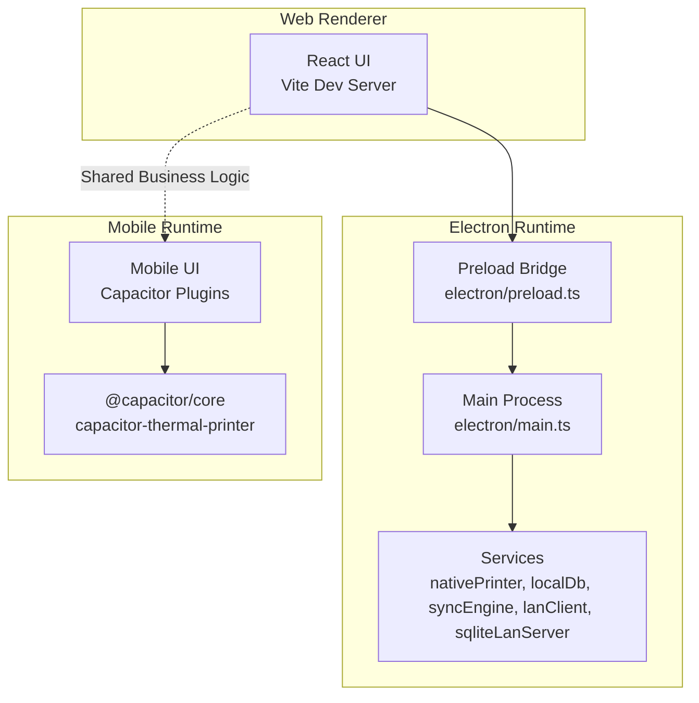
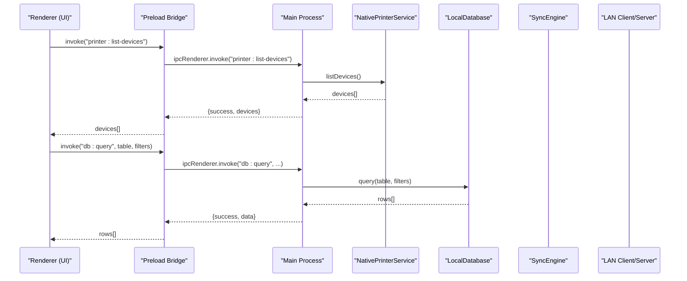
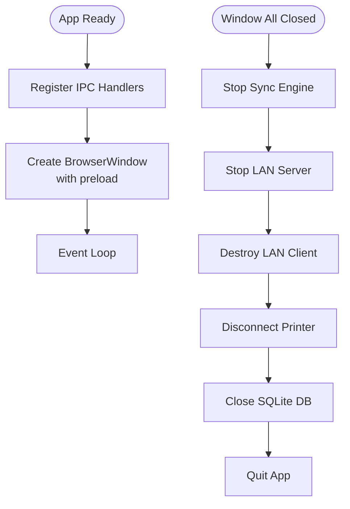
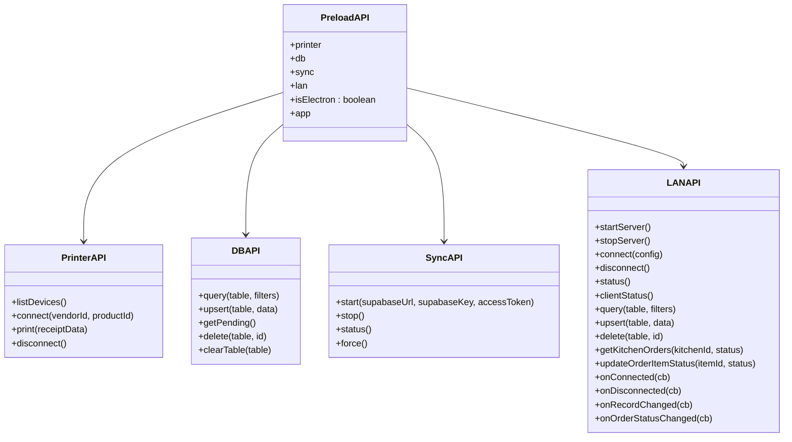
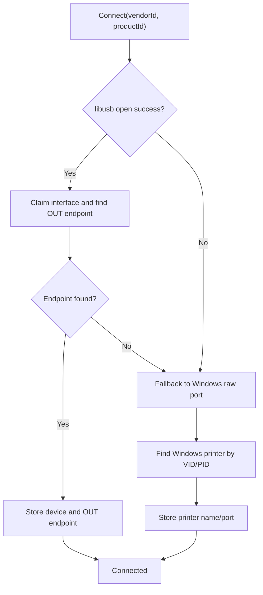
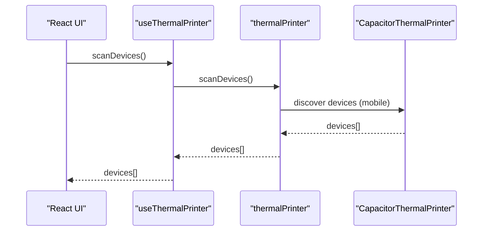
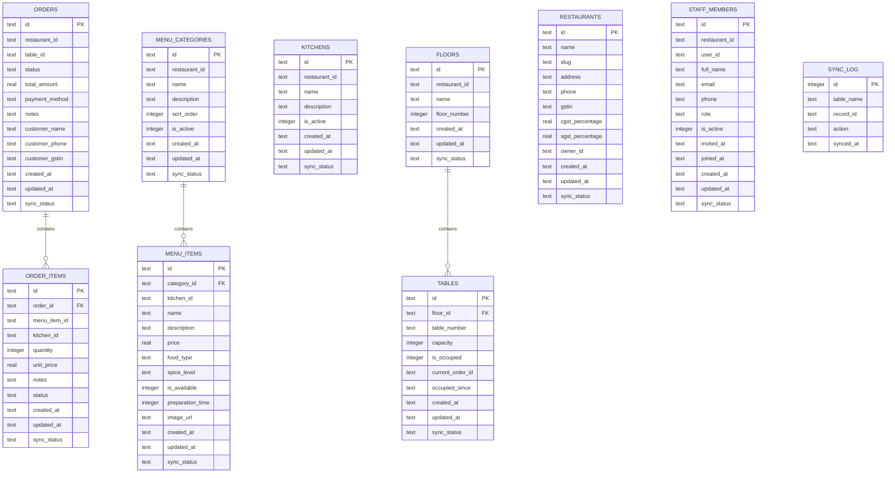
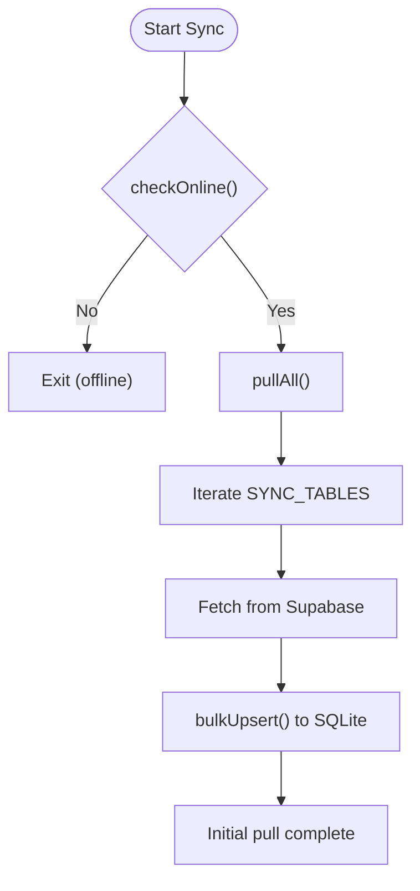
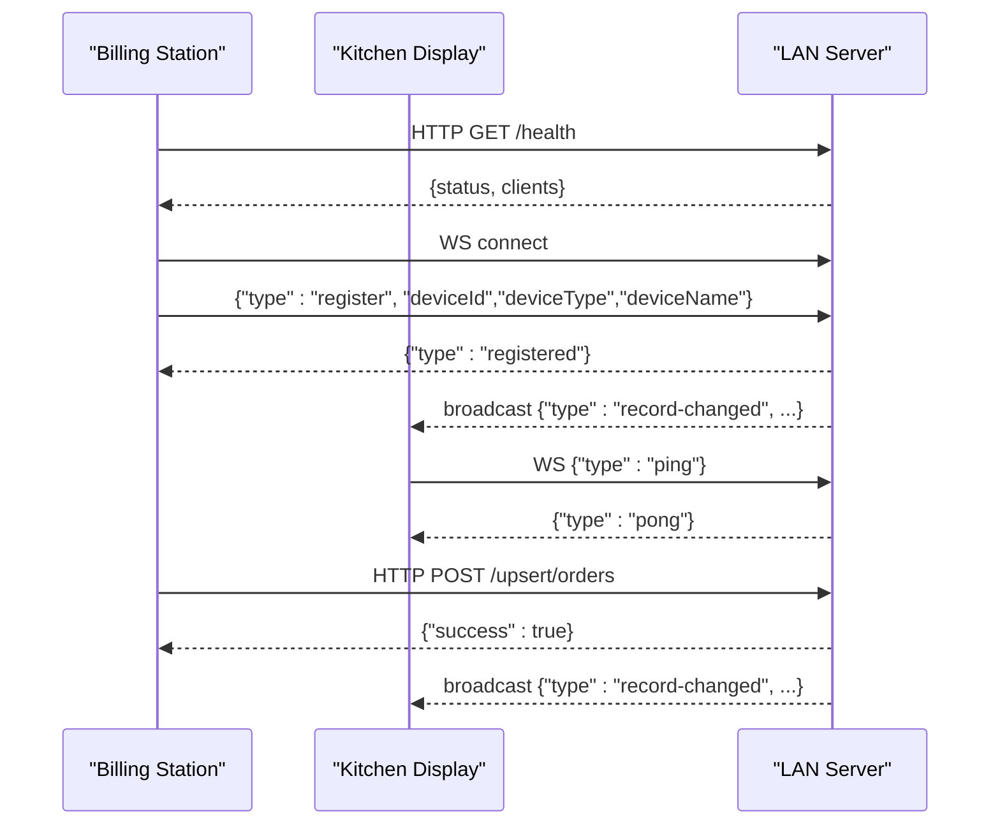
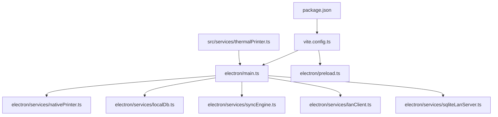

# Mobile & Desktop Integration

<cite>
**Referenced Files in This Document**
- [package.json](file://package.json)
- [vite.config.ts](file://vite.config.ts)
- [electron/main.ts](file://electron/main.ts)
- [electron/preload.ts](file://electron/preload.ts)
- [electron/services/nativePrinter.ts](file://electron/services/nativePrinter.ts)
- [electron/services/localDb.ts](file://electron/services/localDb.ts)
- [electron/services/syncEngine.ts](file://electron/services/syncEngine.ts)
- [electron/services/lanClient.ts](file://electron/services/lanClient.ts)
- [electron/services/sqliteLanServer.ts](file://electron/services/sqliteLanServer.ts)
- [src/services/thermalPrinter.ts](file://src/services/thermalPrinter.ts)
- [src/hooks/useThermalPrinter.ts](file://src/hooks/useThermalPrinter.ts)
- [src/components/PrinterSelector.tsx](file://src/components/PrinterSelector.tsx)
- [src/components/LanStartup.tsx](file://src/components/LanStartup.tsx)
</cite>

## Table of Contents
1. [Introduction](#introduction)
2. [Project Structure](#project-structure)
3. [Core Components](#core-components)
4. [Architecture Overview](#architecture-overview)
5. [Detailed Component Analysis](#detailed-component-analysis)
6. [Dependency Analysis](#dependency-analysis)
7. [Performance Considerations](#performance-considerations)
8. [Troubleshooting Guide](#troubleshooting-guide)
9. [Conclusion](#conclusion)
10. [Appendices](#appendices)

## Introduction
This document explains how TableFlow Pro integrates mobile and desktop experiences into a unified application. It covers Capacitor-based mobile/native capabilities, Electron’s main process architecture, and cross-platform development strategies. It documents platform-specific features, build and distribution processes, runtime environment differences, and the integration between web, mobile, and desktop applications. Practical examples demonstrate platform-specific implementations, plugin usage, and native feature integration. Security and preload script architecture for desktop, inter-process communication, and build optimization are addressed alongside platform-specific debugging and deployment strategies.

## Project Structure
The project is a React application built with Vite, extended with Electron for desktop and Capacitor for mobile/native capabilities. The Electron configuration enables a hybrid desktop runtime with a preload bridge exposing secure IPC channels to the renderer. Capacitor-based thermal printing is integrated for mobile devices, while desktop supports both USB and Windows printer spooler modes.

**Diagram sources**
- [vite.config.ts:1-69](file://vite.config.ts#L1-L69)
- [electron/main.ts:1-450](file://electron/main.ts#L1-L450)
- [electron/preload.ts:1-90](file://electron/preload.ts#L1-L90)
- [src/services/thermalPrinter.ts:1-169](file://src/services/thermalPrinter.ts#L1-L169)

**Section sources**
- [package.json:1-131](file://package.json#L1-L131)
- [vite.config.ts:1-69](file://vite.config.ts#L1-L69)

## Core Components
- Electron Main Process: Creates the BrowserWindow, registers IPC handlers for printer, database, sync, and LAN operations, and manages lifecycle events.
- Preload Bridge: Exposes a typed API surface to the renderer via contextBridge, enabling controlled IPC invocations.
- Native Printer Service: Manages USB and Windows printer spooler integration for desktop; mobile uses Capacitor thermal printer.
- Local Database: Offline-first SQLite storage mirroring Supabase tables with sync tracking.
- Sync Engine: One-way initial pull from cloud to local database; push is manual-triggered from the renderer.
- LAN Client/Server: Provides real-time synchronization between multiple desktop stations over LAN.

**Section sources**
- [electron/main.ts:1-450](file://electron/main.ts#L1-L450)
- [electron/preload.ts:1-90](file://electron/preload.ts#L1-L90)
- [electron/services/nativePrinter.ts:1-542](file://electron/services/nativePrinter.ts#L1-L542)
- [electron/services/localDb.ts:1-401](file://electron/services/localDb.ts#L1-L401)
- [electron/services/syncEngine.ts:1-124](file://electron/services/syncEngine.ts#L1-L124)
- [electron/services/lanClient.ts:1-364](file://electron/services/lanClient.ts#L1-L364)
- [electron/services/sqliteLanServer.ts:1-493](file://electron/services/sqliteLanServer.ts#L1-L493)

## Architecture Overview
The system separates concerns across platforms while sharing business logic. Desktop runs an Electron main process with a preload bridge, enabling secure IPC to native services. Mobile uses Capacitor plugins for thermal printing. Both desktop and mobile render a shared React UI.

**Diagram sources**
- [electron/preload.ts:1-90](file://electron/preload.ts#L1-L90)
- [electron/main.ts:53-124](file://electron/main.ts#L53-L124)
- [electron/services/nativePrinter.ts:56-96](file://electron/services/nativePrinter.ts#L56-L96)
- [electron/services/localDb.ts:247-268](file://electron/services/localDb.ts#L247-L268)

## Detailed Component Analysis

### Electron Main Process
The main process initializes the BrowserWindow, sets preload, and registers IPC handlers for:
- Printer operations: list devices, connect, print, disconnect, Windows printer selection helpers.
- Database operations: query, upsert, delete, clear, and pending sync retrieval.
- Sync operations: start, stop, status, and force push (deprecated).
- LAN operations: start/stop server, client connect/disconnect, status, and HTTP API passthrough.

Lifecycle management ensures clean shutdown of services and database.

**Diagram sources**
- [electron/main.ts:394-438](file://electron/main.ts#L394-L438)

**Section sources**
- [electron/main.ts:1-450](file://electron/main.ts#L1-L450)

### Preload Bridge and Security Model
The preload script exposes a single, typed API surface to the renderer using contextBridge. It defines namespaces for printer, database, sync, LAN, environment flags, and app management. All IPC calls are explicit and namespaced, minimizing attack surface.

**Diagram sources**
- [electron/preload.ts:4-89](file://electron/preload.ts#L4-L89)

**Section sources**
- [electron/preload.ts:1-90](file://electron/preload.ts#L1-L90)

### Native Printer Service (Desktop)
The native printer service supports:
- USB device enumeration and connection via libusb with fallback to Windows raw port printing.
- Windows printer detection by VID/PID, driver filtering, and spooler API invocation.
- Raw ESC/POS printing with chunked transfers and robust error handling.
- Dynamic printer switching on Windows when multiple drivers match the same device.

**Diagram sources**
- [electron/services/nativePrinter.ts:101-201](file://electron/services/nativePrinter.ts#L101-L201)
- [electron/services/nativePrinter.ts:207-229](file://electron/services/nativePrinter.ts#L207-L229)

**Section sources**
- [electron/services/nativePrinter.ts:1-542](file://electron/services/nativePrinter.ts#L1-L542)

### Capacitor Thermal Printing (Mobile)
The mobile thermal printing service detects native platform capability and uses Capacitor plugins to:
- Scan for Bluetooth thermal printers on mobile.
- Build ESC/POS receipts and print via the Capacitor plugin.
- Provide a typed interface for device discovery and printing.

**Diagram sources**
- [src/hooks/useThermalPrinter.ts:1-42](file://src/hooks/useThermalPrinter.ts#L1-L42)
- [src/services/thermalPrinter.ts:33-169](file://src/services/thermalPrinter.ts#L33-L169)

**Section sources**
- [src/services/thermalPrinter.ts:1-169](file://src/services/thermalPrinter.ts#L1-L169)
- [src/hooks/useThermalPrinter.ts:1-42](file://src/hooks/useThermalPrinter.ts#L1-L42)
- [src/components/PrinterSelector.tsx:1-44](file://src/components/PrinterSelector.tsx#L1-L44)

### Local Database (Offline-First)
The local database mirrors key Supabase tables and tracks sync status. It supports:
- Upsert with conflict resolution.
- Bulk upsert for initial sync.
- Pending sync retrieval for manual push.
- Indexes for efficient queries.

**Diagram sources**
- [electron/services/localDb.ts:15-160](file://electron/services/localDb.ts#L15-L160)

**Section sources**
- [electron/services/localDb.ts:1-401](file://electron/services/localDb.ts#L1-L401)

### Sync Engine (One-Way Cloud Pull)
The sync engine performs an initial pull from Supabase to local SQLite on app start when online. Push is manual-triggered from the renderer. Connectivity is checked via HEAD requests.

**Diagram sources**
- [electron/services/syncEngine.ts:32-106](file://electron/services/syncEngine.ts#L32-L106)

**Section sources**
- [electron/services/syncEngine.ts:1-124](file://electron/services/syncEngine.ts#L1-L124)

### LAN Client and Server (Multi-Station Real-Time Sync)
The LAN stack enables multi-station operation:
- Server: Express + WebSocket server with SQLite persistence, broadcasting record changes and order status updates.
- Client: WebSocket client with reconnection, ping, and HTTP API passthrough for queries and writes.

**Diagram sources**
- [electron/services/sqliteLanServer.ts:50-188](file://electron/services/sqliteLanServer.ts#L50-L188)
- [electron/services/lanClient.ts:65-144](file://electron/services/lanClient.ts#L65-L144)

**Section sources**
- [electron/services/sqliteLanServer.ts:1-493](file://electron/services/sqliteLanServer.ts#L1-L493)
- [electron/services/lanClient.ts:1-364](file://electron/services/lanClient.ts#L1-L364)
- [electron/main.ts:226-391](file://electron/main.ts#L226-L391)

### Platform-Specific Features and UI
- Mobile: Thermal printer selection and printing via Capacitor plugin; availability detection and device scanning.
- Desktop: USB printer enumeration, Windows printer spooler integration, and LAN server/client management.

**Section sources**
- [src/components/PrinterSelector.tsx:1-44](file://src/components/PrinterSelector.tsx#L1-L44)
- [src/components/LanStartup.tsx:1-216](file://src/components/LanStartup.tsx#L1-L216)
- [electron/main.ts:53-124](file://electron/main.ts#L53-L124)
- [electron/main.ts:226-391](file://electron/main.ts#L226-L391)

## Dependency Analysis
The project integrates Electron, Capacitor, and related native modules. Build-time and runtime dependencies are managed via Vite and Electron plugins. Desktop relies on better-sqlite3, ws, express, and usb for native capabilities.

**Diagram sources**
- [package.json:1-131](file://package.json#L1-L131)
- [vite.config.ts:1-69](file://vite.config.ts#L1-L69)
- [electron/main.ts:1-450](file://electron/main.ts#L1-L450)
- [src/services/thermalPrinter.ts:1-169](file://src/services/thermalPrinter.ts#L1-L169)

**Section sources**
- [package.json:1-131](file://package.json#L1-L131)
- [vite.config.ts:1-69](file://vite.config.ts#L1-L69)

## Performance Considerations
- Desktop printing: Chunked transfers and endpoint validation reduce stalls; Windows spooler fallback improves compatibility.
- Database: WAL mode and foreign keys enabled; indexes on frequently queried columns improve query performance.
- LAN: WebSocket ping keeps connections alive; message queue buffers ensure reliability during reconnection.
- Build: Vite mode toggles enable development hot reload and production builds; externalization avoids bundling native modules.

[No sources needed since this section provides general guidance]

## Troubleshooting Guide
- Printer not found on desktop:
  - Ensure libusb driver installed or Windows printer driver configured.
  - Use Windows printer selection helpers to choose the correct driver for the same VID/PID.
- LAN server fails to start:
  - Verify port availability and firewall settings; check server status and error logs.
- Sync errors:
  - Confirm network connectivity and Supabase credentials; initial pull occurs only when online.
- IPC failures:
  - Validate preload exposure and ensure renderer invokes correct channel names.

**Section sources**
- [electron/services/nativePrinter.ts:207-229](file://electron/services/nativePrinter.ts#L207-L229)
- [electron/services/sqliteLanServer.ts:404-447](file://electron/services/sqliteLanServer.ts#L404-L447)
- [electron/services/syncEngine.ts:109-122](file://electron/services/syncEngine.ts#L109-L122)
- [electron/preload.ts:4-89](file://electron/preload.ts#L4-L89)

## Conclusion
TableFlow Pro unifies web, mobile, and desktop experiences through a shared UI and platform-specific integrations. Electron’s main process and preload bridge provide secure, typed IPC to native services, while Capacitor enables mobile thermal printing. The LAN server-client model delivers real-time multi-station synchronization, and offline-first SQLite ensures resilience. With clear separation of concerns and robust IPC, the system scales across platforms while maintaining a consistent developer experience.

[No sources needed since this section summarizes without analyzing specific files]

## Appendices

### Build and Distribution
- Scripts:
  - Development: Vite dev server for web; Electron mode for desktop dev.
  - Production: Vite build for web; Electron build plus electron-builder packaging.
- Packaging:
  - App identifiers, product name, output directory, and NSIS installer options configured for Windows.

**Section sources**
- [package.json:7-16](file://package.json#L7-L16)
- [package.json:107-129](file://package.json#L107-L129)

### Cross-Platform Strategies
- Shared business logic in the renderer leverages platform checks to route to Capacitor or preload APIs.
- Desktop-specific features (USB, Windows printer spooler) are isolated behind IPC handlers.
- Mobile-specific features (bluetooth scanning) are encapsulated in the thermal printer service.

**Section sources**
- [src/services/thermalPrinter.ts:33-44](file://src/services/thermalPrinter.ts#L33-L44)
- [electron/preload.ts:4-89](file://electron/preload.ts#L4-L89)

### Security Considerations (Desktop)
- contextIsolation enabled; Node integration disabled in BrowserWindow.
- Preload exposes only explicitly defined channels; renderer cannot access Node APIs directly.
- IPC handlers validate inputs and propagate structured errors.

**Section sources**
- [electron/main.ts:27-32](file://electron/main.ts#L27-L32)
- [electron/preload.ts:1-90](file://electron/preload.ts#L1-L90)