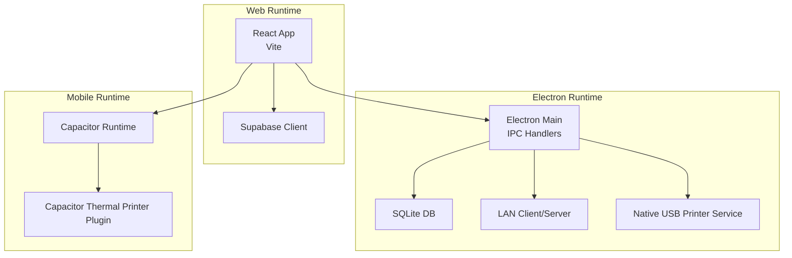
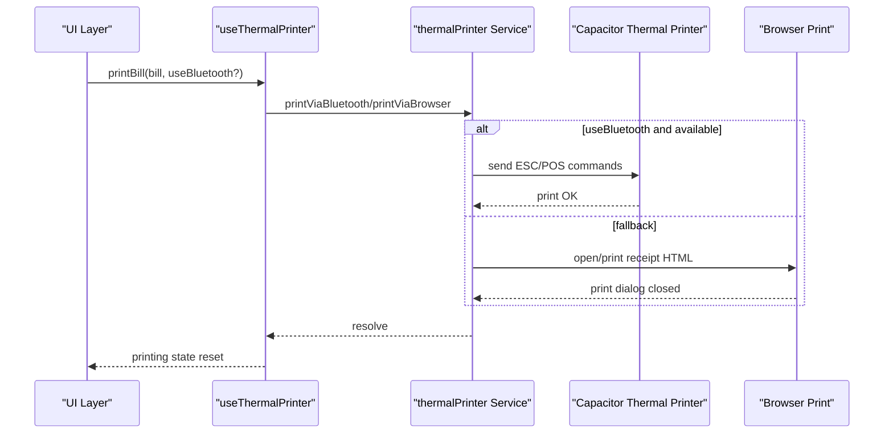
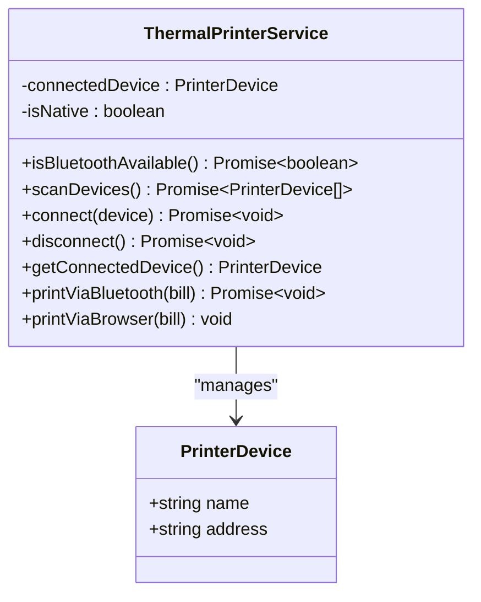
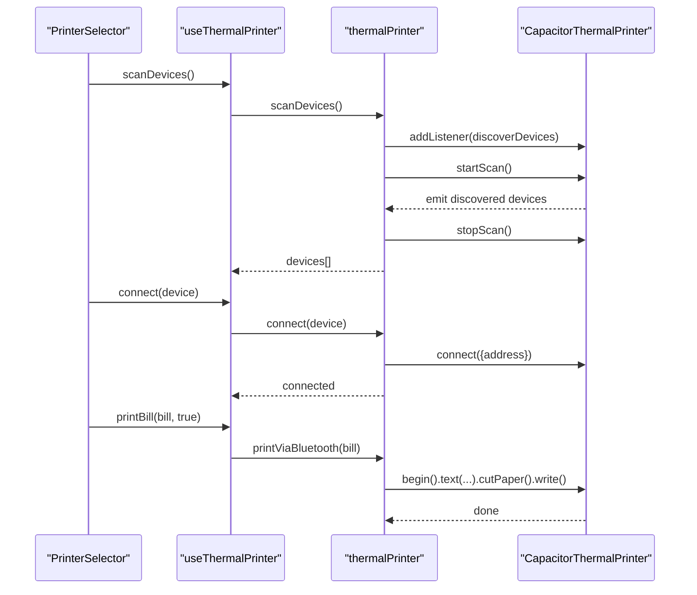
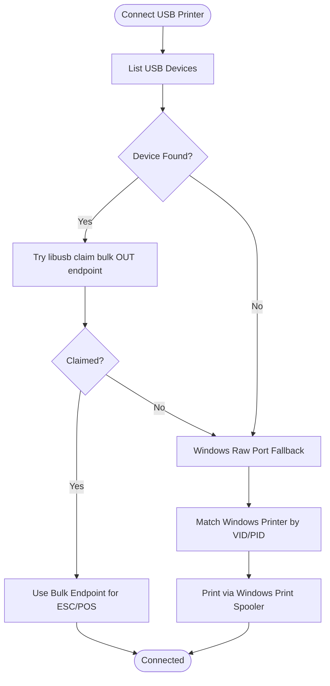
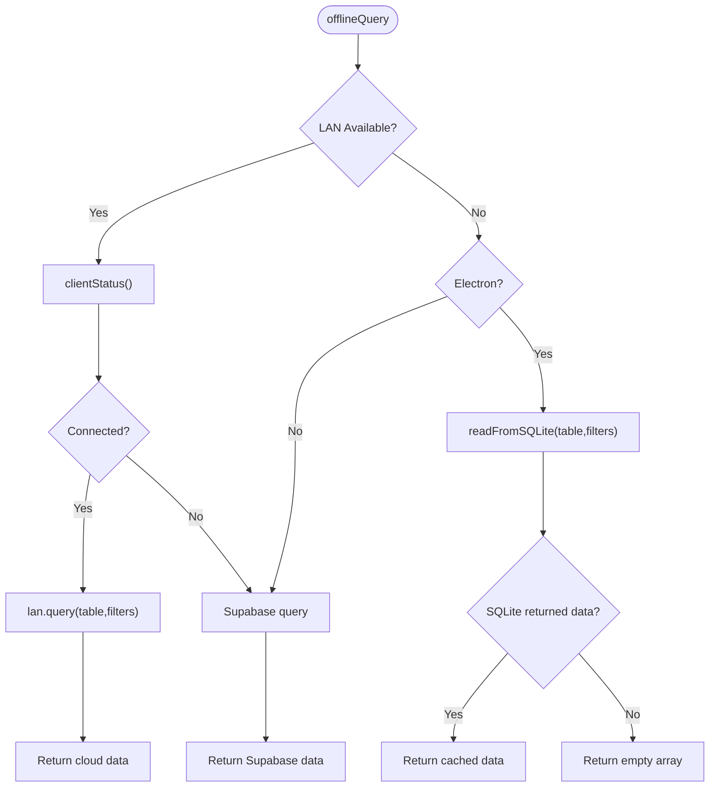
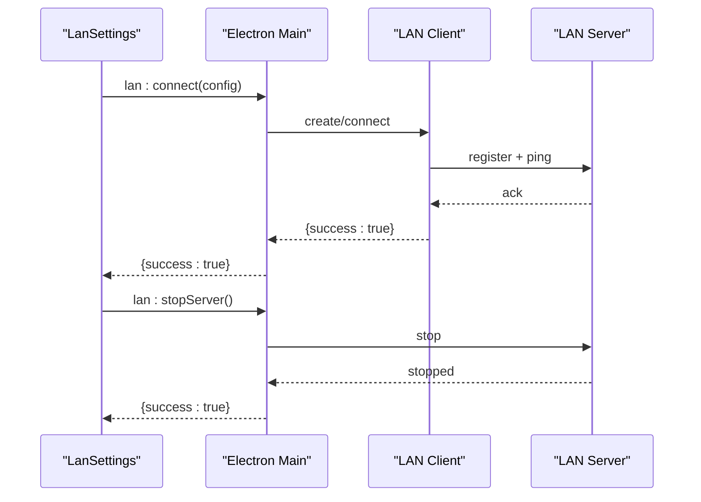
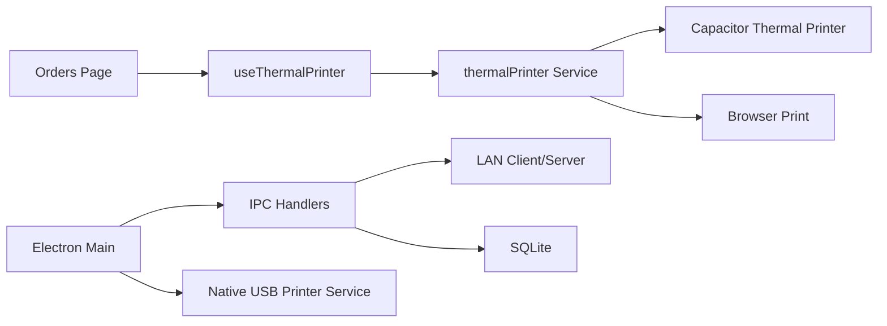

# Platform-Specific Features

<cite>
**Referenced Files in This Document**
- [thermalPrinter.ts](file://src/services/thermalPrinter.ts)
- [useThermalPrinter.ts](file://src/hooks/useThermalPrinter.ts)
- [PrinterSelector.tsx](file://src/components/PrinterSelector.tsx)
- [use-mobile.tsx](file://src/hooks/use-mobile.tsx)
- [offlineDataService.ts](file://src/services/offlineDataService.ts)
- [Orders.tsx](file://src/pages/dashboard/Orders.tsx)
- [nativePrinter.ts](file://electron/services/nativePrinter.ts)
- [main.ts](file://electron/main.ts)
- [lanClient.ts](file://electron/services/lanClient.ts)
- [LanSettings.tsx](file://src/pages/LanSettings.tsx)
- [LanStartup.tsx](file://src/components/LanStartup.tsx)
- [App.tsx](file://src/App.tsx)
- [vite.config.ts](file://vite.config.ts)
- [package.json](file://package.json)
</cite>

## Table of Contents
1. [Introduction](#introduction)
2. [Project Structure](#project-structure)
3. [Core Components](#core-components)
4. [Architecture Overview](#architecture-overview)
5. [Detailed Component Analysis](#detailed-component-analysis)
6. [Dependency Analysis](#dependency-analysis)
7. [Performance Considerations](#performance-considerations)
8. [Troubleshooting Guide](#troubleshooting-guide)
9. [Conclusion](#conclusion)

## Introduction
This document explains platform-specific features and capabilities in TableFlow Pro, focusing on:
- Thermal printer integration for desktop and mobile platforms (Bluetooth on mobile, browser printing on web, native USB printing on desktop Electron builds)
- Offline-first architecture across platforms (Supabase on web, SQLite-first on Electron, LAN peer-to-peer mode)
- Practical UI adaptations and performance optimizations per platform
- Feature availability matrices, limitations, and fallback strategies

## Project Structure
TableFlow Pro uses a hybrid architecture:
- Web UI built with React and Vite
- Electron mode for desktop with native capabilities (USB printers, LAN server/client)
- Capacitor-based mobile bridge for thermal printer APIs

**Diagram sources**
- [App.tsx:32-34](file://src/App.tsx#L32-L34)
- [vite.config.ts:10](file://vite.config.ts#L10)
- [package.json:13](file://package.json#L13)

**Section sources**
- [App.tsx:32-34](file://src/App.tsx#L32-L34)
- [vite.config.ts:10](file://vite.config.ts#L10)
- [package.json:13](file://package.json#L13)

## Core Components
- Thermal printer abstraction and hooks for cross-platform printing
- Offline data service with SQLite-first strategy and LAN mode
- Native USB printer service for desktop Electron builds
- LAN client/server for multi-device deployments

**Section sources**
- [thermalPrinter.ts:33-339](file://src/services/thermalPrinter.ts#L33-L339)
- [useThermalPrinter.ts:4-69](file://src/hooks/useThermalPrinter.ts#L4-L69)
- [offlineDataService.ts:151-347](file://src/services/offlineDataService.ts#L151-L347)
- [nativePrinter.ts:45-531](file://electron/services/nativePrinter.ts#L45-L531)

## Architecture Overview
The system adapts its data and printer pathways by platform:
- Web: Direct Supabase queries; browser print for receipts
- Electron: SQLite-first, optional LAN sync, native USB printing
- Mobile: Capacitor-based Bluetooth thermal printing

**Diagram sources**
- [useThermalPrinter.ts:43-54](file://src/hooks/useThermalPrinter.ts#L43-L54)
- [thermalPrinter.ts:118-219](file://src/services/thermalPrinter.ts#L118-L219)
- [thermalPrinter.ts:221-335](file://src/services/thermalPrinter.ts#L221-L335)

**Section sources**
- [useThermalPrinter.ts:4-69](file://src/hooks/useThermalPrinter.ts#L4-L69)
- [thermalPrinter.ts:33-39](file://src/services/thermalPrinter.ts#L33-L39)

## Detailed Component Analysis

### Thermal Printer Integration

#### Cross-Platform Abstraction
- Detects native vs web platform and restricts Bluetooth operations to native environments
- Exposes unified methods for scanning, connecting, disconnecting, and printing

**Diagram sources**
- [thermalPrinter.ts:33-339](file://src/services/thermalPrinter.ts#L33-L339)

**Section sources**
- [thermalPrinter.ts:33-39](file://src/services/thermalPrinter.ts#L33-L39)
- [thermalPrinter.ts:41-112](file://src/services/thermalPrinter.ts#L41-L112)
- [thermalPrinter.ts:118-219](file://src/services/thermalPrinter.ts#L118-L219)
- [thermalPrinter.ts:221-335](file://src/services/thermalPrinter.ts#L221-L335)

#### Mobile Bluetooth Flow
- Uses Capacitor plugin to discover and connect to BLE thermal printers
- Builds ESC/POS receipt and writes to printer

**Diagram sources**
- [PrinterSelector.tsx:30-58](file://src/components/PrinterSelector.tsx#L30-L58)
- [useThermalPrinter.ts:17-36](file://src/hooks/useThermalPrinter.ts#L17-L36)
- [thermalPrinter.ts:41-87](file://src/services/thermalPrinter.ts#L41-L87)
- [thermalPrinter.ts:89-112](file://src/services/thermalPrinter.ts#L89-L112)
- [thermalPrinter.ts:118-219](file://src/services/thermalPrinter.ts#L118-L219)

**Section sources**
- [PrinterSelector.tsx:60-77](file://src/components/PrinterSelector.tsx#L60-L77)
- [useThermalPrinter.ts:17-36](file://src/hooks/useThermalPrinter.ts#L17-L36)
- [thermalPrinter.ts:41-112](file://src/services/thermalPrinter.ts#L41-L112)

#### Desktop Native USB Printing
- Lists USB devices and attempts direct bulk transfer or Windows raw port fallback
- Supports switching Windows printer targets and enumerating matching printers

**Diagram sources**
- [nativePrinter.ts:56-96](file://electron/services/nativePrinter.ts#L56-L96)
- [nativePrinter.ts:101-201](file://electron/services/nativePrinter.ts#L101-L201)
- [nativePrinter.ts:207-325](file://electron/services/nativePrinter.ts#L207-L325)
- [nativePrinter.ts:429-509](file://electron/services/nativePrinter.ts#L429-L509)

**Section sources**
- [nativePrinter.ts:45-531](file://electron/services/nativePrinter.ts#L45-L531)

#### Web Browser Printing
- Generates receipt HTML and opens browser print dialog
- Includes QR code generation and fallback handling

**Section sources**
- [thermalPrinter.ts:221-335](file://src/services/thermalPrinter.ts#L221-L335)

### Offline-First Architecture

#### Data Access Strategy
- Electron SQLite-first: reads from local DB; writes mark records as pending_sync
- LAN mode: routes queries/upserts/deletes to LAN server
- Web: direct Supabase calls

**Diagram sources**
- [offlineDataService.ts:151-211](file://src/services/offlineDataService.ts#L151-L211)

**Section sources**
- [offlineDataService.ts:151-211](file://src/services/offlineDataService.ts#L151-L211)
- [offlineDataService.ts:220-287](file://src/services/offlineDataService.ts#L220-L287)
- [offlineDataService.ts:295-347](file://src/services/offlineDataService.ts#L295-L347)

#### Mutation and Deletion Semantics
- Electron local: writes to SQLite with pending_sync/pending_delete
- LAN: writes to LAN server; broadcasts to peers
- Web: writes to Supabase directly

**Section sources**
- [offlineDataService.ts:220-287](file://src/services/offlineDataService.ts#L220-L287)
- [offlineDataService.ts:295-347](file://src/services/offlineDataService.ts#L295-L347)

#### LAN Multi-Device Deployment
- Electron main process exposes IPC handlers for LAN client/server
- LAN client maintains WebSocket connection and registers device
- UI components allow starting/stopping server and connecting as client

**Diagram sources**
- [LanSettings.tsx:174-229](file://src/pages/LanSettings.tsx#L174-L229)
- [main.ts:304-373](file://electron/main.ts#L304-L373)
- [lanClient.ts:78-120](file://electron/services/lanClient.ts#L78-L120)

**Section sources**
- [LanSettings.tsx:146-233](file://src/pages/LanSettings.tsx#L146-L233)
- [main.ts:304-373](file://electron/main.ts#L304-L373)
- [lanClient.ts:78-344](file://electron/services/lanClient.ts#L78-L344)

### Platform-Specific UI Adaptations and Optimizations

- Mobile detection and responsive UI:
  - A dedicated hook detects mobile breakpoints and enables mobile-first layouts
  - Printer selector dialog adapts icons and messaging for mobile vs desktop

- Router adaptation:
  - Uses HashRouter for Electron (file:// protocol) and BrowserRouter for web

- Printer selector UX:
  - Shows “only available on mobile” message on desktop
  - Provides scanning, connecting, and disconnecting actions with loading states

**Section sources**
- [use-mobile.tsx:1-20](file://src/hooks/use-mobile.tsx#L1-L20)
- [App.tsx:32-34](file://src/App.tsx#L32-L34)
- [PrinterSelector.tsx:60-77](file://src/components/PrinterSelector.tsx#L60-L77)
- [PrinterSelector.tsx:106-167](file://src/components/PrinterSelector.tsx#L106-L167)

### Feature Availability Matrix

- Web
  - Thermal printing: browser print only
  - Offline data: Supabase only
  - LAN: not applicable

- Electron (Desktop)
  - Thermal printing: browser print, native USB
  - Offline data: SQLite-first, optional LAN
  - LAN: server/client mode

- Mobile (Capacitor)
  - Thermal printing: Bluetooth via plugin
  - Offline data: not applicable
  - LAN: not applicable

**Section sources**
- [thermalPrinter.ts:37-39](file://src/services/thermalPrinter.ts#L37-L39)
- [thermalPrinter.ts:221-335](file://src/services/thermalPrinter.ts#L221-L335)
- [offlineDataService.ts:151-211](file://src/services/offlineDataService.ts#L151-L211)
- [LanSettings.tsx:174-229](file://src/pages/LanSettings.tsx#L174-L229)

## Dependency Analysis

**Diagram sources**
- [Orders.tsx:63-64](file://src/pages/dashboard/Orders.tsx#L63-L64)
- [useThermalPrinter.ts:2-2](file://src/hooks/useThermalPrinter.ts#L2-L2)
- [thermalPrinter.ts:1-2](file://src/services/thermalPrinter.ts#L1-L2)
- [main.ts:304-373](file://electron/main.ts#L304-L373)
- [nativePrinter.ts:45-531](file://electron/services/nativePrinter.ts#L45-L531)

**Section sources**
- [Orders.tsx:63-64](file://src/pages/dashboard/Orders.tsx#L63-L64)
- [useThermalPrinter.ts:2-2](file://src/hooks/useThermalPrinter.ts#L2-L2)
- [thermalPrinter.ts:1-2](file://src/services/thermalPrinter.ts#L1-L2)
- [main.ts:304-373](file://electron/main.ts#L304-L373)

## Performance Considerations
- Mobile Bluetooth printing:
  - Scanner stops after a fixed timeout to avoid long scans
  - Debounce connect/disconnect actions to prevent race conditions

- Desktop native USB printing:
  - Chunked transfers to reduce memory pressure
  - Fallback to Windows raw port when kernel driver is unavailable

- Offline data:
  - SQLite-first reads avoid network latency
  - Pending sync records grouped by table and processed in dependency order to avoid FK violations

[No sources needed since this section provides general guidance]

## Troubleshooting Guide

- Thermal printer not available on desktop
  - Expected: Bluetooth printing is restricted to native/mobile platforms
  - Action: Use browser print for receipts on desktop

- Bluetooth scanning fails or device not found
  - Verify device is paired and advertising
  - Ensure Capacitor plugin permissions are granted

- Native USB printer not responding
  - Confirm device is connected and recognized by OS
  - Install appropriate drivers (WinUSB/Zadig) on Windows
  - Try Windows raw port fallback if bulk endpoint not available

- Offline data not syncing
  - Ensure online connectivity before manual sync
  - Review pending sync count and error logs
  - Validate foreign keys and IDs are valid UUIDs

**Section sources**
- [PrinterSelector.tsx:60-77](file://src/components/PrinterSelector.tsx#L60-L77)
- [thermalPrinter.ts:41-87](file://src/services/thermalPrinter.ts#L41-L87)
- [nativePrinter.ts:111-121](file://electron/services/nativePrinter.ts#L111-L121)
- [offlineDataService.ts:397-541](file://src/services/offlineDataService.ts#L397-L541)

## Conclusion
TableFlow Pro delivers a cohesive cross-platform experience:
- Unified thermal printing abstraction with platform-appropriate backends
- Robust offline-first data access with SQLite-first and LAN modes
- Practical UI adaptations and performance optimizations tailored to each runtime
- Clear feature availability boundaries and fallback strategies for unsupported scenarios