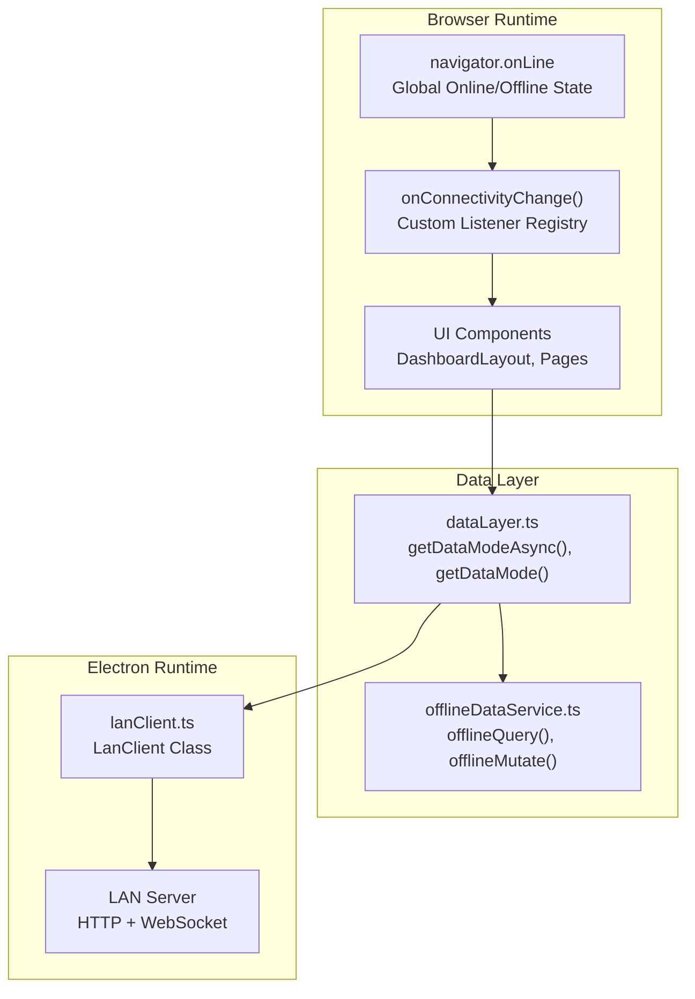
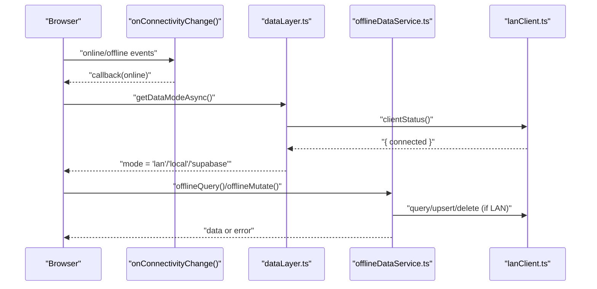
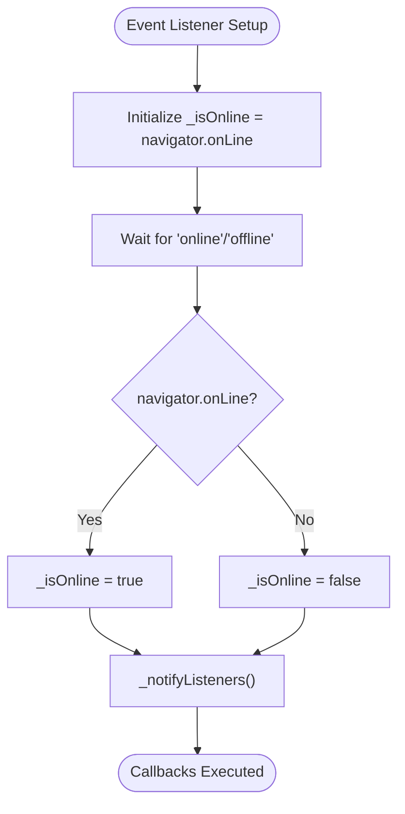
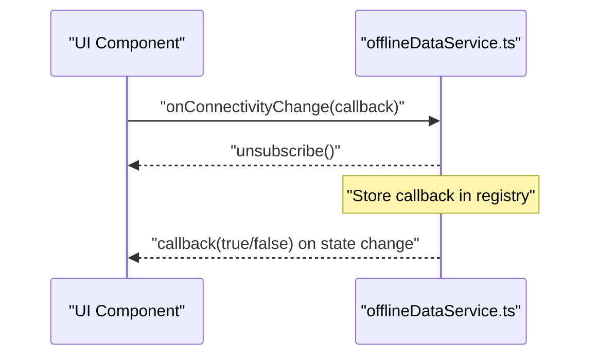
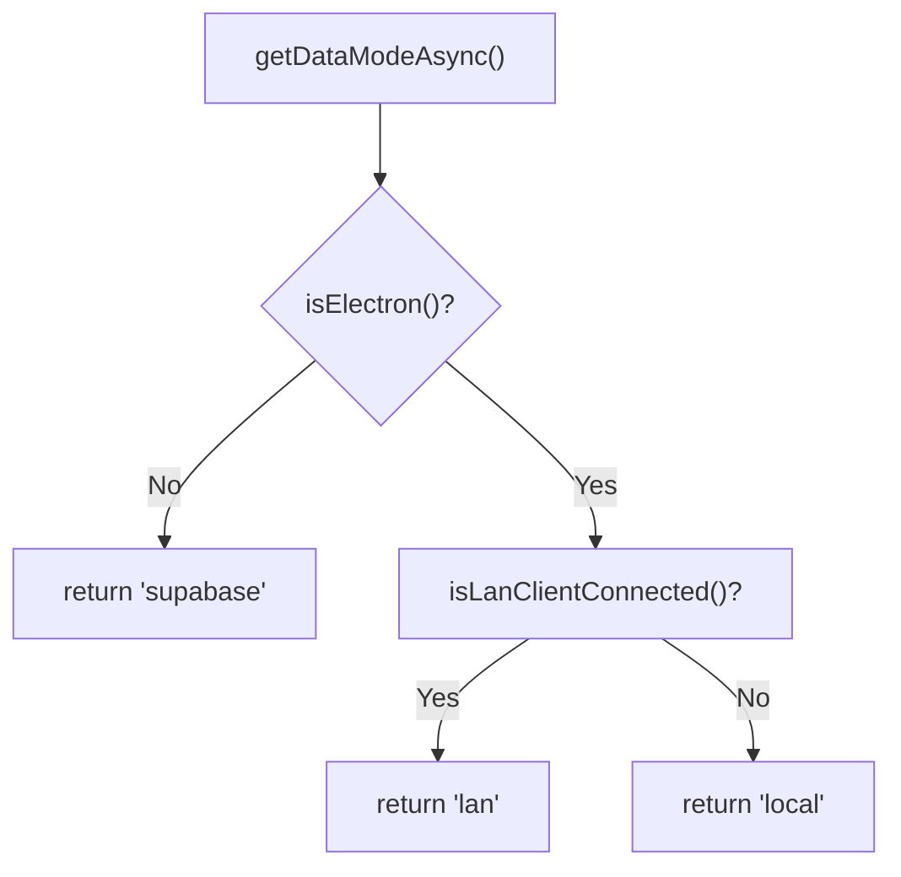
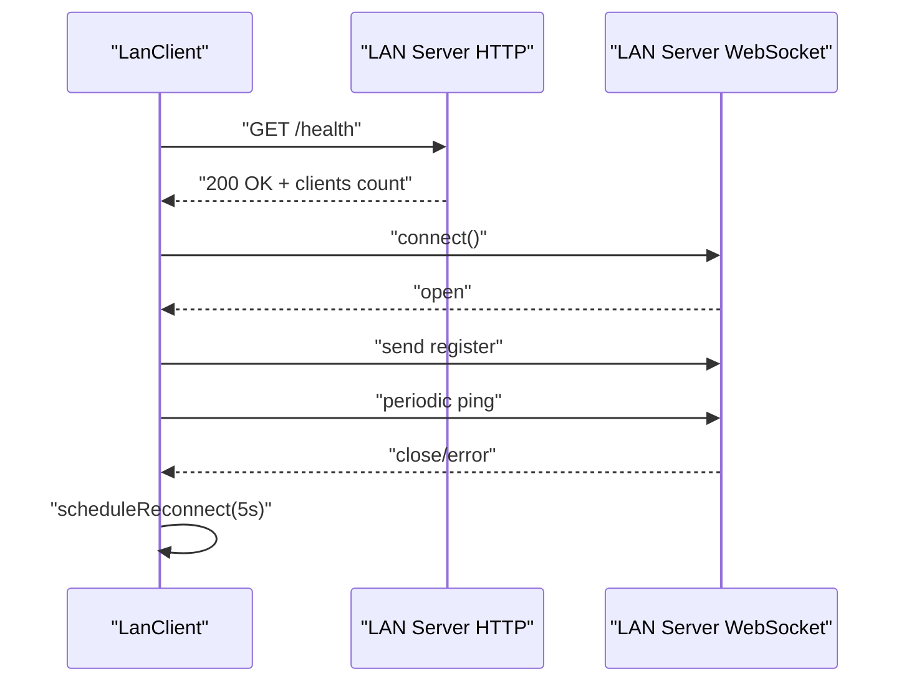
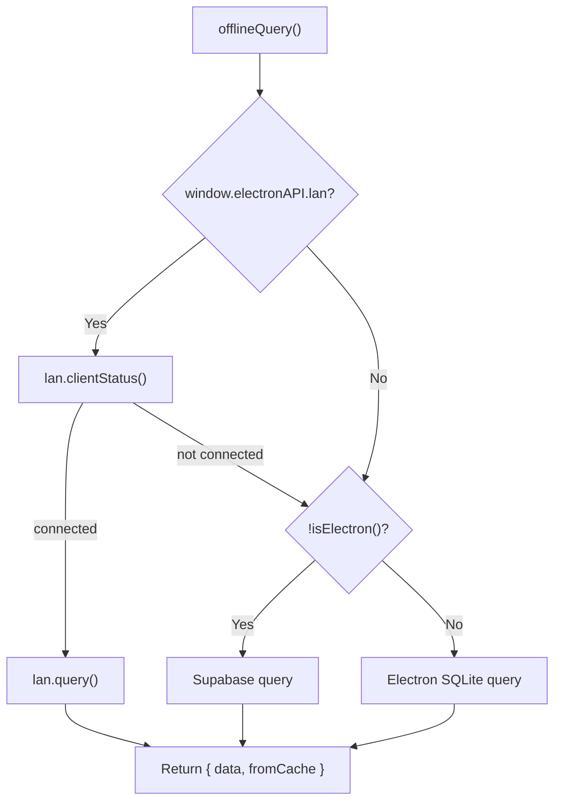
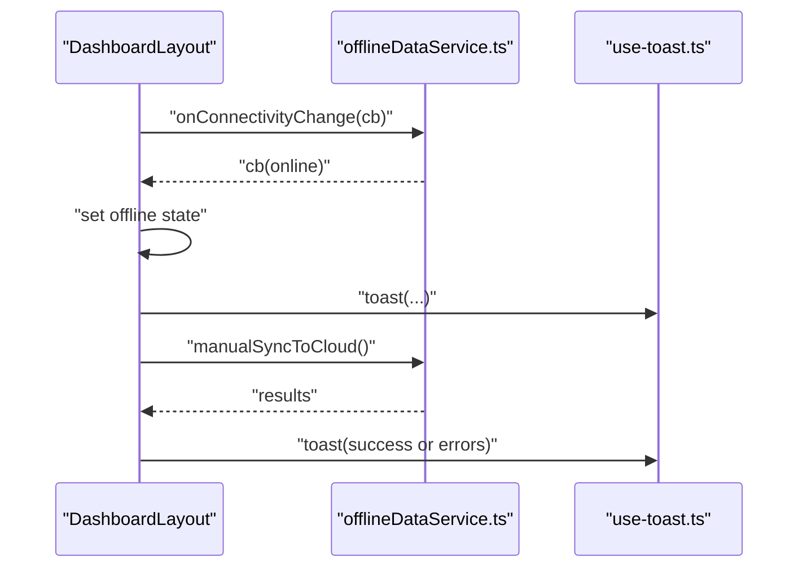
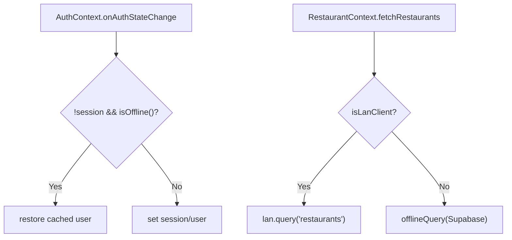
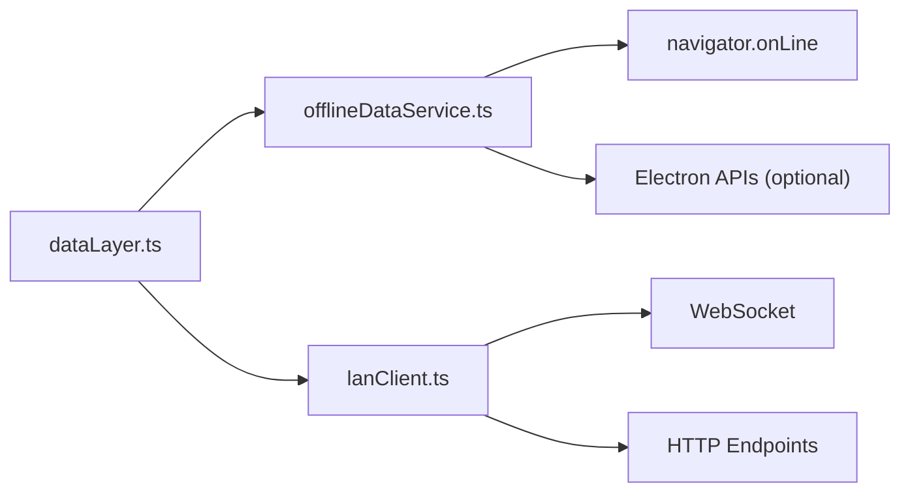

# Connectivity Management & Network Handling

<cite>
**Referenced Files in This Document**
- [offlineDataService.ts](file://src/services/offlineDataService.ts)
- [dataLayer.ts](file://src/services/dataLayer.ts)
- [lanClient.ts](file://electron/services/lanClient.ts)
- [App.tsx](file://src/App.tsx)
- [LanSettings.tsx](file://src/pages/LanSettings.tsx)
- [DashboardLayout.tsx](file://src/components/layout/DashboardLayout.tsx)
- [AuthContext.tsx](file://src/contexts/AuthContext.tsx)
- [RestaurantContext.tsx](file://src/contexts/RestaurantContext.tsx)
- [use-toast.ts](file://src/hooks/use-toast.ts)
</cite>

## Table of Contents
1. [Introduction](#introduction)
2. [Project Structure](#project-structure)
3. [Core Components](#core-components)
4. [Architecture Overview](#architecture-overview)
5. [Detailed Component Analysis](#detailed-component-analysis)
6. [Dependency Analysis](#dependency-analysis)
7. [Performance Considerations](#performance-considerations)
8. [Troubleshooting Guide](#troubleshooting-guide)
9. [Conclusion](#conclusion)

## Introduction
This document explains TableFlow Pro’s connectivity management and network handling system. It covers global connectivity state management using the browser’s navigator.onLine with custom event listeners, the onConnectivityChange subscription mechanism, and the isOnline()/isOffline() utilities. It documents LAN mode, Electron local mode, and web mode detection logic, along with error handling, timeouts, retries, and user notifications. Practical examples demonstrate how to implement connectivity-aware features and gracefully handle network transitions.

## Project Structure
The connectivity system spans three primary layers:
- Global browser connectivity state and subscriptions
- Data-layer abstraction that selects the appropriate backend per runtime mode
- LAN client for Electron-based peer-to-peer networking

**Diagram sources**
- [offlineDataService.ts:26-47](file://src/services/offlineDataService.ts#L26-L47)
- [dataLayer.ts:61-94](file://src/services/dataLayer.ts#L61-L94)
- [lanClient.ts:65-144](file://electron/services/lanClient.ts#L65-L144)

**Section sources**
- [offlineDataService.ts:26-47](file://src/services/offlineDataService.ts#L26-L47)
- [dataLayer.ts:61-94](file://src/services/dataLayer.ts#L61-L94)
- [lanClient.ts:65-144](file://electron/services/lanClient.ts#L65-L144)

## Core Components
- Global connectivity state and subscriptions:
  - Maintains navigator.onLine and notifies subscribers via onConnectivityChange().
  - Exposes isOnline() and isOffline() for conditional logic.
- Data mode detection:
  - Determines whether to use Supabase (web), Electron local SQLite, or LAN client based on runtime and connection status.
- LAN client:
  - Connects to a LAN server via HTTP health check and WebSocket, registers devices, and manages reconnection and ping intervals.
- UI integration:
  - DashboardLayout subscribes to connectivity changes, shows offline banner, and exposes manual sync controls in Electron mode.
- Auth and restaurant contexts:
  - Respect offline state during session transitions and restaurant loading.

**Section sources**
- [offlineDataService.ts:26-47](file://src/services/offlineDataService.ts#L26-L47)
- [dataLayer.ts:61-94](file://src/services/dataLayer.ts#L61-L94)
- [lanClient.ts:65-144](file://electron/services/lanClient.ts#L65-L144)
- [DashboardLayout.tsx:88-94](file://src/components/layout/DashboardLayout.tsx#L88-L94)
- [AuthContext.tsx:44-77](file://src/contexts/AuthContext.tsx#L44-L77)
- [RestaurantContext.tsx:78-136](file://src/contexts/RestaurantContext.tsx#L78-L136)

## Architecture Overview
The system integrates browser-level connectivity with runtime-specific data backends. The data layer dynamically selects the backend and coordinates offline-first behavior.

**Diagram sources**
- [offlineDataService.ts:151-211](file://src/services/offlineDataService.ts#L151-L211)
- [dataLayer.ts:61-94](file://src/services/dataLayer.ts#L61-L94)
- [lanClient.ts:319-343](file://electron/services/lanClient.ts#L319-L343)

## Detailed Component Analysis

### Global Connectivity State and Subscriptions
- Maintains a single global online flag synchronized with navigator.onLine.
- Registers custom listeners and notifies them on state changes.
- Provides isOnline() and isOffline() for centralized conditional logic.

**Diagram sources**
- [offlineDataService.ts:26-34](file://src/services/offlineDataService.ts#L26-L34)

**Section sources**
- [offlineDataService.ts:26-47](file://src/services/offlineDataService.ts#L26-L47)

### onConnectivityChange Subscription Mechanism
- Applications subscribe to connectivity changes via onConnectivityChange(callback).
- Callback receives a boolean indicating online status.
- Returns an unsubscribe function to remove the listener.

**Diagram sources**
- [offlineDataService.ts:44-47](file://src/services/offlineDataService.ts#L44-L47)

**Section sources**
- [offlineDataService.ts:44-47](file://src/services/offlineDataService.ts#L44-L47)

### Data Mode Detection Logic
- getDataModeAsync() determines mode with caching and LAN health checks.
- getDataMode() provides a synchronous snapshot for non-async consumers.
- Modes:
  - supabase: web runtime
  - local: Electron runtime without LAN server
  - lan: Electron runtime with LAN server connected

**Diagram sources**
- [dataLayer.ts:61-94](file://src/services/dataLayer.ts#L61-L94)
- [dataLayer.ts:37-55](file://src/services/dataLayer.ts#L37-L55)

**Section sources**
- [dataLayer.ts:61-94](file://src/services/dataLayer.ts#L61-L94)
- [dataLayer.ts:37-55](file://src/services/dataLayer.ts#L37-L55)

### LAN Client Connectivity and Retry
- Performs HTTP health check before WebSocket connection.
- Registers device and starts periodic ping.
- Automatically schedules reconnect on close/error with a fixed delay.
- Exposes clientStatus() and getConnectionStatus() for UI and logic.

**Diagram sources**
- [lanClient.ts:65-144](file://electron/services/lanClient.ts#L65-L144)
- [lanClient.ts:166-186](file://electron/services/lanClient.ts#L166-L186)
- [lanClient.ts:319-343](file://electron/services/lanClient.ts#L319-L343)

**Section sources**
- [lanClient.ts:65-144](file://electron/services/lanClient.ts#L65-L144)
- [lanClient.ts:166-186](file://electron/services/lanClient.ts#L166-L186)
- [lanClient.ts:319-343](file://electron/services/lanClient.ts#L319-L343)

### Offline Data Access and Graceful Degradation
- offlineQuery():
  - Prefers LAN server when connected.
  - Falls back to web Supabase in browser.
  - Uses Electron local SQLite in Electron local mode.
  - Returns from cache when offline in Electron local mode.
- offlineMutate() and offlineDelete():
  - Write to LAN server in LAN mode.
  - Write to local SQLite in Electron local mode.
  - Write to Supabase in web mode.

**Diagram sources**
- [offlineDataService.ts:151-211](file://src/services/offlineDataService.ts#L151-L211)

**Section sources**
- [offlineDataService.ts:151-211](file://src/services/offlineDataService.ts#L151-L211)

### UI Integration and User Notifications
- DashboardLayout:
  - Subscribes to connectivity changes and updates UI state.
  - Shows offline banner when browser reports offline.
  - Displays pending sync count and allows manual sync in Electron mode.
- Toast integration:
  - Uses a toast library for user notifications on connection events and actions.

**Diagram sources**
- [DashboardLayout.tsx:88-94](file://src/components/layout/DashboardLayout.tsx#L88-L94)
- [DashboardLayout.tsx:110-125](file://src/components/layout/DashboardLayout.tsx#L110-L125)
- [use-toast.ts:137-164](file://src/hooks/use-toast.ts#L137-L164)

**Section sources**
- [DashboardLayout.tsx:88-94](file://src/components/layout/DashboardLayout.tsx#L88-L94)
- [DashboardLayout.tsx:110-125](file://src/components/layout/DashboardLayout.tsx#L110-L125)
- [use-toast.ts:137-164](file://src/hooks/use-toast.ts#L137-L164)

### Auth and Restaurant Contexts Respect Offline State
- AuthContext:
  - Ignores null session while offline and restores cached user.
  - Initializes/stops sync engine based on session presence.
- RestaurantContext:
  - Loads restaurants from LAN server when connected.
  - Falls back to cached data or localStorage when offline.

**Diagram sources**
- [AuthContext.tsx:44-77](file://src/contexts/AuthContext.tsx#L44-L77)
- [RestaurantContext.tsx:78-136](file://src/contexts/RestaurantContext.tsx#L78-L136)

**Section sources**
- [AuthContext.tsx:44-77](file://src/contexts/AuthContext.tsx#L44-L77)
- [RestaurantContext.tsx:78-136](file://src/contexts/RestaurantContext.tsx#L78-L136)

## Dependency Analysis
- offlineDataService.ts depends on:
  - navigator.onLine for global state
  - Electron APIs (when present) for LAN and SQLite access
- dataLayer.ts depends on:
  - offlineDataService.ts for mode detection
  - Electron APIs for LAN client
- lanClient.ts depends on:
  - WebSocket for real-time messaging
  - HTTP endpoints for health checks and CRUD

**Diagram sources**
- [offlineDataService.ts:26-47](file://src/services/offlineDataService.ts#L26-L47)
- [dataLayer.ts:61-94](file://src/services/dataLayer.ts#L61-L94)
- [lanClient.ts:65-144](file://electron/services/lanClient.ts#L65-L144)

**Section sources**
- [offlineDataService.ts:26-47](file://src/services/offlineDataService.ts#L26-L47)
- [dataLayer.ts:61-94](file://src/services/dataLayer.ts#L61-L94)
- [lanClient.ts:65-144](file://electron/services/lanClient.ts#L65-L144)

## Performance Considerations
- Caching:
  - LAN client connection status is cached for short periods to reduce redundant checks.
  - Data mode is cached briefly to avoid frequent mode switches.
- Minimal overhead:
  - Subscribers are notified only on state changes.
  - LAN client queues messages until WebSocket opens.
- Graceful fallback:
  - Electron local mode serves cached data immediately when offline.

[No sources needed since this section provides general guidance]

## Troubleshooting Guide
- LAN connection fails:
  - Verify server health endpoint responds and clients count is available.
  - Confirm WebSocket opens and periodic ping maintains the connection.
  - Review automatic reconnect scheduling and logs.
- Offline mode behavior:
  - In Electron local mode, confirm SQLite availability and that offlineQuery returns cached data when offline.
  - Ensure offlineMutate marks records as pending_sync and offlineDelete soft-deletes with pending_delete.
- UI connectivity indicators:
  - Confirm onConnectivityChange subscribers update UI state and show offline banner.
  - Validate manual sync button is disabled when offline or not in Electron mode.
- Auth and restaurant loading:
  - When offline, cached user should be restored and restaurant data loaded from cache or localStorage.

**Section sources**
- [lanClient.ts:319-343](file://electron/services/lanClient.ts#L319-L343)
- [offlineDataService.ts:151-211](file://src/services/offlineDataService.ts#L151-L211)
- [DashboardLayout.tsx:88-94](file://src/components/layout/DashboardLayout.tsx#L88-L94)
- [AuthContext.tsx:44-77](file://src/contexts/AuthContext.tsx#L44-L77)
- [RestaurantContext.tsx:78-136](file://src/contexts/RestaurantContext.tsx#L78-L136)

## Conclusion
TableFlow Pro’s connectivity system combines browser-level online/offline awareness with runtime-aware data backends. The onConnectivityChange subscription pattern enables responsive UI updates, while offlineDataService and dataLayer provide robust offline-first behavior across LAN, Electron local, and web modes. LAN client offers resilient peer-to-peer connectivity with health checks, reconnection, and ping mechanisms. Together, these components deliver a reliable, graceful, and user-friendly experience across diverse deployment scenarios.