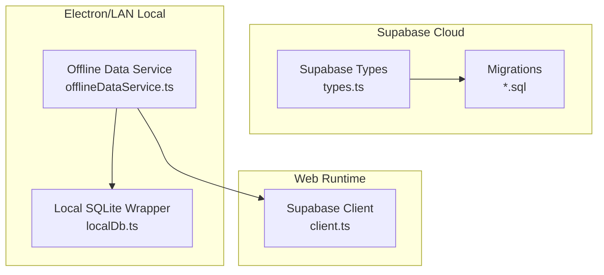
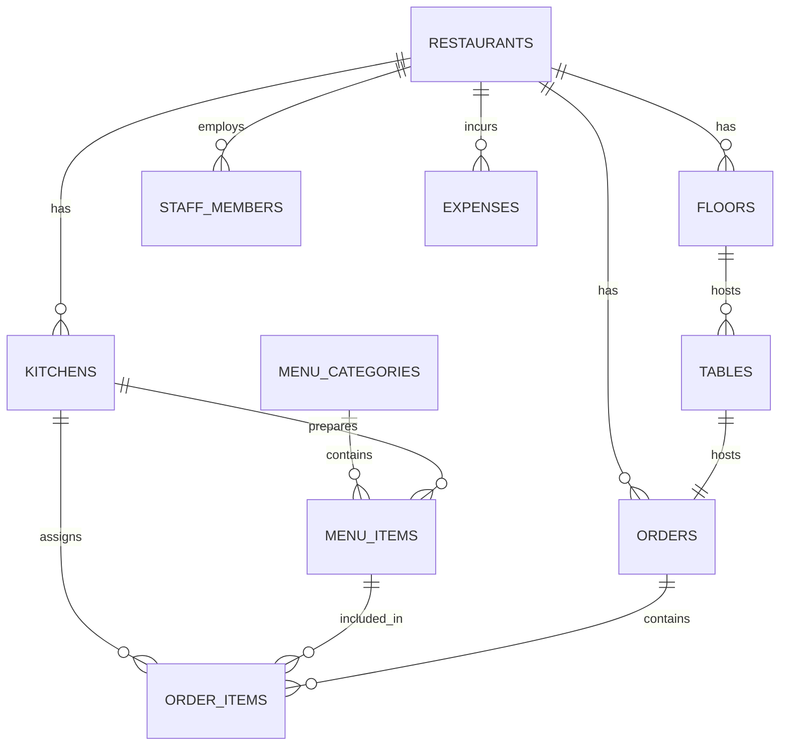
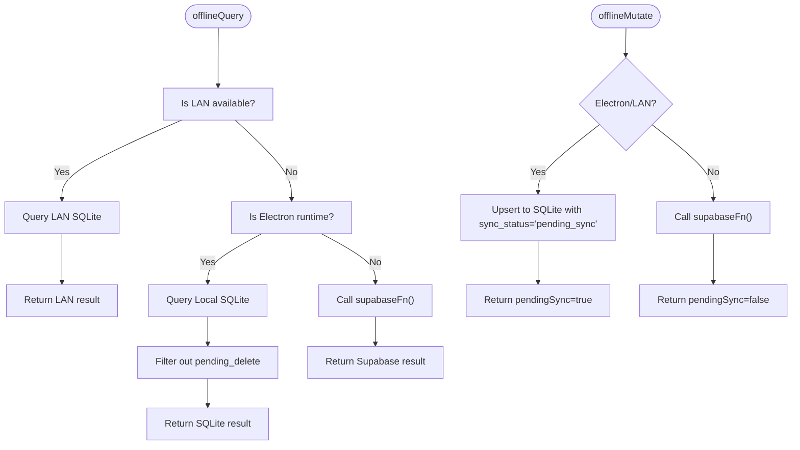
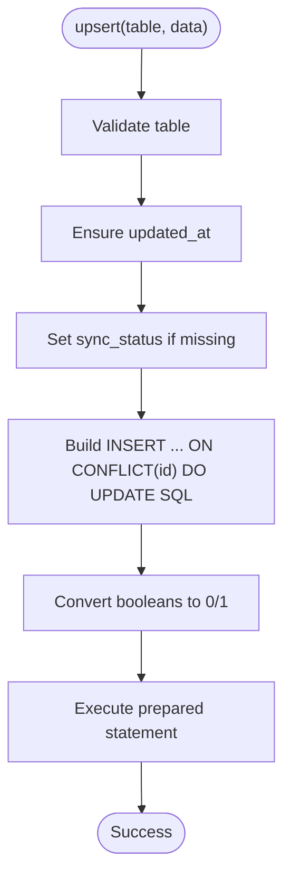
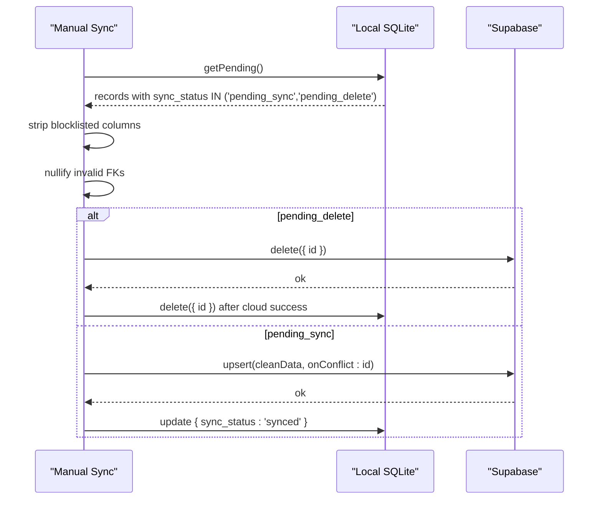
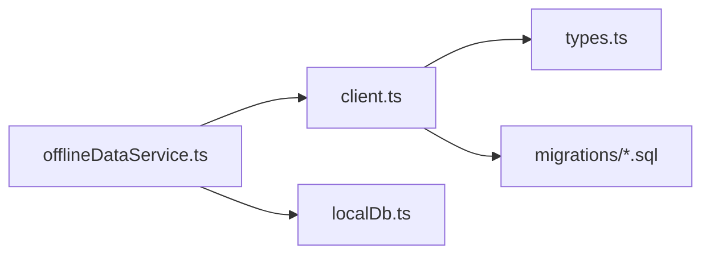
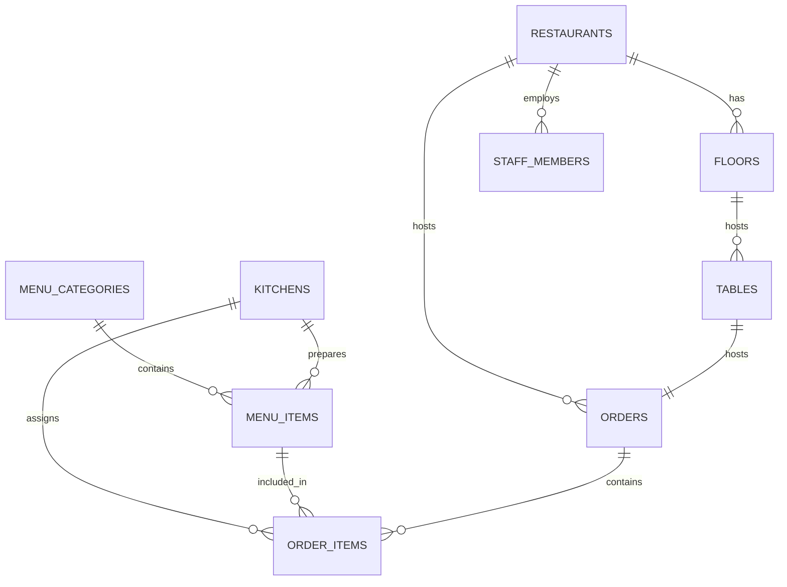

# Database Architecture & Design

<cite>
**Referenced Files in This Document**
- [client.ts](file://src/integrations/supabase/client.ts)
- [types.ts](file://src/integrations/supabase/types.ts)
- [20251206042902_fc2b1d91-eb8e-4750-90c3-95b7e0feb6ba.sql](file://supabase/migrations/20251206042902_fc2b1d91-eb8e-4750-90c3-95b7e0feb6ba.sql)
- [20251206062448_4e2d7da9-9519-48ae-9d6c-bb1c994ed84a.sql](file://supabase/migrations/20251206062448_4e2d7da9-9519-48ae-9d6c-bb1c994ed84a.sql)
- [20251206081648_ef719884-b181-43d8-832a-02825f1b3a50.sql](file://supabase/migrations/20251206081648_ef719884-b181-43d8-832a-02825f1b3a50.sql)
- [20251206132719_11d13f91-c469-437f-9d98-63127362f20c.sql](file://supabase/migrations/20251206132719_11d13f91-c469-437f-9d98-63127362f20c.sql)
- [20251206133509_50399ee0-7c3e-4927-bf1a-00556ef24c8c.sql](file://supabase/migrations/20251206133509_50399ee0-7c3e-4927-bf1a-00556ef24c8c.sql)
- [20251206133955_231d3ef6-16e8-41de-8662-8dc09a54c6e3.sql](file://supabase/migrations/20251206133955_231d3ef6-16e8-41de-8662-8dc09a54c6e3.sql)
- [offlineDataService.ts](file://src/services/offlineDataService.ts)
- [localDb.ts](file://electron/services/localDb.ts)
- [DATABASE_CONNECTIVITY_MAP.md](file://DATABASE_CONNECTIVITY_MAP.md)
- [DATABASE_ARCHITECTURE_ANALYSIS.md](file://DATABASE_ARCHITECTURE_ANALYSIS.md)
</cite>

## Table of Contents
1. [Introduction](#introduction)
2. [Project Structure](#project-structure)
3. [Core Components](#core-components)
4. [Architecture Overview](#architecture-overview)
5. [Detailed Component Analysis](#detailed-component-analysis)
6. [Dependency Analysis](#dependency-analysis)
7. [Performance Considerations](#performance-considerations)
8. [Troubleshooting Guide](#troubleshooting-guide)
9. [Conclusion](#conclusion)
10. [Appendices](#appendices)

## Introduction
This document describes the database architecture and design of TableFlow Pro with an offline-first approach. It explains the dual-database strategy using Supabase cloud and SQLite local storage, the schema definitions, table relationships, and the sync lifecycle driven by the sync_status field. It also documents the restaurant_id filtering and data partitioning strategy, initialization and migration management, the blocklist system for handling columns that exist locally but not in Supabase, and practical guidance for performance and storage efficiency.

## Project Structure
The database layer consists of:
- Supabase schema and migrations defining the authoritative cloud schema
- TypeScript types for strong typing of Supabase tables and enums
- An offline-first service that reads/writes SQLite in Electron/LAN modes and falls back to Supabase on the web
- A local SQLite wrapper that persists records with sync metadata



**Diagram sources**
- [types.ts:1-818](file://src/integrations/supabase/types.ts#L1-L818)
- [20251206042902_fc2b1d91-eb8e-4750-90c3-95b7e0feb6ba.sql:1-210](file://supabase/migrations/20251206042902_fc2b1d91-eb8e-4750-90c3-95b7e0feb6ba.sql#L1-L210)
- [offlineDataService.ts:1-769](file://src/services/offlineDataService.ts#L1-L769)
- [localDb.ts:262-311](file://electron/services/localDb.ts#L262-L311)
- [client.ts:1-17](file://src/integrations/supabase/client.ts#L1-L17)

**Section sources**
- [types.ts:1-818](file://src/integrations/supabase/types.ts#L1-L818)
- [20251206042902_fc2b1d91-eb8e-4750-90c3-95b7e0feb6ba.sql:1-210](file://supabase/migrations/20251206042902_fc2b1d91-eb8e-4750-90c3-95b7e0feb6ba.sql#L1-L210)
- [offlineDataService.ts:1-769](file://src/services/offlineDataService.ts#L1-L769)
- [localDb.ts:262-311](file://electron/services/localDb.ts#L262-L311)
- [client.ts:1-17](file://src/integrations/supabase/client.ts#L1-L17)

## Core Components
- Supabase client and typed schema: Defines the authoritative cloud schema and enums used across the app.
- Migrations: Define tables, enums, RLS policies, triggers, and publication settings.
- Offline Data Service: Orchestrates SQLite-first queries and mutations, manages sync lifecycle, and applies blocklists during manual sync.
- Local SQLite Wrapper: Provides upsert, query, and delete operations with SQLite-specific type handling and sync metadata.

Key responsibilities:
- Supabase schema and types define canonical table structures and constraints.
- Migrations enforce referential integrity, RLS, and operational triggers/functions.
- Offline service ensures offline availability and controlled synchronization.
- Local SQLite stores records with sync_status and filters pending_delete records at read time.

**Section sources**
- [client.ts:1-17](file://src/integrations/supabase/client.ts#L1-L17)
- [types.ts:1-818](file://src/integrations/supabase/types.ts#L1-L818)
- [20251206042902_fc2b1d91-eb8e-4750-90c3-95b7e0feb6ba.sql:1-210](file://supabase/migrations/20251206042902_fc2b1d91-eb8e-4750-90c3-95b7e0feb6ba.sql#L1-L210)
- [offlineDataService.ts:140-347](file://src/services/offlineDataService.ts#L140-L347)
- [localDb.ts:273-311](file://electron/services/localDb.ts#L273-L311)

## Architecture Overview
The system follows an offline-first model:
- Electron/LAN mode: SQLite is the source of truth; Supabase is synchronized manually.
- Web mode: Supabase is the source of truth; SQLite caching is optional and read-only for offline display.
- Sync lifecycle: Records carry sync_status to track synced, pending_sync, and pending_delete states.

```mermaid
sequenceDiagram
participant UI as "UI Layer"
participant OFF as "Offline Data Service"
participant LDB as "Local SQLite Wrapper"
participant SUP as "Supabase Client"
rect rgb(255,255,255)
note over UI,LDB : Electron/LAN Offline Mode
UI->>OFF : offlineQuery(table, filters)
OFF->>LDB : query(table, filters)
LDB-->>OFF : records (excluding pending_delete)
OFF-->>UI : { data, fromCache : true }
end
rect rgb(255,255,255)
note over UI,SUP : Web Online Mode
UI->>OFF : offlineQuery(supabaseFn)
OFF->>SUP : supabaseFn()
SUP-->>OFF : { data }
OFF-->>UI : { data, fromCache : false }
end
rect rgb(255,255,255)
note over UI,LDB : Local Mutations (Electron/LAN)
UI->>OFF : offlineMutate({ table, data })
OFF->>LDB : upsert({ ...data, sync_status : 'pending_sync' })
LDB-->>OFF : success
OFF-->>UI : { data, pendingSync : true }
end
```

**Diagram sources**
- [offlineDataService.ts:151-211](file://src/services/offlineDataService.ts#L151-L211)
- [offlineDataService.ts:220-287](file://src/services/offlineDataService.ts#L220-L287)
- [offlineDataService.ts:295-347](file://src/services/offlineDataService.ts#L295-L347)
- [localDb.ts:273-311](file://electron/services/localDb.ts#L273-L311)

## Detailed Component Analysis

### Supabase Cloud Schema and Types
- Enumerations: order_status, food_type, spice_level, staff_role.
- Tables: profiles, restaurants, kitchens, floors, tables, menu_categories, menu_items, orders, order_items, staff_members, suppliers.
- Constraints and keys: UUID primary keys, foreign keys, unique constraints, defaults.
- Row Level Security: Policies per table to restrict access by restaurant ownership or staff role.
- Triggers and functions: Timestamp updates, user onboarding, slug generation, and helper functions for access checks.



**Diagram sources**
- [20251206042902_fc2b1d91-eb8e-4750-90c3-95b7e0feb6ba.sql:17-210](file://supabase/migrations/20251206042902_fc2b1d91-eb8e-4750-90c3-95b7e0feb6ba.sql#L17-L210)
- [types.ts:15-688](file://src/integrations/supabase/types.ts#L15-L688)

**Section sources**
- [20251206042902_fc2b1d91-eb8e-4750-90c3-95b7e0feb6ba.sql:1-210](file://supabase/migrations/20251206042902_fc2b1d91-eb8e-4750-90c3-95b7e0feb6ba.sql#L1-L210)
- [20251206062448_4e2d7da9-9519-48ae-9d6c-bb1c994ed84a.sql:1-64](file://supabase/migrations/20251206062448_4e2d7da9-9519-48ae-9d6c-bb1c994ed84a.sql#L1-L64)
- [20251206081648_ef719884-b181-43d8-832a-02825f1b3a50.sql:1-157](file://supabase/migrations/20251206081648_ef719884-b181-43d8-832a-02825f1b3a50.sql#L1-L157)
- [20251206132719_11d13f91-c469-437f-9d98-63127362f20c.sql:1-12](file://supabase/migrations/20251206132719_11d13f91-c469-437f-9d98-63127362f20c.sql#L1-L12)
- [20251206133509_50399ee0-7c3e-4927-bf1a-00556ef24c8c.sql:1-28](file://supabase/migrations/20251206133509_50399ee0-7c3e-4927-bf1a-00556ef24c8c.sql#L1-L28)
- [20251206133955_231d3ef6-16e8-41de-8662-8dc09a54c6e3.sql:1-63](file://supabase/migrations/20251206133955_231d3ef6-16e8-41de-8662-8dc09a54c6e3.sql#L1-L63)
- [types.ts:15-688](file://src/integrations/supabase/types.ts#L15-L688)

### Offline Data Service and SQLite Integration
- Query path: In Electron/LAN, SQLite is queried first; in Web, Supabase is used. Empty results are acceptable offline.
- Mutation path: In Electron/LAN, writes go to SQLite with sync_status set to pending_sync; deletes mark records as pending_delete without touching the cloud.
- Manual sync: Removes blocklisted columns and nullifies invalid foreign keys before upserting to Supabase; deletes records when sync_status indicates pending_delete.



**Diagram sources**
- [offlineDataService.ts:151-211](file://src/services/offlineDataService.ts#L151-L211)
- [offlineDataService.ts:220-287](file://src/services/offlineDataService.ts#L220-L287)
- [offlineDataService.ts:295-347](file://src/services/offlineDataService.ts#L295-L347)

**Section sources**
- [offlineDataService.ts:140-347](file://src/services/offlineDataService.ts#L140-L347)
- [offlineDataService.ts:458-518](file://src/services/offlineDataService.ts#L458-L518)

### Local SQLite Wrapper
- Upsert logic: Inserts or updates on conflict using id; sets updated_at and defaults sync_status to pending_sync if absent.
- Type conversion: Boolean values are stored as integers for SQLite compatibility.
- Query ordering: Results are ordered by updated_at descending.



**Diagram sources**
- [localDb.ts:273-311](file://electron/services/localDb.ts#L273-L311)

**Section sources**
- [localDb.ts:273-311](file://electron/services/localDb.ts#L273-L311)

### Sync Lifecycle and Blocklist System
- sync_status values:
  - synced: synchronized with cloud
  - pending_sync: local changes awaiting manual sync
  - pending_delete: local deletion requested; will be removed from cloud on sync
- Blocklist: Columns present in SQLite but not in Supabase are stripped during manual sync to avoid constraint violations.
- Foreign key safety: Invalid foreign keys are nullified before syncing to prevent constraint errors.



**Diagram sources**
- [offlineDataService.ts:458-518](file://src/services/offlineDataService.ts#L458-L518)
- [offlineDataService.ts:351-361](file://src/services/offlineDataService.ts#L351-L361)

**Section sources**
- [offlineDataService.ts:458-518](file://src/services/offlineDataService.ts#L458-L518)
- [offlineDataService.ts:351-361](file://src/services/offlineDataService.ts#L351-L361)
- [DATABASE_CONNECTIVITY_MAP.md:79-100](file://DATABASE_CONNECTIVITY_MAP.md#L79-L100)
- [DATABASE_ARCHITECTURE_ANALYSIS.md:275-330](file://DATABASE_ARCHITECTURE_ANALYSIS.md#L275-L330)

### Restaurant Partitioning and Filtering
- restaurant_id is a pervasive foreign key across most tables, ensuring tenant isolation.
- RLS policies filter rows by restaurant ownership or staff membership.
- Offline queries can pass filters to SQLite to restrict results to the current restaurant context.

Practical guidance:
- Always include restaurant_id in filters for tables that have it.
- For offline reads, apply filters at the SQLite level to limit dataset size.

**Section sources**
- [20251206042902_fc2b1d91-eb8e-4750-90c3-95b7e0feb6ba.sql:126-172](file://supabase/migrations/20251206042902_fc2b1d91-eb8e-4750-90c3-95b7e0feb6ba.sql#L126-L172)
- [offlineDataService.ts:192-211](file://src/services/offlineDataService.ts#L192-L211)

### Initialization and Migration Management
- Supabase migrations define:
  - Enum types
  - Tables with primary keys, foreign keys, defaults, and constraints
  - RLS policies and security definer functions
  - Triggers for automatic timestamp updates
  - Realtime publications for selected tables
- The Supabase client is configured with environment variables and persistence settings.

Operational steps:
- Apply migrations to the Supabase project to establish schema and policies.
- In Electron/LAN, initialize local SQLite and seed it from Supabase using the offline cache pipeline.
- For web deployments, rely on Supabase directly.

**Section sources**
- [20251206042902_fc2b1d91-eb8e-4750-90c3-95b7e0feb6ba.sql:1-210](file://supabase/migrations/20251206042902_fc2b1d91-eb8e-4750-90c3-95b7e0feb6ba.sql#L1-L210)
- [20251206062448_4e2d7da9-9519-48ae-9d6c-bb1c994ed84a.sql:1-64](file://supabase/migrations/20251206062448_4e2d7da9-9519-48ae-9d6c-bb1c994ed84a.sql#L1-L64)
- [20251206081648_ef719884-b181-43d8-832a-02825f1b3a50.sql:1-157](file://supabase/migrations/20251206081648_ef719884-b181-43d8-832a-02825f1b3a50.sql#L1-L157)
- [client.ts:1-17](file://src/integrations/supabase/client.ts#L1-L17)

## Dependency Analysis
- Offline Data Service depends on:
  - Supabase client for cloud operations
  - Electron APIs for LAN and local SQLite access
- Local SQLite Wrapper encapsulates database operations and type conversions.
- Supabase types and migrations define the contract for schema and constraints.



**Diagram sources**
- [offlineDataService.ts:1-769](file://src/services/offlineDataService.ts#L1-L769)
- [client.ts:1-17](file://src/integrations/supabase/client.ts#L1-L17)
- [localDb.ts:262-311](file://electron/services/localDb.ts#L262-L311)
- [types.ts:1-818](file://src/integrations/supabase/types.ts#L1-L818)
- [20251206042902_fc2b1d91-eb8e-4750-90c3-95b7e0feb6ba.sql:1-210](file://supabase/migrations/20251206042902_fc2b1d91-eb8e-4750-90c3-95b7e0feb6ba.sql#L1-L210)

**Section sources**
- [offlineDataService.ts:1-769](file://src/services/offlineDataService.ts#L1-L769)
- [client.ts:1-17](file://src/integrations/supabase/client.ts#L1-L17)
- [localDb.ts:262-311](file://electron/services/localDb.ts#L262-L311)
- [types.ts:1-818](file://src/integrations/supabase/types.ts#L1-L818)
- [20251206042902_fc2b1d91-eb8e-4750-90c3-95b7e0feb6ba.sql:1-210](file://supabase/migrations/20251206042902_fc2b1d91-eb8e-4750-90c3-95b7e0feb6ba.sql#L1-L210)

## Performance Considerations
- SQLite type handling: Store booleans as integers to avoid type coercion overhead.
- Query ordering: Sort by updated_at to surface recent changes efficiently.
- Indexing strategy: Add indexes on frequently filtered columns (e.g., restaurant_id, id) to improve query performance.
- Data partitioning: Use restaurant_id filters to reduce result sets and improve responsiveness.
- Caching: Cache flattened records to SQLite to minimize network usage and enable offline reads.
- Sync batching: Group manual sync operations to reduce round trips and leverage upsert on conflict.

[No sources needed since this section provides general guidance]

## Troubleshooting Guide
Common issues and resolutions:
- Column mismatches between local and cloud: Use the blocklist to strip extra columns before syncing; verify column definitions in unified schema.
- Invalid foreign keys: Nullify invalid foreign keys prior to upsert to avoid constraint violations.
- Pending delete not applied: Ensure records are marked pending_delete locally and that manual sync completes successfully.
- RLS access denied: Confirm the current user’s staff role and restaurant association; review security definer functions and policies.

**Section sources**
- [offlineDataService.ts:458-518](file://src/services/offlineDataService.ts#L458-L518)
- [DATABASE_CONNECTIVITY_MAP.md:79-100](file://DATABASE_CONNECTIVITY_MAP.md#L79-L100)
- [20251206133955_231d3ef6-16e8-41de-8662-8dc09a54c6e3.sql:17-63](file://supabase/migrations/20251206133955_231d3ef6-16e8-41de-8662-8dc09a54c6e3.sql#L17-L63)

## Conclusion
TableFlow Pro’s database architecture balances a robust Supabase cloud schema with an efficient offline-first SQLite layer. The sync_status lifecycle, blocklist system, and restaurant_id partitioning provide reliable data handling across environments. By following the outlined patterns and applying the recommended performance practices, teams can maintain schema consistency, minimize sync failures, and deliver responsive offline experiences.

[No sources needed since this section summarizes without analyzing specific files]

## Appendices

### Appendix A: Representative Table Relationships


**Diagram sources**
- [20251206042902_fc2b1d91-eb8e-4750-90c3-95b7e0feb6ba.sql:17-210](file://supabase/migrations/20251206042902_fc2b1d91-eb8e-4750-90c3-95b7e0feb6ba.sql#L17-L210)