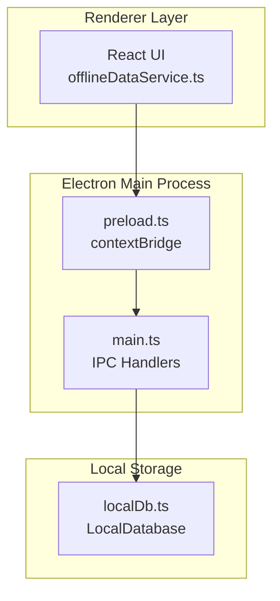
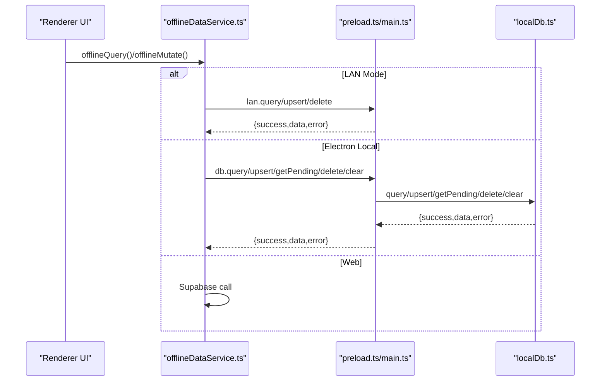
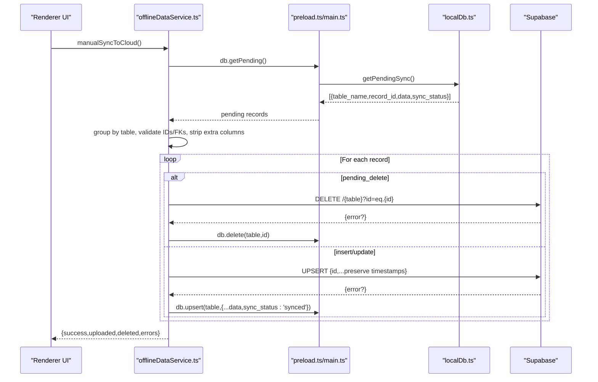
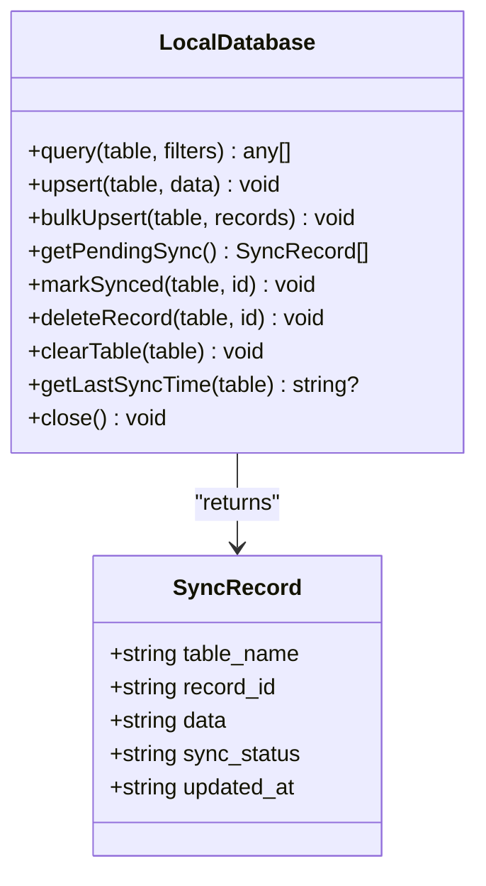
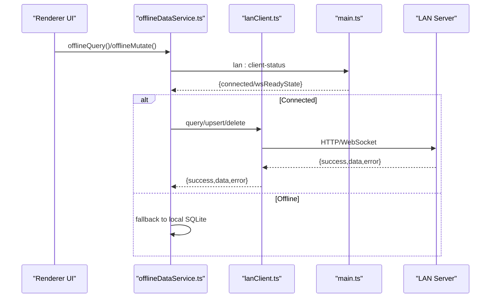
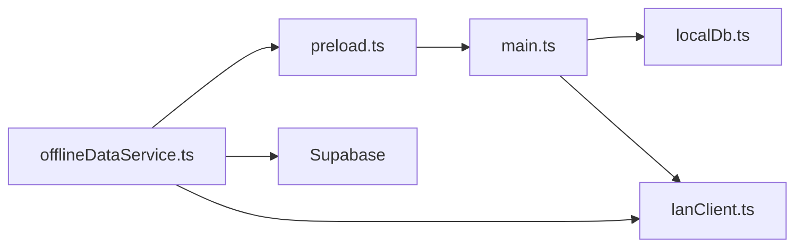
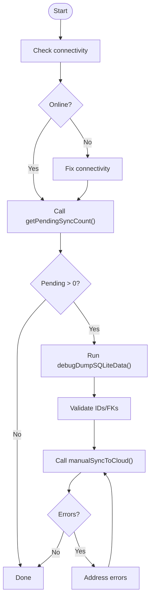

# Debugging & Monitoring

<cite>
**Referenced Files in This Document**
- [offlineDataService.ts](file://src/services/offlineDataService.ts)
- [localDb.ts](file://electron/services/localDb.ts)
- [main.ts](file://electron/main.ts)
- [preload.ts](file://electron/preload.ts)
- [syncEngine.ts](file://electron/services/syncEngine.ts)
- [lanClient.ts](file://electron/services/lanClient.ts)
- [README.md](file://README.md)
</cite>

## Table of Contents
1. [Introduction](#introduction)
2. [Project Structure](#project-structure)
3. [Core Components](#core-components)
4. [Architecture Overview](#architecture-overview)
5. [Detailed Component Analysis](#detailed-component-analysis)
6. [Dependency Analysis](#dependency-analysis)
7. [Performance Considerations](#performance-considerations)
8. [Troubleshooting Guide](#troubleshooting-guide)
9. [Conclusion](#conclusion)
10. [Appendices](#appendices)

## Introduction
This document provides comprehensive debugging and monitoring guidance for TableFlow Pro’s offline synchronization system. It focuses on inspecting local SQLite data using the debugDumpSQLiteData function, interpreting logs produced during sync operations, understanding error handling and common failure patterns, and leveraging monitoring functions such as getPendingSyncCount. It also includes troubleshooting workflows for typical issues like sync failures, data inconsistencies, and connectivity problems, along with performance monitoring techniques and optimization strategies for large datasets.

## Project Structure
The offline synchronization system spans three layers:
- Renderer (web) layer: Provides offline-aware data access and manual sync controls.
- Electron main process: Exposes IPC handlers for database and sync operations.
- Local SQLite database: Stores offline data and pending sync metadata.

**Diagram sources**
- [offlineDataService.ts:151-287](file://src/services/offlineDataService.ts#L151-L287)
- [main.ts:127-175](file://electron/main.ts#L127-L175)
- [preload.ts:4-89](file://electron/preload.ts#L4-L89)
- [localDb.ts:164-401](file://electron/services/localDb.ts#L164-L401)

**Section sources**
- [README.md:1-13](file://README.md#L1-L13)
- [offlineDataService.ts:151-287](file://src/services/offlineDataService.ts#L151-L287)
- [main.ts:127-175](file://electron/main.ts#L127-L175)
- [preload.ts:4-89](file://electron/preload.ts#L4-L89)
- [localDb.ts:164-401](file://electron/services/localDb.ts#L164-L401)

## Core Components
- offlineDataService.ts: Implements offline-first data access, caching, manual sync, and diagnostics.
- localDb.ts: Defines the LocalDatabase class with SQLite schema, CRUD operations, pending sync retrieval, and sync logging.
- main.ts: Exposes IPC handlers for database and sync operations to the renderer.
- preload.ts: Bridges Electron IPC to the renderer via contextBridge.
- syncEngine.ts: Background engine for initial cloud-to-local data pull (deprecated for push sync).
- lanClient.ts: LAN client for multi-device collaboration and data routing.

Key monitoring and debugging functions:
- debugDumpSQLiteData: Dumps all local tables to the console for inspection.
- getPendingSyncCount: Returns the number of pending records requiring sync.
- manualSyncToCloud: Manually uploads pending changes to Supabase with detailed results.

**Section sources**
- [offlineDataService.ts:739-765](file://src/services/offlineDataService.ts#L739-L765)
- [offlineDataService.ts:546-560](file://src/services/offlineDataService.ts#L546-L560)
- [offlineDataService.ts:397-541](file://src/services/offlineDataService.ts#L397-L541)
- [localDb.ts:328-348](file://electron/services/localDb.ts#L328-L348)
- [main.ts:149-156](file://electron/main.ts#L149-L156)
- [offlineDataService.ts:351-372](file://src/services/offlineDataService.ts#L351-L372)

## Architecture Overview
The offline-first architecture routes reads/writes through local SQLite in Electron mode, with optional LAN routing and manual cloud sync.

**Diagram sources**
- [offlineDataService.ts:151-287](file://src/services/offlineDataService.ts#L151-L287)
- [preload.ts:15-26](file://electron/preload.ts#L15-L26)
- [main.ts:127-175](file://electron/main.ts#L127-L175)
- [localDb.ts:247-375](file://electron/services/localDb.ts#L247-L375)

## Detailed Component Analysis

### Offline Data Access and Sync Control
- offlineQuery: SQLite-first read path with LAN override and offline fallback.
- offlineMutate: Writes to LAN server, local SQLite (marking pending_sync), or Supabase depending on mode.
- offlineDelete: Soft-deletes in local/LAN mode; hard-deletes in web mode.
- initializeSync/stopSync/forceSyncPush: Manage background sync lifecycle and manual triggers.
- manualSyncToCloud: Uploads pending changes to Supabase with strict validation and dependency ordering.

**Diagram sources**
- [offlineDataService.ts:397-541](file://src/services/offlineDataService.ts#L397-L541)
- [main.ts:149-156](file://electron/main.ts#L149-L156)
- [localDb.ts:328-348](file://electron/services/localDb.ts#L328-L348)
- [offlineDataService.ts:495-522](file://src/services/offlineDataService.ts#L495-L522)

**Section sources**
- [offlineDataService.ts:151-287](file://src/services/offlineDataService.ts#L151-L287)
- [offlineDataService.ts:397-541](file://src/services/offlineDataService.ts#L397-L541)
- [offlineDataService.ts:351-372](file://src/services/offlineDataService.ts#L351-L372)

### Local Database and Pending Sync Tracking
- LocalDatabase: Manages SQLite schema, CRUD, bulk upsert, pending sync retrieval, and sync log insertion.
- getPendingSync: Aggregates records with pending_sync or pending_delete across all tables.
- getLastSyncTime: Retrieves last synced timestamp per table for incremental pulls.

**Diagram sources**
- [localDb.ts:164-401](file://electron/services/localDb.ts#L164-L401)

**Section sources**
- [localDb.ts:247-375](file://electron/services/localDb.ts#L247-L375)
- [localDb.ts:328-348](file://electron/services/localDb.ts#L328-L348)
- [localDb.ts:380-386](file://electron/services/localDb.ts#L380-L386)

### LAN Client Integration
- LAN mode routing: offlineDataService detects LAN client availability and routes reads/writes accordingly.
- LAN client health and events: connect/disconnect, record change notifications, and kitchen order updates.

**Diagram sources**
- [offlineDataService.ts:157-174](file://src/services/offlineDataService.ts#L157-L174)
- [lanClient.ts:320-343](file://electron/services/lanClient.ts#L320-L343)
- [main.ts:337-359](file://electron/main.ts#L337-L359)

**Section sources**
- [offlineDataService.ts:157-174](file://src/services/offlineDataService.ts#L157-L174)
- [lanClient.ts:65-144](file://electron/services/lanClient.ts#L65-L144)
- [main.ts:337-359](file://electron/main.ts#L337-L359)

### Debugging Tools and Diagnostics

#### debugDumpSQLiteData
Purpose: Inspect local SQLite contents across all tables.
Usage: Call from the renderer after ensuring Electron mode and database availability.
Behavior:
- Iterates over core tables and prints record counts and samples.
- Catches and reports errors per table.

Operational notes:
- Requires Electron mode; otherwise logs a message and returns.
- Uses the db.query IPC to retrieve data.

**Section sources**
- [offlineDataService.ts:739-765](file://src/services/offlineDataService.ts#L739-L765)
- [main.ts:131-138](file://electron/main.ts#L131-L138)
- [localDb.ts:247-268](file://electron/services/localDb.ts#L247-L268)

#### getPendingSyncCount
Purpose: Monitor pending sync workload.
Usage: Poll or display in UI to track sync backlog.
Behavior:
- Calls db.getPending IPC and returns length of pending records.
- Logs errors if retrieval fails.

**Section sources**
- [offlineDataService.ts:546-560](file://src/services/offlineDataService.ts#L546-L560)
- [main.ts:149-156](file://electron/main.ts#L149-L156)
- [localDb.ts:328-348](file://electron/services/localDb.ts#L328-L348)

#### Logging Strategies During Sync
- OfflineData module logs:
  - Query/read/write operations and fallbacks.
  - Cache writes and nested record caching.
  - Sync initiation, grouping, validation, and completion.
- LocalDatabase logs:
  - Upsert errors with SQL and values for diagnosis.
  - Sync log insertions for auditability.
- SyncEngine logs:
  - Initial pull progress and connectivity checks.
- LAN Client logs:
  - Connection attempts, health checks, and message handling.

Interpretation tips:
- Look for “ERROR” or “WARN” prefixes in console logs to locate failures.
- Use [offlineDataService.ts:739-765](file://src/services/offlineDataService.ts#L739-L765) output to confirm local data presence.
- Use [offlineDataService.ts:397-541](file://src/services/offlineDataService.ts#L397-L541) results to see per-record upload/delete outcomes.

**Section sources**
- [offlineDataService.ts:122-211](file://src/services/offlineDataService.ts#L122-L211)
- [offlineDataService.ts:397-541](file://src/services/offlineDataService.ts#L397-L541)
- [localDb.ts:304-310](file://electron/services/localDb.ts#L304-L310)
- [syncEngine.ts:70-106](file://electron/services/syncEngine.ts#L70-L106)
- [lanClient.ts:65-144](file://electron/services/lanClient.ts#L65-L144)

## Dependency Analysis
- offlineDataService.ts depends on:
  - Electron IPC exposed via preload.ts and implemented in main.ts.
  - LocalDatabase for SQLite operations.
  - Supabase client for cloud operations.
- main.ts registers IPC handlers for db and sync operations.
- preload.ts exposes safe APIs to renderer.
- syncEngine.ts is used for initial pull; push sync is manual-only.

**Diagram sources**
- [offlineDataService.ts:151-287](file://src/services/offlineDataService.ts#L151-L287)
- [preload.ts:4-89](file://electron/preload.ts#L4-L89)
- [main.ts:127-175](file://electron/main.ts#L127-L175)
- [localDb.ts:164-401](file://electron/services/localDb.ts#L164-L401)
- [lanClient.ts:22-364](file://electron/services/lanClient.ts#L22-L364)

**Section sources**
- [offlineDataService.ts:151-287](file://src/services/offlineDataService.ts#L151-L287)
- [main.ts:127-175](file://electron/main.ts#L127-L175)
- [preload.ts:4-89](file://electron/preload.ts#L4-L89)
- [localDb.ts:164-401](file://electron/services/localDb.ts#L164-L401)
- [lanClient.ts:22-364](file://electron/services/lanClient.ts#L22-L364)

## Performance Considerations
- SQLite indexing and foreign keys:
  - Foreign key enforcement enabled; indexes exist for key columns to improve query performance.
- Transaction batching:
  - bulkUpsert uses transactions to reduce overhead during bulk inserts.
- Incremental pulls:
  - SyncEngine uses last sync timestamps to limit fetched records.
- Practical tips:
  - Keep tables normalized and indexed.
  - Prefer bulk operations for large datasets.
  - Validate and sanitize data before upsert to avoid retries.

[No sources needed since this section provides general guidance]

## Troubleshooting Guide

### How to Inspect Local Database Contents
- Open DevTools in Electron mode.
- Invoke debugDumpSQLiteData from the renderer to dump all tables.
- Review console output for counts and sample rows; note any “ERROR” lines per table.

**Section sources**
- [offlineDataService.ts:739-765](file://src/services/offlineDataService.ts#L739-L765)

### How to Monitor Sync Health
- Call getPendingSyncCount to check the number of pending records.
- Observe manualSyncToCloud results for uploaded/deleted counts and error messages.
- Use offlineQuery logs to confirm whether requests are served from local cache or cloud.

**Section sources**
- [offlineDataService.ts:546-560](file://src/services/offlineDataService.ts#L546-L560)
- [offlineDataService.ts:397-541](file://src/services/offlineDataService.ts#L397-L541)
- [offlineDataService.ts:192-211](file://src/services/offlineDataService.ts#L192-L211)

### Common Error Patterns and Resolutions
- SQLite not available:
  - Symptom: “SQLite not available” messages.
  - Resolution: Ensure Electron mode and database initialization.
- No internet connection:
  - Symptom: manualSyncToCloud returns “No internet connection”.
  - Resolution: Connect to network; retry after connectivity restored.
- Invalid record IDs:
  - Symptom: Records skipped with warnings about invalid UUIDs.
  - Resolution: Validate IDs before mutation; regenerate if placeholder.
- Foreign key violations:
  - Symptom: Supabase errors on upsert.
  - Resolution: Nullify invalid FKs or fix referential integrity; respect dependency order.
- Upsert errors:
  - Symptom: LocalDatabase logs with SQL and values.
  - Resolution: Inspect schema mismatches and column types.

**Section sources**
- [offlineDataService.ts:403-414](file://src/services/offlineDataService.ts#L403-L414)
- [offlineDataService.ts:460-493](file://src/services/offlineDataService.ts#L460-L493)
- [offlineDataService.ts:515-522](file://src/services/offlineDataService.ts#L515-L522)
- [localDb.ts:304-310](file://electron/services/localDb.ts#L304-L310)

### Troubleshooting Workflows

#### Workflow: Investigate Sync Failures
1. Confirm connectivity: check isOnline() and LAN client status.
2. Inspect pending records: call getPendingSyncCount and review manualSyncToCloud results.
3. Validate IDs and FKs: ensure UUIDs are valid and referential constraints are satisfied.
4. Re-run sync: after corrections, call manualSyncToCloud again and monitor logs.

[No sources needed since this diagram shows conceptual workflow, not actual code structure]

#### Workflow: Resolve Data Inconsistencies
1. Clear local data (optional): use clearAllLocalData to reset state.
2. Re-download from cloud: call downloadAllDataFromCloud to repopulate local tables.
3. Verify with debugDumpSQLiteData and re-check getPendingSyncCount.

**Section sources**
- [offlineDataService.ts:712-734](file://src/services/offlineDataService.ts#L712-L734)
- [offlineDataService.ts:610-707](file://src/services/offlineDataService.ts#L610-L707)
- [offlineDataService.ts:739-765](file://src/services/offlineDataService.ts#L739-L765)

#### Workflow: Diagnose LAN Mode Issues
1. Check LAN client status: use LAN client health and connection status.
2. Verify server availability: ensure LAN server is running and reachable.
3. Route operations through LAN: confirm offlineDataService routes to LAN when connected.

**Section sources**
- [offlineDataService.ts:157-174](file://src/services/offlineDataService.ts#L157-L174)
- [lanClient.ts:320-343](file://electron/services/lanClient.ts#L320-L343)

## Conclusion
TableFlow Pro’s offline synchronization system combines a robust offline-first data layer with explicit manual cloud sync and LAN routing. Use debugDumpSQLiteData to inspect local data, getPendingSyncCount to monitor workload, and manualSyncToCloud to execute controlled syncs with detailed feedback. Leverage the documented logging strategies and troubleshooting workflows to diagnose and resolve common issues efficiently. For large datasets, rely on SQLite indexing, transaction batching, and careful validation to maintain performance and data integrity.

[No sources needed since this section summarizes without analyzing specific files]

## Appendices

### Diagnostic Commands and Utilities
- Console commands:
  - Run debugDumpSQLiteData to inspect local tables.
  - Call getPendingSyncCount to assess pending workload.
  - Trigger manualSyncToCloud to upload pending changes and review results.
- IPC utilities:
  - db.query/db.upsert/db.getPending/db.delete/db.clear-table exposed via preload.ts.
  - sync.status to check online status and pending count.

**Section sources**
- [offlineDataService.ts:739-765](file://src/services/offlineDataService.ts#L739-L765)
- [offlineDataService.ts:546-560](file://src/services/offlineDataService.ts#L546-L560)
- [offlineDataService.ts:397-541](file://src/services/offlineDataService.ts#L397-L541)
- [preload.ts:15-26](file://electron/preload.ts#L15-L26)
- [main.ts:149-156](file://electron/main.ts#L149-L156)