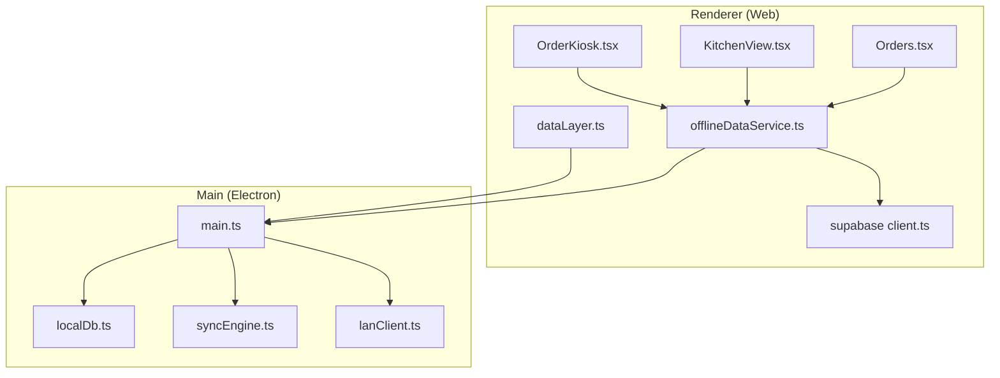
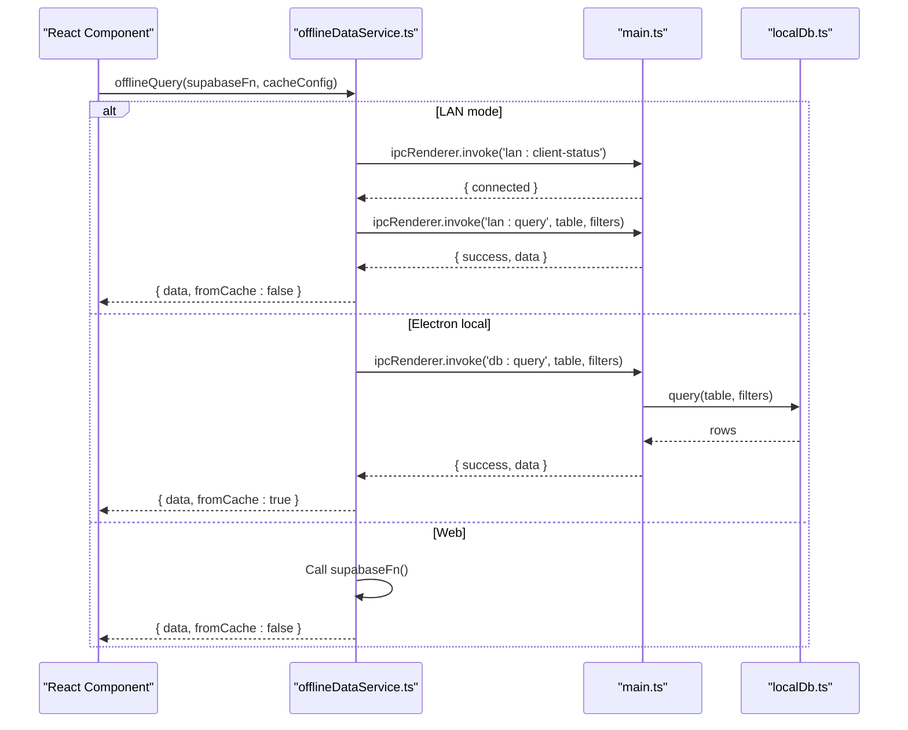
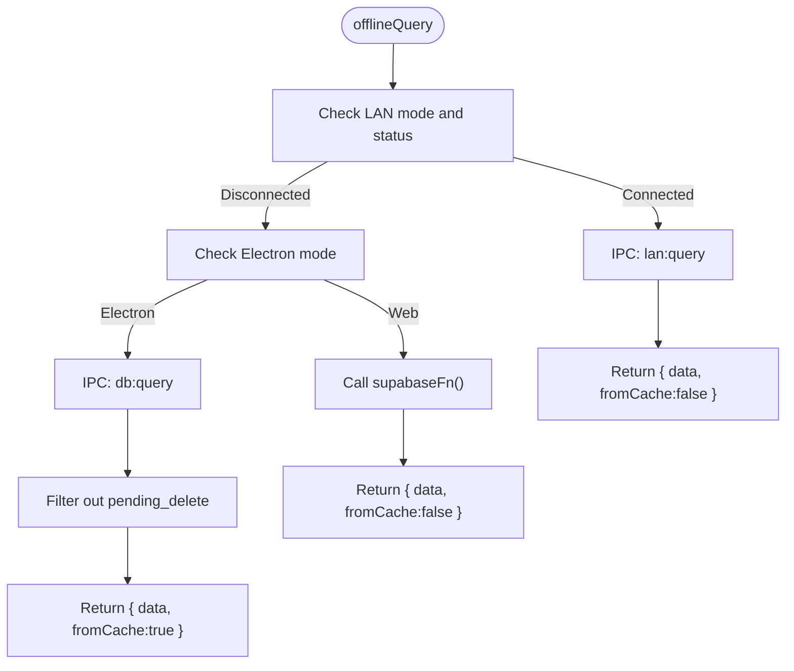
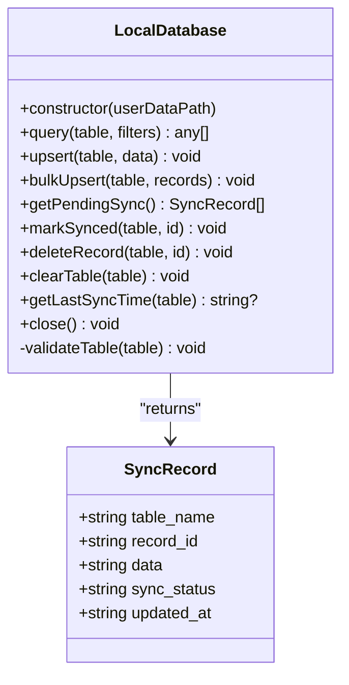
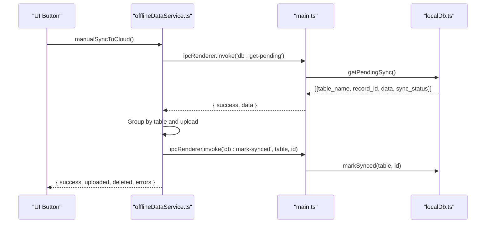
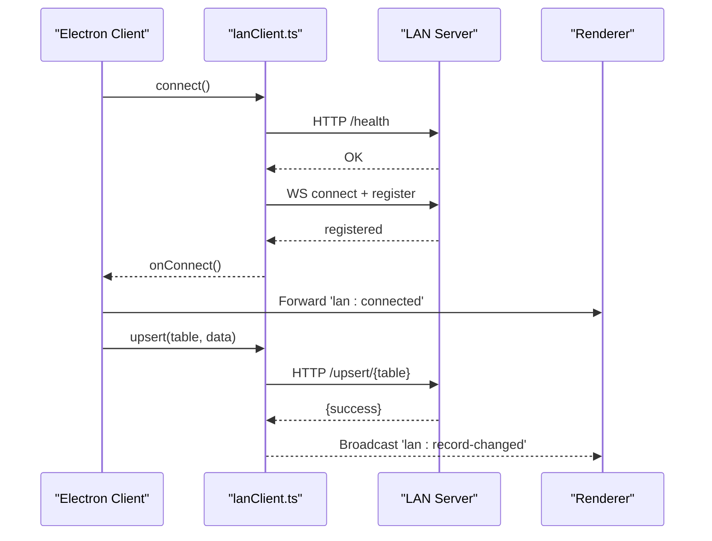
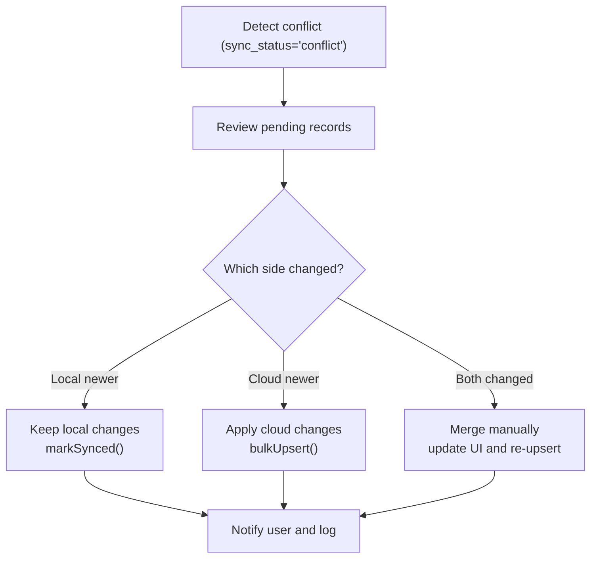
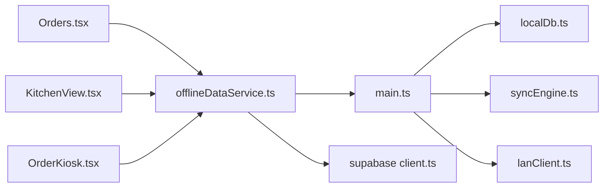

# Offline & Online Synchronization

<cite>
**Referenced Files in This Document**
- [offlineDataService.ts](file://src/services/offlineDataService.ts)
- [dataLayer.ts](file://src/services/dataLayer.ts)
- [client.ts](file://src/integrations/supabase/client.ts)
- [types.ts](file://src/integrations/supabase/types.ts)
- [main.ts](file://electron/main.ts)
- [localDb.ts](file://electron/services/localDb.ts)
- [syncEngine.ts](file://electron/services/syncEngine.ts)
- [lanClient.ts](file://electron/services/lanClient.ts)
- [Orders.tsx](file://src/pages/dashboard/Orders.tsx)
- [KitchenView.tsx](file://src/pages/dashboard/KitchenView.tsx)
- [OrderKiosk.tsx](file://src/pages/dashboard/OrderKiosk.tsx)
- [useActiveOrderCount.ts](file://src/hooks/useActiveOrderCount.ts)
- [package.json](file://package.json)
</cite>

## Table of Contents
1. [Introduction](#introduction)
2. [Project Structure](#project-structure)
3. [Core Components](#core-components)
4. [Architecture Overview](#architecture-overview)
5. [Detailed Component Analysis](#detailed-component-analysis)
6. [Dependency Analysis](#dependency-analysis)
7. [Performance Considerations](#performance-considerations)
8. [Troubleshooting Guide](#troubleshooting-guide)
9. [Conclusion](#conclusion)
10. [Appendices](#appendices)

## Introduction
This document explains the offline-first architecture and synchronization model for TableFlow Pro. It covers how the Electron desktop application uses SQLite for offline storage, how the renderer process interacts with the main process via IPC, and how synchronization is performed manually. It also documents LAN peer-to-peer synchronization for multi-device setups, conflict handling strategies, data integrity validation, and user notifications during sync operations. Practical scenarios and recovery steps are included to help operators maintain data consistency across offline and online environments.

## Project Structure
The synchronization system spans three layers:
- Renderer (web) layer: React components and services that orchestrate offline-first queries and mutations.
- Main (Electron) layer: IPC handlers and services that manage SQLite, LAN communication, and the background sync engine.
- Database layer: SQLite-backed local storage with schema mirroring selected Supabase tables.

**Diagram sources**
- [offlineDataService.ts:1-432](file://src/services/offlineDataService.ts#L1-L432)
- [dataLayer.ts:264-319](file://src/services/dataLayer.ts#L264-L319)
- [client.ts:1-17](file://src/integrations/supabase/client.ts#L1-L17)
- [main.ts:1-450](file://electron/main.ts#L1-L450)
- [localDb.ts:1-401](file://electron/services/localDb.ts#L1-L401)
- [syncEngine.ts:1-124](file://electron/services/syncEngine.ts#L1-L124)
- [lanClient.ts:1-364](file://electron/services/lanClient.ts#L1-L364)

**Section sources**
- [offlineDataService.ts:1-432](file://src/services/offlineDataService.ts#L1-L432)
- [main.ts:1-450](file://electron/main.ts#L1-L450)
- [localDb.ts:1-401](file://electron/services/localDb.ts#L1-L401)

## Core Components
- Offline-first service: Provides SQLite-first reads and writes, with soft-delete semantics and pending sync tracking.
- Data layer: Routes operations to LAN, Electron local SQLite, or Supabase based on runtime mode.
- Sync engine: Initializes local cache from cloud on first run; push sync is manual-only.
- LAN client: Enables multi-device LAN synchronization with automatic reconnection and message queuing.
- Supabase integration: Provides real-time subscriptions and typed database access for online scenarios.

Key responsibilities:
- offlineDataService.ts: Connectivity detection, SQLite caching, offlineQuery/offlineMutate/offlineDelete, manual sync pipeline.
- dataLayer.ts: Mode detection (LAN/local/supabase), sync initialization, and status reporting.
- localDb.ts: SQLite schema, upsert, bulk insert, pending sync retrieval, and sync logging.
- syncEngine.ts: Initial cloud pull and connectivity checks.
- lanClient.ts: Device registration, WebSocket lifecycle, HTTP API wrappers, and kitchen order updates.
- supabase client.ts and types.ts: Typed Supabase client and database schema definitions.

**Section sources**
- [offlineDataService.ts:1-432](file://src/services/offlineDataService.ts#L1-L432)
- [dataLayer.ts:264-319](file://src/services/dataLayer.ts#L264-L319)
- [localDb.ts:1-401](file://electron/services/localDb.ts#L1-L401)
- [syncEngine.ts:1-124](file://electron/services/syncEngine.ts#L1-L124)
- [lanClient.ts:1-364](file://electron/services/lanClient.ts#L1-L364)
- [client.ts:1-17](file://src/integrations/supabase/client.ts#L1-L17)
- [types.ts:1-818](file://src/integrations/supabase/types.ts#L1-L818)

## Architecture Overview
TableFlow Pro follows an offline-first model:
- Desktop (Electron): SQLite is the source of truth. Queries read from local SQLite; mutations write locally and are marked pending sync. Manual sync pushes pending changes to the cloud.
- LAN mode: Desktop clients connect to a LAN server that maintains a shared SQLite database. Changes propagate instantly to other clients.
- Web: Real-time subscriptions are used when online; offline fallback is minimal.

**Diagram sources**
- [offlineDataService.ts:151-211](file://src/services/offlineDataService.ts#L151-L211)
- [main.ts:127-175](file://electron/main.ts#L127-L175)
- [localDb.ts:244-268](file://electron/services/localDb.ts#L244-L268)

**Section sources**
- [offlineDataService.ts:140-211](file://src/services/offlineDataService.ts#L140-L211)
- [main.ts:127-175](file://electron/main.ts#L127-L175)
- [localDb.ts:244-268](file://electron/services/localDb.ts#L244-L268)

## Detailed Component Analysis

### Offline-first Data Access
- Connectivity detection: Tracks online/offline state and notifies listeners.
- SQLite caching: After initial cloud load, results are cached to SQLite for offline reads.
- Offline query: Prioritizes local SQLite; falls back to empty array when offline.
- Offline mutate/delete: Writes to local SQLite, marks records as pending_sync or pending_delete; does not auto-sync to cloud.
- Manual sync: Collects pending records, groups by table, and uploads to cloud; updates sync status upon success.

**Diagram sources**
- [offlineDataService.ts:151-211](file://src/services/offlineDataService.ts#L151-L211)
- [main.ts:362-378](file://electron/main.ts#L362-L378)
- [offlineDataService.ts:122-138](file://src/services/offlineDataService.ts#L122-L138)

**Section sources**
- [offlineDataService.ts:26-47](file://src/services/offlineDataService.ts#L26-L47)
- [offlineDataService.ts:61-120](file://src/services/offlineDataService.ts#L61-L120)
- [offlineDataService.ts:122-211](file://src/services/offlineDataService.ts#L122-L211)
- [offlineDataService.ts:220-347](file://src/services/offlineDataService.ts#L220-L347)

### SQLite Database Management
- Schema: Mirrors selected Supabase tables (orders, order_items, menu_categories, menu_items, kitchens, floors, tables, restaurants, staff_members) with sync_status and timestamps.
- Upsert: Inserts or updates records by id; ensures updated_at is set; converts booleans to integers for SQLite.
- Bulk upsert: Efficiently loads batches of records during initial sync.
- Pending sync: Retrieves all records with pending_sync or pending_delete for manual upload.
- Sync log: Records synced events for audit and last-sync tracking.

**Diagram sources**
- [localDb.ts:164-401](file://electron/services/localDb.ts#L164-L401)

**Section sources**
- [localDb.ts:15-162](file://electron/services/localDb.ts#L15-L162)
- [localDb.ts:273-323](file://electron/services/localDb.ts#L273-L323)
- [localDb.ts:328-359](file://electron/services/localDb.ts#L328-L359)

### Sync Engine and Manual Push
- Initial pull: On startup, if online, pulls data from Supabase into SQLite for selected tables.
- Manual push: Renderer calls manualSyncToCloud(), which retrieves pending records, groups by table, and uploads to cloud. Updates sync_status on success.
- Status reporting: Exposes online status and pending count to the UI.

**Diagram sources**
- [offlineDataService.ts:397-432](file://src/services/offlineDataService.ts#L397-L432)
- [main.ts:149-156](file://electron/main.ts#L149-L156)
- [localDb.ts:353-359](file://electron/services/localDb.ts#L353-L359)

**Section sources**
- [syncEngine.ts:32-106](file://electron/services/syncEngine.ts#L32-L106)
- [offlineDataService.ts:397-432](file://src/services/offlineDataService.ts#L397-L432)
- [main.ts:177-224](file://electron/main.ts#L177-L224)
- [localDb.ts:328-359](file://electron/services/localDb.ts#L328-L359)

### LAN Multi-Device Synchronization
- LAN client: Connects to a LAN server via WebSocket and HTTP. Registers device, handles reconnection, and queues messages until connected.
- IPC handlers: Expose LAN operations to renderer (query, upsert, delete, kitchen orders, status updates).
- Real-time propagation: Changes broadcast to all LAN clients; kitchen displays receive live updates.

**Diagram sources**
- [lanClient.ts:65-144](file://electron/services/lanClient.ts#L65-L144)
- [main.ts:278-391](file://electron/main.ts#L278-L391)
- [lanClient.ts:217-275](file://electron/services/lanClient.ts#L217-L275)

**Section sources**
- [lanClient.ts:1-364](file://electron/services/lanClient.ts#L1-L364)
- [main.ts:226-391](file://electron/main.ts#L226-L391)

### Conflict Resolution Strategies
- Last-writer-wins with timestamps: The SQLite upsert sets updated_at on every write. During manual sync, records are uploaded with their timestamps intact.
- Pending sync isolation: Mutations are marked pending_sync and not pushed automatically, reducing concurrent write conflicts.
- Soft delete: Deletions are marked pending_delete in SQLite to avoid losing data during offline sessions.
- Manual reconciliation: If conflicts arise after sync, the UI can surface pending records and allow users to review and merge changes.

**Diagram sources**
- [localDb.ts:7-13](file://electron/services/localDb.ts#L7-L13)
- [offlineDataService.ts:220-347](file://src/services/offlineDataService.ts#L220-L347)

**Section sources**
- [localDb.ts:7-13](file://electron/services/localDb.ts#L7-L13)
- [offlineDataService.ts:220-347](file://src/services/offlineDataService.ts#L220-L347)

### Data Integrity Validation
- Schema validation: LocalDatabase validates table names and enforces foreign keys and indexes.
- Upsert validation: Converts booleans to integers and ensures updated_at is present.
- Sync logging: Maintains a sync_log table to track synced actions and last sync per table.
- Transactional bulk inserts: Uses transactions to ensure atomicity during initial sync.

**Section sources**
- [localDb.ts:395-401](file://electron/services/localDb.ts#L395-L401)
- [localDb.ts:295-302](file://electron/services/localDb.ts#L295-L302)
- [localDb.ts:356-359](file://electron/services/localDb.ts#L356-L359)
- [localDb.ts:317-323](file://electron/services/localDb.ts#L317-L323)

### Network Connectivity Handling and Offline Operations
- Connectivity state: Listens to browser online/offline events and exposes isOnline()/isOffline().
- Offline reads: offlineQuery returns cached data even when SQLite returns an empty result, ensuring the app remains usable offline.
- LAN fallback: If LAN is unavailable, operations fall back to Electron local SQLite or web Supabase depending on mode.

**Section sources**
- [offlineDataService.ts:26-47](file://src/services/offlineDataService.ts#L26-L47)
- [offlineDataService.ts:192-211](file://src/services/offlineDataService.ts#L192-L211)

### Practical Scenarios

#### Scenario 1: Offline Billing Station
- Symptom: Billing station loses internet mid-session.
- Behavior: offlineQuery serves cached data from SQLite; offlineMutate writes to local SQLite and marks pending_sync.
- Recovery: When connectivity returns, user taps “Sync Now” to upload pending changes.

**Section sources**
- [offlineDataService.ts:140-211](file://src/services/offlineDataService.ts#L140-L211)
- [offlineDataService.ts:220-287](file://src/services/offlineDataService.ts#L220-L287)
- [offlineDataService.ts:397-432](file://src/services/offlineDataService.ts#L397-L432)

#### Scenario 2: LAN Kitchen Display Updates
- Symptom: Chef updates order item status in kitchen display.
- Behavior: LAN client sends HTTP request; server broadcasts to all clients; renderer receives real-time updates.
- Recovery: If disconnected, messages are queued and resent on reconnect.

**Section sources**
- [lanClient.ts:299-317](file://electron/services/lanClient.ts#L299-L317)
- [main.ts:296-302](file://electron/main.ts#L296-L302)

#### Scenario 3: Data Recovery After Sync Failure
- Symptom: Partial sync fails due to network issues.
- Behavior: Pending records remain pending_sync; manualSyncToCloud() retries upload.
- Recovery: Review pending records in UI; re-attempt sync; verify sync_log.

**Section sources**
- [offlineDataService.ts:397-432](file://src/services/offlineDataService.ts#L397-L432)
- [localDb.ts:328-359](file://electron/services/localDb.ts#L328-L359)

### Integration Between Web and Desktop Applications
- Web mode: Uses Supabase client and real-time subscriptions for live updates.
- Desktop mode: Uses Electron IPC to SQLite for offline-first behavior.
- LAN mode: Bridges desktop clients to a shared LAN server for multi-device collaboration.

**Section sources**
- [client.ts:1-17](file://src/integrations/supabase/client.ts#L1-L17)
- [main.ts:127-175](file://electron/main.ts#L127-L175)
- [lanClient.ts:217-275](file://electron/services/lanClient.ts#L217-L275)

## Dependency Analysis
- Renderer depends on offlineDataService.ts for offline-first operations and on Supabase client for online access.
- offlineDataService.ts depends on Electron IPC handlers in main.ts and localDb.ts for SQLite operations.
- main.ts registers IPC handlers for database, sync, and LAN operations.
- syncEngine.ts depends on localDb.ts for database operations.
- lanClient.ts depends on WebSocket and HTTP APIs exposed by the LAN server.

**Diagram sources**
- [offlineDataService.ts:1-432](file://src/services/offlineDataService.ts#L1-L432)
- [main.ts:1-450](file://electron/main.ts#L1-L450)
- [localDb.ts:1-401](file://electron/services/localDb.ts#L1-L401)
- [syncEngine.ts:1-124](file://electron/services/syncEngine.ts#L1-L124)
- [lanClient.ts:1-364](file://electron/services/lanClient.ts#L1-L364)
- [client.ts:1-17](file://src/integrations/supabase/client.ts#L1-L17)

**Section sources**
- [offlineDataService.ts:1-432](file://src/services/offlineDataService.ts#L1-L432)
- [main.ts:1-450](file://electron/main.ts#L1-L450)
- [localDb.ts:1-401](file://electron/services/localDb.ts#L1-L401)
- [syncEngine.ts:1-124](file://electron/services/syncEngine.ts#L1-L124)
- [lanClient.ts:1-364](file://electron/services/lanClient.ts#L1-L364)
- [client.ts:1-17](file://src/integrations/supabase/client.ts#L1-L17)

## Performance Considerations
- SQLite WAL mode and foreign keys enabled for durability and referential integrity.
- Transactions for bulk upserts reduce overhead during initial sync.
- Boolean normalization to integers avoids type mismatches.
- Indexes on frequently queried columns improve read performance.
- Manual sync batches uploads by table to minimize round trips.
- LAN client queues messages until WebSocket is ready to reduce dropped updates.

[No sources needed since this section provides general guidance]

## Troubleshooting Guide
Common issues and resolutions:
- No internet connection: offlineQuery returns cached data; manual sync requires connectivity.
- SQLite not available: offlineMutate returns error; ensure Electron mode and IPC handlers are active.
- LAN disconnected: Renderer receives disconnect events; reconnects automatically; pending changes are queued.
- Sync failures: Review pending records and errors from manualSyncToCloud(); retry after resolving conflicts.
- Real-time updates not appearing: Verify Supabase subscriptions and isOffline() checks in components.

**Section sources**
- [offlineDataService.ts:26-47](file://src/services/offlineDataService.ts#L26-L47)
- [offlineDataService.ts:220-287](file://src/services/offlineDataService.ts#L220-L287)
- [lanClient.ts:166-186](file://electron/services/lanClient.ts#L166-L186)
- [offlineDataService.ts:397-432](file://src/services/offlineDataService.ts#L397-L432)

## Conclusion
TableFlow Pro’s offline-first design leverages SQLite for reliable local storage, with manual synchronization to the cloud and LAN-based multi-device coordination. The system prioritizes data integrity through soft deletes, pending sync tracking, and explicit conflict handling. By combining IPC-driven database operations with LAN broadcasting and Supabase real-time subscriptions, it delivers a robust, consistent experience across web and desktop environments.

## Appendices

### A. Real-time Subscriptions and Notifications
- Orders and KitchenView pages subscribe to Supabase changes and show user notifications for order updates.
- Active order count hook subscribes to order changes and skips when offline.

**Section sources**
- [Orders.tsx:323-350](file://src/pages/dashboard/Orders.tsx#L323-L350)
- [KitchenView.tsx:210-254](file://src/pages/dashboard/KitchenView.tsx#L210-L254)
- [OrderKiosk.tsx:368-410](file://src/pages/dashboard/OrderKiosk.tsx#L368-L410)
- [useActiveOrderCount.ts:35-75](file://src/hooks/useActiveOrderCount.ts#L35-L75)

### B. Dependencies and Build
- Electron main entry configured; SQLite and LAN dependencies declared.
- Post-install rebuild for native modules.

**Section sources**
- [package.json:1-131](file://package.json#L1-L131)