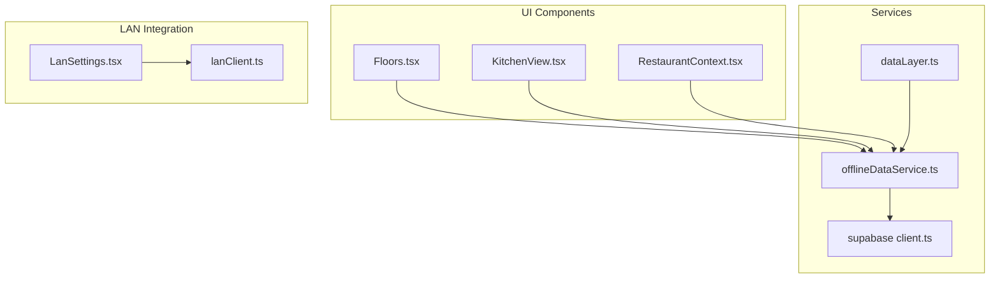
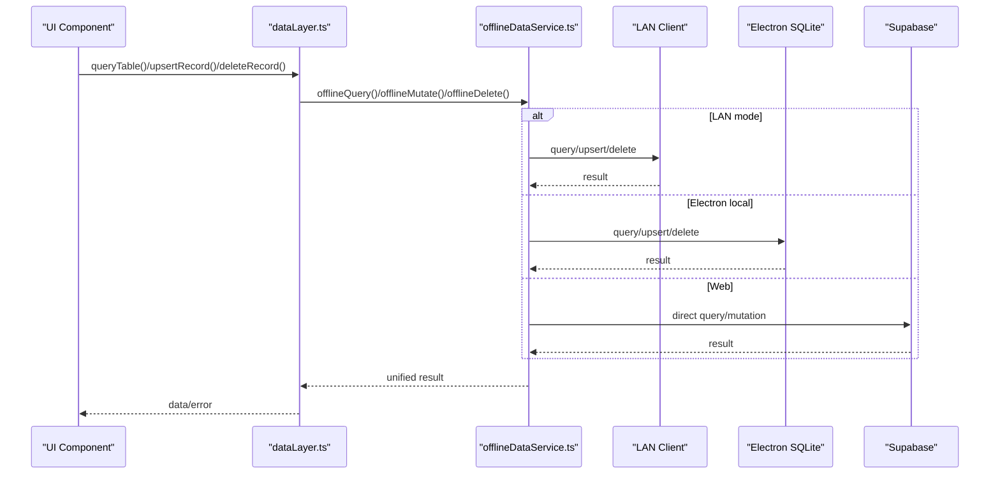
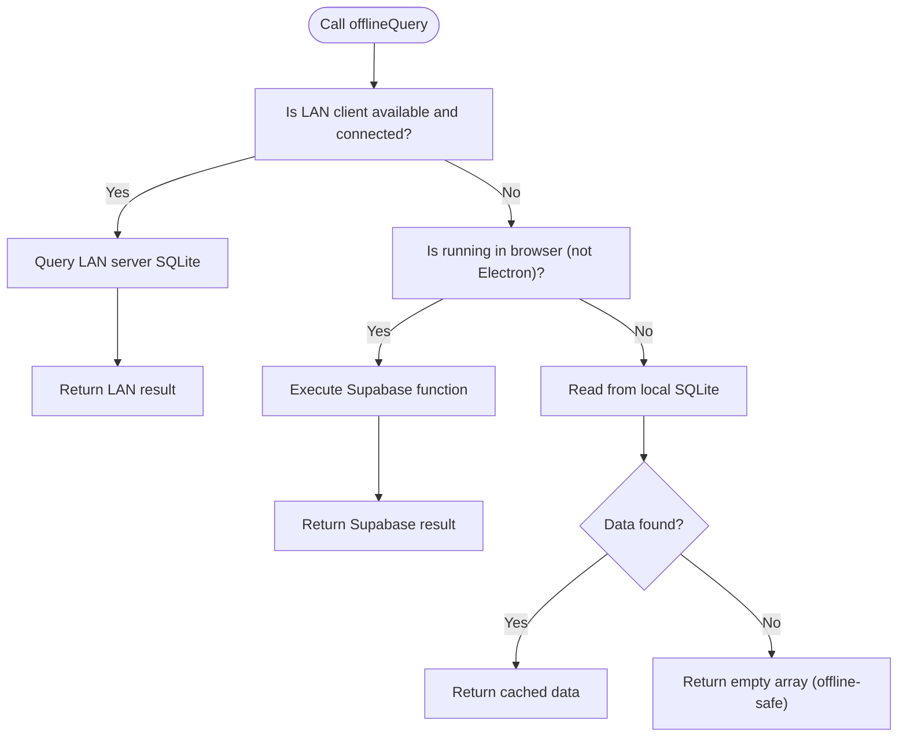
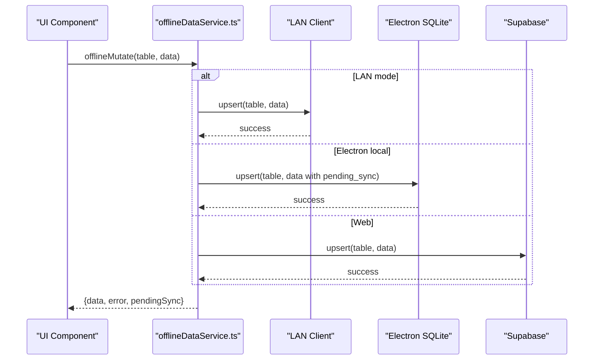
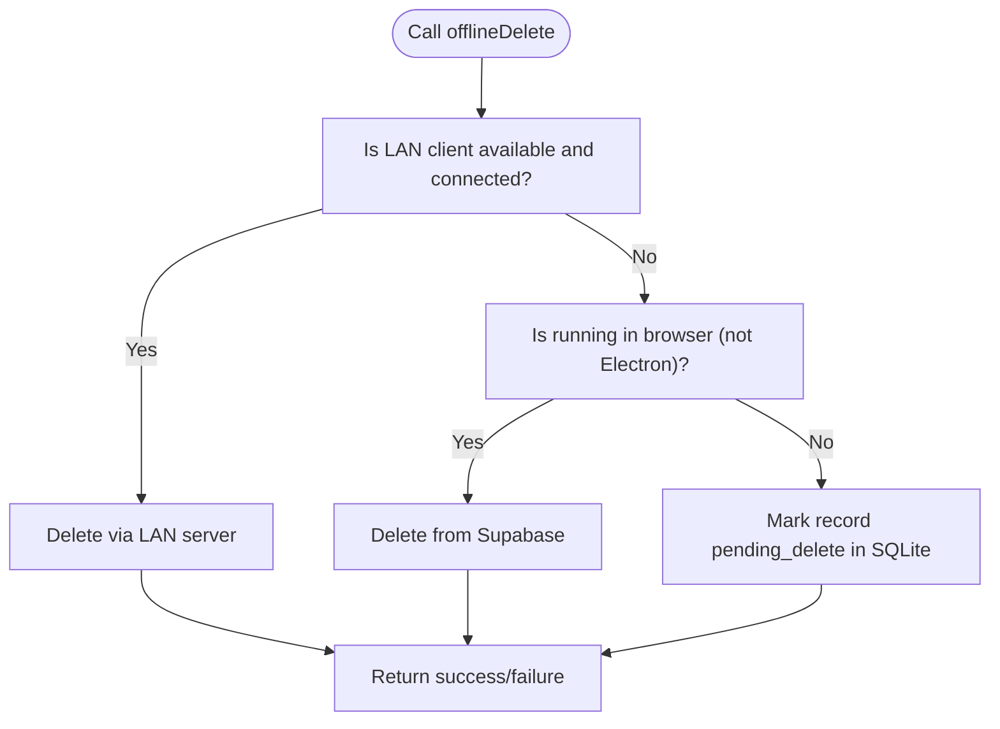
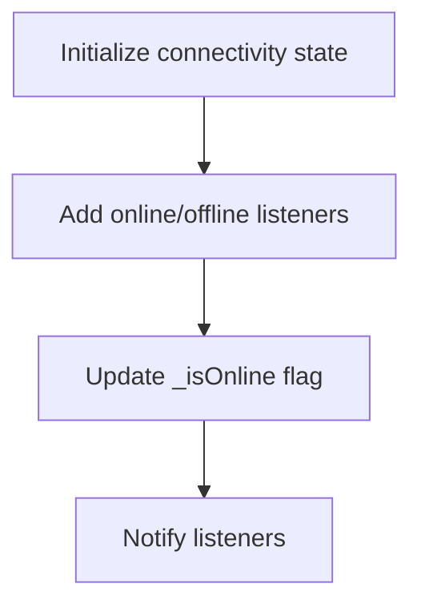
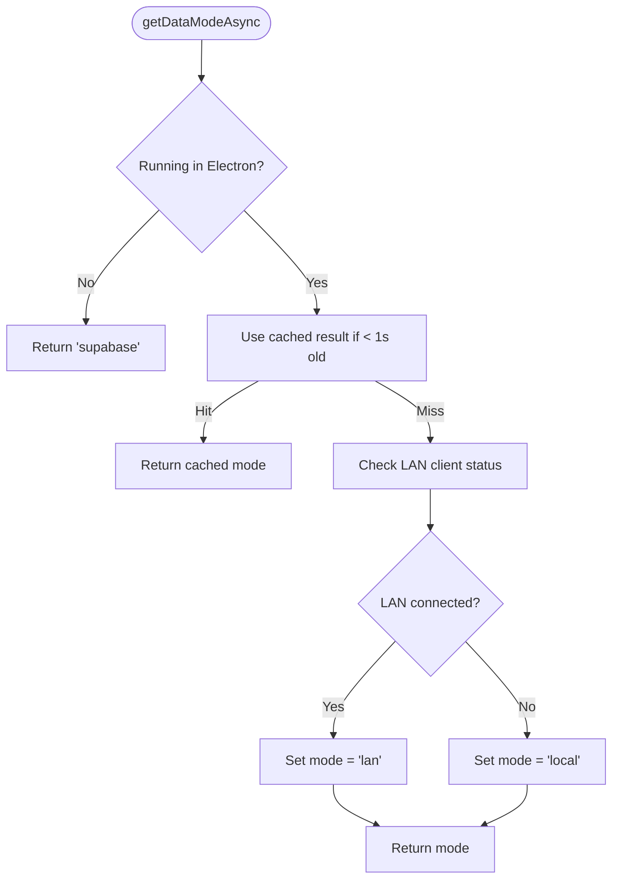
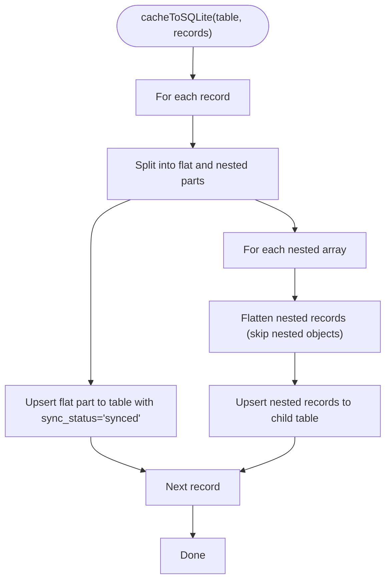
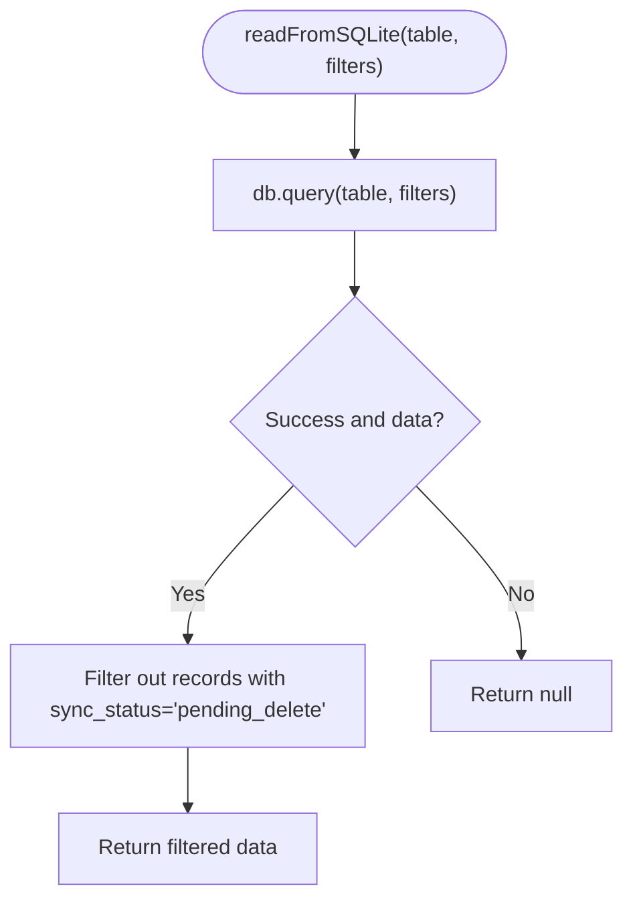
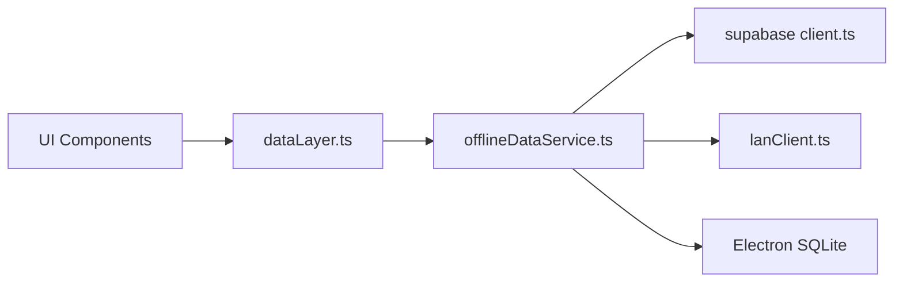

# Offline Operations & Data Access

<cite>
**Referenced Files in This Document**
- [offlineDataService.ts](file://src/services/offlineDataService.ts)
- [dataLayer.ts](file://src/services/dataLayer.ts)
- [client.ts](file://src/integrations/supabase/client.ts)
- [Floors.tsx](file://src/pages/dashboard/Floors.tsx)
- [KitchenView.tsx](file://src/pages/dashboard/KitchenView.tsx)
- [RestaurantContext.tsx](file://src/contexts/RestaurantContext.tsx)
- [LanSettings.tsx](file://src/pages/LanSettings.tsx)
- [lanClient.ts](file://electron/services/lanClient.ts)
- [DATABASE_CONNECTIVITY_MAP.md](file://DATABASE_CONNECTIVITY_MAP.md)
</cite>

## Table of Contents
1. [Introduction](#introduction)
2. [Project Structure](#project-structure)
3. [Core Components](#core-components)
4. [Architecture Overview](#architecture-overview)
5. [Detailed Component Analysis](#detailed-component-analysis)
6. [Dependency Analysis](#dependency-analysis)
7. [Performance Considerations](#performance-considerations)
8. [Troubleshooting Guide](#troubleshooting-guide)
9. [Conclusion](#conclusion)
10. [Appendices](#appendices)

## Introduction
This document explains the offline operations and data access patterns in TableFlow Pro. It focuses on the SQLite-first architecture used in Electron mode, the LAN mode for multi-device sharing, and the Supabase integration for web/cloud access. It covers:
- The offlineQuery function and how it selects the appropriate data source
- offlineMutate and offlineDelete behaviors across modes
- Connectivity detection using navigator.onLine and event listeners
- LAN mode detection and switching logic
- Cache-to-SQLite transformation for nested Supabase responses
- Filtering and empty result handling for offline scenarios
- Practical offline operation scenarios and troubleshooting steps

## Project Structure
The offline and data access logic spans three primary areas:
- Service layer for offline operations and data synchronization
- Unified data layer abstraction for mode selection
- UI components that call into these services for data operations

**Diagram sources**
- [offlineDataService.ts:1-769](file://src/services/offlineDataService.ts#L1-L769)
- [dataLayer.ts:1-320](file://src/services/dataLayer.ts#L1-L320)
- [client.ts:1-17](file://src/integrations/supabase/client.ts#L1-L17)
- [Floors.tsx:150-349](file://src/pages/dashboard/Floors.tsx#L150-L349)
- [KitchenView.tsx:260-459](file://src/pages/dashboard/KitchenView.tsx#L260-L459)
- [RestaurantContext.tsx:1-200](file://src/contexts/RestaurantContext.tsx#L1-L200)
- [LanSettings.tsx:1-533](file://src/pages/LanSettings.tsx#L1-L533)
- [lanClient.ts:78-363](file://electron/services/lanClient.ts#L78-L363)

**Section sources**
- [offlineDataService.ts:1-769](file://src/services/offlineDataService.ts#L1-L769)
- [dataLayer.ts:1-320](file://src/services/dataLayer.ts#L1-L320)
- [client.ts:1-17](file://src/integrations/supabase/client.ts#L1-L17)

## Core Components
- offlineQuery: Implements SQLite-first logic with LAN/Web fallbacks. In Electron, it reads from local SQLite and returns empty arrays when offline to keep the app functional.
- offlineMutate: Writes data depending on mode—directly to Supabase on Web, to LAN server in LAN mode, or to local SQLite in Electron with pending_sync markers.
- offlineDelete: Soft-deletes records in Electron by marking them pending_delete; deletes directly on Web or LAN as appropriate.
- Connectivity detection: Uses navigator.onLine with event listeners to track online/offline state.
- LAN mode detection: Checks LAN client status and caches the result for performance.
- Cache-to-SQLite transformation: Flattens nested Supabase responses and stores them in separate tables for relational integrity.
- Sync management: Manages manual sync to cloud, pending change counts, and data downloads.

**Section sources**
- [offlineDataService.ts:25-47](file://src/services/offlineDataService.ts#L25-L47)
- [offlineDataService.ts:151-211](file://src/services/offlineDataService.ts#L151-L211)
- [offlineDataService.ts:220-287](file://src/services/offlineDataService.ts#L220-L287)
- [offlineDataService.ts:295-347](file://src/services/offlineDataService.ts#L295-L347)
- [offlineDataService.ts:61-120](file://src/services/offlineDataService.ts#L61-L120)
- [offlineDataService.ts:351-372](file://src/services/offlineDataService.ts#L351-L372)

## Architecture Overview
The system supports three operational modes:
- Web (Supabase): Direct cloud access
- LAN (Electron): Multi-device shared SQLite via LAN server
- Local (Electron): Fully offline SQLite-first with manual sync

**Diagram sources**
- [dataLayer.ts:112-237](file://src/services/dataLayer.ts#L112-L237)
- [offlineDataService.ts:151-211](file://src/services/offlineDataService.ts#L151-L211)
- [offlineDataService.ts:220-287](file://src/services/offlineDataService.ts#L220-L287)
- [offlineDataService.ts:295-347](file://src/services/offlineDataService.ts#L295-L347)

## Detailed Component Analysis

### offlineQuery: SQLite-first with automatic fallback detection
- LAN mode: If LAN client is connected, queries the LAN server SQLite directly.
- Electron local: Queries local SQLite; returns cached data even if empty to maintain app functionality offline.
- Web: Executes the provided Supabase function directly.

**Diagram sources**
- [offlineDataService.ts:151-211](file://src/services/offlineDataService.ts#L151-L211)

**Section sources**
- [offlineDataService.ts:151-211](file://src/services/offlineDataService.ts#L151-L211)

### offlineMutate: Writes across modes with pending_sync markers
- LAN mode: Upserts to LAN server SQLite; no pending_sync marker.
- Electron local: Upserts to local SQLite with sync_status set to pending_sync.
- Web: Direct upsert to Supabase.

**Diagram sources**
- [offlineDataService.ts:220-287](file://src/services/offlineDataService.ts#L220-L287)

**Section sources**
- [offlineDataService.ts:220-287](file://src/services/offlineDataService.ts#L220-L287)

### offlineDelete: Soft-delete in Electron, direct delete elsewhere
- LAN mode: Delegates to LAN server delete.
- Electron local: Marks record as pending_delete in SQLite.
- Web: Direct delete from Supabase.

**Diagram sources**
- [offlineDataService.ts:295-347](file://src/services/offlineDataService.ts#L295-L347)

**Section sources**
- [offlineDataService.ts:295-347](file://src/services/offlineDataService.ts#L295-L347)

### Connectivity Detection: navigator.onLine and event listeners
- Tracks global online/offline state and notifies registered listeners.
- Used by sync and query logic to gate cloud operations.

**Diagram sources**
- [offlineDataService.ts:25-47](file://src/services/offlineDataService.ts#L25-L47)

**Section sources**
- [offlineDataService.ts:25-47](file://src/services/offlineDataService.ts#L25-L47)

### LAN Mode Detection and Switching
- LAN client status is checked asynchronously and cached for a short period to reduce overhead.
- dataLayer determines the current mode (lan/local/supabase) and routes operations accordingly.

**Diagram sources**
- [dataLayer.ts:61-82](file://src/services/dataLayer.ts#L61-L82)
- [dataLayer.ts:37-55](file://src/services/dataLayer.ts#L37-L55)

**Section sources**
- [dataLayer.ts:61-82](file://src/services/dataLayer.ts#L61-L82)
- [dataLayer.ts:37-55](file://src/services/dataLayer.ts#L37-L55)

### Cache-to-SQLite Transformation and Nested Response Handling
- Flattens top-level scalar values and skips nested objects/arrays.
- Extracts nested arrays (e.g., order_items) and writes them to separate tables.
- Sets sync_status to synced for cached records.

**Diagram sources**
- [offlineDataService.ts:61-120](file://src/services/offlineDataService.ts#L61-L120)

**Section sources**
- [offlineDataService.ts:61-120](file://src/services/offlineDataService.ts#L61-L120)

### Filter System and Empty Result Handling
- Filters are applied when querying SQLite; pending_delete records are excluded from results.
- In Electron, offlineQuery returns an empty array when no SQLite data is available, ensuring the app remains usable offline.

**Diagram sources**
- [offlineDataService.ts:122-138](file://src/services/offlineDataService.ts#L122-L138)

**Section sources**
- [offlineDataService.ts:122-138](file://src/services/offlineDataService.ts#L122-L138)
- [offlineDataService.ts:192-211](file://src/services/offlineDataService.ts#L192-L211)

### Practical Offline Operation Scenarios
- Creating a floor/table in LAN mode:
  - offlineMutate writes to LAN server SQLite; UI updates optimistically.
  - Example usage in Floors.tsx demonstrates insert/update flows with offline fallbacks.
- Updating order status in KitchenView:
  - offlineMutate updates orders and order_items; optional local SQLite updates for consistency.
- Restaurant selection without user/session:
  - RestaurantContext restores from localStorage when offline and not in LAN mode.

**Section sources**
- [Floors.tsx:159-195](file://src/pages/dashboard/Floors.tsx#L159-L195)
- [Floors.tsx:211-246](file://src/pages/dashboard/Floors.tsx#L211-L246)
- [KitchenView.tsx:272-324](file://src/pages/dashboard/KitchenView.tsx#L272-L324)
- [RestaurantContext.tsx:78-136](file://src/contexts/RestaurantContext.tsx#L78-L136)

## Dependency Analysis
- offlineDataService depends on:
  - Supabase client for cloud operations
  - Electron APIs for SQLite and sync
  - LAN client for multi-device sharing
- dataLayer abstracts mode selection and delegates to offlineDataService
- UI components import offlineDataService for all data operations

**Diagram sources**
- [dataLayer.ts:112-237](file://src/services/dataLayer.ts#L112-L237)
- [offlineDataService.ts:151-347](file://src/services/offlineDataService.ts#L151-L347)
- [client.ts:1-17](file://src/integrations/supabase/client.ts#L1-17)
- [lanClient.ts:78-363](file://electron/services/lanClient.ts#L78-L363)

**Section sources**
- [dataLayer.ts:112-237](file://src/services/dataLayer.ts#L112-L237)
- [offlineDataService.ts:151-347](file://src/services/offlineDataService.ts#L151-L347)

## Performance Considerations
- LAN status caching reduces repeated network checks.
- SQLite queries are filtered client-side to exclude pending_delete records.
- Manual sync batches operations by table and respects dependency order to avoid foreign key violations.
- Pending change counts enable users to track outstanding sync operations.

[No sources needed since this section provides general guidance]

## Troubleshooting Guide
Common issues and resolutions:
- LAN server not responding:
  - Verify LAN client status and re-check connection; confirm server IP and port.
  - Use LAN settings page to start/stop server and manage connections.
- Offline mode appears empty:
  - Confirm that local SQLite has been populated via downloadAllDataFromCloud.
  - Ensure filters are not too restrictive; pending_delete records are excluded.
- Sync failures:
  - Check connectivity; manual sync requires online access.
  - Review sync results for specific errors and retry.
- Data integrity concerns:
  - Validate that Supabase and LAN schemas match; refer to migration plan for schema alignment.

**Section sources**
- [LanSettings.tsx:97-110](file://src/pages/LanSettings.tsx#L97-L110)
- [offlineDataService.ts:610-707](file://src/services/offlineDataService.ts#L610-L707)
- [offlineDataService.ts:397-541](file://src/services/offlineDataService.ts#L397-L541)
- [DATABASE_CONNECTIVITY_MAP.md:403-472](file://DATABASE_CONNECTIVITY_MAP.md#L403-L472)

## Conclusion
TableFlow Pro implements a robust offline-first architecture:
- SQLite-first in Electron with LAN and Web fallbacks
- LAN mode for multi-device collaboration
- Comprehensive cache-to-SQLite transformation for nested data
- Reliable connectivity detection and graceful offline behavior
- Manual sync controls for cloud reconciliation

[No sources needed since this section summarizes without analyzing specific files]

## Appendices

### API Definitions and Behavior Summary
- offlineQuery
  - Purpose: Query data with SQLite-first fallback
  - Modes: LAN → Local SQLite → Supabase
  - Returns: data, error, fromCache flag
- offlineMutate
  - Purpose: Insert/update data across modes
  - Modes: LAN → Local SQLite (pending_sync) → Supabase
  - Returns: data, error, pendingSync flag
- offlineDelete
  - Purpose: Delete data with soft-delete in Electron
  - Modes: LAN → Local SQLite (pending_delete) → Supabase
  - Returns: error (null on success)

**Section sources**
- [offlineDataService.ts:151-211](file://src/services/offlineDataService.ts#L151-L211)
- [offlineDataService.ts:220-287](file://src/services/offlineDataService.ts#L220-L287)
- [offlineDataService.ts:295-347](file://src/services/offlineDataService.ts#L295-L347)