# Download Process & Data Loading

<cite>
**Referenced Files in This Document**
- [offlineDataService.ts](file://src/services/offlineDataService.ts)
- [dataLayer.ts](file://src/services/dataLayer.ts)
- [DataManager.tsx](file://src/pages/dashboard/DataManager.tsx)
- [client.ts](file://src/integrations/supabase/client.ts)
- [types.ts](file://src/integrations/supabase/types.ts)
- [RestaurantContext.tsx](file://src/contexts/RestaurantContext.tsx)
- [DashboardHome.tsx](file://src/pages/dashboard/DashboardHome.tsx)
- [syncEngine.ts](file://electron/services/syncEngine.ts)
- [main.ts](file://electron/main.ts)
</cite>

## Table of Contents
1. [Introduction](#introduction)
2. [Project Structure](#project-structure)
3. [Core Components](#core-components)
4. [Architecture Overview](#architecture-overview)
5. [Detailed Component Analysis](#detailed-component-analysis)
6. [Dependency Analysis](#dependency-analysis)
7. [Performance Considerations](#performance-considerations)
8. [Troubleshooting Guide](#troubleshooting-guide)
9. [Conclusion](#conclusion)

## Introduction
This document explains the download process and data loading mechanisms used to synchronize Supabase data into a local SQLite cache for offline-first operation. It covers the manual data download workflow that clears existing local data and fetches fresh data from Supabase, special handling for tables with complex relationships (via floors, menu_items via categories, order_items via orders), the restaurant_id filtering system, caching transformations from nested Supabase responses to flat SQLite records, error handling during downloads, partial failure recovery, and data validation processes. Examples and troubleshooting guidance are included for common download scenarios.

## Project Structure
The download and data loading pipeline spans several layers:
- Renderer services: offline data service and data layer abstraction
- Supabase integration: client and typed database schema
- Electron main process: sync engine and IPC handlers
- UI components: restaurant context and dashboard views

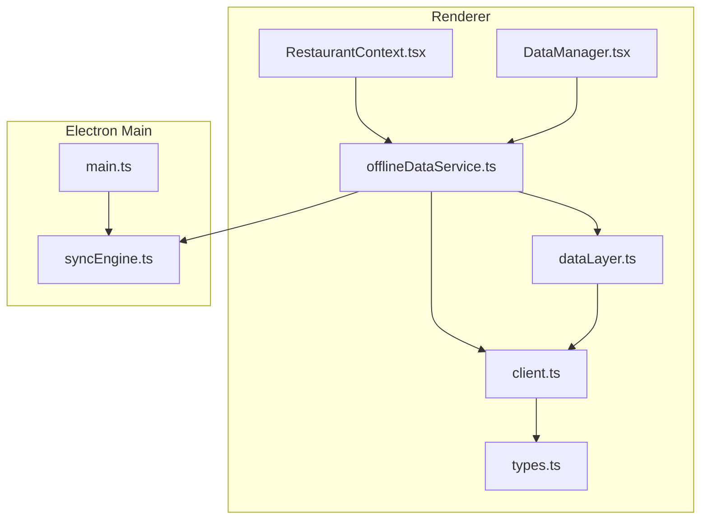

**Diagram sources**
- [offlineDataService.ts:610-707](file://src/services/offlineDataService.ts#L610-L707)
- [dataLayer.ts:112-158](file://src/services/dataLayer.ts#L112-L158)
- [client.ts:1-17](file://src/integrations/supabase/client.ts#L1-L17)
- [types.ts:116-392](file://src/integrations/supabase/types.ts#L116-L392)
- [main.ts:181-227](file://electron/main.ts#L181-L227)
- [syncEngine.ts:39-86](file://electron/services/syncEngine.ts#L39-L86)

**Section sources**
- [offlineDataService.ts:610-707](file://src/services/offlineDataService.ts#L610-L707)
- [dataLayer.ts:112-158](file://src/services/dataLayer.ts#L112-L158)
- [client.ts:1-17](file://src/integrations/supabase/client.ts#L1-L17)
- [types.ts:116-392](file://src/integrations/supabase/types.ts#L116-L392)
- [main.ts:181-227](file://electron/main.ts#L181-L227)
- [syncEngine.ts:39-86](file://electron/services/syncEngine.ts#L39-L86)

## Core Components
- Offline Data Service: orchestrates manual download, clears local SQLite, fetches from Supabase, caches nested relations, and validates records before writing.
- Data Layer: abstracts data access across modes (Supabase, local SQLite, LAN) and provides unified query/upsert/delete APIs.
- Supabase Client and Types: typed Supabase client and database schema definitions for strong typing and relationship awareness.
- Restaurant Context: manages current restaurant selection and applies restaurant_id filters across queries.
- Electron Sync Engine: handles background pull/push synchronization and exposes IPC handlers for manual sync.

Key responsibilities:
- Manual download: clears existing local data and fetches fresh data from cloud.
- Special handling: resolves complex relationships (floors→tables, categories→menu_items, orders→order_items).
- Filtering: restaurant_id partitioning ensures data isolation per restaurant.
- Caching: transforms nested Supabase responses into flat SQLite records.
- Error handling: partial failures, connectivity checks, and validation.
- Validation: strips unsupported columns, nullifies invalid foreign keys, and skips invalid IDs.

**Section sources**
- [offlineDataService.ts:610-707](file://src/services/offlineDataService.ts#L610-L707)
- [offlineDataService.ts:629-638](file://src/services/offlineDataService.ts#L629-L638)
- [offlineDataService.ts:640-661](file://src/services/offlineDataService.ts#L640-L661)
- [offlineDataService.ts:663-680](file://src/services/offlineDataService.ts#L663-L680)
- [offlineDataService.ts:682-694](file://src/services/offlineDataService.ts#L682-L694)
- [offlineDataService.ts:61-120](file://src/services/offlineDataService.ts#L61-L120)
- [offlineDataService.ts:562-603](file://src/services/offlineDataService.ts#L562-L603)
- [dataLayer.ts:112-158](file://src/services/dataLayer.ts#L112-L158)
- [client.ts:1-17](file://src/integrations/supabase/client.ts#L1-L17)
- [types.ts:116-392](file://src/integrations/supabase/types.ts#L116-L392)
- [RestaurantContext.tsx:319-353](file://src/contexts/RestaurantContext.tsx#L319-L353)

## Architecture Overview
The download pipeline operates in three stages:
1. Preparation: clear local tables and ensure online connectivity.
2. Fetch and cache: iterate tables, apply restaurant_id filters, resolve special relationships, and cache to SQLite.
3. Validation and reporting: track counts, collect errors, and return results.

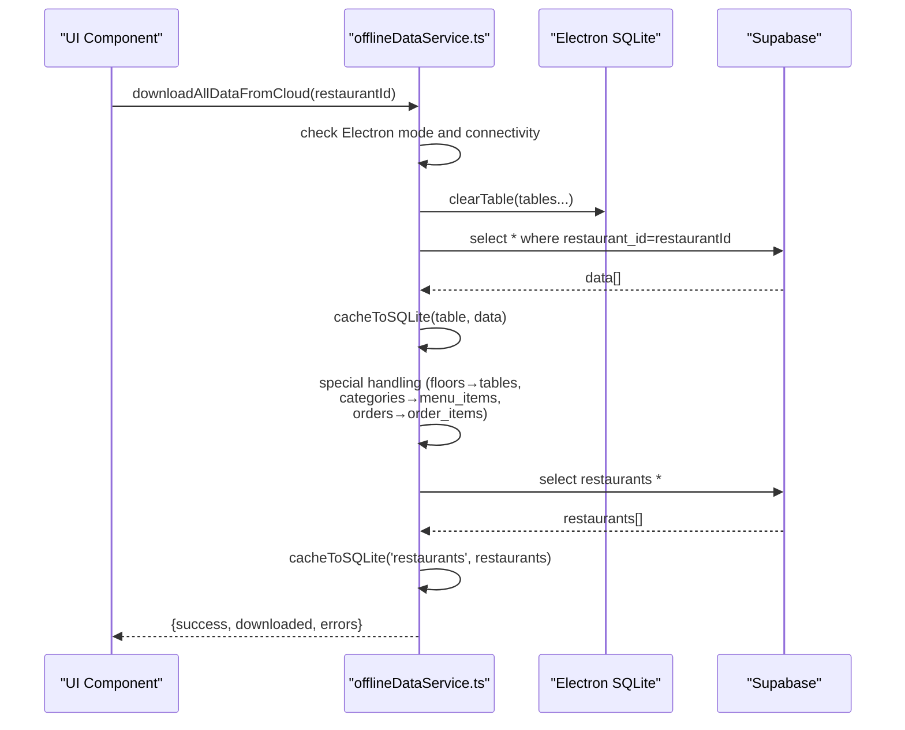

**Diagram sources**
- [offlineDataService.ts:610-707](file://src/services/offlineDataService.ts#L610-L707)
- [offlineDataService.ts:61-120](file://src/services/offlineDataService.ts#L61-L120)
- [offlineDataService.ts:562-603](file://src/services/offlineDataService.ts#L562-L603)

## Detailed Component Analysis

### Manual Download Workflow
The manual download clears existing local data and fetches fresh data from Supabase. It:
- Validates Electron mode and online connectivity.
- Clears tables with restaurant_id and special-handling tables.
- Downloads tables with restaurant_id filters.
- Resolves complex relationships via special fetchers.
- Downloads restaurants globally.
- Caches results and reports success/counts/errors.

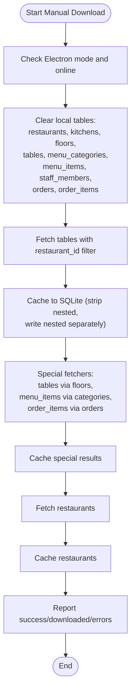

**Diagram sources**
- [offlineDataService.ts:610-707](file://src/services/offlineDataService.ts#L610-L707)
- [offlineDataService.ts:61-120](file://src/services/offlineDataService.ts#L61-L120)
- [offlineDataService.ts:562-603](file://src/services/offlineDataService.ts#L562-L603)

**Section sources**
- [offlineDataService.ts:610-707](file://src/services/offlineDataService.ts#L610-L707)
- [offlineDataService.ts:629-638](file://src/services/offlineDataService.ts#L629-L638)
- [offlineDataService.ts:640-661](file://src/services/offlineDataService.ts#L640-L661)
- [offlineDataService.ts:663-680](file://src/services/offlineDataService.ts#L663-L680)
- [offlineDataService.ts:682-694](file://src/services/offlineDataService.ts#L682-L694)

### Special Handling for Complex Relationships
Certain tables require multi-step fetching due to lack of restaurant_id or complex nesting:
- tables via floors: fetch floors by restaurant_id, then fetch tables by floor_ids.
- menu_items via categories: fetch categories by restaurant_id, then fetch menu_items by category_ids.
- order_items via orders: fetch orders by restaurant_id, then fetch order_items by order_ids.

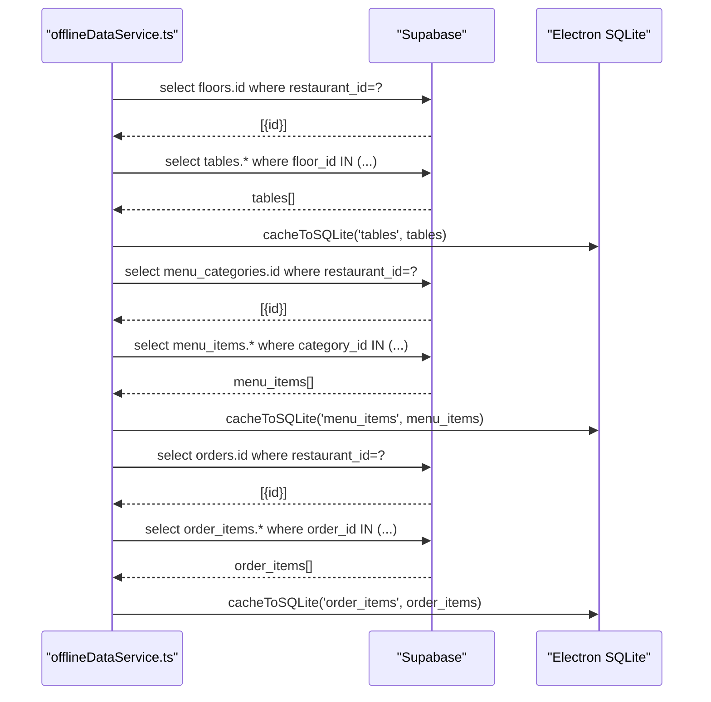

**Diagram sources**
- [offlineDataService.ts:562-603](file://src/services/offlineDataService.ts#L562-L603)

**Section sources**
- [offlineDataService.ts:562-603](file://src/services/offlineDataService.ts#L562-L603)

### Restaurant_id Filtering and Partitioning
All tables with restaurant_id are filtered by the current restaurant to ensure data partitioning:
- Directly filtered: kitchens, floors, menu_categories, staff_members, orders.
- Indirectly filtered via joins: tables (via floors), menu_items (via categories), order_items (via orders).
- Global scope: restaurants table is fetched without restaurant_id filter.

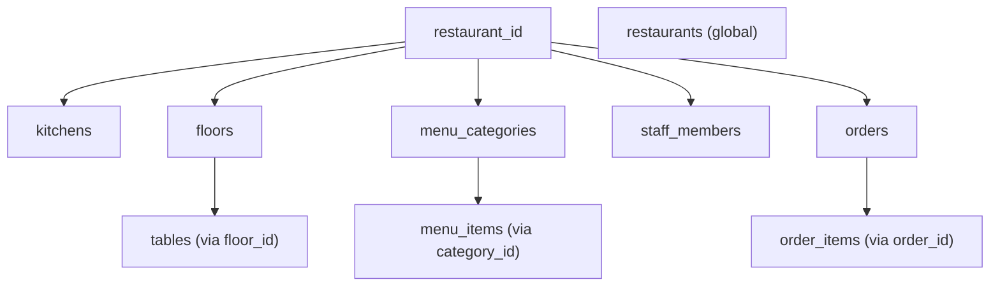

**Diagram sources**
- [offlineDataService.ts:640-661](file://src/services/offlineDataService.ts#L640-L661)
- [offlineDataService.ts:663-680](file://src/services/offlineDataService.ts#L663-L680)
- [offlineDataService.ts:682-694](file://src/services/offlineDataService.ts#L682-L694)

**Section sources**
- [offlineDataService.ts:640-661](file://src/services/offlineDataService.ts#L640-L661)
- [offlineDataService.ts:663-680](file://src/services/offlineDataService.ts#L663-L680)
- [offlineDataService.ts:682-694](file://src/services/offlineDataService.ts#L682-L694)

### Caching Mechanism: Nested to Flat Transformation
Nested Supabase responses are transformed into flat SQLite records:
- Strips nested objects/arrays except single-object joins (e.g., order_items.menu_item).
- Writes nested arrays as separate table entries (e.g., floors.tables, orders.order_items).
- Adds sync_status markers for offline operations.

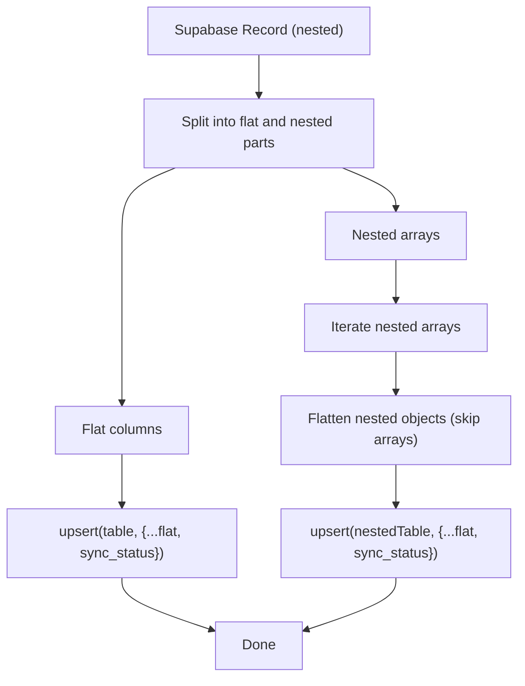

**Diagram sources**
- [offlineDataService.ts:61-120](file://src/services/offlineDataService.ts#L61-L120)

**Section sources**
- [offlineDataService.ts:61-120](file://src/services/offlineDataService.ts#L61-L120)

### Error Handling, Partial Failure Recovery, and Validation
- Connectivity: early exit if not in Electron or offline.
- Partial failures: continue downloading remaining tables upon individual errors.
- Validation:
  - Blocklist: strip columns not present in Supabase schema before upload.
  - Foreign keys: nullify invalid UUIDs; skip records with invalid order_id for order_items.
  - IDs: skip records with invalid/placeholder UUIDs.
- Reporting: accumulate errors and return success flag with counts.

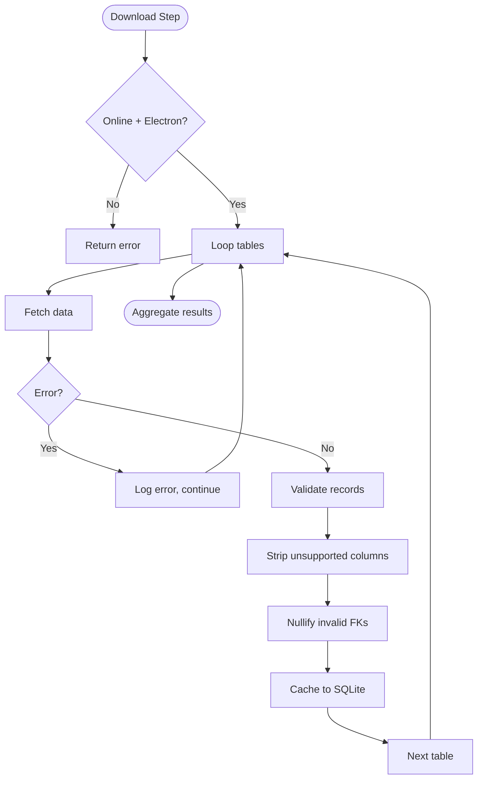

**Diagram sources**
- [offlineDataService.ts:610-707](file://src/services/offlineDataService.ts#L610-L707)
- [offlineDataService.ts:374-391](file://src/services/offlineDataService.ts#L374-L391)
- [offlineDataService.ts:474-493](file://src/services/offlineDataService.ts#L474-L493)

**Section sources**
- [offlineDataService.ts:610-707](file://src/services/offlineDataService.ts#L610-L707)
- [offlineDataService.ts:374-391](file://src/services/offlineDataService.ts#L374-L391)
- [offlineDataService.ts:474-493](file://src/services/offlineDataService.ts#L474-L493)

### Data Access Abstraction (Data Layer)
The Data Layer abstracts access across modes:
- LAN mode: queries and mutations go to LAN server SQLite.
- Electron local mode: SQLite-only, offline-first.
- Web mode: direct Supabase.

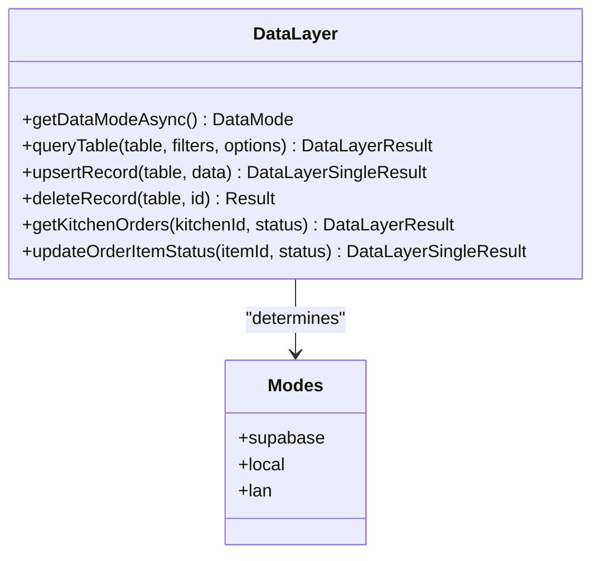

**Diagram sources**
- [dataLayer.ts:57-94](file://src/services/dataLayer.ts#L57-L94)
- [dataLayer.ts:112-158](file://src/services/dataLayer.ts#L112-L158)
- [dataLayer.ts:166-237](file://src/services/dataLayer.ts#L166-L237)

**Section sources**
- [dataLayer.ts:57-94](file://src/services/dataLayer.ts#L57-L94)
- [dataLayer.ts:112-158](file://src/services/dataLayer.ts#L112-L158)
- [dataLayer.ts:166-237](file://src/services/dataLayer.ts#L166-L237)

### Restaurant Context and Filters
RestaurantContext provides the current restaurant and role, enabling restaurant_id filtering across queries and ensuring the correct dataset is loaded.

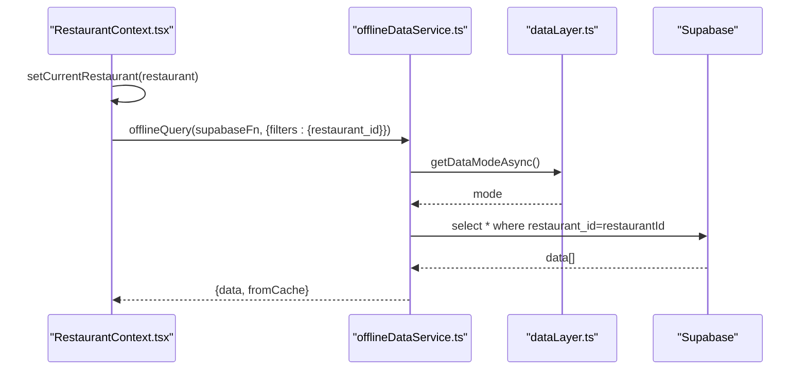

**Diagram sources**
- [RestaurantContext.tsx:319-353](file://src/contexts/RestaurantContext.tsx#L319-L353)
- [offlineDataService.ts:151-211](file://src/services/offlineDataService.ts#L151-L211)
- [dataLayer.ts:112-158](file://src/services/dataLayer.ts#L112-L158)

**Section sources**
- [RestaurantContext.tsx:319-353](file://src/contexts/RestaurantContext.tsx#L319-L353)
- [offlineDataService.ts:151-211](file://src/services/offlineDataService.ts#L151-L211)
- [dataLayer.ts:112-158](file://src/services/dataLayer.ts#L112-L158)

### Electron Sync Engine and Manual Sync
The Electron sync engine supports manual push of pending changes to Supabase with validation and dependency ordering.

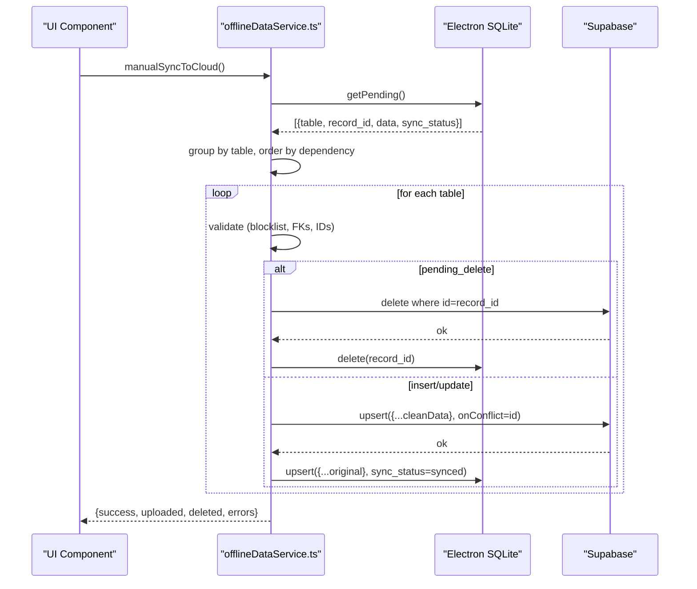

**Diagram sources**
- [offlineDataService.ts:397-541](file://src/services/offlineDataService.ts#L397-L541)
- [offlineDataService.ts:444-449](file://src/services/offlineDataService.ts#L444-L449)
- [offlineDataService.ts:466-493](file://src/services/offlineDataService.ts#L466-L493)

**Section sources**
- [offlineDataService.ts:397-541](file://src/services/offlineDataService.ts#L397-L541)
- [offlineDataService.ts:444-449](file://src/services/offlineDataService.ts#L444-L449)
- [offlineDataService.ts:466-493](file://src/services/offlineDataService.ts#L466-L493)

## Dependency Analysis
The download pipeline depends on:
- Supabase client and typed schema for correct column definitions.
- Electron main process for sync engine lifecycle and IPC handlers.
- UI components for triggering downloads and displaying results.

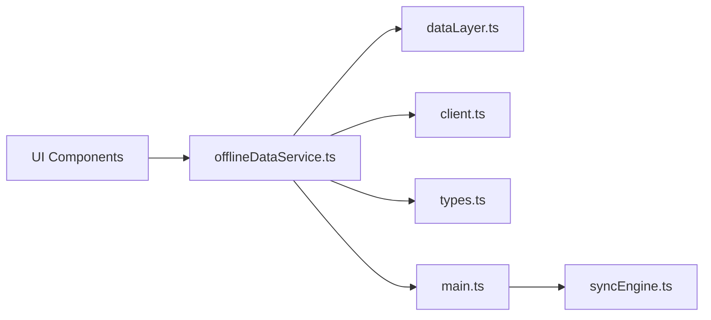

**Diagram sources**
- [offlineDataService.ts:610-707](file://src/services/offlineDataService.ts#L610-L707)
- [dataLayer.ts:112-158](file://src/services/dataLayer.ts#L112-L158)
- [client.ts:1-17](file://src/integrations/supabase/client.ts#L1-L17)
- [types.ts:116-392](file://src/integrations/supabase/types.ts#L116-L392)
- [main.ts:181-227](file://electron/main.ts#L181-L227)
- [syncEngine.ts:39-86](file://electron/services/syncEngine.ts#L39-L86)

**Section sources**
- [offlineDataService.ts:610-707](file://src/services/offlineDataService.ts#L610-L707)
- [dataLayer.ts:112-158](file://src/services/dataLayer.ts#L112-L158)
- [client.ts:1-17](file://src/integrations/supabase/client.ts#L1-L17)
- [types.ts:116-392](file://src/integrations/supabase/types.ts#L116-L392)
- [main.ts:181-227](file://electron/main.ts#L181-L227)
- [syncEngine.ts:39-86](file://electron/services/syncEngine.ts#L39-L86)

## Performance Considerations
- Batch operations: clear and cache operations iterate tables sequentially; consider batching where appropriate.
- Network efficiency: restaurant_id filters reduce payload sizes; special fetchers minimize cross-table scans.
- SQLite writes: upsert operations are performed per record; batch writes could improve throughput.
- Validation overhead: blocklist stripping and FK normalization add CPU cost; keep lists minimal and targeted.
- Offline-first design: reduces network dependency and improves responsiveness.

## Troubleshooting Guide
Common issues and resolutions:
- Not in Electron mode: Manual download requires Electron; ensure the app runs in Electron.
  - Resolution: Launch the Electron app, not the web build.
- No internet connection: Download requires online connectivity.
  - Resolution: Connect to the internet and retry.
- Empty results for special tables: missing parent records.
  - Resolution: Ensure parent records (floors/categories/orders) exist for the current restaurant.
- Invalid IDs or FKs causing failures:
  - Resolution: Validate IDs and FKs; the system skips invalid records and logs warnings.
- Partial failures:
  - Resolution: Inspect returned errors; the process continues to download remaining tables.
- Conflicts during manual sync:
  - Resolution: Review errors and adjust data; the system preserves original timestamps on successful upserts.

**Section sources**
- [offlineDataService.ts:610-707](file://src/services/offlineDataService.ts#L610-L707)
- [offlineDataService.ts:466-493](file://src/services/offlineDataService.ts#L466-L493)
- [offlineDataService.ts:397-541](file://src/services/offlineDataService.ts#L397-L541)

## Conclusion
The download and data loading system provides a robust, offline-first mechanism for synchronizing Supabase data into local SQLite. It enforces restaurant_id partitioning, handles complex relationships through special fetchers, transforms nested responses into flat records, validates data integrity, and recovers gracefully from partial failures. The manual download workflow, combined with the data layer abstraction and Electron sync engine, delivers a reliable foundation for offline operation while maintaining data consistency when online.