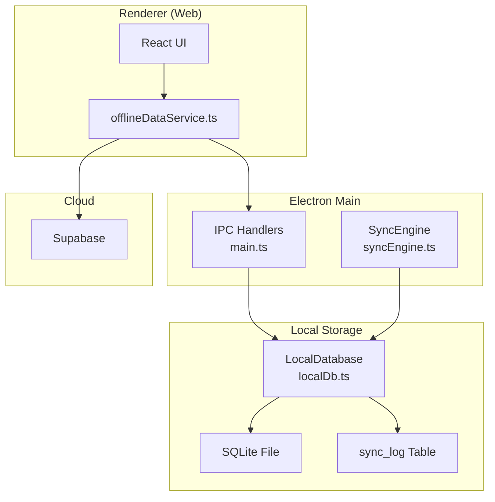
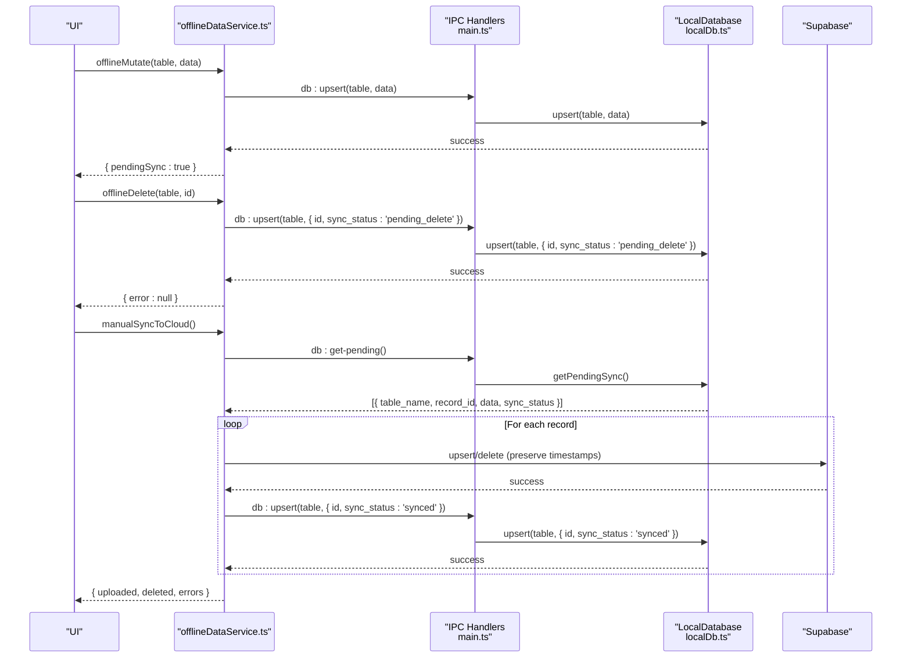
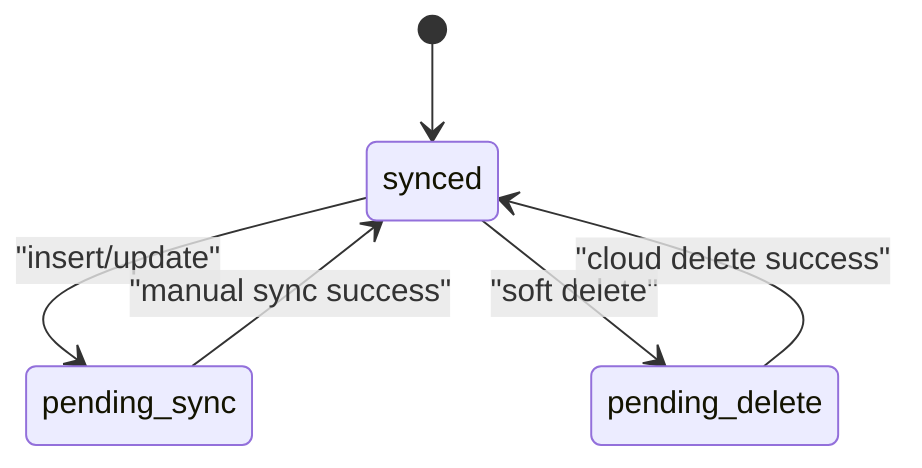
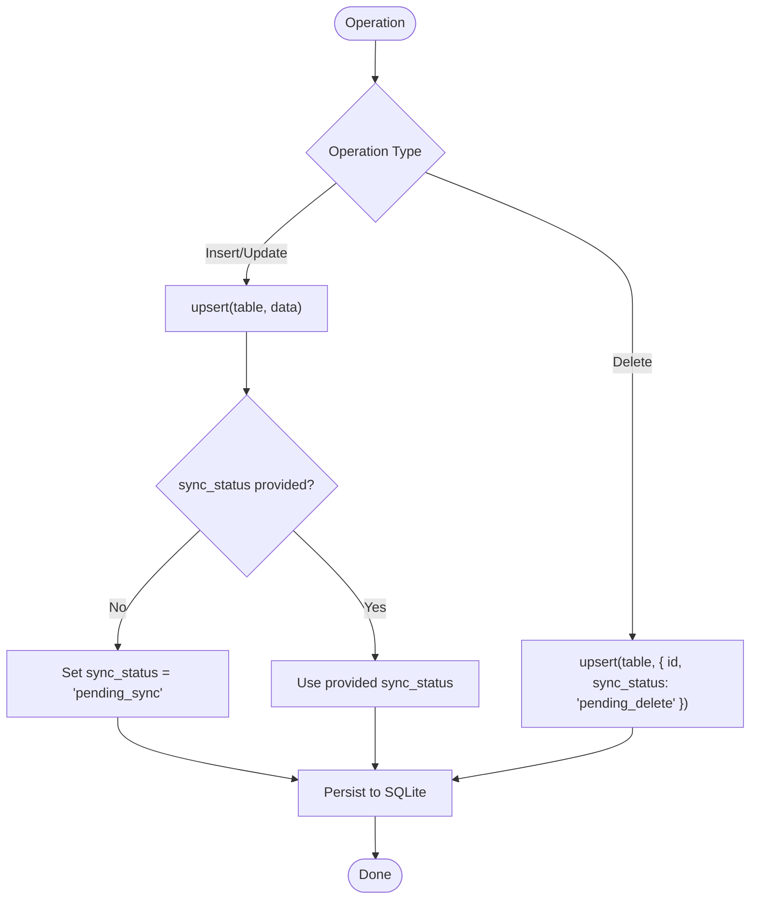
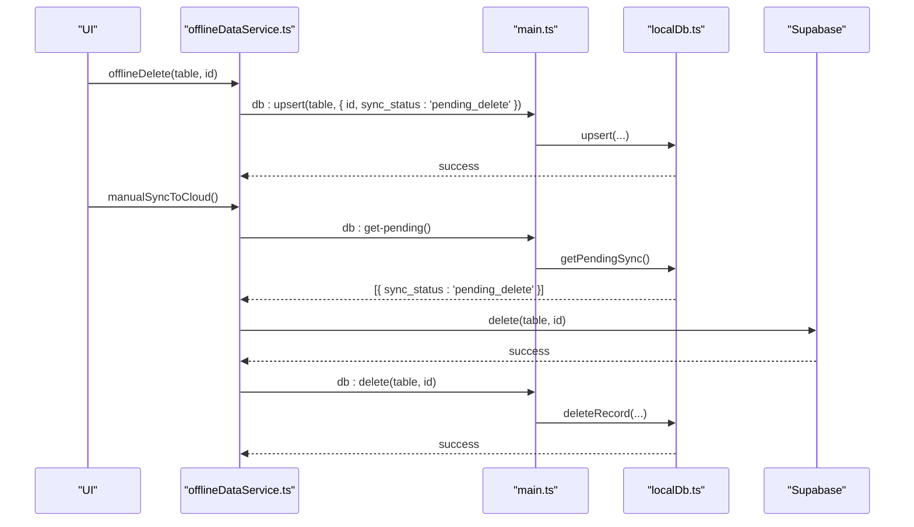
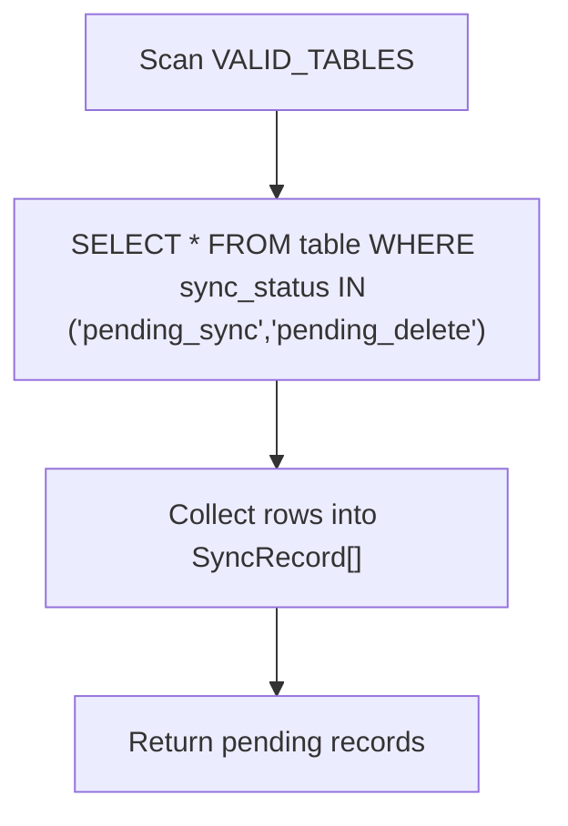
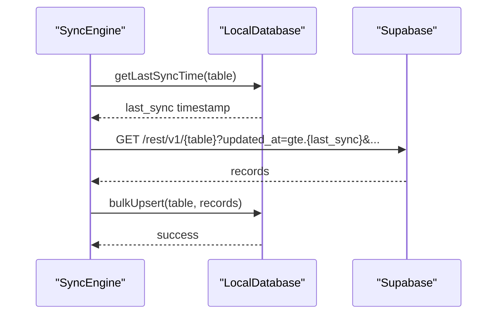
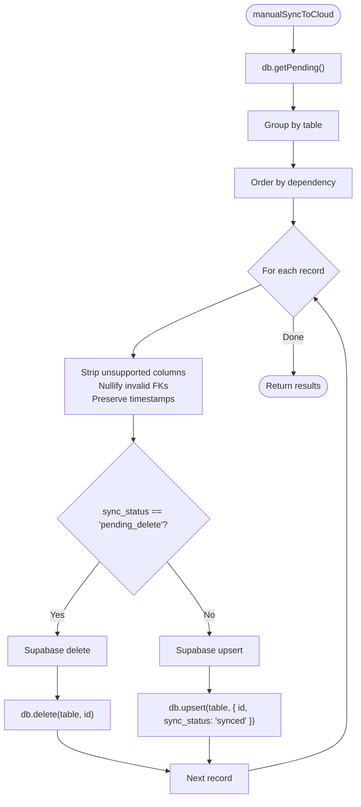
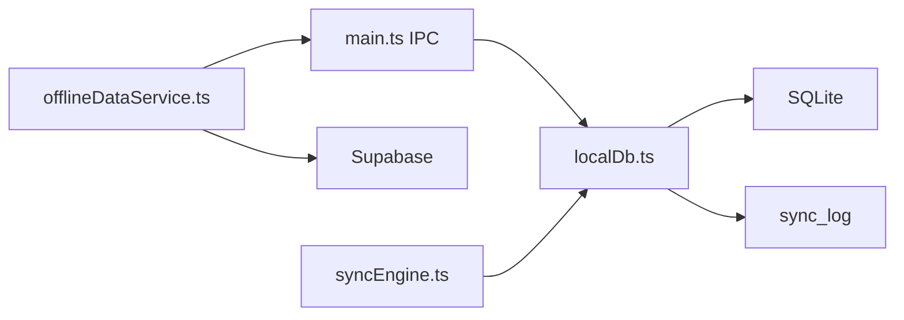

# Sync Status Tracking & State Management

<cite>
**Referenced Files in This Document**
- [localDb.ts](file://electron/services/localDb.ts)
- [offlineDataService.ts](file://src/services/offlineDataService.ts)
- [syncEngine.ts](file://electron/services/syncEngine.ts)
- [main.ts](file://electron/main.ts)
- [20251206042902_fc2b1d91-eb8e-4750-90c3-95b7e0feb6ba.sql](file://supabase/migrations/20251206042902_fc2b1d91-eb8e-4750-90c3-95b7e0feb6ba.sql)
</cite>

## Table of Contents
1. [Introduction](#introduction)
2. [Project Structure](#project-structure)
3. [Core Components](#core-components)
4. [Architecture Overview](#architecture-overview)
5. [Detailed Component Analysis](#detailed-component-analysis)
6. [Dependency Analysis](#dependency-analysis)
7. [Performance Considerations](#performance-considerations)
8. [Troubleshooting Guide](#troubleshooting-guide)
9. [Conclusion](#conclusion)

## Introduction
This document explains the offline-first synchronization system used by the Electron desktop application. It focuses on the four-state sync model (synced, pending_sync, pending_delete), how the sync_status field is managed across insert, update, and delete operations, the soft delete mechanism, pending record detection, and state persistence across application restarts. It also provides examples of state transitions, debugging techniques, and monitoring sync health.

## Project Structure
The synchronization system spans three layers:
- Electron main process: exposes IPC handlers for database and sync operations.
- Local SQLite database: stores records with sync_status and maintains a sync log.
- Renderer service: orchestrates offline-first reads/writes and manual cloud sync.

**Diagram sources**
- [main.ts:127-175](file://electron/main.ts#L127-L175)
- [localDb.ts:164-400](file://electron/services/localDb.ts#L164-L400)
- [offlineDataService.ts:1-769](file://src/services/offlineDataService.ts#L1-L769)
- [syncEngine.ts:15-124](file://electron/services/syncEngine.ts#L15-L124)

**Section sources**
- [main.ts:127-175](file://electron/main.ts#L127-L175)
- [localDb.ts:164-400](file://electron/services/localDb.ts#L164-L400)
- [offlineDataService.ts:1-769](file://src/services/offlineDataService.ts#L1-L769)
- [syncEngine.ts:15-124](file://electron/services/syncEngine.ts#L15-L124)

## Core Components
- LocalDatabase (SQLite): Manages schema, upserts, pending detection, marking synced, and sync logging.
- offlineDataService (Renderer): Implements offline-first reads/writes, soft deletes, and manual cloud sync.
- SyncEngine (Main): Performs initial cloud-to-local data pull; push sync is manual-only via renderer.
- IPC Handlers (Main): Bridge between renderer and local database.

Key responsibilities:
- sync_status lifecycle: defaults to pending_sync on insert/update; soft delete sets pending_delete; manual sync moves to synced and logs the event.
- Pending detection: getPendingSync scans all tables for pending_sync and pending_delete.
- State persistence: SQLite persists sync_status and sync_log across restarts.

**Section sources**
- [localDb.ts:7-162](file://electron/services/localDb.ts#L7-L162)
- [offlineDataService.ts:270-347](file://src/services/offlineDataService.ts#L270-L347)
- [offlineDataService.ts:397-541](file://src/services/offlineDataService.ts#L397-L541)
- [syncEngine.ts:32-106](file://electron/services/syncEngine.ts#L32-L106)
- [main.ts:149-224](file://electron/main.ts#L149-L224)

## Architecture Overview
The system follows an offline-first model:
- Electron mode: All writes go to local SQLite with sync_status set appropriately; sync is manual.
- Web mode: Direct cloud operations; no local SQLite.
- LAN mode: Centralized LAN server with client broadcasting; local SQLite is not used for sync.

**Diagram sources**
- [offlineDataService.ts:220-287](file://src/services/offlineDataService.ts#L220-L287)
- [offlineDataService.ts:295-347](file://src/services/offlineDataService.ts#L295-L347)
- [offlineDataService.ts:397-541](file://src/services/offlineDataService.ts#L397-L541)
- [main.ts:140-156](file://electron/main.ts#L140-L156)
- [localDb.ts:273-348](file://electron/services/localDb.ts#L273-L348)

## Detailed Component Analysis

### Four-State Sync Model
States:
- synced: record synchronized with cloud; no pending work.
- pending_sync: record created/updated locally; awaiting upload.
- pending_delete: record marked for deletion locally; awaiting deletion from cloud.
- conflict: present in type definition but not used in current implementation.

Lifecycle:
- Insert/update without explicit sync_status defaults to pending_sync.
- Soft delete sets sync_status to pending_delete.
- Manual sync uploads pending_sync records and deletes pending_delete records; then marks them synced.

**Diagram sources**
- [localDb.ts:7-13](file://electron/services/localDb.ts#L7-L13)
- [localDb.ts:279-282](file://electron/services/localDb.ts#L279-L282)
- [offlineDataService.ts:334-342](file://src/services/offlineDataService.ts#L334-L342)
- [offlineDataService.ts:495-504](file://src/services/offlineDataService.ts#L495-L504)
- [offlineDataService.ts:518-521](file://src/services/offlineDataService.ts#L518-L521)

**Section sources**
- [localDb.ts:7-13](file://electron/services/localDb.ts#L7-L13)
- [localDb.ts:279-282](file://electron/services/localDb.ts#L279-L282)
- [offlineDataService.ts:334-342](file://src/services/offlineDataService.ts#L334-L342)
- [offlineDataService.ts:495-504](file://src/services/offlineDataService.ts#L495-L504)
- [offlineDataService.ts:518-521](file://src/services/offlineDataService.ts#L518-L521)

### Sync Status Field Management Across Operations
- Insert/upsert:
  - If sync_status is absent, it is set to pending_sync automatically.
  - Timestamps are preserved; foreign keys validated before upload.
- Update:
  - Same as insert; existing records are upserted with updated_at refreshed.
- Delete:
  - Instead of immediate deletion, the record is upserted with sync_status set to pending_delete.
  - During manual sync, the cloud delete is executed, then the local record is removed.

**Diagram sources**
- [localDb.ts:273-310](file://electron/services/localDb.ts#L273-L310)
- [offlineDataService.ts:334-342](file://src/services/offlineDataService.ts#L334-L342)

**Section sources**
- [localDb.ts:273-310](file://electron/services/localDb.ts#L273-L310)
- [offlineDataService.ts:334-342](file://src/services/offlineDataService.ts#L334-L342)

### Soft Delete Mechanism
Soft delete prevents immediate cloud deletion:
- Local: upsert with sync_status = pending_delete.
- Cloud: manual sync executes DELETE on Supabase.
- Local: upon successful cloud delete, the record is removed from SQLite.

**Diagram sources**
- [offlineDataService.ts:295-347](file://src/services/offlineDataService.ts#L295-L347)
- [offlineDataService.ts:495-504](file://src/services/offlineDataService.ts#L495-L504)
- [main.ts:158-165](file://electron/main.ts#L158-L165)
- [localDb.ts:364-367](file://electron/services/localDb.ts#L364-L367)

**Section sources**
- [offlineDataService.ts:295-347](file://src/services/offlineDataService.ts#L295-L347)
- [offlineDataService.ts:495-504](file://src/services/offlineDataService.ts#L495-L504)
- [main.ts:158-165](file://electron/main.ts#L158-L165)
- [localDb.ts:364-367](file://electron/services/localDb.ts#L364-L367)

### Pending Record Detection
- getPendingSync scans all tables for records where sync_status is pending_sync or pending_delete.
- Returns an array of SyncRecord objects containing table_name, record_id, serialized data, sync_status, and updated_at.

**Diagram sources**
- [localDb.ts:328-348](file://electron/services/localDb.ts#L328-L348)

**Section sources**
- [localDb.ts:328-348](file://electron/services/localDb.ts#L328-L348)

### State Persistence Across Restarts
- SQLite persists sync_status and all records indefinitely.
- sync_log tracks synced events per table; getLastSyncTime retrieves the latest synced_at timestamp for a given table.
- Initial pull from cloud uses last sync timestamp to limit data fetched.

**Diagram sources**
- [syncEngine.ts:70-106](file://electron/services/syncEngine.ts#L70-L106)
- [localDb.ts:380-386](file://electron/services/localDb.ts#L380-L386)

**Section sources**
- [syncEngine.ts:70-106](file://electron/services/syncEngine.ts#L70-L106)
- [localDb.ts:380-386](file://electron/services/localDb.ts#L380-L386)

### Manual Sync Workflow
- Groups pending records by table, respecting parent-child dependencies.
- Validates and cleans data before upload:
  - Strips columns not present in Supabase schema.
  - Nullifies invalid foreign keys.
  - Preserves original timestamps.
- Uploads inserts/updates via upsert; deletes via delete.
- Marks records as synced locally after successful cloud upload.

**Diagram sources**
- [offlineDataService.ts:397-541](file://src/services/offlineDataService.ts#L397-L541)
- [offlineDataService.ts:466-493](file://src/services/offlineDataService.ts#L466-L493)
- [offlineDataService.ts:495-521](file://src/services/offlineDataService.ts#L495-L521)

**Section sources**
- [offlineDataService.ts:397-541](file://src/services/offlineDataService.ts#L397-L541)
- [offlineDataService.ts:466-493](file://src/services/offlineDataService.ts#L466-L493)
- [offlineDataService.ts:495-521](file://src/services/offlineDataService.ts#L495-L521)

### Example State Transitions
- New record created locally:
  - sync_status: synced → pending_sync
- Existing record updated locally:
  - sync_status remains pending_sync until synced
- Record soft-deleted locally:
  - sync_status: pending_sync → pending_delete
- Successful manual sync:
  - pending_sync → synced
  - pending_delete → removed from local storage

**Section sources**
- [localDb.ts:279-282](file://electron/services/localDb.ts#L279-L282)
- [offlineDataService.ts:334-342](file://src/services/offlineDataService.ts#L334-L342)
- [offlineDataService.ts:495-504](file://src/services/offlineDataService.ts#L495-L504)
- [offlineDataService.ts:518-521](file://src/services/offlineDataService.ts#L518-L521)

## Dependency Analysis
- offlineDataService depends on Electron IPC to communicate with LocalDatabase.
- LocalDatabase encapsulates SQLite schema, upsert logic, and sync logging.
- SyncEngine performs initial cloud pull and is configured at startup.
- Supabase schema defines the authoritative structure; local schema mirrors it with sync_status and sync_log.

**Diagram sources**
- [offlineDataService.ts:1-769](file://src/services/offlineDataService.ts#L1-L769)
- [main.ts:127-175](file://electron/main.ts#L127-L175)
- [localDb.ts:164-400](file://electron/services/localDb.ts#L164-L400)
- [syncEngine.ts:15-124](file://electron/services/syncEngine.ts#L15-L124)

**Section sources**
- [offlineDataService.ts:1-769](file://src/services/offlineDataService.ts#L1-L769)
- [main.ts:127-175](file://electron/main.ts#L127-L175)
- [localDb.ts:164-400](file://electron/services/localDb.ts#L164-L400)
- [syncEngine.ts:15-124](file://electron/services/syncEngine.ts#L15-L124)

## Performance Considerations
- Indexes on sync_status and foreign keys improve query performance for pending detection and referential integrity.
- Transactional bulkUpsert reduces overhead when importing cloud data.
- Manual sync batches records by table and respects dependency order to minimize constraint violations.

[No sources needed since this section provides general guidance]

## Troubleshooting Guide
Common issues and resolutions:
- Pending records not syncing:
  - Verify getPendingSync returns expected records.
  - Check that sync_status is pending_sync or pending_delete.
  - Confirm network connectivity before manual sync.
- Foreign key constraint errors:
  - Ensure invalid FKs are nullified before upload.
  - Validate that referenced parent records exist in cloud.
- Timestamp mismatches:
  - Preserve original created_at and updated_at during upload.
- Deletion not reflected:
  - Confirm pending_delete records were successfully deleted from cloud and then removed locally.

Monitoring sync health:
- Use getPendingSyncCount to track pending workload.
- Inspect sync_log for recent synced events per table.
- Use debugDumpSQLiteData to inspect local state.

**Section sources**
- [offlineDataService.ts:546-560](file://src/services/offlineDataService.ts#L546-L560)
- [offlineDataService.ts:739-765](file://src/services/offlineDataService.ts#L739-L765)
- [localDb.ts:380-386](file://electron/services/localDb.ts#L380-L386)
- [offlineDataService.ts:488-493](file://src/services/offlineDataService.ts#L488-L493)
- [offlineDataService.ts:510-513](file://src/services/offlineDataService.ts#L510-L513)

## Conclusion
The system implements a robust offline-first sync model with explicit state tracking and manual push semantics. Records are persisted locally with sync_status and sync_log, enabling reliable state recovery across restarts. Soft deletes ensure safe removal from cloud while maintaining auditability. Manual sync provides control over timing and data quality, with validation and dependency-aware processing.