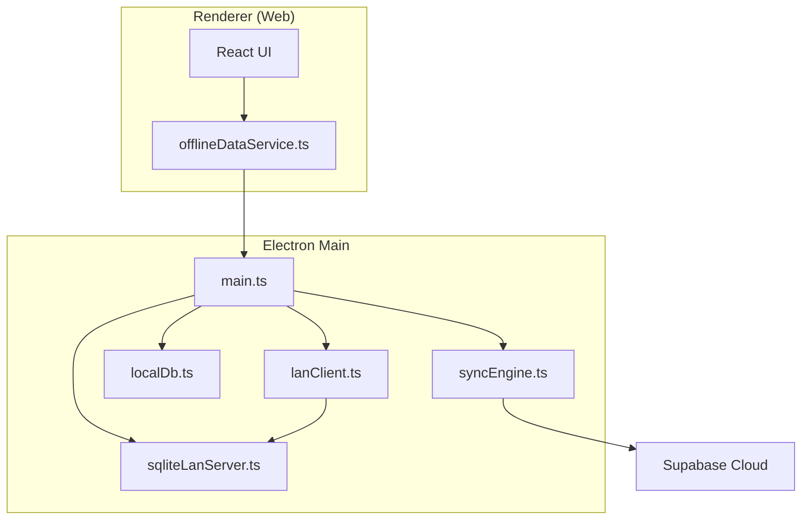
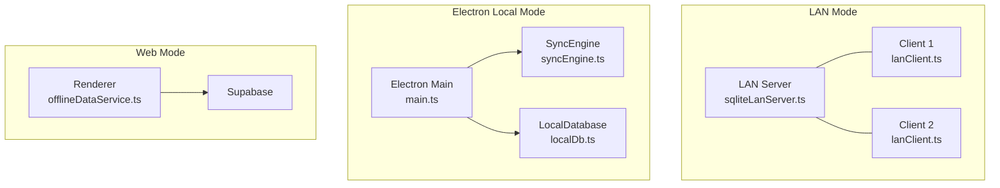
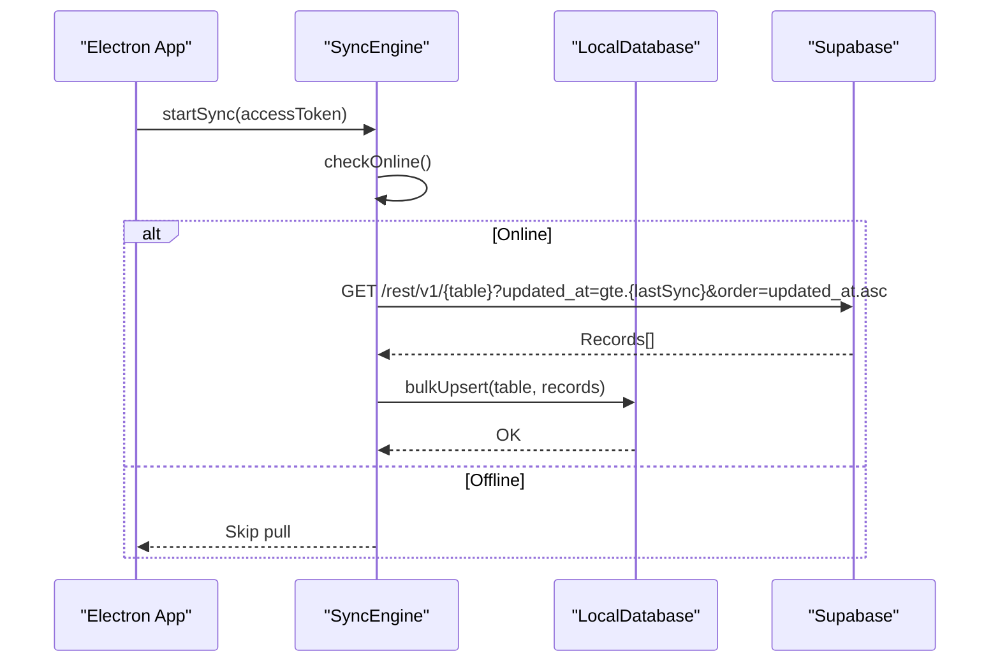
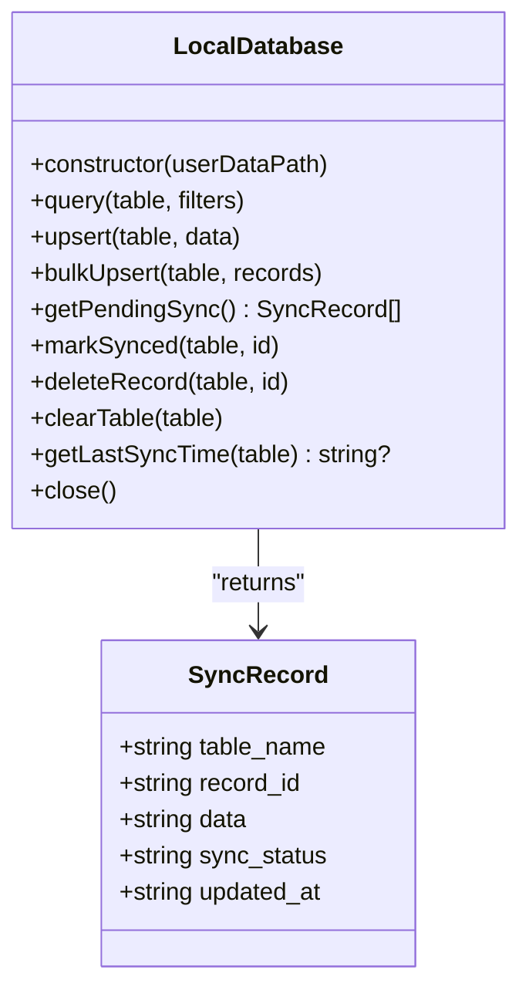
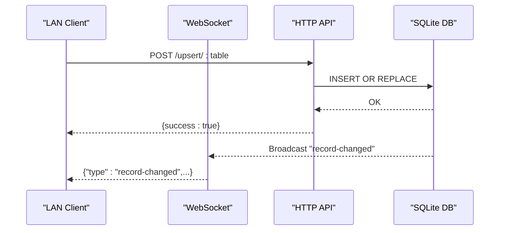
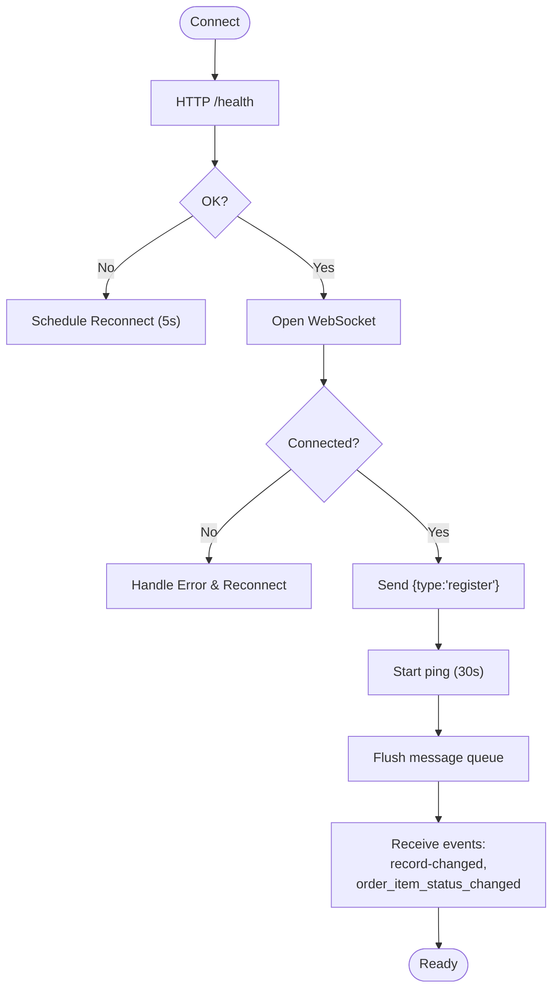
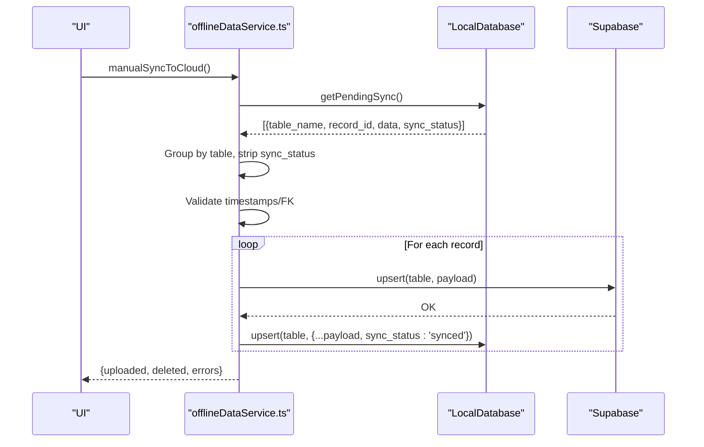
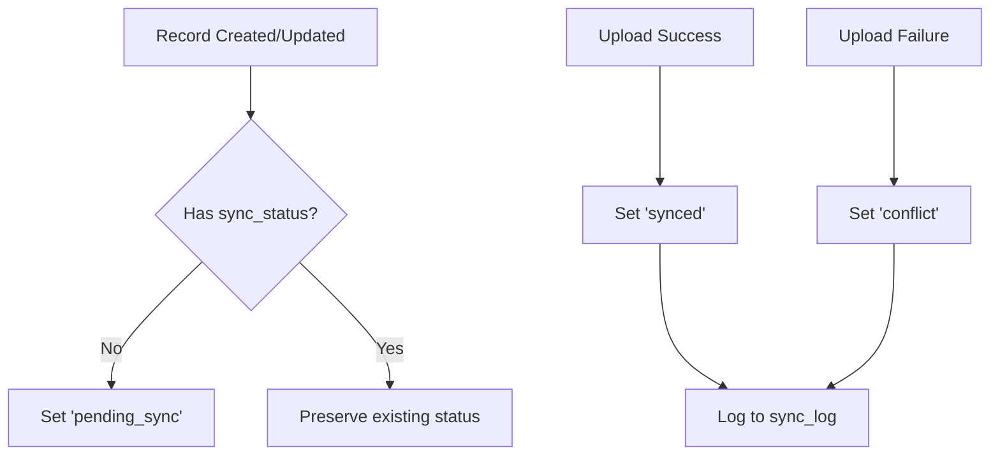
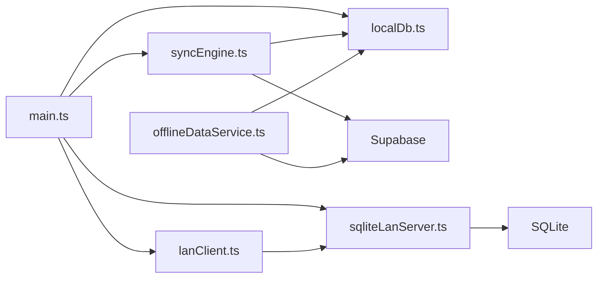

# Synchronization Mechanisms

<cite>
**Referenced Files in This Document**
- [README.md](file://README.md)
- [main.ts](file://electron/main.ts)
- [syncEngine.ts](file://electron/services/syncEngine.ts)
- [localDb.ts](file://electron/services/localDb.ts)
- [lanClient.ts](file://electron/services/lanClient.ts)
- [sqliteLanServer.ts](file://electron/services/sqliteLanServer.ts)
- [migrateLanServerSchema.ts](file://electron/services/migrateLanServerSchema.ts)
- [offlineDataService.ts](file://src/services/offlineDataService.ts)
- [DATABASE_CONNECTIVITY_MAP.md](file://DATABASE_CONNECTIVITY_MAP.md)
- [DATABASE_ARCHITECTURE_ANALYSIS.md](file://DATABASE_ARCHITECTURE_ANALYSIS.md)
</cite>

## Table of Contents
1. [Introduction](#introduction)
2. [Project Structure](#project-structure)
3. [Core Components](#core-components)
4. [Architecture Overview](#architecture-overview)
5. [Detailed Component Analysis](#detailed-component-analysis)
6. [Dependency Analysis](#dependency-analysis)
7. [Performance Considerations](#performance-considerations)
8. [Troubleshooting Guide](#troubleshooting-guide)
9. [Conclusion](#conclusion)
10. [Appendices](#appendices)

## Introduction
This document explains TableFlow Pro’s offline-first synchronization mechanisms. It covers the three operational modes (LAN mode, Electron local mode, and web mode), the role of the sync engine, the manual sync process (pending record detection, dependency ordering, conflict handling), the sync_status tracking system, upload/download flows, timestamp preservation, data transformations between SQLite and Supabase, retry/error handling, and user notifications. Practical scenarios, troubleshooting tips, and performance optimizations are included.

## Project Structure
The synchronization system spans the Electron main process (local database, sync engine, LAN server/client), the renderer process (manual sync orchestration), and the cloud (Supabase). IPC bridges the renderer and main process, enabling offline-first operations and controlled cloud sync.

**Diagram sources**
- [main.ts:177-224](file://electron/main.ts#L177-L224)
- [syncEngine.ts:15-124](file://electron/services/syncEngine.ts#L15-L124)
- [localDb.ts:164-401](file://electron/services/localDb.ts#L164-L401)
- [lanClient.ts:22-364](file://electron/services/lanClient.ts#L22-L364)
- [sqliteLanServer.ts:23-520](file://electron/services/sqliteLanServer.ts#L23-L520)
- [offlineDataService.ts:397-563](file://src/services/offlineDataService.ts#L397-L563)

**Section sources**
- [README.md:1-13](file://README.md#L1-L13)
- [main.ts:1-50](file://electron/main.ts#L1-L50)

## Core Components
- Electron main process orchestrates:
  - Local SQLite database (offline-first storage)
  - Sync engine for initial cloud pull
  - LAN server for peer-to-peer collaboration
  - LAN client for connecting to LAN server
- Renderer process:
  - Manual sync to cloud (push-only)
  - Pending sync count and status reporting
  - UI notifications and user actions

Key responsibilities:
- LocalDatabase manages schema, upserts, bulk operations, pending records, and sync logs.
- SyncEngine performs initial pull from Supabase and maintains online status.
- LAN server exposes HTTP and WebSocket endpoints for real-time collaboration.
- LAN client connects to LAN server, registers devices, and streams live changes.
- offlineDataService coordinates manual cloud sync from the renderer.

**Section sources**
- [localDb.ts:164-401](file://electron/services/localDb.ts#L164-L401)
- [syncEngine.ts:15-124](file://electron/services/syncEngine.ts#L15-L124)
- [lanClient.ts:22-364](file://electron/services/lanClient.ts#L22-L364)
- [sqliteLanServer.ts:23-520](file://electron/services/sqliteLanServer.ts#L23-L520)
- [offlineDataService.ts:397-563](file://src/services/offlineDataService.ts#L397-L563)

## Architecture Overview
TableFlow Pro supports three operational modes:

- LAN mode
  - One station runs the LAN server; others connect via LAN client.
  - Real-time updates propagate via WebSocket; HTTP endpoints handle CRUD.
- Electron local mode
  - Full offline-first with a local SQLite database and manual cloud sync.
- Web mode
  - Renderer-only mode with manual sync to Supabase.

**Diagram sources**
- [sqliteLanServer.ts:23-520](file://electron/services/sqliteLanServer.ts#L23-L520)
- [lanClient.ts:22-364](file://electron/services/lanClient.ts#L22-L364)
- [main.ts:177-224](file://electron/main.ts#L177-L224)
- [syncEngine.ts:15-124](file://electron/services/syncEngine.ts#L15-L124)
- [localDb.ts:164-401](file://electron/services/localDb.ts#L164-L401)
- [offlineDataService.ts:397-563](file://src/services/offlineDataService.ts#L397-L563)

## Detailed Component Analysis

### Sync Engine (Initial Cloud Pull)
- Role: On startup, checks connectivity and pulls all configured tables from Supabase into local SQLite.
- Behavior: No automatic periodic sync; push is manual-only.
- Online detection: HEAD request to Supabase base URL with timeout.

**Diagram sources**
- [syncEngine.ts:32-106](file://electron/services/syncEngine.ts#L32-L106)
- [localDb.ts:315-323](file://electron/services/localDb.ts#L315-L323)

**Section sources**
- [syncEngine.ts:15-124](file://electron/services/syncEngine.ts#L15-L124)

### Local Database (Offline-First Storage)
- Schema: Mirrors Supabase tables with sync tracking columns and indexes.
- Upsert semantics: Inserts or updates on conflict; preserves boolean values for SQLite compatibility.
- Pending records: Aggregates records with pending_sync or pending_delete across all tables.
- Sync log: Tracks synced events per table.

**Diagram sources**
- [localDb.ts:164-401](file://electron/services/localDb.ts#L164-L401)

**Section sources**
- [localDb.ts:15-160](file://electron/services/localDb.ts#L15-L160)
- [localDb.ts:315-386](file://electron/services/localDb.ts#L315-L386)

### LAN Server (Peer-to-Peer Collaboration)
- HTTP endpoints: health, query, upsert, delete, kitchen-orders, update-order-item-status.
- WebSocket: device registration, ping/pong, broadcast record changes and order status updates.
- Status: exposes running state, DB status, IP, port, client counts.

**Diagram sources**
- [sqliteLanServer.ts:51-189](file://electron/services/sqliteLanServer.ts#L51-L189)
- [sqliteLanServer.ts:191-229](file://electron/services/sqliteLanServer.ts#L191-L229)

**Section sources**
- [sqliteLanServer.ts:23-520](file://electron/services/sqliteLanServer.ts#L23-L520)

### LAN Client (Device Connectivity)
- Registers device via WebSocket, maintains ping, queues messages until connected.
- Emits events to renderer for record changes and order status updates.
- Provides HTTP wrappers for query/upsert/delete and kitchen-specific endpoints.

**Diagram sources**
- [lanClient.ts:65-144](file://electron/services/lanClient.ts#L65-L144)
- [lanClient.ts:146-186](file://electron/services/lanClient.ts#L146-L186)

**Section sources**
- [lanClient.ts:22-364](file://electron/services/lanClient.ts#L22-L364)

### Manual Sync to Cloud (Renderer)
- Triggered manually by the UI; pushes pending records to Supabase.
- Pending detection: Groups records by table from LocalDatabase.
- Dependency ordering: Parents before children to prevent foreign key violations.
- Conflict handling: Marks records synced after successful upsert; errors recorded.
- Timestamp preservation: Uses original updated_at from SQLite.

**Diagram sources**
- [offlineDataService.ts:397-563](file://src/services/offlineDataService.ts#L397-L563)
- [localDb.ts:328-358](file://electron/services/localDb.ts#L328-L358)

**Section sources**
- [offlineDataService.ts:397-563](file://src/services/offlineDataService.ts#L397-L563)
- [localDb.ts:328-358](file://electron/services/localDb.ts#L328-L358)

### Sync Status Tracking System
- Columns: sync_status defaults to pending_sync on insert; transitions to synced or conflict.
- Log: sync_log tracks synced events with timestamps.
- Pending detection: getPendingSync aggregates pending_sync and pending_delete across tables.

**Diagram sources**
- [localDb.ts:276-282](file://electron/services/localDb.ts#L276-L282)
- [localDb.ts:353-358](file://electron/services/localDb.ts#L353-L358)
- [localDb.ts:328-348](file://electron/services/localDb.ts#L328-L348)

**Section sources**
- [localDb.ts:7-13](file://electron/services/localDb.ts#L7-L13)
- [localDb.ts:328-358](file://electron/services/localDb.ts#L328-L358)

### Upload/Download Processes and Data Transformation
- Download (initial pull):
  - Supabase → LocalDatabase bulkUpsert (sync_status set to synced).
- Upload (manual push):
  - LocalDatabase pending records → offlineDataService groups by table → strips sync_status → validates → upsert to Supabase → marks synced in LocalDatabase.
- Timestamp preservation:
  - LocalDatabase ensures updated_at is set on upsert; offlineDataService preserves original updated_at during upload.

**Section sources**
- [syncEngine.ts:70-106](file://electron/services/syncEngine.ts#L70-L106)
- [offlineDataService.ts:444-459](file://src/services/offlineDataService.ts#L444-L459)
- [localDb.ts:276-282](file://electron/services/localDb.ts#L276-L282)

### Retry Mechanisms and Error Handling
- LAN client:
  - Reconnect timer schedules reconnection attempts.
  - Queues messages until connection established.
- Sync engine:
  - Online check with timeout; skips pull if offline.
- Renderer sync:
  - Errors collected per record; returns partial success with counts.

**Section sources**
- [lanClient.ts:178-186](file://electron/services/lanClient.ts#L178-L186)
- [syncEngine.ts:109-122](file://electron/services/syncEngine.ts#L109-L122)
- [offlineDataService.ts:523-540](file://src/services/offlineDataService.ts#L523-L540)

### User Notification Systems
- Pending sync count exposed via IPC for UI to display.
- LAN client emits events to renderer for immediate UI updates (record changes, order status changes).
- Renderer reports sync results (uploaded/deleted/errors) to the user.

**Section sources**
- [main.ts:204-212](file://electron/main.ts#L204-L212)
- [lanClient.ts:146-163](file://electron/services/lanClient.ts#L146-L163)
- [offlineDataService.ts:529-540](file://src/services/offlineDataService.ts#L529-L540)

## Dependency Analysis
- Renderer depends on offlineDataService for manual sync and pending counts.
- Electron main depends on SyncEngine and LocalDatabase for initial cloud pull and local storage.
- LAN server and client depend on each other for real-time collaboration.
- Supabase is the authoritative cloud source for initial pull and manual push.

**Diagram sources**
- [offlineDataService.ts:397-563](file://src/services/offlineDataService.ts#L397-L563)
- [syncEngine.ts:15-124](file://electron/services/syncEngine.ts#L15-L124)
- [localDb.ts:164-401](file://electron/services/localDb.ts#L164-L401)
- [sqliteLanServer.ts:23-520](file://electron/services/sqliteLanServer.ts#L23-L520)
- [lanClient.ts:22-364](file://electron/services/lanClient.ts#L22-L364)
- [main.ts:177-224](file://electron/main.ts#L177-L224)

**Section sources**
- [main.ts:177-224](file://electron/main.ts#L177-L224)
- [offlineDataService.ts:397-563](file://src/services/offlineDataService.ts#L397-L563)

## Performance Considerations
- Use bulk operations:
  - LocalDatabase bulkUpsert for initial cloud pull.
  - Consider adding batch endpoints to LAN server to reduce HTTP overhead.
- Indexes and foreign keys:
  - LocalDatabase has indexes; LAN server needs indexes and FK enforcement for performance and integrity.
- Network efficiency:
  - LAN client queues messages until connected; minimize reconnection churn.
- Transaction boundaries:
  - Group related upserts in transactions to reduce write amplification.

[No sources needed since this section provides general guidance]

## Troubleshooting Guide
Common issues and resolutions:
- No internet connection during manual sync:
  - Ensure connectivity; offlineDataService returns an error list with counts.
- LAN server fails to start:
  - Check port availability and server status; review error messages from LAN server status.
- Orphaned records in LAN server:
  - Apply schema migration to add FK constraints and missing indexes.
- Conflicts during sync:
  - Review sync_status transitions; records marked as conflict require manual intervention.
- Pending sync count shows zero:
  - Verify sync_status values and that records were inserted/updated with proper timestamps.

**Section sources**
- [offlineDataService.ts:412-414](file://src/services/offlineDataService.ts#L412-L414)
- [sqliteLanServer.ts:458-467](file://electron/services/sqliteLanServer.ts#L458-L467)
- [migrateLanServerSchema.ts:10-49](file://electron/services/migrateLanServerSchema.ts#L10-L49)
- [localDb.ts:353-358](file://electron/services/localDb.ts#L353-L358)

## Conclusion
TableFlow Pro’s offline-first architecture combines a robust local SQLite store, a flexible LAN collaboration layer, and a manual cloud sync pipeline. The sync engine performs an initial pull, while the renderer triggers controlled uploads to Supabase. The sync_status tracking system, dependency-aware ordering, and timestamp preservation ensure data consistency across platforms. LAN mode enables real-time collaboration, while Electron local and web modes support offline-first workflows with explicit user-driven synchronization.

[No sources needed since this section summarizes without analyzing specific files]

## Appendices

### Operational Modes Reference
- LAN mode
  - Server: sqliteLanServer
  - Client: lanClient
  - Collaboration: WebSocket + HTTP endpoints
- Electron local mode
  - LocalDatabase + SyncEngine + IPC handlers
- Web mode
  - offlineDataService + Supabase

**Section sources**
- [sqliteLanServer.ts:23-520](file://electron/services/sqliteLanServer.ts#L23-L520)
- [lanClient.ts:22-364](file://electron/services/lanClient.ts#L22-L364)
- [offlineDataService.ts:397-563](file://src/services/offlineDataService.ts#L397-L563)

### Practical Sync Scenarios
- Scenario A: Initial setup
  - SyncEngine pulls all tables from Supabase into LocalDatabase.
- Scenario B: LAN collaboration
  - Clients connect to LAN server; changes broadcast via WebSocket; HTTP endpoints handle CRUD.
- Scenario C: Manual cloud sync
  - User initiates sync; offlineDataService groups pending records, validates, uploads, and marks synced.

**Section sources**
- [syncEngine.ts:70-106](file://electron/services/syncEngine.ts#L70-L106)
- [sqliteLanServer.ts:51-189](file://electron/services/sqliteLanServer.ts#L51-L189)
- [offlineDataService.ts:397-563](file://src/services/offlineDataService.ts#L397-L563)