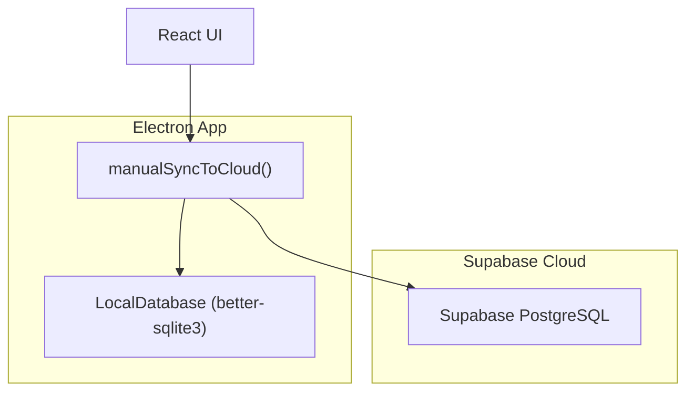
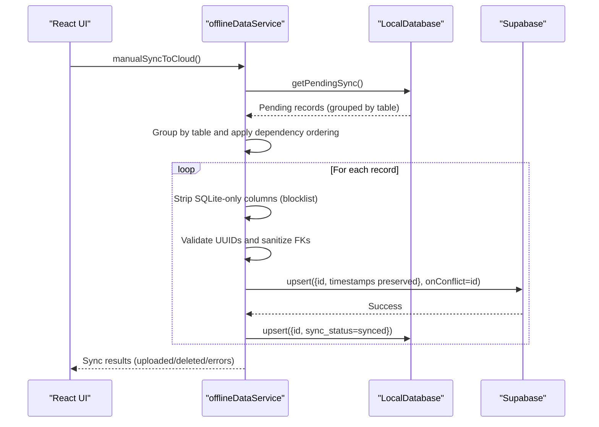
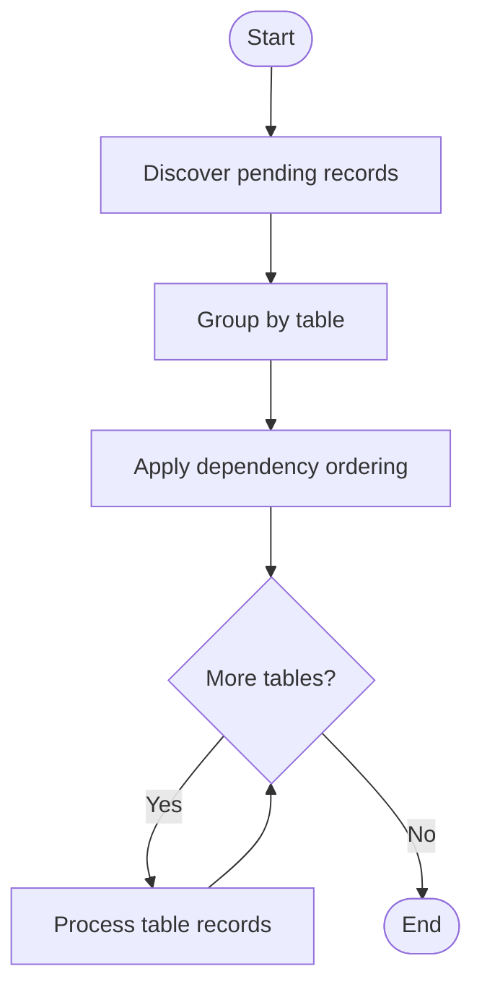
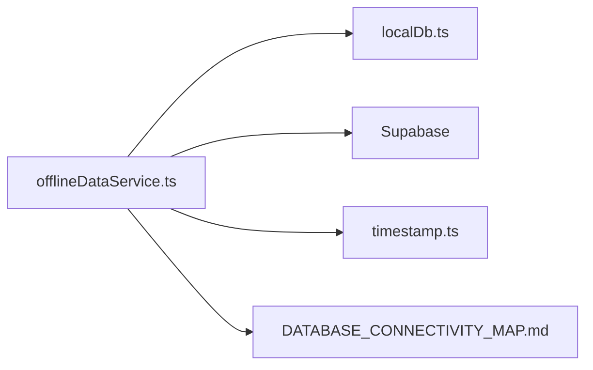

# Upload Process & Conflict Resolution

<cite>
**Referenced Files in This Document**
- [offlineDataService.ts](file://src/services/offlineDataService.ts)
- [localDb.ts](file://electron/services/localDb.ts)
- [timestamp.ts](file://src/utils/timestamp.ts)
- [DATABASE_CONNECTIVITY_MAP.md](file://DATABASE_CONNECTIVITY_MAP.md)
</cite>

## Table of Contents
1. [Introduction](#introduction)
2. [Project Structure](#project-structure)
3. [Core Components](#core-components)
4. [Architecture Overview](#architecture-overview)
5. [Detailed Component Analysis](#detailed-component-analysis)
6. [Dependency Analysis](#dependency-analysis)
7. [Performance Considerations](#performance-considerations)
8. [Troubleshooting Guide](#troubleshooting-guide)
9. [Conclusion](#conclusion)

## Introduction
This document explains the upload process and conflict resolution mechanisms used to synchronize local SQLite data to Supabase. It covers how pending records are identified and processed during manual sync operations, the dependency ordering system that ensures parent records are synchronized before child records to maintain referential integrity, and the strategies used to handle concurrent modifications, preserve timestamps, and validate data. It also documents the blocklist filtering system for removing SQLite-only columns during upload, foreign key constraint handling, invalid UUID validation, and data sanitization processes. Finally, it provides examples of common sync conflicts and their resolution strategies.

## Project Structure
The upload and sync logic spans several modules:
- Electron-local SQLite database wrapper and sync orchestration
- Offline-first data service that coordinates local writes, pending sync detection, and cloud uploads
- Utility functions for timestamp normalization and validation
- Architectural documentation that outlines the intended schema alignment and sync flow

**Diagram sources**
- [offlineDataService.ts:397-541](file://src/services/offlineDataService.ts#L397-L541)
- [localDb.ts:328-348](file://electron/services/localDb.ts#L328-L348)

**Section sources**
- [offlineDataService.ts:397-541](file://src/services/offlineDataService.ts#L397-L541)
- [localDb.ts:328-348](file://electron/services/localDb.ts#L328-L348)

## Core Components
- LocalDatabase: Provides SQLite-backed storage with foreign key enforcement, indexing, and pending sync detection. It exposes methods to upsert records, query pending changes, and mark records as synced.
- offlineDataService: Implements the manual sync workflow, including pending record discovery, dependency ordering, blocklist filtering, UUID validation, foreign key sanitization, and Supabase upsert with timestamp preservation.
- Timestamp utilities: Normalize timestamps across SQLite, Supabase, and JavaScript Date objects to ensure consistent ordering and conflict detection.
- DATABASE_CONNECTIVITY_MAP.md: Documents the intended schema alignment and sync flow between local, LAN, and cloud databases.

**Section sources**
- [localDb.ts:164-401](file://electron/services/localDb.ts#L164-L401)
- [offlineDataService.ts:374-541](file://src/services/offlineDataService.ts#L374-L541)
- [timestamp.ts:1-116](file://src/utils/timestamp.ts#L1-L116)
- [DATABASE_CONNECTIVITY_MAP.md:229-252](file://DATABASE_CONNECTIVITY_MAP.md#L229-L252)

## Architecture Overview
The manual sync process follows a deterministic pipeline:
- Discover pending records grouped by table
- Apply dependency ordering to process parents before children
- Sanitize each record: strip SQLite-only columns, validate UUIDs, nullify invalid foreign keys
- Upload to Supabase using upsert with onConflict=id
- Preserve original timestamps from SQLite
- Mark records as synced locally

**Diagram sources**
- [offlineDataService.ts:418-541](file://src/services/offlineDataService.ts#L418-L541)
- [localDb.ts:328-348](file://electron/services/localDb.ts#L328-L348)

## Detailed Component Analysis

### Pending Records Discovery and Processing
- Pending records are discovered by scanning all tables for rows with sync_status equal to pending_sync or pending_delete.
- The discovery returns structured records containing table_name, record_id, serialized data, sync_status, and updated_at.
- Pending records are grouped by table and then processed in dependency order to avoid foreign key violations.

Key behaviors:
- Grouping by table allows batch-like processing per table.
- Dependency ordering ensures parents are processed before children.

**Section sources**
- [localDb.ts:328-348](file://electron/services/localDb.ts#L328-L348)
- [offlineDataService.ts:418-449](file://src/services/offlineDataService.ts#L418-L449)

### Dependency Ordering System
The system enforces a strict dependency order to maintain referential integrity:
- Parent tables are processed before child tables.
- The explicit order is: restaurants, kitchens, floors, tables, menu_categories, menu_items, staff_members, orders, order_items.

Processing steps:
- Build ordered list by filtering known tables from the discovered pending records.
- Iterate through tables in order and then process remaining tables not in the predefined list.

**Diagram sources**
- [offlineDataService.ts:444-449](file://src/services/offlineDataService.ts#L444-L449)

**Section sources**
- [offlineDataService.ts:444-449](file://src/services/offlineDataService.ts#L444-L449)

### Blocklist Filtering System
SQLite stores additional columns not present in Supabase (e.g., sync_status, updated_at). During upload, these columns are stripped before sending to Supabase.

Blocklist configuration:
- orders: customer_gstin, customer_name, customer_phone, sync_status
- order_items: sync_status
- floors: updated_at, sync_status
- tables: updated_at, sync_status
- kitchens: sync_status
- menu_categories: sync_status
- menu_items: sync_status
- staff_members: sync_status
- restaurants: sync_status

Processing:
- For each record, construct a cleanData copy and delete each blocked column.

**Section sources**
- [offlineDataService.ts:374-387](file://src/services/offlineDataService.ts#L374-L387)
- [offlineDataService.ts:466-471](file://src/services/offlineDataService.ts#L466-L471)

### Foreign Key Constraint Handling and Invalid UUID Validation
Foreign keys are validated and sanitized to prevent constraint violations:
- Invalid UUID values in foreign key columns are detected and nullified.
- Certain records require a valid UUID for a specific foreign key; if invalid, the entire record is skipped.

Specific rules:
- orders.table_id: nullable; invalid values are nullified.
- order_items.menu_item_id, order_items.kitchen_id: nullable; invalid values are nullified.
- order_items.order_id: NOT nullable; if invalid, the record is skipped.
- tables.floor_id: nullable; invalid values are nullified.

Validation:
- A UUID regex is used to validate identifiers.

**Section sources**
- [offlineDataService.ts:473-493](file://src/services/offlineDataService.ts#L473-L493)
- [offlineDataService.ts:389-390](file://src/services/offlineDataService.ts#L389-L390)

### Timestamp Preservation and Data Sanitization
Timestamps are preserved from SQLite to ensure consistent ordering and conflict detection:
- During upload, created_at and updated_at are explicitly sent to Supabase to override any server-side defaults.
- Timestamp normalization utilities ensure consistent ISO 8601 formatting across SQLite, Supabase, and JavaScript Date objects.

Sanitization:
- Boolean values are converted to integers for SQLite compatibility.
- SQLite-only columns are stripped before upload.
- Invalid foreign keys are nullified or records are skipped.

**Section sources**
- [offlineDataService.ts:505-521](file://src/services/offlineDataService.ts#L505-L521)
- [localDb.ts:295-302](file://electron/services/localDb.ts#L295-L302)
- [timestamp.ts:11-47](file://src/utils/timestamp.ts#L11-L47)

### Manual Sync Workflow
The manual sync function orchestrates the entire upload process:
- Validates environment (Electron mode, SQLite availability, network connectivity).
- Retrieves pending records and groups them by table.
- Applies dependency ordering and per-record sanitization.
- Performs Supabase upsert with onConflict=id.
- Updates local sync_status to synced upon successful upload.
- Tracks counts of uploaded and deleted records and collects errors.

Results:
- Returns success flag, counts of uploaded and deleted records, and a list of errors encountered.

**Section sources**
- [offlineDataService.ts:397-541](file://src/services/offlineDataService.ts#L397-L541)

### Conflict Resolution Strategies
The system uses a deterministic approach to resolve conflicts:
- Supabase upsert uses onConflict=id, preserving existing server-side data while allowing updates.
- Timestamps are preserved from SQLite to maintain chronological ordering.
- Dependency ordering prevents child records from referencing non-existent parents.
- Invalid UUIDs and foreign keys are sanitized or records are skipped to avoid constraint violations.

Common scenarios:
- Concurrent modification: Supabase upsert preserves existing data; local changes overwrite on conflict.
- Missing parent records: Dependency ordering ensures parents are uploaded first.
- Invalid foreign keys: Invalid values are nullified or records are skipped.

**Section sources**
- [offlineDataService.ts:507-521](file://src/services/offlineDataService.ts#L507-L521)
- [offlineDataService.ts:473-493](file://src/services/offlineDataService.ts#L473-L493)

## Dependency Analysis
The upload process depends on:
- LocalDatabase for pending record discovery and local sync status updates
- Supabase client for cloud upsert operations
- Timestamp utilities for consistent timestamp handling
- DATABASE_CONNECTIVITY_MAP.md for intended schema alignment and sync flow

**Diagram sources**
- [offlineDataService.ts:397-541](file://src/services/offlineDataService.ts#L397-L541)
- [localDb.ts:328-348](file://electron/services/localDb.ts#L328-L348)
- [timestamp.ts:11-47](file://src/utils/timestamp.ts#L11-L47)
- [DATABASE_CONNECTIVITY_MAP.md:229-252](file://DATABASE_CONNECTIVITY_MAP.md#L229-L252)

**Section sources**
- [offlineDataService.ts:397-541](file://src/services/offlineDataService.ts#L397-L541)
- [localDb.ts:328-348](file://electron/services/localDb.ts#L328-L348)
- [timestamp.ts:11-47](file://src/utils/timestamp.ts#L11-L47)
- [DATABASE_CONNECTIVITY_MAP.md:229-252](file://DATABASE_CONNECTIVITY_MAP.md#L229-L252)

## Performance Considerations
- Dependency ordering reduces retries and constraint violations, minimizing failed upsert attempts.
- SQLite foreign key enforcement and indexes improve local query performance and data integrity.
- Timestamp normalization ensures consistent ordering across systems, reducing ambiguity in conflict resolution.
- Batch-like processing per table improves throughput compared to row-by-row operations.

[No sources needed since this section provides general guidance]

## Troubleshooting Guide
Common issues and resolutions:
- No internet connection: manualSyncToCloud returns early with an error list; ensure connectivity before retrying.
- SQLite not available: manualSyncToCloud returns early; verify Electron mode and database initialization.
- Invalid UUIDs: Records with invalid IDs are skipped; ensure IDs are valid UUIDs before attempting sync.
- Invalid foreign keys: Invalid FK values are nullified; if a record requires a valid FK (e.g., order_items.order_id), the record is skipped.
- Supabase upsert errors: Errors are collected and returned; review error messages for specific failures (e.g., schema mismatches, constraint violations).
- Pending records not found: If getPendingSync returns no data, confirm that records were written with sync_status set to pending_sync.

Operational tips:
- Use debugDumpSQLiteData to inspect local database contents.
- Verify dependency ordering by checking the order of tables processed.
- Confirm blocklist filtering by reviewing SUPABASE_COLUMN_BLOCKLIST for the affected table.

**Section sources**
- [offlineDataService.ts:403-414](file://src/services/offlineDataService.ts#L403-L414)
- [offlineDataService.ts:460-464](file://src/services/offlineDataService.ts#L460-L464)
- [offlineDataService.ts:481-486](file://src/services/offlineDataService.ts#L481-L486)
- [offlineDataService.ts:515-517](file://src/services/offlineDataService.ts#L515-L517)
- [offlineDataService.ts:739-765](file://src/services/offlineDataService.ts#L739-L765)

## Conclusion
The upload process and conflict resolution system ensures reliable synchronization between local SQLite and Supabase. By enforcing dependency ordering, sanitizing data, preserving timestamps, and applying a deterministic upsert strategy, the system maintains referential integrity and handles concurrent modifications gracefully. The blocklist filtering and foreign key validation prevent schema mismatches and constraint violations, while the manual sync workflow provides visibility into the process and outcomes.