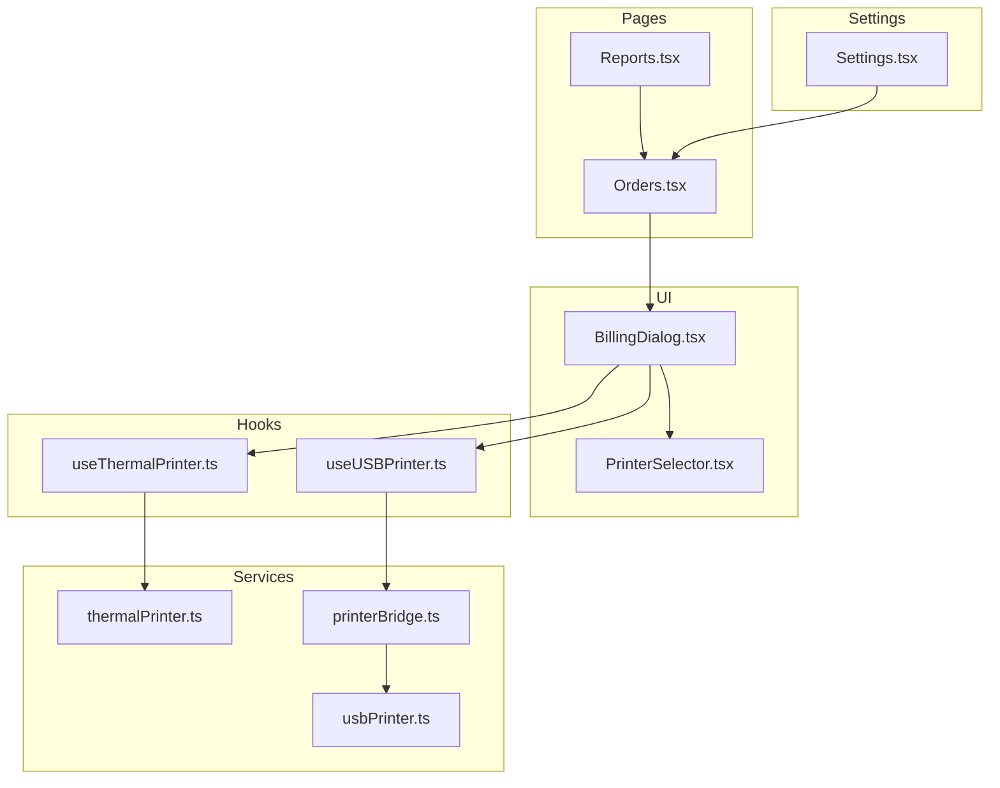
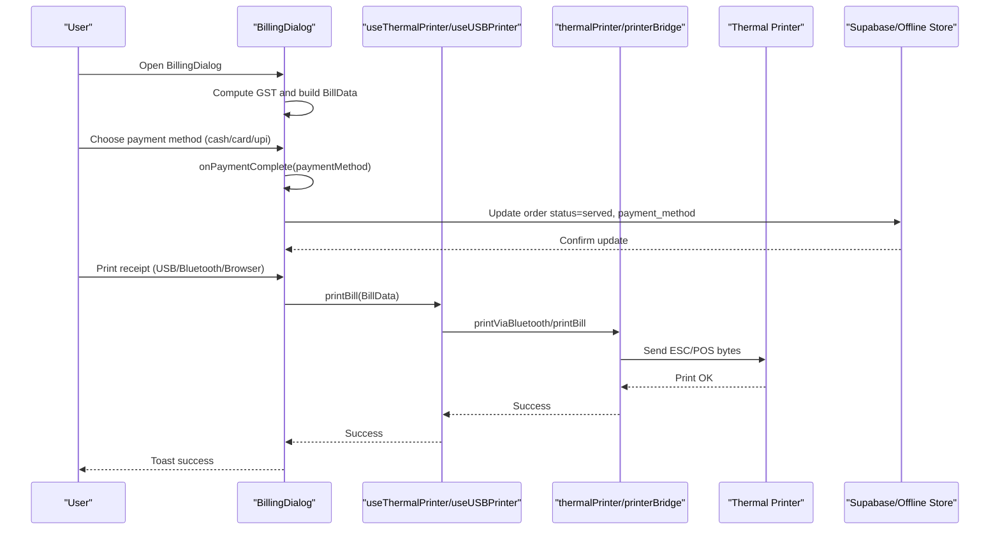
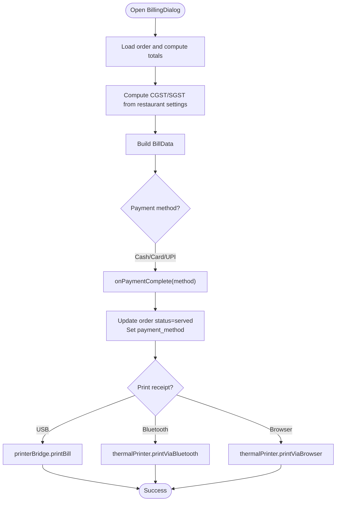
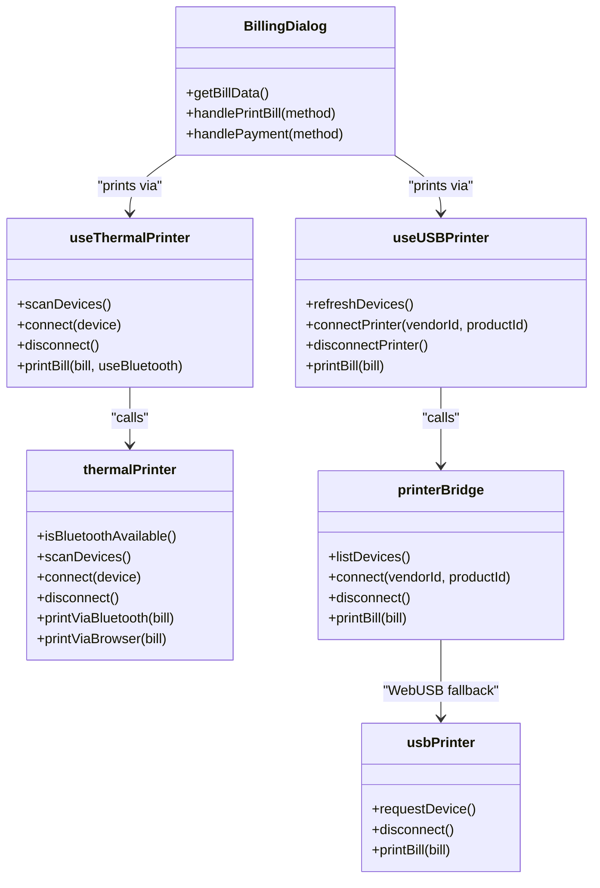
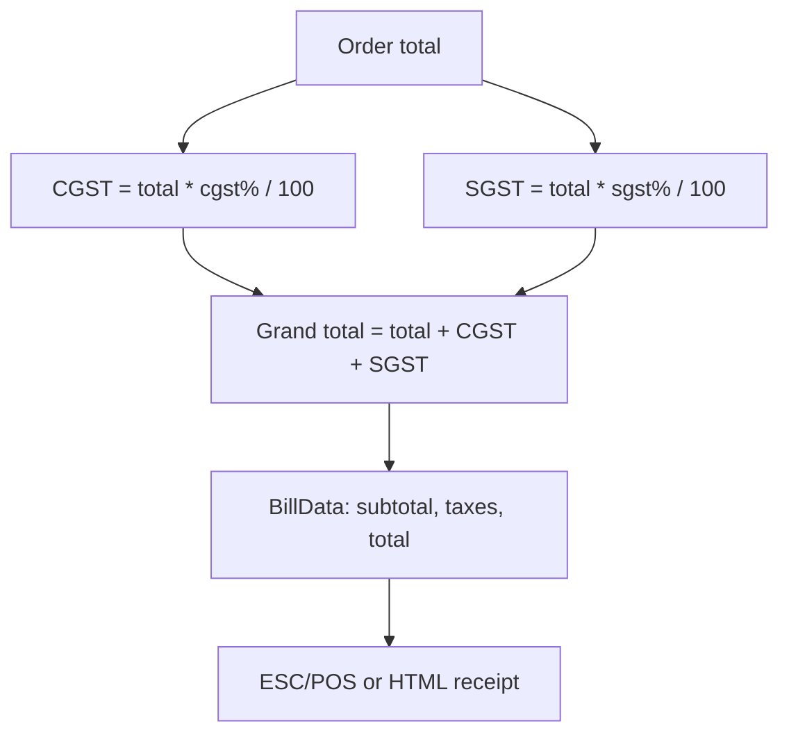
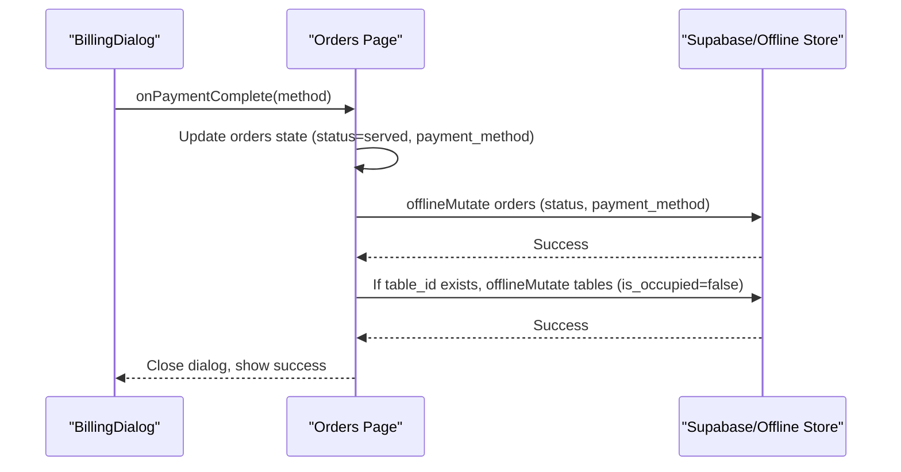
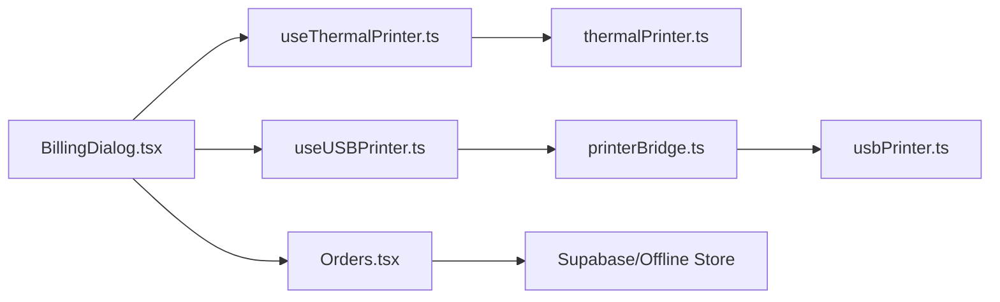

# Billing & Payment Processing

<cite>
**Referenced Files in This Document**
- [BillingDialog.tsx](file://src/components/BillingDialog.tsx)
- [PrinterSelector.tsx](file://src/components/PrinterSelector.tsx)
- [useThermalPrinter.ts](file://src/hooks/useThermalPrinter.ts)
- [useUSBPrinter.ts](file://src/hooks/useUSBPrinter.ts)
- [thermalPrinter.ts](file://src/services/thermalPrinter.ts)
- [printerBridge.ts](file://src/services/printerBridge.ts)
- [usbPrinter.ts](file://src/services/usbPrinter.ts)
- [Orders.tsx](file://src/pages/dashboard/Orders.tsx)
- [Reports.tsx](file://src/pages/dashboard/Reports.tsx)
- [Settings.tsx](file://src/pages/dashboard/Settings.tsx)
- [20260108133558_b2ed5e93-fda3-4022-bc45-a2fe64b46615.sql](file://supabase/migrations/20260108133558_b2ed5e93-fda3-4022-bc45-a2fe64b46615.sql)
- [20260410120000_add_gst_percentages.sql](file://supabase/migrations/20260410120000_add_gst_percentages.sql)
</cite>

## Table of Contents
1. [Introduction](#introduction)
2. [Project Structure](#project-structure)
3. [Core Components](#core-components)
4. [Architecture Overview](#architecture-overview)
5. [Detailed Component Analysis](#detailed-component-analysis)
6. [Dependency Analysis](#dependency-analysis)
7. [Performance Considerations](#performance-considerations)
8. [Troubleshooting Guide](#troubleshooting-guide)
9. [Conclusion](#conclusion)

## Introduction
This document explains the billing and payment processing system, covering bill generation, payment method handling (cash, card, UPI), receipt printing, and table release automation. It documents the integration with thermal printers (USB, Bluetooth, browser fallback), printer selection and management, GST calculation and formatting, and the billing dialog interface. It also outlines payment completion workflows, order status updates, and error handling.

## Project Structure
The billing system spans UI components, hooks, and services:
- UI: BillingDialog for bill preview, payment selection, and printing controls
- Hooks: useThermalPrinter for Bluetooth and browser printing; useUSBPrinter for Electron/WebUSB printing
- Services: thermalPrinter for native Bluetooth printing; printerBridge for unified USB printing; usbPrinter for WebUSB printing
- Pages: Orders and Reports orchestrate payment completion and order/table state changes
- Settings: configure restaurant GST and QR printing preferences
- Database: migrations add payment_method and GST percentage fields

**Diagram sources**
- [BillingDialog.tsx:62-569](file://src/components/BillingDialog.tsx#L62-L569)
- [PrinterSelector.tsx:16-169](file://src/components/PrinterSelector.tsx#L16-L169)
- [useThermalPrinter.ts:4-69](file://src/hooks/useThermalPrinter.ts#L4-L69)
- [useUSBPrinter.ts:19-112](file://src/hooks/useUSBPrinter.ts#L19-L112)
- [thermalPrinter.ts:33-339](file://src/services/thermalPrinter.ts#L33-L339)
- [printerBridge.ts:197-289](file://src/services/printerBridge.ts#L197-L289)
- [usbPrinter.ts:71-317](file://src/services/usbPrinter.ts#L71-L317)
- [Orders.tsx:490-531](file://src/pages/dashboard/Orders.tsx#L490-L531)
- [Reports.tsx:2094-2127](file://src/pages/dashboard/Reports.tsx#L2094-L2127)
- [Settings.tsx:228-266](file://src/pages/dashboard/Settings.tsx#L228-L266)

**Section sources**
- [BillingDialog.tsx:62-569](file://src/components/BillingDialog.tsx#L62-L569)
- [useThermalPrinter.ts:4-69](file://src/hooks/useThermalPrinter.ts#L4-L69)
- [useUSBPrinter.ts:19-112](file://src/hooks/useUSBPrinter.ts#L19-L112)
- [thermalPrinter.ts:33-339](file://src/services/thermalPrinter.ts#L33-L339)
- [printerBridge.ts:197-289](file://src/services/printerBridge.ts#L197-L289)
- [usbPrinter.ts:71-317](file://src/services/usbPrinter.ts#L71-L317)
- [Orders.tsx:490-531](file://src/pages/dashboard/Orders.tsx#L490-L531)
- [Reports.tsx:2094-2127](file://src/pages/dashboard/Reports.tsx#L2094-L2127)
- [Settings.tsx:228-266](file://src/pages/dashboard/Settings.tsx#L228-L266)

## Core Components
- BillingDialog: Presents order summary, GST breakdown, optional customer details, print options (USB, Bluetooth, browser), and payment method buttons (cash, card, UPI). It generates BillData, triggers printing, and invokes onPaymentComplete to finalize payment and update order state.
- useThermalPrinter: Manages Bluetooth availability, scanning, connecting/disconnecting, and printing via thermalPrinter. Provides printBill with automatic Bluetooth/browser fallback.
- useUSBPrinter: Manages Electron/WebUSB printer lifecycle, device listing, connection, disconnection, and printing via printerBridge.
- thermalPrinter: Native Bluetooth printing service for mobile; builds ESC/POS receipts and handles QR codes.
- printerBridge: Unified USB printing abstraction across Electron and WebUSB; builds ESC/POS receipts and manages QR codes.
- usbPrinter: WebUSB implementation for ESC/POS printers; connects via navigator.usb and streams receipt data.
- Orders/Reports: Orchestrate payment completion by updating order status to served, recording payment_method, and releasing tables.

**Section sources**
- [BillingDialog.tsx:98-148](file://src/components/BillingDialog.tsx#L98-L148)
- [useThermalPrinter.ts:43-54](file://src/hooks/useThermalPrinter.ts#L43-L54)
- [useUSBPrinter.ts:72-98](file://src/hooks/useUSBPrinter.ts#L72-L98)
- [thermalPrinter.ts:118-219](file://src/services/thermalPrinter.ts#L118-L219)
- [printerBridge.ts:94-184](file://src/services/printerBridge.ts#L94-L184)
- [usbPrinter.ts:206-293](file://src/services/usbPrinter.ts#L206-L293)
- [Orders.tsx:496-530](file://src/pages/dashboard/Orders.tsx#L496-L530)

## Architecture Overview
The billing workflow integrates UI, hooks, and services to produce a formatted bill and finalize payment.

**Diagram sources**
- [BillingDialog.tsx:255-269](file://src/components/BillingDialog.tsx#L255-L269)
- [useThermalPrinter.ts:43-54](file://src/hooks/useThermalPrinter.ts#L43-L54)
- [useUSBPrinter.ts:91-98](file://src/hooks/useUSBPrinter.ts#L91-L98)
- [thermalPrinter.ts:118-219](file://src/services/thermalPrinter.ts#L118-L219)
- [printerBridge.ts:242-253](file://src/services/printerBridge.ts#L242-L253)
- [Orders.tsx:496-530](file://src/pages/dashboard/Orders.tsx#L496-L530)

## Detailed Component Analysis

### BillingDialog: Bill Generation, Payment, and Printing
- Bill generation:
  - Computes CGST and SGST amounts from restaurant percentages and order total.
  - Constructs BillData with restaurant/customer details, items, subtotal, tax fields, and total.
- Payment processing:
  - Triggers onPaymentComplete with selected method (cash/card/upi).
  - Resets customer details after successful payment.
- Printing:
  - USB: Uses printerBridge.printBill when a printer is connected.
  - Bluetooth: Uses thermalPrinter.printViaBluetooth when connected.
  - Browser: Uses thermalPrinter.printViaBrowser as fallback.
- Printer device management:
  - Electron: Lists and switches Windows printers; auto-switches matching VID/PID.
  - Mobile: Opens PrinterSelector for Bluetooth discovery and connection.
  - WebUSB: Requests device and prints via usbPrinter.

**Diagram sources**
- [BillingDialog.tsx:98-148](file://src/components/BillingDialog.tsx#L98-L148)
- [Orders.tsx:496-530](file://src/pages/dashboard/Orders.tsx#L496-L530)
- [thermalPrinter.ts:118-219](file://src/services/thermalPrinter.ts#L118-L219)
- [printerBridge.ts:242-253](file://src/services/printerBridge.ts#L242-L253)

**Section sources**
- [BillingDialog.tsx:98-148](file://src/components/BillingDialog.tsx#L98-L148)
- [BillingDialog.tsx:150-201](file://src/components/BillingDialog.tsx#L150-L201)
- [BillingDialog.tsx:203-245](file://src/components/BillingDialog.tsx#L203-L245)
- [BillingDialog.tsx:255-269](file://src/components/BillingDialog.tsx#L255-L269)
- [Orders.tsx:496-530](file://src/pages/dashboard/Orders.tsx#L496-L530)

### Printer Integration: USB, Bluetooth, Browser
- USB (Electron):
  - useUSBPrinter lists devices, connects via printerBridge, persists last printer, and prints receipts.
  - BillingDialog supports selecting a device, switching Windows printers, and printing.
- USB (Web):
  - usbPrinter uses navigator.usb to request and connect to ESC/POS printers; streams receipt data.
- Bluetooth:
  - useThermalPrinter exposes scan/connect/disconnect and print via thermalPrinter.
  - PrinterSelector discovers and connects to nearby thermal printers on mobile.
- Browser fallback:
  - thermalPrinter.printViaBrowser renders HTML receipt and triggers browser print dialog.

**Diagram sources**
- [BillingDialog.tsx:82-84](file://src/components/BillingDialog.tsx#L82-L84)
- [useThermalPrinter.ts:17-54](file://src/hooks/useThermalPrinter.ts#L17-L54)
- [useUSBPrinter.ts:63-98](file://src/hooks/useUSBPrinter.ts#L63-L98)
- [thermalPrinter.ts:37-116](file://src/services/thermalPrinter.ts#L37-L116)
- [printerBridge.ts:197-258](file://src/services/printerBridge.ts#L197-L258)
- [usbPrinter.ts:89-124](file://src/services/usbPrinter.ts#L89-L124)

**Section sources**
- [useUSBPrinter.ts:63-98](file://src/hooks/useUSBPrinter.ts#L63-L98)
- [printerBridge.ts:205-253](file://src/services/printerBridge.ts#L205-L253)
- [usbPrinter.ts:89-124](file://src/services/usbPrinter.ts#L89-L124)
- [useThermalPrinter.ts:17-54](file://src/hooks/useThermalPrinter.ts#L17-L54)
- [thermalPrinter.ts:118-219](file://src/services/thermalPrinter.ts#L118-L219)
- [PrinterSelector.tsx:16-169](file://src/components/PrinterSelector.tsx#L16-L169)

### GST Calculation and Bill Formatting
- GST computation:
  - BillingDialog computes CGST and SGST amounts from restaurant CGST/SGST percentages and order total.
  - BillData includes subtotal, cgstPercentage/cgstAmount, sgstPercentage/sgstAmount, and total.
- Bill formatting:
  - ESC/POS receipt builder includes restaurant/customer details, itemized list, taxes, and QR code (optional).
  - Browser fallback uses styled HTML with Courier font and dashed dividers.

**Diagram sources**
- [BillingDialog.tsx:101-127](file://src/components/BillingDialog.tsx#L101-L127)
- [thermalPrinter.ts:134-214](file://src/services/thermalPrinter.ts#L134-L214)
- [printerBridge.ts:94-184](file://src/services/printerBridge.ts#L94-L184)

**Section sources**
- [BillingDialog.tsx:101-127](file://src/components/BillingDialog.tsx#L101-L127)
- [thermalPrinter.ts:134-214](file://src/services/thermalPrinter.ts#L134-L214)
- [printerBridge.ts:94-184](file://src/services/printerBridge.ts#L94-L184)

### Payment Completion and Table Release Automation
- Payment completion:
  - onPaymentComplete updates order status to served and sets payment_method.
  - Updates are persisted via offlineMutate and Supabase.
- Table release:
  - After payment, the associated table is released (is_occupied=false) if applicable.

**Diagram sources**
- [Orders.tsx:496-530](file://src/pages/dashboard/Orders.tsx#L496-L530)
- [Reports.tsx:2098-2127](file://src/pages/dashboard/Reports.tsx#L2098-L2127)

**Section sources**
- [Orders.tsx:496-530](file://src/pages/dashboard/Orders.tsx#L496-L530)
- [Reports.tsx:2098-2127](file://src/pages/dashboard/Reports.tsx#L2098-L2127)

### Printer Device Management
- Bluetooth:
  - useThermalPrinter scans and connects to nearby printers; PrinterSelector displays discovered devices and handles connection.
- USB (Electron):
  - useUSBPrinter lists devices, connects via printerBridge, saves last printer, and prints receipts.
  - BillingDialog supports device selection and Windows printer switching.
- USB (Web):
  - usbPrinter requests device via navigator.usb and prints via bulk transfer.

**Section sources**
- [useThermalPrinter.ts:17-54](file://src/hooks/useThermalPrinter.ts#L17-L54)
- [PrinterSelector.tsx:16-169](file://src/components/PrinterSelector.tsx#L16-L169)
- [useUSBPrinter.ts:63-98](file://src/hooks/useUSBPrinter.ts#L63-L98)
- [usbPrinter.ts:89-124](file://src/services/usbPrinter.ts#L89-L124)

### Payment Scenarios and Error Handling
- Scenarios:
  - Full payment via cash/card/upi completes the order and releases the table.
  - Partial payments are not modeled in the current code; only full payment finalizes the order.
  - Refund processing is not implemented in the current codebase.
- Error handling:
  - Toast notifications surface errors for printer failures, connection issues, and payment errors.
  - BillingDialog resets customer details on close; PrinterSelector displays availability messages and error toasts.

**Section sources**
- [BillingDialog.tsx:131-148](file://src/components/BillingDialog.tsx#L131-L148)
- [BillingDialog.tsx:255-269](file://src/components/BillingDialog.tsx#L255-L269)
- [PrinterSelector.tsx:60-77](file://src/components/PrinterSelector.tsx#L60-L77)

## Dependency Analysis
The billing system composes UI, hooks, and services with clear boundaries:
- BillingDialog depends on useThermalPrinter/useUSBPrinter for printing and on Orders/Reports for payment completion.
- useThermalPrinter depends on thermalPrinter for native Bluetooth printing.
- useUSBPrinter depends on printerBridge, which abstracts Electron vs WebUSB implementations.
- printerBridge depends on usbPrinter for WebUSB fallback and constructs ESC/POS receipts.
- Orders/Reports depend on Supabase/Offline Store for persistence and table state updates.

**Diagram sources**
- [BillingDialog.tsx:82-84](file://src/components/BillingDialog.tsx#L82-L84)
- [useThermalPrinter.ts:4-69](file://src/hooks/useThermalPrinter.ts#L4-L69)
- [useUSBPrinter.ts:19-112](file://src/hooks/useUSBPrinter.ts#L19-L112)
- [thermalPrinter.ts:33-339](file://src/services/thermalPrinter.ts#L33-L339)
- [printerBridge.ts:197-289](file://src/services/printerBridge.ts#L197-L289)
- [usbPrinter.ts:71-317](file://src/services/usbPrinter.ts#L71-L317)
- [Orders.tsx:496-530](file://src/pages/dashboard/Orders.tsx#L496-L530)

**Section sources**
- [Orders.tsx:496-530](file://src/pages/dashboard/Orders.tsx#L496-L530)
- [Reports.tsx:2098-2127](file://src/pages/dashboard/Reports.tsx#L2098-L2127)

## Performance Considerations
- Printing throughput:
  - ESC/POS byte arrays are constructed once per receipt; chunked USB transfers minimize latency.
- UI responsiveness:
  - Printing state flags prevent concurrent operations; toast feedback avoids blocking the UI.
- Offline-first:
  - Orders and tables are updated locally first, with background sync to Supabase.

## Troubleshooting Guide
- Bluetooth printing unavailable:
  - Ensure device is mobile (native platform) and Bluetooth is available; otherwise use browser fallback.
- Printer not found:
  - Verify physical connection, permissions, and device pairing; retry scanning/connecting.
- USB printing fails:
  - Confirm device selection in Electron mode; ensure Windows printer is switched if needed; reconnect device.
- Payment errors:
  - Retry payment; ensure order status transitions to served and table is released.
- GST mismatch:
  - Verify restaurant CGST/SGST settings; ensure BillData includes correct tax fields.

**Section sources**
- [PrinterSelector.tsx:60-77](file://src/components/PrinterSelector.tsx#L60-L77)
- [useThermalPrinter.ts:17-26](file://src/hooks/useThermalPrinter.ts#L17-L26)
- [useUSBPrinter.ts:72-83](file://src/hooks/useUSBPrinter.ts#L72-L83)
- [thermalPrinter.ts:118-125](file://src/services/thermalPrinter.ts#L118-L125)
- [printerBridge.ts:242-253](file://src/services/printerBridge.ts#L242-L253)
- [Orders.tsx:496-530](file://src/pages/dashboard/Orders.tsx#L496-L530)

## Conclusion
The billing and payment system provides a robust, cross-platform solution for generating bills, processing payments (cash/card/UPI), and printing receipts via USB, Bluetooth, or browser fallback. It integrates GST calculations, maintains order/table state, and offers device management for thermal printers. While partial payments and refunds are not currently implemented, the architecture supports extending these capabilities with minimal changes to the payment completion and order state update flows.