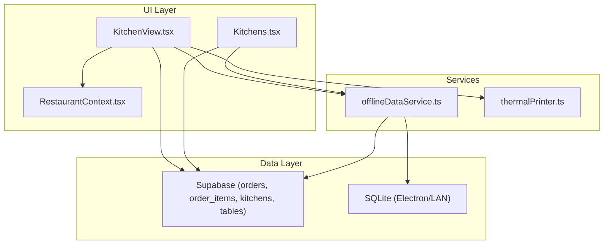
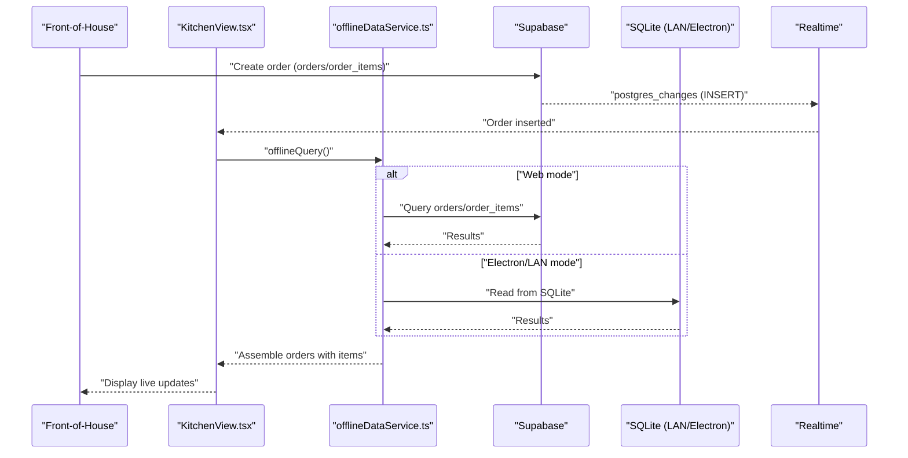
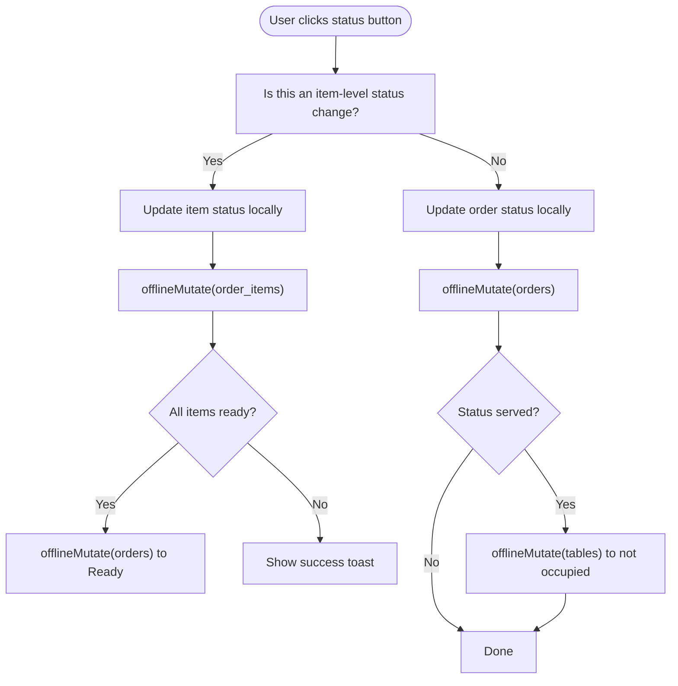
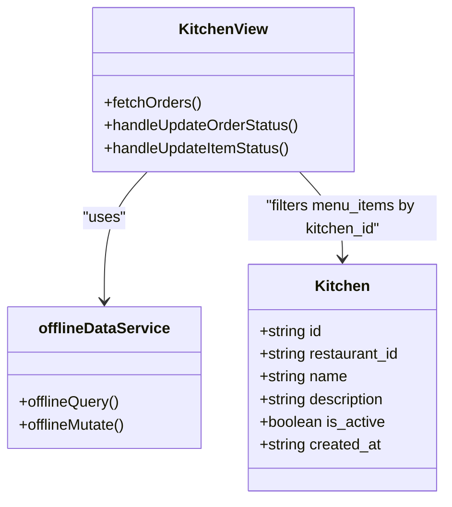
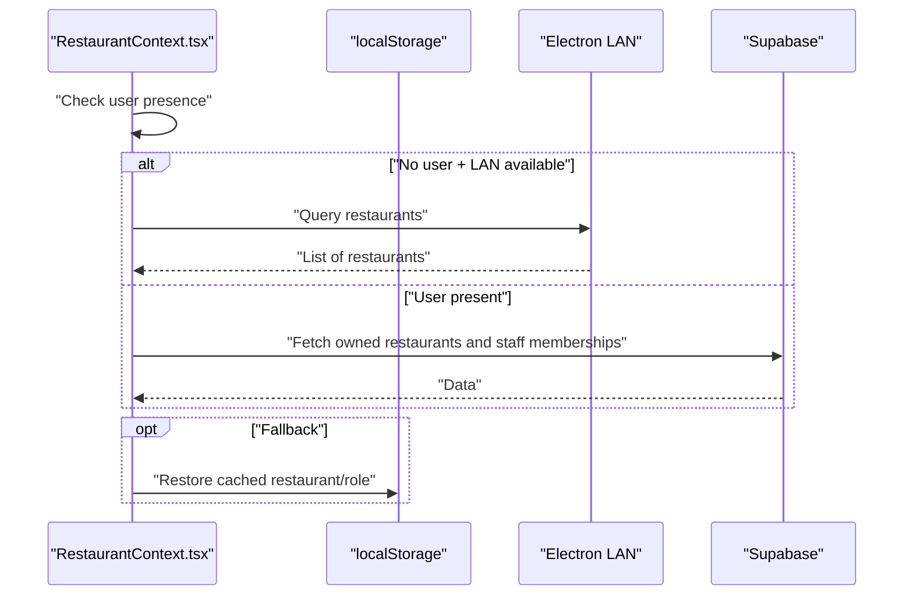
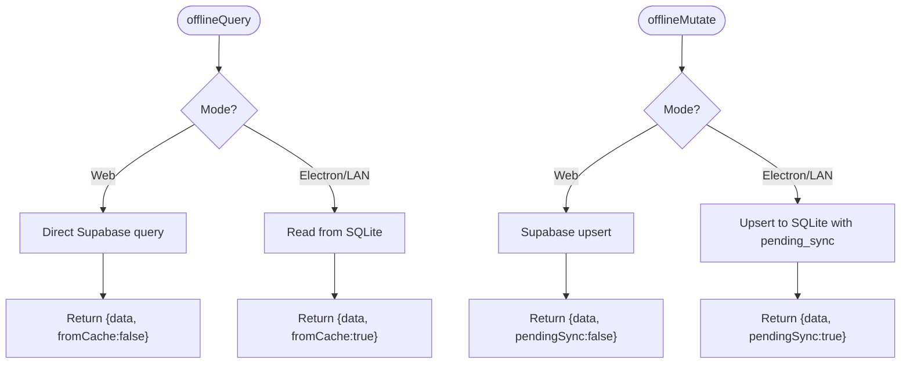
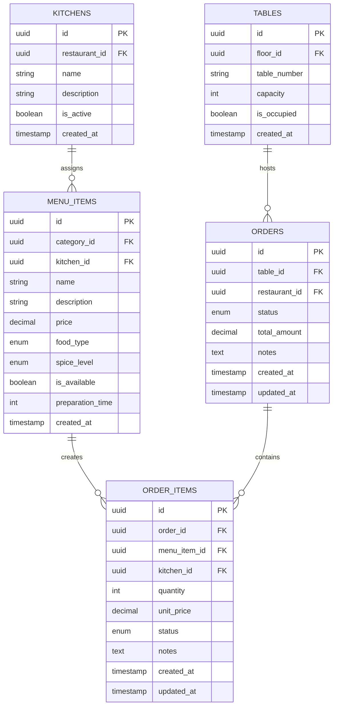
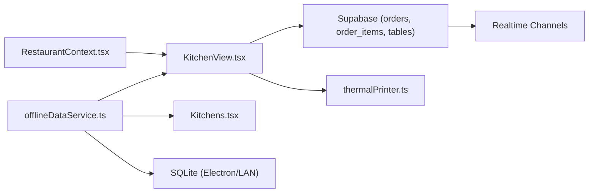

# Kitchen Coordination & Display

<cite>
**Referenced Files in This Document**
- [KitchenView.tsx](file://src/pages/dashboard/KitchenView.tsx)
- [Kitchens.tsx](file://src/pages/dashboard/Kitchens.tsx)
- [RestaurantContext.tsx](file://src/contexts/RestaurantContext.tsx)
- [offlineDataService.ts](file://src/services/offlineDataService.ts)
- [thermalPrinter.ts](file://src/services/thermalPrinter.ts)
- [20251206042902_fc2b1d91-eb8e-4750-90c3-95b7e0feb6ba.sql](file://supabase/migrations/20251206042902_fc2b1d91-eb8e-4750-90c3-95b7e0feb6ba.sql)
- [20251206081648_ef719884-b181-43d8-832a-02825f1b3a50.sql](file://supabase/migrations/20251206081648_ef719884-b181-43d8-832a-02825f1b3a50.sql)
- [20251206132719_11d13f91-c469-437f-9d98-63127362f20c.sql](file://supabase/migrations/20251206132719_11d13f91-c469-437f-9d98-63127362f20c.sql)
- [20251206133509_50399ee0-7c3e-4927-bf1a-00556ef24c8c.sql](file://supabase/migrations/20251206133509_50399ee0-7c3e-4927-bf1a-00556ef24c8c.sql)
</cite>

## Table of Contents
1. [Introduction](#introduction)
2. [Project Structure](#project-structure)
3. [Core Components](#core-components)
4. [Architecture Overview](#architecture-overview)
5. [Detailed Component Analysis](#detailed-component-analysis)
6. [Dependency Analysis](#dependency-analysis)
7. [Performance Considerations](#performance-considerations)
8. [Troubleshooting Guide](#troubleshooting-guide)
9. [Conclusion](#conclusion)

## Introduction
This document explains the kitchen coordination and display system that powers real-time order preparation workflows. It covers how the kitchen view presents live order statuses, how orders move through preparation stages, how staff coordinate tasks, and how the system integrates front-of-house orders with kitchen preparation. It also documents offline-first capabilities, real-time synchronization, and practical scenarios for order management, staff assignment, and capacity management.

## Project Structure
The kitchen system spans UI pages, context providers, offline data services, and database schemas:
- KitchenView renders the live kitchen display with three columns: Pending, Cooking, and Ready.
- Kitchens manages kitchen locations used to categorize menu items and route orders.
- RestaurantContext provides the current restaurant context and role-based access.
- offlineDataService enables offline-first queries and mutations with SQLite caching and optional LAN sync.
- Database migrations define enums, tables, relationships, and row-level security policies.

**Diagram sources**
- [KitchenView.tsx:1-785](file://src/pages/dashboard/KitchenView.tsx#L1-L785)
- [Kitchens.tsx:1-355](file://src/pages/dashboard/Kitchens.tsx#L1-L355)
- [RestaurantContext.tsx:1-391](file://src/contexts/RestaurantContext.tsx#L1-L391)
- [offlineDataService.ts:1-769](file://src/services/offlineDataService.ts#L1-L769)
- [thermalPrinter.ts:1-339](file://src/services/thermalPrinter.ts#L1-L339)

**Section sources**
- [KitchenView.tsx:1-785](file://src/pages/dashboard/KitchenView.tsx#L1-L785)
- [Kitchens.tsx:1-355](file://src/pages/dashboard/Kitchens.tsx#L1-L355)
- [RestaurantContext.tsx:1-391](file://src/contexts/RestaurantContext.tsx#L1-L391)
- [offlineDataService.ts:1-769](file://src/services/offlineDataService.ts#L1-L769)
- [thermalPrinter.ts:1-339](file://src/services/thermalPrinter.ts#L1-L339)

## Core Components
- KitchenView: Real-time kitchen display with three columns, status transitions, printing, and notifications.
- Kitchens: Manage kitchen locations and activation status.
- RestaurantContext: Provide current restaurant and role for access control.
- offlineDataService: Offline-first data access with SQLite caching and LAN/cloud sync.
- Database schema: Defines order lifecycle, item categorization, and RLS policies.

**Section sources**
- [KitchenView.tsx:1-785](file://src/pages/dashboard/KitchenView.tsx#L1-L785)
- [Kitchens.tsx:1-355](file://src/pages/dashboard/Kitchens.tsx#L1-L355)
- [RestaurantContext.tsx:1-391](file://src/contexts/RestaurantContext.tsx#L1-L391)
- [offlineDataService.ts:1-769](file://src/services/offlineDataService.ts#L1-L769)
- [20251206042902_fc2b1d91-eb8e-4750-90c3-95b7e0feb6ba.sql:1-210](file://supabase/migrations/20251206042902_fc2b1d91-eb8e-4750-90c3-95b7e0feb6ba.sql#L1-L210)

## Architecture Overview
The kitchen display system follows an offline-first architecture:
- Web mode: Direct Supabase queries and real-time subscriptions.
- Electron/LAN mode: SQLite-first reads, local writes with pending sync, and optional manual cloud sync.
- Real-time updates: Supabase realtime channels for orders and order_items.
- Kitchen routing: Menu items are associated with kitchens; order items inherit kitchen assignments.

**Diagram sources**
- [KitchenView.tsx:106-253](file://src/pages/dashboard/KitchenView.tsx#L106-L253)
- [offlineDataService.ts:151-211](file://src/services/offlineDataService.ts#L151-L211)
- [20251206042902_fc2b1d91-eb8e-4750-90c3-95b7e0feb6ba.sql:207-210](file://supabase/migrations/20251206042902_fc2b1d91-eb8e-4750-90c3-95b7e0feb6ba.sql#L207-L210)

## Detailed Component Analysis

### KitchenView: Real-Time Kitchen Display
KitchenView orchestrates the live kitchen display:
- Filters orders into Pending, Cooking, and Ready columns based on item statuses.
- Supports status transitions per item and per order.
- Plays notification sounds and shows toasts for new orders.
- Prints kitchen tickets via browser print.
- Handles offline assembly by joining cached order_items, menu_items, and tables/floors.

Key behaviors:
- Column rendering: Pending shows pending items; Cooking shows pending and cooking items; Ready shows only ready items.
- Status transitions:
  - Item: Pending → Cooking → Ready → Served.
  - Order: Moves to Ready when all items are ready; Served frees the table.
- Offline assembly: When offline, reassemble orders from SQLite using local joins for menu_items, tables, and floors.

**Diagram sources**
- [KitchenView.tsx:255-369](file://src/pages/dashboard/KitchenView.tsx#L255-L369)
- [offlineDataService.ts:220-287](file://src/services/offlineDataService.ts#L220-L287)

**Section sources**
- [KitchenView.tsx:1-785](file://src/pages/dashboard/KitchenView.tsx#L1-L785)
- [offlineDataService.ts:151-211](file://src/services/offlineDataService.ts#L151-L211)

### Kitchens: Kitchen Locations Management
Kitchens allows managing kitchen locations:
- Create, update, activate/deactivate kitchens.
- Uses offline-aware mutations for LAN/Electron modes.
- Integrates with menu items via kitchen_id for routing.

**Diagram sources**
- [Kitchens.tsx:23-29](file://src/pages/dashboard/Kitchens.tsx#L23-L29)
- [KitchenView.tsx:1-785](file://src/pages/dashboard/KitchenView.tsx#L1-L785)
- [offlineDataService.ts:151-287](file://src/services/offlineDataService.ts#L151-L287)

**Section sources**
- [Kitchens.tsx:1-355](file://src/pages/dashboard/Kitchens.tsx#L1-L355)

### RestaurantContext: Current Restaurant and Roles
RestaurantContext provides:
- Current restaurant selection and role (owner/manager/chef/waiter).
- Offline restoration from localStorage when no user is present.
- LAN client mode detection and data sourcing.

**Diagram sources**
- [RestaurantContext.tsx:47-300](file://src/contexts/RestaurantContext.tsx#L47-L300)

**Section sources**
- [RestaurantContext.tsx:1-391](file://src/contexts/RestaurantContext.tsx#L1-L391)

### Offline Data Service: SQLite-First Architecture
offlineDataService supports:
- offlineQuery: SQLite-first reads; falls back to LAN or Supabase depending on environment.
- offlineMutate: Writes to SQLite with pending_sync; preserves timestamps.
- offlineDelete: Soft deletes by marking records pending_delete.
- manualSyncToCloud: Uploads pending changes to Supabase with dependency ordering.
- Special handling for tables requiring cross-table joins (e.g., order_items via orders).

**Diagram sources**
- [offlineDataService.ts:151-287](file://src/services/offlineDataService.ts#L151-L287)

**Section sources**
- [offlineDataService.ts:1-769](file://src/services/offlineDataService.ts#L1-L769)

### Database Schema: Order Lifecycle and Routing
The schema defines:
- Enums: order_status (pending, cooking, ready, served, cancelled), food_type (veg, non_veg, egg).
- Tables: orders, order_items, kitchens, tables, menu_items.
- Relationships: order_items.menu_item_id links to menu_items; order_items.kitchen_id links to kitchens.
- Realtime: Supabase publication includes orders, order_items, tables.

**Diagram sources**
- [20251206042902_fc2b1d91-eb8e-4750-90c3-95b7e0feb6ba.sql:28-108](file://supabase/migrations/20251206042902_fc2b1d91-eb8e-4750-90c3-95b7e0feb6ba.sql#L28-L108)

**Section sources**
- [20251206042902_fc2b1d91-eb8e-4750-90c3-95b7e0feb6ba.sql:1-210](file://supabase/migrations/20251206042902_fc2b1d91-eb8e-4750-90c3-95b7e0feb6ba.sql#L1-L210)

## Dependency Analysis
- KitchenView depends on RestaurantContext for current restaurant and on offlineDataService for data access.
- KitchenView subscribes to Supabase realtime channels for orders and order_items.
- Kitchens uses offlineDataService for CRUD operations on kitchens.
- offlineDataService coordinates with Supabase and SQLite depending on runtime mode.
- Database schema enforces order lifecycle and kitchen routing via enums and foreign keys.

**Diagram sources**
- [KitchenView.tsx:1-785](file://src/pages/dashboard/KitchenView.tsx#L1-L785)
- [Kitchens.tsx:1-355](file://src/pages/dashboard/Kitchens.tsx#L1-L355)
- [offlineDataService.ts:1-769](file://src/services/offlineDataService.ts#L1-L769)
- [thermalPrinter.ts:1-339](file://src/services/thermalPrinter.ts#L1-L339)

**Section sources**
- [KitchenView.tsx:1-785](file://src/pages/dashboard/KitchenView.tsx#L1-L785)
- [Kitchens.tsx:1-355](file://src/pages/dashboard/Kitchens.tsx#L1-L355)
- [offlineDataService.ts:1-769](file://src/services/offlineDataService.ts#L1-L769)

## Performance Considerations
- Real-time updates: Subscribing to orders and order_items keeps the kitchen display fresh without polling.
- Offline assembly: When offline, KitchenView reconstructs order views from SQLite using local joins to reduce network usage.
- Batch updates: Status transitions update items and orders optimistically; failures revert UI state.
- Printing: Browser-based printing avoids external dependencies; thermal printing is available via thermalPrinter service for supported environments.

[No sources needed since this section provides general guidance]

## Troubleshooting Guide
Common issues and resolutions:
- No restaurant selected: KitchenView shows a prompt to select or create a restaurant.
- Offline mode: offlineQuery returns cached data from SQLite; ensure data is downloaded via LAN/Electron sync.
- Sync delays: In Electron/LAN mode, mutations are stored locally with pending_sync; use manual sync to upload changes.
- Real-time not updating: Verify Supabase realtime is enabled for orders and order_items; check network connectivity.
- Table not freed: When marking orders as served, KitchenView attempts to free the table; confirm the mutation succeeded.

**Section sources**
- [KitchenView.tsx:507-517](file://src/pages/dashboard/KitchenView.tsx#L507-L517)
- [offlineDataService.ts:397-541](file://src/services/offlineDataService.ts#L397-L541)
- [20251206042902_fc2b1d91-eb8e-4750-90c3-95b7e0feb6ba.sql:207-210](file://supabase/migrations/20251206042902_fc2b1d91-eb8e-4750-90c3-95b7e0feb6ba.sql#L207-L210)

## Conclusion
The kitchen coordination and display system provides a robust, real-time, and offline-capable solution for managing kitchen workflows. KitchenView presents live order preparation stages, supports item-level and order-level status transitions, and integrates with offline data services for seamless operation across environments. Kitchens management enables logical routing of menu items to appropriate kitchen areas, while RestaurantContext ensures proper access control. Together, these components deliver a practical foundation for front-of-house to kitchen coordination, staff workflows, and real-time synchronization.